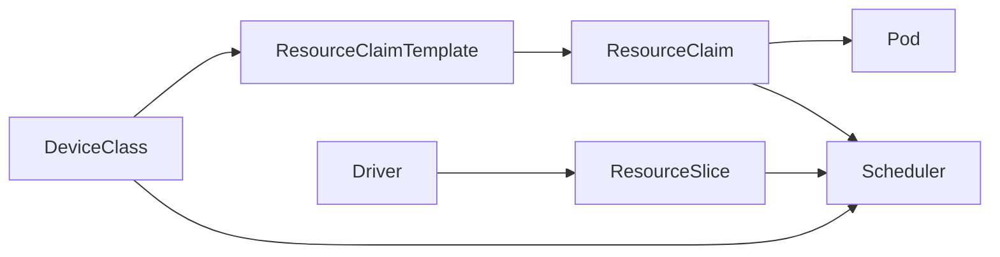
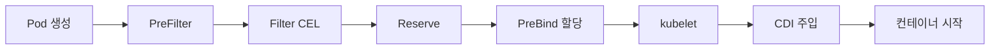

# DRA — Dynamic Resource Allocation, Structured Parameters

> **DRA**는 "GPU를 1개 달라"는 정수 카운트 모델을 벗어나, 장치의 속성·용량을
> 쿼리하고 조건에 맞는 것을 할당하는 **구조적 리소스 모델**이다. 1.34에서
> 코어가 GA(`resource.k8s.io/v1`), 1.36에서 **AdminAccess·PrioritizedList**가
> GA로 성숙하며, **Partitionable Devices·DeviceTaints**가 Beta에 진입했다.
> AI 워크로드 표준 리소스 표현이 바뀌는 순간을 다룬다.

- **Core GA 1.34** — `resource.k8s.io/v1`, Structured Parameters 기본 활성
- **1.36 Haru** — AdminAccess·PrioritizedList GA, Partitionable·DeviceTaints Beta
- **ComputeDomain** — NVLink 도메인(GB200 NVL72)의 1급 리소스
- **Extended Resource Mapping** — 기존 `nvidia.com/gpu` 워크로드 무변경 수용

선행: [Scheduler 내부](../scheduling/scheduler-internals.md),
[GPU 스케줄링](../special-workloads/gpu-scheduling.md),
[AI 워크로드 스케줄링](./ai-workload-scheduling.md).
관련: 분산 학습·추론 프레임워크 연동은 [LWS·JobSet](./lws-jobset.md).

---

## 1. DRA가 필요한 이유 — Device Plugin의 한계

Device Plugin 모델은 **정수 Extended Resource** (`nvidia.com/gpu: 1`) 하나로
장치를 표현한다. 이 가정이 깨지는 시나리오가 늘고 있다.

| 시나리오 | Device Plugin의 실패 | DRA의 해법 |
|---|---|---|
| A100-40GB와 A100-80GB 혼재 | 노드 라벨로 우회, `nodeSelector` 반복 | **CEL** 셀렉터로 `capacity.memory` 직접 필터 |
| MIG 프로파일 동적 분배 | 관리자가 노드별 사전 파티션 필요 | **Partitionable Devices**로 요청 시점 분할 |
| GB200 NVL72 NVLink 도메인 | 라벨로는 도메인 무결성 보장 불가 | **ComputeDomain** 리소스 |
| GPU + RDMA NIC 묶음 요청 | 플러그인 2개, 독립 스케줄 | 한 Claim에 device 여러 개 |
| DCGM 프로파일러 사이드카 GPU 공유 | 별도 장치로 분리해야 | **AdminAccess**로 동일 GPU 병행 |
| "H100 없으면 L40S × 2" | 표현 불가 | **PrioritizedList** |

### 1.1 Extended Resource vs DRA

| 축 | Extended Resource | DRA |
|---|---|---|
| 표현 | 정수 카운트 | 속성·용량 기반 구조 |
| 선택 수단 | 리소스명 + 노드 라벨 | DeviceClass + CEL 표현식 |
| 분할 | 정적(사전 파티션) | 동적(Partitionable) |
| 공유 | 불가(정수 점유) | AdminAccess, Consumable Capacity |
| 수명 | 파드에 귀속 | Claim 독립, 공유 가능 |
| 스케줄러 경로 | 기본 Filter | `DynamicResources` 플러그인 |
| 자동 스케일 | Cluster Autoscaler 친화 | Structured Parameters 이후 시뮬 가능 |

---

## 2. 5대 리소스 — `resource.k8s.io/v1`



| 리소스 | 소유자 | 역할 |
|---|---|---|
| **DeviceClass** | 클러스터 관리자 | 공통 selector·config 템플릿 |
| **ResourceClaimTemplate** | 앱 팀 | 파드 생성 시 Claim을 자동 생성하는 템플릿 |
| **ResourceClaim** | Pod 수명에 귀속(또는 독립) | 실제 요청 인스턴스, 할당 결과 저장 |
| **ResourceSlice** | 드라이버 | 노드별 장치 인벤토리 공시 |
| **DeviceTaintRule** | 관리자 | 장치 단위 테인트 (1.36 Beta) |

### 2.1 전형 예제

```yaml
apiVersion: resource.k8s.io/v1
kind: DeviceClass
metadata:
  name: gpu.nvidia.com
spec:
  selectors:
    - cel:
        expression: device.driver == "gpu.nvidia.com"
---
apiVersion: resource.k8s.io/v1
kind: ResourceClaimTemplate
metadata:
  name: h100-80gb
spec:
  spec:
    devices:
      requests:
        - name: gpu
          exactly:
            deviceClassName: gpu.nvidia.com
            allocationMode: ExactCount
            count: 1
            selectors:
              - cel:
                  expression: |
                    device.attributes["gpu.nvidia.com"].productName
                      .startsWith("NVIDIA H100") &&
                    device.capacity["gpu.nvidia.com"].memory
                      .compareTo(quantity("80Gi")) >= 0
---
apiVersion: v1
kind: Pod
metadata:
  name: llm-trainer
spec:
  resourceClaims:
    - name: gpu
      resourceClaimTemplateName: h100-80gb
  containers:
    - name: trainer
      image: nvcr.io/nvidia/pytorch:24.12-py3
      resources:
        claims:
          - name: gpu
```

**v1 스키마 포인트**:
- `devices.requests[].exactly` 래핑 — 옛 `v1alpha`·초기 `v1beta` 문법과 다름
- Pod `resourceClaims[]`는 `resourceClaimName` 또는 `resourceClaimTemplateName`을
  **직접 필드로** 가짐 (`source:` 중첩은 구 문법)
- Container `resources.claims[]`로 컨테이너별 가시성 제어

---

## 3. Structured Parameters — Classic DRA와의 결별

DRA의 근간이 **1.31에서 전면 재설계**됐다는 점을 먼저 이해해야 한다. 옛
블로그·튜토리얼을 그대로 따르면 실패한다.

| 모델 | 시기 | 할당 주체 | 특징 |
|---|---|---|---|
| Classic DRA | 1.26~1.30 Alpha | 드라이버별 컨트롤러 | CEL 없음, opaque 파라미터, 오토스케일 시뮬 불가 |
| **Structured Parameters** | 1.31~, **1.34 GA** | **kube-scheduler** | 드라이버는 ResourceSlice 공시만, CEL로 선택, 시뮬 가능 |

**오해**: "DRA는 별도 controller-manager가 필요하다" — Classic 잔재. 현행
모델은 **스케줄러 플러그인 하나**(`DynamicResources`)면 된다. 드라이버는
kubelet plugin + ResourceSlice 공시자 역할.

Classic DRA의 `PodSchedulingContext`·`ResourceClass` 같은 리소스는
전부 제거됐다. 이관 필요 시 1.30 → 1.31 경계에서 재작성.

### 3.1 v1beta → v1 마이그레이션 주의점

| 변경점 | 옛 문법 | v1 문법 |
|---|---|---|
| 요청 래핑 | `requests:` 직접 필드들 | `requests[].exactly:` 래핑 |
| Pod 참조 | `resourceClaims[].source.resourceClaimName` | `resourceClaims[].resourceClaimName` 직접 |
| 템플릿 참조 | `source.resourceClaimTemplateName` | `resourceClaimTemplateName` 직접 |
| API 그룹 | `resource.k8s.io/v1beta1`·`v1beta2` | **`resource.k8s.io/v1`** |

**`kubectl convert`는 DRA 리소스를 지원하지 않는다**. 매니페스트는 수작업
재작성이 원칙. GitOps 저장소에서 일괄 찾기·바꾸기 후 dry-run으로 검증.

---

## 4. CEL 셀렉터 심화

CEL(Common Expression Language) 표현식으로 장치를 필터한다.

### 4.1 표준 경로

| 경로 | 타입 | 예 |
|---|---|---|
| `device.driver` | string | `"gpu.nvidia.com"` |
| `device.attributes["<driver>"].<key>` | string·int·bool·version | `productName`, `computeCapability` |
| `device.capacity["<driver>"].<key>` | `resource.Quantity` | `memory`, `tensorCores` |

### 4.2 비교 연산

| 패턴 | 용법 |
|---|---|
| 문자열 | `.startsWith("NVIDIA H100")`, `== "A100"` |
| 용량 | `.compareTo(quantity("80Gi")) >= 0` |
| 버전 | `.isGreaterThan(semver("560.0.0"))` |
| 조합 | `&&`, `\|\|`, `!` |

### 4.3 디버깅 체크리스트

| 증상 | 1차 의심 |
|---|---|
| `no suitable device for request "X"` | CEL 미스매치, 드라이버 접두사 오타 |
| `ResourceClaim pending` 무한 | DeviceClass selector 전제 조건 미충족 |
| 스케줄러 P99 지연 | CEL 복잡도, ResourceSlice 수 × 장치 수 |

**가장 흔한 실수**: `device.attributes["gpu.nvidia.com"].productName` 대신
`device.attributes.productName`으로 접두사를 빠뜨리는 것. 속성 키는 **드라이버
네임스페이스**로 분리되어 있다.

### 4.4 실전 디버깅 팁

```bash
# 실제 공시된 속성·용량 키 확인
kubectl get resourceslices -A -o yaml | less

# 스케줄러 상세 로그 (v=4 이상)
kubectl -n kube-system logs -l component=kube-scheduler --tail=200 | \
  grep -i "DynamicResources\|no suitable"

# 특정 Claim의 할당 상태
kubectl describe resourceclaim <name>
```

CEL은 공시된 **실제 키**를 기준으로 작성해야 한다. 드라이버 문서의 키 목록과
`ResourceSlice` 실물을 대조하는 것이 가장 빠른 원인 분석.

---

## 5. 2026-04 기능 매트릭스

1.34 Core GA 이후 **운영 기능의 성숙**이 1.35·1.36에서 빠르게 진행됐다.

| 기능 | KEP | 상태 (1.36 기준) | 피처 게이트 |
|---|---|---|---|
| Core (Structured Parameters) | KEP-4381 | **GA (1.34)** | `DynamicResourceAllocation` |
| AdminAccess | - | **GA (1.36)** | `DRAAdminAccess` |
| PrioritizedList | KEP-4816 | **GA (1.36)** | `DRAPrioritizedList` |
| Partitionable Devices | KEP-4815 | **Beta (1.36)** | `DRAPartitionableDevices` |
| DeviceTaints·Tolerations | KEP-5055 | **Beta (1.36)** | `DRADeviceTaints` |
| Consumable Capacity | KEP-5075 | Alpha → Beta 진행 | `DRAConsumableCapacity` |
| Extended Resource Mapping | - | Alpha (1.34) → Beta | `DRAExtendedResource` |
| Device Binding Conditions | #5007 | Alpha (1.35) | `DRADeviceBindingConditions` |
| Resource Health (Pod Status) | KEP-4680 | **Beta (1.36)** | `ResourceHealthStatus` |

### 5.1 AdminAccess — 관측·디버깅 공유

이미 할당된 GPU에 **DCGM Exporter·Profiler**가 병행 접근해야 할 때. 네임스페이스에 `resource.k8s.io/admin-access=true` 라벨이 있어야 생성 가능.

```yaml
spec:
  devices:
    requests:
      - name: probe
        exactly:
          deviceClassName: gpu.nvidia.com
          adminAccess: true     # 기존 할당과 공유
```

### 5.2 PrioritizedList — 대체 후보

"H100 1장 우선, 없으면 L40S 2장."

```yaml
spec:
  devices:
    requests:
      - name: gpu
        firstAvailable:
          - exactly:
              deviceClassName: h100.nvidia.com
              count: 1
          - exactly:
              deviceClassName: l40s.nvidia.com
              count: 2
```

### 5.3 Partitionable Devices — MIG 동적 분할 표준

드라이버가 **겹치는 후보 파티션**을 공시하고, 스케줄러가 요청 시점에 카빙.
"전체 GPU 1장 또는 1g.10gb × 7개" 같은 상호 배타적 후보를 한 장치가 동시에
광고할 수 있다.

| 항목 | Device Plugin 방식 | DRA Partitionable |
|---|---|---|
| MIG 구성 | 관리자가 사전 설정 | 요청 시점 드라이버가 카빙 |
| 스위칭 | GPU 리셋, 파드 드레인 | Claim 경계에서 자동 |
| 혼합 프로파일 | 노드당 단일·혼합 중 택 1 | 자유 혼합 |

### 5.4 DeviceTaints — 장치 단위 격리

노드가 아니라 **장치**를 격리한다. XID 에러가 누적된 GPU 한 장만 빼놓고
노드는 계속 사용 가능.

```yaml
apiVersion: resource.k8s.io/v1beta1
kind: DeviceTaintRule
metadata:
  name: xid-79-contained
spec:
  deviceSelector:
    deviceClassName: gpu.nvidia.com
    cel:
      expression: |
        device.attributes["gpu.nvidia.com"].xid79Count > 0
  taint:
    key: gpu-fault
    value: xid-79
    effect: NoSchedule
```

### 5.5 Extended Resource Mapping — 전환 호환

기존 `limits.nvidia.com/gpu: 1` 요청을 **내부적으로 DRA로 변환**. Device
Plugin 워크로드를 수정 없이 DRA 노드에 스케줄. 전환 교량.

---

## 6. ComputeDomain — MNNVL·NVL72의 1급 표현

NVIDIA DRA Driver(`resource.nvidia.com/v1beta1`)가 제공하는 **DRA 위의 추가
리소스**. GB200 NVL72 같은 멀티노드 NVLink 도메인을 쿠버네티스가 직접 이해한다.


| 속성 | 의미 |
|---|---|
| ephemeral | 워크로드와 생명 공유 |
| 네임스페이스 경계 | IMEX 격리 경계 |
| `topologyKey` | `nvidia.com/gpu.clique` |
| elasticity | 워크로드 확장·축소에 함께 반응 |
| fault tolerance | 노드 손실 자동 복구 |

### 6.1 현재 한계 (2026-04)

| 항목 | 상태 |
|---|---|
| ComputeDomain당 노드당 파드 수 | 1개 |
| 노드당 ComputeDomain 수 | 1개 |
| 적용 대상 | GB200 NVL72·NVL576 |
| 일반 HGX 서버 | 과잉, 불필요 |

**스케줄링 관점**은 [AI 워크로드 스케줄링 §5.3](./ai-workload-scheduling.md)에서
다룬다. 이 문서는 **IMEX 도메인 수명주기** 모델에 집중.

---

## 7. 드라이버 생태계 (2026-04)

| 드라이버 | 대상 | 상태 | 저장소 |
|---|---|---|---|
| NVIDIA DRA Driver for GPUs | NVIDIA GPU + ComputeDomain | ComputeDomain 정식·GPU 플러그인 실험 | `NVIDIA/k8s-dra-driver-gpu` |
| Intel Gaudi DRA Driver | Gaudi2·3 | Alpha | `HabanaAI/gaudi-dra-driver` |
| AMD DRA Driver | Instinct MI300 | 초기 단계 | `ROCm/k8s-dra-driver-amd` |
| SR-IOV DRA | NIC VF | 1.34+ 안정화 | `k8snetworkplumbingwg/sriov-dra-driver` |
| dra-example-driver | 레퍼런스(교육용) | 샘플 | `kubernetes-sigs/dra-example-driver` |

**CNCF 기증**: NVIDIA DRA Driver는 **KubeCon EU 2026**에서 CNCF에 기증됐다.
저장소 이전·재라벨링은 진행 중이며 당분간 NVIDIA 레지스트리 경로도 병행.

---

## 8. 스케줄러 통합

### 8.1 처리 단계



| 단계 | 역할 |
|---|---|
| PreFilter | ResourceClaim·Slice 전역 조회 |
| Filter | 노드별 CEL 매칭 |
| Reserve | 후보 확정 |
| PreBind | 드라이버에 바인딩 요청 |
| kubelet | CDI 스펙으로 컨테이너 주입 |

### 8.2 1.36 개선

1.36에서 Filter 단계가 **per-node와 shared 계산을 분리**해 대규모 플릿의
스케줄 지연이 유의미하게 줄었다. 수천 장치 환경일수록 체감이 크다.

---

## 9. Device Plugin → DRA 전환 전략

### 9.1 공존 불가 경계

한 물리 GPU는 **두 경로에 동시에 광고할 수 없다**. 플러그인이 열려있는데
DRA 드라이버까지 공시하면 이중 계상된다. **노드 단위 배타 분리**가 규칙.

### 9.2 노드 서브셋 구성

```bash
# DRA 전용 노드
kubectl label node gpu-07 \
  nvidia.com/gpu.deploy.device-plugin=false \
  nvidia.com/gpu.deploy.mig-manager=false \
  nvidia.com/gpu.deploy.dra-driver=true

kubectl taint node gpu-07 gpu-mode=dra:NoSchedule
```

### 9.3 전환 허용 전제

| 전제 | 이유 |
|---|---|
| Kubernetes ≥ 1.34 | Core GA |
| CDI 활성 containerd·CRI-O | 장치 주입 표준 |
| NVIDIA 드라이버 ≥ 560 | DRA Driver 요건 |
| GPU Operator MIG Manager 비활성(해당 노드) | 동적 파티션 경합 차단 |

### 9.4 워크로드 호환

기존 `nvidia.com/gpu: 1` 매니페스트는 **Extended Resource Mapping**으로
무변경 수용. 신규 워크로드는 ResourceClaim 사용. 두 경로가 같은 노드에서
병행하는 것은 1.35·1.36에서 비로소 안정.

### 9.5 언제 전환하지 않을까

| 상황 | 판단 |
|---|---|
| 동일 세대 GPU 단일 팜 + SLA 엄격 | Extended Resource 유지 가능 |
| 1.33 이하 클러스터 | 먼저 업그레이드 |
| CDI 비활성 런타임 | 런타임 우선 교체 |
| 시니어 운영 인력 부족 | 드라이버 이슈 디버깅 비용 |

---

## 10. 운영·트러블슈팅

### 10.1 증상 → 원인

| 증상 | 1차 의심 | 진단 |
|---|---|---|
| `ResourceClaim` pending 장시간 | DeviceClass selector 충돌 | `kubectl describe resourceclaim <name>` |
| ResourceSlice 0개 | 드라이버 kubelet plugin 미등록 | `ls /var/lib/kubelet/plugins_registry/`, `kubectl get resourceslices -A` |
| 드라이버 재시작 후 Claim lost | plugin readiness race | plugin readiness 커스텀 probe, fail-open 정책 |
| `ContainerCreating` 지연 | CDI 스펙 미생성 | `ls /etc/cdi/`, `nvidia-ctk cdi list` |
| 파드 실패 후 다음 Claim 실패 | DeviceTaint 누적 | `kubectl get devicetaintrules` |
| 스케줄러 지연 급증 | CEL 복잡도 + ResourceSlice 폭증 | `scheduler_plugin_execution_duration_seconds{plugin="DynamicResources"}` |

### 10.2 필수 메트릭

| 출처 | 메트릭 | 해석 |
|---|---|---|
| apiserver | `apiserver_request_duration_seconds{resource="resourceclaims"}` | API 부하 |
| scheduler | `scheduler_plugin_execution_duration_seconds{plugin="DynamicResources"}` | CEL·Slice 처리 부담 |
| scheduler | `scheduler_pending_pods{queue="unschedulable"}` | DRA 할당 실패 파드 |
| kubelet | `kubelet_pod_resources_endpoint_requests_total` | PodResources API 사용률 |
| driver | `nvidia_dra_resourceslice_devices` | 공시 장치 수 (NVIDIA 기준) |

### 10.3 Resource Health (1.36 Beta)

`ResourceHealthStatus`가 활성이면 Pod `.status`에 각 ResourceClaim의 건강
상태가 노출된다. XID 에러·ECC Contained 같은 조건을 파드에서 직접 관측 가능.

### 10.4 PodResources API와 모니터링 에이전트

kubelet의 **PodResources gRPC 엔드포인트**
(`/var/lib/kubelet/pod-resources/`)가 DRA 할당 정보를 노출한다. DCGM
Exporter·노드 관측 에이전트는 이 API를 통해 "어떤 파드가 어떤 장치를
쓰는지" 매핑한다.

| 메서드 | 용도 |
|---|---|
| `List` | 실행 중 파드별 할당 장치 |
| `GetAllocatableResources` | 노드의 전체 할당 가능 자원 |
| `Get` | 특정 파드의 실시간 장치 상태 |

DRA 환경에서 이 API는 ResourceClaim ID·CDI 디바이스 경로까지 반환한다.
DCGM 대시보드가 파드·네임스페이스 라벨과 GPU 메트릭을 연결할 때 필수.

### 10.5 Cluster Autoscaler·Karpenter 시뮬

Structured Parameters 덕분에 Cluster Autoscaler·Karpenter는 ResourceSlice
기반으로 **배치 가능성을 시뮬**할 수 있다. 1.34+ CA는 DRA 인식이 안정화
단계, Karpenter는 NodePool·NodeClaim이 DRA를 표현하는 방향으로 업데이트
진행 중. Classic DRA에선 **불가능**했던 기능으로, 노드 자동 프로비저닝과의
통합 가치가 크다.

---

## 11. 의사결정 — 지금 도입할까

| 조건 | 판단 |
|---|---|
| k8s ≥ 1.36, 드라이버 ≥ 560, CDI 활성 | **도입 가능**, 특히 GB200 NVL72 |
| MIG 동적 분할 필요 | Partitionable Devices Beta 도입 가치 |
| 혼재 GPU 플릿 | CEL 기반 선택이 큰 생산성 |
| 멀티노드 NVLink(GB200) | ComputeDomain 외 대안 없음 |
| 단일 세대 HGX + SLA 엄격 | Extended Resource 유지도 합리적 |
| 1.33 이하, CDI 미활성 | 선결 조건부터 |

**클라우드 vs 온프레미스** 차이 없음 — 전제는 **드라이버 가용성과 CDI
런타임**뿐.

---

## 12. 흔한 오해 정리

| 오해 | 사실 |
|---|---|
| DRA는 별도 controller-manager가 필요 | Classic 잔재. 현행은 스케줄러 플러그인만 |
| 옛 `v1beta1` 샘플 그대로 써도 된다 | 1.34+에서 `v1` GA. `source:` 중첩·`exactly` 없는 문법은 구 문법 |
| DRA = GPU 전용 | NIC·FPGA·IB·Gaudi 모두. 범용 리소스 모델 |
| AdminAccess = 슈퍼유저 권한 | 네임스페이스 라벨 + RBAC 결합, 무제한 아님 |
| ComputeDomain = 단순 `topologyKey` 라벨 | 별도 CRD, IMEX 도메인 수명주기 관리 |
| MIG을 DRA로 쓰려면 Partitionable Beta 대기 | 정적 MIG는 이미 ResourceSlice로 표현됨. 동적 분할만 Beta 대기 |
| DRA 도입 즉시 Device Plugin 폐기 | **노드 단위 공존**, 같은 GPU만 배타 |

---

## 13. 핵심 요약

1. **1.34 Core GA + 1.36 운영 기능 성숙**이 도입 분기점. 2026-04는 도입
   가능 구간.
2. **Structured Parameters**가 현행 모델. Classic DRA는 제거. 옛 샘플 주의.
3. **DeviceClass + ResourceSlice + CEL**이 DRA의 3요소. 드라이버는 Slice
   공시, 스케줄러가 매칭.
4. **ComputeDomain**은 GB200 NVL72의 단독 선택지. 일반 HGX에는 과잉.
5. **Extended Resource Mapping**으로 기존 워크로드 호환성이 열렸다. 전환은
   **노드 서브셋 단위**로 점진적으로.

---

## 참고 자료

- [Kubernetes Docs — Dynamic Resource Allocation](https://kubernetes.io/docs/concepts/scheduling-eviction/dynamic-resource-allocation/) (확인: 2026-04-24)
- [Kubernetes v1.34 — DRA has graduated to GA](https://kubernetes.io/blog/2025/09/01/kubernetes-v1-34-dra-updates/) (확인: 2026-04-24)
- [Kubernetes v1.34 — DRA Consumable Capacity](https://kubernetes.io/blog/2025/09/18/kubernetes-v1-34-dra-consumable-capacity/) (확인: 2026-04-24)
- [Kubernetes v1.34 — Pods Report DRA Resource Health](https://kubernetes.io/blog/2025/09/17/kubernetes-v1-34-pods-report-dra-resource-health/) (확인: 2026-04-24)
- [Kubernetes v1.33 — New features in DRA](https://kubernetes.io/blog/2025/05/01/kubernetes-v1-33-dra-updates/) (확인: 2026-04-24)
- [Kubernetes v1.36 Release — Haru](https://kubernetes.io/blog/2026/04/22/kubernetes-v1-36-release/) (확인: 2026-04-24)
- [KEP-4381 — Structured Parameters](https://github.com/kubernetes/enhancements/tree/master/keps/sig-node/4381-dra-structured-parameters) (확인: 2026-04-24)
- [KEP-4815 — Partitionable Devices](https://github.com/kubernetes/enhancements/blob/master/keps/sig-scheduling/4815-dra-partitionable-devices/README.md) (확인: 2026-04-24)
- [KEP-4816 — Prioritized Alternatives](https://github.com/kubernetes/enhancements/issues/4816) (확인: 2026-04-24)
- [KEP-5055 — Device Taints](https://github.com/kubernetes/enhancements/issues/5055) (확인: 2026-04-24)
- [KEP-5075 — Consumable Capacity](https://github.com/kubernetes/enhancements/issues/5075) (확인: 2026-04-24)
- [NVIDIA DRA Driver for GPUs](https://github.com/NVIDIA/k8s-dra-driver-gpu) (확인: 2026-04-24)
- [NVIDIA DRA Driver — ComputeDomain Docs](https://docs.nvidia.com/datacenter/cloud-native/gpu-operator/latest/dra-cds.html) (확인: 2026-04-24)
- [NVIDIA Dev Blog — Multi-Node NVLink on Kubernetes (GB200)](https://developer.nvidia.com/blog/enabling-multi-node-nvlink-on-kubernetes-for-gb200-and-beyond/) (확인: 2026-04-24)
- [dra-example-driver (SIG Node)](https://github.com/kubernetes-sigs/dra-example-driver) (확인: 2026-04-24)
- [Container Device Interface — Spec](https://github.com/cncf-tags/container-device-interface) (확인: 2026-04-24)
