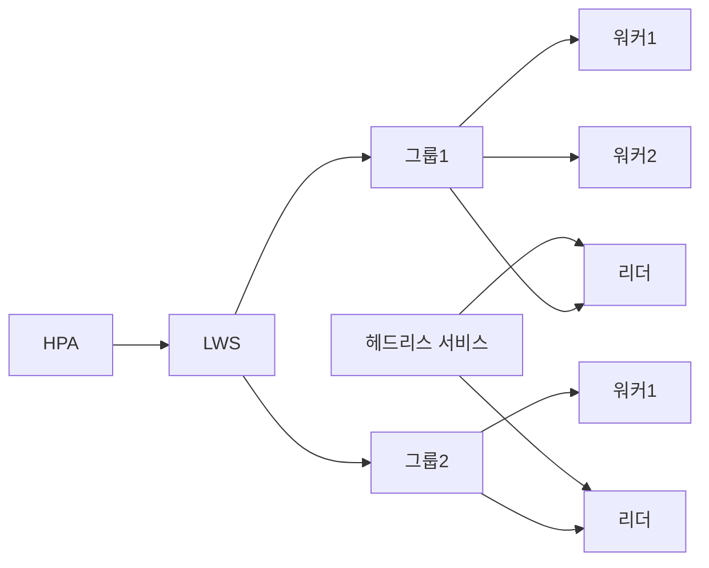

# LWS·JobSet — 멀티노드 추론과 분산 학습의 표준 리소스

> 분산 학습은 **여러 역할의 Job**을 한 단위로 묶어야 하고, 멀티노드 추론은
> **리더 1 + 워커 N-1 파드 그룹**을 원자 단위로 서빙해야 한다. 일반
> `Deployment`·`StatefulSet`·`Job`으로는 어느 쪽도 안전히 풀리지 않는다.
> **JobSet**(학습)과 **LeaderWorkerSet**(추론)은 이 간극을 채운 SIG-Apps 프로젝트다.

- **JobSet** `jobset.x-k8s.io/v1alpha2` — 분산 학습·HPC의 표준 백본
- **LWS** `leaderworkerset.x-k8s.io/v1` — 멀티노드 추론(vLLM·SGLang·TRT-LLM)
- **Kubeflow Trainer v2** — TrainJob 추상화, 내부는 JobSet
- **원자 그룹** — 파드 하나가 죽으면 그룹 전체가 재시작

선행: [Job·CronJob](../workloads/job-cronjob.md),
[배치 워크로드 — Kueue·JobSet](../special-workloads/batch-workload.md),
[AI 워크로드 스케줄링](./ai-workload-scheduling.md).
관련 리소스: [DRA](./dra.md), [GPU 스케줄링](../special-workloads/gpu-scheduling.md).

**경계**: JobSet의 **기본 사용법·Kueue 연동·SuccessPolicy·TAS 기초**는
[배치 워크로드](../special-workloads/batch-workload.md)에서 다룬다. 이
문서는 **LWS 중심 + JobSet과의 역할 차이 + 분산 학습·추론 프레임워크 연동**
에 집중한다.

---

## 1. 왜 새 리소스가 필요했는가

AI 워크로드는 기존 컨트롤러가 전제하지 않은 **그룹 원자성**을 요구한다.

| 요구 | Deployment | StatefulSet | Job | JobSet | LWS |
|---|:-:|:-:|:-:|:-:|:-:|
| 상태 독립 | ✓ | ✗ | ✓ | ✓ | ✓ |
| 파드 순서 | ✗ | ✓ | ✗ | ✓ | ✓ |
| 이질 템플릿 (리더·워커·PS) | ✗ | ✗ | ✗ | **✓** | **✓** |
| 그룹 원자 재시작 | ✗ | ✗ | ✗ | rules 기반 | **기본값** |
| 완료 모델 | ✗ | ✗ | ✓ | **✓** | ✗(서빙) |
| 헤드리스 DNS 자동 | ✗ | ✓ | ✗ | ✓ | **✓** |
| 토폴로지 도메인 고정 | ✗ | ✗ | ✗ | 어노테이션 | 어노테이션 |
| 그룹 단위 스케일 | replicas | replicas | 고정 | 고정 | **replicas**(size 고정) |
| 롤아웃 | ✓ | 순서 | 없음 | 재실행 | **그룹 단위** |
| Kueue 승인 | ✗ | ✗ | ✓ | ✓ | ✓ |

**결론**:
- **분산 학습**은 여러 역할의 Job을 한 단위로 묶은 **JobSet**
- **멀티노드 추론**은 서빙 수명 그룹을 원자로 다루는 **LWS**

---

## 2. 프로젝트 스냅샷 (2026-04)

| 항목 | LWS | JobSet |
|---|---|---|
| 저장소 | `kubernetes-sigs/lws` | `kubernetes-sigs/jobset` |
| API | `leaderworkerset.x-k8s.io/v1` | `jobset.x-k8s.io/v1alpha2` |
| 최신 | v0.8.0 (2026-01) | v0.11.1 (2026-03) |
| SIG | Apps + Scheduling + WG Serving | Apps + WG Batch |
| 포지션 | 멀티노드 서빙 표준 | 분산 학습·HPC 표준 |
| 대표 채택 | vLLM, SGLang, TRT-LLM, NVIDIA NIM, Dynamo, llm-d, OME, Kubeflow Trainer | Kubeflow Trainer v2 내부, MPI Operator, Kueue |

**핵심 사실**: Kubeflow Trainer v2.2(2026-03)는 사용자 CRD(`TrainJob`)
아래에서 **JobSet을 내부 백본으로 사용**한다. 이전의 `PyTorchJob`·`MPIJob`·
`TFJob`은 Trainer v2에서 TrainJob으로 통합되고, 실제 파드 그룹 생성은 JobSet
컨트롤러가 담당한다.

---

## 3. LeaderWorkerSet — 멀티노드 추론의 원자 그룹

### 3.1 구조



**핵심 개념**:

| 개념 | 의미 |
|---|---|
| `replicas` | 그룹 수 (HPA 대상) |
| `size` | 한 그룹의 파드 수 (리더 1 + 워커 size-1). **모델 병렬화 차원 = 고정** |
| 리더 템플릿 | 외부 요청 수신·라우팅, API 서버 노출 |
| 워커 템플릿 | 병렬 연산만, 리더에 rendezvous |
| Exclusive Topology | 한 토폴로지 도메인(랙·존)에 한 그룹 |
| 자동 주입 env | `LWS_LEADER_ADDRESS`, `LWS_GROUP_SIZE`, `LWS_WORKER_INDEX`, `LWS_NAME` |
| 원자 재시작 | `RecreateGroupOnPodRestart`(기본) |

### 3.2 주요 필드

```yaml
apiVersion: leaderworkerset.x-k8s.io/v1
kind: LeaderWorkerSet
metadata:
  name: vllm
spec:
  replicas: 2                     # 서빙 인스턴스 수
  startupPolicy: LeaderReady      # 리더 ready 뒤 워커 시작
  rolloutStrategy:
    type: RollingUpdate
    rollingUpdateConfiguration:
      maxUnavailable: 0
      maxSurge: 1                 # 새 그룹 먼저 warm-up 후 교체
  networkConfig:
    subdomainPolicy: Shared       # 헤드리스 서비스 자동
  leaderWorkerTemplate:
    size: 2                       # 그룹당 파드 2개
    restartPolicy: RecreateGroupOnPodRestart
    leaderTemplate:
      spec:
        containers:
          - name: leader
            image: vllm/vllm-openai:v0.8.5
            ports: [{ containerPort: 8080 }]
            resources:
              limits:
                nvidia.com/gpu: 8
    workerTemplate:
      spec:
        containers:
          - name: worker
            image: vllm/vllm-openai:v0.8.5
            resources:
              limits:
                nvidia.com/gpu: 8
```

### 3.3 Exclusive Topology

```yaml
metadata:
  annotations:
    leaderworkerset.sigs.k8s.io/exclusive-topology: topology.kubernetes.io/zone
```

한 그룹의 파드들이 **같은 존**에 몰리되, 다른 그룹과 겹치지 않는다. 같은 존
NVLink·RDMA 패브릭 안에서 통신을 유지하면서 장애 격리(blast radius)도 확보.

### 3.4 SubGroupPolicy — TP·PP 2축 구조

`subGroupPolicy`(v0.6+)는 한 그룹을 내부적으로 **작은 서브그룹들**로 쪼갠다.
전형: TP(Tensor Parallel)는 노드 내부에서 NVLink, PP(Pipeline Parallel)는
노드 간 RDMA. 서브그룹 단위로 토폴로지·rendezvous를 분리할 수 있다.

| 전략 | 용도 |
|---|---|
| `LeaderWorker` | 리더 1 + 워커 N-1 (기본) |
| `LeaderExcluded` | 리더를 서브그룹에서 제외 (TP 서브그룹이 워커 전용일 때) |

---

## 4. 멀티노드 추론 — vLLM 예제

replicas=2 × size=2 × 노드당 GPU 8장 → **TP=8, PP=2** 구성. 리더가 Ray
head·API 서버, 워커가 Ray worker. (아래 이미지 태그는 예시이며 실제 배포
시 공식 릴리스 노트의 최신 안정 버전을 확인할 것.)

```yaml
apiVersion: leaderworkerset.x-k8s.io/v1
kind: LeaderWorkerSet
metadata:
  name: vllm
spec:
  replicas: 2
  startupPolicy: LeaderReady
  leaderWorkerTemplate:
    size: 2
    restartPolicy: RecreateGroupOnPodRestart
    leaderTemplate:
      spec:
        containers:
          - name: vllm-leader
            image: vllm/vllm-openai:v0.8.5
            command: ["sh","-c"]
            args:
              - |
                bash /vllm-workspace/examples/online_serving/multi-node-serving.sh \
                  leader --ray_cluster_size=$(LWS_GROUP_SIZE);
                python3 -m vllm.entrypoints.openai.api_server --port 8080 \
                  --model meta-llama/Llama-3.1-405B-Instruct \
                  --tensor-parallel-size 8 \
                  --pipeline_parallel_size 2
            resources:
              limits:
                nvidia.com/gpu: 8
                memory: 1124Gi
            ports:
              - containerPort: 8080
    workerTemplate:
      spec:
        containers:
          - name: vllm-worker
            image: vllm/vllm-openai:v0.8.5
            command: ["sh","-c"]
            args:
              - |
                bash /vllm-workspace/examples/online_serving/multi-node-serving.sh \
                  worker --ray_address=$(LWS_LEADER_ADDRESS)
            resources:
              limits:
                nvidia.com/gpu: 8
                memory: 1124Gi
```

| 프레임워크 | 배치 패턴 | 특이점 |
|---|---|---|
| **vLLM** | Ray head/worker + OpenAI API | `--tensor-parallel-size`, `--pipeline-parallel-size` |
| **SGLang** | `--tp`·`--dp-size` 플래그 | vLLM과 거의 동일, Ray 선택 가능 |
| **TRT-LLM + Triton** | `engine-build` initContainer + MPI launcher | 빌드 산출물 PVC 필요 |
| **NVIDIA NIM** | 공식적으로 LWS를 **권장 배포 방식** | NIM 이미지가 LWS 환경 변수 직접 사용 |

**Ray 없이**: vLLM 0.8+는 `--distributed-executor-backend=mp`(멀티프로세스)
또는 torchrun으로도 멀티노드 가능. 다만 **PP까지 필요하면 Ray가 여전히
사실상 표준**.

---

## 5. LWS × HPA — size는 고정, replicas만 스케일

**원칙**: `size`는 **모델의 병렬화 차원(TP×PP)**이다. 런타임 변경 불가.
HPA는 `replicas`만 조정한다. 그룹 내부를 늘리려 하면 모델 리로드가 발생해
서비스가 붕괴한다.

```yaml
apiVersion: autoscaling/v2
kind: HorizontalPodAutoscaler
spec:
  scaleTargetRef:
    apiVersion: leaderworkerset.x-k8s.io/v1
    kind: LeaderWorkerSet
    name: vllm
  minReplicas: 1
  maxReplicas: 8
  metrics:
    - type: External
      external:
        metric:
          name: vllm_num_requests_waiting
        target:
          type: AverageValue
          averageValue: "4"
```

LWS는 v0.7+에서 `/scale` subresource를 노출해 HPA·KEDA 모두 네이티브
대응. **KV 캐시 사용률·pending queue·TTFT** 같은 추론 시그널을 KEDA
Prometheus ScaledObject로 물리면 AI 친화적 오토스케일링이 완성된다.

**InferencePool과의 관계**: Gateway API Inference Extension의 InferencePool은
**트래픽 라우팅**, LWS는 **파드 그룹**이다. 둘은 보완 — 같은 레이블 선택자로
연결하면, LWS가 만든 리더 파드 중 최적 레플리카를 InferencePool EPP가
선택한다.

---

## 6. JobSet — 분산 학습의 1급 리소스

JobSet 기초는 [배치 워크로드](../special-workloads/batch-workload.md)에서
다뤘다. 여기서는 **분산 학습의 관점**과 v0.11에서 새로 정착한 기능을 정리.

### 6.1 전형 구조

```yaml
apiVersion: jobset.x-k8s.io/v1alpha2
kind: JobSet
metadata:
  name: llama-pretrain
  annotations:
    alpha.jobset.sigs.k8s.io/exclusive-topology: topology.kubernetes.io/zone
spec:
  startupPolicy:
    startupPolicyOrder: InOrder         # coordinator 먼저
  successPolicy:
    operator: All
    targetReplicatedJobs: [worker]
  failurePolicy:
    maxRestarts: 3
    rules:
      - action: RestartJobSet
        onJobFailureReasons: [PodFailurePolicy]
        onJobFailureMessagePatterns: [".*NCCL timeout.*"]
      - action: FailJobSet
        onJobFailureMessagePatterns: [".*CUDA out of memory.*"]
  network:
    enableDNSHostnames: true
    subdomain: train
  replicatedJobs:
    - name: coordinator
      replicas: 1
      template:
        spec:
          parallelism: 1
          completions: 1
          template:
            spec:
              containers:
                - name: torchrun
                  image: pytorch/pytorch:2.5.1-cuda12.4-cudnn9-runtime
    - name: worker
      replicas: 1
      template:
        spec:
          parallelism: 8
          completions: 8
          completionMode: Indexed
          backoffLimit: 0
          template:
            spec:
              containers:
                - name: torchrun
                  image: pytorch/pytorch:2.5.1-cuda12.4-cudnn9-runtime
                  resources:
                    limits:
                      nvidia.com/gpu: 8
```

### 6.2 v0.11 신규 기능

| 기능 | 의미 |
|---|---|
| **VolumeClaimPolicies** (KEP-572) | 체크포인트 PVC의 JobSet 수명 연동 (`Retain`·`Delete`) |
| **InPlaceRestart** (alpha, KEP-467) | 컨테이너 in-place 재시작, NCCL·Ray 세션 유지 |
| **FailurePolicy rules** | 에러 메시지 패턴·원인 코드로 재시작·실패 분기 |
| **PDB 자동 생성** | 롤링·드레인 중 Gang 무결성 보호 |

### 6.3 Kubeflow Trainer v2와의 관계

Trainer v2(2026-03)는 사용자에게 `TrainJob` CRD 하나만 노출한다. 내부에서
프레임워크별 Runtime(Torch·JAX·MPI·Flux)을 선택해 **JobSet 매니페스트로
전개**한다. 기존 `PyTorchJob`·`MPIJob`·`TFJob` 운영 자산은 하위호환 모드를
통해 점진적으로 이관 가능.

**판단**: 자체 템플릿을 관리할 수 있으면 JobSet 직접 사용, 프레임워크
다양성과 재현성이 우선이면 Trainer v2.

---

## 7. LWS vs JobSet — 역할·설계 비교

| 축 | **LWS** | **JobSet** |
|---|---|---|
| 수명 | 영구 (서빙) | 완료·실패 |
| 확장 축 | replicas (size 고정) | 없음 (Job 병렬도 고정) |
| 완료 정의 | 없음 | `successPolicy` |
| 이질 파드 | 리더·워커 2 템플릿 | ReplicatedJob N개 |
| 재시작 모델 | 그룹 원자 | rules 기반 분기 |
| 롤아웃 | `RollingUpdate` (그룹 단위) | 없음, 재실행 |
| 대표 워크로드 | vLLM·SGLang·TRT-LLM 추론 | torchrun·MPI·Ray Train 학습 |
| Kueue 연동 | native (v0.8 scale subresource) | native (1급 시민) |

**한 클러스터 공존 패턴**: 같은 노드풀에서 낮에는 LWS(추론), 밤에는 JobSet
(학습)을 돌린다. Kueue Cohort로 쿼터 공유, Priority로 낮 시간 추론 우선.
Volcano·KAI 스케줄러를 쓴다면 PodGroup·Podgrouper가 두 리소스 모두를
Gang 단위로 인식.

---

## 8. 의사결정 매트릭스

| 상황 | 추천 |
|---|---|
| 단일 GPU 추론 | **Deployment** + HPA |
| 상태 유지 DB·큐 | **StatefulSet** |
| 일회성 배치 학습 | 기본 `Job` |
| 다수 Indexed 단일 역할 학습 | `Job` Indexed + `backoffLimitPerIndex` |
| 다역할 분산 학습(리더·워커·PS) | **JobSet** 직접 또는 **Trainer v2** |
| MPI 기반 HPC·전통 과학계산 | JobSet + MPI Operator (Trainer v2의 MPI Runtime) |
| 멀티노드 LLM 추론(TP+PP) | **LWS** |
| 멀티노드 학습 + 체크포인트 복원 추론 | JobSet(학습) + LWS(추론) 분리 |
| Ray Serve 커스텀 라우팅·오토스케일 | **KubeRay RayService** (또는 LWS + Ray head) |
| Kueue 공정 스케줄·GPU 쿼터 | JobSet·LWS 모두 native |

### 8.1 Ray·KubeRay vs LWS

| 축 | KubeRay RayService | LWS(+ Ray head) |
|---|---|---|
| 관리 주체 | Ray Autoscaler | Kubernetes 컨트롤러 |
| Ray 기능 | 전면 활용 (Actor·Serve·Autoscaler) | Ray를 컨테이너로 띄울 뿐 |
| K8s-native 원자 그룹 | 부분적 | **완전** |
| 외부 통합 | Ray 대시보드·Autoscaler | K8s HPA·KEDA·InferencePool |
| 운영자 친숙도 | Ray 지식 필요 | kubectl만으로도 운영 가능 |

많은 팀이 **LWS 안에서 Ray를 띄우는 하이브리드**를 택한다. K8s 수준의
원자 그룹·롤아웃을 LWS가, Ray 내부 세밀 기능은 Ray가 담당.

---

## 9. 운영 이슈

| 이슈 | 원인 | 대응 |
|---|---|---|
| 리더 ready 전 워커가 rendezvous 실패 | 기본 `LeaderCreated` | `startupPolicy: LeaderReady` |
| 파드 1개 OOM → 그룹 전체 불일치 | 기본 `RecreateGroupOnPodRestart` | 의도된 동작. `PodDisruptionBudget`으로 재시작 예산 |
| 405B 모델 수 분 로드 → 롤아웃 중 SLO 위반 | `maxUnavailable: 1`로 구그룹부터 제거 | `maxSurge > 0`으로 새 그룹 warm-up 후 교체 |
| Exclusive Topology에서 drain 불가 | 1 그룹 = 1 도메인 | 도메인 수 ≥ `maxReplicas + maxSurge` |
| DNS 전파 지연 | CoreDNS 캐시 | `publishNotReadyAddresses: true`, 별도 readiness probe |
| JobSet 재시작 시 체크포인트 유실 | PVC 정책 미설정 | v0.11 `VolumeClaimPolicies.WhenJobSetFinishes: Retain` |
| NCCL timeout 후 JobSet 실패 | 기본 failurePolicy | `rules`로 메시지 패턴 매칭, `RestartJobSet` |
| LWS 업데이트 시 모든 그룹이 동시에 죽음 | `rolloutStrategy` 미설정 | `RollingUpdate` + `maxUnavailable: 0` |

### 9.1 volumeClaimTemplates — 그룹별 PVC

LWS v0.6+는 StatefulSet 스타일 `volumeClaimTemplates`를 지원한다. 모델
가중치(수십~수백 GB), KV 캐시 스냅샷, 세션 체크포인트를 그룹별 PVC에
바인딩한다.

```yaml
spec:
  leaderWorkerTemplate:
    leaderTemplate: { ... }
    workerTemplate: { ... }
  volumeClaimTemplates:
    - metadata:
        name: model-weights
      spec:
        accessModes: [ReadWriteOnce]
        storageClassName: rook-ceph-block
        resources:
          requests:
            storage: 800Gi
```

온프레미스에서는 **Rook-Ceph NVMe 풀**을 모델 로드 전용으로, 학습
체크포인트는 별도 풀로 분리하면 서빙 로드와 학습 체크포인트 I/O 경합을
줄일 수 있다.

### 9.2 NetworkPolicy — east-west 허용

멀티노드 추론·학습은 리더-워커 간 **rendezvous 포트**를 엽니다. 기본
`default deny` NetworkPolicy 환경에서 누락되면 그룹 시작이 실패한다.

| 프레임워크 | 포트·용도 |
|---|---|
| Ray | 6379 (GCS), 10001 (client), 8265 (dashboard) |
| NCCL | 동적 범위, `NCCL_SOCKET_IFNAME`로 제한 |
| torchrun | `--master_port` (기본 29500 전후) |
| MPI | SSH 22 + MPI 런처 포트 |

NetworkPolicy에서 같은 LWS·JobSet 레이블 셀렉터로 **동일 그룹 내부 허용**,
외부는 Gateway·InferencePool·모니터링만 허용하는 구성이 표준.

### 9.3 MultiKueue — 다중 클러스터 학습

Kueue **MultiKueue**는 워커 클러스터에 JobSet/LWS를 위임 실행할 수 있다.
v0.11에서 JobSet 지원이 안정화 단계. GPU 플릿을 여러 클러스터로 나눈
환경에서 중앙 관리자 클러스터가 승인·라우팅을 담당.

### 9.4 Graceful Shutdown

LWS 서빙 파드는 **모델 언로드·CUDA 컨텍스트 해제**에 충분한 시간이 필요하다.

```yaml
spec:
  leaderWorkerTemplate:
    leaderTemplate:
      spec:
        terminationGracePeriodSeconds: 600     # 10분
        containers:
          - name: vllm-leader
            lifecycle:
              preStop:
                exec:
                  command: ["sh","-c","python -m vllm.entrypoints.drain"]
```

그룹 전체가 동시에 교체되면 추론이 끊기므로 `maxSurge > 0`과 함께 반드시
상위 InferencePool·Gateway에서 **드레인 연동**을 구성한다.

---

## 10. 흔한 오해 정리

| 오해 | 사실 |
|---|---|
| LWS는 StatefulSet의 래퍼 | 그룹 원자 재시작·이질 템플릿·scale subresource가 본질 |
| HPA로 `size`도 바꿀 수 있다 | 불가. `size`는 모델 병렬화 차원, 리로드 필요 |
| JobSet이 LWS 상위 호환 | 역할 다름. JobSet은 완료 모델, LWS는 서빙 모델 |
| Trainer v2가 JobSet을 대체 | Trainer v2는 JobSet을 **내부 사용**하는 추상화 |
| Exclusive Topology는 성능 전용 | 성능 + **blast radius 격리**. 그룹 장애가 옆 그룹에 안 번짐 |
| v0.8에서 API가 v1이면 GA | API 표면은 v1, SubGroupPolicy·InPlaceRestart 등 기능은 여전히 alpha·beta |
| PyTorchJob·MPIJob은 deprecated | Trainer v2에서 TrainJob으로 통합, 하위호환 모드 지원. 신규는 TrainJob 권장 |

---

## 11. 핵심 요약

1. **분산 학습 → JobSet, 멀티노드 추론 → LWS**. 역할이 다르다.
2. **LWS의 핵심은 그룹 원자성** — 파드 하나가 죽으면 그룹 전체 재시작.
   NCCL·Ray 클러스터 무결성을 K8s가 보장.
3. **`size`는 모델 병렬화 차원, 변경 불가**. HPA는 오직 `replicas`만.
4. **Kubeflow Trainer v2는 JobSet 위의 추상화**. `PyTorchJob`·`MPIJob`은
   TrainJob으로 통합 중.
5. **InferencePool + LWS + Kueue**가 온프레미스 LLM 플랫폼의 현대 표준 스택.

---

## 참고 자료

- [LeaderWorkerSet — GitHub](https://github.com/kubernetes-sigs/lws) (확인: 2026-04-24)
- [LeaderWorkerSet Docs](https://lws.sigs.k8s.io/docs/) (확인: 2026-04-24)
- [LWS vLLM 예제](https://lws.sigs.k8s.io/docs/examples/vllm/) (확인: 2026-04-24)
- [LWS Adoption List](https://lws.sigs.k8s.io/docs/adoption/) (확인: 2026-04-24)
- [JobSet Releases](https://github.com/kubernetes-sigs/jobset/releases) (확인: 2026-04-24)
- [JobSet Docs — Overview](https://jobset.sigs.k8s.io/docs/overview/) (확인: 2026-04-24)
- [JobSet Success and Failure Policies](https://jobset.sigs.k8s.io/docs/concepts/success-failure-policies/) (확인: 2026-04-24)
- [vLLM Docs — LWS Deployment](https://docs.vllm.ai/en/stable/deployment/frameworks/lws/) (확인: 2026-04-24)
- [Kubeflow Trainer v2.2 Release Blog](https://blog.kubeflow.org/kubeflow-trainer-v2.2-release/) (확인: 2026-04-24)
- [Kubeflow Trainer Overview](https://www.kubeflow.org/docs/components/trainer/overview/) (확인: 2026-04-24)
- [PyTorch on Kubernetes — Kubeflow Trainer joins PyTorch Ecosystem](https://pytorch.org/blog/pytorch-on-kubernetes-kubeflow-trainer-joins-the-pytorch-ecosystem/) (확인: 2026-04-24)
- [Kueue — Run TrainJobs](https://kueue.sigs.k8s.io/docs/tasks/run/trainjobs/) (확인: 2026-04-24)
- [NVIDIA Dev Blog — Disaggregated LLM Inference on Kubernetes](https://developer.nvidia.com/blog/deploying-disaggregated-llm-inference-workloads-on-kubernetes/) (확인: 2026-04-24)
- [SGLang Docs — Deployment](https://docs.sglang.ai/backend/deploy.html) (확인: 2026-04-24)
