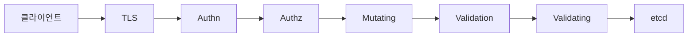
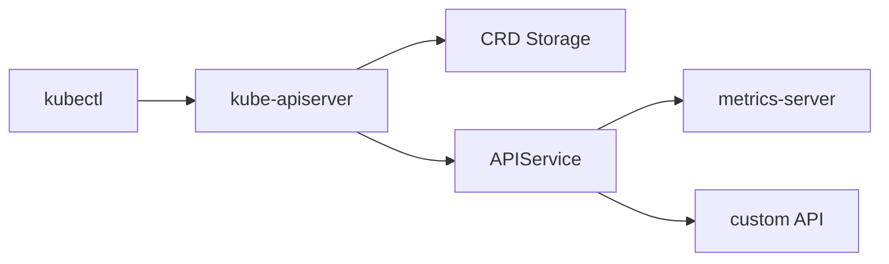
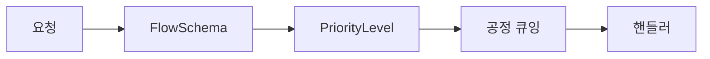
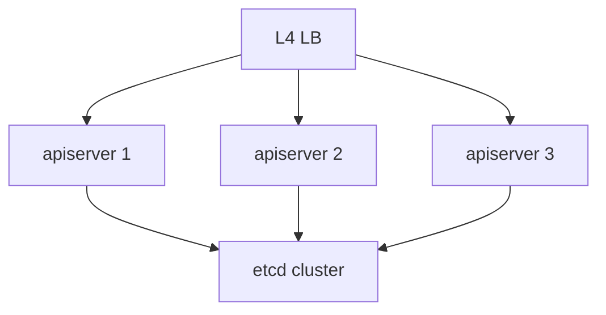

# API Server

`kube-apiserver`는 Kubernetes의 **유일한 진입점**이자 상태의 정식 인터페이스다.
사용자·컨트롤러·kubelet·외부 시스템 모두 이곳을 통해 etcd에 접근한다.

이 글은 요청 파이프라인, API 모델, watch/informer,
API Priority and Fairness, Admission 파이프라인 현대화, 그리고 프로덕션
운영 관점까지 다룬다.

> 전체 클러스터 구조: [K8s 개요](./k8s-overview.md)
> etcd 일관성·백업: [etcd](./etcd.md)

---

## 1. 역할과 위치

API Server가 맡는 것:

- **인증·인가·Admission** — 모든 요청의 게이트
- **스키마 검증** — OpenAPI, CRD conversion
- **etcd I/O** — 외부에서 etcd 직접 접근 금지
- **watch 캐시** — 컨트롤러·kubelet이 구독하는 이벤트 스트림
- **API 집계** — CRD 및 Aggregated API Server 연동
- **APF 큐잉** — 공정 분배와 과부하 보호

수평 확장되는 **유일한** 컨트롤 플레인 컴포넌트.
상태는 전부 etcd·캐시에 있어 **stateless**처럼 동작한다.

---

## 2. 요청 처리 파이프라인



| 단계 | 내용 |
|---|---|
| TLS 종단 | 서버·클라이언트 인증서 검증 |
| 인증(Authn) | x509·SA 토큰·OIDC·Webhook. 결과는 `user/groups` |
| 인가(Authz) | RBAC·ABAC·Node·Webhook 체인. 하나만 허용해도 통과 |
| APF 큐잉 | FlowSchema로 분류, PriorityLevel 큐에 배치 |
| Mutating Admission | 내장 mutating plugin + Webhook + **MutatingAdmissionPolicy(CEL, 1.36 GA)** |
| Schema Validation | OpenAPI, CRD 스키마, CEL 필드 검증 |
| Validating Admission | 내장 validating plugin + Webhook + ValidatingAdmissionPolicy(CEL) |
| etcd 기록 | resourceVersion 갱신, watch 이벤트 발행 |

**중요**: 이 순서는 **고정**이다. Mutating이 Validation보다 **먼저** 나오는
이유는 변경된 최종 객체가 스키마·정책을 만족해야 하기 때문이다.
**내장 admission plugin**(NamespaceLifecycle·LimitRanger·ResourceQuota·
PodSecurity 등)은 각 단계에 섞여 실행되며, Webhook/Policy보다 먼저 또는
뒤에 위치해 항상 on 상태다.

### Dry-run과 Server-side Apply

| 기능 | 동작 |
|---|---|
| `--dry-run=server` | 파이프라인을 전부 태우되 etcd 쓰기만 생략 |
| Server-side Apply | 필드 소유권을 **managedFields**로 추적해 경합 방지 |

CI·GitOps 도구는 대부분 Server-side Apply 기반으로 전환 중이다.

---

## 3. API 모델 — 그룹, 버전, 리소스

URL 규칙: `/apis/{group}/{version}/namespaces/{ns}/{resource}[/{name}]`

| 구분 | 예시 |
|---|---|
| core (legacy) | `/api/v1/pods` |
| named group | `/apis/apps/v1/deployments` |
| CRD | `/apis/cert-manager.io/v1/certificates` |
| 집계 API | `/apis/metrics.k8s.io/v1beta1/pods` |

### API 버전 단계와 deprecation 정책

| 단계 | 표기 | 안정성 |
|---|---|---|
| Alpha | `v1alpha1` | 기본 비활성, 언제든 변경·제거 |
| Beta | `v1beta1` | 테스트 권장, 다음 릴리스에서 변경 가능 |
| Stable | `v1` | 최소 **12개월 + 2 릴리스** 호환 보장 |

Kubernetes는 **최소 1년 deprecation 공지** 뒤 제거한다.
kubectl `deprecated` 경고는 그 1년 알림의 실현이다.

### 짧은 문자열 vs 전체 선언

단순 포맷 검증은 OpenAPI로 충분하지만,
"A는 B가 있을 때만 필수" 같은 **조건부 제약**은 CEL로 표현한다.
CRD의 `x-kubernetes-validations`에서 CEL을 사용할 수 있다.

---

## 4. API Aggregation Layer

CRD로 부족한 경우(외부 데이터·동적 리스트 등), **별도 API Server**를
붙여 `kube-apiserver`가 요청을 위임한다. `APIService` 오브젝트가 라우팅을 정의한다.



| 방식 | 저장 | 확장성 | 예시 |
|---|---|---|---|
| CRD | kube-apiserver가 **etcd에 저장** | 일반 리소스 수준 | cert-manager, ArgoCD |
| Aggregation | **별도 백엔드** 자유 (DB, in-memory) | 리스트 동적 계산 가능 | metrics-server, kube-aggregator 기반 확장 |

**선택 기준**: 대부분 CRD로 충분하다.
Aggregation은 list를 매번 동적으로 계산해야 하거나(metrics),
etcd가 아닌 저장소를 쓸 이유가 있을 때만.

**운영 함정**: Aggregated API Server가 죽으면 해당 APIGroup의
discovery가 실패해 **`kubectl get` 전반이 지연**된다(대표 사례:
metrics-server 장애 시 `kubectl top`·`kubectl get`이 수 초씩 멈춤).
`APIService`의 `Available` condition을 알람에 반드시 포함한다.

---

## 5. Watch와 Informer

### watch 메커니즘

- 클라이언트가 `?watch=true&resourceVersion=<RV>` 전달
- HTTP 스트림으로 `ADDED`·`MODIFIED`·`DELETED`·`BOOKMARK` 이벤트 수신
- RV는 etcd revision에 매핑되는 **단조 증가** 값

### watch cache

kube-apiserver는 리소스별로 **메모리 링버퍼**(기본 ~1000개) 유지.
- list·watch 다수 요청을 etcd에 보내지 않고 캐시로 응답
- 재시작 후 가장 오래된 RV보다 과거 요청은 `TOO_OLD_RESOURCE_VERSION` 반환
- 이때 informer는 재-List → 재-Watch로 재동기화

### Informer 패턴 (client-go)

컨트롤러의 표준 라이브러리. 내부적으로 **List → Watch → Store → Queue** 구성.

- **Shared Informer**로 동일 리소스의 중복 watch 방지
- **DeltaFIFO + Indexer**로 로컬 캐시 유지
- 컨트롤러는 **workqueue**에서 키만 꺼내 재동기화

### List 스트리밍과 일관성

| 기능 | 상태 | 효과 |
|---|---|---|
| **WatchList** (server) | 1.32 beta, default on. kube-controller-manager 기본 활성 | informer 초기화 시 list 대신 watch로 로드 |
| **WatchListClient** (client-go) | 1.33 기준 **opt-in** (`WatchListClient` gate) | 컨트롤러·오퍼레이터가 명시적 활성화 필요 |
| **Consistent Reads from cache** | 1.31 **Beta**(default on) | list가 캐시에서 응답되어도 RV 일관성 보장 |
| **StreamingCollectionEncodingToJSON** | 1.33 alpha/beta gate | 대형 LIST JSON 점진 인코딩 |
| **StreamingCollectionEncodingToProtobuf** | 1.33 alpha/beta gate | Protobuf 경로 점진 인코딩 |

**실무 효과**: 대규모 클러스터에서 컨트롤러 재시작 시 apiserver에
발생하던 "list storm"이 감소한다. 공식 벤치마크는 환경에 따라 **수 배 수준**의
apiserver 메모리·CPU 절감을 보고했다.
controller-runtime·cert-manager 등이 이미 WatchListClient로 전환 중이다.

---

## 6. API Priority and Fairness (APF)

1.29 GA. API Server를 과부하·오버로드에서 보호하는 큐잉 메커니즘.



| 개념 | 역할 |
|---|---|
| **FlowSchema** | 요청을 유저·리소스·verb 기준으로 분류 |
| **PriorityLevelConfiguration** | 동시성 슬롯과 정책(Queue/Exempt/Reject) |
| **Flow Distinguisher** | 같은 레벨 내 공정 분배 키(user, namespace) |

### 기본 Priority Level

| 레벨 | 용도 |
|---|---|
| `system` | 시스템 컴포넌트 |
| `leader-election` | Lease 갱신 |
| `node-high` | kubelet heartbeat·status |
| `workload-high` | 일반 워크로드 컨트롤러 |
| `workload-low` | 기본 유저 요청 |
| `catch-all` | 매칭 실패 |
| `exempt` | 큐잉 면제 (최상위) |

**실무 튜닝**:
- 특정 테넌트가 독점하면 전용 FlowSchema + PriorityLevel 분리
- 핵심 메트릭:
  - `apiserver_flowcontrol_request_wait_duration_seconds` — 큐 대기시간
  - `apiserver_flowcontrol_rejected_requests_total` — 거부 카운트
  - `apiserver_flowcontrol_current_inqueue_requests` — 현재 큐 체류
- GET/LIST·WATCH·MUTATE 비율을 audit으로 확인 후 가중치 조정
- **`exempt` 레벨 남용 금지** — 큐잉 자체를 우회해 APF 보호가 무너짐

---

## 7. Admission 현대화 — Webhook에서 CEL로

### Admission 옵션 비교

| 옵션 | 1.36 상태 | 특징 |
|---|---|---|
| **Validating/Mutating Webhook** | GA | 외부 서버. TLS·HA·레이턴시 관리 부담 |
| **ValidatingAdmissionPolicy** | 1.30 GA | CEL 기반, in-process 실행 |
| **MutatingAdmissionPolicy** | **1.36 GA + 기본 활성화** | CEL로 mutate. Webhook 없이 patch |

### 내장 Admission Plugin (항상 on)

| Plugin | 역할 |
|---|---|
| `NamespaceLifecycle` | terminating ns에 새 리소스 차단 |
| `LimitRanger` | LimitRange 기본값 주입 |
| `ServiceAccount` | 자동 SA 마운트 |
| `DefaultStorageClass` | PVC에 기본 SC 주입 |
| `ResourceQuota` | Quota 초과 거부 |
| `PodSecurity` | PSA baseline/restricted 강제 |

### 선택 기준

- 단순 검증·mutation → **CEL 정책** (1.36부터는 mutation도 가능)
- 외부 상태·서드파티 API 필요 → Webhook 유지
- 대규모 클러스터 latency 민감 → **CEL 우선**

Webhook의 숨은 비용: **모든 write가 Webhook을 왕복**한다. Webhook
서버 가용성이 클러스터 가용성의 바닥이 된다. CEL은 이 의존성을 끊는다.

### Webhook 필수 필드

| 필드 | 역할 |
|---|---|
| `failurePolicy` | `Fail`(기본) 또는 `Ignore`. 미설정 시 Webhook 장애가 전 write 차단 |
| `timeoutSeconds` | 최대 30s, 권장 ≤10s |
| `sideEffects` | `None`·`NoneOnDryRun` 선언. dry-run·Server-side Apply 지원 조건 |
| `reinvocationPolicy` | Mutating에서 `IfNeeded` 권장. 다른 Webhook이 변경 시 재호출 |
| `matchConditions` | CEL로 Webhook 호출 전 사전 필터. 호출량 감축 |
| `namespaceSelector` | `kube-system` 등 제외 필수 — 부트스트랩 루프 방지 |

---

## 8. HA·성능·튜닝

### HA 토폴로지



- **Stacked**: apiserver와 etcd를 같은 3대 노드에 배치 (kubeadm 기본)
- **External etcd**: etcd를 분리 (관리 부담↑, 장애 격리↑)
- 클라이언트(kubectl·kubelet) 앞단에 L4 LB 필요

### 핵심 튜닝 파라미터

| 플래그 | 효과 |
|---|---|
| `--max-requests-inflight` | 비 mutating 동시성 (기본 400) |
| `--max-mutating-requests-inflight` | mutating 동시성 (기본 200) |
| `--watch-cache-sizes` | 리소스별 캐시 깊이 |
| `--default-watch-cache-size` | 기본값 (0=자동) |
| `--request-timeout` | 기본 60s |
| `--goaway-chance` | HTTP/2 GOAWAY 비율(0~0.02). 장기 커넥션을 끊어 LB 뒤 apiserver 부하 재분산 |
| `--audit-log-*` | 감사 로그 경로·로테이션 |

**함정**: APF가 있으면 `--max-requests-inflight`는 큐의 **상한**일 뿐,
실효 제어는 PriorityLevel 동시성 공유로 이뤄진다.

### 핵심 메트릭

| 메트릭 | 의미 |
|---|---|
| `apiserver_request_total` | 요청량, `code`·`verb`·`resource` 라벨 |
| `apiserver_request_duration_seconds` | 지연 히스토그램 (P99 관측 핵심) |
| `apiserver_flowcontrol_dispatched_requests_total` | APF 분배 |
| `apiserver_flowcontrol_current_inqueue_requests` | 큐 체류 요청 |
| `apiserver_admission_controller_admission_duration_seconds` | Admission 지연 |
| `etcd_request_duration_seconds` | 하위 저장소 지연 |
| `apiserver_storage_size_bytes` | etcd 오브젝트별 크기 |

**SLO 권장**: P99 read < 1s, P99 write < 2s, 5xx 비율 < 0.1%.

---

## 9. 보안

### TLS·인증

- apiserver 앞단 **L4 LB**는 TLS를 **종단하지 않고** passthrough 권장
- kubelet·컨트롤러는 x509 또는 **SA projected bound token**(1.22+ 기본)
- 외부 유저는 OIDC (Dex, Keycloak) 권장 — static token 금지
- **`--anonymous-auth`**: 기본 true. 1.32+ `AnonymousAuthConfigurableEndpoints`로 `/healthz` 등만 허용하고 나머지는 차단 가능
- **Bootstrap Token**은 조인 직후 만료 설정 (`--token-ttl`)

### 감사 로깅

| 레벨 | 기록 내용 |
|---|---|
| `None` | 제외 |
| `Metadata` | 누가·언제·무엇에 (body 제외) |
| `Request` | 요청 body 포함 |
| `RequestResponse` | 응답 body까지 |

**규칙 설계**:
- Secret은 body 제외 필터 (민감정보 유출 방지)
- `kube-system` leader lease는 대량 기록되므로 `None`
- 출력 옵션:
  - **File backend** + Fluent Bit/Vector로 외부 전송
  - **Webhook backend** (`--audit-webhook-config-file`) — 로컬 디스크 I/O 회피

### etcd 평문 금지 — Secret 암호화

```yaml
# EncryptionConfiguration (핵심 발췌)
# aescbc는 padding oracle 취약성으로 신규 구성에서 금지.
# 운영 환경에서는 KMS v2를, 최소한 aesgcm을 선택한다.
resources:
  - resources: [secrets, configmaps]
    providers:
      - kms:
          apiVersion: v2
          name: externalKMS
          endpoint: unix:///var/run/kmsplugin/socket.sock
      - aesgcm:
          keys:
            - name: key1
              secret: <base64-32bytes>
      - identity: {}
```

**실전**:
- **KMS provider v2**(1.29 GA) 권장 — 외부 HSM/KMS 연동, 키 로테이션 무중단
- 차선은 **aesgcm** — aescbc는 deprecated 권고
- `kubectl get secret -o yaml` 결과는 복호화된 값 → RBAC로 접근 제한
- 기존 Secret 재암호화: `kubectl get secrets -A -o json | kubectl replace -f -`

---

## 10. 프로덕션 운영 체크리스트

- [ ] apiserver 앞단 **L4 LB** 배치, 헬스체크는 `/livez`·`/readyz`
- [ ] kubelet `--kube-api-qps`·`--kube-api-burst` 기본값 확인 (큰 클러스터에서 부족)
- [ ] **APF FlowSchema** 자체 테넌트용으로 하나 이상 추가
- [ ] Admission Webhook은 **`failurePolicy`·`timeoutSeconds`** 명시 — 미설정 시 장애 파급
- [ ] **Webhook은 `kube-system` 제외**(`namespaceSelector`) — 부트스트랩 루프 방지
- [ ] etcd KMS v2 암호화 활성화, 키 로테이션 주기 수립
- [ ] **감사 로그**를 외부로 내보내고 Secret body 필터링
- [ ] `kubectl logs`·`exec`가 apiserver를 경유함을 기억 — 스트림 대역 산정
- [ ] 큰 CRD 스토리지(이벤트 등) TTL·압축 확인

---

## 11. 흔한 장애 패턴

| 증상 | 원인 | 조치 |
|---|---|---|
| 간헐적 `429 Too Many Requests` | APF reject 또는 client QPS 미설정 | FlowSchema 점검, 클라이언트 QPS 상향 |
| `context deadline exceeded` | Admission Webhook 지연 | Webhook timeout·`failurePolicy` 재설정 |
| `etcdserver: request timeout` | etcd I/O 지연, defrag 필요 | etcd 메트릭·디스크 점검 |
| `etcdserver: mvcc: database space exceeded` | etcd quota 초과 | `etcdctl defrag` + quota 상향 |
| `TOO_OLD_RESOURCE_VERSION` 루프 | watch cache 크기 부족 | `--watch-cache-sizes` 상향 |
| Pod 생성 시 "no kind registered" | CRD conversion webhook 장애 | webhook 가용성, CA 번들 확인 |
| apiserver 메모리 폭증 | LIST 폭주 | `WatchListClient` 활성 클라이언트로 전환 |
| `kubectl get`이 수 초 지연 | Aggregated API 장애 | `APIService Available` 모니터링 |

---

## 12. 이 카테고리의 경계

- **etcd 운영** → [etcd](./etcd.md)
- **Admission Webhook·VAP·MAP 심화** → `extensibility/` 섹션
- **RBAC·SA·Audit 설계** → `security/` 섹션
- **Mesh mTLS·Zero Trust** → `security/`

---

## 참고 자료

- [Kubernetes — Kubernetes API Concepts](https://kubernetes.io/docs/reference/using-api/api-concepts/)
- [Kubernetes — API Priority and Fairness](https://kubernetes.io/docs/concepts/cluster-administration/flow-control/)
- [KEP-3157 — WatchList](https://github.com/kubernetes/enhancements/blob/master/keps/sig-api-machinery/3157-watch-list/README.md)
- [KEP-1040 — API Priority and Fairness](https://github.com/kubernetes/enhancements/blob/master/keps/sig-api-machinery/1040-priority-and-fairness/README.md)
- [Kubernetes Blog — API Streaming](https://kubernetes.io/blog/2024/12/17/kube-apiserver-api-streaming/)
- [Kubernetes — Extending the API with CRDs](https://kubernetes.io/docs/concepts/extend-kubernetes/api-extension/custom-resources/)
- [Kubernetes — API Aggregation Layer](https://kubernetes.io/docs/concepts/extend-kubernetes/api-extension/apiserver-aggregation/)
- [Kubernetes — Validating Admission Policy](https://kubernetes.io/docs/reference/access-authn-authz/validating-admission-policy/)
- [Kubernetes — Mutating Admission Policy (1.36 GA)](https://kubernetes.io/docs/reference/access-authn-authz/mutating-admission-policy/)
- [Kubernetes — Auditing](https://kubernetes.io/docs/tasks/debug/debug-cluster/audit/)
- [Kubernetes — Encrypting Secret Data at Rest](https://kubernetes.io/docs/tasks/administer-cluster/encrypt-data/)
- [Kubernetes — Controlling Access to the API](https://kubernetes.io/docs/concepts/security/controlling-access/)

(최종 확인: 2026-04-21)
