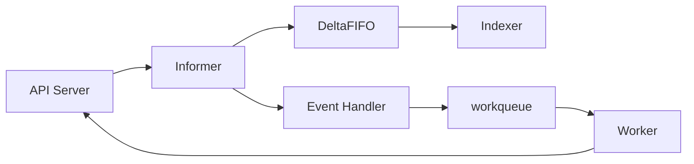
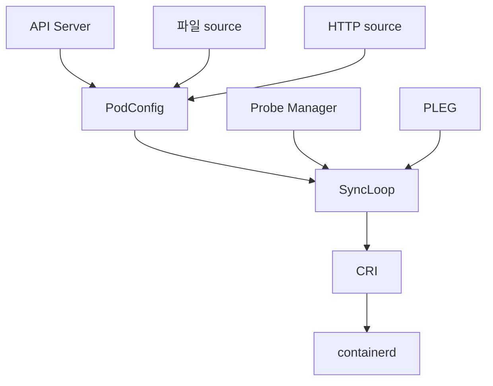
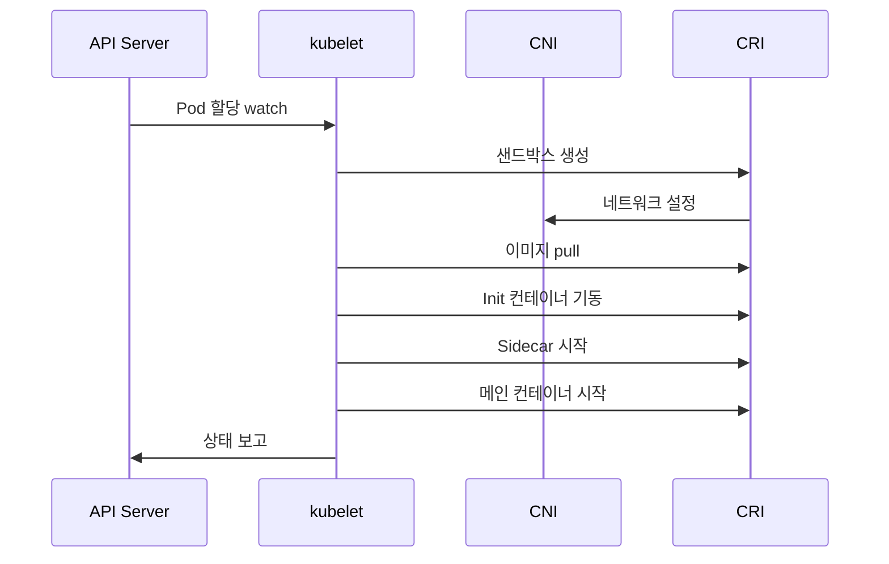
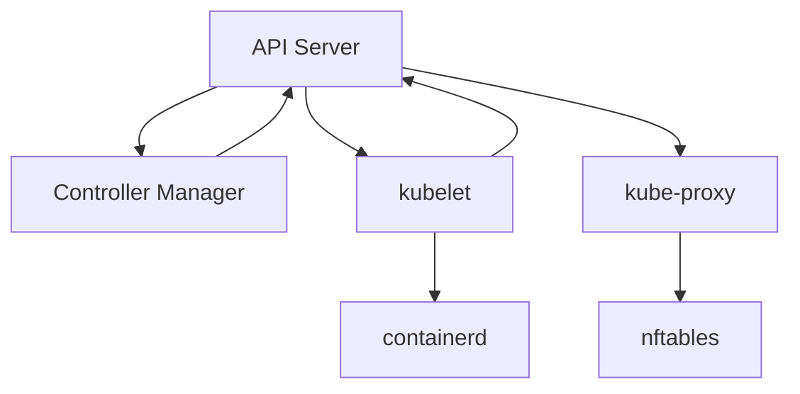

# Controller Manager · kubelet · kube-proxy

세 컴포넌트는 Kubernetes에서 **루프를 돌리는 일꾼**이다.
- **kube-controller-manager**: 컨트롤 플레인에서 리소스 단위의 루프
- **kubelet**: 노드에서 Pod 단위의 루프
- **kube-proxy**: 노드에서 Service의 데이터 플레인 구성

모두 Reconciliation의 실행체다. 이 글은 각자의 내부 동작, 상호작용,
그리고 운영·디버깅 관점에서 반드시 알아야 할 내용을 다룬다.

> 선언적 모델의 원리: [Reconciliation Loop](./reconciliation-loop.md)
> 전체 아키텍처: [K8s 개요](./k8s-overview.md)

---

## 1. kube-controller-manager

**수십 개 컨트롤러**를 한 바이너리에 묶어 실행한다.
리소스 타입별 루프가 각자 informer를 돌고 workqueue로 재처리한다.

### 내장 주요 컨트롤러

| 컨트롤러 | 역할 |
|---|---|
| Deployment | Pod 템플릿 rollout, ReplicaSet 생성·전환 |
| ReplicaSet | Pod 복제 수 유지 |
| StatefulSet | 순서·네트워크 ID 보장, PVC 템플릿 |
| DaemonSet | 노드 단위 Pod 배치, 업데이트 전략 |
| Job/CronJob | completion·parallelism·스케줄 |
| Endpoint·EndpointSlice | Service의 Pod IP 목록 유지 |
| Node | Ready·Taint 관리, unreachable 노드 제거 |
| ServiceAccount | SA 자동 생성 |
| Namespace | 네임스페이스 삭제 시 리소스 정리 |
| PV·PVC·VolumeAttachment | 스토리지 바인딩·attach/detach |
| ResourceQuota | 쿼터 계산 |
| Lease(GC) | 만료 Lease 정리 |

`--controllers=*,-bootstrapsigner,...` 로 on/off 가능 (관리형은 벤더 기본).

### Cloud Controller Manager

클라우드 API와 연동되는 컨트롤러만 분리한 별도 프로세스.
- **Node controller**: 클라우드에서 노드 소멸 시 K8s Node 제거
- **Route controller**: VPC 라우팅 설정 (CCM 없이 CNI가 대체하는 경우 多)
- **Service controller**: `type=LoadBalancer` 프로비저닝

온프레미스에서는 CCM이 없거나 MetalLB·kube-vip 같은 대안이 역할을 맡는다.

---

## 2. 컨트롤러 구현 패턴 — informer + workqueue



| 단계 | 역할 |
|---|---|
| Reflector | API Server watch, RV 관리 |
| DeltaFIFO | 변경 이벤트 큐 |
| Indexer | 로컬 캐시 (`namespace/name` 인덱스) |
| Event Handler | Add/Update/Delete 콜백, **Key만 workqueue에 enqueue** |
| workqueue | 지연·중복제거·재시도(backoff) 내장 |
| Worker | 키로 캐시 조회 → reconcile → 필요 시 re-enqueue |

**Key만 넣는 이유**: 큐 체류 중 다른 업데이트가 오면 **merge**되어
중복 reconcile을 피하고, 워커는 항상 **최신 상태로** 처리한다.

### controller-runtime

`sigs.k8s.io/controller-runtime`이 Operator SDK·Kubebuilder의 표준 기반.
- Manager가 다수 Reconciler를 관리
- `Reconcile(Request) → Result` 시그니처의 **멱등 함수**
- 에러 시 자동 재큐잉, `RequeueAfter`로 지연 재시도

### Leader Election

HA로 여러 replica가 떠 있어도 **Lease** 오브젝트로 단일 active.
- 기본: `leaseDuration=15s`, `renewDeadline=10s`, `retryPeriod=2s`
- 관련 메트릭: `leader_election_master_status`(=1 리더)
- 리더가 Lease 갱신에 실패하면 **즉시 프로세스 종료**가 정답 — split-brain 방지

---

## 3. kubelet — 노드의 1차 에이전트

노드에 할당된 Pod를 **실제로 실행**하고 상태를 보고한다.



### 입력 소스 (PodConfig)

| 소스 | 용도 |
|---|---|
| API Server | 일반 Pod |
| 파일(`--pod-manifest-path`) | **Static Pod** (kube-apiserver·etcd 자체 부트스트랩) |
| HTTP endpoint | 과거 프로비저닝 방식, 사실상 미사용 |

### SyncLoop

kubelet의 **중심 루프**. 아래 이벤트 중 무엇이 와도 같은 싱크 함수를 호출한다.
- PodConfig 변경
- PLEG(Pod Lifecycle Event Generator) 이벤트
- Probe 결과
- Housekeeping 타이머 (기본 10s)

각 Pod별로 **goroutine + workqueue**가 붙어 병렬 처리.

### PLEG

컨테이너 런타임의 상태를 **1초 주기**로 relist 해 로컬 캐시와 비교,
변경 이벤트를 SyncLoop에 공급.
- 헬스 판정: **한 번의 relist가 3분 이상** 걸리면 `PLEG is not healthy` → Node `NotReady`
- 흔한 원인: 컨테이너 수 과다·런타임 응답 지연·디스크 I/O·커널 이슈
- 대안: **Evented PLEG**(1.27+ feature gate, 1.36 기준 Beta). CRI 이벤트 기반으로 대규모 노드의 relist 부하를 줄인다

### CRI·CSI·CNI 경계

| 인터페이스 | kubelet이 하는 일 | 위임 |
|---|---|---|
| CRI | 컨테이너 create/start/exec/logs, 샌드박스 생성 | containerd/CRI-O |
| CSI | volume staging(노드 글로벌) + publishing(Pod 로컬) | CSI 드라이버 DaemonSet |
| CNI | 샌드박스 네트워크 네임스페이스 준비 지시 | CNI 플러그인(Calico/Cilium 등) |

---

## 4. Pod 라이프사이클 (kubelet 관점)



| 단계 | kubelet 동작 |
|---|---|
| Sandbox 생성 | `pause` 컨테이너로 namespace 묶음, CNI 호출로 IP 할당 |
| Volume | CSI `NodeStage`·`NodePublish`, emptyDir 생성 |
| Image Pull | `imagePullPolicy`·`imagePullSecrets` 확인, 병렬 pull 제한 |
| Init 컨테이너 | 순차 실행, 모두 종료 코드 0이어야 진행 |
| Sidecar (`restartPolicy: Always`) | Init 슬롯에서 실행, 이후 메인과 병렬 유지 (1.29 Beta, **1.33 GA**) |
| 메인 컨테이너 | probe 통과 후 Ready |
| 종료 | preStop → SIGTERM → `terminationGracePeriodSeconds` → SIGKILL |

### Probe

| 종류 | 실패 시 |
|---|---|
| startup | startup 통과 전까지 liveness/readiness 비활성 |
| liveness | 실패 시 **재시작** |
| readiness | 실패 시 Service에서 **제외** |

**패턴**:
- startup이 느린 앱은 반드시 `startupProbe` 설정
- liveness는 **절대 외부 의존성**(DB, 외부 API)을 체크하지 말 것 — cascading restart 유발

---

## 5. 노드 리소스 관리

### Node Allocatable

노드의 총 용량(Capacity)은 네 구획으로 나뉜다.

| 구획 | 용도 |
|---|---|
| `kube-reserved` | kubelet·컨테이너 런타임·노드 에이전트 용 |
| `system-reserved` | 커널·systemd·OS 데몬 용 |
| eviction threshold | 예약된 여유 공간 |
| **Allocatable** | Pod가 실제로 요청·소비 가능한 양 |

예시:
- `kubeReserved: {cpu: "200m", memory: "500Mi"}`
- `systemReserved: {cpu: "200m", memory: "500Mi"}`
- `evictionHard: {memory.available: "100Mi", nodefs.available: "10%"}`

잘못 설정하면 **메모리 마지막 100MB까지 할당 → 커널 OOM**으로 직결.

### QoS와 OOM

| QoS | OOM score_adj | 의미 |
|---|---|---|
| Guaranteed | 낮음 | 마지막에 kill |
| Burstable | 중간 | 두 번째 |
| BestEffort | 높음 | 가장 먼저 kill |

Node-pressure eviction은 **kubelet이 선제적으로** Pod을 eviction해
커널 OOM killer가 발동하기 전에 노드를 안정화한다.

### cgroup v2

- **1.25 GA**. **1.35부터 kubelet의 cgroup v1 지원이 제거**되어 실질 필수
- containerd 2.x는 v2 전용
- MemoryQoS, PSI 기반 압박 측정, I/O·메모리 일관된 계층 제어
- 노드 확인: `stat -fc %T /sys/fs/cgroup` → `cgroup2fs`
- 업그레이드 주의: v1 노드에서 1.35+ kubelet은 **기동 실패**

### eviction 튜닝

| 파라미터 | 효과 |
|---|---|
| `--eviction-hard` | 즉시 eviction 시작 |
| `--eviction-soft` | 일정 시간 초과 시 (`--eviction-soft-grace-period`) |
| `--eviction-pressure-transition-period` | 플래핑 방지 |
| `--image-gc-high-threshold` | 이미지 GC 시작 디스크% |

---

## 6. kubelet 구성

### 정적 Pod (Static Pod)

`--pod-manifest-path`의 YAML을 읽어 **API Server 없이도** Pod 실행.
- kube-apiserver·etcd·controller-manager 자체의 부트스트랩 용도
- kubelet이 API Server에 **mirror pod**를 만들어 표시만 해줌
- 삭제는 매니페스트 파일을 지워야 함 — `kubectl delete`로 안 사라짐

### KubeletConfiguration

플래그 대신 **YAML 구성 파일** 사용이 표준(1.22+ 권장).

```yaml
apiVersion: kubelet.config.k8s.io/v1beta1
kind: KubeletConfiguration
cgroupDriver: systemd
containerRuntimeEndpoint: unix:///run/containerd/containerd.sock
maxPods: 110
kubeReserved:
  cpu: "200m"
  memory: "500Mi"
evictionHard:
  memory.available: "100Mi"
  nodefs.available: "10%"
serializeImagePulls: false
featureGates:
  UserNamespacesSupport: true
```

**주의**: `cgroupDriver`는 **컨테이너 런타임과 일치**해야 한다(`systemd` 권장).
불일치 시 Pod 시작 실패 또는 자원 통제 이상.

---

## 7. kubelet 보안

| 항목 | 설정 (KubeletConfiguration 기준) |
|---|---|
| kubelet API 인증 | `authentication.anonymous.enabled: false`, webhook + x509 활성 |
| kubelet API 인가 | `authorization.mode: Webhook` (API Server에 위임) |
| **10250 포트 노출** | 사내망·노드 네트워크만 허용, 공인망 금지 |
| **10255 read-only** | 기본 off (활성화 금지) |
| NodeRestriction admission | kubelet이 **자기 노드 관련 오브젝트만** 수정 가능 |
| **Pod Security Admission** (1.25 GA) | kubelet이 실행하는 Pod의 권한 통제 (baseline·restricted 프로파일) |
| 이미지 풀 시크릿 | `imagePullSecrets` 또는 `imageCredentialProviders` |

**흔한 취약점**: anonymous auth 활성 + 방화벽 없음 = `kubectl exec` 해당하는
동작이 **인증 없이** 가능. CIS K8s Benchmark 최우선 점검 대상.

---

## 8. kube-proxy — Service의 데이터 플레인

Service의 ClusterIP/NodePort/LoadBalancer 트래픽을 **Pod IP로 분기**한다.
Ingress·Gateway는 L7 위에서 별도.

### 모드 비교 (K8s 1.36 기준)

| 모드 | 상태 | 특징 |
|---|---|---|
| **iptables** | 기본, 안정 | 단순. 규칙 많아지면 동기화 지연 |
| **nftables** | **1.33 GA, 1.34+ 프로덕션 추천** | iptables 대체. 업데이트 지연·성능 개선 |
| **IPVS** | **1.35 deprecated**(경고 출력). 1.36에도 존재하나 제거 시점 미확정 | 과거 대규모 추천. 커널 의존성·유지보수 부담 |
| **kernelspace** (Windows) | Windows 노드용 | - |

### nftables 모드 전환 기준

- 서비스 수백 개 이상 → iptables 동기화 지연이 가시화될 때
- IPVS 사용 중이라면 **1.35 deprecation** 이후 nftables로 이전
- Cilium 등 eBPF 기반 CNI를 쓰면 **kube-proxy 자체를 대체** 가능

### eBPF 대체 (kube-proxy replacement)

Cilium·Calico의 eBPF 데이터플레인은:
- source IP 보존, DSR 지원
- iptables/nftables 비의존 (conntrack 최적화)
- XDP·sockmap 기반 낮은 지연

**트레이드오프**: 커널 요구사항·디버깅 난이도↑.
관찰·정책이 모두 CNI에 종속되므로 사이드 도구(`cilium monitor` 등) 필요.

### kube-proxy 주요 파라미터

```yaml
apiVersion: kubeproxy.config.k8s.io/v1alpha1
kind: KubeProxyConfiguration
mode: nftables
clusterCIDR: 10.244.0.0/16
nftables:
  syncPeriod: 30s
  minSyncPeriod: 1s
```

---

## 9. 컴포넌트 간 상호작용



- kubelet은 API Server와만 직접 통신. 컨트롤러와 직접 대화하지 않음
- kube-proxy는 **Service·EndpointSlice** watch로 규칙 생성
- 모든 루프가 **멱등**하므로 실패 시 다음 relist에서 자동 복구

---

## 10. 운영 메트릭

### Controller Manager

| 메트릭 | 의미 |
|---|---|
| `workqueue_depth` | 컨트롤러별 큐 적체 |
| `workqueue_adds_total` | 큐 유입 |
| `workqueue_queue_duration_seconds` | 큐 대기시간 |
| `workqueue_work_duration_seconds` | 실제 reconcile 시간 |
| `leader_election_master_status` | 리더 여부 |

### kubelet

| 메트릭 | 의미 |
|---|---|
| `kubelet_pleg_relist_duration_seconds` | PLEG 건강도 |
| `kubelet_running_pods` | 노드의 실행 Pod 수 |
| `kubelet_pod_start_duration_seconds` | Pod 시작 지연 |
| `kubelet_evictions_total` | eviction 횟수 |
| `container_memory_working_set_bytes` | 컨테이너 메모리(cAdvisor) |

### kube-proxy

| 메트릭 | 의미 |
|---|---|
| `kubeproxy_sync_proxy_rules_duration_seconds` | 규칙 동기화 시간 |
| `kubeproxy_network_programming_duration_seconds` | 엔드포인트 반영 지연(SLI) |
| `kubeproxy_sync_proxy_rules_iptables_restore_failures_total` | 규칙 적용 실패 |

---

## 11. 흔한 장애와 진단

| 증상 | 컴포넌트 | 조치 |
|---|---|---|
| Node `NotReady` + "PLEG is not healthy" | kubelet | 컨테이너 수·런타임 로그·디스크 I/O 점검 |
| Pod `ContainerCreating` 고착 | kubelet+CNI | CNI 로그, `ip a`, `crictl ps -a` |
| `ImagePullBackOff` | kubelet | 레지스트리 creds, DNS, `serializeImagePulls` |
| 컨트롤러 reconcile 지연 | kube-controller-manager | `workqueue_depth`·leader election lease 흔적 |
| Service 트래픽 일부만 | kube-proxy | `sync_proxy_rules_duration`·nftables 룰 확인 |
| `kubectl exec` 불가 | kubelet + apiserver | `kubelet` 인증 모드, 10250 방화벽 |
| 노드 급격 eviction | kubelet | `eviction-hard`, 디스크·메모리 압박 |
| Static Pod이 안 사라짐 | kubelet | `--pod-manifest-path`에서 YAML 삭제 |

---

## 12. 체크리스트

- [ ] controller-manager **leader election** 3+ replica, Lease 관측 알림
- [ ] kubelet **`--anonymous-auth=false`**, Webhook 인가
- [ ] kubelet `cgroupDriver=systemd` + cgroup v2
- [ ] `kube-reserved`·`system-reserved`·`eviction-hard` 노드 크기에 맞게 설정
- [ ] **NodeRestriction admission 활성**
- [ ] kube-proxy 모드: **nftables**(1.34+) 권장, IPVS 사용 중이면 이전 계획
- [ ] 10250 포트 공인망 노출 차단
- [ ] 주요 메트릭 알림: PLEG, workqueue depth, network programming latency
- [ ] liveness probe가 외부 의존성을 체크하지 않는지 검토

---

## 13. 이 카테고리의 경계

- **Pod 라이프사이클 심화**(probe, Init/Sidecar, graceful shutdown) → `workloads/` 섹션
- **Service/EndpointSlice/Ingress/Gateway** → `service-networking/`
- **Network Policy·mesh mTLS** → `network/`·`security/`
- **Operator·controller-runtime 심화** → `extensibility/`
- **eBPF 기반 CNI 구현 세부** → `network/`

---

## 참고 자료

- [Kubernetes — kube-controller-manager](https://kubernetes.io/docs/reference/command-line-tools-reference/kube-controller-manager/)
- [Kubernetes — Built-in Controllers](https://kubernetes.io/docs/concepts/architecture/controller/)
- [Kubernetes — kubelet Configuration](https://kubernetes.io/docs/reference/config-api/kubelet-config.v1beta1/)
- [Kubernetes — Node-pressure Eviction](https://kubernetes.io/docs/concepts/scheduling-eviction/node-pressure-eviction/)
- [Kubernetes — About cgroup v2](https://kubernetes.io/docs/concepts/architecture/cgroups/)
- [Kubernetes — Virtual IPs and Service Proxies](https://kubernetes.io/docs/reference/networking/virtual-ips/)
- [Kubernetes Blog — NFTables mode for kube-proxy](https://kubernetes.io/blog/2025/02/28/nftables-kube-proxy/)
- [Red Hat — Pod Lifecycle Event Generator (PLEG is not healthy)](https://developers.redhat.com/blog/2019/11/13/pod-lifecycle-event-generator-understanding-the-pleg-is-not-healthy-issue-in-kubernetes)
- [controller-runtime](https://pkg.go.dev/sigs.k8s.io/controller-runtime)
- [CIS Kubernetes Benchmark](https://www.cisecurity.org/benchmark/kubernetes)

(최종 확인: 2026-04-21)
