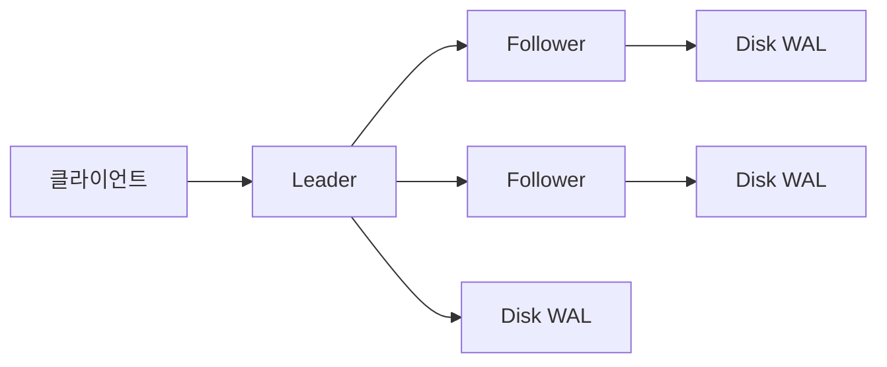
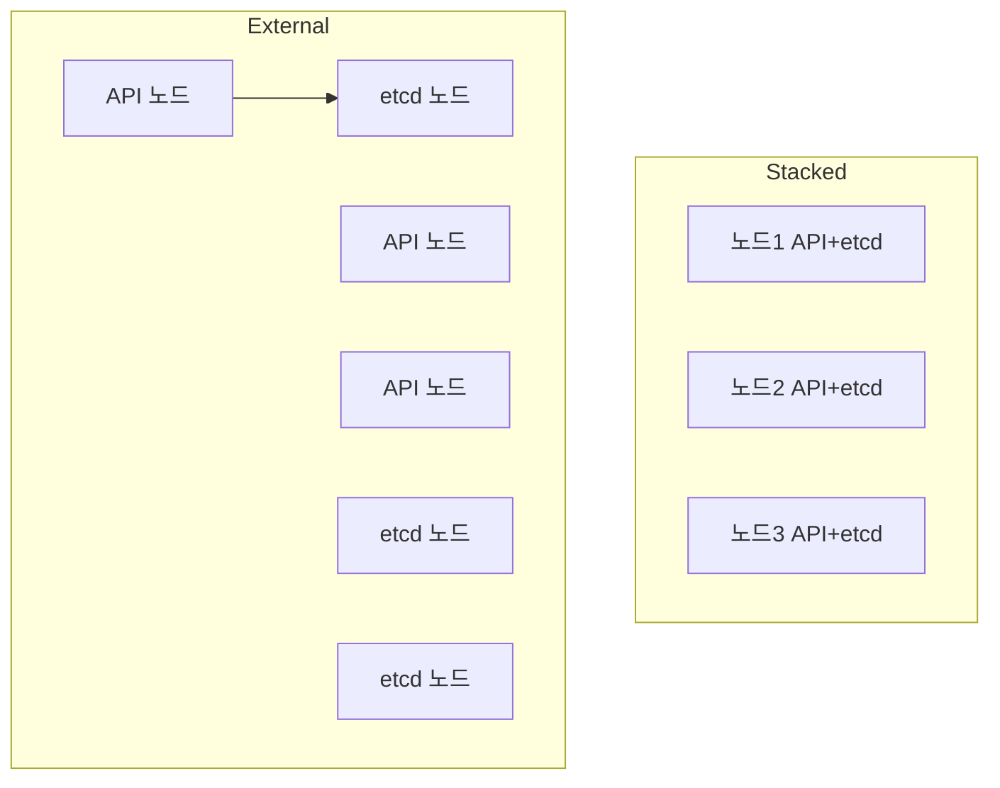

# etcd

etcd는 **분산 key-value 저장소**다. Kubernetes의 모든 오브젝트가 여기에 있다.
API Server는 앞단에서 watch·인증·인가·Admission을 처리하지만,
신뢰 원천(source of truth)은 etcd다.

이 글은 Raft 합의, MVCC 데이터 모델, HA 토폴로지,
compaction·defrag, 백업·복구, 성능 요구사항,
그리고 프로덕션 운영의 관찰·튜닝·장애 복구까지 다룬다.

> 전체 아키텍처: [K8s 개요](./k8s-overview.md)
> API Server 상호작용: [API Server](./api-server.md)

---

## 1. 버전과 위치

| 항목 | 내용 |
|---|---|
| 최신 마이너 | **etcd 3.6** (2025-05 출시. 3.5 대비 첫 마이너 릴리스) |
| 성능 | 3.5 대비 read/write 평균 약 10% 향상 |
| 기본 `--snapshot-count` | 3.5=100000 → **3.6=10000** |
| 신기능 | **공식 Downgrade 경로**(validate → enable 2단계), **Feature Gates**(K8s 스타일 Alpha/Beta/GA) 도입 |
| defrag CLI | `etcdctl defrag`는 **온라인만**. 오프라인은 `etcdutl defrag --data-dir` |
| `--experimental-*` 플래그 | 3.6에서 다수가 **정식 플래그로 승격/이름 변경** — 업그레이드 시 manifest 확인 |
| K8s 1.36 | etcd 3.5·3.6 모두 지원. 신규 구축은 3.6 권장 |

**Kubernetes ↔ etcd 호환성**은 공식 매트릭스 기준으로 맞춰야 한다.
클러스터 업그레이드 시 **API Server 먼저 → etcd 나중** 순서는 금지.

### 3.5 → 3.6 업그레이드 경로

- **반드시 v3.5.x 최신**(최소 v3.5.20, 권장 v3.5.26+)을 거친 뒤 3.6으로 올린다
- 바이너리만 교체하는 직접 점프 금지 — 데이터 스키마 호환 이슈
- 3.6은 공식 다운그레이드를 지원하지만, **3.5.x patch 롤백은 여전히 위험**
- 운영 환경은 **스테이징 먼저**, 스냅샷 보관 필수

---

## 2. 데이터 모델 — MVCC와 Revision

etcd는 **MVCC(Multi-Version Concurrency Control)** 기반이다.
모든 쓰기는 새 revision을 만들며, 이전 값이 compaction 전까지 유지된다.

| 개념 | 의미 |
|---|---|
| `revision` | 전역 단조 증가 번호. 모든 쓰기마다 +1 |
| `mod_revision` | 해당 키가 **마지막으로 수정된** revision |
| `create_revision` | 해당 키가 **처음 생성된** revision |
| `version` | 해당 키 내 버전 카운터 (생성 = 1부터) |

### Kubernetes의 `resourceVersion`

Kubernetes의 모든 오브젝트에 있는 `metadata.resourceVersion`은 사실상
etcd의 `mod_revision`이다. 따라서 `resourceVersion=0` 요청은
"캐시에서 바로 돌려달라"는 뜻이고, 단조성이 확보된다.

### Watch

etcd는 revision 기반 watch를 제공한다.
- `WATCH key FROM revision=N` — N 이후 변경만 수신
- 재연결 시 마지막 revision부터 이어서 수신
- compact된 revision 이하는 `mvcc: required revision has been compacted` 오류

→ API Server의 watch cache는 이 위에 얹힌 레이어다.

### Lease와 TTL

키에 TTL을 붙이는 **Lease**. Kubernetes에서는:
- **leader election**(Lease 오브젝트) — Controller Manager·Scheduler 리더십
- 노드 heartbeat
- 이벤트 TTL (60분)

---

## 3. Raft 합의 알고리즘

etcd는 **Raft**로 분산 합의를 구현한다.
- **Leader**: 모든 쓰기를 받음
- **Follower**: 리더로부터 로그 복제
- **Candidate**: 리더가 실종된 뒤 선거 참여



### 쿼럼(quorum)

쓰기가 성공하려면 **과반 이상** 노드가 로그를 fsync 해야 한다.
- 3노드 → 쿼럼 2 → 1노드 장애 허용
- 5노드 → 쿼럼 3 → 2노드 장애 허용
- 7노드 → 쿼럼 4 → 3노드 장애 허용

### 왜 홀수 노드인가

| 멤버 수 | 쿼럼 | 장애 허용 |
|:-:|:-:|:-:|
| 1 | 1 | 0 |
| 2 | 2 | 0 |
| 3 | 2 | 1 |
| 4 | 3 | 1 |
| 5 | 3 | 2 |
| 6 | 4 | 2 |
| 7 | 4 | 3 |

**4·6 멤버는 쓰지 말 것.** 장애 허용 개수는 같은데
쿼럼만 커져서 네트워크 비용과 커밋 지연이 늘어난다.

### 리더 선거

- `--heartbeat-interval` 기본 **100ms**, `--election-timeout` 기본 **1000ms**(1s)
- follower는 election-timeout의 **[1, 2) 배 랜덤 대기** 뒤 heartbeat가 없으면 candidate
- 과반 표를 얻으면 리더 등극
- **네트워크 파티션에서 쿼럼 측만 쓰기 가능** — 소수측은 read-only

**split-brain 불가**: 과반 제약이 구조적으로 두 리더를 허용하지 않는다.

### Learner 멤버 (non-voting)

3.4+ 도입. 쓰기·투표에 참여하지 않고 **리더로부터 따라잡기만** 하는 멤버.
- 신규 멤버를 바로 voter로 추가하면 따라잡기 전 쿼럼에 영향
- Learner로 먼저 추가 → 동기화 완료 → `promote`로 voter 승격
- kubeadm·etcd-druid 등이 멤버 교체 시 기본 절차로 사용

---

## 4. 클러스터 토폴로지

### Stacked vs External



| 항목 | Stacked | External |
|---|---|---|
| 기본(kubeadm) | ✅ | |
| 장애 도메인 격리 | API↔etcd가 동일 노드 | **독립 장애 도메인** |
| 운영 복잡도 | 낮음 | 높음 (전용 클러스터) |
| 튜닝 자유도 | 제한 | **디스크·CPU·네트워크 전용** |
| 권장 스케일 | 소~중규모(수백 노드) | 대규모(수천 노드) |

**일반 원칙**: 시작은 stacked, 지연·규모 문제 감지 시 external로 마이그레이션.
대규모 관리형(EKS/GKE/AKS)은 내부적으로 external이며 사용자에게는 숨겨진다.

### 멀티 AZ 배치

- 3노드를 **3개 AZ에 1씩** 분산 — AZ 1개 장애 허용
- 같은 AZ에 2노드 두면 그 AZ 장애 시 쿼럼 붕괴
- 네트워크 왕복 **RTT ≤ 10ms** 유지 권장

---

## 5. 일관성 모델

etcd는 기본적으로 **선형화(linearizable) 읽기**를 제공한다.
- **Linearizable**: 최신 커밋을 보장
- **Serializable**: local node에서 즉답. 최신 아닐 수 있음

Kubernetes API Server는 `resourceVersion=""`(기본) 요청을 linearizable로,
`resourceVersion="0"` 요청을 serializable로 매핑한다.
후자는 watch cache에서 즉답되므로 대량 LIST에 사용된다.

### ReadIndex — follower에서도 linearizable

follower에 들어온 linearizable read는 리더로부터 현재 commit index를 받고,
로컬 상태가 그 index에 도달한 뒤 응답한다(ReadIndex). 덕분에 **리더 집중 없이**
선형성을 보장하면서 follower 읽기 부하 분산이 가능하다.

---

## 6. 성능 요구사항 — 디스크가 전부

Raft는 fsync가 끝나야 커밋이다. 따라서 **디스크 fsync 지연**이
클러스터 전체 지연의 바닥이다.

### 공식 권장 사양

| 항목 | 권장 |
|---|---|
| 디스크 | **전용 SSD/NVMe** — HDD 금지, 공유 네트워크 볼륨 비권장 |
| 디스크 IOPS | 최소 50 IOPS 지속 (소규모), 대규모는 수백~수천 |
| `wal_fsync_duration_seconds` P99 | **< 10ms** 유지 |
| `backend_commit_duration_seconds` P99 | < 25ms |
| 네트워크 | 같은 리전, RTT ≤ 10ms |
| CPU | 2+ core (3.6은 snapshot 간격 단축으로 CPU·메모리 부담 완화) |
| 메모리 | 8GB+ (대규모는 16~32GB) |
| DB 크기 | 기본 quota 2GB, 실전 8GB까지 상향 가능 |

### 대표 병목

| 메트릭 | 임계 | 의미 |
|---|---|---|
| `etcd_disk_wal_fsync_duration_seconds{quantile="0.99"}` | > 10ms | 디스크가 느림. 다른 워크로드와 공유 가능성 |
| `etcd_disk_backend_commit_duration_seconds{quantile="0.99"}` | > 25ms | 커밋 지연. I/O 또는 defrag 필요 |
| `etcd_server_leader_changes_seen_total` | 증가 | 리더 플래핑. 네트워크 또는 힙 메모리 문제 |
| `etcd_network_peer_round_trip_time_seconds` | > 100ms | 피어 네트워크 지연 |
| `etcd_server_proposals_failed_total` | 증가 | 합의 실패 |
| `etcd_mvcc_db_total_size_in_bytes / quota` | 50% 경고, 80% 개입, 95% 긴급 | 쿼터 포화 — compact+defrag 필요 |

### 요청 크기 제약

- `--max-request-bytes` 기본 **1.5MB** (K8s API Server 제한과 맞물림)
- 증상: `etcdserver: request is too large`
- 흔한 원인: **대형 ConfigMap/Secret**, Helm release secret, Events 쌓임
- 무분별 상향 금지. 오브젝트 분리·압축·이벤트 TTL 조정이 우선

### 디스크 검증

디스크가 etcd에 충분한지 사전 검증하는 표준 도구:

```bash
# fio로 fsync latency 측정 (Red Hat 권장 파라미터)
fio --rw=write --ioengine=sync --fdatasync=1 --directory=/var/lib/etcd \
    --size=22m --bs=2300 --name=etcd-fsync

# etcd 자체 성능 체크
etcdctl check perf
```

---

## 7. Compaction과 Defragmentation

MVCC는 revision이 쌓이면서 저장소가 커진다. 두 단계로 관리한다.

| 단계 | 역할 | 누가 |
|---|---|---|
| **Compaction** | 오래된 revision 삭제 (논리 삭제) | Kubernetes API Server 자동 (기본 5분 간격) 또는 etcd `--auto-compaction-*` |
| **Defragmentation** | 빈 공간 회수 (물리 축소) | 운영자 수동 또는 주기 배치 |

### Compaction

- 자동: `--auto-compaction-retention=1h` (1시간치 revision 유지)
- 수동: `etcdctl compact <revision>`
- compaction만으로는 DB 파일 크기가 줄지 않음 — defrag 필요

### Defragmentation

- **온라인**: `etcdctl defrag --endpoints=<member>` (각 멤버 순차)
- **오프라인**: 3.6부터 `etcdutl defrag --data-dir=...`
- defrag 중 해당 멤버는 **read/write 차단** → 반드시 **멤버 단위로 순차 실행**

**주의사항**:
- 리더 먼저 하지 말 것 — follower 먼저, 리더는 마지막
- **멤버 간 30초~1분 대기** — 연달아 돌리면 리더 재선출이 겹친다
- `NOSPACE` 알람이 뜨면 쓰기 중단 → compact 후 defrag → `etcdctl alarm disarm`
- 자동화 스크립트에서 모든 멤버를 병렬로 defrag 하면 클러스터 전체 중단

---

## 8. 백업과 복구

**Kubernetes 백업은 etcd 백업이 핵심**이다. PV 데이터는 별도 볼륨 스냅샷으로.

### 스냅샷 생성

```bash
ETCDCTL_API=3 etcdctl snapshot save /backup/etcd-$(date +%F).db \
  --endpoints=https://127.0.0.1:2379 \
  --cacert=/etc/kubernetes/pki/etcd/ca.crt \
  --cert=/etc/kubernetes/pki/etcd/server.crt \
  --key=/etc/kubernetes/pki/etcd/server.key
```

### 백업 주기

| 환경 | 주기 | 보관 |
|---|---|---|
| 프로덕션 | **15~30분 간격** | 최소 7일, 별도 리전에 오프사이트 1개 |
| 스테이징 | 1~6시간 | 3일 |
| 개발 | 일 1회 | 1일 |

**자주 깜빡하는 것**: 스냅샷 저장소 자체를 KMS로 암호화.
`EncryptionConfiguration`으로 Secret이 암호화돼 있어도,
**복호화 키 파일이 보통 같은 컨트롤 플레인 노드**에 있다.
스냅샷만 탈취해도 같은 노드의 키로 복호화 가능하다.
외부 KMS v2를 쓰면 이 위험이 실질적으로 차단된다.

### 복구 절차 (요약)

1. 모든 컨트롤 플레인 컴포넌트 중지
2. `etcdctl snapshot restore`로 새 data-dir 생성
3. 모든 멤버가 **같은 스냅샷**에서 복구 (`--initial-cluster` 동일)
4. 각 멤버 기동 → 리더 선출 확인
5. API Server 기동 → 애플리케이션 상태 확인

**중요**: Velero는 PV·리소스 백업에 훌륭하지만 etcd 백업을 **대체하지 않는다**.
두 도구는 역할이 다르다.

→ 심화: [etcd 백업](../backup-recovery/etcd-backup.md)

---

## 9. 보안

| 항목 | 설정 |
|---|---|
| 클라이언트 TLS | `--cert-file`·`--key-file`·`--trusted-ca-file` |
| 피어 TLS | `--peer-cert-file`·`--peer-key-file`·`--peer-trusted-ca-file` |
| 인증 (K8s 환경) | **mTLS 클라이언트 인증서**가 주된 방식 |
| 인증 (K8s 외) | `--auth-token=jwt` + user/role 정책 (다중 클라이언트 환경에서 의미) |
| 네트워크 | 2379(client), 2380(peer). 외부 노출 금지 |
| 파일 권한 | data-dir은 `0700`, etcd 유저만 접근 |
| Secret 암호화 | API Server의 `EncryptionConfiguration`으로 etcd에 **이미 암호화된 채 저장** |

**흔한 실수**: etcd의 `--client-cert-auth=true`를 끄고 TCP만 열어 두면
공격자가 etcd에 직접 접속해 `etcdctl del --prefix=/`로
**모든 클러스터 상태를 삭제**할 수 있다. 반드시 mTLS.

---

## 10. 프로덕션 체크리스트

- [ ] **홀수 멤버 3·5·7**. 4·6 금지
- [ ] 멤버를 **서로 다른 AZ**에 배치, RTT ≤ 10ms
- [ ] **전용 SSD/NVMe**, `wal_fsync_duration_seconds` P99 < 10ms
- [ ] 클라이언트·피어 모두 **mTLS**
- [ ] `--auto-compaction-retention` 설정 (보통 1h)
- [ ] **주기 defrag** 스크립트 — 반드시 **한 번에 한 멤버**
- [ ] **15~30분 간격 스냅샷**, 암호화·오프사이트
- [ ] `NOSPACE` 알람과 `leader_changes_seen_total` 알림 설정
- [ ] quota 기본 2GB — 큰 클러스터는 `--quota-backend-bytes=8589934592` (8GB)
- [ ] **Kubernetes EncryptionConfiguration**으로 Secret 암호화 (aesgcm 또는 KMS v2)
- [ ] 복구 **런북**을 연 1회 실습

---

## 11. 흔한 장애와 복구

| 증상 | 원인 | 조치 |
|---|---|---|
| `etcdserver: mvcc: database space exceeded` | quota 초과·defrag 필요 | compact → defrag → `alarm disarm` → quota 재평가 |
| 리더 플래핑 (`leader_changes` 증가) | 디스크/네트워크 지연, GC 스파이크 | fsync·peer RTT 확인, 힙 크기 조정 |
| `TOO_OLD_RESOURCE_VERSION` 반복 | compaction으로 revision 만료 | 컨트롤러 재-List, watch cache 재구성 |
| `apply took too long` 경고 | 트랜잭션 크기↑, I/O 지연 | 대형 오브젝트 정리, SSD 점검 |
| 쿼럼 손실 (과반 노드 다운) | 동시 장애·AZ 장애 | 스냅샷 복구 후 재구성 (**재가입보다 재생성이 안전할 때 多**) |
| 멤버 재가입 실패 | `--initial-cluster-state=existing` 미설정 | 멤버 등록·data-dir 초기화 후 조인 |
| 클러스터 리드 느림 | 1개 멤버 defrag 중 | defrag 직렬화, 운영 시간 회피 |

---

## 12. 이 카테고리의 경계

- **etcd 백업 도구·스케줄 설계** → [etcd 백업](../backup-recovery/etcd-backup.md)
- **Velero·재해복구 시나리오** → `backup-recovery/` 섹션
- **Secret 암호화 정책** → `security/` 섹션
- **kube-apiserver 관점** → [API Server](./api-server.md)

---

## 참고 자료

- [etcd — Official Documentation](https://etcd.io/docs/)
- [Announcing etcd v3.6.0 — Kubernetes Blog](https://kubernetes.io/blog/2025/05/15/announcing-etcd-3.6/)
- [etcd — Maintenance (compaction, defrag, alarm)](https://etcd.io/docs/v3.5/op-guide/maintenance/)
- [etcd — Performance Benchmarking](https://etcd.io/docs/v3.5/op-guide/performance/)
- [Kubernetes — Operating etcd clusters for Kubernetes](https://kubernetes.io/docs/tasks/administer-cluster/configure-upgrade-etcd/)
- [Kubernetes — HA Topology Options](https://kubernetes.io/docs/setup/production-environment/tools/kubeadm/ha-topology/)
- [In Search of an Understandable Consensus Algorithm — Raft paper (Ongaro, Ousterhout)](https://raft.github.io/raft.pdf)
- [etcd — Hardware recommendations](https://etcd.io/docs/v3.5/op-guide/hardware/)
- [CoreOS — etcd3 Architecture](https://etcd.io/docs/v3.5/learning/design-learner/)

(최종 확인: 2026-04-21)
