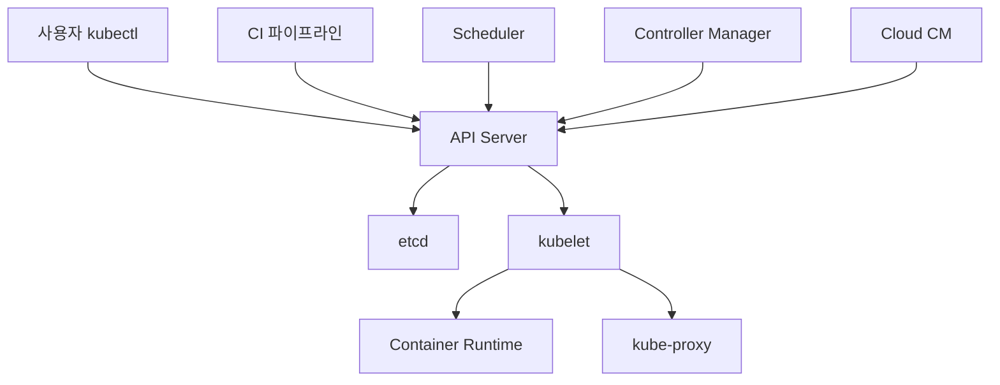
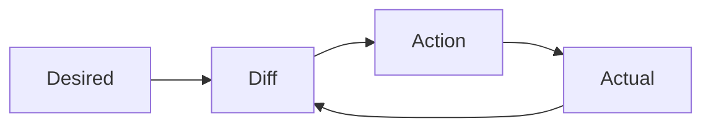
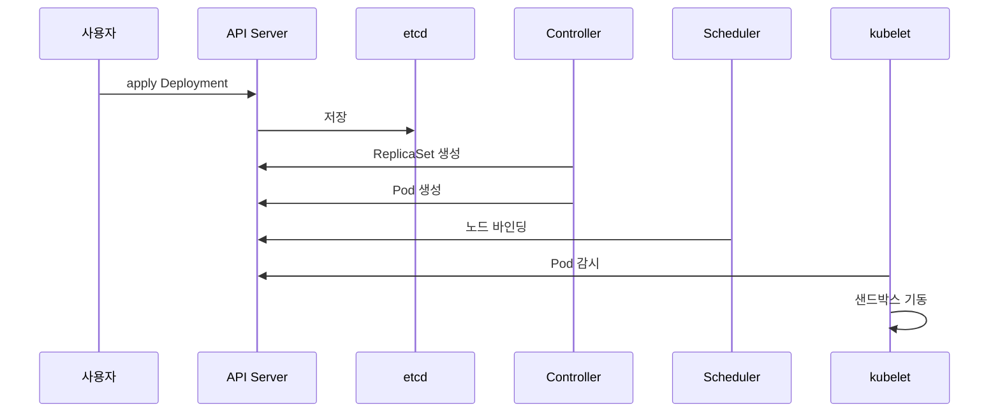

# Kubernetes 개요

Kubernetes는 **선언적 오케스트레이터**다.
"이 상태여야 한다"고 YAML로 선언하면, 컨트롤 루프가 현재 상태를
그 상태로 **수렴시킨다**.

이 글은 클러스터 전체 구성을 먼저 잡는다.
컴포넌트별 심화는 각자의 문서로 연결된다.

- [API Server](./api-server.md) — API versioning, aggregation, watch
- [etcd](./etcd.md) — Raft, 백업·복구, defrag
- [Scheduler](./scheduler.md) — 스케줄링 사이클, 플러그인
- [Controller·kubelet](./controller-kubelet.md) — 컨트롤러, kubelet, kube-proxy
- [Reconciliation Loop](./reconciliation-loop.md) — 선언적 모델 내부 동작

---

## 1. Kubernetes가 해결하는 문제

2014년 Google이 공개하기 전, 컨테이너 오케스트레이션은 파편화돼 있었다.
구글 내부 시스템 **Borg/Omega**의 경험을 오픈소스로 재설계한 것이 Kubernetes다.

해결하는 문제:

| 문제 | Kubernetes의 답 |
|---|---|
| 수백~수만 컨테이너를 어디에 띄울지 | **Scheduler**가 자원·제약 기반 배치 |
| 컨테이너가 죽으면 | **Controller**가 원하는 개수로 복구 |
| 트래픽 증가 시 | **HPA/VPA/CA/Karpenter**로 자동 확장 |
| 배포 중 장애 | **롤링 업데이트·롤백** 선언형 |
| 네트워크·스토리지 | CNI·CSI 표준 플러그인 모델 |
| 운영 자동화 확장 | **CRD + Operator** 패턴 |

핵심은 **선언적 API + 컨트롤 루프** 한 문장이다.
나머지는 이 원칙의 응용이다.

---

## 2. 클러스터 전체 구성

| 계층 | 컴포넌트 | 실행 위치 |
|---|---|---|
| 사용자·자동화 | kubectl, CI, Operator | 클라이언트·클러스터 내부 |
| 컨트롤 플레인 | API Server, etcd, Scheduler, Controller Manager, Cloud CM | 전용 노드 (HA 3+) |
| 데이터 플레인 | kubelet, kube-proxy, Container Runtime | 모든 워커 노드 |
| 확장 | CNI, CSI, Ingress/Gateway, Admission Webhook | 클러스터 내부 |

**중요 규칙**: 모든 컴포넌트는 **API Server를 통해서만** 통신한다.
컨트롤러끼리, 컨트롤러와 kubelet은 직접 연결되지 않는다.
허브-앤-스포크 구조가 확장성과 감사 로깅의 기반이다.

---

## 3. 컨트롤 플레인 컴포넌트

### 3-1. API Server (kube-apiserver)

클러스터의 **유일한 진입점**이자 상태의 정식 인터페이스.

- REST API 서버, 인증·인가·Admission 파이프라인의 게이트
- etcd 앞의 **캐시·검증 레이어** — 외부에서 etcd를 직접 건드리지 못함
- **수평 확장** 가능한 유일한 컨트롤 플레인 컴포넌트
- watch 스트림으로 변경사항을 실시간 전파

→ 심화: [API Server](./api-server.md)

### 3-2. etcd

**일관성 있는 분산 KV 저장소**.
모든 Kubernetes 오브젝트의 정식 저장소이자 신뢰 원천(source of truth).

- Raft 합의 알고리즘 — 쓰기에 과반수 노드 합의 필요
- HA는 **3·5·7 홀수 노드** — 4·6 노드는 가용성이 오히려 낮음
- 디스크 fsync 지연에 민감 — **전용 SSD, 낮은 fsync latency** 필수

→ 심화: [etcd](./etcd.md)

### 3-3. Scheduler (kube-scheduler)

아직 노드가 없는 Pod를 어느 노드에 띄울지 결정한다.

두 단계:
1. **Filter (Predicates)** — 조건을 만족하지 않는 노드 제거
2. **Score (Priorities)** — 남은 노드에 점수 매겨 최고점 선택

플러그인 프레임워크로 확장 가능.
→ 심화: [Scheduler](./scheduler.md)

### 3-4. Controller Manager (kube-controller-manager)

**수십 개 컨트롤러**를 하나의 바이너리·프로세스로 묶어 실행.
Deployment, ReplicaSet, Job, Node, Endpoint, ServiceAccount,
Namespace, PVC protection 등.

각 컨트롤러는 단순한 루프다:
- API Server를 watch
- 원하는 상태(spec)와 현재 상태(status)를 비교
- 차이가 있으면 API Server에 변경 요청

**Leader Election**: Controller Manager·Scheduler·Cloud CM은 HA로
여러 replica를 띄워도 **Lease 오브젝트로 단일 active 인스턴스만 동작**한다.
리더가 죽으면 다른 인스턴스가 Lease를 획득해 이어받는다.

→ 심화: [Controller·kubelet](./controller-kubelet.md)

### 3-5. Cloud Controller Manager (cloud-controller-manager)

클라우드 API와 연동되는 컨트롤러만 **분리**한 프로세스.

- **Node controller** — 노드 종료 감지·삭제
- **Route controller** — VPC 라우팅 설정
- **Service controller** — LoadBalancer 타입 프로비저닝

분리된 이유: K8s 코어를 **클라우드 벤더 중립**으로 유지하기 위함.
온프레미스에서는 이 컴포넌트 없이 동작한다.

---

## 4. 데이터 플레인 (노드) 컴포넌트

### 4-1. kubelet

노드의 **1차 에이전트**. 할당받은 Pod를 CRI 런타임으로 띄우고 감시한다.

- **PodSpec을 받아 컨테이너 생성**까지 책임
- 노드·Pod 상태를 API Server로 주기 보고 (heartbeat)
- liveness/readiness/startup probe 실행
- 컨테이너 리소스·로그 수집, volume mount, image pull

→ 심화: [Controller·kubelet](./controller-kubelet.md)

### 4-2. kube-proxy

Service의 **가상 IP를 실제 Pod IP로 분기**시키는 데이터 플레인.

| 모드 | 상태 (1.36 기준) |
|---|---|
| iptables | 기본값. 작은·중간 규모 |
| nftables | **1.33 GA**. 대규모 서비스 성능·업데이트 지연 개선 |
| IPVS | **1.35 deprecated**. 1.36에도 존재하나 제거 시점 미확정 |
| eBPF (Cilium kube-proxy replacement) | kube-proxy 자체를 대체 |

### 4-3. Container Runtime (CRI)

kubelet이 컨테이너를 띄울 때 호출하는 런타임 인터페이스 구현.

- **containerd** (기본) 또는 **CRI-O**
- Docker는 K8s 1.24에서 제거됨 (dockershim)
- 이미지 pull, 컨테이너 생성·삭제, exec, 로그를 CRI gRPC로 제공
- 추가 격리가 필요하면 **RuntimeClass**로 Kata Containers, gVisor 지정

---

## 5. 선언적 모델과 컨트롤 루프

Kubernetes의 모든 동작은 같은 패턴을 따른다.

- **Desired State** — 사용자가 선언한 YAML (API Server·etcd에 저장)
- **Actual State** — 클러스터의 현실 (kubelet·컨트롤러가 보고)
- **Reconcile** — 차이를 줄이는 최소 변경

이 모델이 가진 힘:

| 특성 | 결과 |
|---|---|
| 멱등성 | 같은 YAML 재적용해도 안전 |
| 자가 치유 | 노드·Pod 장애 자동 복구 |
| 롤백 가능 | 이전 Deployment revision으로 복귀 |
| 감사 추적 | 모든 변경이 API Server를 경유 |
| GitOps 호환 | Git을 desired state의 원천으로 사용 |

→ 심화: [Reconciliation Loop](./reconciliation-loop.md)

### Level-triggered vs Edge-triggered

Kubernetes는 **level-triggered**다. 이벤트를 놓쳐도 상태를 주기적으로
재비교하기 때문에 복구된다. edge-triggered(이벤트 구독) 시스템은
이벤트 유실이 곧 장애다. 이 선택이 Kubernetes가 불안정한 네트워크에서도
버티는 이유다.

---

## 6. Pod 하나가 뜨는 흐름

`kubectl apply -f deployment.yaml`부터 컨테이너 실행까지.

| 단계 | 주체 | 동작 |
|---|---|---|
| 1 | kubectl | YAML을 API Server에 POST |
| 2 | API Server | 인증·인가·Admission 통과 후 etcd에 저장 |
| 3 | Deployment 컨트롤러 | ReplicaSet을 원하는 개수로 생성 |
| 4 | ReplicaSet 컨트롤러 | Pod 오브젝트 생성 (nodeName 비어 있음) |
| 5 | Scheduler | Pod watch 후 노드 선택, Binding 서브리소스로 할당 |
| 6 | kubelet | Pod Sandbox 생성, CNI가 네트워크·IP 할당 |
| 7 | kubelet | 이미지 pull, Init → Sidecar → 메인 컨테이너 순 기동 |
| 8 | kubelet | probe 통과 후 Ready, 상태를 API Server로 보고 |

모든 단계가 **API Server를 경유**하고, 중간 상태는 **etcd에 저장**된다.
각 컴포넌트는 서로 모른 채 watch만 본다 → 수평 확장·장애 격리 가능.

> `Binding` 서브리소스가 분리된 이유: 별도 RBAC 권한과 감사 이벤트를
> 남겨 **스케줄러 권한을 최소화**하기 위함.
> 장애 대부분은 6·7단계(CNI 실패·`ImagePullBackOff`·Init 실패)에서 발생한다.

---

## 7. 클러스터 배포 모델

실제 운영 클러스터는 거의 대부분 아래 네 가지 중 하나다.

| 모델 | 예 | 컨트롤 플레인 책임 |
|---|---|---|
| **관리형(Managed)** | EKS, GKE, AKS, OKE | CSP가 운영·업그레이드 |
| **kubeadm 셀프매니지드** | 온프레미스, Bare-metal | 사용자가 전부 |
| **배포 도구 기반** | Kubespray, RKE2, Talos | 설치 자동화, 운영은 사용자 |
| **경량 K8s** | k3s, k0s, MicroK8s | 엣지·IoT·개발 환경 |

**선택 기준**:

- 컨트롤 플레인 튜닝 자유도 필요 → 셀프매니지드
- 운영 인력이 부족하거나 HA·백업을 벤더에 맡기고 싶음 → 관리형
- 엣지·CI·개발환경 → 경량 배포

→ 심화: [클러스터 구축](../cluster-setup/)

---

## 8. Kubernetes 1.36 기준 기억할 변화

1.36 (2026-04-22 출시)에서 실무에 영향이 큰 변화만 추린다.

**신규 GA**

| 변경 | 영향 |
|---|---|
| **DRA** (Dynamic Resource Allocation) GA | GPU·FPGA·특수 하드웨어 선언적 할당. Device Plugin 한계 극복, AI/ML 워크로드 표준 |
| **User Namespaces** GA | Pod를 root로 띄워도 호스트는 unprivileged. 보안 대폭 향상 |
| **Mutating Admission Policy** GA + 기본 활성화 | Webhook 없이 CEL로 mutation. TLS·HA 걱정 제거 |
| **OCI VolumeSource** GA | 이미지를 볼륨으로 마운트 (데이터·모델 배포) |
| **HPA Scale-to-Zero** stable 경로 | 트래픽 없을 때 0으로 축소 가능 |
| **Volume Group Snapshot** GA | 여러 디스크의 원자적 스냅샷 |

**Deprecation·제거 (업그레이드 체크리스트)**

| 변경 | 영향 |
|---|---|
| **IPVS 모드 deprecated** (kube-proxy) | 1.35부터 경고 출력, 1.36에도 존재하나 제거 시점 미확정. nftables·iptables·eBPF로 이전 권장 |
| **`gitRepo` Volume 제거** | 보안 취약점. Init Container + git clone 사용 |
| **`externalIPs` 필드** deprecation 시작 | 1.36: feature gate 추가(기본 on) → 1.40경 기본 off → **1.46경 완전 제거**. MITM 경로 차단 |
| **Ingress-NGINX 프로젝트 은퇴** (2026-03-24) | 대안: Gateway API + Envoy Gateway, Contour, HAProxy Ingress |

---

## 9. 흔한 오해

| 오해 | 실제 |
|---|---|
| Docker가 없으면 K8s가 안 됨 | **아니다**. containerd/CRI-O가 표준, Docker는 1.24에서 제거 |
| 컨트롤 플레인은 마스터 노드 | **옛날 표현**. 2020년부터 "마스터" 대신 control plane |
| etcd는 Pod 상태도 실시간 저장 | API Server가 앞에서 watch 캐시로 버퍼링. etcd 직접 부하 제한적 |
| 컨트롤 플레인이 죽으면 워크로드도 죽음 | **아니다**. 실행 중 Pod는 계속 동작. 변경·스케줄링만 멈춤 |
| HPA와 VPA를 동시에 쓰면 됨 | **같은 메트릭**(CPU/Memory)에서는 충돌. HPA는 custom metric, VPA는 recommendation 모드로 역할 분리 시 병행 가능 |
| Service는 로드밸런서 | iptables/nftables 수준에서 랜덤 분산. 세션 유지·가중치는 Mesh |

---

## 10. 이 카테고리의 경계

- **도구**(Helm, Kustomize, kubectl) → 본 카테고리 `tools/` 섹션
- **GitOps 운영**(ArgoCD, Flux) → `cicd/`
- **Service Mesh 구현**(Istio, Linkerd) → `network/`
- **Secrets 관리 도구**(Vault, ESO, Sealed Secrets) → `security/`
- **SLO·에러 버짓·포스트모템** → `sre/`

---

## 참고 자료

- [Kubernetes — Cluster Architecture](https://kubernetes.io/docs/concepts/architecture/)
- [Kubernetes — Components](https://kubernetes.io/docs/concepts/overview/components/)
- [Kubernetes — Control Plane to Node Communication](https://kubernetes.io/docs/concepts/architecture/control-plane-node-communication/)
- [Kubernetes v1.36 Sneak Peek](https://kubernetes.io/blog/2026/03/30/kubernetes-v1-36-sneak-peek/)
- [Kubernetes 1.36 CHANGELOG](https://github.com/kubernetes/kubernetes/blob/master/CHANGELOG/CHANGELOG-1.36.md)
- [Borg, Omega, and Kubernetes — ACM Queue (Brewer et al.)](https://queue.acm.org/detail.cfm?id=2898444)
- [Kubernetes Patterns — Bilgin Ibryam, Roland Huß](https://k8spatterns.io/)
- [Production Kubernetes — Josh Rosso 외](https://www.oreilly.com/library/view/production-kubernetes/9781492092292/)

(최종 확인: 2026-04-21)
