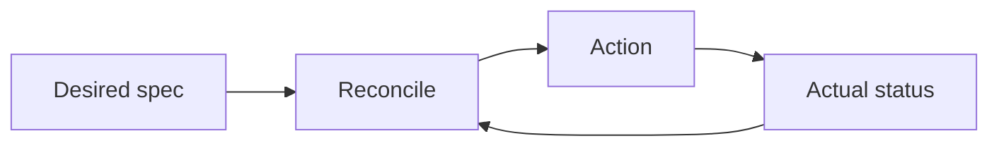
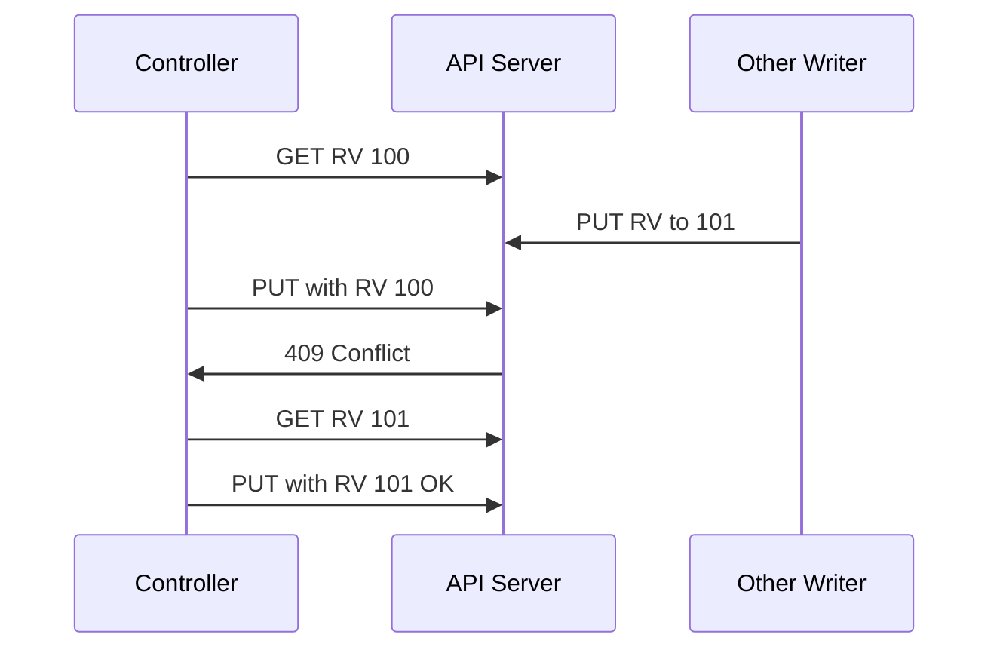
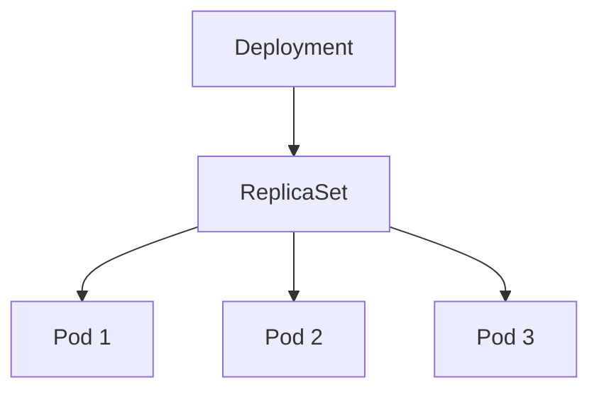

# Reconciliation Loop

Kubernetes의 모든 동작은 하나의 패턴을 반복한다: **"현재 상태를 원하는 상태로
수렴시킨다."** Deployment 롤링도, Node 상태 갱신도, Operator의 CRD 처리도
전부 같은 루프다.

이 글은 선언적 모델의 원리, level-triggered 설계, 멱등성, optimistic
concurrency, sub-resource, Finalizer, OwnerReference, 그리고 Operator를
만들 때 반드시 지켜야 하는 규칙까지 다룬다.

> 실행 컴포넌트: [Controller·kubelet](./controller-kubelet.md)
> API Server의 watch·인포머: [API Server](./api-server.md)

---

## 1. 선언적 모델이란

| 명령형 (Imperative) | 선언형 (Declarative) |
|---|---|
| "A를 실행하라" | "A가 존재해야 한다" |
| 결과는 실행 순서에 의존 | 결과는 **최종 상태**만 기술 |
| 실패 시 재시도 전략 필요 | 루프가 **자동 수렴** |
| 상태 vs 명령 불일치 | 상태 = 선언 |

Kubernetes 오브젝트는 **Desired**(spec)와 **Actual**(status)로 구성된다.
컨트롤러는 이 둘의 차이를 감지하고 **차이를 줄이는 최소 작업**을 수행한다.



이 한 장이 Kubernetes 전체 아키텍처의 요약이다.

---

## 2. Level-triggered vs Edge-triggered

| 모델 | 의미 | 대표 시스템 |
|---|---|---|
| **Edge-triggered** | 이벤트 발생 시점에만 반응 | 메시지 큐, 인터럽트 |
| **Level-triggered** | **현재 상태**를 주기적으로 확인 | Kubernetes |

Edge는 이벤트 유실이 곧 상태 불일치로 직결된다.
Level은 이벤트를 놓쳐도 **다음 동기화에서 자동 복구**된다.

Kubernetes는 외부 장애·네트워크 파티션·컨트롤러 재시작이 일상이다.
level-triggered 선택이 이 모든 상황에서 **최종 일관성**을 보장하는 기반이다.

### 구현 관점

| 계층 | 처리 방식 |
|---|---|
| watch 스트림 | edge 같지만(이벤트 수신) 이어서 **전체 캐시 resync** 수행 |
| 주기 resync | **기본 10시간** + ±10% jitter (controller-runtime). 낮추는 건 보통 안티패턴 |
| 컨트롤러 로직 | 이벤트가 아니라 **현재 오브젝트 전체**를 보고 판단 |

> 주기적 재시도가 필요하면 SyncPeriod를 낮추지 말고 Reconcile 내부의
> `RequeueAfter`로 표현하라. 전역 resync는 대규모 클러스터에서 API Server
> LIST 부하로 직결된다.

---

## 3. 멱등성 — Reconcile의 절대 규칙

Reconcile 함수는 반드시 **멱등**이어야 한다.
같은 입력으로 N번 실행해도 결과가 같아야 한다.

### 왜 필수인가

- watch는 중복 이벤트를 보낼 수 있음
- 재시도·재큐잉이 상시 발생
- 리더 교체 시 직전 Reconcile이 중간에 끊길 수 있음

### 멱등 실패 사례

```go
// 금지: 상대적 변경
replicas := deployment.Spec.Replicas + 1

// 권장: 절대적 원하는 상태
deployment.Spec.Replicas = desired.Replicas
```

단순 원칙: "**현재 상태를 읽고, 원하는 상태를 계산하고, 차이를 patch**."

---

## 4. Optimistic Concurrency — `resourceVersion`

여러 컨트롤러가 같은 오브젝트를 동시에 수정할 수 있다. Kubernetes는 **락을
쓰지 않고** `metadata.resourceVersion`으로 충돌을 감지한다.



- 읽을 때 본 RV와 쓰기 직전의 RV가 다르면 **409 Conflict**
- 컨트롤러는 **재시도** — 다시 GET → 계산 → PUT
- workqueue가 자동 재큐잉으로 이 루프를 구현

### Patch 종류

| 방식 | 특징 |
|---|---|
| JSON Patch | RFC 6902, 경로 기반. 배열 순서 민감 |
| Merge Patch | RFC 7396, 필드 단위 덮어쓰기 |
| **Strategic Merge Patch** | K8s 전용, 배열에 `patchMergeKey` 인지 |
| **Server-side Apply** | **필드 소유권** 추적 (multi-writer 안전) |

### Server-side Apply

여러 컨트롤러가 같은 오브젝트의 **서로 다른 필드**를 쓸 때의 표준.
- `managedFields`에 필드별 owner 기록
- 다른 owner의 필드를 덮어쓰면 `ForceApply` 또는 에러
- GitOps 도구(ArgoCD·Flux)가 주도적으로 전환 중
- **`fieldManager` 이름은 버전업에도 바꾸지 말 것** — 바꾸면 이전 버전이
  관리하던 필드가 고아가 되어 의도치 않은 덮어쓰기·제거가 발생

---

## 5. Sub-resources — spec vs status

Kubernetes 오브젝트의 **spec**과 **status**는 다른 권한 단위다.

| Sub-resource | 쓰는 주체 | RBAC |
|---|---|---|
| `/<resource>` (spec) | 사용자·컨트롤러 | 일반 verb (`update`, `patch`) |
| `/<resource>/status` | **컨트롤러만** | `update` on `/status` |
| `/<resource>/scale` | HPA·KEDA·수동 스케일러 | `update` on `/scale` |

**왜 분리하나**: RBAC로 "사용자는 spec만, 컨트롤러는 status만" 분리 가능.
컨트롤러가 status 업데이트하다 실수로 spec을 덮어쓰는 사고 방지.

CRD에서도 `subresources: { status: {} }` 선언으로 활성화. controller-runtime
에서는 `client.Status().Update(...)` 형태로 접근.

---

## 6. OwnerReference와 GC



- `metadata.ownerReferences`로 부모 참조
- 부모 삭제 시 **Garbage Collector 컨트롤러**가 자식을 정리
- `blockOwnerDeletion: true`면 부모 삭제가 자식 정리 완료까지 **차단**

### Propagation Policy

| 정책 | 동작 |
|---|---|
| `Foreground` | 자식 전부 삭제 후 부모 삭제 |
| `Background` | 부모 먼저 삭제, 자식은 **비동기 정리**. **`kubectl` 기본값** |
| `Orphan` | 자식의 `ownerReferences` 제거, 자식은 그대로 유지 |

API 호출은 `DeleteOptions.propagationPolicy`로 명시.
`kubectl`은 `--cascade=foreground|background|orphan`으로 override.

---

## 7. Finalizers — 외부 리소스 안전 삭제

일부 삭제에는 **클러스터 밖 정리**가 필요하다 (클라우드 LB 해제, 외부 DB
드롭, 스토리지 detach 등). Finalizer는 이 보장을 코드로 표현한다.

### 흐름

1. 사용자가 `DELETE` → API Server가 `deletionTimestamp` 세팅
2. 오브젝트는 **삭제 대기** 상태 (사라지지 않음)
3. Finalizer 목록이 **비어 있을 때**만 실제 삭제
4. 각 컨트롤러가 외부 정리 끝내고 **자기 finalizer를 제거**

```yaml
metadata:
  finalizers:
    - cert-manager.io/cleanup
  deletionTimestamp: "2026-04-21T10:00:00Z"
```

### 흔한 사고: "Finalizer Stuck"

- 컨트롤러가 **이미 제거됐거나** 버그로 finalizer 제거 실패
- 오브젝트가 `Terminating` 상태로 영원히 남음

**진단·복구 순서** (위에서 아래로):

1. 담당 컨트롤러 Pod 상태·로그 확인
2. 컨트롤러 RBAC·API Server 도달성 확인
3. 컨트롤러 재기동 시도
4. 위 모두 실패 시 **최후의 수단**: `kubectl patch ... --type=merge -p '{"metadata":{"finalizers":[]}}'`
   - **위험**: 클라우드 리소스(ELB·EBS·RDS·IAM 등)가 고아가 될 수 있음
   - 반드시 수동으로 외부 리소스 정리 후 실행

**설계 원칙**:
- Finalizer는 **본인 컨트롤러 이름 접두사**로 네임스페이싱 (`example.com/foo`)
- 실패 시 재시도 가능하게 **멱등**으로 구현
- 외부 리소스가 이미 없어졌으면 **바로 finalizer 제거** (부정확한 오류 금지)

---

## 8. Conditions — 상태를 표현하는 표준

Kubernetes는 phase 같은 **단일 상태 머신**을 피하고 **conditions 배열**을 쓴다.

```yaml
status:
  conditions:
    - type: Ready
      status: "True"
      reason: "Healthy"
      lastTransitionTime: "2026-04-21T09:00:00Z"
    - type: Progressing
      status: "False"
      reason: "NewReplicaSetAvailable"
```

| 필드 | 역할 |
|---|---|
| `type` | 상태 이름 (Ready, Available 등) |
| `status` | `True`·`False`·`Unknown` |
| `reason` | 기계 판독 가능한 짧은 코드 |
| `message` | 사람 읽을 메시지 |
| `observedGeneration` | 어느 spec generation을 반영한 status인지 (condition 단위, 1.23+) |

**`status.observedGeneration`(루트)이 주**다. condition별 `observedGeneration`은
더 세밀한 표현이 필요할 때 추가로 사용. 보통 루트 필드를 먼저 세팅한다.

**Condition type은 긍정형**(`Ready`, `Available`, `Progressing`)으로 이름
짓고 `status=True`가 건강한 상태로 해석되도록 한다.

**왜 phase를 피하나**: phase는 동시 상태를 표현 못 한다.
Pod는 `Running`이면서 동시에 `Ready=False, Initialized=True`일 수 있다.
Conditions 배열이 이를 자연스럽게 표현한다.

---

## 9. Reconcile 함수 패턴 (controller-runtime)

```go
func (r *Reconciler) Reconcile(ctx context.Context, req ctrl.Request)
  (ctrl.Result, error) {

  // 1. 오브젝트 로드
  obj := &v1.MyCR{}
  if err := r.Get(ctx, req.NamespacedName, obj); err != nil {
    return ctrl.Result{}, client.IgnoreNotFound(err)
  }

  // 2. 삭제 중이면 finalizer 처리
  if !obj.DeletionTimestamp.IsZero() {
    return r.handleDelete(ctx, obj)
  }

  // 3. Finalizer 없으면 추가
  if !controllerutil.ContainsFinalizer(obj, myFinalizer) {
    controllerutil.AddFinalizer(obj, myFinalizer)
    return ctrl.Result{}, r.Update(ctx, obj)
  }

  // 4. Reconcile — 원하는 상태 계산
  desired := r.buildDesired(obj)

  // 5. apply (server-side)
  if err := r.Patch(ctx, desired, client.Apply, client.FieldOwner("me"),
    client.ForceOwnership); err != nil {
    return ctrl.Result{}, err
  }

  // 6. status 업데이트
  obj.Status.ObservedGeneration = obj.Generation
  meta.SetStatusCondition(&obj.Status.Conditions, readyTrue())
  return ctrl.Result{}, r.Status().Update(ctx, obj)
}
```

| Result | 의미 |
|---|---|
| `{}` + nil | 성공, 이벤트 기반 재큐잉 |
| `{Requeue: true}` + nil | 즉시 재큐잉 |
| `{RequeueAfter: 30s}` | N초 후 재시도 (외부 API 상태 기다릴 때) |
| `{}` + error | 에러, backoff 재시도 |

---

## 10. 흔한 안티패턴

| 안티패턴 | 문제 | 해결 |
|---|---|---|
| 상대적 업데이트 (`+1`) | 멱등 실패, race condition | 절대적 desired state |
| Reconcile에서 블로킹 호출 | 워커 점유, 큐 적체 | `RequeueAfter`로 분리 |
| status만 보고 판단 | 관찰 지연으로 오판 | `observedGeneration`·spec과 대조 |
| 외부 API 스로틀 무시 | 429 루프 | backoff·레이트 리밋, `RequeueAfter` |
| Finalizer 빠진 외부 리소스 | 클라우드 자원 고아 | 삭제 시 반드시 외부 정리 |
| phase 필드 신설 | 동시 상태 표현 불가 | Conditions 배열 |
| 이벤트 핸들러에서 동기 작업 | watch 블로킹 | Key enqueue만 하고 워커에서 작업 |
| 특정 리소스 자체 watch 안 함 | level-triggered 포기 | 관련 리소스 모두 `Owns()` 또는 `Watches()` |
| 같은 CR을 여러 컨트롤러가 관리 | 갱신 핑퐁, status 진동 | SSA `fieldManager` 분리 + 소유 필드 스키마 분리 |

---

## 11. 디버깅 — 멈춘 Reconcile 진단

| 증상 | 확인 |
|---|---|
| CR 상태가 업데이트 안 됨 | 컨트롤러 Pod 로그, `ObservedGeneration` vs `Generation` |
| 리소스 `Terminating` 지속 | `finalizers` 목록, 담당 컨트롤러 상태 |
| 변경이 자꾸 되돌아감 | **다른 컨트롤러와 경합** — managedFields 확인 |
| workqueue 적체 | `workqueue_depth` 메트릭, Reconcile 소요 시간 |
| Reconcile 주기 과도 | 자기 status 변경이 자기 재큐잉 유발 — predicate로 필터 |

### 쓸모 있는 도구

| 도구 | 용도 |
|---|---|
| `kubectl get -o yaml` | `managedFields`·`ownerReferences`·`finalizers` 확인 |
| `kubectl events` | Reconcile 이벤트·경고 |
| `controller-runtime` 로그 레벨 상향 | 이벤트·수정 트레이싱 |
| `kubectl-view-managed-fields` | 필드 소유권 시각화 |

---

## 12. Operator 확장에서의 원칙

CRD + 컨트롤러 = Operator. 위 모든 규칙이 그대로 적용된다.

**글로벌 표준 원칙**:
- 컨트롤러는 **자기 CRD + 소유 하위 리소스**만 본다
- **CRD 버전 전환**은 `conversion webhook` 또는 CEL
- CRD에 **`x-kubernetes-validations`(CEL)** 로 스키마 검증 (Webhook 대신)
- 외부 리소스 관리는 **Finalizer + 멱등 정리**
- status는 반드시 **sub-resource**로, RBAC 분리
- **observedGeneration**으로 spec과의 동기화 명시

---

## 13. 분산 시스템 관점 요약

| 원칙 | Kubernetes에서의 구현 |
|---|---|
| CAP 선택 | etcd는 **CP**, 네트워크 파티션 시 가용성보다 일관성 |
| 최종 일관성 | Reconcile 루프의 수렴이 보장 |
| 실패 모델 | 재시도·멱등·backoff 내장 |
| 동시성 제어 | `resourceVersion` optimistic lock |
| 부분 실패 처리 | 이벤트·conditions·events 객체 |
| 비잔틴 | **다루지 않음** (신뢰 경계: API Server + mTLS) |

---

## 14. 이 카테고리의 경계

- **컨트롤러 구현 프레임워크**(controller-runtime, Kubebuilder, Operator SDK) → `extensibility/operator-pattern.md`
- **CRD 심화**(conversion, versioning, CEL validation) → `extensibility/crd.md`
- **Admission Webhook·VAP·MAP** → `extensibility/` 섹션
- **API 오브젝트 모델·watch** → [API Server](./api-server.md)

---

## 참고 자료

- [Kubernetes — Controllers](https://kubernetes.io/docs/concepts/architecture/controller/)
- [Kubernetes — Operator Pattern](https://kubernetes.io/docs/concepts/extend-kubernetes/operator/)
- [Kubernetes — Finalizers](https://kubernetes.io/docs/concepts/overview/working-with-objects/finalizers/)
- [Kubernetes — Owners and Dependents](https://kubernetes.io/docs/concepts/overview/working-with-objects/owners-dependents/)
- [Kubernetes — Server-Side Apply](https://kubernetes.io/docs/reference/using-api/server-side-apply/)
- [Kubernetes — API Conventions (status, conditions)](https://github.com/kubernetes/community/blob/master/contributors/devel/sig-architecture/api-conventions.md)
- [Kubebuilder Book — Reconciliation](https://book.kubebuilder.io/reference/good-practices)
- [CNCF — Operator White Paper](https://github.com/cncf/tag-app-delivery/blob/main/operator-whitepaper/v1/Operator-WhitePaper_v1-0.md)
- [Designing Data-Intensive Applications — Kleppmann (분산 시스템 기반)](https://dataintensive.net/)

(최종 확인: 2026-04-21)
