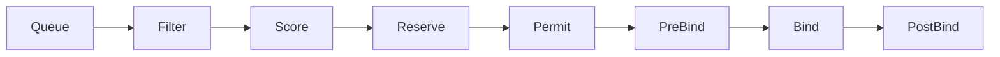
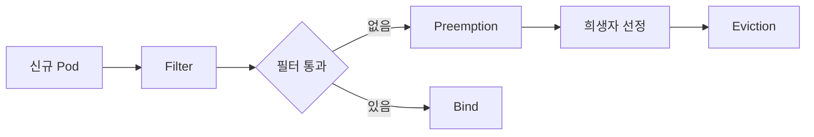

# Scheduler

`kube-scheduler`는 **nodeName이 비어 있는 Pod를 어느 노드에 띄울지** 결정한다.
단순한 "자원 맞추기"가 아니라, **affinity·taint·topology·preemption·DRA**까지
포함한 복합 제약 만족 문제(CSP)를 푸는 컴포넌트다.

이 글은 스케줄링 사이클, 플러그인 프레임워크, 주요 기능(Affinity·Taint·
TopologySpread·Preemption·DRA), 멀티 스케줄러, 튜닝, 관측, 흔한 장애를 다룬다.

> 전체 아키텍처: [K8s 개요](./k8s-overview.md)
> 리소스 상세 스케줄링 옵션(Affinity·Toleration·Topology): `scheduling/` 섹션

---

## 1. 역할과 입력·출력

| 항목 | 내용 |
|---|---|
| 입력 | `spec.nodeName`이 비어 있는 Pod, 노드 목록, PV·PVC, DRA 리소스 |
| 출력 | Pod에 `Binding` 서브리소스로 노드 할당 |
| 원칙 | **상태 없음(stateless)** — API Server와 informer 캐시가 진실 |
| 형태 | 리더 선출 기반, **동시에 1개 인스턴스**만 활성 |

kube-scheduler는 kubelet이나 컨테이너와 직접 대화하지 않는다.
결정을 `Binding`으로 API Server에 POST할 뿐이다.

---

## 2. 스케줄링 사이클

Pod 하나를 스케줄링하는 전체 사이클은 두 단계다.

| 단계 | 내용 | 실행 모드 |
|---|---|---|
| **Scheduling Cycle** | Filter → Score → Reserve → Permit | **직렬** (한 Pod씩) |
| **Binding Cycle** | PreBind → Bind → PostBind | **병렬** (Pod별 고루틴) |

직렬 수행은 "상태 기반 결정"을 보장하기 위해서다. 만약 두 Pod를 동시에
스케줄링하면 같은 노드의 자원을 두 번 차감할 수 있다.
Binding은 노드가 이미 정해졌기에 병렬로 돌려도 안전하다.



### 단계별 역할

| 단계 | 역할 |
|---|---|
| Queue | Active/Backoff/Unschedulable 3단 큐. **QueueingHint**(1.32 GA)로 관련 이벤트가 있을 때만 재시도. `spec.schedulingGates`(1.30 GA)로 외부(Kueue 등)가 release 전까지 대기시킬 수 있음 |
| PreFilter | Pod 단위 사전 계산 (affinity 토폴로지 맵 등) |
| **Filter** | 조건 불만족 노드 제거 (NodeResourcesFit, NodeAffinity, Taint 등) |
| PostFilter | 필터 결과 0개 시 **Preemption**(희생자 선정) |
| PreScore | Score용 데이터 준비 |
| **Score** | 각 노드에 0~100 점수 부여 (BalancedAllocation, ImageLocality 등) |
| Normalize | 점수 정규화 |
| Reserve | 선택 노드에 자원 **예약**(낙관적 업데이트) |
| Permit | wait·reject·approve 게이트. **Gang 스케줄링 지점** |
| PreBind | Bind 전 마지막 작업 (DRA claim publish, volume attach 등) |
| Bind | `Binding` 서브리소스로 실제 nodeName 설정 |
| PostBind | 정리 작업, 메트릭 기록 |

---

## 3. 플러그인 프레임워크

1.19부터 **Scheduling Framework**가 표준. 모든 로직이 플러그인이다.

### 내장 주요 플러그인

| 플러그인 | 역할 | 기본 단계 |
|---|---|---|
| `NodeResourcesFit` | CPU/Memory requests 적합성 | Filter+Score |
| `NodeAffinity` | nodeSelector, node affinity | Filter+Score |
| `TaintToleration` | taint/toleration | Filter+Score |
| `PodTopologySpread` | 토폴로지 분산 | Filter+Score |
| `InterPodAffinity` | Pod 간 affinity/anti-affinity | Filter+Score |
| `VolumeBinding` | PVC 바인딩·지연 바인딩 | PreFilter+PreBind |
| `VolumeZone`·`VolumeRestrictions` | 스토리지 존·수량 제한 | Filter |
| `ImageLocality` | 이미지 캐시 있는 노드 선호 | Score |
| `NodeResourcesBalancedAllocation` | CPU/Mem 밸런스 | Score |
| `NodePorts` | hostPort 충돌 | Filter |
| `DynamicResources` | **DRA**(1.34 GA) 할당 | Filter+Score+Reserve+PreBind |

### KubeSchedulerConfiguration

```yaml
apiVersion: kubescheduler.config.k8s.io/v1
kind: KubeSchedulerConfiguration
leaderElection:
  leaderElect: true
profiles:
  - schedulerName: default-scheduler
    plugins:
      score:
        enabled:
          - name: NodeResourcesBalancedAllocation
            weight: 2
        disabled:
          - name: ImageLocality
    pluginConfig:
      - name: NodeResourcesFit
        args:
          scoringStrategy:
            type: LeastAllocated
```

| 필드 | 설명 |
|---|---|
| `profiles[]` | 여러 프로필을 한 프로세스에서 운영. `schedulerName`으로 구분 |
| `plugins.score.enabled[].weight` | 점수 가중치 |
| `percentageOfNodesToScore` | Filter 통과 노드의 일부만 Score (대규모 최적화) |

---

## 4. 리소스 맞추기 — Requests와 QoS

Filter/Score의 기본은 **requests**다. limits는 스케줄링에 쓰이지 않는다.

| QoS Class | 조건 | eviction 우선순위 |
|---|---|---|
| Guaranteed | requests = limits (CPU·Mem 모두) | 가장 늦게 |
| Burstable | requests < limits 또는 일부만 설정 | 중간 |
| BestEffort | requests·limits 모두 없음 | 가장 먼저 |

**실무 원칙**:
- 모든 컨테이너에 **requests 명시**(없으면 Scheduler가 0으로 간주)
- CPU limit은 기본 미설정 권장(스로틀링 이슈), Memory limit은 OOM 보호 목적 설정
- **In-place Pod Resize**(1.33 Beta, **1.35 GA**)로 requests 변경이 Pod 재생성 없이 가능

---

## 5. Node 제약 — NodeAffinity, Taint, Tolerations

| 도구 | 의미 |
|---|---|
| `nodeSelector` | 라벨 기반 **hard** 매칭 |
| `nodeAffinity` | `required`(hard) + `preferred`(soft, weight) |
| `taint`·`toleration` | 노드가 **거부**, Pod가 **허용** (역방향) |

### Taint 효과

| effect | 의미 |
|---|---|
| `NoSchedule` | 새 Pod 스케줄 차단 |
| `PreferNoSchedule` | 가능하면 피함 |
| `NoExecute` | 이미 실행 중인 Pod도 **제거** (`tolerationSeconds`) |

**패턴**: GPU·Spot 노드에 `NoSchedule` taint를 걸고, 해당 워크로드만 toleration으로
허용. 일반 Pod가 비싼 노드에 스케줄되는 사고를 차단.

---

## 6. 분산과 집중 — TopologySpread, Affinity

### PodTopologySpread

```yaml
topologySpreadConstraints:
  - maxSkew: 1
    topologyKey: topology.kubernetes.io/zone
    whenUnsatisfiable: DoNotSchedule
    labelSelector:
      matchLabels:
        app: web
```

| 필드 | 역할 |
|---|---|
| `topologyKey` | 존·리전·호스트 등 도메인 라벨 |
| `maxSkew` | 도메인 간 Pod 수 차이 최대치 |
| `whenUnsatisfiable` | `DoNotSchedule`(hard), `ScheduleAnyway`(soft) |
| `nodeAffinityPolicy`·`nodeTaintsPolicy` | 필터링 정책 (1.26 Beta → **1.33 GA**). 기본값 `Honor`·`Ignore` |
| `matchLabelKeys` | rollout 중 동일 라벨로 대체 식별 |

### InterPodAffinity

"같은 앱 Pod 근처에", "DB Pod와 떨어뜨리기" 등 **Pod 간** 규칙.
Pod 수가 많으면 계산 비용이 급증하므로 대규모 클러스터에서 남용 금지.

---

## 7. Priority와 Preemption



### PriorityClass

| 속성 | 내용 |
|---|---|
| `value` | 정수 우선순위 |
| `globalDefault` | 미지정 Pod의 기본값 |
| `preemptionPolicy` | `PreemptLowerPriority`(기본), `Never` |

`system-cluster-critical`·`system-node-critical`은 내장. 일반 워크로드에
부여 금지.

### 선정 기준

희생자 선정은 기본 `defaultpreemption` 플러그인 기준:
1. **PDB는 best-effort** — 대안이 없으면 PDB를 위반하며 preempt
2. 가장 낮은 PriorityClass 우선
3. 같은 우선순위면 **시작한 지 가장 짧은 Pod**(runtime duration 내림차순) 먼저 희생

**주의**: Preemption은 **비용**이 있다 — 희생자 restart, PDB 경합, cascade.
Priority는 "꼭 떠야 할 것에만" 부여한다.

**NominatedNodeName**: preemption 후 preemptor의 `status.nominatedNodeName`
이 세팅된다. 희생자 termination 중 다른 Pod가 그 자리를 가져가는 race
가 의심되면 이 필드를 먼저 확인한다.

---

## 8. 스토리지와의 상호작용

- **VolumeBinding** 플러그인이 PVC를 검토
- `volumeBindingMode: WaitForFirstConsumer`는 **스케줄링이 끝난 뒤** PV 바인딩
  - 이유: 존 제약(예: EBS·PD는 단일 AZ)을 Pod의 노드 결정과 함께 고려
- `Immediate` 바인딩은 스케줄러보다 먼저 PV가 존에 pin됨 → 실패 패턴 多

---

## 9. DRA와 특수 하드웨어

Dynamic Resource Allocation은 **1.34에서 GA**. GPU·FPGA·네트워크 어댑터
등을 **Device Plugin의 정적 카운팅 한계를 넘어** 선언적·속성 기반으로 다룬다.

| 개념 | 역할 |
|---|---|
| `DeviceClass` | 드라이버·속성 프로파일 |
| `ResourceClaim` / `ResourceClaimTemplate` | Pod가 필요한 장치 선언 |
| DRA 드라이버 (DaemonSet) | `ResourceSlice`로 노드 장치 알림 |
| Scheduler DRA 플러그인 | Filter·Reserve·PreBind에서 바인딩 |

**1.36 추가 개선**:
- `DRAResourceClaimGranularStatusAuthorization` **Beta 기본 활성화** — DRA 드라이버의 ResourceClaim status 업데이트 RBAC 세분화
- Cluster Autoscaler의 DRA 통합 경로 확장
- Device Binding Conditions Alpha, Prioritized List Beta 등

---

## 10. 멀티 스케줄러와 외부 스케줄러

한 클러스터에 **여러 스케줄러** 공존 가능.

| 방식 | 예 |
|---|---|
| 단일 kube-scheduler + 복수 **profile** | 경량 대안, `schedulerName`으로 구분 |
| **Secondary 스케줄러** Pod 배포 | 고유 `schedulerName`, 동일 플러그인 프레임워크 |
| **외부 대체 스케줄러** | Volcano, Kueue, KAI Scheduler, Apache YuniKorn |

### 언제 외부 스케줄러인가

- **AI/ML 대규모 학습** — gang scheduling, queue·quota, topology-aware placement
- **배치·HPC 워크로드** — 잡 큐잉, fair share
- **강한 격리 테넌시** — 부서·프로젝트별 쿼터

Kubernetes는 1.35에서 **Workload API 기반 gang scheduling 초기 구현**을 추가,
1.36에서도 Workload-Aware Scheduling이 확장 중이다. 차츰 kube-scheduler
자체의 gang 능력이 올라가고 있다.

---

## 11. 성능과 튜닝

| 파라미터 | 효과 |
|---|---|
| `percentageOfNodesToScore` | Filter 통과 노드 중 Score 대상 비율. **기본 `0`(adaptive)** — 5~50% 자동. 대규모 클러스터는 명시적으로 낮춰 튜닝 |
| `parallelism` | Filter 병렬도(기본 16) |
| Profile의 `plugins.score.enabled[].weight` | 스코어링 가중치 |
| `clientConnection.qps`·`burst` | apiserver 콜 상한 (`KubeSchedulerConfiguration`에서 설정, 레거시는 `--kube-api-qps`/`--kube-api-burst`) |

### 핵심 메트릭

| 메트릭 | 의미 |
|---|---|
| `scheduler_schedule_attempts_total` | 스케줄 시도 (result 라벨) |
| `scheduler_pending_pods` | 큐 체류 Pod (queue 라벨) |
| `scheduler_queue_incoming_pods_total` | 큐 유입량 |
| `scheduler_unschedulable_pods` | Unschedulable 체류 |
| `scheduler_pod_scheduling_duration_seconds` | E2E 지연 |
| `scheduler_pod_scheduling_sli_duration_seconds` | SLI 기준 지연 |
| `scheduler_framework_extension_point_duration_seconds` | 단계별 시간 |
| `scheduler_preemption_attempts_total` | preemption 시도 |

**SLO 권장**:
- P99 스케줄링 지연 < 5s (일반 워크로드)
- 대기 Pod 수 지속 증가 시 알림

---

## 12. 흔한 장애와 진단

| 증상 | 원인 | 조치 |
|---|---|---|
| Pod `Pending` 이유 "0/N nodes available" | requests·affinity·taint 불일치 | `kubectl describe pod`의 events 정밀 확인 |
| 특정 노드에만 몰림 | PodTopologySpread 미설정 | constraints 추가 |
| GPU Pod이 스케줄 안 됨 | taint 누락, DRA claim 실패 | `ResourceClaim` 상태, DRA 드라이버 로그 |
| Preemption 반복 루프 | PriorityClass 남용 | 우선순위 정리, PDB 점검 |
| volume "node affinity conflict" | zone PV와 노드 zone 불일치 | `WaitForFirstConsumer` 사용 |
| 대규모 클러스터에서 스케줄 지연 증가 | 기본 Score 대상 100% | `percentageOfNodesToScore` 조정 |
| 많은 informer 콜로 apiserver 포화 | `kube-api-qps` 낮음 또는 watch 끊김 | 튜닝·WatchList 활성 |

---

## 13. 운영 체크리스트

- [ ] 모든 워크로드에 **requests 설정**
- [ ] PriorityClass 설계 — "중요한 소수"에만 부여
- [ ] **PodTopologySpread** 존·노드 기본 설정 (고가용 워크로드)
- [ ] GPU·Spot 노드에 **taint** 적용
- [ ] 대규모 클러스터는 `percentageOfNodesToScore` 튜닝
- [ ] AI/ML 잡은 **Kueue**·gang 스케줄링 고려
- [ ] 메트릭·알림: pending pods, scheduling latency, preemption rate
- [ ] **System PriorityClass 보호** — `system-cluster-critical`·`system-node-critical`을 유저 워크로드에 부여 금지

---

## 14. 이 카테고리의 경계

- **스케줄링 옵션 심화**(Affinity·Toleration·Topology·Priority) → `scheduling/` 섹션
- **오토스케일링**(HPA·VPA·CA·Karpenter·KEDA) → `autoscaling/` 섹션
- **배치·AI/ML 스케줄링**(Kueue·JobSet·LWS) → `special-workloads/`, `ai-ml/`
- **Cluster Autoscaler DRA 통합** → `autoscaling/cluster-autoscaler.md`

---

## 참고 자료

- [Kubernetes — Scheduling Framework](https://kubernetes.io/docs/concepts/scheduling-eviction/scheduling-framework/)
- [Kubernetes — Scheduler Configuration](https://kubernetes.io/docs/reference/scheduling/config/)
- [Kubernetes — Pod Priority and Preemption](https://kubernetes.io/docs/concepts/scheduling-eviction/pod-priority-preemption/)
- [Kubernetes — Pod Topology Spread Constraints](https://kubernetes.io/docs/concepts/scheduling-eviction/topology-spread-constraints/)
- [Kubernetes — Dynamic Resource Allocation](https://kubernetes.io/docs/concepts/scheduling-eviction/dynamic-resource-allocation/)
- [Kubernetes v1.35 — Workload Aware Scheduling](https://kubernetes.io/blog/2025/12/29/kubernetes-v1-35-introducing-workload-aware-scheduling/)
- [Kubernetes 1.36 CHANGELOG](https://github.com/kubernetes/kubernetes/blob/master/CHANGELOG/CHANGELOG-1.36.md)
- [Kueue — Topology Aware Scheduling](https://kueue.sigs.k8s.io/docs/concepts/topology_aware_scheduling/)
- [Kubernetes Patterns — Bilgin Ibryam, Roland Huß (스케줄링 패턴 장)](https://k8spatterns.io/)

(최종 확인: 2026-04-21)
