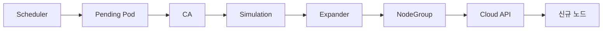
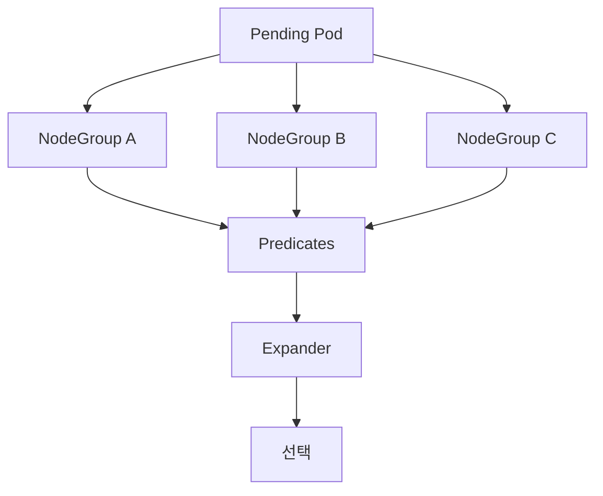

# Cluster Autoscaler

Cluster Autoscaler(이하 **CA**)는 **노드 수를 자동으로 조정**한다. HPA가
Pod를 늘렸는데 스케줄 가능한 노드가 없을 때 노드를 증설하고, 반대로
노드 사용률이 낮으면 노드를 줄인다.

CA는 **NodeGroup 추상화**(AWS ASG, GCP MIG, Azure VMSS, Cluster API
MachineDeployment, OpenStack Magnum 등) 뒤에 cloud provider 인터페이스를
둔다. Karpenter가 AWS·Azure에서 표준으로 부상한 2026 현재에도 **온프레미스
·레거시 NodeGroup 기반·Karpenter provider가 없는 환경**에서는 CA가 여전히
일차 선택지다.

운영자 관점의 핵심 질문은 세 가지다.

1. **scale-up이 왜 안 되는가** — 시뮬레이션 실패인지, 한도 초과인지, backoff인지
2. **scale-down이 왜 너무 공격적/소극적인가** — 사용률 기준·타이밍·PDB
3. **온프레에서 어떻게 빠른 반응을 만드는가** — over-provisioning 버퍼

> 관련: [HPA](./hpa.md) · [VPA](./vpa.md)
> · [Karpenter](./karpenter.md) · [KEDA](./keda.md)
> · [Priority·Preemption](../scheduling/priority-preemption.md)

---

## 1. 2026 현재의 위치 — CA · Karpenter · NAP

| 측면 | Cluster Autoscaler | Karpenter | GKE NAP |
|---|---|---|---|
| 추상화 | NodeGroup 전제 | Pod 요구 → 인스턴스 직접 매칭 | 클러스터가 자동으로 NodeGroup 생성 |
| scale-up 지연 | 2–5분 (ASG/MIG 경로) | 수십 초 가능 | 수십 초 |
| 온프레 지원 | **Cluster API 경유 일차 지원** | CAPI provider experimental, 프로덕션 미준비 | 해당 없음 |
| 성숙도 | 매우 안정, 20+ provider | AWS/Azure GA | GKE 전용 |
| SIG | SIG Autoscaling | SIG Autoscaling | GCP |

2026년 현재 AWS/Azure 신규 클러스터의 기본 권장은 Karpenter로 이동했지만,
**CA가 여전히 유리한 상황**은 명확하다.

- **온프레미스**(Cluster API + Metal3·vSphere·OpenStack) —
  Karpenter의 CAPI provider는 experimental 단계
- **NodeGroup 기반 IaC가 이미 굳어진 레거시** (Terraform 모듈, ASG 정책)
- **Karpenter provider가 없는 클라우드** (OCI, Hetzner, OVH 등)
- **인스턴스 타입 고정이 컴플라이언스·운영 정책으로 강제**될 때

## 2. 아키텍처 — 한눈에



### 배포 형태

- `kube-system`의 **단일 Deployment** — 실제 의사결정은 리더 하나만
- HA 시 `--leader-elect` + replicas ≥ 2 → active/standby
- `priorityClassName: system-cluster-critical` 권장
- 포트 `:8085`에서 `/metrics` · `/health-check`

### 동작 루프 (`--scan-interval`, 기본 10초)

한 루프 안에서 순서대로:

1. 노드 상태 스냅샷 수집
2. `Pending` + `Unschedulable` Pod 수집
3. **scale-up 시뮬레이션** — 각 NodeGroup에 가상 노드 1대 추가 시
   Pending Pod가 스케줄되는지 scheduler predicate 실행
4. 후보 있으면 **expander**로 선택 → cloud provider API 호출
5. **scale-down 평가** — 후보 노드의 Pod가 다른 노드에 재배치 가능한지
6. 가능하면 cordon → drain → 삭제

### 핵심 플래그 (기동 시)

| 플래그 | 기본값 | 의미 |
|---|---|---|
| `--cluster-name` | — | AWS ASG 태그 검증 등에 사용 |
| `--cloud-provider` | — | `aws`·`gce`·`azure`·`clusterapi` 등 |
| `--scan-interval` | 10s | 루프 주기. 대규모 클러스터는 60s 권장 |
| `--expander` | random | 2장 참조 — `least-waste` 권장 |
| `--leader-elect` | true | HA 대비 |
| `--max-nodes-total` | 0(무제한) | 클러스터 전체 노드 상한 |
| `--cores-total`·`--memory-total` | 0 | 총량 상한 |

**버전 매칭 규칙**: CA 마이너 버전은 K8s 마이너 버전과 **정확히 일치**
(K8s 1.12 이후 확정). 1.35 클러스터에는 `cluster-autoscaler-1.35.x` 만.

---

## 3. NodeGroup 추상화

### 요건

같은 NodeGroup 안의 노드는 **동일 인스턴스 타입 · 동일 라벨/taint ·
동일 allocatable**. CA는 그룹 내 임의 노드 1대를 **템플릿**으로 가정하고
시뮬레이션한다. 이 전제가 깨지면 시뮬레이션이 현실과 어긋나 scale-up
실패·과다 증설이 일어난다.

### 용어 매핑

| 환경 | 용어 |
|---|---|
| GKE | node pool |
| AKS | node pool |
| EKS | managed node group / ASG |
| Cluster API | MachineDeployment / MachineSet / MachinePool |
| OpenStack | Magnum nodegroup |
| 베어메탈 CAPI | Metal3 MachineSet + BMH 풀 |

모두 CA 내부에서는 **NodeGroup 인터페이스** 하나로 수렴.

### 등록 방식 두 가지

```yaml
# 1) 명시 지정
--nodes=0:10:my-ng-a
--nodes=0:10:my-ng-b

# 2) 자동 발견 (AWS 예)
--node-group-auto-discovery=asg:tag=k8s.io/cluster-autoscaler/enabled,k8s.io/cluster-autoscaler/<clusterName>
```

### scale-from-zero

노드 수가 0일 때도 시뮬레이션하려면 **노드 템플릿 라벨**이 필요하다.
실제 노드가 없으니 CA가 어떤 라벨을 가진 노드로 올라올지 모르기 때문.

- **AWS**: ASG 태그 `k8s.io/cluster-autoscaler/node-template/label/<key>=<value>`
- **Cluster API**: `capacity.cluster-autoscaler.kubernetes.io/cpu` ·
  `/memory` · `/ephemeral-disk` · `/maxPods` · `/gpu-count` annotation

이 라벨이 실제와 어긋나면 nodeSelector·affinity Pod이 영원히 Pending.
scale-from-zero 이슈의 1순위 원인.

---

## 4. scale-up 알고리즘

### 트리거 조건

- Pod가 `Pending` + scheduler가 `Unschedulable` 이벤트를 냄
- Pod priority가 **너무 낮으면 트리거 안 함** (GKE 기준 `-10` 미만.
  업스트림도 유사 cutoff. 정확 수치는 버전별 확인)
- preemption 대기 중인 Pod는 트리거 안 함

### 시뮬레이션 → expander → 호출



각 NodeGroup마다 가상 노드 1대를 추가한 뒤 scheduler predicate를
실행한다. 통과한 그룹들이 **후보**, expander가 그중 하나를 선택한다.

### expander 6종

| expander | 동작 | 권장 상황 |
|---|---|---|
| `random` | 무작위 | 후보가 실질적으로 동일할 때 |
| `most-pods` | 신규 노드에 가장 많은 Pending을 수용 가능한 그룹 | nodeSelector로 특정 그룹만 가능한 Pod가 많을 때 |
| `least-waste` | 배치 후 **CPU 낭비가 최소**인 그룹. tie는 Memory | **일반 권장 디폴트**, 혼합 인스턴스에 유리 |
| `price` | 가격 기반 (AWS·GCE 일부) | 비용 민감 |
| `priority` | `cluster-autoscaler-priority-expander` ConfigMap의 정규식 우선순위 | 온디맨드 우선, Spot fallback 등 명시적 정책 |
| `grpc` | 외부 gRPC 서버에 선택 위임 | 커스텀 정책 |

### 체이닝

`--expander=priority,most-pods,least-waste` — 앞 단계가 후보를 좁히면
뒤 단계가 tie-break. 실무에서는 **priority → least-waste** 조합이 흔하다.

### priority ConfigMap 예

```yaml
apiVersion: v1
kind: ConfigMap
metadata:
  name: cluster-autoscaler-priority-expander
  namespace: kube-system
data:
  priorities: |-
    50:
      - .*on-demand.*
    10:
      - .*spot.*
    1:
      - .*
```

숫자가 클수록 우선. 동률이면 random. 매칭 없으면 전체 random.

### 타이밍·한도

| 플래그 | 기본값 | 의미 |
|---|---|---|
| `--max-node-provision-time` | 15m | 신규 노드 Ready 대기 한계, 초과 시 실패 |
| `--max-node-startup-time` (1.35+) | — | 부팅 단계와 provision을 분리, 긴 부팅 베어메탈에 유용 |
| `--new-pod-scale-up-delay` | 0s | Pending 감지 후 대기 (burst 흡수용) |
| `--max-empty-bulk-delete` | 10 | 빈 노드 동시 삭제 수 |
| `--max-total-unready-percentage` | 45 | **초과 시 CA 전체 정지** (안전장치) |
| `--ok-total-unready-count` | 3 | 3대까지는 비율 무시 |

프로비저닝 실패한 NodeGroup은 **backoff**되어 일정 시간 후보에서 빠진다.
`cluster-autoscaler-status` ConfigMap의 `ScaleUp: backoff` 섹션 참고.

### MixedInstancePolicy · Spot 인스턴스

AWS MixedInstancesPolicy처럼 **한 NodeGroup에 여러 인스턴스 타입**을
허용하는 경우, CA는 **첫 번째 타입의 spec을 기준**으로 시뮬레이션한다.
CPU·메모리가 다른 타입을 섞으면 오판한다. 가중치 기반 선택은 CA 쪽에서
지원하지 않으므로 cloud provider 레벨의 가중치 설정에 의존한다.

**Spot 인스턴스 운영** 핵심:

- **존·타입 다양화** — 한 Spot pool 고갈 시 다른 pool로 fallback
- **NodeGroup 분리**: 온디맨드 그룹 + Spot 그룹을 나누고 `priority`
  expander로 온디맨드 우선
- **Node Termination Handler**(AWS·Azure)로 SPOT 회수 이벤트를 받아
  graceful drain — CA는 Spot 회수 자체를 감지하지 못함
- 중요 워크로드는 `karpenter.sh/capacity-type` 같은 Spot 라벨에
  nodeAffinity로 배제 (온디맨드 강제)

### multi-zone · topology

권장 패턴은 **존당 NodeGroup 1개씩 분리** (AWS ASG per-AZ, AKS 존별 pool).

- `--balance-similar-node-groups=true` — 같은 타입·같은 라벨(존 제외)
  그룹들을 scale-up 시 균등하게 증가
- **scale-down은 balance 고려 없음** — 독립적으로 언더유틸 기준 삭제
- StatefulSet + zone-bound PV는 **PV 존에 해당하는 NodeGroup**이 반드시
  확보돼야 함 (max 도달하면 Pending 영구화)

---

## 5. scale-down 알고리즘

### 트리거

노드 사용률은 **request 기반**으로 계산한다(실사용량 아님).

```
utilization = max(
  sum(cpu.requests) / allocatable.cpu,
  sum(memory.requests) / allocatable.memory
)
```

**분자에서 기본 제외되는 Pod**:
- DaemonSet Pod (`--ignore-daemonsets-utilization=true`일 때)
- mirror Pod (`--ignore-mirror-pods-utilization=true`일 때)

기본값은 두 플래그 모두 **false**. rook-ceph·Cilium·DataDog agent 등
무거운 DaemonSet을 돌리는 클러스터에서는 이 플래그를 **반드시 `true`**로
켜야 한다. 안 그러면 DS만으로도 utilization이 0.5를 넘어 노드가
**영원히 scale-down 후보가 되지 않는다**.

- `utilization < --scale-down-utilization-threshold`(기본 **0.5**) 이면 후보
- `--scale-down-unneeded-time`(기본 **10분**) 동안 지속되면 대상
- Pod들이 다른 기존 노드에 재배치 가능한지 시뮬레이션 통과해야 삭제

### 타이밍

| 플래그 | 기본값 | 의미 |
|---|---|---|
| `--scale-down-utilization-threshold` | 0.5 | 이하면 후보 |
| `--scale-down-unneeded-time` | 10m | 후보 상태 지속 시간 |
| `--scale-down-unready-time` | 20m | Unready 노드 삭제까지 |
| `--scale-down-delay-after-add` | 10m | scale-up 직후 보류 |
| `--scale-down-delay-after-delete` | = scan-interval | 다음 삭제까지 |
| `--scale-down-delay-after-failure` | 3m | 실패 후 재시도까지 |
| `--max-graceful-termination-sec` | 600 | CA 자체 drain 대기 한계 (Pod `terminationGracePeriodSeconds`와 독립) |

### scale-down을 **막는** 조건

| 조건 | 예외 |
|---|---|
| `kube-system` 네임스페이스 Pod | PDB 있거나 `safe-to-evict: "true"`면 OK |
| 컨트롤러 없는 naked Pod | — |
| 로컬 스토리지(`emptyDir`·`hostPath`) 사용 | `safe-to-evict: "true"`면 OK |
| 제한적 PDB (`disruptionsAllowed=0`) | — |
| Pod annotation `safe-to-evict: "false"` | — |
| Node annotation `scale-down-disabled: "true"` | — |

이 중 하나라도 걸린 노드는 **영원히 줄지 않는다**. 실무에서 "CA가
이상하게 scale-down을 안 하네"의 절반 이상이 이 조건 때문이다.

### PDB 주의 (1.34까지)

PDB + Topology Spread(`maxSkew=2` 등) 조합 시 `disruptionsAllowed > 0`
인데도 scale-down이 거절되는 케이스가 보고됐다(autoscaler#9111).
크리티컬 워크로드에 Topology Spread를 쓰는 환경은 release notes 추적.

---

## 6. 핵심 Annotation

| Annotation | 적용 대상 | 효과 |
|---|---|---|
| `cluster-autoscaler.kubernetes.io/safe-to-evict: "true"` | Pod | 로컬스토리지·kube-system 제약 무시하고 evict 허용 |
| `cluster-autoscaler.kubernetes.io/safe-to-evict: "false"` | Pod | 해당 Pod 있는 노드는 **절대 scale-down 안 됨** |
| `cluster-autoscaler.kubernetes.io/scale-down-disabled: "true"` | Node | 이 노드 scale-down 대상 영구 제외 |
| `cluster-autoscaler.kubernetes.io/enable-ds-eviction: "true"` | DaemonSet Pod | scale-down 시 DS Pod도 정상 evict |

### Cluster API 통합용

```yaml
metadata:
  annotations:
    cluster.x-k8s.io/cluster-api-autoscaler-node-group-min-size: "0"
    cluster.x-k8s.io/cluster-api-autoscaler-node-group-max-size: "10"
    capacity.cluster-autoscaler.kubernetes.io/cpu: "8"
    capacity.cluster-autoscaler.kubernetes.io/memory: "32Gi"
    capacity.cluster-autoscaler.kubernetes.io/gpu-count: "1"
```

CAPI의 `MachineDeployment`·`MachineSet`에 이 annotation을 달면 CA가
NodeGroup으로 자동 인식한다.

---

## 7. 온프레미스 (Cluster API)

### 동작 방식

- CA 기동 시 `--cloud-provider=clusterapi`
- Management Cluster의 `MachineDeployment`·`MachineSet`·`MachinePool`에
  min/max annotation이 있으면 자동 NodeGroup 등록
- CA가 `spec.replicas`를 갱신 → CAPI가 인프라 provider(Metal3·vSphere
  ·OpenStack 등)에 Machine 생성 요청

### 베어메탈의 본질적 한계

물리 서버는 **즉각 프로비저닝 불가**. CA scale-up은 "이미 등록된 하드웨어
풀"까지만 유효하다. 실제 랙 장착·OS 설치는 별개 파이프라인(BMO·Metal3
등)이 사전에 해놔야 한다.

Metal3 특화 annotation `metal3.io/autoscale-to-hosts`는 BMH 풀 수에 맞춰
자동으로 MachineSet replicas를 싱크한다.

### Over-provisioning 패턴 — 사실상 필수

온프레에서 "Pending 발생 → 랙에서 서버 꺼내서 꽂기"는 비현실적이다.
**낮은 priority의 pause Pod로 버퍼**를 유지하는 패턴이 표준이다.

```yaml
# 1) 매우 낮은 priority (CA cutoff 기본 -10 보다 작아야 함)
apiVersion: scheduling.k8s.io/v1
kind: PriorityClass
metadata: { name: overprovisioning }
value: -100
description: "Buffer for fast scale-up"
---
# 2) 버퍼 pause Pod
apiVersion: apps/v1
kind: Deployment
metadata: { name: overprovisioning, namespace: default }
spec:
  replicas: 10
  template:
    spec:
      priorityClassName: overprovisioning
      containers:
      - name: pause
        image: registry.k8s.io/pause
        resources:
          requests: { cpu: "1", memory: "2Gi" }
```

동작:

1. 실제 워크로드(priority ≥ 0)는 pause를 **preempt** → 즉시 스케줄
2. 밀려난 pause가 Pending → CA가 scale-up 트리거 → 버퍼 복원
3. 다음 burst 시 또 즉시 preempt 가능

**주의**: 버퍼 크기 = 예측되는 burst 크기. 너무 크면 비용 낭비, 너무
작으면 burst 흡수 실패. 실측 기반 튜닝.

### 로컬 PV·rook-ceph 환경

로컬 디스크 PV(rook-ceph 등)가 노드에 바인딩되면 **CA가 임의로 노드를
못 줄인다**. `safe-to-evict`·PDB·nodeAffinity를 정밀하게 맞춰야 한다.
StatefulSet + local-PV는 특히 `scale-down-disabled: "true"`로 보수적
운영을 권장.

---

## 8. 메트릭 — `/metrics`

| 메트릭 | 타입 | 의미 |
|---|---|---|
| `cluster_autoscaler_errors_total` | counter | 메인 루프 에러 누적 |
| `cluster_autoscaler_cluster_safe_to_autoscale` | gauge (0/1) | 안전 모드 자동 정지 여부 |
| `cluster_autoscaler_unschedulable_pods_count` | gauge | Pending Pod 수 |
| `cluster_autoscaler_unneeded_nodes_count` | gauge | 불필요 판정 노드 수 |
| `cluster_autoscaler_nodes_count` | gauge(state) | ready/unready/starting/unregistered 별 |
| `cluster_autoscaler_scaled_up_nodes_total` | counter | 추가 노드 누적 |
| `cluster_autoscaler_scaled_down_nodes_total` | counter | 삭제 노드 누적 |
| `cluster_autoscaler_failed_scale_ups_total` | counter | scale-up 실패 |
| `cluster_autoscaler_evicted_pods_total` | counter | drain으로 evict |
| `cluster_autoscaler_last_activity` | gauge(activity) | 각 단계 마지막 수행 epoch |
| `cluster_autoscaler_function_duration_seconds` | histogram | 함수별 지연 |
| `cluster_autoscaler_node_deletion_duration_seconds` | histogram (1.35+) | 노드 삭제 소요 |

### 권장 알람 (PromQL)

```promql
# 내부 에러 발생
rate(cluster_autoscaler_errors_total[5m]) > 0

# 안전 모드로 자동 정지됨
cluster_autoscaler_cluster_safe_to_autoscale == 0

# Pending 10분째인데 scale-up 없음
(cluster_autoscaler_unschedulable_pods_count > 0)
  and (increase(cluster_autoscaler_scaled_up_nodes_total[10m]) == 0)

# 루프 멈춤 (1분 이상 메인 활동 없음)
time() - cluster_autoscaler_last_activity{activity="main"} > 60
```

### status ConfigMap

```bash
kubectl -n kube-system get configmap cluster-autoscaler-status -o yaml
```

`Health`·`ScaleUp`·`ScaleDown` 섹션이 각 NodeGroup의 **현재 상태
·backoff 이유·마지막 활동**을 보여준다. 로그보다 먼저 보는 1차 소스.

---

## 9. 트러블슈팅

### Pending Pod인데 scale-up 안 됨

순서대로 점검:

| 순번 | 의심 | 확인 방법 |
|---|---|---|
| 1 | Pod 요구가 **모든 NodeGroup 템플릿 초과** | 이벤트 `pod didn't trigger scale-up` + Pod spec 리소스 |
| 2 | NodeGroup **max 도달** | `cluster-autoscaler-status` |
| 3 | 클러스터 **`--max-nodes-total` 도달** | 로그 `max cluster size reached` |
| 4 | **존 제약 + PV 존 불일치** | PV의 `nodeAffinity` vs NodeGroup 존 |
| 5 | **nodeSelector/affinity/taint 불일치 — 특히 scale-from-zero** | ASG/MachineSet 라벨 태그 확인 |
| 6 | Pod priority가 `expendable-pods-priority-cutoff`(기본 `-10`) 이하 | PriorityClass 값 — 업스트림 공통 |
| 7 | 해당 NodeGroup **backoff 중** | status ConfigMap `ScaleUp: backoff` |
| 8 | `max-total-unready-percentage` 초과 | `cluster_safe_to_autoscale == 0` |
| 9 | **CA와 Karpenter 동시 기동** | Deployment 목록 확인 — 한쪽만 운용 |
| 10 | Pod priority가 **`expendable-pods-priority-cutoff`(기본 `-10`) 이하** | PriorityClass value 확인, over-provisioning Pod는 의도적으로 이 이하 |

### scale-down 너무 소극적

- `utilization-threshold` 너무 낮음 → 후보 자체가 안 나옴
- `unneeded-time` 너무 김
- `delay-after-add` 때문에 최근 scale-up 이후 계속 보류
- kube-system·로컬스토리지·제한 PDB로 drain 불가 → `safe-to-evict: "true"` 검토

### scale-down 너무 공격적

- `utilization-threshold` 너무 높음(임계 **높을수록** 더 많은 노드가
  underutilized로 판정됨 — 방향 주의)
- `unneeded-time`·`delay-after-add` 길게 설정
- 크리티컬 워크로드 PDB 강화
- 선별적으로 Pod에 `safe-to-evict: "false"` 또는 Node에 `scale-down-disabled`

### Node deletion stuck

대개 원인:
- PV detach 실패
- drain 미완료 (finalizer 걸린 Pod)
- DaemonSet drain 설정

확인:

```bash
kubectl describe node <name>     # taints: ToBeDeletedByClusterAutoscaler
                                 #         DeletionCandidateOfClusterAutoscaler
kubectl -n kube-system logs deploy/cluster-autoscaler \
  --tail=200 | grep -i "delete\|drain"
```

`max-graceful-termination-sec` 지나면 강제 삭제 시도.

### 자주 쓰는 명령

```bash
# CA 로그 실시간
kubectl -n kube-system logs deploy/cluster-autoscaler -f

# CA status ConfigMap
kubectl -n kube-system get cm cluster-autoscaler-status -o yaml

# CA 이벤트 필터
kubectl get events --field-selector \
  source=cluster-autoscaler,reason=NotTriggerScaleUp
kubectl get events --field-selector \
  source=cluster-autoscaler,reason=ScaleUp

# 어떤 노드가 삭제 후보인가
kubectl get nodes -o json | jq -r '.items[]
  | select(.spec.taints[]?.key
      | test("ToBeDeletedByClusterAutoscaler|DeletionCandidate"))
  | .metadata.name'
```

---

## 10. 안티패턴

| 안티패턴 | 결과 | 대안 |
|---|---|---|
| NodeGroup을 팀·서비스별로 파편화 | CA 메모리·API 부담, 시뮬레이션 지연 | namespace + nodeSelector/taint로 논리 분리 |
| **CPU/메모리 스펙이 다른 인스턴스 혼용** 한 그룹 | 첫 번째 타입 기준 시뮬레이션 → 오판 | 스펙 동일한 그룹만 묶기 |
| 한 ASG에 **다중 AZ 섞기** + zone-bound PV | PV 존과 NodeGroup 매핑 어긋남 | 존당 NodeGroup 1개 |
| `--scan-interval` 너무 짧게(1–5s) | cloud API rate limit | 기본 10s, 대규모는 60s |
| kube-system 워크로드 replica=1, PDB 없음 | 전체 scale-down 블록 | 핵심 DS·Deployment에 PDB |
| `safe-to-evict: "false"` 전역 남발 | 클러스터가 영원히 줄지 않음 | 선별적으로만 |
| **CA + Karpenter 동시 기동** | 이중 scale-up, 충돌 | 반드시 한쪽만 |
| 과도한 over-provisioning (pause Pod 많음) | 비용 낭비 | 실측 burst 기준 |
| scale-from-zero에 라벨 태그 누락 | nodeSelector Pod 영구 Pending | ASG 태그 또는 CAPI capacity annotation |
| CA 마이너 버전 != K8s 마이너 버전 | API skew, 기동 실패 또는 이상 동작 | 매 업그레이드 시 정합 확인 |

---

## 11. 프로덕션 체크리스트

### 기본
- [ ] CA 마이너 버전 = K8s 마이너 버전 (업그레이드 시 동시)
- [ ] `--cluster-name` 명시
- [ ] `priorityClassName: system-cluster-critical` (kube-system 전용 제한,
  preempt 가능한 점 인지)
- [ ] leader election 활성화, replicas ≥ 2 (active/standby)
- [ ] cloud API 권한 — AWS IRSA·Azure Workload Identity·GCP WI 사용,
  **정적 키 지양**

### NodeGroup 설계
- [ ] **존당 1개씩** 분리 + `--balance-similar-node-groups=true`
- [ ] 각 그룹 스펙 균질 (CPU/메모리/라벨/taint)
- [ ] min/max 현실적 설정, **scale-from-zero** 사용 시 라벨·taint·capacity 모두 검증
- [ ] zone-bound PV·StatefulSet은 PV 존별 NodeGroup 보장
- [ ] Spot 그룹과 온디맨드 그룹 분리, Spot은 Node Termination Handler 필수

### 정책·타이밍
- [ ] expander는 **`least-waste` 기본**, 특수 정책은 `priority,least-waste` 체이닝
- [ ] `--max-nodes-total`·`--cores-total`·`--memory-total` 안전 상한
- [ ] `--max-node-provision-time` 환경 맞게 (클라우드 15m, 온프레는 상향)
- [ ] `--max-node-startup-time` (1.35+) 로 긴 부팅 분리
- [ ] `--scan-interval` 대규모는 60s
- [ ] **`--ignore-daemonsets-utilization=true`** (무거운 DS 환경)
- [ ] `--cordon-node-before-terminating=true` 로 drain 안전성

### 워크로드 정책
- [ ] 핵심 워크로드에 **PDB** 정의
- [ ] 로컬스토리지·kube-system Pod에 **의도적으로** `safe-to-evict` 지정
- [ ] 중요한 노드에 `scale-down-disabled` (선별)
- [ ] DaemonSet drain 정책 (`enable-ds-eviction`)

### 온프레
- [ ] Cluster API provider 기반 구성
- [ ] **over-provisioning pause Pod** 크기 = 실측 burst
- [ ] BMH 풀·Metal3 annotation으로 하드웨어 풀과 sync
- [ ] rook-ceph 등 로컬 PV 환경에서 scale-down 제한

### 관측
- [ ] 5종 이상 알람: `errors_total`, `safe_to_autoscale`, `unschedulable_pods`,
  `last_activity`, `failed_scale_ups`
- [ ] `cluster-autoscaler-status` ConfigMap 대시보드화
- [ ] CA와 Karpenter **동시 기동 금지** 감시

---

## 12. 이 카테고리의 경계

- **노드 수 조정** → 이 글
- **Pod 수 조정 (HPA)** · **Pod 크기 조정 (VPA)** → 인접 글
- **이벤트 기반·scale-to-zero** → [KEDA](./keda.md)
- **NodeGroup 없이 Pod 요구 직접 매칭** → [Karpenter](./karpenter.md)
- **낮은 priority 버퍼**의 preemption 메커니즘 → [Priority·Preemption](../scheduling/priority-preemption.md)
- **zone-bound PV · StatefulSet** → 워크로드/스토리지 섹션
- **Cluster API 자체 상세** → `iac/` 또는 전용 카테고리(미편입)

---

## 참고 자료

- [Kubernetes — Node Autoscaling](https://kubernetes.io/docs/concepts/cluster-administration/node-autoscaling/)
- [Kubernetes — Overprovision Node Capacity](https://kubernetes.io/docs/tasks/administer-cluster/node-overprovisioning/)
- [Cluster Autoscaler — README](https://github.com/kubernetes/autoscaler/blob/master/cluster-autoscaler/README.md)
- [Cluster Autoscaler — FAQ](https://github.com/kubernetes/autoscaler/blob/master/cluster-autoscaler/FAQ.md)
- [CA Releases](https://github.com/kubernetes/autoscaler/releases)
- [Priority Expander Readme](https://github.com/kubernetes/autoscaler/blob/master/cluster-autoscaler/expander/priority/readme.md)
- [Balance Similar Proposal](https://github.com/kubernetes/autoscaler/blob/master/cluster-autoscaler/proposals/balance_similar.md)
- [CA Metrics Source](https://github.com/kubernetes/autoscaler/blob/master/cluster-autoscaler/metrics/metrics.go)
- [Cluster API Provider for CA](https://github.com/kubernetes/autoscaler/blob/master/cluster-autoscaler/cloudprovider/clusterapi/README.md)
- [Cluster API — Autoscaling Task](https://cluster-api.sigs.k8s.io/tasks/automated-machine-management/autoscaling)
- [EKS Best Practices — Cluster Autoscaler](https://docs.aws.amazon.com/eks/latest/best-practices/cas.html)
- [AKS — Cluster Autoscaler](https://learn.microsoft.com/en-us/azure/aks/cluster-autoscaler)
- [GKE — Cluster Autoscaler](https://cloud.google.com/kubernetes-engine/docs/concepts/cluster-autoscaler)

(최종 확인: 2026-04-23)
