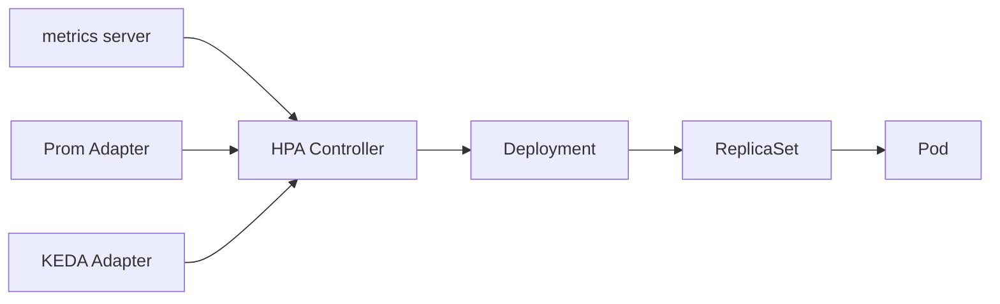
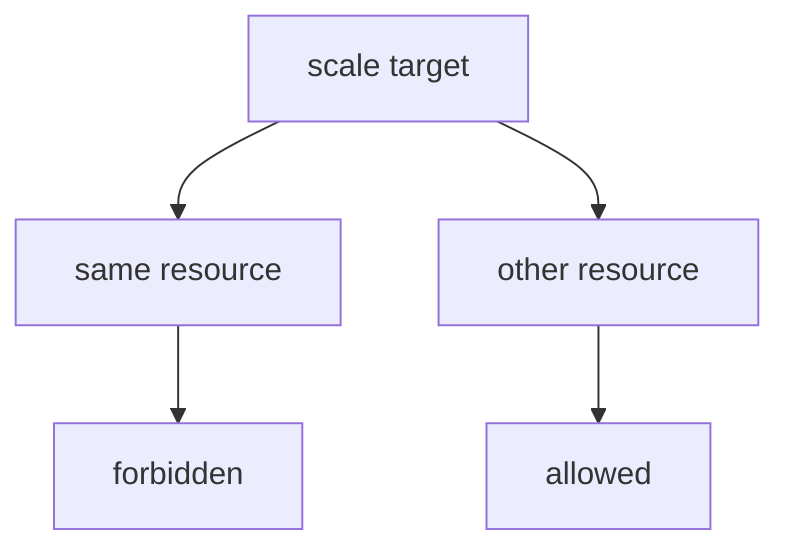
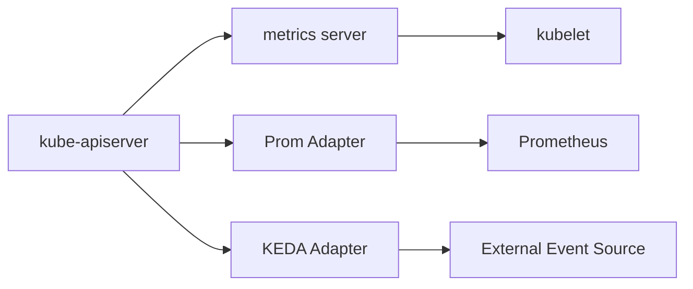

# HPA — HorizontalPodAutoscaler

HPA는 **Pod의 수평 스케일링**(replicas 조정)을 담당하는 컨트롤러다.
`metrics.k8s.io`(metrics-server) 또는 `custom.metrics.k8s.io` ·
`external.metrics.k8s.io`(어댑터 제공)에서 메트릭을 읽어, 주기적으로
`scaleTargetRef`의 `replicas` 필드를 갱신한다.

운영자 관점에서 이 글의 핵심 질문은 "HPA는 **언제 스케일을 안 하는가**"
그리고 "스케일이 의도한 대로 안 될 때 **어디부터 볼까**"다.

> 관련: [VPA](./vpa.md) · [Cluster Autoscaler](./cluster-autoscaler.md)
> · [Karpenter](./karpenter.md) · [KEDA](./keda.md)
> · custom/external 메트릭 → KEDA · Prometheus Adapter

---

## 1. 전체 구조 — 한눈에



- **HPA Controller**: `kube-controller-manager` 내부, 기본 **15초** 주기
- **metrics-server**: CPU·Memory의 **유일한** 공급원 (`metrics.k8s.io`)
- **Custom / External Adapter**: Prometheus Adapter·KEDA·클라우드 어댑터 등이
  `custom.metrics.k8s.io` · `external.metrics.k8s.io`를 구현
- **대상**: `scale` 서브리소스가 있는 워크로드 (Deployment, StatefulSet,
  ReplicaSet, ReplicationController, custom resource with `/scale`)

### 컨트롤러 루프 파라미터

| 플래그 (kube-controller-manager) | 기본값 | 의미 |
|---|---|---|
| `--horizontal-pod-autoscaler-sync-period` | 15s | HPA 재계산 주기 |
| `--horizontal-pod-autoscaler-tolerance` | 0.1 | 스케일 억제 임계(10%) |
| `--horizontal-pod-autoscaler-downscale-stabilization` | 5m | scaleDown 기본 안정화 |
| `--horizontal-pod-autoscaler-initial-readiness-delay` | 30s | Pod ready 대기 |
| `--horizontal-pod-autoscaler-cpu-initialization-period` | 5m | CPU 메트릭 초기화 대기 |

---

## 2. API 버전 정리

| 버전 | 상태 | 비고 |
|---|---|---|
| `autoscaling/v1` | GA (유지) | CPU만 스케일, 단순 필드 |
| `autoscaling/v2beta1` | **서빙 중단 (1.25)** | 잔존 시 즉시 교체 |
| `autoscaling/v2beta2` | **서빙 중단 (1.26)** | 잔존 시 즉시 교체 |
| `autoscaling/v2` | **GA (1.23)** — 현재 표준 | 모든 신규 기능 여기에 |

**신규 작성은 항상 `autoscaling/v2`**. 구형 Helm 차트·오래된 Operator가
`v2beta2`를 쓰고 있으면 업그레이드 블로커가 되므로 사전 점검 대상.

---

## 3. 핵심 계산 공식

```
desiredReplicas = ceil[ currentReplicas × ( currentMetricValue / desiredMetricValue ) ]
```

### Utilization은 평균의 평균이 아님

`Resource` 타입의 `Utilization` 계산은 **Pod별 사용률의 산술평균이
아니다**. 공식은 다음과 같다.

```
Utilization = sum(pod_usage) / sum(pod_request)
```

즉 요청량이 큰 Pod의 사용률이 더 큰 가중치를 가진다. 메인 컨테이너 +
가벼운 사이드카(로그 수집·프록시)가 같이 있으면 **사이드카 request가
분모를 키워** Utilization이 희석된다. 이때 `ContainerResource`로
메인 컨테이너만 기준 삼는 편이 정확하다.

### 계산 규칙

- `|1.0 - (current/desired)| ≤ tolerance` 면 **스케일 안 함**(기본 10%)
- **Ready가 아닌 Pod는 분자·분모에서 제외** — 초기화 중 Pod가 0% CPU로
  평균을 끌어내리는 피드백 루프 방지
- `--horizontal-pod-autoscaler-cpu-initialization-period`(기본 5분) 동안은
  CPU 메트릭 신뢰도 낮다고 보고 **무시되거나 보수적으로** 처리

### `initial-readiness-delay` vs `cpu-initialization-period`

둘 다 "기동 직후 Pod를 스케일 계산에서 어떻게 다룰지"를 정하지만 **대상이
다르다**.

| 플래그 | 기본값 | 대상 | 의미 |
|---|---|---|---|
| `--horizontal-pod-autoscaler-initial-readiness-delay` | 30s | **한 번도 Ready였던 적 없는 Pod** | 기동 후 이 시간까지는 "초기화 중"으로 간주 |
| `--horizontal-pod-autoscaler-cpu-initialization-period` | 5m | **Ready 이후에도 CPU 메트릭이 이 기간 내면** | CPU만 특별 취급 (값 신뢰 낮다고 판단) |

운영자가 "기동 직후 Pod가 왜 스케일 계산에서 빠지는가"를 진단할 때 이
둘을 혼동하면 오판한다. 장기 warm-up이 필요한 JVM·Python 서비스는
`cpu-initialization-period`를 늘리거나, **readinessProbe가 실제로 ready인
시점**에 True가 되도록 설계해야 한다.

### 여러 메트릭 — `max()` 규칙

여러 메트릭을 정의하면 **각 메트릭별로 desiredReplicas를 계산한 후 최대값**을
선택한다. "어느 한 메트릭이라도 스케일 업이 필요하면 업, 모두 다운이어야
다운"이라는 보수적 동작이다.

```yaml
metrics:
- type: Resource
  resource:
    name: cpu
    target: { type: Utilization, averageUtilization: 60 }
- type: External
  external:
    metric: { name: kafka_lag }
    target: { type: AverageValue, averageValue: "100" }
# desiredReplicas = max(cpu 기반, kafka_lag 기반)
```

이 max 동작은 **메트릭 소스 한쪽 장애 시 자연스러운 fallback** 역할도 한다.

---

## 4. 메트릭 소스 5종

| 타입 | API | 용도 | target 종류 |
|---|---|---|---|
| `Resource` | `metrics.k8s.io` | Pod 평균 CPU·Memory | Utilization, AverageValue |
| `ContainerResource` | `metrics.k8s.io` | **특정 컨테이너만** (사이드카 제외) | Utilization, AverageValue |
| `Pods` | `custom.metrics.k8s.io` | Pod당 custom metric 평균 | AverageValue |
| `Object` | `custom.metrics.k8s.io` | 단일 객체 metric (Ingress RPS 등) | Value, AverageValue |
| `External` | `external.metrics.k8s.io` | 클러스터 외부 metric (Kafka lag 등) | Value, AverageValue |

### `ContainerResource` — 1.30 GA

메인 컨테이너만 기준으로 스케일을 결정하고 로그 수집 사이드카·프록시 등을
제외할 때 필수. `Resource`는 Pod 평균을 쓰므로 사이드카가 가벼우면
**CPU가 희석되어 스케일 타이밍이 늦어진다**.

```yaml
metrics:
- type: ContainerResource
  containerResource:
    name: cpu
    container: app                     # 메인 컨테이너 이름
    target: { type: Utilization, averageUtilization: 70 }
```

### `Object` vs `Pods` vs `External`

| 기준 | `Pods` | `Object` | `External` |
|---|---|---|---|
| 측정 대상 | Pod 집합 (labelSelector) | 단일 K8s 리소스 | 클러스터 외부 |
| 전형 예 | Pod당 RPS, connection 수 | Ingress·Service의 RPS, queue | Kafka lag, SQS depth |
| API 제공자 | Prometheus Adapter 등 | 동일 | KEDA, 클라우드 어댑터 |
| 평균/합계 | **평균만** | Value/AverageValue | 둘 다 |

---

## 5. `behavior` 블록 — 스케일 속도 제어

`autoscaling/v2`의 핵심은 `behavior`. 기본값으로도 돌지만, 대형 배포는
**반드시** 튜닝한다.

```yaml
behavior:
  scaleUp:
    stabilizationWindowSeconds: 0
    selectPolicy: Max
    policies:
    - type: Percent
      value: 100
      periodSeconds: 15
    - type: Pods
      value: 4
      periodSeconds: 15
  scaleDown:
    stabilizationWindowSeconds: 300
    selectPolicy: Max
    policies:
    - type: Percent
      value: 100
      periodSeconds: 15
```

### 필드

| 필드 | 의미 | 범위 |
|---|---|---|
| `stabilizationWindowSeconds` | 지난 윈도우 동안 추천값 중 **대표값 선택** | 0–3600 |
| `policies[].type` | `Percent` / `Pods` | 둘 중 하나 |
| `policies[].value` | 비율(%) 또는 절대수 | > 0 |
| `policies[].periodSeconds` | 정책 적용 윈도우 | 1–1800 |
| `selectPolicy` | `Max` / `Min` / `Disabled` | Disabled는 방향 전체 차단 |

### 기본값 (behavior 생략 시)

| 방향 | stabilization | policies | selectPolicy |
|---|---|---|---|
| `scaleUp` | **0초** | max(100% / 15s, 4 Pods / 15s) | Max |
| `scaleDown` | **300초** | 100% / 15s | Max |

**해석**:
- scaleUp은 즉시 반응(안정화 0s) — 트래픽 급증에 빠르게
- scaleDown은 **stabilizationWindow 300s로 평활** — policy가 "15초에 최대
  100% 축소"여도 지난 5분 추천값 중 최댓값을 채택하므로 실제로는 급격히
  줄지 않음 (flapping 방지)

### scaleUp 기본값 0초의 위험

"즉시 반응"은 장점이면서 함정이다. 주기적 트래픽(cron·스케줄러·배치
시작)에서 짧은 스파이크가 터지면 **기본값으로는 수백 Pod가 즉시 증설**된
뒤 5분 뒤에 빠진다. 프로덕션에서는 다음 중 하나를 적용한다.

- `scaleUp.policies`에 `Pods` 타입 절대값 상한 부여(예: `10 Pods / 60s`)
- `scaleUp.stabilizationWindowSeconds`를 30–60s로 올려 단기 스파이크 흡수
- 주기적 부하가 확실하면 **사전 warm-up**을 `minReplicas`에 반영

### 반응 시간의 구성

"HPA는 왜 1분 스파이크에 느린가"의 답은 **파이프라인 전체의 지연 합**이다.

| 구간 | 기본값 | 누적 |
|---|---|---|
| metrics-server scrape 주기 | 15s | 15s |
| HPA sync period | 15s | ≤ 30s |
| `scaleUp.policies[].periodSeconds` | 15s | ≤ 45s |
| Pod 기동 + readinessProbe 성공 | 수 초–수십 초 | 60s+ |
| `initial-readiness-delay` | 30s | — |

**P99 반응시간**은 이 합에 가깝다. 극단적으로 빠른 스케일이 필요하면
metrics 파이프라인 전체를 튜닝해야 하며, 보통은 **버퍼 replica** 쪽이
현실적이다.

### stabilization window 동작

- **scaleDown**: 지난 `stabilizationWindowSeconds` 동안 계산된 desired 값
  중 **최댓값**을 채택 → 바닥값에 휘둘리지 않음
- **scaleUp**: `stabilizationWindowSeconds > 0` 으로 두면 지난 윈도우의
  **최솟값**을 채택 → 일시 스파이크에 안 흔들리지만 반응이 늦어짐

### `selectPolicy: Disabled`

- `scaleDown: { selectPolicy: Disabled }` → **절대 축소 안 함** (운영 시
  장애 대비 보수적 워크로드에 쓸 수 있으나 비용 증가)

---

## 6. 1.33–1.35 변화

| 기능 | 1.33 | 1.34 | 1.35 | 메모 |
|---|:-:|:-:|:-:|---|
| **HPAConfigurableTolerance** | Alpha | **Beta (기본 활성)** | Beta | per-HPA tolerance |
| **HPAScaleToZero** | Alpha | Alpha | Alpha | 실무는 KEDA |
| **In-Place Pod Resize** | Beta | Beta | **GA** | VPA·HPA 공존에 영향 |
| **VPA `InPlaceOrRecreate`** | — | Beta | Beta | In-Place 활용 |
| **Sidecar Containers** | GA | GA | GA | `ContainerResource`와 조합 |
| `autoscaling/v2beta1/v2beta2` | 제거됨 | 제거됨 | 제거됨 | 사용 중이면 즉시 교체 |

### HPAConfigurableTolerance (KEP-4951)

**1.34 Beta부터 기본 활성**. per-HPA로 tolerance를 지정할 수 있다. 글로벌
`--horizontal-pod-autoscaler-tolerance=0.1`(10%)은 수백 Pod 규모에서
**수십 Pod의 낭비**로 이어지므로 세밀 제어 수요가 커졌다.

```yaml
behavior:
  scaleUp:
    tolerance: 0                       # 스케일 업은 즉시 (0%)
  scaleDown:
    tolerance: 0.05                    # 스케일 다운은 5% 오차 허용
```

- 타입은 `resource.Quantity` — 숫자형·문자열 모두 허용(`0.05`/`"0.05"`)
- 미설정 시 클러스터 기본값(플래그) 사용
- 전형 패턴: **비대칭 설정** — scaleUp은 민감(0), scaleDown은 둔감(0.05)

### `HPAScaleToZero` — 왜 아직 Alpha인가

1.16 Alpha 도입 이후 6년 넘게 **Alpha 유지**. 이유:
- `Resource` 메트릭은 Pod=0이면 0/request=0 → 영원히 0에서 못 나옴
  (의미 있는 사용 한정)
- scale-to-zero의 **상용 표준은 KEDA** (external 메트릭 + Activation
  임계치)

**결론**: 프로덕션에서 이 feature gate는 켜지 않고, scale-to-zero는 KEDA로.

### In-Place Pod Resize GA (1.35)

VPA의 `InPlaceOrRecreate` 모드(1.34 Beta)가 이 기능을 활용해 **재시작 없이**
수직 스케일한다. HPA와 직접 충돌은 아니지만, VPA가 request를 바꾸는 순간
**HPA의 Utilization 분모가 변함** → 공존 규칙은 여전히 유효(8장 참조).

**1.35 Known Issue**: In-Place Resize GA 직후 kubelet과 스케줄러 간
드문 race condition이 보고됐다. 1.35 초기 클러스터에서 VPA+HPA를
조합하면 보수적으로 운영하고 릴리즈 노트의 후속 패치를 반드시 추적한다.

---

## 7. 상태 — Conditions 3종

HPA 오브젝트의 `status.conditions`는 진단의 1차 소스다.

| Condition | True | False일 때 주요 reason |
|---|---|---|
| `AbleToScale` | 스케일 가능 | `FailedGetScale`, `FailedUpdateScale` |
| `ScalingActive` | 메트릭 계산 성공 | `FailedGetResourceMetric`, `FailedGetPodsMetric`, `FailedGetObjectMetric`, `FailedGetExternalMetric`, `InvalidSelector` |
| `ScalingLimited` | min/max에 묶임 | `TooFewReplicas`, `TooManyReplicas`, `DesiredWithinRange` |

```
$ kubectl describe hpa my-app
...
Conditions:
  Type            Status  Reason                   Message
  AbleToScale     True    ReadyForNewScale         recommended size matches current size
  ScalingActive   True    ValidMetricFound         ...
  ScalingLimited  False   DesiredWithinRange       ...
Events:
  Normal  SuccessfulRescale  ...  New size: 5; reason: cpu resource utilization above target
```

### 해석 가이드

| 증상 | 읽는 곳 | 조치 |
|---|---|---|
| 스케일 자체가 안 됨 | `AbleToScale`, `ScalingActive` | metrics pipeline 전반 |
| `ScalingLimited: True / TooFewReplicas` | `minReplicas`에 고정 | `minReplicas` 재설정 |
| `ScalingLimited: True / TooManyReplicas` | **용량 부족 경고** | `maxReplicas`·노드 확보·CA 연동 |
| `ScalingActive: False` + `FailedGet*Metric` | 메트릭 어댑터 장애 | APIService·adapter 로그 |

---

## 8. VPA와 공존 규칙



### 원칙

**동일 리소스(CPU 또는 Memory)에 HPA + VPA 동시 사용은 금지**.
- HPA: `utilization = usage / request` — **분자**에 작용
- VPA: `request` — **분모**에 작용
- 같은 리소스면 서로 상쇄·발진 (pod 수만 늘었다 줄었다 반복)

### 허용 매트릭스

| VPA 대상 | HPA 대상 | 허용 |
|---|---|---|
| CPU | Memory (Resource) | ✅ |
| Memory | CPU (Resource) | ✅ |
| CPU, Memory | **Custom / External** (RPS, queue) | ✅ **권장** |
| 어떤 리소스 | **같은 리소스** | ❌ |
| VPA `Off`(recommend-only) | 무엇이든 | ✅ |

### In-Place Resize 환경(1.35+)에서의 영향

VPA가 Pod 재시작 없이 request를 바꾸면, HPA가 다음 주기에서 보는
Utilization이 **순간적으로 점프**한다(분모만 변하고 분자는 그대로).

완화책:
- HPA를 `AverageValue`로 구성(분모 영향 배제)
- 또는 HPA를 **Custom/External 메트릭**으로 돌리고 VPA가 resource만 담당

---

## 9. Custom / External 메트릭 아키텍처



| API | 구현체 (예) |
|---|---|
| `metrics.k8s.io` | metrics-server |
| `custom.metrics.k8s.io` | Prometheus Adapter, kube-metrics-adapter, KEDA |
| `external.metrics.k8s.io` | KEDA, Prometheus Adapter(external 모드), 클라우드 어댑터 |

### API Aggregation Layer

kube-apiserver는 `APIService` 오브젝트로 외부 어댑터에 위임한다.

```yaml
apiVersion: apiregistration.k8s.io/v1
kind: APIService
metadata:
  name: v1beta1.custom.metrics.k8s.io
spec:
  service:
    name: prometheus-adapter
    namespace: monitoring
  group: custom.metrics.k8s.io
  version: v1beta1
  groupPriorityMinimum: 100
  versionPriority: 100
```

`kubectl get apiservice | grep metrics` 로 상태 확인. `Available=False` 면
HPA 스케일 실패의 직접 원인.

### Prometheus Adapter — 기본 패턴

```yaml
rules:
- seriesQuery: 'http_requests_total{namespace!="",pod!=""}'
  resources:
    overrides:
      namespace: { resource: namespace }
      pod:       { resource: pod }
  name:
    matches: "^(.*)_total"
    as: "${1}_per_second"
  metricsQuery: "sum(rate(<<.Series>>{<<.LabelMatchers>>}[2m])) by (<<.GroupBy>>)"
```

**rate window 선택 기준**: `rate(...[N])`의 N은 **Prometheus scrape
interval × 4 이상**이어야 안정적이다. scrape가 30s일 때 `[1m]`을 쓰면
샘플 부족으로 NaN이 반환돼 `FailedGetMetric` 루프가 되는 전형적 함정.

### APIService 보안

`APIService`에 **`insecureSkipTLSVerify: true`**가 들어간 클러스터가 흔한데,
이는 MITM 위험을 열어둔 상태다. Kyverno·OPA로 차단하고, adapter는
서명된 인증서(cert-manager + 내부 CA)로 운영한다.

### KEDA — scale-to-zero의 사실상 표준

KEDA는 `ScaledObject`로 70여 개 스케일러(Kafka, RabbitMQ, Prometheus,
CloudWatch, Pub/Sub 등)를 제공하고, 내부적으로 **HPA 오브젝트를 자동
생성**하며 `external.metrics.k8s.io`를 구현한다. `minReplicas: 0`이 실제로
동작한다(Activation threshold 기반).

`cooldownPeriod`(기본 300s)는 **`minReplicaCount: 0`일 때만 의미가 있다**.
`minReplicaCount > 0`에서는 HPA `behavior.scaleDown`이 실제 축소 속도를
제어한다. 상세는 [KEDA](./keda.md).

---

## 10. 실전 설계 — 언제 어떤 메트릭?

| 워크로드 유형 | 1차 메트릭 | 보조 | 주의 |
|---|---|---|---|
| HTTP API (stateless) | RPS(Object/Pods) | CPU(Resource) | P99 지연과 상관 확인 |
| CPU-bound 배치 | CPU (Utilization) | — | `ContainerResource` 사이드카 제외 |
| I/O 대기 워커 | **queue depth (External)** | — | CPU는 낮게 나옴 |
| gRPC 서비스 | in-flight RPC / conn | CPU | connection 재사용률 고려 |
| WebSocket 서버 | **active connections (Object)** | CPU | scaleDown 시 기존 연결 drain |
| 메시지 컨슈머 | **lag (External, KEDA)** | — | scale-to-zero는 KEDA |
| ML 추론 | latency·queue depth | GPU | HPA는 GPU 메트릭 직접 지원 X → 어댑터 |

### 다중 메트릭 권장

- 비즈니스 메트릭(RPS·lag) + 리소스 메트릭(CPU) **병행**
- max 규칙이 자연스러운 **fallback**이 됨
- 메트릭 소스 단일 장애에도 HPA가 완전 정지하지 않음

---

## 11. 안티패턴

| 안티패턴 | 결과 | 대안 |
|---|---|---|
| **I/O-bound 워크로드를 CPU로만 스케일** | 큐 대기 중 CPU 낮음 → 스케일 안 됨 | queue depth external 메트릭 |
| **tolerance 기본 10% 무시** | 메트릭 70→77% 진동 시 스케일 안 함 | 1.35+ `scaleUp.tolerance: "0"` |
| **VPA + HPA 같은 리소스** | 발진 | 다른 리소스 / VPA off / custom 메트릭 |
| **`minReplicas: 0`을 Resource 메트릭으로** | 0에서 빠져나오지 못함 | KEDA(external) 사용 |
| **scaleUp 속도 무제한** | Pod 폭증, 노드 용량 부족, PDB 위반 | `Pods` 타입 policy로 절대값 상한 |
| **`scaleDown.stabilizationWindowSeconds < 60`** | flapping (단기 하락→재증가) | 최소 180s, 권장 300–600s |
| **단일 메트릭** | 소스 장애 시 스케일 완전 중단 | CPU + 비즈니스 메트릭 |
| **`behavior` 미설정 대형 Deployment** | 기본 100%/15s로 폭주 | `Pods` 타입 상한 부여 |
| **Pod에 `requests.cpu` 없이 Resource 메트릭** | `missing request for cpu` 에러 | requests 필수 |
| **`v2beta1/v2beta2` 매니페스트** | 서빙 중단된 API로 무동작 | `autoscaling/v2`로 교체 |
| **`maxReplicas`가 노드 용량보다 큼** | `TooManyReplicas`·스케줄 실패 | CA/Karpenter 동반 + 상한 조정 |
| **readinessProbe 부실** | 초기화 Pod가 분자 오염 | 정확한 probe, `cpu-initialization-period` 신뢰 |

---

## 12. 프로덕션 체크리스트

### 설정
- [ ] 모든 컨테이너에 `resources.requests.cpu`·`requests.memory` 정의
- [ ] `autoscaling/v2` API 사용
- [ ] `minReplicas` ≥ 가용 영역 수 (HA는 **3 이상**)
- [ ] `maxReplicas`는 **노드 용량 + 비용 한도** 기준으로 상한
- [ ] 메트릭 **2개 이상** 병행(비즈니스 + 리소스)
- [ ] 메인 컨테이너만 기준이면 `ContainerResource` 사용

### behavior
- [ ] `scaleDown.stabilizationWindowSeconds` ≥ 180s, 권장 300–600s
- [ ] 대형 배포는 `scaleUp.policies`에 **`Pods` 타입 절대값 상한** 부여
- [ ] 1.35+ 클러스터면 per-HPA tolerance 고려 (scaleUp=0, scaleDown=0.05)
- [ ] `selectPolicy: Disabled`는 **의식적으로**만 사용

### 인프라
- [ ] metrics-server **HA** (replica ≥ 2), 정식 인증서(`--kubelet-insecure-tls` 금지 — MITM 위험)
- [ ] metrics-server `--metric-resolution` 15s · `--kubelet-preferred-address-types` 점검
- [ ] custom/external 어댑터도 HA, `APIService`의 `insecureSkipTLSVerify: false`
- [ ] PDB로 scaleDown 시 가용성 보장
- [ ] Cluster Autoscaler / Karpenter의 용량 정책과 `maxReplicas` 일관성
- [ ] **Topology Spread의 `maxSkew`**가 `maxReplicas`보다 먼저 걸리는 경우
  확인 — zone 2개에 `maxSkew: 1`이면 실제 상한은 `maxReplicas`가 아닌
  **(zone 용량 × 2)**

### 관측
- [ ] kube-state-metrics의 `kube_horizontalpodautoscaler_status_*` 대시보드
- [ ] `ScalingActive=False` 지속 시 알람
- [ ] `SuccessfulRescale` 이벤트와 트래픽 상관 분석
- [ ] scale-up latency (트래픽 급증 → Ready까지) SLO 정의
- [ ] controller-manager HPA 내부 메트릭 수집
  (`horizontal_pod_autoscaler_controller_metric_computation_duration_seconds`,
  `horizontal_pod_autoscaler_controller_reconciliation_duration_seconds`)

### PromQL 예시

```promql
# HPA current / desired replica 델타 (지속 > 0 이면 스케일 수렴 실패)
kube_horizontalpodautoscaler_status_desired_replicas
  - kube_horizontalpodautoscaler_status_current_replicas

# maxReplicas 도달 빈도 — 용량 부족 경보
sum by (horizontalpodautoscaler, namespace) (
  kube_horizontalpodautoscaler_status_current_replicas
  == bool
  kube_horizontalpodautoscaler_spec_max_replicas
)

# HPA reconcile P99 지연
histogram_quantile(0.99,
  sum by (le) (rate(
    horizontal_pod_autoscaler_controller_reconciliation_duration_seconds_bucket[5m])))
```

### VPA 공존
- [ ] 동일 리소스(CPU/Memory) 중복 금지 확인
- [ ] 1.35+ In-Place Resize 쓰면 HPA `AverageValue` 또는 custom 메트릭으로

### KEDA 사용 시
- [ ] `cooldownPeriod`(기본 300s) 적정성
- [ ] Activation 임계치로 scale-to-zero 기대 동작 검증
- [ ] KEDA가 만든 HPA에 **수동 patch 금지** (KEDA가 덮어씀)

---

## 13. 트러블슈팅

| 증상 | 원인 | 진단·조치 |
|---|---|---|
| `unable to get metrics for resource cpu` | metrics-server 미설치/비정상 | `kubectl top nodes` 확인 후 재배포 |
| `FailedGetResourceMetric: missing request for cpu` | Pod에 requests 없음 | Deployment에 requests 추가 |
| `the HPA was unable to compute the replica count` | 메트릭 수집 + Ready Pod 없음 동시 장애 | Pod 로그·probe·metric 파이프 동시 점검 |
| `no metrics returned from resource metrics API` | kubelet 통신/인증 문제 | kubelet 인증서, metrics-server flags |
| `FailedGetExternalMetric` | 어댑터(KEDA/Prom Adapter) 장애 | `kubectl get apiservice`, adapter 로그 |
| `invalid metrics (1 invalid out of 1)` | selector 불일치 | Pod label · metric labels 정합 확인 |
| HPA가 **스케일 자체를 안 함** | tolerance 내 진동 / ready pod 부재 | conditions 확인, tolerance 재조정 |
| 스케일 다운이 늦다 | `scaleDown.stabilizationWindowSeconds` (기본 300s) | 정상 — 튜닝 필요 시 200–180까지 |
| **maxReplicas 도달해도 부하 해소 안 됨** | 용량 부족 또는 real bottleneck이 DB 등 다른 곳 | 노드 용량, DB connection 등 확인 |
| replica 폭증 → `Pending` Pod 다수 | 노드 부족 / PDB·taint로 스케줄 실패 | CA/Karpenter, `scaleUp.policies` 상한 |
| `v2beta2` 매니페스트가 안 먹음 | API 서빙 중단 | `autoscaling/v2`로 교체 |

### 자주 쓰는 명령

```bash
# HPA 상태 빠른 확인
kubectl get hpa -A -o wide

# 이벤트·condition 상세
kubectl describe hpa <name>

# metrics API 직접 조회
kubectl get --raw "/apis/metrics.k8s.io/v1beta1/pods" | jq .
kubectl get --raw "/apis/custom.metrics.k8s.io/v1beta1" | jq .
kubectl get --raw "/apis/external.metrics.k8s.io/v1beta1" | jq .

# APIService 상태 (Available=True 여야 함)
kubectl get apiservice | grep metrics

# kube-controller-manager 로그에서 HPA 추적
kubectl -n kube-system logs -l component=kube-controller-manager | grep -i hpa

# 현재 replica 변화 추적
kubectl get hpa <name> --watch
```

---

## 14. 이 카테고리의 경계

- **HPA**(Pod 수평) → 이 글
- **VPA**(Pod 수직) → [VPA](./vpa.md)
- **노드 확보**(CA / Karpenter) → [Cluster Autoscaler](./cluster-autoscaler.md) · [Karpenter](./karpenter.md)
- **이벤트 기반 · scale-to-zero** → [KEDA](./keda.md)
- **Pod 재시작 없는 리소스 조정(In-Place Resize)** → [Requests·Limits](../resource-management/requests-limits.md)
- **PDB·graceful shutdown** → `reliability/`
- **스케줄링 상세**(Filter/Score/Preempt) → [Scheduler 내부](../scheduling/scheduler-internals.md)
- **custom 메트릭 수집 설계** → `observability/`

---

## 참고 자료

- [Kubernetes — Horizontal Pod Autoscaling](https://kubernetes.io/docs/tasks/run-application/horizontal-pod-autoscale/)
- [Kubernetes — Autoscaling Workloads](https://kubernetes.io/docs/concepts/workloads/autoscaling/)
- [Kubernetes — HPA Walkthrough](https://kubernetes.io/docs/tasks/run-application/horizontal-pod-autoscale-walkthrough/)
- [HorizontalPodAutoscaler v2 API Reference](https://kubernetes.io/docs/reference/kubernetes-api/workload-resources/horizontal-pod-autoscaler-v2/)
- [Resource Metrics Pipeline](https://kubernetes.io/docs/tasks/debug/debug-cluster/resource-metrics-pipeline/)
- [Deprecated API Migration Guide](https://kubernetes.io/docs/reference/using-api/deprecation-guide/)
- [Kubernetes v1.33: HPA Configurable Tolerance](https://kubernetes.io/blog/2025/04/28/kubernetes-v1-33-hpa-configurable-tolerance/)
- [Kubernetes v1.35: In-Place Pod Resize GA](https://kubernetes.io/blog/2025/12/19/kubernetes-v1-35-in-place-pod-resize-ga/)
- [KEP-4951 — Configurable HPA Tolerance](https://github.com/kubernetes/enhancements/tree/master/keps/sig-autoscaling/4951-configurable-hpa-tolerance)
- [KEP-1610 — Container Resource Autoscaling](https://github.com/kubernetes/enhancements/blob/master/keps/sig-autoscaling/1610-container-resource-autoscaling/README.md)
- [KEP-853 — Configurable HPA Scale Velocity](https://github.com/kubernetes/enhancements/tree/master/keps/sig-autoscaling/853-configurable-hpa-scale-velocity)
- [kubernetes-sigs/metrics-server](https://github.com/kubernetes-sigs/metrics-server)
- [kubernetes-sigs/prometheus-adapter](https://github.com/kubernetes-sigs/prometheus-adapter)
- [VPA Known Limitations](https://github.com/kubernetes/autoscaler/blob/master/vertical-pod-autoscaler/docs/known-limitations.md)
- [KEDA — Scaling Deployments](https://keda.sh/docs/latest/concepts/scaling-deployments/)

(최종 확인: 2026-04-23)
