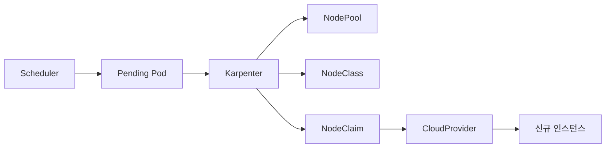
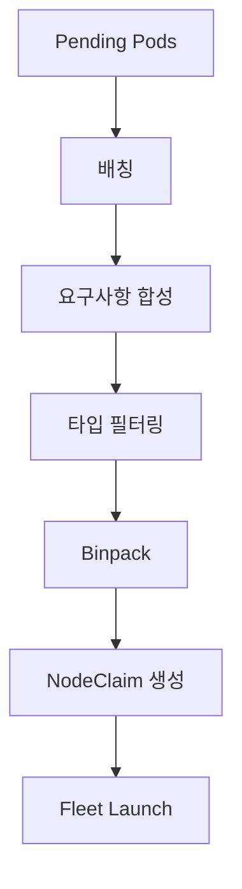

# Karpenter

Karpenter는 **NodeGroup 추상화 없이 Pod 요구사항을 직접 인스턴스 타입에
매칭**해 노드를 프로비저닝한다. Cluster Autoscaler가 "미리 정의된
NodeGroup에서 골라 증설"한다면 Karpenter는 "Pod에 필요한 최적의 인스턴스를
매번 새로 고른다".

CNCF **SIG Autoscaling** 산하의 neutral core(`kubernetes-sigs/karpenter`)
위에 **provider**(AWS·Azure·CAPI·OCI)가 `CloudProvider` 인터페이스를
구현하는 구조. 2026년 현재 AWS와 Azure는 **GA**, Cluster API provider는
**experimental(create/delete만)**, OCI는 커뮤니티 주도.

운영자 관점의 핵심 질문은 세 가지다.

1. **언제 Karpenter를 쓰고 언제 CA를 써야 하는가** — 속도·다양성 vs 온프레·레거시
2. **Consolidation은 어떻게 동작하고 무엇이 막는가** — PDB, preferred affinity, do-not-disrupt
3. **Drift·Expiration·Interruption의 차이** — 무엇이 budget으로 막히고 무엇이 안 막히는가

> 관련: [Cluster Autoscaler](./cluster-autoscaler.md)
> · [HPA](./hpa.md) · [VPA](./vpa.md) · [KEDA](./keda.md)

---

## 1. 전체 구조 — 한눈에



- **upstream(`kubernetes-sigs/karpenter`)**: NodePool·NodeClaim CRD,
  스케줄링 엔진, Disruption 컨트롤러, Termination 컨트롤러 소유
- **provider**: NodeClass CRD(`EC2NodeClass`·`AKSNodeClass` 등)와
  `CloudProvider` 인터페이스 구현
- K8s 버전과 **느슨하게 결합**(CA와 달리 K8s 마이너 버전에 묶이지 않음)

### Provider 성숙도 (2026-04)

| Provider | 상태 | 비고 |
|---|---|---|
| AWS | **GA** | 1.0.0(2024-08) v1 API GA, 가장 성숙 |
| Azure(AKS) | **GA** | NAP(Node Auto Provisioning) 관리형 + self-hosted |
| Cluster API | **experimental** | create/delete만, drift·consolidation 미구현 |
| OCI | 커뮤니티 | upstream 공식 목록에 등재 |
| GCP(GKE) | **미지원** | GKE는 자체 NAP 기능 사용 |

### 최신 버전 (2026-04-23 확인)

| 레포 | 버전 |
|---|---|
| `kubernetes-sigs/karpenter` | v1.11.1 |
| `aws/karpenter-provider-aws` | v1.11.1 |
| `Azure/karpenter-provider-azure` | v1.10.2 |

> AWS provider **v1.8.4는 TopologySpreadConstraint 회귀**가 있어 업그레이드
> 금지. v1.11.0은 CPU 사용량 회귀(issue #2954) 보고 — 도입 전 확인.

---

## 2. Karpenter가 맞는가 — 판단 매트릭스

| 환경 | 1차 선택 | 근거 |
|---|---|---|
| EKS | **Karpenter** | AWS 공식 방향, Fleet API·Spot 처리 성숙 |
| AKS | **Karpenter(NAP)** | Azure 공식, self-hosted도 옵션 |
| GKE | **GKE NAP** | Karpenter GKE provider 없음 |
| 온프레·VMware·OpenStack | **Cluster Autoscaler + CAPI** | Karpenter CAPI provider는 create/delete만 구현 — **consolidation·drift·expiration을 못 얻는다**. 이 기능이 없으면 Karpenter의 핵심 가치가 사라짐 |
| Hetzner·OCI Classic·OVH 등 | **Cluster Autoscaler** | Karpenter provider 없음 |
| 레거시 NodeGroup IaC 심한 환경 | **Cluster Autoscaler** | 마이그레이션 비용 |

**Karpenter의 승부처**: 속도(수십 초), 비용 최적화(자동 consolidation),
인스턴스 다양성(한 NodePool이 수백 타입 동시 고려), 내장 Drift·Spot
interruption.

**CA의 승부처**: 온프레 정식 지원(CAPI), 25+ provider, NodeGroup 기반
레거시와의 자연스러운 결합.

---

## 3. CRD 모델 — NodePool · NodeClass · NodeClaim

### API 그룹

| API | CRD |
|---|---|
| `karpenter.sh/v1` | NodePool, NodeClaim (provider-중립) |
| `karpenter.k8s.aws/v1` | EC2NodeClass |
| `karpenter.azure.com/v1beta1` | AKSNodeClass(Azure) |

### 역할

| CRD | 역할 | v1 이전 이름 |
|---|---|---|
| **NodePool** | 프로비저닝 제약·disruption 정책·limits·weight | `Provisioner`(v1alpha5) |
| **NodeClass** | 클라우드 고유 설정(AMI·subnet·SG·userData·kubelet) | `AWSNodeTemplate` |
| **NodeClaim** | 인스턴스 요청 1건 — 내부 리소스, 불변 | `Machine` |

### v1 API 연대기

- **v1alpha5**(Provisioner/Machine/AWSNodeTemplate) → 사용 중단
- **v1beta1**(NodePool/NodeClaim/EC2NodeClass) → **v1.1.0에서 제거**
- **v1** → 1.0.0(2024-08) GA, 현재 유일 지원 API

### NodeClaim 라이프사이클

3단계 상태 조건: **Launch → Registration → Initialization**

- 사용자가 편집하지 않음 (NodePool 소유)
- NodePool 삭제 시 NodeClaim cascade 삭제 → 인스턴스 종료
- `karpenter.sh/termination` finalizer로 graceful drain
- 등록 실패 **15분 타임아웃** → 삭제 후 재시도

---

## 4. 스케줄링 알고리즘

### 흐름



1. kube-scheduler가 Pending + Unschedulable로 마킹
2. **배칭**: `BATCH_IDLE_DURATION=1s`, `BATCH_MAX_DURATION=10s` 안에 들어온
   Pod 묶음
3. **요구사항 합성**: NodePool requirements ∩ Pod requirements(resources·
   nodeSelector·affinity·topologySpread·tolerations·PV topology)
4. 후보 인스턴스 타입 필터링
5. **Binpacking 시뮬레이션**으로 최적 타입 선택
6. NodeClaim 생성 → CloudProvider가 실제 launch

### Multi-instance 전략 (AWS)

Karpenter가 후보 인스턴스 타입 목록을 EC2 Fleet `CreateFleet` API에
전달하고, Fleet이 **Price Capacity Optimized** 전략으로 실제 launch 타입
결정. Spot은 "가장 싸면서 중단 확률 낮은" 조합.

실제로 한 번에 전달 가능한 `launchTemplateConfigs`·`overrides` 수는 AWS
API 한도 안에서 제한되며, 버전별로 동작이 조금씩 다르므로 정확한 수는
공식 설계 문서·릴리즈 노트 확인.

### `minValues` — flexibility 보장

```yaml
requirements:
- key: karpenter.k8s.aws/instance-family
  operator: Exists
  minValues: 5
```

- 지정 값 이상의 고유 값 후보를 유지해야 프로비저닝 진행
- `MIN_VALUES_POLICY=Strict | BestEffort`(1.6.0+, 기본 Strict)
- **spot-to-spot consolidation은 single-node 교체 시 15개 이상 타입
  flexibility 요구** — race to the bottom 방지

### 선호도(Preferences) 처리

- `preferredDuringScheduling…`, soft anti-affinity, `ScheduleAnyway`
- Karpenter는 선호를 우선 required처럼 취급 → 불가하면 weight 낮은 것부터
  하나씩 완화
- `PREFERENCE_POLICY=Ignore | Respect`(기본 Respect)

---

## 5. Disruption 5종

| 메서드 | 유형 | Budget 적용 | 트리거 |
|---|---|---|---|
| **Consolidation** | graceful | ✅ | 빈 노드 / 언더유틸 |
| **Drift** | graceful | ✅ | NodePool·NodeClass spec 변경 |
| **Expiration** | **forceful** | ❌ | `expireAfter` 경과 |
| **Interruption** | **forceful** | ❌ | Spot 중단·유지보수 이벤트 |
| **Node Auto Repair** | forceful | ❌ | 노드 unhealthy (1.1+ alpha) |

**처리 순서**: Drift → Consolidation (Drift 먼저)

### Consolidation

`consolidationPolicy`:

| 값 | 의미 |
|---|---|
| `WhenEmpty` | 워크로드 Pod 전혀 없는 노드만 |
| `WhenEmptyOrUnderutilized` (기본) | 빈 노드 + 저활용 노드 모두 |

`consolidateAfter`: Pod 스케줄/삭제 후 "조용해진" 뒤 대기 시간. 기본 `0s`,
`Never`는 비활성화.

> ⚠️ **기본 `0s` + `WhenEmptyOrUnderutilized` 조합은 churn 유발**. 스케일
> 아웃 직후 바로 스케일 인되는 flapping이 자주 보고됨(issue #7347).
> 프로덕션은 **30s–5m** 권장.

**3가지 작동 방식**:

1. **Empty Node Consolidation** — 완전히 빈 노드 병렬 삭제
2. **Multi-Node Consolidation** — 2개+ 노드를 더 싼 단일 노드로 대체
3. **Single-Node Consolidation** — 노드 1개를 더 싼 단일 노드로 대체

덜 disruptive한 것부터 우선: Pod 수 적음 → expire 임박 → 낮은 priority
Pod 있음.

**Spot consolidation**: 기본 deletion만. replacement는
`SpotToSpotConsolidation` feature gate가 **기본 OFF**이므로 Helm values
`settings.featureGates.spotToSpotConsolidation=true`로 opt-in 해야 한다.
켠 이후에만 4장의 "15개 이상 타입 flexibility" 조건이 의미를 갖는다.

### Drift

NodeClaim 현재 값이 NodePool·NodeClass spec과 다르면 Drifted 마킹.

- **v1.0에서 Stable 승격** — feature gate 제거
- Drift 감지 대상: `template.spec.requirements`, `subnetSelectorTerms`,
  `securityGroupSelectorTerms`, `amiSelectorTerms` 등
- **Behavioral 필드는 drift 대상 아님**: `weight`, `limits`, `disruption.*`
- **AMI alias 사용 시 자동 drift** → 노드 교체로 보안 패치

### Expiration

- `expireAfter` 기본 **720h(30일)**, `Never`로 비활성화
- **forceful** — 도달하면 budget 무시하고 drain
- `karpenter.sh/do-not-disrupt` + `expireAfter` 조합은 **반드시
  `terminationGracePeriod` 같이 설정** (아니면 노드 영구 스턱)

### Interruption (AWS)

- `--interruption-queue`로 SQS 큐 지정 시 활성화
- EventBridge → SQS로 수신:
  - **Spot Interruption Warning** (2분 전)
  - Scheduled Change Health Events
  - Instance Terminating/Stopping
- 통지 즉시 **병렬로 새 노드 프로비저닝 + 기존 노드 drain**
- Spot Rebalance Recommendation은 기본 **미지원**(NTH와 병용 시 churn↑)

Azure는 Scheduled Events로 eviction 통지 처리.

### Node Auto Repair (1.1+ alpha)

- `NodeRepair=true` feature gate
- kubelet 조건 `Ready=False` 30분, Monitoring Agent 조건 등
- 안전장치: **NodePool unhealthy 노드 20% 초과 시 repair 중단**

---

## 6. Disruption Budgets

```yaml
spec:
  disruption:
    budgets:
    - nodes: "20%"
      reasons: [Empty, Drifted]
    - nodes: "0"
      schedule: "0 9 * * mon-fri"     # 크론 기본 UTC — KST 피크 차단이라면
                                      # `0 0 * * mon-fri`로 9시간 조정
      duration: 8h                    # 분·시 단위
      reasons: [Underutilized]
```

### 계산식

```
percentage: ceil(total × pct) − total_deleting − total_notready
integer   : value − total_deleting − total_notready
```

- 여러 budget이 있으면 **최소값**(가장 제약적) 적용
- **기본값**: 설정 안 하면 `nodes: 10%` 1개
- **forceful(Expiration·Interruption·Repair)은 막지 못함**
- Static NodePool scale은 budget 우회 (PDB만 존중)

### Reasons

`Empty`, `Drifted`, `Underutilized` (CRD 문법). 메트릭 라벨은 1.2.0부터
snake_case(`empty`·`drifted`·`underutilized`).

---

## 7. Capacity Types — Spot · On-Demand · Reserved

라벨 `karpenter.sh/capacity-type`:

| 값 | 의미 | 도입 |
|---|---|---|
| `spot` | spot 인스턴스 | 초기부터 |
| `on-demand` | on-demand | 초기부터 |
| `reserved` | **Capacity Reservation(ODCR·Capacity Blocks)** | 1.3 alpha, 1.6 Beta(기본 ON) |

우선순위: **`reserved` > `spot` > `on-demand`**

### Spot 실패 캐싱

Fleet API가 "capacity unavailable" 응답하면 **타입+존 조합을 3분간 캐시**.
상위 capacity type 불가 시 ms 내로 하위로 fallback.

### AWS 전제

처음 spot을 쓰는 계정이면 1회:

```bash
aws iam create-service-linked-role \
  --aws-service-name spot.amazonaws.com
```

Getting Started CloudFormation이 SQS 큐·EventBridge 규칙을 포함한다.

---

## 8. NodePool 구성 예시

```yaml
apiVersion: karpenter.sh/v1
kind: NodePool
metadata:
  name: default
spec:
  template:
    metadata:
      labels:
        billing-team: platform
    spec:
      nodeClassRef:
        group: karpenter.k8s.aws         # v1: apiVersion 아닌 group+kind
        kind: EC2NodeClass
        name: default
      expireAfter: 720h
      terminationGracePeriod: 48h
      requirements:
      - key: kubernetes.io/arch
        operator: In
        values: ["amd64"]
      - key: karpenter.sh/capacity-type
        operator: In
        values: ["spot", "on-demand"]
      - key: karpenter.k8s.aws/instance-category
        operator: In
        values: ["c", "m", "r"]
        minValues: 2
      - key: karpenter.k8s.aws/instance-family
        operator: Exists
        minValues: 5
      - key: karpenter.k8s.aws/instance-generation
        operator: Gte
        values: ["3"]
  disruption:
    consolidationPolicy: WhenEmptyOrUnderutilized
    consolidateAfter: 30s
    budgets:
    - nodes: "20%"
      reasons: [Empty, Drifted]
    - nodes: "0"
      schedule: "0 9 * * mon-fri"
      duration: 8h
      reasons: [Underutilized]
  limits:
    cpu: "1000"
    memory: 1000Gi
    nodes: "50"
  weight: 10
```

### 주요 포인트

- **`nodeClassRef`**: v1부터 `group` + `kind` 사용 (`apiVersion` 아님)
- **`limits.nodes`**: 1.8.0+, runaway 비용 방지
- **`weight`**: 여러 NodePool이 매칭될 때 높은 weight 우선
- **`replicas`**(Static Capacity, 1.8 alpha): 고정 노드 수 유지,
  consolidation 제외
- 한 NodePool의 `requirements + labels` 합은 **100개 이하**
- Karpenter 확장 operator: 기본 `In/NotIn/Exists/DoesNotExist` +
  **`Gt/Lt/Gte/Lte`**(수치 라벨용)

---

## 9. NodeClass 예시 (AWS EC2NodeClass)

```yaml
apiVersion: karpenter.k8s.aws/v1
kind: EC2NodeClass
metadata:
  name: default
spec:
  amiFamily: AL2023
  amiSelectorTerms:
  - alias: al2023@v20260401          # alias 쓰면 새 AMI 시 자동 drift
  subnetSelectorTerms:
  - tags: { karpenter.sh/discovery: "${CLUSTER_NAME}" }
  securityGroupSelectorTerms:
  - tags: { karpenter.sh/discovery: "${CLUSTER_NAME}" }
  role: "KarpenterNodeRole-${CLUSTER_NAME}"
  metadataOptions:
    httpEndpoint: enabled
    httpTokens: required              # IMDSv2 강제
    httpPutResponseHopLimit: 1        # 컨테이너에서 IMDS 접근 차단
  blockDeviceMappings:
  - deviceName: /dev/xvda
    ebs:
      volumeSize: 100Gi
      volumeType: gp3
      encrypted: true
      kmsKeyID: "arn:aws:kms:..."
  kubelet:
    maxPods: 110
    systemReserved: { cpu: 100m, memory: 100Mi }
    kubeReserved:   { cpu: 200m, memory: 100Mi }
    evictionHard:   { memory.available: 5%, nodefs.available: 10% }
  tags:
    team: platform
```

### selectorTerms 규칙

배열 여러 term: **term 간 OR, term 내 조건 AND**.

### AMI drift

`alias` 또는 `ssmParameter`를 쓰면 새 AMI 릴리즈 시 Karpenter가 자동
Drifted 마킹 → budget 따라 교체 → **보안 패치가 자동 반영**.

### IMDSv2 강제

`httpTokens: required` + `httpPutResponseHopLimit: 1` — 컨테이너에서 IMDS
엔드포인트 접근을 차단해 SSRF 공격 표면 제거. 보안 기본값으로 반드시
설정.

### Kubelet 설정 위치 변화

v1부터 kubelet 설정은 **NodePool → NodeClass로 이동**. provider별로 kubelet
옵션이 다르므로 의도적 분리.

---

## 10. Pod-level 제어

| 주석·필드 | 효과 |
|---|---|
| `karpenter.sh/do-not-disrupt: "true"` | Consolidation·(조건부) Drift 제외 |
| `karpenter.sh/do-not-disrupt`(위) | **Expiration·Interruption은 못 막음** |
| Blocking PDB | voluntary disruption 차단 |
| `terminationGracePeriod`(NodePool) | **PDB·annotation 우회**해서 강제 종료 보장(CVE 패치용) |

운영 원칙:
- CVE·AMI 긴급 패치는 **NodePool `terminationGracePeriod` 설정**으로 보장
- `do-not-disrupt`는 **필요한 Pod에만** — 남발 시 consolidation 무력화

---

## 11. 관측·메트릭

엔드포인트: 서비스는 `:8080`, **Pod 내부 포트는 v1.0부터 `:8000`**.
Pod를 직접 scrape하는 ServiceMonitor는 포트 변경을 반영해야 한다.

### STABLE 레벨 핵심

| 메트릭 | 의미 |
|---|---|
| `karpenter_nodeclaims_created_total` | 생성 NodeClaim (reason, nodepool) |
| `karpenter_nodeclaims_terminated_total` | 종료 NodeClaim |
| `karpenter_nodes_created_total` | 생성 노드 |
| `karpenter_nodes_terminated_total` | 종료 노드 |
| `karpenter_pods_startup_duration_seconds` | **Pod 생성→Running 시간 (SLI)** |
| `karpenter_voluntary_disruption_decisions_total` | disruption 결정 (decision·reason·consolidation_type) |
| `karpenter_scheduler_scheduling_duration_seconds` | 스케줄링 시뮬레이션 소요 |
| `karpenter_build_info` | 버전 정보 |

### BETA (자주 쓰임)

- `karpenter_nodes_allocatable`, `karpenter_nodes_total_pod_requests`
- `karpenter_nodes_system_overhead`
- `karpenter_nodes_termination_duration_seconds`
- `karpenter_voluntary_disruption_eligible_nodes`{reason}
- `karpenter_scheduler_queue_depth`
- `karpenter_pods_state`(high cardinality 주의)

### 권장 대시보드

1. **용량**: 생성/종료, `nodepools_usage` vs `nodepools_limit`
2. **성능 SLI**: `pods_startup_duration`, `scheduler_queue_depth`
3. **Disruption**: `decisions_total` reason별, `eligible_nodes`
4. **비용**: spot 비중·타입 분포(custom exporter)

### PromQL 예시

```promql
# Pod 프로비저닝 P99 지연
histogram_quantile(0.99,
  sum by (le) (rate(
    karpenter_pods_startup_duration_seconds_bucket[5m])))

# Disruption reason별 속도
sum by (reason) (rate(
  karpenter_voluntary_disruption_decisions_total[5m]))

# NodePool limit 도달
karpenter_nodepools_usage / karpenter_nodepools_limit > 0.9
```

---

## 12. 트러블슈팅

### 노드가 안 만들어짐

| 증상 | 확인 |
|---|---|
| `found provisionable pod(s)` 이후 launch 없음 | NodePool requirements ∩ Pod requirements 교집합 |
| `InsufficientCapacity` | 3분 캐시. 대체 타입·존 확보 |
| NodeClass `Ready=False` | Subnet·SG·IAM·AMI selector 결과(`kubectl describe`) |
| IAM role name > 64자 | 이름 축약 |
| 첫 Spot 사용 계정 | service-linked role 1회 생성 |

### Pod가 Pending 유지

- NodePool `limits.cpu/memory/nodes` 초과
- Karpenter 자체 Pod가 스케줄 실패 → replicas=2 + non-Karpenter 노드 확보
- 알 수 없는 라벨 사용 → requirements에 `Exists`로 선언해야 인지

### Consolidation 예상과 다름

- 이벤트 `Unconsolidatable` 확인 — reason:
  - `pdb xxx prevents pod evictions`
  - `preferred Anti-Affinity can prevent consolidation`
- **preferred affinity·topology spread**는 제약 위반 우려로 보류 유발
- blocking PDB·`do-not-disrupt` 점검
- `consolidateAfter` 과도하게 크지 않은지

### Drift 대응

```bash
kubectl get nodeclaim -o json | jq -r '.items[]
  | select(.status.conditions[]?
      | select(.type=="Drifted" and .status=="True"))
  | .metadata.name'
```

- 속도 제어: budget `reasons: [Drifted]`
- 긴급 AMI 업데이트는 `terminationGracePeriod`로 do-not-disrupt·PDB 우회

### Spot interruption 폭주

- SQS 큐 지표(`ApproximateNumberOfMessagesVisible`) 모니터
- 2분 내 drain + 새 노드 — **instance type flexibility 부족이면 실패**
- NodePool `requirements`에 family 다양화 + `minValues` 크게

### 볼륨 한도

- **EBS CSI 드라이버 필수**(in-tree 플러그인은 attachment limit 인식 실패)
- PVC 많은 Pod가 co-locate되어 attach 한도 초과 가능

---

## 13. 안티패턴

| 안티패턴 | 결과 | 대안 |
|---|---|---|
| Pod request 누락·과소 | binpack 오판, OOM/throttle | LimitRange로 request 강제 |
| preferred affinity 과용 | consolidation 억제, 노드 난립 | 꼭 필요한 곳만, required 고려 |
| 단일 instance-family 고정 | Spot 가용성·가격 기회 상실 | C·M·R 3+ family, 3+ generation |
| `expireAfter` + `do-not-disrupt` + `terminationGracePeriod` 미설정 | 노드 영구 스턱 | 3자 세트로 설정 |
| `karpenter-crd` 차트 미사용 | CRD 업그레이드 누락 | 전용 차트로 관리 |
| Karpenter replicas=1 | 단일 장애 | replicas=2 + PDB + Fargate/non-Karpenter 노드 |
| NodePool 중복 매칭 | 예측 불가 선택 | mutually exclusive + weight 명시 |
| Network policy로 webhook 포트 차단 | conversion 실패 | 8000/8001/8081/8443 allow |
| In-tree volume plugin | attach 한도 인식 실패 | CSI 드라이버 |
| `do-not-disrupt` 남발 | consolidation 무력화 | 선별 적용 |

---

## 14. 프로덕션 체크리스트

### 기본
- [ ] Karpenter controller **replicas=2** + leader election + PDB
- [ ] **Controller Pod가 스스로를 consolidate하지 않는 배치** —
  Fargate 프로필, Managed Node Group 전용 pool, 또는 `do-not-disrupt` +
  `nodeSelector`로 static pool 고정 중 하나 반드시 선택
- [ ] **`karpenter-crd` 차트로 CRD 관리** (main `karpenter` 차트는 CRD
  업그레이드 안 함) — 설치 순서: CRD → controller, 업그레이드도 같은 순서
- [ ] IAM — **Controller 역할과 Node 역할을 분리**. AWS는 IRSA 또는
  **EKS Pod Identity**(2024+ 신규 클러스터 권장), Azure는 Workload Identity
- [ ] (AWS) SQS + EventBridge 설정, `--interruption-queue` 활성
- [ ] 첫 Spot 사용 계정은 service-linked role 1회 생성

### NodePool
- [ ] `requirements`에 **instance-family Exists + minValues**로 flexibility
- [ ] `capacity-type` spot + on-demand 둘 다 허용
- [ ] `limits`(cpu·memory·nodes)로 runaway 방지
- [ ] NodePool들은 **mutually exclusive**로 설계

### Disruption
- [ ] Disruption Budgets로 피크 시간 consolidation 차단(`schedule` + `duration`)
- [ ] `expireAfter` + `terminationGracePeriod` 세트
- [ ] `consolidateAfter`는 환경 맞게(기본 0s, burst 잦으면 30–60s)

### NodeClass 보안
- [ ] AMI `alias` 또는 `ssmParameter` 사용(자동 drift로 패치)
- [ ] **IMDSv2 강제**: `httpTokens: required`, `hopLimit: 1`
- [ ] EBS 볼륨 `encrypted: true`, 필요 시 KMS 키
- [ ] subnet·SG selector는 tag 기반(`karpenter.sh/discovery`)

### 관측
- [ ] `pods_startup_duration_seconds` SLO 정의
- [ ] `voluntary_disruption_decisions_total` reason별 대시보드
- [ ] NodeClaim·NodePool Kubernetes Events 수집
- [ ] `nodepools_usage / limit` > 90% 알람

### 공통
- [ ] PDB 남발 금지(consolidation 실질 무력화)
- [ ] LimitRange로 Pod request 하한
- [ ] 업그레이드: staging 검증 → CRD → controller 순서
- [ ] 회귀 패치 추적(예: AWS v1.8.4 금지, v1.11.0 CPU 회귀)

---

## 15. 이 카테고리의 경계

- **Pod 요구 직접 매칭 + consolidation·drift** → 이 글
- **NodeGroup 기반 노드 오토스케일링** → [Cluster Autoscaler](./cluster-autoscaler.md)
- **Pod 수 조정** → [HPA](./hpa.md)
- **Pod 크기 조정** → [VPA](./vpa.md)
- **이벤트 기반·scale-to-zero** → [KEDA](./keda.md)
- **Cluster API 자체** → `iac/` 또는 전용 카테고리(미편입)
- **Spot 회수 대응(NTH)** → 온프레미스는 해당 없음, 클라우드는 provider 문서
- **PDB·Graceful Shutdown** → `reliability/`

---

## 참고 자료

- [Karpenter 공식 문서](https://karpenter.sh/docs/)
- [kubernetes-sigs/karpenter (upstream)](https://github.com/kubernetes-sigs/karpenter)
- [aws/karpenter-provider-aws](https://github.com/aws/karpenter-provider-aws)
- [Azure/karpenter-provider-azure](https://github.com/Azure/karpenter-provider-azure)
- [kubernetes-sigs/karpenter-provider-cluster-api (experimental)](https://github.com/kubernetes-sigs/karpenter-provider-cluster-api)
- [oracle/karpenter-provider-oci (community)](https://github.com/oracle/karpenter-provider-oci)
- [Karpenter — Concepts · Disruption](https://karpenter.sh/docs/concepts/disruption/)
- [Karpenter — Concepts · Scheduling](https://karpenter.sh/docs/concepts/scheduling/)
- [Karpenter — Reference · Metrics](https://karpenter.sh/docs/reference/metrics/)
- [Karpenter — Troubleshooting](https://karpenter.sh/docs/troubleshooting/)
- [Karpenter — Upgrade Guide](https://karpenter.sh/docs/upgrading/)
- [AKS — Node Auto Provisioning](https://learn.microsoft.com/azure/aks/node-autoprovision)
- [CNCF SIG Autoscaling](https://github.com/kubernetes/community/tree/master/sig-autoscaling)

(최종 확인: 2026-04-23)
