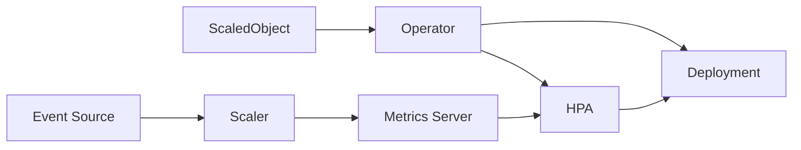
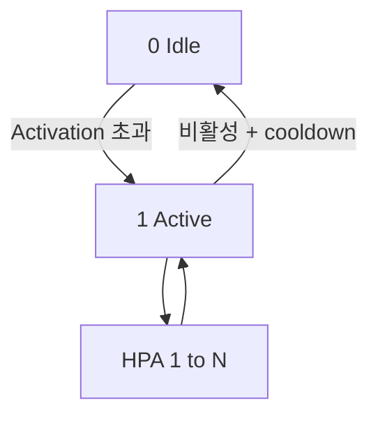

# KEDA — Kubernetes Event-driven Autoscaling

KEDA는 **이벤트 기반 오토스케일링의 사실상 표준**이다. Kafka lag, SQS
depth, Prometheus 쿼리, Cron, Redis Stream 등 70여 개 scaler를 통해
"이벤트량에 맞춰 Pod를 0 ↔ N으로 자동 조정"한다.

내부적으로는 HPA를 **감싸는 오케스트레이터**다. 1 ~ N 구간은 KEDA가
만든 HPA가, **0 ↔ 1 전환은 KEDA Operator의 Activation 로직**이 담당한다.
HPA는 `minReplicas: 0`을 직접 지원하지 않으므로 KEDA가 HPA를 비활성화해
0으로 내린다.

CNCF **Graduated** 프로젝트(2023-08). 2026-04 현재 **v2.19.0** (2026-02).
K8s 1.32–1.34 호환(N-2 정책).

운영자 관점의 핵심 질문은 세 가지다.

1. **언제 ScaledObject, 언제 ScaledJob**
2. **scale-to-zero는 왜 안 내려가는가** — activation·cooldown·idle 구성
3. **Scaler 장애 시 서비스 보호** — fallback 전략

> 관련: [HPA](./hpa.md) · [VPA](./vpa.md)
> · [Cluster Autoscaler](./cluster-autoscaler.md) · [Karpenter](./karpenter.md)

---

## 1. 전체 구조 — 한눈에



### 3개 컴포넌트

| 컴포넌트 | 역할 | 포트 |
|---|---|---|
| **Operator** | `ScaledObject`·`ScaledJob` 감시, HPA 자동 생성, Job 생성, Scaler 실행 루프, Activation 로직(0↔1) | 8080 (metrics) |
| **Metrics Server (Adapter)** | `external.metrics.k8s.io` 제공 — HPA가 이를 조회 | 443 |
| **Admission Webhook** | ScaledObject·ScaledJob 유효성 검증, 동일 타깃 중복 차단 | 9443 |

### HA 한계 — 공식 명시

공식 문서는 **"KEDA does not provide full support for
high-availability"** 로 명시한다.

- **Metrics Server**: 여러 replica 가능, HPA 요청은 Kubernetes Service로
  **로드밸런싱**됨 — 하지만 각 replica가 결국 **leader Operator 하나**에서
  메트릭을 가져오므로 실질 처리량 이득은 제한적
- **Operator**: 2 replica 지원, `--leader-elect=true`(기본)로
  **active-standby**(failover 전용, 성능 개선 아님)

완전 이중화가 아님을 운영 설계에 반영해야 한다.

### 버전 호환 (v2.19)

| 소스 | 값 |
|---|---|
| KEDA | **v2.19.0** (2026-02-02) |
| K8s 최소 | **v1.30 이상** (릴리즈 시점 최신 3개 minor 테스트) |
| 라이선스 | Apache-2.0 |
| CNCF 상태 | **Graduated** (2023-08) |

정확한 테스트 매트릭스는 공식 `operate/cluster/` 문서의 버전 표 참조.

---

## 2. ScaledObject vs ScaledJob

| 항목 | `ScaledObject` | `ScaledJob` |
|---|---|---|
| 대상 | Deployment·StatefulSet·`/scale` CRD | `batch/v1` Job 템플릿 |
| 모델 | 긴 수명 워커가 여러 이벤트 처리 | 이벤트 1건당 Job 1개 |
| 0↔1 전환 | KEDA Operator | — (Job 자연 종료) |
| 1↔N | HPA (KEDA 생성) | KEDA 직접 (Job 생성/정리) |
| 언제 | HTTP 서비스, 스트리밍 컨슈머, 세션 유지 | 장시간 배치, 단건 멱등 처리 |
| 쿨다운 | `cooldownPeriod` | 개념 없음 |

### ScaledJob이 맞는 경우

- **single-message, long-running** 배치 (분–시간 단위 처리)
- 메시지가 **lock·visibility timeout**을 갖는 큐(SQS, RabbitMQ unacked)
- 실패 재시도를 Job `backoffLimit`에 위임하고 싶을 때

---

## 3. ScaledObject 구조

```yaml
apiVersion: keda.sh/v1alpha1
kind: ScaledObject
metadata:
  name: order-consumer
spec:
  scaleTargetRef:
    name: order-consumer
    apiVersion: apps/v1
    kind: Deployment
  pollingInterval: 30
  cooldownPeriod: 300
  idleReplicaCount: 0
  minReplicaCount: 0
  maxReplicaCount: 100
  fallback:
    failureThreshold: 3
    replicas: 6
    behavior: static
  advanced:
    horizontalPodAutoscalerConfig:
      name: order-consumer-hpa
      behavior:
        scaleDown:
          stabilizationWindowSeconds: 120
          policies:
          - type: Percent
            value: 50
            periodSeconds: 60
  triggers:
  - type: kafka
    metadata:
      bootstrapServers: kafka.default:9092
      topic: orders
      consumerGroup: order-consumer
      lagThreshold: "50"
      activationLagThreshold: "10"
    authenticationRef:
      name: kafka-auth
```

### 핵심 필드·기본값

| 필드 | 기본값 | 의미 |
|---|---|---|
| `pollingInterval` | **30s** | Scaler 메트릭 조회 주기 |
| `cooldownPeriod` | **300s** | 마지막 active 이후 scale-to-zero 대기 |
| `initialCooldownPeriod` | 0s | ScaledObject 생성 직후 cooldown 시작 지연 |
| `idleReplicaCount` | 미지정 | `minReplicaCount`보다 작아야 함. **현재 유효 값은 `0`만** |
| `minReplicaCount` | **0** | HPA minReplicas |
| `maxReplicaCount` | **100** | HPA maxReplicas |
| `advanced.restoreToOriginalReplicaCount` | false | SO 삭제 시 replica 원복 여부 |
| `advanced.horizontalPodAutoscalerConfig.behavior` | HPA 기본값 | HPA v2 scaleUp/scaleDown 완전 제어 |
| `advanced.scalingModifiers.formula` | (옵션) | 복수 trigger를 단일 수식으로 합성 (2.13+) |
| `triggers[].name` | (옵션) | 트리거 식별자 — `scalingModifiers.formula`에서 참조 |
| `triggers[].metricType` | `AverageValue` | `AverageValue`·`Value`·`Utilization` |
| `triggers[].useCachedMetrics` | false | polling 주기 동안 캐시 재사용 |

### 다중 trigger의 기본 합성 — MAX

`triggers` 배열에 여러 scaler를 두면 **각 scaler가 별도 external metric으로
HPA에 노출되고, HPA가 `max(desiredReplicas)`를 취한다**. 한 trigger라도
active면 **SO 전체가 active**로 간주돼 0→1 전환이 일어난다.

"여러 메트릭 평균", "A AND B" 같은 합성이 필요하면 `ScalingModifiers`의
`formula`를 쓴다.

### ScalingModifiers — 복수 trigger 수식 합성 (2.13+)

```yaml
triggers:
- type: prometheus
  name: rps                              # name 필수
  metadata: {...}
- type: prometheus
  name: latency_ms
  metadata: {...}
advanced:
  scalingModifiers:
    formula: "(rps + latency_ms) / 2"    # 두 메트릭 평균
    target: "30"
    activationTarget: "10"
    metricType: AverageValue
```

- formula 결과는 **단일 composite metric**으로 HPA에 전달
- trigger에 `name` 필수 (formula에서 참조)
- 운영에서 "A는 무시하고 B만 볼 때가 있다" 같은 조건부 합성도 가능

---

## 4. Scale-to-Zero 메커니즘

KEDA의 스케일 상태는 두 단계로 나뉜다.



| 단계 | 담당 | 로직 |
|---|---|---|
| **Activation Phase** (0 ↔ 1) | KEDA Operator | `IsActive()` — scaler의 `activation<Threshold>` **초과 시**에만 true |
| **Scaling Phase** (1 ↔ N) | HPA (KEDA 생성) | 일반 HPA 동작, `behavior`로 제어 |

### `activationThreshold`는 per-scaler

scaler마다 `<metric>Threshold`(HPA가 쓰는 값)와 **`activation<metric>Threshold`**
(활성화 경계)가 짝으로 있다.

- Kafka: `lagThreshold` + `activationLagThreshold`
- Prometheus: `threshold` + `activationThreshold`
- SQS: `queueLength` + `activationQueueLength`

**주의**: `activation*`은 **초과(>)** 시에만 활성화. 같거나 작으면 idle.
`activation`을 `threshold`와 같거나 크게 두면 영원히 활성화 안 된다.

### 왜 0으로 안 내려가는가 — 체크 순서

1. `minReplicaCount: 0` 인가
2. `idleReplicaCount`가 설정돼 있다면 `0`인가
3. `cooldownPeriod` 경과했는가
4. `activationThreshold`가 현재 메트릭보다 **큰가** (미만이어야 비활성)
5. 다른 트리거가 계속 active 상태를 보내고 있지 않은가

### `idleReplicaCount` — 언제 쓰나

0 대신 **idle 기준값**을 유지하고 싶을 때. 하지만 공식 문서는 "현재 유효
값은 `0`만"이라 명시. 즉, **1+ idle이 필요하면 `minReplicaCount: 1+`를
쓴다**.

---

## 5. ScaledJob 구조

```yaml
apiVersion: keda.sh/v1alpha1
kind: ScaledJob
metadata:
  name: image-processor
spec:
  jobTargetRef:
    parallelism: 1
    completions: 1
    backoffLimit: 3
    activeDeadlineSeconds: 600
    template:
      spec:
        containers:
        - name: processor
          image: my/processor:1.0
        restartPolicy: OnFailure
  pollingInterval: 30
  successfulJobsHistoryLimit: 100
  failedJobsHistoryLimit: 100
  maxReplicaCount: 50
  rollout:
    strategy: gradual
  scalingStrategy:
    strategy: accurate
  triggers:
  - type: aws-sqs-queue
    metadata:
      queueURL: https://sqs.ap-northeast-2.amazonaws.com/1234/jobs
      queueLength: "5"
      activationQueueLength: "2"
    authenticationRef:
      name: sqs-auth
```

### `scalingStrategy`

| 전략 | 계산 | 용도 |
|---|---|---|
| `default` | `maxScale - runningJobCount` | 일반 |
| `custom` | 튜닝 파라미터 지정 | 특수 |
| **`accurate`** | **잠금(locked) 메시지를 큐 길이에서 제외** | **중복 Job 방지 표준** (SQS 가시성, RabbitMQ unacked) |
| `eager` | `maxReplicaCount`까지 슬롯 즉시 점유 | 지연 민감 |

### `rollout.strategy`

- `default`: 기존 Job 모두 종료하고 새 템플릿 적용
- `gradual`: 기존 Job은 끝날 때까지 유지

진행 중인 Job이 쪼개지면 안 되는 환경은 `gradual`이 안전.

---

## 6. 주요 Scaler (v2.19 카테고리)

| 카테고리 | 대표 scaler |
|---|---|
| **Messaging** | Apache Kafka, Apache Pulsar, RabbitMQ, NATS JetStream, IBM MQ, ActiveMQ·Artemis, Solace |
| **Cloud Queue** | AWS SQS·Kinesis, GCP Pub/Sub·Cloud Tasks, Azure Service Bus·Event Hubs·Storage Queue |
| **Database** | PostgreSQL, MySQL, MSSQL, MongoDB, Cassandra, Elasticsearch |
| **Cache / Stream** | Redis (Lists·Streams·Cluster·Sentinel) |
| **Metrics / Monitoring** | Prometheus, Datadog, New Relic, Dynatrace, CloudWatch, Stackdriver, Splunk, Loki |
| **Storage** | Azure Blob, GCP Storage, OpenStack Swift |
| **Resource** | CPU, Memory, **Kubernetes Resource (v2.19 신규)** |
| **Scheduling** | Cron |
| **CI/CD** | GitHub Runner, Azure Pipelines, Temporal, Forgejo |
| **기타** | External(gRPC), External Push, Selenium Grid |
| **HTTP (Add-on)** | KEDA HTTP Add-on (별도 프로젝트, Beta) |

2026-04 기준 **70+ scaler**. 공식 목록은 `keda.sh/docs/<ver>/scalers/`에서
확인.

### External Scaler — 직접 구현 (gRPC)

원하는 메트릭을 내장 scaler가 제공하지 않으면 **External Scaler**로 직접
구현한다. gRPC 서버 하나가 다음 4개 RPC를 구현:

| RPC | 목적 |
|---|---|
| `IsActive` | 0↔1 활성화 판단 |
| `GetMetricSpec` | 이 scaler가 노출하는 메트릭 정의 |
| `GetMetrics` | 현재 메트릭 값 반환 |
| `StreamIsActive` | **External-Push 전용** — 활성화 상태를 KEDA로 밀어넣는 장수명 스트림 |

`type: external` 과 `type: external-push` 를 각각 `triggers`에 선언.
외부 시스템이 polling 비용이 크거나 push 이벤트 기반일 때
`external-push`가 적합.

### CloudEventSource — 이벤트 emit 통합

KEDA 2.10+는 `eventing.keda.sh/v1alpha1` `CloudEventSource` CRD로
**KEDA 이벤트**(ScaledObjectFallbackActivated 등)를 HTTP·Azure Event Grid
등 싱크로 내보낸다. 알림 파이프라인(웹훅 → 브로커 → 워크플로) 표준화에
유용. `authenticationRef`로 TriggerAuthentication 재사용.

---

## 7. TriggerAuthentication

scaler는 외부 시스템 자격증명이 필요하다. 민감 정보를 ScaledObject에서
분리해 **TriggerAuthentication** CRD로 별도 관리한다.

| 범위 | CRD |
|---|---|
| 네임스페이스 | `TriggerAuthentication` |
| 클러스터 전역 | `ClusterTriggerAuthentication` |

### 지원 secret 소스 (v2.19)

| 방식 | 쓰임 |
|---|---|
| `secretTargetRef` | K8s Secret 참조 |
| `env` | 컨테이너 환경변수 참조 |
| `hashiCorpVault` | Vault(token·K8s auth) |
| `azureKeyVault` | Azure Key Vault |
| `gcpSecretManager` | GCP Secret Manager |
| `awsSecretManager` | AWS Secrets Manager |
| `boundServiceAccountToken` | SA 토큰 바인딩 |
| **file-based**(v2.19) | 마운트 파일 (ClusterTriggerAuthentication 전용) |

### Pod Identity

`podIdentity.provider`: `azure-workload`, `aws`(IRSA), `aws-eks`(Pod
Identity), `gcp`(Workload Identity). **v2.15에서 AAD Pod Identity와
AWS-KIAM은 제거됨**.

### 예시

```yaml
apiVersion: keda.sh/v1alpha1
kind: TriggerAuthentication
metadata:
  name: kafka-auth
  namespace: apps
spec:
  secretTargetRef:
  - parameter: sasl
    name: kafka-secret
    key: sasl
  - parameter: username
    name: kafka-secret
    key: username
  - parameter: password
    name: kafka-secret
    key: password
```

---

## 8. HPA `behavior` 통합

KEDA 2.x는 `advanced.horizontalPodAutoscalerConfig.behavior`로 **HPA v2
policy를 그대로** 제어.

```yaml
advanced:
  horizontalPodAutoscalerConfig:
    behavior:
      scaleUp:
        stabilizationWindowSeconds: 0
        policies:
        - type: Percent
          value: 100
          periodSeconds: 15
        - type: Pods
          value: 4
          periodSeconds: 15
        selectPolicy: Max
      scaleDown:
        stabilizationWindowSeconds: 300
        policies:
        - type: Percent
          value: 50
          periodSeconds: 60
```

**주의**: scale-to-zero(0↔1)는 KEDA Operator가 담당하므로 `scaleDown`
policy는 **1 이상 구간**에만 적용된다.

---

## 9. Fallback — Scaler 장애 방어

Scaler가 연속 `failureThreshold`회 실패하면 fallback 활성화, 지정
replica로 고정.

```yaml
fallback:
  failureThreshold: 3
  replicas: 6
  behavior: static          # v2.18+: Value metricType도 지원
```

> ⚠️ **제약**: `fallback`은 trigger `metricType`이 **`AverageValue` 또는
> `Value`일 때만** 동작한다. **`Utilization`에서는 적용 안 됨** — "왜
> fallback이 안 먹히지"의 최빈 원인.

### `behavior` 옵션

| 값 | 동작 |
|---|---|
| `static`(기본) | `replicas` 값으로 고정 |
| `currentReplicas` | 현재 수 유지 |
| `currentReplicasIfHigher` | 현재가 크면 유지, 작으면 `replicas` |
| `currentReplicasIfLower` | 반대 |

### 언제 중요한가

- **Datadog·Prometheus 에이전트 장애** — 메트릭 소스 다운 시 기본값으로
  안전한 replica 유지
- Scaler가 외부 시스템에 의존하면 반드시 fallback 설정 — 없으면 Scaler
  실패 시 HPA 계산 불가 → 서비스 불안정

관련 이벤트: `ScaledObjectFallbackActivated` / `…Deactivated`.

---

## 10. Pause / Resume

| 어노테이션 | 동작 |
|---|---|
| `autoscaling.keda.sh/paused: "true"` | 현재 replica에서 **즉시 일시정지** (2.13+) |
| `autoscaling.keda.sh/paused-replicas: "<N>"` | N으로 스케일 후 일시정지 |
| `autoscaling.keda.sh/paused-scale-in: "true"` | **scale-down만** 차단, scale-up 허용 |

- 어노테이션 제거하면 재개
- ScaledObject·ScaledJob 양쪽 지원
- 긴급 현상 조사 중 스케일 고정, 배포 freeze 등에 유용

---

## 11. 관측·메트릭

### Prometheus (Operator `:8080/metrics`)

| 메트릭 | 의미 |
|---|---|
| `keda_build_info` | 버전·commit·runtime |
| `keda_scaler_active` | scaler 활성 여부 (1/0) |
| `keda_scaled_object_paused` | SO 일시정지 여부 |
| `keda_scaler_metrics_value` | HPA에 전달되는 현재 메트릭 값 |
| `keda_scaler_metrics_latency_seconds` | scaler 조회 지연 |
| `keda_scaler_detail_errors_total` | scaler 오류 누계 |
| `keda_scaled_object_errors_total` | SO 오류 누계 |
| `keda_scaled_job_errors_total` | SJ 오류 누계 |
| `keda_internal_scale_loop_latency_seconds` | 내부 루프 편차 |
| `keda_webhook_scaled_object_validation_total` | 웹훅 검증 |

> v2.14에서 메트릭 이름 규약이 바뀌고 v2.16에서 **일부 deprecated 메트릭
> 제거**. 업그레이드 시 Prometheus 알람 룰 동반 수정.

### OpenTelemetry (v2.12+)

- 활성화: `--enable-opentelemetry-metrics=true`
- 대응 OTel 명칭(점 표기): `keda.scaler.active`,
  `keda.scaler.metrics.value`, `keda.scaler.metrics.latency.seconds`,
  `keda.scaler.errors`, …

### Kubernetes Events

`ScaledObjectReady`, `ScaledObjectCheckFailed`, `ScaledObjectPaused`,
`ScaledObjectFallbackActivated`, `KEDAScaleTargetActivated`,
`KEDAScalerFailed`, `KEDAMetricSourceFailed`, `KEDAJobsCreated` 등.

### PromQL 예시

```promql
# scaler 오류 급증
sum by (scaler, scaledObject) (
  rate(keda_scaler_detail_errors_total[5m]))

# scaler 조회 지연 P99
histogram_quantile(0.99,
  sum by (le, scaler) (
    rate(keda_scaler_metrics_latency_seconds_bucket[5m])))

# 장시간 active인데 scale-out 안 됨
keda_scaler_active == 1 and on(scaledObject)
  (kube_horizontalpodautoscaler_status_current_replicas
   == kube_horizontalpodautoscaler_spec_min_replicas)
```

---

## 12. HTTP Add-on

HTTP 요청 기반 scale-to-zero는 **별도 프로젝트** `kedacore/http-add-on`.
2026-04 현재 **Beta** (v0.13.0, 2026-03). 공식은 프로덕션 권장 아님.

### 구조

| 컴포넌트 | 역할 |
|---|---|
| Interceptor | HTTP 프록시, 대기 중인 요청 수 집계, cold-start 시 hold |
| External Scaler | gRPC 서버, Interceptor 메트릭을 KEDA에 노출 |
| Controller | `HTTPScaledObject` CRD → ScaledObject 자동 생성 |

### Knative·KServe와의 위치

| 항목 | KEDA HTTP | Knative Serving | KServe |
|---|---|---|---|
| 범위 | HTTP scale-to-zero | Serverless 풀스택 | ML 인퍼런스 |
| 성숙도 | Beta | GA | GA |
| Mesh 의존 | 없음 | Activator + Queue-proxy | Knative 기반 |

---

## 13. HPA·VPA·Karpenter와의 관계

### HPA

**KEDA는 HPA를 감싸는 layer**다. 직접 Pod 수를 조절하지 않고, HPA를
대신 만들어 `external.metrics.k8s.io`로 메트릭을 제공한다. **KEDA가 만든
HPA를 수동으로 편집하지 말 것**(Operator가 덮어씀).

### VPA 동반 주의

동일 리소스에 VPA + KEDA(CPU/Memory scaler)는 HPA+VPA와 같은 이유로
발진한다. Event-driven scaler(Kafka·SQS 등)는 CPU/Memory와 무관하므로
VPA와 **안전하게 공존**.

### Karpenter 조합

```
[이벤트 증가] → KEDA scaler → HPA replicas 증가
              → Pending Pod → Karpenter 노드 프로비저닝
```

자연스러운 조합, 특별 연동 불필요. 다만 **scale-to-zero 직후 노드가
비면 Karpenter consolidation이 노드 제거 → 다음 요청 시 콜드스타트 비용
증가**. `cooldownPeriod`와 Karpenter `consolidateAfter`의 튜닝이 필요.

### Cluster Autoscaler 조합

CA도 동일. `--scale-down-unneeded-time`이 KEDA `cooldownPeriod`보다
짧으면 "Pod 0 → 즉시 노드 삭제" 과도 발생 가능.

---

## 14. 트러블슈팅

| 증상 | 원인 | 대응 |
|---|---|---|
| `ScaledObject READY=False` | Scaler 소스 접근 실패 | Operator 로그 + `kubectl describe scaledobject` |
| `Address is not allowed`, `FailedDiscoveryCheck` | API server ↔ metrics-apiserver 네트워크 차단 | NetworkPolicy 재검토, apiserver `no_proxy` 설정 |
| Webhook `context deadline exceeded` | 9443 차단 | 컨트롤 플레인 ↔ 웹훅 9443 allow |
| `kubectl get apiservice v1beta1.external.metrics.k8s.io` Available=False | Metrics Server 장애 | Pod 로그·헬스체크 |
| **HPA가 두 개** 생성됨 | ScaledObject + 수동 HPA 중복 | 수동 HPA 제거 (동일 타깃 SO 2개는 웹훅이 차단) |
| scale-to-zero 안 됨 | `minReplicaCount > 0` / `cooldownPeriod` 미도달 / `activationThreshold` 과소 | 4장 체크 순서대로 |
| 400+ SO에서 지연 | K8s API throttling | `--kube-api-qps=40`, `--kube-api-burst=60`, `KEDA_SCALEDOBJECT_CTRL_MAX_RECONCILES=10` |
| Metrics Server 간헐 500 (v2.15 이전) | gRPC panic | v2.15+ 업그레이드 |

### 디버깅 명령

```bash
kubectl get scaledobject -A
kubectl describe scaledobject <name> -n <ns>
kubectl get hpa -A | grep keda-hpa
kubectl -n keda logs -l app=keda-operator
kubectl -n keda logs -l app=keda-operator-metrics-apiserver
kubectl get apiservice v1beta1.external.metrics.k8s.io -o yaml
kubectl get --raw "/apis/external.metrics.k8s.io/v1beta1" | jq .
```

---

## 15. 안티패턴

| 안티패턴 | 결과 | 대안 |
|---|---|---|
| 동일 Deployment에 **SO 여러 개** | 웹훅이 차단 | triggers 배열에 복수 등록 |
| SO + 수동 HPA 병존 | 두 컨트롤러가 `scale` 경합 | SO만 사용 |
| VPA + KEDA CPU/Memory scaler 동일 리소스 | 발진 | 다른 리소스 or VPA `Off` or event-driven scaler |
| `activationThreshold ≥ threshold` | 활성화 자체 안 됨 | activation < threshold |
| CPU/Memory scaler로 scale-to-zero 기대 | HPA 특성상 불가 | event scaler 사용 |
| Scaler 단독 사용(fallback 없음) | 소스 장애 시 서비스 불안정 | `fallback` 필수 |
| `pollingInterval` 1s처럼 과도 | 외부 API rate limit | 기본 30s, 민감 시 상향 |
| KEDA 네임스페이스에 Istio sidecar 주입 | webhook·metrics 간섭 | `istio-injection=disabled` |
| scale-to-zero + CA `unneeded-time`가 `cooldownPeriod`보다 짧음 | 노드 즉시 삭제·콜드스타트 | CA/Karpenter 타이밍 조정 |
| KEDA가 만든 HPA를 수동 patch | Operator가 덮어씀 | `behavior`는 SO에서 설정 |

---

## 16. 프로덕션 체크리스트

### 버전·HA
- [ ] KEDA ↔ K8s N-2 매트릭스 (v2.19 ↔ 1.32–1.34)
- [ ] Operator replicas=2(active-standby), PDB
- [ ] Metrics Server 배포 상태, `v1beta1.external.metrics.k8s.io` Available
- [ ] Admission Webhook 가용성(9443) 모니터링

### ScaledObject 설계
- [ ] `fallback`은 예외 없이 설정
- [ ] `pollingInterval` vs 외부 API rate 검토
- [ ] `cooldownPeriod`는 콜드스타트 허용치와 맞춤
- [ ] `activationThreshold < threshold` 확인
- [ ] `advanced.horizontalPodAutoscalerConfig.behavior.scaleDown.stabilizationWindowSeconds`로 flapping 방지

### 보안
- [ ] `TriggerAuthentication`으로 secret 분리 (Vault·cloud SM)
- [ ] `ClusterTriggerAuthentication`은 RBAC 최소화 — 모든 네임스페이스에서
  참조 가능하므로 멀티테넌시에서 특히 주의
- [ ] Pod Identity 우선 (IRSA·Pod Identity·Workload Identity)
- [ ] Admission Webhook 비활성화 금지 — 중복 SO·잘못된 spec 차단 핵심

### 관측
- [ ] Prometheus `keda_scaler_detail_errors_total` 급증 알람
- [ ] `keda_scaler_metrics_latency_seconds` P99 SLO
- [ ] `ScaledObjectFallbackActivated` 이벤트 알람
- [ ] GitOps로 SO/SJ·Auth 관리 (ArgoCD·Flux)

### 조합
- [ ] Karpenter·CA의 scale-down 타이밍과 `cooldownPeriod` 정합
- [ ] 같은 리소스에 VPA 동시 사용 금지
- [ ] KEDA가 만든 HPA 수동 변경 금지
- [ ] GitOps(ArgoCD·Flux)에서 keda-hpa-*는 **ignoreDifferences**로 제외
  (KEDA가 덮어써서 drift 인식)
- [ ] `advanced.restoreToOriginalReplicaCount` 의도적으로 설정
- [ ] fallback은 `AverageValue`/`Value` metricType에만 동작 (`Utilization` 아님)

---

## 17. 이 카테고리의 경계

- **이벤트 기반·scale-to-zero** → 이 글
- **표준 HPA 동작·behavior 상세** → [HPA](./hpa.md)
- **Pod 수직 스케일** → [VPA](./vpa.md)
- **노드 오토스케일링(NodeGroup)** → [Cluster Autoscaler](./cluster-autoscaler.md)
- **Pod 요구 직접 매칭** → [Karpenter](./karpenter.md)
- **SLO 기반 오토스케일 제어** → `sre/` (에러 버짓 연계)
- **custom 메트릭 수집 설계** → `observability/`
- **HTTP scale-to-zero(Knative·KServe)** → AI/ML·서버리스 전용 카테고리(미편입)

---

## 참고 자료

- [KEDA 공식 문서 (v2.19)](https://keda.sh/docs/2.19/)
- [KEDA Concepts](https://keda.sh/docs/2.19/concepts/)
- [ScaledObject Spec](https://keda.sh/docs/2.19/reference/scaledobject-spec/)
- [ScaledJob Spec](https://keda.sh/docs/2.19/reference/scaledjob-spec/)
- [Scaling Deployments](https://keda.sh/docs/2.19/concepts/scaling-deployments/)
- [Scaling Jobs](https://keda.sh/docs/2.19/concepts/scaling-jobs/)
- [Authentication](https://keda.sh/docs/2.19/concepts/authentication/)
- [Prometheus Integration](https://keda.sh/docs/2.19/integrations/prometheus/)
- [OpenTelemetry Integration](https://keda.sh/docs/2.19/integrations/opentelemetry/)
- [Events Reference](https://keda.sh/docs/2.19/reference/events/)
- [Cluster Operations](https://keda.sh/docs/2.19/operate/cluster/)
- [Troubleshooting](https://keda.sh/docs/2.19/troubleshooting/)
- [Migration Guide](https://keda.sh/docs/2.19/migration/)
- [GitHub Releases](https://github.com/kedacore/keda/releases)
- [CNCF Project Page](https://www.cncf.io/projects/keda/)
- [KEDA HTTP Add-on](https://github.com/kedacore/http-add-on)

(최종 확인: 2026-04-23)
