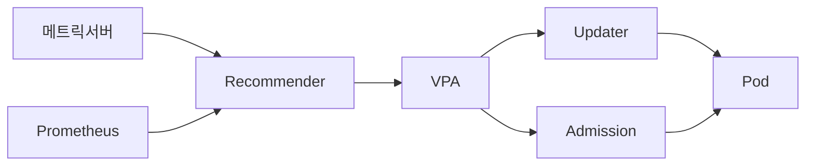
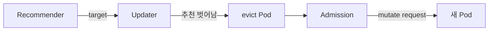
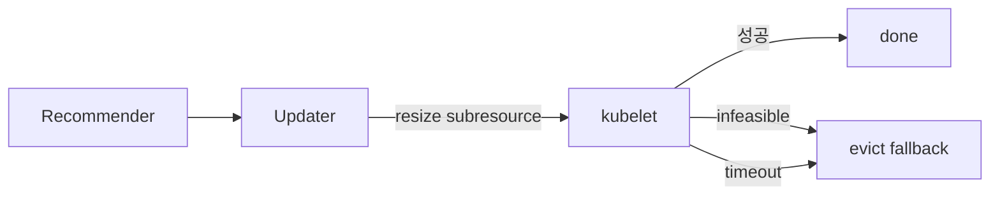

# VPA — VerticalPodAutoscaler

VPA는 **Pod의 수직 스케일링**(`resources.requests`·`limits` 조정)을 담당한다.
HPA가 "몇 개"를 결정한다면 VPA는 "얼마나 큰 Pod"를 결정한다.
2026년 4월 현재 VPA는 **1.6.0** (2026-02-12 릴리스)이 최신이며,
K8s 1.35의 **In-Place Pod Resize GA**와 맞물려 `InPlaceOrRecreate`
업데이트 모드가 VPA에서 **GA**로 승격됐다 — 재시작 없이 `requests`를
조정할 수 있는 현실적인 경로가 열린 것이 지난 한 해 가장 큰 변화다.

운영자 관점의 핵심 질문은 다음 세 개다.

1. **언제 Pod가 다시 태어나는가 (eviction)** — `Auto`/`Recreate`의 위험
2. **In-Place Resize가 실제로 어디까지 통하는가** — CPU vs Memory, restart 여부
3. **VPA와 HPA를 같이 쓰면 왜 발진하는가** — 같은 리소스 중복 금지 원칙

> 관련: [HPA](./hpa.md) · [Cluster Autoscaler](./cluster-autoscaler.md)
> · [Karpenter](./karpenter.md) · [KEDA](./keda.md)

---

## 1. 전체 구조 — 한눈에



VPA는 `kube-system` 네임스페이스에 3개 컴포넌트가 독립 Deployment로
배포된다. 모든 상태는 `VerticalPodAutoscaler` CRD를 통해 통신한다.

| 컴포넌트 | 역할 | 입력 | 출력 |
|---|---|---|---|
| **Recommender** | 과거 사용량 분석·권장값 산출 | metrics-server / Prometheus | VPA `status.recommendation` |
| **Updater** | 권장값과 현재 값 비교·적용 트리거 | VPA spec·status, Pod | Pod eviction / resize subresource |
| **Admission Controller** | Pod 생성 시 `requests` 주입 | VPA spec, Pod AdmissionRequest | mutated Pod spec |

- **Recommender**: Leader election 지원. 단일 클러스터에 여러 Recommender를
  운용하려면 `--name` 플래그로 분리하고 VPA spec의 `recommenders[].name`으로
  바인딩 (GKE 등 매니지드 VPA에서 자주 쓰는 패턴)
- **Updater**: `--min-replicas` 기본 **2**. 단일 Pod 워크로드는
  기본 정책상 eviction 대상이 아님 (설계적 안전장치)
- **Admission Controller**: Pod 생성 webhook이 없으면 `Initial`·`Auto`·
  `InPlaceOrRecreate` 모드가 **모두 무의미**하다 (최초 주입이 안 되므로)

### 메트릭 소스 — metrics-server vs Prometheus

| 소스 | Recommender 플래그 | 특성 |
|---|---|---|
| **metrics-server** | `--storage=` 미지정(기본) | 가벼움, 실시간 샘플링만 (history 없음) |
| **Prometheus (history-provider)** | `--storage=prometheus` + `--prometheus-address=...` | 재시작 후 기존 history 복원, 대규모 클러스터에서 추천 |
| **Checkpoint CRD** | 항상 활성 (history 보완) | `VerticalPodAutoscalerCheckpoint` 리소스에 히스토그램 저장 |

> Recommender는 메모리 내 히스토그램을 주기적으로 체크포인트 CRD에
> 스냅샷으로 저장한다 (`--checkpoints-timeout`, 기본 10분). 재시작 시
> 이 체크포인트에서 복원하며, Prometheus 소스가 없으면 이것이
> **유일한 long-history 소스**다.

출처: [VPA architecture overview](https://kubernetes.io/docs/concepts/workloads/autoscaling/vertical-pod-autoscale/) · [kubernetes/autoscaler VPA README](https://github.com/kubernetes/autoscaler/tree/master/vertical-pod-autoscaler)

---

## 2. CRD 스키마 — targetRef·updatePolicy·resourcePolicy

```yaml
apiVersion: autoscaling.k8s.io/v1
kind: VerticalPodAutoscaler
metadata:
  name: my-app-vpa
spec:
  targetRef:                           # 필수. scale 서브리소스가 있는 워크로드
    apiVersion: apps/v1
    kind: Deployment
    name: my-app
  updatePolicy:
    updateMode: "InPlaceOrRecreate"    # Off | Initial | Recreate | InPlaceOrRecreate
    minReplicas: 2                     # eviction 허용 최소 replicas (updater의 min-replicas와 별개)
  resourcePolicy:
    containerPolicies:
    - containerName: "*"               # 모든 컨테이너 기본값
      minAllowed:
        cpu: 100m
        memory: 128Mi
      maxAllowed:
        cpu: 2
        memory: 4Gi
      controlledResources: [cpu, memory]
      controlledValues: RequestsAndLimits   # RequestsOnly도 가능
    - containerName: "sidecar-logger"  # 특정 컨테이너 오버라이드
      mode: "Off"                      # 이 컨테이너는 건드리지 말라
  recommenders:                        # 선택. 복수 Recommender 사용 시
  - name: my-custom-recommender
```

### 주요 필드 해설

| 필드 | 의미 | 비고 |
|---|---|---|
| `targetRef` | 관리 대상 워크로드 | `/scale` 서브리소스 필요 |
| `updatePolicy.updateMode` | 업데이트 전략 | §3에서 상세 |
| `updatePolicy.minReplicas` | eviction 허용 최소 레플리카 수 | Updater의 CLI flag보다 우선 |
| `resourcePolicy.containerPolicies[].mode` | `Auto`(기본) \| `Off` | 컨테이너 단위 비활성화 |
| `minAllowed`·`maxAllowed` | 권장값 상·하한 | LimitRange와 충돌 시 **VPA 정책이 우선** |
| `controlledResources` | `[cpu]` \| `[memory]` \| 둘 다 | HPA와 공존 시 리소스 분리 필수 |
| `controlledValues` | `RequestsAndLimits`(기본) \| `RequestsOnly` | JVM 등 limit 고정 필요 시 후자 |

### status.recommendation — 네 개의 값

```yaml
status:
  recommendation:
    containerRecommendations:
    - containerName: my-app
      target:          { cpu: 587m, memory: 262144k }   # 권장값
      lowerBound:      { cpu: 587m, memory: 262144k }   # 이 이상이어야 함 (미만이면 resize)
      upperBound:      { cpu: 980m, memory: 393216k }   # 이 이하여야 함 (초과면 resize)
      uncappedTarget:  { cpu: 587m, memory: 262144k }   # policy 적용 전 원본
```

- `target`: Updater가 실제로 주입하려는 값
- `lowerBound`/`upperBound`: 이 범위 안에 있으면 **업데이트 안 함**
  (불필요한 disruption 방지)
- `uncappedTarget`: `minAllowed`·`maxAllowed`·LimitRange로 clamp되기 전 값.
  실제로는 더 큰 값을 원했지만 정책에 막혔는지 진단할 때 사용

출처: [VPA API reference](https://github.com/kubernetes/autoscaler/blob/master/vertical-pod-autoscaler/docs/api.md) · [VPA features.md](https://github.com/kubernetes/autoscaler/blob/master/vertical-pod-autoscaler/docs/features.md)

---

## 3. 다섯 가지 updateMode

`UpdateMode` enum에는 공식적으로 다섯 값이 있다. `Auto`는 **여전히 유효한
값**이지만 1.4.0부터 deprecated로 표시되어 있다.

| 모드 | 동작 | disruption | 주된 용도 |
|---|---|---|---|
| `Off` | 추천만 계산, 적용 안 함 | **없음** | 관찰·수동 rightsizing 근거 |
| `Initial` | Pod **생성 시만** request 주입 | 없음 (신규 Pod만) | 배치 Job, 안정 서비스 |
| `Recreate` | request 벗어나면 **evict → 재생성** | **큼** | stateless + PDB 필수 |
| `InPlaceOrRecreate` | **in-place resize 먼저**, 실패 시 evict | 작음 | K8s 1.33+ · VPA 1.4.0+, 현 표준 |
| `Auto` | **현재는 `Recreate`의 별칭** | 큼 | 신규 사용 금지 (deprecated) |

> **`Auto` deprecated 경과**: VPA **1.4.0**에서 deprecated 표기 시작,
> **1.5.0**에서 명시적 경고, **1.6.0**에서 API 레벨 정리. 현재도 Recreate와
> 동일하게 동작하지만, 앞으로 의미가 `InPlaceOrRecreate`로 바뀔 가능성이
> 예고되어 있어 **명시 모드를 쓰는 것이 안전**하다.

### `Off` — 가장 안전한 출발점

```yaml
spec:
  updatePolicy:
    updateMode: "Off"
```

- Admission Controller조차 손대지 않음
- `status.recommendation`만 산출 → 대시보드·Goldilocks·Grafana로 가시화
- **신규 워크로드는 반드시 Off로 시작해 1~2주 관찰**. 바로 `Auto`는 금물

### `Initial` — "한 번 맞추고 손대지 말라"

- Pod 생성 순간 Admission webhook이 `requests` 주입
- 이후 사용량이 변해도 **건드리지 않음**
- 배치·크론잡, 워크로드 특성이 안정적인 서비스, StatefulSet
  (재생성 비용이 매우 큰 경우)에 적합

### `Recreate` — 전통적인 방식



- Updater가 주기적으로 순회하며 `lowerBound`·`upperBound` 밖 Pod 식별
- **eviction API 호출** → PDB 준수 → 새 Pod 생성 시 Admission이 request 조정
- **PDB가 없으면 동시에 여러 Pod가 evict될 수 있음**. 반드시 PDB 설정
- 12시간 내 같은 replica set을 다시 evict하지 않는 내부 안정화 로직 존재

### `InPlaceOrRecreate` — 2026 현재의 표준

**VPA 1.4.0 alpha → 1.5.0 beta(2025-09) → 1.6.0 GA(2026-02)** 로 승격.
K8s 1.33+ In-Place Pod Resize 가 필수 전제.



VPA가 **in-place를 시도하는 조건**은 다음 중 하나:

1. **Quick OOM**: 컨테이너가 **짧은 시간 내** OOMKill되고 request와 추천에
   차이 존재 (구현 상수는 소스 `podOOMThreshold` 참조, 버전별 상이)
2. **권장 범위 이탈**: request가 `lowerBound` 미만 또는 `upperBound` 초과
3. **장기 편차**: 마지막 disruptive 업데이트 후 **12시간 쿨다운**이 지났고
   `|Σrequests − Σtarget| / Σtarget > 10%`

이 중 하나가 참이면 VPA Updater가 `resize` 서브리소스를 PATCH 한다.
일반 `Recreate` 모드의 `CanEvict`·`EvictionRequirements` 검사는
in-place 시도에서는 **건너뛴다** (disruption이 없다고 간주).

**in-place가 실패로 간주되는 조건** (→ evict fallback):

| 조건 | 대응 |
|---|---|
| `PodResizePending` = `Infeasible` | 즉시 실패 → fallback |
| `PodResizePending` = `Deferred` 장시간 지속 | 타임아웃 경과 후 fallback |
| `PodResizeInProgress` 장시간 진행 중 | 타임아웃 경과 후 fallback |
| Patch 에러 | 즉시 실패 |

> 정확한 타임아웃 플래그 이름·기본값은 VPA 버전마다 바뀌므로
> 공식 소스(`pkg/updater/main.go`)와 릴리즈 노트에서 확인한다.

> **memory limit 축소는 K8s 1.34까지 in-place로 허용되지 않았고, 1.35+에서
> 허용되지만 best-effort** (§4 참고). VPA가 memory limit 축소를 시도하면
> 1.34에서는 실패 → evict 경로로 넘어간다.

**1.6.0 신규 플래그** `--in-place-skip-disruption-budget`: 모든 컨테이너의
`resizePolicy.restartPolicy`가 `NotRequired`이면 PDB 검사를 생략.
진짜 무중단 resize라면 PDB를 소비할 이유가 없다는 논리.

출처: [AEP-4016: InPlaceOrRecreate](https://github.com/kubernetes/autoscaler/blob/master/vertical-pod-autoscaler/enhancements/4016-in-place-updates-support/README.md) · [VPA 1.6.0 release](https://github.com/kubernetes/autoscaler/releases/tag/vertical-pod-autoscaler-1.6.0)

---

## 4. In-Place Pod Resize (KEP-1287) — VPA의 연료

VPA `InPlaceOrRecreate`는 K8s 자체 기능인 **In-Place Pod Resize**
(KEP-1287) 위에 올라간다. 이 기능 자체의 역사:

| K8s 버전 | 상태 | 주요 변경 |
|---|---|---|
| 1.27 | Alpha | 최초 도입, `InPlacePodVerticalScaling` feature gate |
| 1.33 | **Beta** (기본 on) | `resize` subresource, sidecar 지원, checkpointing 강화 |
| 1.35 | **GA (Stable)** | memory limit **감소 허용**, OOM 방지 best-effort |
| 1.36 | GA 유지 | Pod-level resources in-place resize alpha 추가 |

### 핵심 API — resize 서브리소스

```bash
kubectl patch pod my-pod --subresource=resize -p '{
  "spec": { "containers": [{
    "name": "app",
    "resources": {
      "requests": { "cpu": "500m", "memory": "512Mi" },
      "limits":   { "cpu": "1000m", "memory": "1Gi" }
    }
  }]}
}'
```

일반 PATCH로는 running Pod의 resources를 바꿀 수 없다.
`--subresource=resize` 경로(`kubectl ≥ 1.32`)만 허용된다.

### resizePolicy — 재시작 여부 결정

```yaml
spec:
  containers:
  - name: app
    resources:
      requests: { cpu: 100m, memory: 128Mi }
      limits:   { cpu: 500m, memory: 256Mi }
    resizePolicy:
    - resourceName: cpu
      restartPolicy: NotRequired          # 기본값. 재시작 없이 resize
    - resourceName: memory
      restartPolicy: RestartContainer     # 재시작 필요 (안전한 기본 선택지)
```

**`restartPolicy` 가능 값 (공식):**

| 값 | 의미 |
|---|---|
| `NotRequired` (default) | 컨테이너 재시작 없이 cgroup 값 변경 |
| `RestartContainer` | 컨테이너 재시작 후 새 값으로 기동 |

> 일부 블로그에서 `PreferNoRestart`라는 값이 언급되지만, **KEP-1287·
> `api/core/v1/types.go` 기준 공식 enum은 위 두 개뿐**이다. 최신 공식
> 문서로 재확인할 것.

**선택 기준:**

- **CPU → `NotRequired`** 항상 추천 (컨테이너는 변경된 share·quota로 즉시 동작)
- **Memory 증가 → `NotRequired`** 대부분 안전
- **Memory 감소 → `NotRequired`** 는 1.35+에서 **best-effort** (OOM 위험)
  - JVM·Python·Node.js는 이미 할당된 힙을 OS에 반환하지 않아 감소 resize 직후
    `current_usage > new_limit`이면 kubelet이 거부하지만, 거부 못하는 경계
    사례가 있음
- **Memory 감소가 필요하면 `RestartContainer`** 가 **안전한 기본값**

> ⚠️ **resizePolicy 기본값 함정**: `resizePolicy`를 생략하면 모든 리소스가
> 기본 `NotRequired`로 간주된다. JVM을 쓰면서 resizePolicy를 지정하지 않으면,
> memory limit이 재조정되어도 **JVM 힙은 그대로** 유지되어 limit 초과 직후
> OOMKill이 발생한다. 프로덕션 운영 워크로드는 `resizePolicy`를 **반드시
> 명시**한다.

### ContainerStatus — 실제 상태 확인

```yaml
status:
  containerStatuses:
  - name: app
    resources:                           # 현재 cgroup에 적용된 값 (actual)
      requests: { cpu: 500m, memory: 512Mi }
      limits:   { cpu: 1000m, memory: 1Gi }
    allocatedResources:                  # kubelet이 확정 할당한 값
      cpu: 500m
      memory: 512Mi
  conditions:                            # Pod-level resize 상태 (1.33+)
  - type: PodResizeInProgress
    status: "True"
  - type: PodResizePending
    status: "False"
```

| 위치 | 의미 |
|---|---|
| `spec.containers[].resources` | **원하는 값** (사용자가 PATCH한 값) |
| `status.containerStatuses[].resources` | **현재 컨테이너에 적용된 값** |
| `status.containerStatuses[].allocatedResources` | kubelet이 수용한 할당 |
| Pod condition `PodResizePending` (`Deferred`/`Infeasible`) | 즉시 적용 불가 |
| Pod condition `PodResizeInProgress` | 적용 진행 중 |

> **1.33 이전의 `status.containerStatuses[].resize` 필드는
> deprecated·베타 승격에서 제거됨.** Pod condition 두 개로 대체됐다.

### In-Place Resize 불가 조건 (1.36 기준)

| 조건 | 이유 |
|---|---|
| CPU Manager `static` 정책 | 고정 CPU 핀닝과 충돌 |
| Memory Manager `static` 정책 | 동일 |
| 노드 swap 활성화 | cgroup memory 계산 비결정성 |
| HugePages | resize 미지원 |
| GPU·device plugin 리소스 | CPU/memory 외 리소스는 resize 불가 |
| 일반 init container | 단발성이라 resize 의미 없음 |

> **Sidecar(=`restartPolicy: Always` 인 init container)는 K8s 1.33+에서
> resize 지원**. 일반 init container와 구분한다.

### Deferred 우선순위

노드에 자원이 부족해 `Deferred`로 지연된 resize는 이 순서로 재시도된다:

1. PriorityClass 높은 Pod 먼저
2. QoS: Guaranteed → Burstable → BestEffort
3. Deferred 오래된 요청 먼저

출처: [Kubernetes 1.35 In-Place Pod Resize GA](https://kubernetes.io/blog/2025/12/19/kubernetes-v1-35-in-place-pod-resize-ga/) · [Resize CPU and Memory Resources](https://kubernetes.io/docs/tasks/configure-pod-container/resize-container-resources/) · [KEP-1287](https://github.com/kubernetes/enhancements/tree/master/keps/sig-node/1287-in-place-update-pod-resources)

---

## 5. Recommendation 알고리즘

### 히스토그램 + 지수 감쇠(decay) + 백분위

Recommender는 컨테이너별로 CPU·Memory 사용량 **히스토그램** 두 개를
유지한다. 샘플마다 **지수 감쇠 가중치**로 가산되어 오래된 데이터의
영향력이 점점 작아진다.

| 플래그 | 기본값 | 의미 |
|---|---|---|
| `--history-length` | `8d` | 누적 히스토리 최대 기간 |
| `--cpu-histogram-decay-half-life` | `24h` | CPU 가중치 반감기 |
| `--memory-histogram-decay-half-life` | `24h` | Memory 가중치 반감기 |
| `--target-cpu-percentile` | `0.9` | target 산출 백분위 (P90) |
| `--target-memory-percentile` | `0.9` | 동일 |
| `--recommendation-margin-fraction` | `0.15` | 추천값에 곱하는 안전 마진(+15%) |
| `--pod-recommendation-min-cpu-millicores` | `25` | 권장 CPU 하한 |
| `--pod-recommendation-min-memory-mb` | `250` | 권장 Memory 하한 |
| `--memory-saver` | `false` | on이면 대상 워크로드 있는 VPA만 연산 (메모리 절약) |
| `--checkpoints-timeout` | `10m` | Checkpoint CRD 플러시 주기 |
| `--storage` | `""`(empty = metrics-server) | `prometheus`로 설정 시 history-provider 사용 |

### target·lowerBound·upperBound 계산 요지

- **target**: 백분위 `target-cpu-percentile`(P90) × `(1 + margin)` × OOM bump
- **lowerBound**: 더 보수적인(낮은) 백분위에 마진 적용. 이보다 낮으면 under-provisioned 판정
- **upperBound**: 더 공격적인(높은) 백분위에 마진 적용. 이보다 높으면 over-provisioned 판정
- **OOM bump**: 컨테이너가 OOMKill되면 해당 샘플에 `OOMBumpUpRatio`(기본 1.2) 배율 가중

### Checkpoint CRD — 왜 재시작해도 값이 유지되나

`VerticalPodAutoscalerCheckpoint` 리소스 하나가 컨테이너별 히스토그램
버킷(bucket weight, reference timestamp, total weight, sample time range)을
직렬화해 저장한다. Recommender 재시작 시 이 체크포인트를 로드해 히스토그램을
복원하므로 "**Recommender가 방금 재시작했는데 추천값이 0이 됐다**"는
이슈는 체크포인트 로드 실패가 원인인 경우가 많다.

> **다중 Recommender 운용 시 주의**: 같은 VPA를 여러 Recommender가 보면
> 체크포인트를 서로 지운다 (kubernetes/autoscaler#6387·#9241). 반드시
> `--recommender-name` + VPA `recommenders[]` 바인딩으로 격리할 것.

출처: [VPA recommender main.go](https://github.com/kubernetes/autoscaler/blob/master/vertical-pod-autoscaler/pkg/recommender/main.go) · [VPA current recommendation algorithm (#2747)](https://github.com/kubernetes/autoscaler/issues/2747)

---

## 6. resourcePolicy로 제약

`resourcePolicy.containerPolicies`는 컨테이너 단위 세밀한 통제를 제공한다.
이것 없이 VPA를 쓰는 것은 브레이크 없이 차를 모는 것과 같다.

```yaml
resourcePolicy:
  containerPolicies:
  - containerName: "*"                # 모든 컨테이너 기본값
    minAllowed:
      cpu: 100m
      memory: 256Mi
    maxAllowed:
      cpu: 4
      memory: 8Gi
    controlledResources: [cpu, memory]
    controlledValues: RequestsAndLimits
  - containerName: "jvm-app"          # JVM은 limit 바꾸면 위험
    controlledValues: RequestsOnly    # limit은 수동으로 고정
    minAllowed: { memory: 2Gi }
    maxAllowed: { memory: 6Gi }
    controlledResources: [memory]     # CPU는 HPA에 맡김
  - containerName: "istio-proxy"
    mode: "Off"                       # 사이드카는 건드리지 말라
```

### 필드 정리

| 필드 | 값 | 쓰임 |
|---|---|---|
| `containerName` | 이름 \| `*` | 매칭 규칙 (구체 이름 우선) |
| `mode` | `Auto`(기본) \| `Off` | 컨테이너 단위 on/off |
| `minAllowed` | ResourceList | `target`·`lowerBound` 하한 |
| `maxAllowed` | ResourceList | `target`·`upperBound` 상한 |
| `controlledResources` | `[cpu]` \| `[memory]` \| 둘 다 | **HPA와 분리할 때 핵심** |
| `controlledValues` | `RequestsAndLimits`(기본) \| `RequestsOnly` | limit 고정 필요 시 후자 |

### 운영 패턴

- **`controlledValues: RequestsAndLimits`**: `requests`와 `limits`의 **비율을
  유지한 채** 함께 스케일. 기본이지만 JVM 등에는 부적합
- **`controlledValues: RequestsOnly`**: requests만 조정, limits는 사용자
  지정값 유지. JVM heap (`-Xmx`)을 limit에 맞춰 정적 설정한 경우 필수
- **LimitRange 충돌 시 주의**: VPA가 `maxAllowed`로 clamp해도 최종 Pod spec은
  LimitRange 검증을 받는다. **`maxAllowed ≤ LimitRange.max`로 맞춰야** Pod
  생성 거부(`exceeds max resources`)를 피한다.

---

## 7. HPA와의 관계

**같은 리소스에 대해 HPA와 VPA를 동시에 쓰면 발진한다.**

| 순서 | HPA 판단 | VPA 판단 | 결과 |
|---|---|---|---|
| 1 | CPU 사용률 ↑ → replicas++ | request ↑ → Pod 재생성 | Pod 증가 + 재생성 중복 |
| 2 | 단위 Pod CPU% ↓ (분모 ↑) → replicas-- | 새 request 기준 재평가 | 축소 시작 |
| 3 | 다시 CPU% ↑ | 다시 request ↑ | **루프** |

이 문제를 피하는 세 가지 패턴:

### 패턴 A — VPA는 Off, HPA만 Auto

```yaml
# VPA
spec:
  updatePolicy:
    updateMode: "Off"          # 추천값만, 적용은 사람이 판단
  resourcePolicy:
    containerPolicies:
    - containerName: "*"
      controlledResources: [cpu, memory]
---
# HPA
spec:
  metrics:
  - type: Resource
    resource: { name: cpu, target: { type: Utilization, averageUtilization: 70 } }
```

- HPA는 실제 스케일링, VPA는 분기마다 참고하는 권장값 제공
- 가장 안전. StatefulSet·민감한 워크로드에 추천

### 패턴 B — 리소스 분리 (CPU는 HPA, Memory는 VPA)

```yaml
# VPA — memory만 조정
spec:
  resourcePolicy:
    containerPolicies:
    - containerName: "*"
      controlledResources: [memory]   # CPU는 건드리지 않음
---
# HPA — CPU 기반 스케일
spec:
  metrics:
  - type: Resource
    resource: { name: cpu, target: { type: Utilization, averageUtilization: 70 } }
```

공식 문서가 명시적으로 지원하는 조합. CPU는 HPA로 replica 증가, Memory는
VPA로 Pod 크기 조정.

### 패턴 C — HPA 커스텀 메트릭 + VPA 리소스

```yaml
# HPA — RPS, queue depth 등 custom/external 메트릭
spec:
  metrics:
  - type: External
    external:
      metric: { name: queue_depth }
      target: { type: AverageValue, averageValue: "30" }
---
# VPA — cpu·memory 모두 조정 OK (HPA가 CPU를 안 보므로)
spec:
  resourcePolicy:
    containerPolicies:
    - containerName: "*"
      controlledResources: [cpu, memory]
```

가장 유연한 조합. KEDA·Prometheus Adapter와 함께 쓰는 경우 표준 패턴.

> ⚠️ **간접 발진 주의**: HPA가 Pod 수를 올리는 동시에 VPA가 request를
> 올리면 **Cluster Autoscaler·Karpenter가 노드를 과다 프로비저닝**할 수
> 있다. CA/Karpenter의 `expander` 정책과 VPA `maxAllowed`를 보수적으로
> 설정하고, 신규 노드 속도는 `behavior.scaleUp.policies`(HPA 쪽)로 제어.

출처: [VPA FAQ — HPA 공존](https://github.com/kubernetes/autoscaler/blob/master/vertical-pod-autoscaler/docs/faq.md) · [공식 VPA 문서](https://kubernetes.io/docs/concepts/workloads/autoscaling/vertical-pod-autoscale/)

---

## 8. 운영 고려사항

### eviction은 비용이 크다 — PDB는 타협 불가

`Recreate`·`InPlaceOrRecreate`의 fallback 경로는 **반드시 PDB와 짝**으로
운영한다. PDB 없이 VPA를 운용하면 점심시간에 50%의 Pod가 동시에 evict될 수 있다.

```yaml
apiVersion: policy/v1
kind: PodDisruptionBudget
spec:
  minAvailable: 1           # 또는 maxUnavailable: 1
  selector: { matchLabels: { app: my-app } }
```

- Updater는 eviction API를 호출 → PDB가 있으면 허용된 만큼만 evict
- **PDB가 너무 엄격하면** VPA가 영원히 업데이트를 적용 못하므로 로그·메트릭으로
  모니터링 필요 (`vpa_updater_pods_evicted_total`)

### min-replicas=2 권장 — 단일 Pod VPA는 위험

- Updater 기본 `--min-replicas=2`: **replicas=1인 워크로드는 evict 안 함**
- 운영상 이유: Pod 1개를 evict하면 100% 다운타임
- 강제로 1개에서 쓰려면 Updater flag를 `--min-replicas=1`로 내려야 하나,
  **절대 권장하지 않음**. `Initial`·`Off` 모드 또는 2+ replicas로 재설계

### RBAC — webhook·update·eviction 권한

- Admission Controller: ValidatingWebhookConfiguration·CA 자동 갱신 권한
- Updater: Pod `eviction` subresource + **Pod `resize` subresource**
  (VPA 1.4.0+ · K8s 1.33+)
- Recommender: `pods` read, `metrics.k8s.io` read,
  `verticalpodautoscalercheckpoints` write

프로덕션 배포는 **Helm chart 또는 kustomize를 우선**으로 한다.
`hack/vpa-up.sh`는 인증서를 `openssl`로 즉석 생성하는 **개발·테스트용
스크립트**이며 webhook 인증서 자동 갱신이 없다. 인증서 만료 시 Admission
webhook이 조용히 죽어 `Initial`·`Recreate`·`InPlaceOrRecreate` 모드가 전부
동작 정지한다. 커스텀 NetworkPolicy·Pod Security Admission 환경에서는
Helm values의 RBAC·webhook 설정을 **직접 검증**한다.

### JVM·Python 등 런타임 특수성

| 런타임 | 이슈 | 대응 |
|---|---|---|
| **JVM** | `-Xmx` 또는 `MaxRAMPercentage`는 기동 시 결정. limit 중간에 바꾸면 힙이 limit 초과 → OOMKill | `controlledValues: RequestsOnly` + limit 수동 고정 |
| **Python (gc 느림)** | memory 감소 resize 시 RSS가 안 내려와 OOM | memory `RestartContainer`·`Recreate` 모드 권장 |
| **Node.js V8** | `--max-old-space-size` 힙 설정 | JVM과 동일 패턴 |
| **Go** | GC 공격적, resize 친화적 | In-Place에 가장 우호적 |

### StatefulSet — 주의

- StatefulSet evict = Pod identity(`pod-0`) 재연결·PVC 재마운트
- 전역 장애로 번지기 쉬운 DB·Kafka·etcd 등은 `updateMode: "Off"` 또는
  `"Initial"` 선호
- `InPlaceOrRecreate`도 fallback으로 evict가 일어날 수 있음을 고려

---

## 9. 트러블슈팅

### Recommender가 추천을 전혀 안 할 때

체크 순서:

1. `kubectl get vpa my-app-vpa -o yaml`의 `status.conditions` 확인
   - `RecommendationProvided = False`면 추천 안 됨
2. **metrics-server 확인**: `kubectl top pod`로 메트릭 자체가 나오는지
3. **타깃이 실제로 있는가**: `targetRef`의 Deployment가 존재·레이블 매치
4. **`--target-ref-fetcher` 권한**: Recommender가 대상 워크로드를 못 읽는 경우
5. **Recommender 재시작 직후**: history 복원 중일 수 있음 (15~60분 대기)

### In-Place Resize 실패 원인

```bash
kubectl describe pod my-pod | grep -A2 "Conditions:"
kubectl get pod my-pod -o yaml | yq '.status.conditions[] | select(.type | test("PodResize"))'
```

| 증상 | 원인 | 대응 |
|---|---|---|
| `PodResizePending: Infeasible` | 노드 용량 부족 / static CPU manager / swap 활성 / 지원 안 되는 리소스 | 다른 노드로 재스케줄 or 구성 변경 |
| `PodResizePending: Deferred` 5분+ | 같은 노드의 다른 Pod와 경합 | 기다리거나 VPA가 자동 fallback |
| `PodResizeInProgress` 1시간+ | runtime·kubelet 이슈 | kubelet 로그, CRI 로그 확인 → fallback |
| Patch error | webhook 차단 / PSP·PSA 충돌 | admission controller 로그 |

### `--kubelet-insecure-tls` 인증 문제

Recommender가 metrics-server로부터 kubelet 메트릭을 경유해 수집하는 경로
(일부 환경)에서 kubelet TLS 인증 실패로 메트릭이 비어 있을 수 있음.
매니지드 K8s에서는 드물지만, 온프레에서는 **kubelet serving certificate**
rotate와 엮인 이슈 흔함.

체크:

```bash
kubectl logs -n kube-system vpa-recommender-xxx | grep -i "certificate\|x509\|tls"
kubectl top node                       # 실패하면 recommender도 실패
kubectl get csr                        # pending serving CSR 잔존 여부
```

대응:

- metrics-server에 `--kubelet-insecure-tls` (임시 해결)
- kubelet serving CSR 자동 승인기(`kubelet-csr-approver` 등) 운영
- kubelet `--rotate-server-certificates=true` + 승인 파이프라인

### VPA가 이상하게 큰·작은 값 추천

| 증상 | 원인 |
|---|---|
| target = lowerBound = upperBound (모두 동일) | 데이터가 너무 적음 (신규 워크로드) |
| 비정상적으로 큰 값 (#5569처럼 100T) | 한 번의 스파이크가 히스토그램에 과도 반영, `--recommendation-margin-fraction` 과다 |
| CPU 10m 이하 안 나옴 | `--pod-recommendation-min-cpu-millicores=25` 기본 하한 |
| 재시작 후 memory=0 | Checkpoint 로드 실패(#7726) **또는** 신규 워크로드로 샘플 누적 전 |

---

## 10. 안티패턴

| 안티패턴 | 왜 나쁜가 | 대안 |
|---|---|---|
| 같은 리소스에 HPA + VPA 동시 Auto | 발진 (§7) | `controlledResources`로 분리 |
| 단일 Pod + `Auto`/`Recreate` | 100% 다운타임 | `Initial`·`Off` 또는 replicas≥2 |
| PDB 없이 `Recreate` 대량 배포 | 동시 eviction 폭풍 | 반드시 PDB 설정 |
| memory limit이 너무 낮게 수렴 | OOMKill → bump → VPA 다시 내림 → OOMKill 악순환 | `minAllowed.memory` 하한, `controlledValues: RequestsOnly` |
| StatefulSet + `Auto` | PVC 재마운트·identity 이슈 | `Off`/`Initial`, 또는 `InPlaceOrRecreate` (1.33+) |
| `updateMode` 바로 `Auto` | 관찰 없이 적용 | 1~2주 `Off`로 권장값 관찰 후 결정 |
| 여러 Recommender가 동일 VPA 감시 | 체크포인트 서로 삭제 | `--recommender-name` + VPA `recommenders[]` |
| `minAllowed = maxAllowed` (고정값) | VPA 쓸 이유 없음 | VPA 제거하고 수동 고정 |

---

## 11. 프로덕션 체크리스트

**도입 전**
- [ ] K8s 버전 확인 (1.33+ 권장, 1.35+ 에서 In-Place GA 효과)
- [ ] VPA 버전 확인 (**1.6.0+ 권장**, 최소 1.5.1+)
- [ ] metrics-server 정상 동작 (`kubectl top pod` 통과)
- [ ] 대규모 클러스터면 Prometheus history-provider 구성
- [ ] Admission Controller webhook 연결·CA 갱신 확인

**VPA 객체 작성**
- [ ] `targetRef`가 `/scale` 서브리소스 지원하는 리소스
- [ ] `updateMode: "Off"`로 시작해 1~2주 관찰
- [ ] `minAllowed` / `maxAllowed` 설정 (특히 memory 하한)
- [ ] `controlledResources`로 HPA와 중복 방지
- [ ] JVM/Node.js는 `controlledValues: RequestsOnly`
- [ ] 사이드카(istio-proxy 등) `mode: "Off"`

**활성화 시**
- [ ] PDB 존재 확인 (최소 `maxUnavailable: 1`)
- [ ] replicas ≥ 2
- [ ] 1.33+면 `InPlaceOrRecreate` 고려 (`Recreate`보다 disruption ↓)
- [ ] 1.6.0+면 `--in-place-skip-disruption-budget` 검토
- [ ] 변경 후 30분은 Pod 상태·SLO 모니터링

**모니터링**
- [ ] `vpa_updater_pods_evicted_total`
- [ ] `vpa_updater_in_place_updates_*_total` (1.5.0+)
- [ ] `kube_pod_container_status_last_terminated_reason{reason="OOMKilled"}`
- [ ] `kubelet_container_requested_resizes_total` (1.35+, 시도 횟수)
- [ ] `kubelet_pod_resize_errors_total` (1.35+, 실패 횟수) — 위와 짝으로
- [ ] VPA CR의 `status.conditions.RecommendationProvided`
- [ ] Admission webhook `ValidatingWebhookConfiguration` 인증서 만료일

**주기 점검 (분기 1회)**
- [ ] Checkpoint CRD 크기 (비정상 증가는 GC 이슈)
- [ ] 추천값이 수렴 중인지 (lower == upper 지속 = 데이터 부족)
- [ ] OOMKill 이후 VPA가 적절히 bump-up 했는지
- [ ] Recommender 재시작 후 추천값 복원 여부

---

## 12. 버전별 변화 요약 (2025~2026)

| VPA 버전 | 릴리스 | K8s 타깃 | 주요 변경 |
|---|---|---|---|
| 1.4.0 | 2025-05-21 | 1.33 | `InPlaceOrRecreate` **alpha**, CPU/memory 라운딩, global max resources |
| 1.4.1 | 2025-06-02 | 1.33 | 버그 수정 |
| 1.4.2 | 2025-09-03 | 1.33 | 버그 수정 |
| 1.5.0 | 2025-09-23 | 1.34 | **InPlaceOrRecreate beta**, Prometheus bearer auth, `Auto` 모드 deprecated, memory humanization deprecated |
| 1.5.1 | 2025-10-05 | 1.34 | 버그 수정 |
| **1.6.0** | **2026-02-12** | **1.35** | **InPlaceOrRecreate GA (default on)**, `--in-place-skip-disruption-budget`, informer 네임스페이스 스코핑 |

| K8s 버전 | VPA 관련 |
|---|---|
| 1.33 | In-Place Pod Resize **beta**, sidecar resize 지원, CRI `UpdatePodSandboxResources` |
| 1.34 | In-Place beta 유지, memory limit 감소는 여전히 거부 |
| **1.35** | In-Place **GA (Stable)**, memory limit 감소 허용 (best-effort OOM 방지), kubelet metrics·events 추가 |
| 1.36 | GA 유지, Pod-level resources in-place resize **alpha** |

---

## 참고 자료

- [Vertical Pod Autoscaling — kubernetes.io](https://kubernetes.io/docs/concepts/workloads/autoscaling/vertical-pod-autoscale/) — 2026-04-23 확인
- [Kubernetes 1.35: In-Place Pod Resize Graduates to Stable](https://kubernetes.io/blog/2025/12/19/kubernetes-v1-35-in-place-pod-resize-ga/) — 2025-12-19
- [Kubernetes v1.33: In-Place Pod Resize Beta](https://kubernetes.io/blog/2025/05/16/kubernetes-v1-33-in-place-pod-resize-beta/) — 2025-05-16
- [Resize CPU and Memory Resources assigned to Containers](https://kubernetes.io/docs/tasks/configure-pod-container/resize-container-resources/) — 2026-04-23 확인
- [KEP-1287: In-Place Update of Pod Resources](https://github.com/kubernetes/enhancements/tree/master/keps/sig-node/1287-in-place-update-pod-resources)
- [kubernetes/autoscaler — VPA README](https://github.com/kubernetes/autoscaler/tree/master/vertical-pod-autoscaler)
- [VPA features.md](https://github.com/kubernetes/autoscaler/blob/master/vertical-pod-autoscaler/docs/features.md)
- [VPA API reference](https://github.com/kubernetes/autoscaler/blob/master/vertical-pod-autoscaler/docs/api.md)
- [VPA quickstart](https://github.com/kubernetes/autoscaler/blob/master/vertical-pod-autoscaler/docs/quickstart.md)
- [AEP-4016: VPA InPlaceOrRecreate](https://github.com/kubernetes/autoscaler/blob/master/vertical-pod-autoscaler/enhancements/4016-in-place-updates-support/README.md)
- [VPA Recommender main.go](https://github.com/kubernetes/autoscaler/blob/master/vertical-pod-autoscaler/pkg/recommender/main.go)
- [VPA 1.4.0 release](https://github.com/kubernetes/autoscaler/releases/tag/vertical-pod-autoscaler-1.4.0) — 2025-05-21
- [VPA 1.5.0 release](https://github.com/kubernetes/autoscaler/releases/tag/vertical-pod-autoscaler-1.5.0) — 2025-09-23
- [VPA 1.6.0 release](https://github.com/kubernetes/autoscaler/releases/tag/vertical-pod-autoscaler-1.6.0) — 2026-02-12
