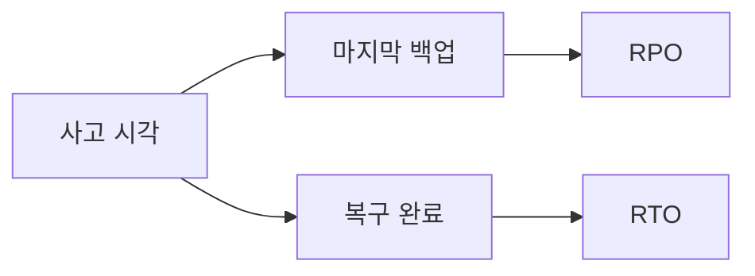
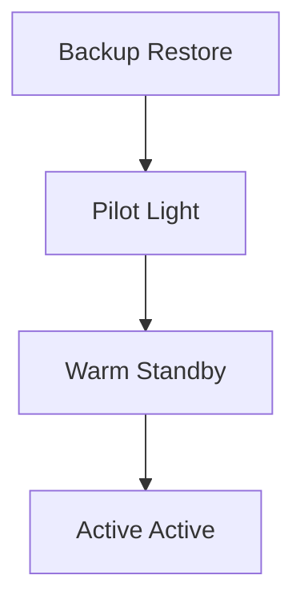
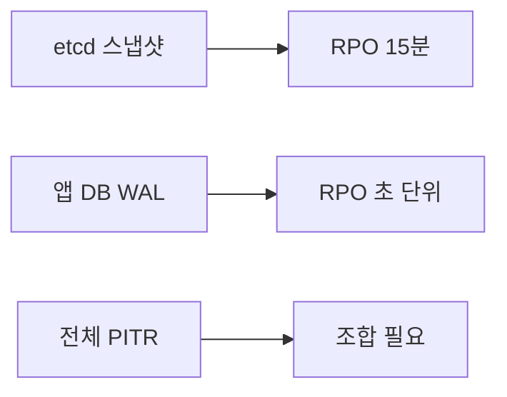
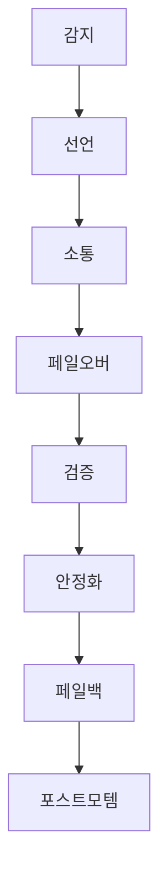

# 재해 복구

재해 복구(DR)는 **리전·DC 전체 소실** 같은 큰 사고에서 서비스를
되살리는 설계·절차 전체다. etcd 백업과 Velero는 **도구**, DR은 **전략**.
도구만 있으면 사고 당일 런북 없이 손으로 싸우다 RTO를 놓친다.

이 글은 RTO/RPO 정의, 네 단계 DR 등급(Backup-Restore → Pilot Light →
Warm Standby → Multi-Site Active/Active), 멀티클러스터 라우팅과 데이터
복제, 페일오버·페일백 런북, DR 테스트·GameDay까지 프로덕션 시각으로
정리한다.

> 도구 상세: [etcd 백업](./etcd-backup.md), [Velero](./velero.md)
> 클러스터 토폴로지: [HA 클러스터 설계](../cluster-setup/ha-cluster-design.md)
> 스토리지 복제: [분산 스토리지](../storage/distributed-storage.md)

---

## 1. DR과 HA의 차이

둘을 섞으면 설계가 망가진다.

| 구분 | HA (고가용성) | DR (재해 복구) |
|---|---|---|
| 장애 범위 | 단일 노드·AZ 장애 | **리전·DC 전체 소실** |
| 해결 도구 | 멀티 AZ·레플리카·PDB | 멀티 리전/DC·백업·런북 |
| 대응 시간 | 초~분 (자동) | 분~시간 (일부 수동) |
| 연 발생 빈도 | 잦음 | 드물지만 치명적 |

**HA는 상시, DR은 예외 이벤트용**. HA로도 못 막는 것(케이블 절단,
지진, 데이터 손상, 랜섬웨어)을 위해 DR이 존재한다.

---

## 2. RTO·RPO·MTTR

### 정의

| 지표 | 질문 | 측정 |
|---|---|---|
| **RTO** (Recovery Time Objective) | 얼마나 오래 꺼져 있어도 되는가 | 단일 사고 시 복구 시간 목표 |
| **RPO** (Recovery Point Objective) | 얼마나 최근 데이터까지 살아나야 하는가 | 허용 가능한 데이터 손실 시간 |
| **MTTR** (Mean Time To Recovery) | 평균 복구 시간 | 다수 사고의 평균 — RTO와 다름 |



### 서비스 등급별 권장치

| 서비스 계층 | RTO | RPO | 전략 |
|---|---|---|---|
| 미션 크리티컬 (결제·인증) | < 5분 | < 1분 | Multi-Site Active/Active |
| 핵심 비즈니스 | < 30분 | < 15분 | Warm Standby |
| 내부·지원 | < 4시간 | < 1시간 | Pilot Light |
| 비핵심 | < 24시간 | < 24시간 | Backup-Restore |

**이 매핑은 "가장 엄격한 선택지"**이다. 현실에서는 비용·복잡도 때문에
결제·인증조차 Warm Standby + 빠른 DB 승격으로 운영하는 조직이 많다.
**RPO 0도 엄밀히는 불가능** — 동기 복제 + 커밋 응답 대기가 있어도
in-flight 트랜잭션은 손실 가능하다. 실무에서는 **Near-zero RPO**로
표현하는 편이 정직하다.

**비즈니스가 정해야 할 숫자**: RTO·RPO는 엔지니어가 아니라
경영·비즈니스가 "얼마의 손실까지 감수 가능한가"로 결정한다.
엔지니어는 그 숫자에 맞는 아키텍처를 선택한다.

---

## 3. 네 단계 DR 등급

AWS Well-Architected 프레임워크의 분류가 사실상 업계 표준. K8s 맥락으로
해석하면 다음과 같다.

| 등급 | RTO | RPO | 비용 | K8s 구현의 본질 |
|---|---|---|---|---|
| **Backup-Restore** | 시간 | 시간 | 낮음 | 백업만 보관, 필요 시 신규 클러스터 구축 후 복원 |
| **Pilot Light** | 30분~1시간 | 분 | 중 | DR 클러스터 **껍데기만** 상시 운영, 데이터 복제 |
| **Warm Standby** | 분 | 초 | 고 | DR 클러스터 **축소판 실행**, 장애 시 확장 |
| **Multi-Site Active/Active** | 0~수 초 | 0 | 최고 | 양쪽에서 동시 트래픽 수신 |

### 단계별 K8s 구성 요약



**Backup-Restore**
- etcd 스냅샷 + Velero 백업을 오프사이트에 보관
- DR 클러스터는 **존재하지 않음**. 사고 시 kubeadm/kubespray/RKE2로 새로
  구축한 뒤 복구
- 싸다. 느리다. 비핵심 시스템에 적합

**Pilot Light**
- DR 리전에 **최소 컨트롤 플레인 + 핵심 스토리지 복제**만 상시 유지
- 애플리케이션 워크로드는 0 replica. 사고 시 scale up
- 데이터는 준실시간 복제 (DB 리플리카, 스토리지 async)
- 월 비용 낮고 RPO 짧음

**Warm Standby**
- DR 클러스터에 **축소판 워크로드**가 실제로 돌아감
- 트래픽 수신 준비 완료, 스케일업만 필요
- GSLB·DNS 가중치로 페일오버
- 대부분의 엔터프라이즈 핵심 업무에 적합

**Multi-Site Active/Active**
- 두 개 이상 리전/DC가 **동시에 프로덕션 트래픽** 수신
- 데이터는 멀티 마스터 또는 분산 합의 (Spanner 계열, CockroachDB, YugabyteDB)
- DR이라기보다 **상시 리던던시**. 페일오버가 별도 이벤트가 아님
- 가장 비싸고 가장 복잡. 지연 감수 vs 가용성의 트레이드오프 상수

### 등급 선택 시 함정

- **"우리는 Active/Active 합니다"**라 말하지만 실은 한쪽은 read-only —
  그러면 write 장애 시 무용
- **Near-zero RPO**를 주장하려면 동기 복제 + 커밋 응답 대기가 필요.
  지연·처리량 희생을 각오해야 함
- Backup-Restore만 믿으면 신규 클러스터 **부팅에만 수 시간** — 포함해서 RTO 계산
- 신규 클러스터 부팅은 **순서 의존성**이 있다. **베이스 플랫폼(CNI·CSI·
  CRD·Ingress/Gateway) → Vault·ESO 부트스트랩 → GitOps(ArgoCD/Flux) →
  Velero 리소스·PV 복원**. 이 의존성을 런북에 명시하지 않으면 RTO 폭발

---

## 4. 장애 도메인 설계

DR은 **"무엇이 함께 죽을 수 있는가"**를 식별하는 작업이다.

| 장애 도메인 | 예 | 방어 |
|---|---|---|
| 노드 | 단일 호스트 장애 | 레플리카, 안티 어피니티 |
| Zone (AZ) | 전원·스위치·냉각 | 멀티 AZ 분산, Topology Spread |
| 리전 / DC | 자연재해·네트워크 단절 | 멀티 리전 클러스터 |
| 전체 사업자 | 클라우드 전사 장애 | 멀티 클라우드·온프레 백업 |
| 사람·권한 | 잘못된 명령·랜섬웨어 | 오프사이트·**Object Lock Compliance** (보존기간 ≥ 30~90일)·RBAC |
| 소프트웨어 결함 | 심각 CVE·버그 | 버전 다양성, 카나리, 롤백 |

**함께 죽는 것을 분리한다**. 예: 같은 리전 내 "다른 AZ"지만 같은 KMS를
쓰면 KMS 장애에 같이 죽는다. 스냅샷 암호화 키·DNS·ID Provider·CI/CD가
단일 실패점(SPOF)인지 점검한다.

### 온프레·하이브리드에서의 장애 도메인

| 계층 | 분리 장치 |
|---|---|
| 랙 | Top-of-Rack 스위치 이중화, 전원 듀얼 |
| 행 | 배전반·UPS 분리 |
| 빌딩 | 광케이블 이중 경로, 다른 통신 사업자 |
| DC | **지리적으로 30km 이상** 분리된 2~3 사이트 |

Rook-Ceph 다중 사이트·CRUSH 토폴로지로 장애 도메인을 스토리지에 반영.

---

## 5. 상태를 어디서 보호하는가 — 네 층위

DR 설계의 핵심은 **데이터 유형별로 보호 계층을 다르게 두는 것**.

| 층위 | 대상 | 복제·백업 방식 |
|---|---|---|
| **컨트롤 플레인 상태** | etcd | 스냅샷 오프사이트 + 컨트롤 플레인 재구성 |
| **쿠버네티스 리소스** | Deployment·CRD·ConfigMap | Velero + GitOps (Git이 원천) |
| **애플리케이션 데이터** | DB·검색·큐·오브젝트 | **앱별 네이티브 복제** + 스냅샷 |
| **클라이언트 대상 경로** | DNS·GSLB·인증서 | DNS TTL·Global LB 설정 |

### GitOps가 Velero의 상당 부분을 대체한다

선언형 매니페스트가 Git에 전부 있다면, DR 시점에는 새 클러스터에
ArgoCD/Flux를 부트스트랩하는 것만으로 리소스가 재생성된다.
**Velero는 PV 데이터·CRD·런타임 상태·부트스트랩 Secret**에 집중.

### 애플리케이션 데이터 — 가장 중요하고 가장 어렵다

| 종류 | 권장 |
|---|---|
| 관계형 DB | Operator PITR (CloudNativePG, Percona, Zalando) — WAL/binlog 연속 전송 |
| 분산 DB | 자체 멀티 리전(CockroachDB, YugabyteDB, Cassandra) |
| 오브젝트 스토리지 | CRR/리플리케이션 + Object Lock |
| 메시지 큐 | Kafka MirrorMaker 2, RabbitMQ Federation |
| 검색 | Elasticsearch CCR, OpenSearch Remote Replication |

---

## 6. PITR — 어디까지 가능한가

**etcd 자체는 true PITR을 제공하지 않는다**. 스냅샷은 **그 시점**으로만
돌아간다. 15분 주기 스냅샷이면 RPO는 최대 15분.



### 진짜 PITR이 필요하다면 — 도구 조합

| 목표 | 조합 | PITR 성격 |
|---|---|---|
| 컨트롤 플레인 상태 복구 | etcd 스냅샷 (15분 RPO 수용) | **시점 기반**(연속 아님) |
| **애플리케이션 DB PITR** | DB Operator의 WAL/binlog 연속 백업 | **연속 PITR** |
| 리소스 매니페스트 | GitOps (commit = 시점) | 커밋 단위 |
| PV 데이터 | CSI 스냅샷 + Velero 데이터 무버 | **시점 기반**(연속 아님) |

**DB Operator PITR 예**:
- CloudNativePG — barman + continuous WAL archive
- Percona for MySQL 1.1+ — binary log 연속 백업
- Percona Server for MongoDB — oplog 기반 PITR
- Crunchy Postgres — pgBackRest + S3

"클러스터를 어제 15:42:33 상태로" 되돌리려면 **DB PITR이 주인공**이고
etcd는 보조 역할이다.

---

## 7. 멀티클러스터 트래픽 라우팅

Warm Standby 이상 등급은 **장애 감지 → DNS/LB 전환**이 RTO를 결정한다.

| 레이어 | 도구 | 페일오버 방식 |
|---|---|---|
| DNS GSLB | Route 53, Cloud DNS, Azure Traffic Manager, NS1, BlueCat | 헬스체크 기반 레코드 전환 |
| Anycast BGP | Cloudflare Magic Transit, Equinix Metal | 네트워크 라우팅 전환 |
| K8s Global Balancer | **k8gb** (CNCF Sandbox) | ExternalDNS 연동, K8s-native |
| 서비스 메시 | Istio multicluster, Linkerd, Cilium Cluster Mesh | mTLS 기반 클러스터간 라우팅 |

### DNS TTL — 페일오버 속도의 상수

| TTL | 영향 |
|---|---|
| 300s | 사고 시 5분간 구 레코드로 트래픽 흐름 → RTO 5분 가산 |
| 60s | 대부분의 리졸버는 존중. 질의 부하 증가 |
| 30s | 일부 리졸버는 더 길게 캐싱 (내부 최소값) — 항상 원하는 대로 안 됨 |

**TTL 단축만으로는 부족**: 리졸버·OS 레벨 캐시·네거티브 캐시를 고려해
실측으로 페일오버 시간을 측정한다.

### k8gb — K8s 네이티브 GSLB

CNCF Sandbox 프로젝트. 각 클러스터에 **Gslb CRD**를 배포하면,
자체 EdgeDNS 모드(Route53·NS1·Infoblox·RFC2136) 또는 ExternalDNS와
연동해 레코드를 생성하고 클러스터별 헬스체크를 DNS 응답에 반영한다.
온프레·하이브리드에서 특히 실용적이다.

### 세션 드레인과 스티키 세션

- Active/Active에서 세션 친화도(sticky session)가 걸려 있으면 **한쪽
  장애 시 그쪽에 고정된 모든 세션이 끊긴다**. 세션 재바인딩·재로그인이
  필요하므로, 사고 영향 범위를 과소평가하지 말 것
- Warm Standby 페일오버는 기존 TCP 연결을 종료시킴 → 클라이언트
  재시도 전략 필수 (지수 백오프)

---

## 8. 데이터 복제 — 동기 vs 비동기

| 모드 | RPO | 지연 영향 | 거리 제약 | 예 |
|---|---|---|---|---|
| 동기 | Near-zero | 링크 RTT만큼 모든 쓰기 지연 | 보통 <10ms (100km 내) | Ceph multi-site sync, DRBD |
| 준동기 | 수 ms | 타임아웃 만료까지 **쓰기 스톨** | <50ms | MySQL semi-sync, Postgres quorum replica |
| 비동기 | 초~분 | 없음 | 제한 없음 | Kafka MirrorMaker, S3 CRR |

**준동기의 실제 거동**: MySQL `rpl_semi_sync_master_timeout`(기본 10초)가
만료될 때까지 **모든 쓰기가 멈춘다**. 네트워크 파티션 시 10초 동안
서비스가 사실상 정지할 수 있다는 의미. 타임아웃을 짧게 두면 async로
빠르게 강등되어 RPO가 훼손된다. 튜닝은 부하 테스트로 검증.

**거리의 물리 법칙**: 광섬유 굴절률(≈1.48) 때문에 광속의 약 68%로
전파된다. **왕복 지연 ≈ 10ms/1000km**. 동기 복제를 대륙 간에 하려는
시도는 대부분 실패한다. 리전 간은 비동기, AZ 간에만 동기를 쓰는 것이
일반적.

### 온프레의 현실적 선택

| 스택 | 복제 |
|---|---|
| Rook-Ceph | RBD Mirroring (async) 또는 Multi-site (sync/async) |
| Longhorn | v2 Data Engine 리플리카 복제 + Backup to S3 |
| MinIO | Site Replication (async) |
| 블록 레벨 | DRBD 9 (sync/async) |

---

## 9. DR 런북 — 실행 가능한 절차

런북은 **"평상시 모르는 사람도 따라 하면 복구 가능한 절차"**.
장애 당일 설계를 시작하면 이미 늦었다.

### 단계별 흐름



### 단계별 체크

| 단계 | 질문 | 아티팩트 |
|---|---|---|
| **감지** | 진짜 리전 장애인가, 우리 쪽 문제인가 | 다중 리전에서 헬스체크, 외부 모니터 |
| **선언** | 누가 DR 선언 권한이 있는가 | 온콜 트리, 명시된 트리거 조건 |
| **소통** | 고객·사내 알림 경로는 | 상태 페이지, 사내 채널, 콜브리지 |
| **페일오버** | DNS·LB·DB 승격 순서는 | 단계별 명령, 예상 소요 시간 |
| **검증** | 정말 살아났는가 | 골든 시그널 체크리스트, E2E 테스트 |
| **안정화** | 성능·용량이 재해 규모에 충분한가 | 스케일업 계획, 용량 플랜 |
| **페일백** | 언제 어떻게 원복할 것인가 | 역방향 데이터 동기화, 리허설 |
| **포스트모템** | 무엇을 배웠는가 | 블레임리스 회고, 액션 아이템 |

### 페일오버 명령 템플릿 (Warm Standby)

**순서가 생명이다.** fencing을 건너뛰면 스플릿브레인.

```bash
# 0. 사전: 선언과 소통, 상태 페이지 업데이트

# 1. 트래픽 freeze — 기존 primary로의 신규 쓰기 차단
kubectl --context=prod -n app-prod annotate deploy --all \
  dr.example.com/freeze=true

# 2. 기존 primary fencing — DB·앱이 더 이상 쓰기 못하게
#    네트워크 격리 또는 Operator의 fence 명령 (스플릿브레인 방지)
kubectl --context=prod -n db patch cluster cnpg-prod --type=merge -p \
  '{"spec":{"stopDelay":0}}'   # Operator별 equivalent

# 3. DB primary를 DR 사이트로 승격
kubectl --context=dr -n db exec cnpg-dr-1 -- /bin/sh -c "cnpg-promote"

# 4. 앱이 참조하는 DB 엔드포인트·Secret을 DR 기준으로 갱신
kubectl --context=dr -n app-prod rollout restart deploy

# 5. DR 클러스터 워크로드 스케일업
kubectl --context=dr -n app-prod scale deploy --all --replicas=30

# 6. GSLB 가중치 전환 (k8gb 기준)
kubectl --context=dr -n k8gb patch gslb app-frontend --type=merge -p \
  '{"spec":{"strategy":{"weight":{"primary":0,"dr":100}}}}'

# 7. 외부 DNS TTL 단축 재확인 (이미 30~60s여야 함)

# 8. 합성 모니터링 + 골든 시그널 체크 + 사용자 핵심 플로우 E2E
./scripts/dr-smoke-test.sh   # Latency·Traffic·Errors·Saturation + 인증·결제·핵심 API
```

**골든 시그널 체크 예**: p99 지연, RPS, 5xx/4xx 비율, CPU·메모리·
디스크 포화도, 인증/결제/핵심 비즈니스 API 각각의 E2E 성공. "PV가
붙었다"만으로 복구를 선언하지 말 것.

### 페일백의 함정

- **Split-brain 방지**: 원본 리전 회복 시 **자동 복귀 금지**. 반드시
  수동 트리거
- **역방향 동기화**: DR에서 일어난 쓰기를 원본으로 되돌림. DB는
  logical replication, 오브젝트는 CRR 역방향
- **사전 리허설**: 실제 페일백은 훨씬 까다롭다. 월간 리허설로 검증

### Runbook as Code

런북을 위키 문서로만 두면 사고 당일 못 찾거나 낡은 버전이 돈다.
**코드로 관리**하는 것이 최근 업계 방향이다.

| 접근 | 도구 예 |
|---|---|
| 워크플로우 엔진 | StackStorm, Rundeck, Temporal |
| CI/CD 파이프라인 | GitHub Actions reusable workflow, GitLab DR pipeline |
| 온프레 자동화 | Ansible playbook + Argo Workflows |
| 승인 게이트 포함 | ArgoCD sync wave + manual approval step |

각 단계에 **사람의 승인 게이트**를 넣어 자동 실행과 수동 검증의
균형을 맞춘다. 명령 자체는 스크립트, 결정은 사람.

---

## 10. DR 테스트·GameDay

**한 번도 테스트 안 한 DR은 DR이 아니다.** Google SRE 문화의 핵심 중
하나. 업계 표준 주기.

| 주기 | 범위 |
|---|---|
| 주 1회 | 백업 복원 (네임스페이스 단위) |
| 월 1회 | Pilot Light 부팅·Warm Standby 페일오버 드릴 (스테이징) |
| 분기 1회 | **프로덕션 GameDay** — 실제 DNS 전환 포함 |
| 연 1회 | 완전 리전 손실 시뮬레이션 — 백업만으로 재구축 |

조직 성숙도에 따라 조절: Netflix는 상시, Cloudflare는 반기 1회 규모로
돌리기도 한다. **"한 번도 안 해본 조직은 월간부터"**가 무리 없는 시작점.

### GameDay 진행

| 단계 | 내용 |
|---|---|
| 계획 | 가설·실험·성공 기준·중단 기준 |
| 사전 측정 | 정상 상태 골든 시그널 |
| 주입 | Chaos Mesh·LitmusChaos로 통제된 장애 |
| 관찰 | 런북이 작동하는지, 알림은 울리는지 |
| 회복 | RTO/RPO 실측 |
| 회고 | 놀라운 점 → 액션 아이템 |

### 카오스 도구

| 도구 | 특징 |
|---|---|
| **LitmusChaos** | CNCF Incubating, 실험 카탈로그·UI |
| **Chaos Mesh** | CNCF Incubating, K8s 네이티브 |
| kube-monkey | Netflix Chaos Monkey의 K8s 버전, 간단 |

안전 가드레일: 네임스페이스 스코프, 중단 조건, 블래스트 반경 제한,
이해관계자 사전 고지. **목적은 학습**이지 프로덕션 파괴가 아니다.

---

## 11. 흔한 실수와 함정

| 실수 | 결과 | 예방 |
|---|---|---|
| HA를 DR이라 믿음 | 리전 장애에 무대응 | 장애 도메인을 명시 구분 |
| RTO·RPO 비즈니스와 합의 없이 엔지니어가 결정 | 예산 충돌·책임 혼재 | 등급별 SLO 문서화 |
| 단방향만 리허설 (페일오버만) | 페일백 당일 실패 | 페일백도 분기 리허설 |
| DNS TTL을 단순히 낮추고 끝 | 리졸버 캐시로 RTO 초과 | 실제 페일오버 시간 측정 |
| KMS·DNS·IdP SPOF | 인프라 자체 복구 불가 | 필수 서비스 다중 리전 |
| 백업 암호화 키를 **같은 리전**에 보관 | 재해 시 동반 소실 | 키와 데이터 지리적 분리 |
| Velero만 믿고 etcd 스냅샷 없음 | Lease·resourceVersion 유실 | [etcd 백업](./etcd-backup.md) 병행 |
| DR 런북을 위키에만 두고 연습 안 함 | 사고 당일 모른다 | 정기 드릴 + 훈련된 온콜 |
| 자동 페일오버만 설계 | 오탐 시 불필요한 장애 | 자동 감지 + **수동 승인** 조합 |
| DR 클러스터를 상시 저사양 | 페일오버 시 용량 부족 | 스케일업 시간 포함 RTO |
| 카오스 실험 프로덕션 금지 | DR 런북이 현실성 잃음 | 통제된 프로덕션 GameDay |

---

## 12. 프로덕션 체크리스트

- [ ] 서비스 계층별 **RTO·RPO 문서화** — 비즈니스와 합의
- [ ] DR 등급 선택과 근거 기록 — "Warm Standby를 쓰는 이유"
- [ ] etcd 스냅샷 + Velero + **GitOps**의 역할 분리 문서
- [ ] 애플리케이션 DB는 **Operator PITR**로 별도 보호
- [ ] 장애 도메인 맵 작성 — SPOF(KMS·DNS·IdP) 식별
- [ ] 멀티 리전/DC 데이터 복제 모드(동기/비동기) 선택 근거
- [ ] 오프사이트·Immutable 백업 (Object Lock Compliance)
- [ ] GSLB/DNS TTL 전략 — **평상시 300~600초, 페일오버 직전 30~60초로
  사전 축소**. 실측 페일오버 시간이 RTO 내
- [ ] **DR 런북** 작성: 감지→선언→소통→페일오버→검증→페일백→포스트모템
- [ ] 주 1회 복원 리허설, 월 1회 DR 드릴, 분기 1회 GameDay
- [ ] 자동 페일오버 + **수동 승인** 조합 (오탐 방지)
- [ ] 페일백 리허설 포함 (반드시)
- [ ] 온콜 트리와 DR 권한자 정의
- [ ] 상태 페이지·고객 커뮤니케이션 템플릿 준비

---

## 13. 이 카테고리의 경계

- **etcd 스냅샷 명령·복구 절차** → [etcd 백업](./etcd-backup.md)
- **Velero 백업·복구·이관** → [Velero](./velero.md)
- **HA 토폴로지·멀티 AZ** → [HA 클러스터 설계](../cluster-setup/ha-cluster-design.md)
- **스토리지 복제 구현** → [분산 스토리지](../storage/distributed-storage.md)
- **서비스 메시 멀티클러스터** → `network/` (Istio·Linkerd·Cilium Cluster Mesh)
- **SLO·에러 버짓·포스트모템 문화** → `sre/`

---

## 참고 자료

- [AWS Well-Architected — Disaster recovery strategies](https://docs.aws.amazon.com/wellarchitected/latest/reliability-pillar/rel_planning_for_recovery_disaster_recovery.html)
- [Google SRE Book — Reliability](https://sre.google/sre-book/availability-table/)
- [Google SRE Workbook — Ch. 9 Incident Response](https://sre.google/workbook/incident-response/)
- [CNCF — Exploring multi-cluster fault tolerance with k8gb](https://www.cncf.io/blog/2025/02/19/exploring-multi-cluster-fault-tolerance-with-k8gb/)
- [k8gb — Kubernetes Global Balancer](https://www.k8gb.io/)
- [LitmusChaos — CNCF Incubating](https://litmuschaos.io/)
- [Chaos Mesh — CNCF Incubating](https://chaos-mesh.org/)
- [CloudNativePG — Backup and PITR](https://cloudnative-pg.io/documentation/current/backup_recovery/)
- [Percona Operator for MySQL — PITR](https://www.percona.com/blog/percona-operator-for-mysql-1-1-0-pitr-incremental-backups-compression/)
- [etcd — Disaster recovery](https://etcd.io/docs/v3.6/op-guide/recovery/)
- [Velero — Cluster Migration](https://velero.io/docs/main/migration-case/)

(최종 확인: 2026-04-24)
