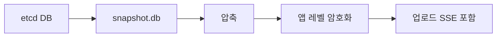
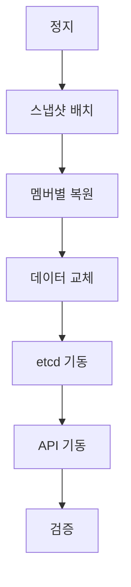

# etcd 백업

**Kubernetes 백업의 시작과 끝은 etcd 백업**이다.
모든 오브젝트·RBAC·CRD·리스·이벤트가 etcd에 있다.
PV에 저장된 데이터는 별도 볼륨 스냅샷으로 보호한다.

이 글은 스냅샷 생성·검증·보관, 자동화 패턴(CronJob·Druid·K3s),
복구 절차(특히 `--bump-revision`·`--mark-compacted`의 의미),
그리고 프로덕션에서 실제로 통하는 보관·암호화 전략까지 다룬다.

> 선행: [etcd](../architecture/etcd.md) — Raft·MVCC·성능·compaction
> 상호보완: [Velero](./velero.md) — 리소스·PV 백업 (etcd 백업의 대체 아님)
> 재해 설계: [재해 복구](./disaster-recovery.md)

---

## 1. 무엇을 백업해야 하는가

etcd 스냅샷만 챙기면 끝나지 않는다. 복구하려면 **함께 있어야 완전한
컨트롤 플레인**이 재구성된다.

| 대상 | 보관 위치 | 빠지면 생기는 일 |
|---|---|---|
| **etcd snapshot** (`.db`) | 오프사이트 오브젝트 스토리지 | 클러스터 전체 상태 손실 |
| **EncryptionConfiguration** | `/etc/kubernetes/enc/` 등 | Secret이 etcd에서 풀리지 않음 |
| **kubeadm PKI** | `/etc/kubernetes/pki/` | API Server·etcd TLS 재수립 불가 |
| **kubelet 클라이언트 인증서** | `/var/lib/kubelet/pki/` | 노드 재합류 지연·중복 CSR |
| **kubeadm config** | `/etc/kubernetes/*.conf` | admin/kubelet kubeconfig 재생성 필요 |
| **CNI·CSI 설정** | `/etc/cni/`, 드라이버별 | 네트워크·스토리지 재연결 |
| **PV 데이터** | 볼륨 스냅샷 (CSI) | 애플리케이션 데이터 손실 |

**PKI 분실의 치명성**: etcd의 CA·클라이언트 인증서는 node·ServiceAccount
토큰 체계와 엮여 있다. `ca.crt`·`ca.key`가 없으면 복구된 etcd를 기동해도
API Server가 붙지 못한다. etcd 스냅샷과 **같이, 다른 저장소에** 보관한다.

kubelet serving/client 인증서는 보통 자동 갱신되지만, serving CA를
로테이션한 환경에서는 `/var/lib/kubelet/pki/`도 함께 백업해야 노드
복구 시 CSR 대량 발생을 피할 수 있다.

---

## 2. etcdctl vs etcdutl — 3.6의 도구 분리

etcd 3.6부터 **스냅샷 읽기/쓰기는 `etcdctl`**, **복구·오프라인 작업은
`etcdutl`**로 분리됐다. 3.5에서 deprecated였던 경로들이 3.6에서 제거됐다.

| 작업 | 3.5 | 3.6+ |
|---|---|---|
| 스냅샷 생성 | `etcdctl snapshot save` | `etcdctl snapshot save` (동일) |
| 스냅샷 상태 | `etcdctl snapshot status` (deprecated) | **`etcdutl snapshot status`** |
| 스냅샷 복구 | `etcdctl snapshot restore` (deprecated) | **`etcdutl snapshot restore`** |
| 오프라인 defrag | — | **`etcdutl defrag --data-dir`** |
| revision bump | — | **`etcdutl --bump-revision --mark-compacted`** |

> **버전 대응**: kubeadm 기준 **1.33까지는 etcd 3.5.x**(예: 3.5.21),
> **1.34부터 etcd 3.6.x**(예: 3.6.5)가 기본이다. 3.5 클러스터에 `etcdutl
> restore`를 돌리면 서버와 어긋나 실패한다. 스크립트 분기는 **서버 etcd
> 바이너리 버전 기준**으로 하고, 1.34로 올리기 전에 먼저 etcd 3.5의
> **3.5.20 이상 패치**로 정리해야 3.6 업그레이드가 막히지 않는다.

---

## 3. 스냅샷 생성

### 기본 명령

```bash
# 컨트롤 플레인 노드에서
ETCDCTL_API=3 etcdctl snapshot save /backup/etcd-$(date +%Y%m%d-%H%M).db \
  --endpoints=https://127.0.0.1:2379 \
  --cacert=/etc/kubernetes/pki/etcd/ca.crt \
  --cert=/etc/kubernetes/pki/etcd/server.crt \
  --key=/etc/kubernetes/pki/etcd/server.key
```

**주의**: 반드시 `etcdctl snapshot save`로 찍는다. `member/snap/db`
파일을 직접 복사하면 **WAL에 남은 최신 쓰기가 빠져**서 데이터 유실이
생기고, 무결성 해시가 없어 복구 시 `--skip-hash-check`이 필요해진다.

### 어디서 찍는가

| 옵션 | 장점 | 단점 |
|---|---|---|
| **리더에서** | 최신 커밋 보장 | 리더 부하 증가 |
| **임의 follower** | 리더 부담 없음 | 수 ms 지연된 상태 |
| **전용 Learner** | 프로덕션 무영향 | 멤버 수 증가 |

**`--endpoints`에 여러 개를 줘도 리더가 자동 선택되지 않는다.**
첫 응답 멤버에서 스냅샷이 찍힌다. 리더에서 찍으려면 `etcdctl endpoint
status`로 리더를 먼저 조회해 해당 엔드포인트만 넘겨야 한다.

대규모 클러스터는 **Learner 멤버**를 운영 도구용으로 두는 패턴이
일반화되고 있다. Gardener의 etcd-druid가 이 접근을 기본으로 사용한다.

### 스냅샷 파일 특징

- 단일 `.db` 파일. 내부는 BoltDB 포맷
- 크기 ≈ `mvcc_db_total_size_in_bytes` (compaction 뒤 defrag된 값)
- 전송·보관은 **압축 후**: zstd ≥ gzip > 원본 (보통 3~5배 축소)
- 암호화 전 **반드시 압축** — BoltDB는 내부 엔트로피가 낮아 압축 효율 높음

---

## 4. 스냅샷 검증 — 찍자마자 확인

검증되지 않은 백업은 **"있다고 믿는 백업"**이지 백업이 아니다.
CNCF TAG-Storage가 반복해서 강조하는 원칙이다.

```bash
etcdutl snapshot status /backup/etcd-20260424-0300.db -w table
```

출력 예:

```
+----------+----------+------------+------------+
|   HASH   | REVISION | TOTAL KEYS | TOTAL SIZE |
+----------+----------+------------+------------+
| 5b6cf71a |   524318 |      12847 |     312 MB |
+----------+----------+------------+------------+
```

### 자동화에 넣어야 할 검증 항목

| 항목 | 기준 | 경보 |
|---|---|---|
| 파일 존재 | 스크립트 종료 후 `ls` | missing → paging |
| 최소 크기 | 전일 대비 50% 이상 | 급감 → 조사 |
| `hash` 필드 | 비어 있지 않음 | 비면 무결성 손상 |
| `revision` 증가 | 직전 스냅샷보다 크거나 같음 | 감소 → 비정상 |
| **복구 리허설** | 분리 네임스페이스에서 주 1회 | 실패 → 런북 갱신 |

---

## 5. 백업 주기와 보관 정책

**RPO(복구 시점 목표)**에서 거꾸로 주기를 정한다.

| 환경 | 권장 주기 | 로컬 보관 | 오프사이트 보관 |
|---|---|---|---|
| 프로덕션 고빈도 | **15분** | 24시간 | 30일 (버전드) |
| 프로덕션 일반 | **30분~1시간** | 72시간 | 30일 |
| 스테이징 | 4~6시간 | 72시간 | 7일 |
| 개발 | 1일 | 7일 | 필요 시만 |

**배포 전후 추가 스냅샷**: 클러스터 업그레이드·대형 CRD 마이그레이션
직전에는 정기 스케줄과 별개로 수동 스냅샷을 찍는다. 롤백 기준점이 된다.

### 배포별 기본값 (참고)

| 배포 | 기본 스케줄 | 보관 | 비고 |
|---|---|---|---|
| kubeadm | **없음** | — | 운영자가 직접 구성 |
| K3s | `0 */12 * * *` (00:00·12:00) | 5 | `--etcd-snapshot-*` 플래그 |
| RKE2 | `0 */12 * * *` (00:00·12:00) | 5 | S3 옵션 내장 |
| Gardener etcd-druid | full cron + 5분 delta | 정책 | 오브젝트 스토리지 필수 |

kubeadm 기반 클러스터는 **기본 스케줄이 없다**. 백업 미구성이
가장 흔한 장애 원인이므로 최우선으로 구성한다.

---

## 6. 저장소와 암호화

### 오프사이트 필수

같은 컨트롤 플레인·같은 리전에만 두면 재해 시 스냅샷이 같이 사라진다.

| 계층 | 예시 (클라우드) | 예시 (온프레미스) |
|---|---|---|
| 로컬 디스크 | 컨트롤 플레인 노드 `/backup` | 동일 |
| 같은 리전 | S3/GCS/Blob 단일 리전 | Rook-Ceph RGW, MinIO 단일 존 |
| **다른 리전/DC** | S3 CRR, GCS Multi-Region | MinIO 사이트 복제, Ceph multi-site |

**Object Lock / Immutable 버킷**: 랜섬웨어 대비로 권장. S3 Object Lock,
GCS Retention Policy, MinIO Object Lock 모두 지원한다. WORM 기간은
보관 정책과 동일하게.

### 암호화는 두 겹



| 계층 | 도구 | 키 관리 |
|---|---|---|
| 앱 레벨 | age, sops, gpg, Vault Transit | 스냅샷 노드 밖 KMS |
| 스토리지 SSE | SSE-KMS, MinIO SSE-S3 | 스토리지 키링 |

**Object Lock 모드 선택**: S3·MinIO의 Object Lock은 **Governance**(권한자
`BypassGovernanceRetention`으로 삭제 가능)와 **Compliance**(root도 삭제
불가) 두 모드를 갖는다. 랜섬웨어 대비가 목적이면 Compliance,
운영 실수 복구 여지가 필요하면 Governance를 쓴다.

**EncryptionConfiguration 주의**: API Server가 쓰는 etcd 암호화 키 파일
자체가 보통 **같은 컨트롤 플레인 노드**에 있다. 스냅샷만 탈취해도
같은 노드에서 복호화 가능하므로, **키는 KMS v2(외부 HSM)** 로 이관하는
편이 안전하다. 온프레에서는 Vault Transit가 표준.

**키 롤테이션 주의**: Secret 암호화 키를 롤테이션한 뒤 **과거 스냅샷을
복원**하면 당시 키로 암호화된 Secret이 현재 키로 풀리지 않는다.
롤테이션 절차는 반드시 **"새 키 write → 전체 Secret 재암호화 → 구 키
제거"** 순서를 지키고, 스냅샷 세대별로 필요한 키를 함께 보관한다.

---

## 7. 자동화 패턴

### 패턴 A — CronJob + 외부 저장소 (kubeadm 범용)

```yaml
apiVersion: batch/v1
kind: CronJob
metadata:
  name: etcd-snapshot
  namespace: kube-system
spec:
  schedule: "*/30 * * * *"
  concurrencyPolicy: Forbid
  successfulJobsHistoryLimit: 3
  failedJobsHistoryLimit: 3
  jobTemplate:
    spec:
      backoffLimit: 2
      template:
        spec:
          hostNetwork: true
          nodeSelector:
            node-role.kubernetes.io/control-plane: ""
          tolerations:
            # 컨트롤 플레인 전용 taint만 허용 (모든 taint 허용 금지)
            - key: node-role.kubernetes.io/control-plane
              operator: Exists
              effect: NoSchedule
          securityContext:
            # etcd 인증서 소유자가 root라 runAsNonRoot는 불가
            runAsUser: 0
            seccompProfile:
              type: RuntimeDefault
          containers:
            - name: etcd-backup
              # 이미지 태그는 반드시 클러스터 etcd 서버와 같은 마이너 최신 패치
              image: registry.k8s.io/etcd:3.5.21-0
              securityContext:
                allowPrivilegeEscalation: false
                capabilities:
                  drop: ["ALL"]
                readOnlyRootFilesystem: true
              command: ["/bin/sh", "-c"]
              args:
                - |
                  set -euo pipefail
                  TS=$(date +%Y%m%d-%H%M)
                  SNAP=/snap/etcd-${TS}.db
                  ETCDCTL_API=3 etcdctl snapshot save ${SNAP} \
                    --endpoints=https://127.0.0.1:2379 \
                    --cacert=/pki/ca.crt \
                    --cert=/pki/server.crt \
                    --key=/pki/server.key
                  etcdutl snapshot status ${SNAP} -w table
                  # 업로드·암호화 실패 시 반드시 exit 1
                  /usr/local/bin/upload-snapshot.sh ${SNAP}
              volumeMounts:
                - { name: pki, mountPath: /pki, readOnly: true }
                - { name: snap, mountPath: /snap }
                - { name: tmp, mountPath: /tmp }
          restartPolicy: OnFailure
          volumes:
            - name: pki
              hostPath: { path: /etc/kubernetes/pki/etcd, type: Directory }
            - name: snap
              hostPath: { path: /var/backups/etcd, type: DirectoryOrCreate }
            - name: tmp
              emptyDir: {}
```

포인트:
- `concurrencyPolicy: Forbid` — 직전 Job이 길어져도 중첩 금지
- `hostNetwork: true` + 로컬 `127.0.0.1:2379` — peer 네트워크 의존 제거
- **toleration은 control-plane taint로 한정** — `operator: Exists`
  단독은 정지 중인 노드로 스케줄되는 사고 유발
- `capabilities: drop: [ALL]` + `readOnlyRootFilesystem` — CIS Benchmark·
  PodSecurity `restricted` 정렬 (root만 불가피, 인증서 권한 때문)
- **이미지 태그는 서버 etcd 버전과 일치** — 1.33은 3.5.21-0,
  1.34부터 3.6.x-0
- 업로드 스크립트는 **KMS 암호화 후 오프사이트** — 업로드 실패는 exit ≠ 0

### 패턴 B — etcd-druid / etcd-backup-restore (대규모)

Gardener 생태계의 오픈소스 **etcd-backup-restore**는 사이드카로
동작하면서 full 스냅샷(cron) + delta 스냅샷(5분 주기)을 오브젝트
스토리지에 쌓고, 파드 재시작 시 자동으로 복원한다. etcd-druid
오퍼레이터가 클러스터 전체의 생명주기를 관리한다.

| 기능 | 효과 |
|---|---|
| full + delta | delta 주기만큼의 RPO (예: 5분) |
| Garbage Collection | 오래된 스냅샷 자동 정리 |
| 자동 복원 | etcd 파드 기동 시 최신 스냅샷 적용 |
| 무결성 검증 | 업로드 후 즉시 hash 확인 |

자체 구축 클러스터에서 **RPO < 15분**을 RTO 부담 없이 달성하고 싶으면
이 스택이 실용적이다.

### 패턴 C — 배포판 내장 (K3s·RKE2)

```bash
# K3s: 서버 플래그로 설정
--etcd-snapshot-schedule-cron='0 */4 * * *'
--etcd-snapshot-retention=24
--etcd-s3 --etcd-s3-bucket=... --etcd-s3-region=...

# RKE2: config.yaml
etcd-snapshot-schedule-cron: "0 */6 * * *"
etcd-snapshot-retention: 20
etcd-s3: true
etcd-s3-endpoint: minio.example.com
```

엣지·단일 클러스터 운영이면 이쪽이 가장 단순하다.

---

## 8. 복구 절차 — kubeadm 기준

**전제**: 모든 제어 평면이 내려가 있거나, 의도적으로 전체 상태를
롤백해야 하는 상황. 멤버 1개 교체는 [etcd](../architecture/etcd.md)의
멤버 재가입 절차를 쓴다.

### 전체 흐름



### 단계별

**1. 컨트롤 플레인 정지**

```bash
# 모든 CP 노드에서
sudo mv /etc/kubernetes/manifests/kube-apiserver.yaml /tmp/
sudo mv /etc/kubernetes/manifests/etcd.yaml        /tmp/
sudo mv /etc/kubernetes/manifests/kube-controller-manager.yaml /tmp/
sudo mv /etc/kubernetes/manifests/kube-scheduler.yaml /tmp/
# kubelet이 정적 파드를 내릴 때까지 대기 (sh 호환)
while crictl ps | grep -qE 'kube-apiserver|etcd'; do sleep 2; done
```

**2. 각 멤버 복원** (모두 **같은 스냅샷 파일 + 같은 토큰**)

```bash
# 모든 멤버에서 동일하게 선언 — 반드시 같은 값이어야 쿼럼 형성
TOKEN="etcd-restored-20260424-0300"
CLUSTER="m1=https://host1:2380,m2=https://host2:2380,m3=https://host3:2380"

# 멤버 1 (host1)
etcdutl snapshot restore /backup/snapshot.db \
  --name m1 \
  --data-dir /var/lib/etcd-restore \
  --initial-cluster ${CLUSTER} \
  --initial-cluster-token ${TOKEN} \
  --initial-advertise-peer-urls https://host1:2380 \
  --bump-revision 1000000000 \
  --mark-compacted
```

멤버 2·3도 `--name`과 `--initial-advertise-peer-urls`만 바꿔 동일하게.
**`TOKEN`과 `CLUSTER`는 세 노드 모두 똑같은 값**이어야 한다.
`$(date +%s)` 같은 실행 시점 값을 인라인으로 쓰면 노드별 토큰이 달라져
쿼럼이 형성되지 않는다.

**3. 데이터 디렉터리 교체**

```bash
sudo rm -rf /var/lib/etcd
sudo mv /var/lib/etcd-restore /var/lib/etcd
```

**4. etcd 먼저 기동**

```bash
sudo mv /tmp/etcd.yaml /etc/kubernetes/manifests/
# 리더 선출 확인
ETCDCTL_API=3 etcdctl endpoint status \
  --endpoints=https://host1:2379,https://host2:2379,https://host3:2379 \
  --cacert=... --cert=... --key=... -w table
```

**5. API Server·컨트롤러·스케줄러 기동**

```bash
sudo mv /tmp/kube-apiserver.yaml         /etc/kubernetes/manifests/
sudo mv /tmp/kube-controller-manager.yaml /etc/kubernetes/manifests/
sudo mv /tmp/kube-scheduler.yaml         /etc/kubernetes/manifests/
```

**6. 검증**

| 확인 | 명령 / 포인트 |
|---|---|
| 노드 상태 | `kubectl get nodes` |
| 시스템 파드 | `kubectl get pods -A \| grep -v Running` |
| Admission·Webhook | `kubectl get validatingwebhookconfigurations,mutatingwebhookconfigurations` |
| CRD·Operator | `kubectl get crd`, Operator 파드 로그에 revision 관련 에러 |
| HPA·VPA 동작 | 스케일 이벤트 발생 여부, 내부 캐시 튐 증상 |
| CSI·CNI | PVC 바인딩 정상, 네트워크 파드 Ready |
| 이벤트 | `kubectl get events -A --sort-by=.lastTimestamp` |

`--bump-revision`을 썼다면 모든 watch 소비자가 재연결되며 informer
캐시가 초기화된다. ArgoCD·Operator·Kueue처럼 자체 캐시를 가진
컴포넌트는 첫 몇 분간 재동기화 로그가 집중적으로 찍힌다.

---

## 9. `--bump-revision`과 `--mark-compacted` — 왜 필수인가

etcd 3.6에서 추가된 가장 중요한 복구 플래그. Kubernetes 환경에서는
**생략하지 않는다**.

### 문제 상황


- 스냅샷을 복원하면 `revision`이 뒤로 간다(예: 500 → 300)
- API Server watch cache·informer는 **500보다 큰 값**을 기대
- `resourceVersion`이 작아졌는데도 값은 다른 상황 → 컨트롤러는
  "이미 처리한 이벤트"로 오판하거나, 반대로 중복 수신
- Kueue·ArgoCD·Operator들이 **조용히 틀리게 동작**

### 해법

| 플래그 | 효과 |
|---|---|
| `--bump-revision N` | 복원 후 revision을 +N만큼 점프. 기존보다 크게 |
| `--mark-compacted` | 기존 watcher의 연결 revision을 invalid로 만들어 재연결 강제 |

**N 가이드**: etcd 업스트림 권고는 **`1_000_000_000`(10억)**.
resourceVersion은 모든 쓰기·리스 갱신·compaction이 증가시키므로
정확한 공식은 어렵다. 의심스러우면 10억을 쓴다 — 남겨서 손해 없다.

### 예외

- **Kubernetes 외 용도 etcd**: 직접 watch 소비자가 없다면 생략 가능
- **전체 새 클러스터 부팅 용도**: `--force-new-cluster`와 함께 쓰는
  상황은 극히 드묾. 강하게 비권장

---

## 10. 주의사항과 흔한 실수

| 실수 | 결과 | 예방 |
|---|---|---|
| `member/snap/db` 직접 복사 | WAL 유실, 해시 누락 | 반드시 `etcdctl snapshot save` |
| 모든 멤버에 **다른 스냅샷**으로 복원 | 쿼럼 불일치, 스플릿 | 한 파일로 전원 복원 |
| `--initial-cluster-token` 재사용 | 살아 있는 기존 멤버와 교차 연결 | 매번 새 토큰 |
| `--bump-revision` 생략 | 컨트롤러 조용한 오동작 | K8s면 항상 사용 |
| PKI 누락 | etcd 기동돼도 API 붙지 못함 | pki 디렉터리 통째 백업 |
| EncryptionConfiguration 누락 | Secret 복호화 실패 | 별도 보관 |
| 스냅샷을 **같은 노드**에만 | 노드 장애 시 동반 소실 | 오프사이트 필수 |
| 검증 없이 CronJob 끝 | 깨진 스냅샷 누적 | status 체크 + 주 1회 리허설 |
| `--force-new-cluster` 남용 | 기존 멤버와 충돌, 데이터 손상 | 사용 금지 |
| defrag 중 스냅샷 | I/O 경합, 지연 폭증 | 스케줄 분리 |

---

## 11. 프로덕션 체크리스트

- [ ] kubeadm이면 **CronJob 또는 etcd-druid로 스케줄링**
- [ ] 주기 = RPO에서 역산 (프로덕션 15~30분)
- [ ] `concurrencyPolicy: Forbid`, `backoffLimit` 설정
- [ ] `etcdutl snapshot status`로 **자동 검증**
- [ ] **압축 → KMS 암호화 → 오프사이트 업로드**
- [ ] Object Lock/WORM 30일
- [ ] PKI와 EncryptionConfiguration 별도 백업
- [ ] 복구 **런북** 작성 — `--bump-revision`·`--mark-compacted` 포함
- [ ] **주 1회 복구 리허설** (분리 환경) — 성공·실패 기록,
  kind/minikube 임시 클러스터나 etcd-druid restore-only로 자동화
- [ ] etcd 3.6 업그레이드 시 `etcdctl restore` 사용 스크립트 전수 교체
- [ ] 알림: 스냅샷 실패 → paging, 크기 급감 → 조사, 검증 실패 → 긴급

---

## 12. 이 카테고리의 경계

- **etcd 아키텍처·성능·defrag** → [etcd](../architecture/etcd.md)
- **애플리케이션 리소스·PV 백업** → [Velero](./velero.md)
- **리전 장애·RTO/RPO 설계·PITR** → [재해 복구](./disaster-recovery.md)
- **Secret 암호화 구성(EncryptionConfiguration, KMS)** →
  [Secret 암호화](../security/secret-encryption.md)

---

## 참고 자료

- [etcd — Disaster recovery (v3.6)](https://etcd.io/docs/v3.6/op-guide/recovery/)
- [etcd — etcdutl README](https://github.com/etcd-io/etcd/blob/main/etcdutl/README.md)
- [etcd — Announcing v3.6.0](https://etcd.io/blog/2025/announcing-etcd-3.6/)
- [Announcing etcd v3.6 — Kubernetes Blog](https://kubernetes.io/blog/2025/05/15/announcing-etcd-3.6/)
- [Kubernetes CHANGELOG 1.34 — etcd 3.6.5 default](https://github.com/kubernetes/kubernetes/blob/master/CHANGELOG/CHANGELOG-1.34.md)
- [Kubernetes — Operating etcd clusters](https://kubernetes.io/docs/tasks/administer-cluster/configure-upgrade-etcd/)
- [CNCF — The Kubernetes Surgeon's Handbook: Precision Recovery from etcd Snapshots](https://www.cncf.io/blog/2025/05/08/the-kubernetes-surgeons-handbook-precision-recovery-from-etcd-snapshots/)
- [Gardener — etcd-backup-restore](https://github.com/gardener/etcd-backup-restore)
- [Gardener — Backup and Restore concept](https://gardener.cloud/docs/gardener/concepts/backup-restore/)
- [RKE2 — Backup and Restore](https://docs.rke2.io/datastore/backup_restore)
- [K3s — etcd-snapshot CLI](https://docs.k3s.io/cli/etcd-snapshot)
- [kOps — etcd backup, restore and encryption](https://kops.sigs.k8s.io/operations/etcd_backup_restore_encryption/)
- [CIS Kubernetes Benchmark — etcd section](https://www.cisecurity.org/benchmark/kubernetes)

(최종 확인: 2026-04-24)
