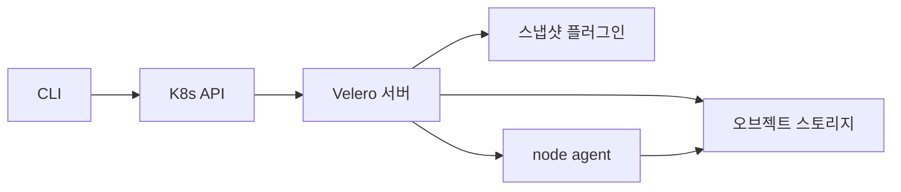

# Velero

**Velero는 Kubernetes 리소스와 PV 데이터를 한 번의 선언으로 백업·복구·
이관하는 사실상 표준 도구**다. etcd 스냅샷이 컨트롤 플레인 전체의
사진이라면, Velero는 **네임스페이스·라벨 단위의 선택적 백업**을 다룬다.

이 글은 아키텍처, CSI 스냅샷 데이터 무버·파일 시스템 백업(fs-backup)의
차이, 백업/복구/스케줄 CRD, 훅으로 애플리케이션 일관성 확보, 클러스터
이관, 그리고 프로덕션에서의 트레이드오프와 체크리스트까지 다룬다.

> 상호보완: [etcd 백업](./etcd-backup.md) — Velero는 이를 대체하지 않는다
> 설계 전제: [재해 복구](./disaster-recovery.md) — RPO·RTO 결정이 선행
> 연관: [Volume Snapshot](../storage/volume-snapshot.md),
> [CSI Driver](../storage/csi-driver.md)

---

## 1. Velero는 etcd 백업을 대체하지 않는다

두 도구의 역할이 다르므로 **둘 다 운영**하는 것이 프로덕션 표준이다.

| 항목 | etcd snapshot | Velero backup |
|---|---|---|
| 대상 | 클러스터 전체 kv | **선택된 네임스페이스·리소스·PV** |
| 일관성 단위 | 단일 시점 (Raft) | 리소스별 API 조회 (per-object) |
| PV 데이터 | 포함 안 됨 | **포함 가능** (CSI/fs-backup) |
| 복구 입도 | 전체 또는 precision surgery | **리소스 단위** |
| 클러스터 이관 | 사실상 불가 (PKI 종속) | **주 용도 중 하나** |
| 복구 속도 | 수 분 | 수십 분~시간 (PV 크기 의존) |

**Velero로 etcd를 대체하면 생기는 일**: Lease·Event·resourceVersion은
재생 불가, 컨트롤러 내부 상태가 튀고, `kube-system` 재구성은 PKI에
의존해 깨진다. **etcd는 etcd로, 앱은 Velero로** 분리한다.

---

## 2. 아키텍처



| 구성요소 | 역할 |
|---|---|
| **Velero 서버** | 컨트롤러. Backup·Restore·Schedule CRD 조정 |
| **Object Store Plugin** | 리소스 매니페스트·백업 메타를 S3 호환 스토리지에 저장 |
| **Volume Snapshotter Plugin** | 클라우드 디스크·CSI 드라이버의 스냅샷 트리거 |
| **node-agent** (DaemonSet) | 각 노드에서 파일 시스템 백업·데이터 무버 실행 |
| **Kopia 업로더** | 데이터 무버·fs-backup의 실제 전송 엔진 |
| **Backup Repository** | 네임스페이스별 Kopia 저장소 (중복 제거·암호화) |

### 플러그인 생태계

| 카테고리 | 예시 |
|---|---|
| Object Store | AWS(S3), GCP(GCS), Azure(Blob), MinIO, Ceph RGW |
| Volume Snapshotter | EBS, GCE PD, Azure Disk, vSphere, **CSI** |
| 데이터 무버 | 내장(Kopia), 벤더 커스텀(Portworx·Trilio 등) |

**CSI 통합**: Velero v1.14부터 **CSI 플러그인이 본체에 통합**되어 기본
활성화됐다. 별도 설치 불필요. `--features=EnableCSI` 플래그 자체의
제거가 논의 중(업스트림 이슈 #6694)이므로, 최신 버전에서는 명시하지
않아도 된다. 외부 스냅샷터 플러그인은 CSI가 없는 환경에서만 쓴다.

### 핵심 CRD

| CRD | 용도 |
|---|---|
| `Backup` | 한 회 백업 실행 선언 |
| `Restore` | 백업으로부터의 복원 선언 |
| `Schedule` | cron 기반 반복 백업 |
| `BackupStorageLocation` (BSL) | 오브젝트 스토리지 엔드포인트·자격증명 |
| `VolumeSnapshotLocation` (VSL) | 볼륨 스냅샷 위치·자격증명 |
| `PodVolumeBackup` / `PodVolumeRestore` | fs-backup 단위 CR |
| `DataUpload` / `DataDownload` | CSI 스냅샷 데이터 무버 전송 단위 |
| `BackupRepository` | 네임스페이스별 Kopia 저장소 상태 |

---

## 3. 볼륨 백업 경로 — 무엇을 선택하는가

Velero의 PV 보호 방식은 크게 세 가지. **원칙: CSI 스냅샷 데이터 무버 >
CSI 스냅샷 > fs-backup** 순으로 고려한다.

| 경로 | 트리거 | 저장 위치 | 언제 쓰는가 |
|---|---|---|---|
| **CSI Snapshot** | CSI driver | **스토리지 내부** | 단기 보관·빠른 복구·같은 스토리지 |
| **CSI Snapshot Data Movement** | CSI + node-agent | **오브젝트 스토리지** | 장기 보관·클러스터 이관·온프레 |
| **fs-backup** (Kopia) | node-agent | 오브젝트 스토리지 | CSI 미지원 볼륨·hostPath·호환성 |

### CSI Snapshot (in-place)

가장 빠름, 일관성 좋음. 하지만 **스냅샷이 원본 스토리지에 남는다**.
- 클러스터·스토리지 장애 시 같이 사라질 수 있음
- 장기 보관은 비용·한계 문제
- 클러스터 이관 불가

### CSI Snapshot Data Movement (권장)

**v1.14+에서 정식 지원**. 스냅샷을 잠시 만들고, 그 데이터를 Kopia로
오브젝트 스토리지에 업로드한 뒤 스냅샷을 제거한다.

| 장점 | 주의 |
|---|---|
| 일관성(PiT) + 오프사이트 | 업로드 중 node-agent 자원 사용 |
| 클러스터 간 이관 가능 | 별도 스토리지 네트워크 대역 소모 |
| 온프레 Rook-Ceph·Longhorn에 잘 맞음 | 내장 암호화 키가 공통 고정값 |

**온프레 환경의 표준 조합**: Rook-Ceph RBD + CSI 스냅샷 데이터 무버 +
MinIO/Ceph RGW가 가장 흔하다. Longhorn도 CSI 스냅샷 지원으로 동일.

### fs-backup (Kopia)

파일 시스템을 파일 단위로 읽어 업로드. CSI가 없는 볼륨의 **마지막
수단**.

- **Restic 경로는 v1.15 deprecated → v1.17 backup 비활성화 → v1.19 제거
  예정**. 신규 구축은 Kopia만 쓴다
- 파일 개수 많으면 느리고 일관성 약함 (라이브 PV에서 읽음)
- 일관성은 **훅**으로 보조 (DB flush 등)
- Windows 노드 지원은 v1.17+부터

### Restic → Kopia 마이그레이션

| 단계 | 내용 |
|---|---|
| 1 | v1.14 이상으로 업그레이드 |
| 2 | 신규 스케줄은 **`defaultVolumesToFsBackup`** 대신 Kopia 경로로 작성 |
| 3 | 기존 Restic 백업은 **읽기 전용 복원 대상**으로 남김 (v1.18 포함까지 restore 가능, v1.19에서 restore도 비활성화) |
| 4 | 새 주기로 Kopia 전환 후 Restic 저장소는 정리 |

---

## 4. 설치와 핵심 리소스 구성

### 설치 (온프레 + MinIO 예)

```bash
velero install \
  --provider aws \
  --plugins velero/velero-plugin-for-aws:v1.10.0 \
  --bucket velero-cluster-a \
  --secret-file ./credentials-minio \
  --backup-location-config \
      region=minio,s3ForcePathStyle=true,s3Url=https://minio.internal \
  --use-node-agent \
  --uploader-type kopia \
  --features=EnableCSI
```

플래그 해설:
- `--use-node-agent` — fs-backup / 데이터 무버용 DaemonSet 배포
- `--uploader-type kopia` — Restic 쓰지 않음 (신규 구축 필수)
- `--features=EnableCSI` — CSI 플러그인 활성화
- `--secret-file` — Vault·ESO로 관리하는 자격증명을 주입하는 것이 정석

### BackupStorageLocation (BSL)

```yaml
apiVersion: velero.io/v1
kind: BackupStorageLocation
metadata:
  name: default
  namespace: velero
spec:
  default: true               # Backup CR에서 storageLocation 생략 시 이 BSL 사용
  provider: aws
  objectStorage:
    bucket: velero-cluster-a
  config:
    region: minio
    s3ForcePathStyle: "true"
    s3Url: https://minio.internal
  credential:
    name: cloud-credentials
    key: cloud
```

> **운영 원칙**: CLI는 편의, 프로덕션 운영은 **CR 선언형 + GitOps**.
> CLI 예시는 학습·디버깅 용도로만 쓰고, 실제 환경에서는 Backup·
> Schedule·BSL·VSL·Restore 전부 Git에 YAML로 두고 ArgoCD/Flux로 적용.

### VolumeSnapshotLocation (VSL) — CSI 환경

CSI 통합을 쓰면 VSL 없이도 동작한다. 외부 스냅샷터 플러그인을 쓸
때만 CSP별 VSL을 정의한다.

---

## 5. 백업 — 네임스페이스·라벨·와일드카드

### 단순 네임스페이스 백업

```bash
velero backup create apps-20260424 \
  --include-namespaces app-prod,app-stg \
  --snapshot-move-data \
  --wait
```

- `--snapshot-move-data` — CSI 스냅샷을 **찍은 뒤 오브젝트 스토리지로
  이동** (데이터 무버 경로)
- `--wait` — 완료까지 블록. CI·런북 스크립트에 유용

**`snapshotMoveData`와 `defaultVolumesToFsBackup`의 관계**:
둘 다 true면 PV별로 **CSI 스냅샷 가능 여부 → CSI 데이터 무버**,
**CSI 미지원 PV → fs-backup**으로 분기된다. 의도적으로 섞어 쓰는 것이
아니라면 한쪽만 true로 두고 나머지는 예외 볼륨에 라벨을 달아 제어하는
편이 운영상 단순하다.

### 와일드카드·글롭 (v1.18+)

```bash
velero backup create prod-star \
  --include-namespaces 'prod-*,team-a-*' \
  --exclude-namespaces 'prod-test-*'
```

### 리소스 필터 — 섬세하게

| 플래그 | 용도 |
|---|---|
| `--include-resources` | 특정 리소스만 (예: `deployments,services,pvc`) |
| `--exclude-resources` | 제외 (예: `events,pods` — 다시 만들어짐) |
| `--selector` | 라벨 셀렉터 (`app=payment`) |
| `--include-cluster-resources` | CRD·ClusterRoleBinding 등 포함 여부 |
| `--exclude-resources PersistentVolumes` | 리소스만 + 스냅샷 생략 |

### 주의: 기본 제외

Velero는 일부 리소스를 **기본 제외**한다. `nodes`, `events`,
`pods/binding` 등. 복구 시 API Server가 재생성하므로 문제없다.

### Backup CR (선언형)

```yaml
apiVersion: velero.io/v1
kind: Backup
metadata:
  name: apps-weekly
  namespace: velero
spec:
  includedNamespaces: ["app-prod"]
  storageLocation: default
  snapshotMoveData: true
  ttl: 720h  # 30일
  defaultVolumesToFsBackup: false
  hooks:
    resources:
      - name: pg-quiesce
        includedNamespaces: [app-prod]
        labelSelector:
          matchLabels: { role: postgres }
        pre:
          - exec:
              container: postgres
              # PG 15+; PG 14 이하는 pg_start_backup('velero', false, false)
              command:
                - psql
                - -U
                - postgres
                - -c
                - "SELECT pg_backup_start('velero', false);"
              onError: Fail
              timeout: 60s
        post:
          - exec:
              container: postgres
              command:
                - psql
                - -U
                - postgres
                - -c
                - "SELECT pg_backup_stop();"
```

---

## 6. Schedule — 반복 백업

```yaml
apiVersion: velero.io/v1
kind: Schedule
metadata:
  name: daily-apps
  namespace: velero
spec:
  schedule: "17 02 * * *"   # 02:17 UTC
  useOwnerReferencesInBackup: true
  template:
    includedNamespaces: ["app-prod"]
    snapshotMoveData: true
    ttl: 720h
```

포인트:
- `useOwnerReferencesInBackup: true` — Schedule 삭제 시 파생 Backup CR도
  정리. GitOps 기반 운영에서 권장
- 여러 스케줄로 **RPO 계층화**: 4시간 주기 증분 + 주 1회 장기 보관
- TTL과 저장소 수명주기를 **둘 다** 설정. Velero TTL은 CR만 정리,
  오브젝트 스토리지에서의 실제 삭제는 `GarbageCollection` 컨트롤러와
  저장소 lifecycle 양쪽으로 지켜진다

### RPO에서 역산하는 주기 예

| 워크로드 | RPO | 주기 | 경로 |
|---|---|---|---|
| 결제·트랜잭션 DB | 5~15분 | 5분 (전용 도구 + Velero 일 1회) | fs-backup 지양 |
| 일반 stateful | 1~4시간 | 2시간 | CSI 데이터 무버 |
| stateless + CRD 보관 | 1일 | 일 1회 | CSI 스냅샷 또는 리소스만 |
| DR 장기 보관 | 월 1회 | 월 1 + TTL 장기 | 데이터 무버 + Object Lock |

---

## 7. Backup Hooks — 애플리케이션 일관성

볼륨 스냅샷은 **디스크 시점**을 찍지만, 애플리케이션 내부 버퍼는
비우지 않는다. 훅이 없으면 **crash-consistent**, 있으면
**application-consistent**에 근접한다.

### 훅 지정 방식 두 가지

| 방식 | 위치 | 특징 |
|---|---|---|
| **Annotation** | Pod 어노테이션 | 앱 매니페스트에 고정. GitOps 친화 |
| **Backup spec.hooks** | Backup CR | 백업 정책 쪽에 집중. 중앙 관리 용이 |

### Annotation 예 (PostgreSQL 15+)

```yaml
metadata:
  annotations:
    pre.hook.backup.velero.io/container: postgres
    pre.hook.backup.velero.io/command: |
      ["psql","-U","postgres","-c","SELECT pg_backup_start('velero', false);"]
    pre.hook.backup.velero.io/on-error: Fail
    pre.hook.backup.velero.io/timeout: 60s
    post.hook.backup.velero.io/command: |
      ["psql","-U","postgres","-c","SELECT pg_backup_stop();"]
```

### PostgreSQL 버전별 호환성

| PG 버전 | 시작 함수 | 종료 함수 | 비고 |
|---|---|---|---|
| 9.6 ~ 14 | `pg_start_backup('label', false, false)` | `pg_stop_backup(false)` | non-exclusive 모드 필수 |
| 15+ | `pg_backup_start('label', false)` | `pg_backup_stop()` | exclusive 모드 **완전 제거** |

**exclusive 모드 제거의 의미**: PG 15에서 `pg_start_backup`은 단순히
이름만 바뀐 게 아니라 **동작 모드 자체가 폐지**됐다. PG 14 이하 운영팀이
`pg_start_backup('velero')` 단일 인자로 호출하면 기본이 exclusive라 복구
불능 상태를 유발할 수 있다. 버전을 확인하고 non-exclusive로 명시한다.

### 흔한 패턴

| 시나리오 | pre | post | 주의 |
|---|---|---|---|
| PostgreSQL 15+ | `pg_backup_start('v', false)` | `pg_backup_stop()` | 위 버전 표 참고 |
| MySQL | `FLUSH TABLES WITH READ LOCK` | `UNLOCK TABLES` | **세션 유지 시에만 lock 보존** — 권장: `mysqldump --single-transaction` 기반 |
| MongoDB | `db.fsyncLock()` | `db.fsyncUnlock()` | 레플리카셋은 secondary에서 |
| Redis | `BGSAVE` 후 `sync` | 없음 | RDB 경로 확인 |
| Elasticsearch | `_flush/synced` | 없음 | 공식 snapshot API 권장 |

**DB 고가용성 환경**은 **스탠바이에서 훅을 돌리는** 설계가 프로덕션
안전성이 높다. 프라이머리에 lock·I/O 영향을 주지 않는다.

**MySQL `FLUSH TABLES WITH READ LOCK`의 함정**: 훅 명령이 한 줄 실행으로
끝나면 세션이 닫히면서 lock이 즉시 해제되어 백업 동안 일관성이 깨진다.
Percona XtraBackup, `mysqldump --single-transaction`, 또는 InnoDB clone
플러그인 기반 외부 백업 도구와 Velero를 조합하는 것이 실무 표준이다.

---

## 8. 복구

### 기본 복구

```bash
velero restore create apps-restore-$(date +%s) \
  --from-backup apps-20260424 \
  --wait
```

### 네임스페이스 매핑 (이관·복제)

```bash
velero restore create \
  --from-backup apps-20260424 \
  --namespace-mappings app-prod:app-dr \
  --wait
```

**용도**: 같은 클러스터 내 사본 생성, 다른 클러스터로 이관 시 충돌 회피.

### 자주 쓰는 플래그

| 플래그 | 효과 |
|---|---|
| `--include-namespaces` | 전체 백업 중 일부만 복구 |
| `--include-resources` | 일부 리소스 종류만 |
| `--selector` | 라벨 필터 |
| `--restore-volumes=false` | 매니페스트만 복구(PV 제외) |
| `--existing-resource-policy=update` | 충돌 시 업데이트 |
| `--preserve-node-ports` | NodePort 고정 |

### 복구 순서

Velero는 기본 복구 순서를 내장: `namespaces → CRD → PVC → PV → 그 외`.
그 안에서 `restore-resource-priorities`로 순서 커스터마이즈 가능.

**유의**: Service의 `clusterIP`, Node·노드별 로컬 리소스는 재생성된다.
외부 DNS·LB는 복구 범위 밖 — DR 런북에 별도 명시.

---

## 9. 클러스터 이관 (Migration)

Velero의 대표 용도 중 하나. **같은 버전 K8s 간 이관이 기본**이며,
버전 차이는 [Version Skew](../upgrade-ops/version-skew.md) 정책을 따른다.


절차:
1. 소스에서 `velero backup create ... --snapshot-move-data`
2. 대상 클러스터에 같은 BSL 연결 (같은 버킷·자격증명)
3. 대상에 **맞는 StorageClass**를 미리 생성 (이름 동일 권장)
4. `velero restore create --from-backup <name>` 실행
5. DNS·LB·외부 의존성 재연결 검증

**자주 걸리는 함정**:
- StorageClass 이름이 다르면 PVC 바인딩 실패 → `storageClassMappings`
- ClusterIP 재할당 충돌 → Service 재생성
- Ingress/Gateway API 리소스의 클러스터 종속 필드 (IP·인증서)
- 네임스페이스 라벨 기반 정책(PSA) 불일치
- Deployment/StatefulSet `spec.selector`, Service `clusterIP` 등
  **immutable 필드**는 `existing-resource-policy=update`로도 덮이지 않아
  사전 삭제 또는 ResourceModifier로 치환해야 함

### ResourceModifier — 복구 시 JSON Patch 치환

Velero v1.12+에서 도입된 **ResourceModifier** CRD는 복구 시점에 리소스를
JSON Patch로 수정한다. 클러스터 이관의 표준 치환 지점에 사용한다.

| 치환 대상 | 예 |
|---|---|
| StorageClass 이름 | `gp2` → `rook-ceph-block` |
| Image Registry | `public.ecr.aws/...` → `harbor.internal/...` |
| Annotation 교체 | 구 클러스터 전용 어노테이션 제거 |
| Env 치환 | `DB_HOST`를 대상 클러스터 DNS로 |

`velero restore create ... --resource-modifier-configmap=<name>` 형태로
적용한다.

---

## 10. 프로덕션 운영

### 관측

| 지표 | 의미 |
|---|---|
| `velero_backup_total{phase=...}` | 성공·실패·부분 성공 카운터 |
| `velero_backup_duration_seconds` | 백업 소요 시간 분포 |
| `velero_backup_items_total` | 백업된 항목 수 |
| `velero_volume_snapshot_*` | 볼륨 스냅샷 성공·실패 |
| DataUpload/Download CR 상태 | 데이터 무버 전송 진행도 |

Prometheus 스크랩 + Alertmanager 규칙이 표준.
`Backup` CR `.status.phase`가 **PartiallyFailed**면 반드시 조사.

### 보안

| 항목 | 권장 |
|---|---|
| **RBAC** | Velero SA는 `cluster-admin` 피하고 필요한 권한만 |
| **자격증명** | `cloud-credentials` Secret은 [External Secrets](../../security/) + Vault |
| **BSL 접근** | 버킷 정책 + VPC Endpoint / 전용 네트워크 |
| **Kopia 암호화** | 내장 키가 공통 — **스토리지 접근을 반드시 제한** |
| **Object Lock** | Compliance 모드 + retention 30~90일 |

**Kopia 내장 키 공통 주의**: Velero 내장 데이터 무버는 모든 repository에
**고정 공통 키**를 사용한다. v1.17+에서 BackupRepository가 네임스페이스별로
분리되면서 논리적 격리는 강해졌지만, **암호화 키 자체는 여전히 공통**이다.
버킷 접근 권한을 가진 누구라도 복호화 가능 — 버킷 정책·네트워크 격리·
감사 로그로 보완해야 한다. 민감도가 매우 높으면 벤더 데이터 무버
(Portworx, Kasten K10 등)를 검토한다.

### 성능·용량

| 이슈 | 대응 |
|---|---|
| 노드 ephemeral disk 부족 | v1.18의 **data mover cache volume** 사용 |
| node-agent 리소스 경합 | `priorityClassName`, requests/limits 지정 |
| 큰 파일 전송 오래 | Kopia `--parallel-files-upload` 튜닝 |
| 버킷 비용 증가 | TTL + lifecycle + 증분 백업 확인 |

### DR 테스트 — "한 번도 테스트 안 한 백업은 백업이 아니다"

| 주기 | 테스트 |
|---|---|
| 주 1회 | 임의 네임스페이스 1개 → 별도 네임스페이스 복구 |
| 월 1회 | 한 서비스 전체 → **별도 클러스터** 복구 |
| 분기 1회 | 전체 DR 시나리오 런북 드릴 |

복구 성공 기준: **애플리케이션 헬스 체크 통과 + 주요 사용자 플로우 재현**.
"PV가 붙었다"로 끝내지 말 것.

---

## 11. 흔한 실수와 주의사항

| 실수 | 결과 | 예방 |
|---|---|---|
| Velero를 etcd 대용으로 | Lease·이벤트·컨트롤러 상태 유실 | 둘 다 운영 |
| Restic 신규 구축 | v1.19에서 동작 중단 | Kopia로 시작 |
| 훅 없이 DB 백업 | crash-consistent, 복구 시 이상 | pre/post 훅 필수 |
| BSL 1개에 모든 클러스터 | 사고 전파·권한 혼재 | 클러스터별 버킷/prefix |
| StorageClass 이름 불일치 | 이관 시 PVC 바인딩 실패 | 이름 맞추거나 `storageClassMappings` |
| `--include-cluster-resources` 기본값 이해 부족 | CRD 누락 | 이관이면 명시적 `true` |
| BSL 자격증명 평문 저장 | 유출 위험 | ESO + Vault |
| TTL만 신뢰 | 오브젝트 남음 | 저장소 lifecycle 병행 |
| 복구 테스트 미실시 | 실전 실패 | 주·월·분기 자동화 |
| Kopia 공통 키 방치 | 버킷 접근 시 복호화 가능 | 버킷·네트워크·감사 3중 |

---

## 12. 프로덕션 체크리스트

- [ ] Velero **v1.17 이상** (Kopia 필수), v1.18+ 권장
- [ ] `--uploader-type kopia` + `--features=EnableCSI`
- [ ] BSL 자격증명은 **ESO + Vault**로 주입
- [ ] **CSI 스냅샷 데이터 무버** 기본 경로 (온프레 포함)
- [ ] Schedule CR로 선언형 주기 관리, `useOwnerReferencesInBackup: true`
- [ ] TTL + 저장소 lifecycle **양쪽**
- [ ] 주요 DB에 **pre/post 훅** 정의 (버전별 명령 점검)
- [ ] Object Lock Compliance + 오프사이트
- [ ] `velero_backup_total{phase="Failed|PartiallyFailed"}` 알림
- [ ] **주·월·분기 DR 테스트** 자동화 — 성공·실패 기록
- [ ] Restic 경로 사용 중이면 마이그레이션 계획 수립 (v1.19 EOL)
- [ ] 네임스페이스 격리 — 팀별 BSL/VSL 분리

---

## 13. 이 카테고리의 경계

- **etcd snapshot·복구 명령** → [etcd 백업](./etcd-backup.md)
- **리전 장애·RTO/RPO·PITR 설계** → [재해 복구](./disaster-recovery.md)
- **CSI·VolumeSnapshot API 자체** → [Volume Snapshot](../storage/volume-snapshot.md)
- **분산 스토리지 스냅샷 특성** → [분산 스토리지](../storage/distributed-storage.md)
- **Secret·자격증명 관리** → `security/` 카테고리

---

## 참고 자료

- [Velero — Official Docs](https://velero.io/docs/main/)
- [Velero — CSI Snapshot Data Movement](https://velero.io/docs/main/csi-snapshot-data-movement/)
- [Velero — File System Backup](https://velero.io/docs/main/file-system-backup/)
- [Velero — Backup Hooks](https://velero.io/docs/main/backup-hooks/)
- [Velero — Schedule API](https://velero.io/docs/main/api-types/schedule/)
- [Velero — Releases](https://github.com/vmware-tanzu/velero/releases)
- [Velero — Unified Repo & Kopia Integration Design](https://github.com/vmware-tanzu/velero/blob/main/design/Implemented/unified-repo-and-kopia-integration/unified-repo-and-kopia-integration.md)
- [CloudCasa — Comparing Restic vs Kopia for Kubernetes](https://cloudcasa.io/blog/comparing-restic-vs-kopia-for-kubernetes-data-movement/)
- [AWS — Backup and restore EKS with Velero](https://aws.amazon.com/blogs/containers/backup-and-restore-your-amazon-eks-cluster-resources-using-velero/)
- [Kubernetes — VolumeSnapshot API](https://kubernetes.io/docs/concepts/storage/volume-snapshots/)

(최종 확인: 2026-04-24)
