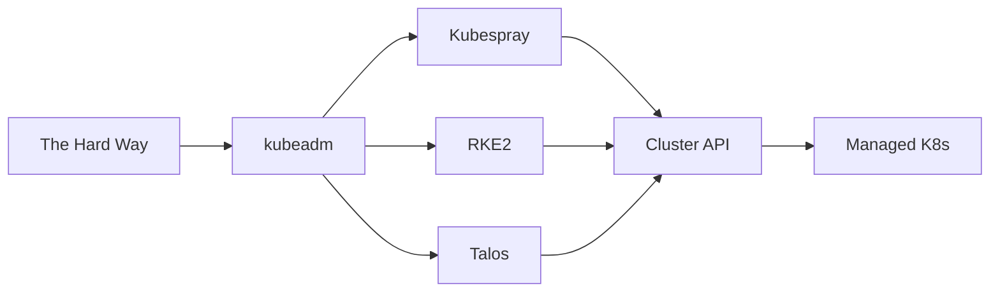
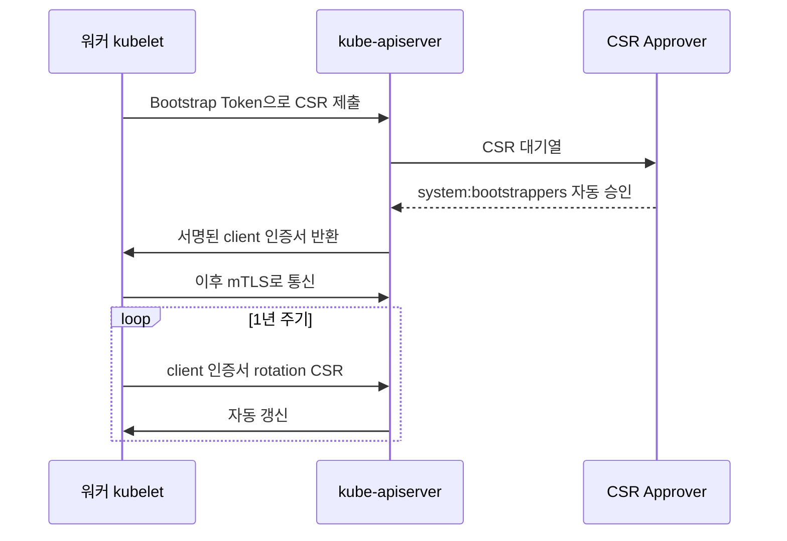
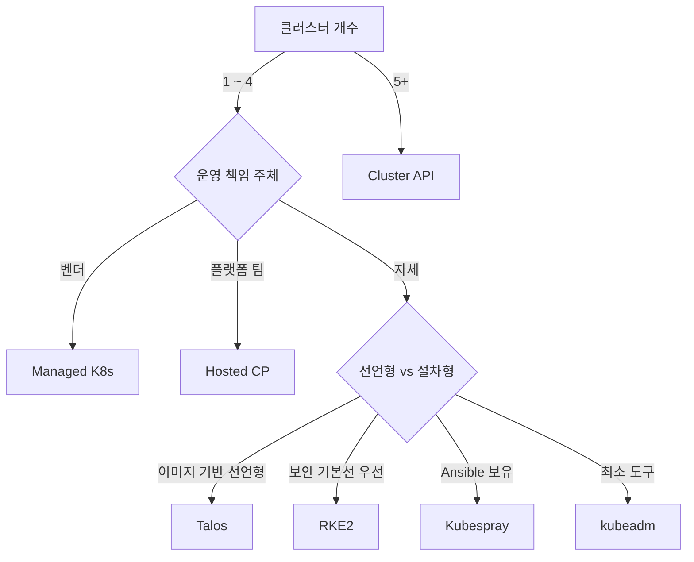

# 클러스터 구축 방법

Kubernetes 클러스터 구축은 **"컨트롤 플레인을 직접 조립할 것인가, 조립된
것을 받을 것인가"** 의 스펙트럼이다. 한쪽 끝에는 바이너리·systemd·인증서를
수작업으로 조합하는 **The Hard Way**, 반대쪽 끝에는 API 한 번 호출로
컨트롤 플레인이 제공되는 **managed Kubernetes(EKS·GKE·AKS)** 가 있다.

실무에서 고르는 축은 단순하다.

1. **누가 컨트롤 플레인을 운영하는가** — 우리 팀인가, 벤더인가.
2. **Day-2 운영(업그레이드·인증서·etcd 백업)을 누가 책임지는가.**
3. **보안 기본선(CIS·NSA 가이드 준수)을 도구가 주는가, 우리가 만드는가.**
4. **OS·CNI·CRI 선택을 자유롭게 하고 싶은가, 통합 스택을 받고 싶은가.**

이 네 질문에 대한 답이 도구를 결정한다. 이 글은 **kubeadm, Kubespray,
RKE2, kops, k3s/k0s, Talos Linux, Cluster API(CAPI), Hosted Control
Plane, managed Kubernetes** 를 같은 축에서 비교해 선택 기준을 제시한다.

> 관련: [HA 클러스터 설계](./ha-cluster-design.md)
> · [경량 K8s](./lightweight-k8s.md)
> · [클러스터 업그레이드](../upgrade-ops/cluster-upgrade.md)
> · [Version Skew](../upgrade-ops/version-skew.md)
> · [etcd](../architecture/etcd.md)

---

## 1. 구축 방법 스펙트럼



| 축 | 왼쪽(수동) | 오른쪽(관리형) |
|----|----------|--------------|
| 운영 책임 | 팀 | 벤더 |
| 커스터마이징 자유도 | 높음 | 낮음 |
| Day-0 시간 | 길다 | 짧다 |
| Day-2 부담 | 크다 | 작다 |
| 비용 구조 | 인력 | 서비스 요금 |
| 보안 기본선 | 팀 책임 | 벤더 기본 |

**"The Hard Way"(Kelsey Hightower)** 는 학습용이다. 원본 저장소는
2024-12에 GCP 기반으로 재작성되어 베어메탈 학습 가치는 과거보다 약해졌다.
프로덕션 후보는 kubeadm 이후부터 시작한다. kubeadm 자체도 "컨트롤 플레인
부트스트랩"만 해결하고, OS 준비·CRI 설치·CNI 배포·업그레이드 자동화는
팀이 채워야 한다. 이 **빈 공간을 누가 채우는가** 가 도구의 정체성이다.

---

## 2. 사전 요구사항 — 도구를 고르기 전에

구축 도구와 무관하게 모든 노드에서 충족해야 하는 요구사항이 있다.
managed Kubernetes는 벤더가 처리하지만, **자체 운영(kubeadm·Kubespray·
RKE2·Talos)** 에서는 이 단계의 실수가 가장 흔한 첫 장애다.

### 2.1 네트워크·방화벽

**컨트롤 플레인 노드.**

| 포트 | 프로토콜 | 용도 | 방향 |
|------|----------|------|------|
| 6443 | TCP | kube-apiserver | 모든 클라이언트 → CP |
| 2379-2380 | TCP | etcd client·peer | etcd 간 / CP → etcd |
| 10250 | TCP | kubelet API | CP ↔ 모든 노드 |
| 10257 | TCP | kube-controller-manager | localhost(헬스체크 외부) |
| 10259 | TCP | kube-scheduler | localhost(헬스체크 외부) |

**워커 노드.**

| 포트 | 프로토콜 | 용도 |
|------|----------|------|
| 10250 | TCP | kubelet API |
| 10256 | TCP | kube-proxy 헬스체크 |
| 30000-32767 | TCP | NodePort 서비스 범위 |

**CNI 오버레이.**

| 스택 | 포트·프로토콜 |
|------|-------------|
| Calico (BGP) | 179/TCP |
| Calico (VXLAN) | 4789/UDP |
| Flannel (VXLAN) | 8472/UDP |
| Cilium (VXLAN·WireGuard) | 8472/UDP·51871/UDP |
| Cilium (eBPF native routing) | 포드 CIDR 라우팅만 |

방화벽·L3 스위치·보안그룹 설계는 **위 포트 + Pod CIDR + Service CIDR +
노드 IP 대역** 을 허용해야 한다.

### 2.2 OS·커널·cgroup

| 항목 | 요구사항 |
|------|---------|
| 커널 | 5.4 이상 권장(eBPF CNI는 5.10+) |
| cgroup | **v2 기본**(RHEL 9·Ubuntu 22.04+·Debian 11+) |
| swap | 비활성 또는 kubelet `failSwapOn=false`(1.28+ GA) |
| SELinux·AppArmor | Enforcing·Enforce 가능(RKE2·Talos 기본) |
| 커널 모듈 | `br_netfilter`, `overlay`, `ip_vs*`(IPVS 모드) |
| sysctl | `net.ipv4.ip_forward=1`, `net.bridge.bridge-nf-call-iptables=1`, `net.bridge.bridge-nf-call-ip6tables=1` |

### 2.3 컨테이너 런타임(CRI)

2026년 기준 **containerd 단일 표준**. Docker shim은 1.24에서 제거됐고
CRI-O는 OpenShift 계열에서 유지된다. 핵심은 cgroup driver를
**systemd** 로 통일하는 것이다.

```toml
# /etc/containerd/config.toml
[plugins."io.containerd.grpc.v1.cri".containerd.runtimes.runc.options]
  SystemdCgroup = true
```

kubelet·containerd가 `systemd`로 일치하지 않으면 Pod이 뜨지 않는다.
**kubeadm 기반 구축의 첫 장애 원인 1위** 다.

### 2.4 부트 프로비저닝 계층

"노드 자체가 어디서 오는가" — 베어메탈에서는 OS 설치부터 자동화해야
실제 운영이 된다.

| 레이어 | 도구 | 어느 K8s 도구와 어울리는가 |
|-------|------|-------------------------|
| PXE·iPXE 부팅 | Matchbox, Tinkerbell | kubeadm·Kubespray·Talos |
| OS 프로비저닝 | MAAS, Foreman, FAI | Kubespray |
| 이미지 기반 | Talos Image Factory, Flatcar Ignition | Talos·CAPI Metal3 |
| cloud-init·Ignition | 대부분의 퍼블릭 클라우드 | kubeadm·RKE2 |
| 베어메탈 프로바이더 | Metal3(CAPM3), Sidero Omni | CAPI |

**온프렘·엣지** 에서 PXE/iPXE 없이 수십 대를 구축하려 하면 곧 한계에
부딪힌다. Metal3·Tinkerbell은 "K8s로 베어메탈을 관리"하는 Declarative
방식의 표준 흐름으로 자리잡았다.

---

## 3. 도구별 정체성

### 3.1 kubeadm — 공식 표준, "최소 실행 가능 클러스터"

kubeadm은 SIG Cluster Lifecycle이 유지하는 **공식 부트스트랩 도구**다.
컨트롤 플레인 컴포넌트를 static Pod으로 띄우고, TLS 인증서 체인을
생성하고, 노드 join 토큰을 발급한다. **하지만 그뿐이다.**

**핵심 명령어 흐름.**

```bash
# 첫 컨트롤 플레인 초기화
kubeadm init \
  --control-plane-endpoint "k8s-api.example.com:6443" \
  --pod-network-cidr "10.244.0.0/16" \
  --upload-certs

# 관리자 kubeconfig
export KUBECONFIG=/etc/kubernetes/admin.conf
# 또는 ~/.kube/config로 복사

# 워커 조인 명령어(24시간 유효) 재발급
kubeadm token create --print-join-command

# 추가 CP 조인(기존 인증키가 2시간 유효)
kubeadm init phase upload-certs --upload-certs
kubeadm token create --print-join-command --certificate-key <key>

# 상태·인증서 점검
kubeadm certs check-expiration
kubeadm certs renew all           # 평시 수동 갱신
kubeadm upgrade plan              # 업그레이드 경로 조회
kubeadm upgrade apply v1.35.2     # 컨트롤 플레인 업그레이드
kubeadm reset                     # 노드 초기화(신중히)
```

**핵심 경로.**

| 경로 | 내용 |
|------|------|
| `/etc/kubernetes/admin.conf` | 부트스트랩 관리자 kubeconfig |
| `/etc/kubernetes/pki/` | CA·컴포넌트 인증서·키 |
| `/etc/kubernetes/manifests/` | static Pod(apiserver·etcd 등) |
| `kube-system/kubeadm-config` ConfigMap | 클러스터 구성 스냅샷 |

**무엇을 하지 않는가.**

- 커널 모듈 로드·sysctl·swap off
- CRI·CNI 설치
- 노드 간 SSH 루프·인벤토리 관리
- 업그레이드 오케스트레이션(한 노드씩 drain·apply)
- 로드밸런서(HAProxy·keepalived) 구축

**장점.**

- 업스트림 Kubernetes와 완전히 동기화된 릴리즈.
- 공식 HA 토폴로지 문서("Creating HA clusters with kubeadm",
  "External etcd with kubeadm") 제공.
- 모든 상용·관리형 배포판(RKE2·Kubespray·Talos CAPI 프로바이더 등)이
  kubeadm 흐름을 재사용하거나 참조한다.

**약점.**

- 다중 노드 설치는 **SSH 루프 + Bash 스크립트** 가 되기 쉽다.
- HA 토폴로지·LB 구축은 팀 설계.
- 인증서 자동 갱신은 업그레이드 시에만 작동 — 평시는 수동.

**언제 쓰는가.** 학습·POC·소수 노드(3~10대), 상위 도구의 내부 동작을
파악해야 할 때(장애 대응에서 필수).

### 3.2 TLS Bootstrap·CSR·Bootstrap Token

kubeadm(및 이를 내부적으로 쓰는 모든 도구)에서 **노드 조인 시 kubelet이
자기 인증서를 받는 흐름**을 이해해야 "노드가 안 붙는다" 장애를 디버깅
할 수 있다.



**운영 핵심 개념.**

| 개념 | 설명 |
|------|------|
| Bootstrap Token | `kubeadm token create` 로 발급, **기본 24시간 TTL** (`--ttl 0` 로 무기한) |
| CSR 그룹 | `system:bootstrappers:kubeadm:default-node-token` |
| 자동 승인 | `system-bootstrap-node-bootstrapper` ClusterRoleBinding |
| Client 인증서 | kubelet 자체가 갱신(1.19+ 기본 on) |
| Serving 인증서 | **기본 자가서명**. 진짜 rotation은 `serverTLSBootstrap: true` + CSR 승인기 별도 필요 |

**노드가 조인되지 않을 때 점검 순서.**

```bash
kubeadm token list                        # 토큰 만료 여부
kubectl get csr                           # Pending 상태 CSR
kubectl certificate approve <csr-name>    # 수동 승인(자동 승인 고장 시)
journalctl -u kubelet --no-pager | tail   # 부트스트랩 실패 로그
```

### 3.3 Kubespray — Ansible + kubeadm의 결합

Kubespray는 SIG Cluster Lifecycle의 **Ansible 플레이북 모음**이다. 2.3
버전부터 내부적으로 kubeadm을 호출하며, kubeadm이 채우지 않는 OS 준비·
CNI 배포·업그레이드·애드온을 Ansible로 자동화한다.

**특징.**

| 항목 | 내용 |
|------|------|
| 실행 모델 | Ansible 플레이북(멱등) |
| 대상 OS | Ubuntu·Debian·RHEL·Rocky·openSUSE 등 다수 |
| CNI | Calico·Cilium·Flannel·Kube-OVN (Weave는 2024-06 EOL, 제거됨) |
| CRI | containerd(기본)·CRI-O |
| 업그레이드 | `cluster.yml`·`upgrade-cluster.yml` 재실행 |
| 설정 | `inventory/` + `group_vars/` 선언형 YAML |
| 에어갭 | `files_repo`·`registry_host` 변수로 내부 미러 지정 |

**강점.**

- **선언적 인벤토리** — 노드 목록·역할·변수를 Git에 저장해 재현 가능.
- **멱등성** — 중단된 설치를 다시 돌려도 같은 상태에 수렴.
- **벤더 락인 없음** — 베어메탈·VM·퍼블릭 클라우드 전부 동일 흐름.
- **에어갭 공식 지원** — 내부 레지스트리·파일 저장소 지정만으로 운영.

**약점.**

- Ansible SSH 루프는 **느리다** — 대규모 클러스터에서 수십 분~시간.
  `-f 20` 병렬도, `--limit` 활용 필수.
- Ansible 운영 경험이 없으면 디버깅이 어렵다.
- CIS 하드닝은 옵션으로 제공되나 검증·유지 책임은 팀.

**언제 쓰는가.** 이미 Ansible 자산이 있는 조직, 온프렘·하이브리드에서
다수 노드(10대+)를 다룰 때, CNI·CRI 조합의 자유도가 중요할 때.

### 3.4 RKE2 — 보안 내장, SUSE/Rancher 계열

RKE2(Rancher Kubernetes Engine 2)는 **보안 기본값과 단일 바이너리 배포**
를 특징으로 하는 SUSE/Rancher 계열 배포판이다. 업스트림 Kubernetes를
그대로 따라가며(RKE1이 Docker 기반이었던 것과 달리), CIS Benchmarks·
SELinux·FIPS 옵션을 기본 내장한다.

**특징.**

| 항목 | 내용 |
|------|------|
| 배포 단위 | 단일 바이너리 + systemd 서비스 |
| 기본 CNI | Canal(Calico + Flannel). 공식 옵션: `canal·cilium·calico·none` |
| 기본 CRI | embedded containerd |
| 보안 | CIS 하드닝 프로파일, SELinux·FIPS 모드 |
| 에어갭 | 이미지 tarball + `registries.yaml` 내부 미러 공식 지원 |
| 업그레이드 | `system-upgrade-controller` 기반 자동화 |

**강점.**

- **보안 기본선이 높다** — 정부·금융권·에어갭 환경에서 선호.
- **설치가 단순** — 1바이너리, 1 systemd unit, `/etc/rancher/rke2/config.yaml` 하나.
- **HA 컨트롤 플레인 토폴로지** 가 공식 문서에 패턴화됨.
- **인증서 자동 갱신** — 만료 90일 전에 자동.
- **Rancher Manager** 와 통합 시 멀티클러스터 관리 용이.

**약점.**

- SUSE/Rancher 생태계에 결합(자유도는 Kubespray보다 낮음).
- 업스트림 릴리즈 대비 패치 지연이 발생할 수 있음.
- CRI-O 등 커스텀 CRI는 공식 지원 범위 밖.

**언제 쓰는가.** 에어갭·온프렘·엣지의 보안 기본선 요구, 공식 패턴대로의
단순 운영, Rancher 멀티클러스터.

### 3.5 kops — AWS/GCE 중심 클러스터 라이프사이클

kops(`kubernetes-sigs/kops`)는 **AWS·GCE 를 1순위로 지원하는 공식 SIG
프로젝트** 다. CAPI 이전 세대에서 "AWS 자체 관리 K8s"의 표준이었다.
2026 기준 AWS·GCE 정식 지원, OpenStack·Hetzner·DigitalOcean 베타,
Azure 알파.

**언제 쓰는가.** 기존 kops 운영 자산을 유지해야 할 때. 신규 도입은
EKS·GKE 같은 managed 또는 **CAPI로 대체**되는 추세이므로 현 시점에서
greenfield 선택으로는 드물다.

### 3.6 k3s / k0s — 경량 배포판

k3s(Rancher), k0s(Mirantis)는 단일 바이너리에 컨트롤 플레인을 **임베디드**
시킨 경량 배포판이다. 엣지·IoT·개발 환경·소규모 프로덕션을 겨냥한다.
상세는 [경량 K8s](./lightweight-k8s.md) 에서 다룬다.

### 3.7 Talos Linux — Immutable OS

Talos Linux는 **Kubernetes만 실행하기 위해 설계된 불변 리눅스 배포**다.
SSH·셸이 없고, **gRPC API(talosctl)** 로만 관리한다. 루트 파일시스템이
읽기 전용 SquashFS라 드리프트 자체가 불가능하다.

**특징.**

| 항목 | 내용 |
|------|------|
| 관리 인터페이스 | talosctl(gRPC API) |
| 패키지 관리 | 없음(이미지 재구성으로 교체) |
| 설정 | `MachineConfig` YAML(선언형) |
| 업그레이드 | 이미지 교체 + A/B 파티션 롤백 |
| 보안 | kernel lockdown, verified boot, 이미지 서명 검증 기본 |
| SELinux | v1.10부터 **permissive 기본**(enforcing은 실험적, Flannel에서만 테스트됨) |

**강점.**

- **공급망·포렌식 관점에서 압도적** — 노드 OS 해시만으로 무결성 검증.
- **설정 드리프트 제거** — 모든 변경은 이미지 재배포.
- **GitOps 와 친화적** — MachineConfig을 Git으로 관리.
- **Cluster API 프로바이더**(CAPT) 가 공식 존재.

**약점.**

- 학습 곡선 — 전통적 리눅스 운영 감각과 다르다.
- 디버깅 — SSH가 없으므로 `talosctl dmesg`·`logs` 를 숙지해야 함.
- 서드파티 드라이버·에이전트는 **system extension** 을 통해서만.

**언제 쓰는가.** 규정 준수가 엄격한 환경(금융·의료·공공), 엣지 다수
사이트에서 드리프트 제로 운영, CAPI 기반 선언적 멀티클러스터.

### 3.8 Cluster API (CAPI) — 메타 라이프사이클

Cluster API는 **"Kubernetes로 Kubernetes를 만든다"** 는 접근이다.
관리 클러스터(management cluster)가 `Cluster`·`MachineDeployment`·
`KubeadmControlPlane` 같은 CRD를 받아 **워크로드 클러스터**를 프로비저닝
한다. 인프라 프로바이더(AWS·Azure·GCP·vSphere·Metal3·Talos)가 각각
구현을 담당한다.

**v1.12(2026-01)** 에서 **in-place update** 와 **chained upgrade** 가
추가됐다. 다만 in-place update는 **프로바이더 구현에 의존** 하며 모든
프로바이더가 지원하는 것은 아니다(Metal3·Talos 우선).

**언제 쓰는가.** 클러스터 수가 **5~10개 이상** 일 때, 생성·업그레이드·
폐기를 GitOps로 제어, 멀티 인프라를 동일 API로 다룰 때.

**주의.** 단일 클러스터 환경에서는 과잉 설계다. 관리 클러스터의 HA·
백업이 별도 과제가 된다.

### 3.9 Hosted Control Plane — 컨트롤 플레인을 외주

컨트롤 플레인을 **Pod으로 관리 클러스터에 호스팅** 하고, 데이터 플레인
만 로컬에 두는 패턴이 2024~2026년 확산됐다.

| 구현 | 주체 | 특징 |
|------|------|------|
| Kamaji | CLASTIX | CP를 StatefulSet으로 멀티테넌트 호스팅 |
| HyperShift | Red Hat(OCP) | OpenShift Hosted Control Planes 기반 |
| vCluster | Loft Labs | 가상 클러스터 — 멀티테넌시 관점 |
| GKE Autopilot | Google | 벤더 호스팅 완전 관리 |
| EKS Hybrid Nodes | AWS | EKS 컨트롤 플레인 + 온프렘 워커 |

컨트롤 플레인 Day-2는 벤더(또는 플랫폼 팀)가 맡고, 팀은 노드만 관리한다.
멀티테넌시·엣지·비용 최적화에서 유효한 옵션.

### 3.10 Managed Kubernetes — EKS / GKE / AKS

클라우드 사업자가 컨트롤 플레인을 운영한다. 팀은 **데이터 플레인(노드)**
만 책임진다.

| 항목 | EKS(AWS) | GKE(Google) | AKS(Azure) |
|------|---------|-------------|------------|
| 컨트롤 플레인 | 관리형(유료) | 관리형(Autopilot은 완전관리) | 관리형(무료/유료 티어) |
| 노드 관리 | self-managed / managed node group / Fargate / Karpenter | self-managed / node pool / Autopilot | self-managed / AKS node pool |
| 업그레이드 | 수동 버전 + managed node group auto | 릴리즈 채널(Rapid·Regular·Stable) | 수동·auto-upgrade 옵션 |
| 기본 네트워크 | VPC CNI (대안: Cilium·Calico add-on) | GKE Dataplane V2 (Cilium 기반 eBPF) | Azure CNI (대안: Cilium) |
| 특화 기능 | IAM Roles for SA, Fargate | Autopilot, Anthos | Entra ID 통합, Arc |

**강점.** 컨트롤 플레인 Day-2 부담 제거, SLA 보장, IAM·LB·스토리지
CSI 기본 연동.

**약점.** kube-apiserver 플래그·감사 경로·etcd 튜닝은 벤더 옵션
한계 안에서만, 버전 라인업·EOL이 벤더 스케줄에 묶임, 비용·락인.

---

## 4. 비교 표

### 4.1 종합 비교

| 기준 | kubeadm | Kubespray | RKE2 | Talos | CAPI | Hosted CP | Managed |
|------|:-------:|:---------:|:----:|:-----:|:----:|:---------:|:-------:|
| 컨트롤 플레인 책임 | 팀 | 팀 | 팀 | 팀 | 팀 | 플랫폼 팀 | 벤더 |
| 선언적 구성 | ✗ | ✓(Ansible) | ○(config.yaml) | ✓(MachineConfig) | ✓(CRD) | ✓(CRD) | △(Terraform) |
| HA 토폴로지 | 공식 문서 | 포함 | 공식 문서 | 공식 문서 | 포함 | 호스트 제공 | 자동 |
| 출고 보안 기본선* | 기본 | 기본 | **CIS 프로파일** | **최소 공격면** | 프로바이더 의존 | 플랫폼 의존 | 벤더 기본 |
| 에어갭 | 수동 | 공식 지원 | **공식 지원** | 지원 | 프로바이더 의존 | 플랫폼 의존 | 제한적 |
| 커스터마이징 | **최상** | 상 | 중 | 하 | 중 | 하 | 하 |
| 학습 곡선 | 중 | 상(Ansible) | 하 | **상** | **최상** | 중 | 하 |
| 베어메탈 | ✓ | ✓ | ✓ | ✓ | 프로바이더별 | 데이터 플레인만 | ✗ |
| 멀티 클러스터 | ✗ | 가능 | Rancher 연동 | 가능 | **최적** | 플랫폼 제공 | 벤더 콘솔 |

*보안 기본선은 **출고 상태 기준** 이다. kubeadm·Kubespray도 CIS
kube-bench + audit policy + PSA 적용 시 RKE2와 동등 수준 달성 가능.

### 4.2 Day-2 운영 관점

| 운영 작업 | kubeadm | Kubespray | RKE2 | Talos | Managed |
|----------|---------|-----------|------|-------|---------|
| CP 인증서 갱신 | 업그레이드 시 자동, 평시 `kubeadm certs renew` | 플레이북 재실행 | 자동(90일 전) | 이미지 교체 | 자동 |
| etcd 백업 | 수동 cron | 플레이북 | 내장 옵션 | `talosctl etcd snapshot` | 자동(대부분) |
| 노드 추가 | join 토큰 발급 | 인벤토리 수정 후 재실행 | 토큰 재사용 | MachineConfig | UI·API |
| OS 패치 | 팀 OS 관리 | Ansible role | OS 관리 | 이미지 교체 | 노드 풀 교체 |
| CP 교체 | 수동(복잡) | 플레이북 | `rke2 server` 재구성 | MachineConfig 변경 | 벤더 처리 |

### 4.3 에어갭 운영

| 도구 | 미러 전략 | 주요 변수·경로 |
|------|---------|--------------|
| kubeadm | 이미지 수동 pull + 내부 레지스트리 | `kubeadm init --image-repository` |
| Kubespray | 내부 레지스트리 + 내부 파일 저장소 | `registry_host`, `files_repo` |
| RKE2 | tarball + 내부 레지스트리 | `images` tarball, `/etc/rancher/rke2/registries.yaml` |
| Talos | 이미지 교체 + 내부 레지스트리 | `MachineConfig.machine.registries` |
| CAPI | 프로바이더별 | 프로바이더 문서 참조 |

---

## 5. 선택 기준



**의사결정 축.**

1. **클러스터 5개 이상 → CAPI** 를 진지하게 검토.
2. **에어갭·CIS 기본선 필수 → RKE2 또는 Talos**.
3. **이미지 기반·드리프트 제로 → Talos**.
4. **Ansible 자산 있음 → Kubespray** — 없으면 도입 금물.
5. **POC·학습·단순 베어메탈 → kubeadm**.
6. **컨트롤 플레인 운영 가치 낮음 → Managed 또는 Hosted CP**.

---

## 6. 주요 의사결정 포인트

### 6.1 데이터스토어(etcd) 토폴로지

컨트롤 플레인과 **같은 노드에 etcd를 두는가(stacked), 별도 노드에 두는가
(external)** 는 구축 단계에서 결정된다. 상세는
[HA 클러스터 설계](./ha-cluster-design.md) 참조.

| 토폴로지 | 장점 | 단점 | 어느 도구가 편한가 |
|---------|------|------|----------------|
| Stacked | 노드 수 3 이상, 설정 단순 | CP·etcd 장애 커플링 | kubeadm·RKE2 기본 |
| External | 장애 격리, etcd 독립 튜닝 | 노드 수가 늘어남 | Kubespray 옵션, 대형 환경 |

### 6.2 CNI 선택의 도구 의존성

| 도구 | 기본 CNI | 공식 대안 |
|------|---------|----------|
| kubeadm | 없음(팀 선택) | Cilium·Calico·Flannel 등 자유 |
| Kubespray | Calico | Cilium·Flannel·Kube-OVN 등 |
| RKE2 | Canal | `canal·cilium·calico·none` |
| Talos | Flannel | Cilium·Calico(`cni: none` + 수동 설치) |
| Managed | 벤더 기본 | 일부 교체 가능 |

**Cilium + Gateway API** 자유도는 kubeadm·Kubespray가 최상. RKE2·Talos
는 프로파일/옵션 범위 안에서만 허용.

### 6.3 인증서 수명

| 도구 | 기본 수명 | 자동 갱신 |
|------|---------|---------|
| kubeadm | 1년 | `kubeadm upgrade apply/node` 시 자동, 평시 수동 |
| kubeadm(kubelet client) | 1년 | **rotation 기본 on(1.19+)** |
| kubeadm(kubelet serving) | 1년 | **기본 자가서명**, `serverTLSBootstrap: true` + CSR 승인기 시 rotation |
| Kubespray | 1년(kubeadm 위임) | 플레이북 재실행 |
| RKE2 | 1년 | **만료 90일 전 자동** |
| Talos | 이미지 수명 내 | 이미지 교체 |
| Managed | 벤더 관리 | 자동 |

**kubeadm 운영 사고 원인 1위가 인증서 만료**다.
`kubeadm certs check-expiration` 를 모니터링에 편입하고, 평시 갱신
cron을 반드시 설계한다.

### 6.4 버전 스큐 정책

**근본 스큐 규칙(kube-apiserver ↔ kubelet n-3 등)** 은 모든 도구에서
동일하다. 차이는 **업그레이드 경로·주기** 다.

- kubeadm·Kubespray: 업스트림 릴리즈 직후 적용 가능.
- RKE2: 업스트림 + 수 주 지연.
- Talos: 이미지 릴리즈 주기에 동기.
- Managed: 벤더 정책·릴리즈 채널.

상세는 [Version Skew](../upgrade-ops/version-skew.md),
[클러스터 업그레이드](../upgrade-ops/cluster-upgrade.md) 참조.

---

## 7. 온프렘 운영의 현실적 선택

온프렘·베어메탈·하이브리드에서 실무 상위 3선택지.

### 7.1 Kubespray (Ansible 조직)

이미 Ansible을 쓰는 조직에게 자연스럽다. 단점은 설치·업그레이드 속도
(대규모에서 시간 단위). 병렬도·`--limit` 활용 필수.

### 7.2 RKE2 (보안·단순 운영)

에어갭·폐쇄망·CIS 요구가 있으면 1순위. SUSE 상용 지원 제공.
`/etc/rancher/rke2/config.yaml` + `registries.yaml` 두 파일로 대부분
구성. Rancher Manager와 결합 시 멀티클러스터 관리 용이.

### 7.3 Talos + CAPI (미래 지향)

**드리프트 제로, GitOps 네이티브** 를 원한다면. 학습 비용은 크지만,
일단 구축하면 Day-2 부담이 극단적으로 줄어든다. 엣지 다수 사이트나
규제 산업에서 채택 증가.

---

## 8. 안티패턴

| 안티패턴 | 문제 | 대안 |
|---------|------|------|
| 프로덕션에서 `kubeadm init` 을 문서 보며 수동 반복 | 재현성·롤백 불가, 인증서 만료 사고 | Kubespray/RKE2/Talos로 전환 |
| Minikube·kind 클러스터를 프로덕션 전환 | 단일 노드, 스토리지·네트워크 모델이 다름 | 처음부터 프로덕션 도구 선택 |
| 클러스터별로 다른 도구 혼용 | 업그레이드·트러블슈팅 절차가 N배 | 조직 표준 한 가지 |
| Managed에서 컨트롤 플레인 설정을 우회·해킹 | 벤더 업그레이드 시 깨짐 | 데이터 플레인·애드온으로 풀기 |
| 엣지 100 사이트에 kubeadm을 SSH로 설치 | 드리프트·보안 지옥 | Talos + CAPI + PXE |
| 단일 클러스터에 CAPI 도입 | 관리 클러스터 운영 부담만 추가 | kubeadm/RKE2 |
| PXE·MAAS 없이 수십 대 베어메탈 수동 OS 설치 | 재현성·추적성 부재 | Metal3·Tinkerbell·MAAS 도입 |

---

## 9. 체크리스트

**구축 전.**

- [ ] 클러스터 개수·규모·사이트 수 파악
- [ ] 에어갭·CIS·규제 요구사항 확인
- [ ] 팀의 자동화 자산(Ansible·Terraform·GitOps) 확인
- [ ] 부트 프로비저닝 계층(PXE·MAAS·Metal3·Image Factory) 설계
- [ ] 컨트롤 플레인 HA 토폴로지(stacked vs external) 결정
- [ ] 네트워크(포트·Pod/Service CIDR·방화벽) 설계
- [ ] CNI·CRI·Storage·Gateway API 기본 선택
- [ ] 백업·DR(etcd 스냅샷) 방법 결정
- [ ] 인증서 수명 관리 방안 설계

**구축 후 검증.**

- [ ] `kubectl get nodes -o wide` — 모든 노드 Ready
- [ ] `kubectl get pods -A` — kube-system/CNI/CoreDNS 정상
- [ ] `kubectl version` — CP·kubelet 버전 스큐 확인
- [ ] `kubeadm certs check-expiration`(해당 도구) — 인증서 만료일 기록
- [ ] etcd 스냅샷 1회 수행 + 복원 리허설
- [ ] CP 1대 장애 시 가용성 확인
- [ ] 노드 드레인·업그레이드 1회 리허설

---

## 참고 자료

- [Installing Kubernetes with deployment tools — kubernetes.io](https://kubernetes.io/docs/setup/production-environment/tools/) — 2026-04-24
- [kubeadm — Creating a cluster](https://kubernetes.io/docs/setup/production-environment/tools/kubeadm/create-cluster-kubeadm/) — 2026-04-24
- [kubeadm — Creating HA clusters](https://kubernetes.io/docs/setup/production-environment/tools/kubeadm/high-availability/) — 2026-04-24
- [kubeadm — TLS Bootstrapping](https://kubernetes.io/docs/reference/access-authn-authz/kubelet-tls-bootstrapping/) — 2026-04-24
- [kubeadm Certificate Management](https://kubernetes.io/docs/tasks/administer-cluster/kubeadm/kubeadm-certs/) — 2026-04-24
- [Required ports](https://kubernetes.io/docs/reference/networking/ports-and-protocols/) — 2026-04-24
- [Kubespray documentation](https://kubespray.io/) — 2026-04-24
- [Kubespray comparisons (vs kubeadm, kops)](https://github.com/kubernetes-sigs/kubespray/blob/master/docs/getting_started/comparisons.md) — 2026-04-24
- [RKE2 Documentation](https://docs.rke2.io/) — 2026-04-24
- [RKE2 Air-Gap Install](https://docs.rke2.io/install/airgap) — 2026-04-24
- [RKE2 CIS Hardening Guide](https://docs.rke2.io/security/hardening_guide) — 2026-04-24
- [Talos Linux Documentation](https://www.talos.dev/latest/) — 2026-04-24
- [Talos SELinux (v1.12)](https://www.talos.dev/v1.12/advanced/selinux/) — 2026-04-24
- [Talos Image Factory](https://factory.talos.dev/) — 2026-04-24
- [Cluster API Book](https://cluster-api.sigs.k8s.io/) — 2026-04-24
- [Cluster API v1.12 release — kubernetes.io/blog](https://kubernetes.io/blog/2026/01/27/cluster-api-v1-12-release/) — 2026-04-24
- [kOps — Kubernetes Operations](https://kops.sigs.k8s.io/) — 2026-04-24
- [Metal3 — Bare Metal Operator](https://metal3.io/) — 2026-04-24
- [Tinkerbell](https://tinkerbell.org/) — 2026-04-24
- [Kamaji — Hosted Control Planes](https://kamaji.clastix.io/) — 2026-04-24
- [Kubernetes Releases](https://kubernetes.io/releases/) — 2026-04-24
- [endoflife.date/kubernetes](https://endoflife.date/kubernetes) — 2026-04-24
