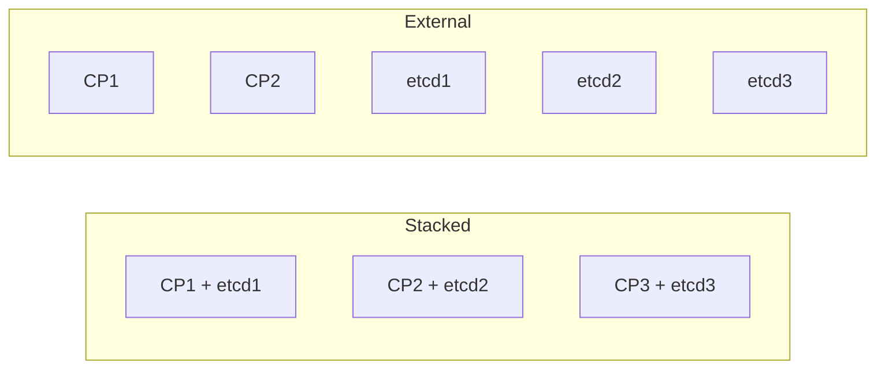
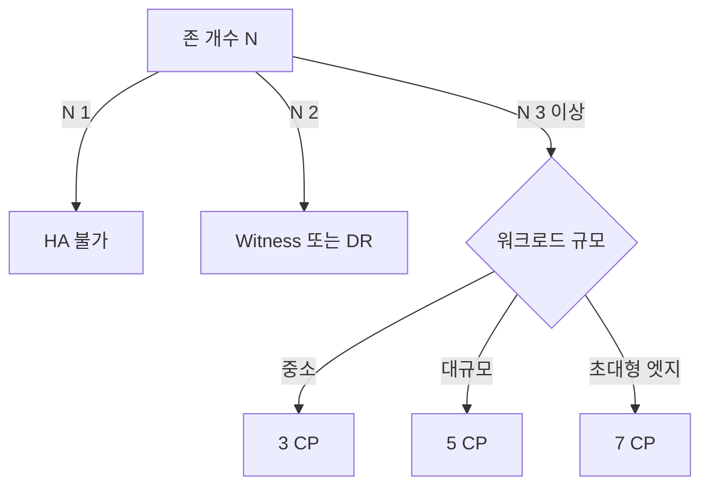

# HA 클러스터 설계

Kubernetes의 가용성은 **세 레이어의 독립 설계**로 결정된다.

1. **컨트롤 플레인(kube-apiserver·scheduler·controller-manager)**
2. **etcd 데이터스토어**
3. **데이터 플레인(워커 노드·Pod·스토리지·네트워크)**

각 레이어는 **자기만의 장애 도메인 전략** 이 필요하다. "컨트롤 플레인
3대면 HA다"는 오해가 흔하지만, 3대가 같은 랙·같은 전원·같은 스위치에
있으면 **고장 도메인 하나로 수렴** 한다. HA는 "복제 수"가 아니라 "서로
독립된 장애 도메인에 복제되어 있는가"의 문제다.

이 글은 온프렘·베어메탈·클라우드 공통으로 적용되는 **HA 클러스터
설계 원칙과 실무 패턴** 을 정리한다.

> 관련: [클러스터 구축 방법](./cluster-setup-methods.md)
> · [클러스터 업그레이드](../upgrade-ops/cluster-upgrade.md)
> · [etcd](../architecture/etcd.md)
> · [Topology Spread](../scheduling/topology-spread.md)
> · [PDB](../reliability/pdb.md)
> · [Graceful Shutdown](../reliability/graceful-shutdown.md)

---

## 1. HA의 기본 모델

### 1.1 장애 도메인(Failure Domain)

**독립적으로 실패하는 최소 단위** 를 장애 도메인이라 한다. 복제본은
**반드시 서로 다른 장애 도메인에 분산** 되어야 HA가 성립한다.

| 레벨 | 온프렘 예 | 클라우드 예 |
|------|---------|-----------|
| 프로세스 | 컨테이너 | 컨테이너 |
| 호스트 | 물리 서버 | VM |
| 랙 | 동일 TOR 스위치·PDU | 동일 호스트 풀 |
| 전원 구역 | 동일 UPS·배전반 | Placement Group |
| 존(zone) | 동일 DC 층·구역 | Availability Zone |
| 리전(region) | 별도 DC·도시 | Region |

**핵심.** "같은 랙에 3대" = 1 도메인. "3개 랙에 1대씩" = 3 도메인.
kubeadm·RKE2·Kubespray 어느 것을 써도 이 원칙은 같다.

### 1.2 쿼럼은 etcd의 문제다 — CP는 쿼럼이 없다

가장 흔한 오해. **kube-apiserver·scheduler·controller-manager는 무상태**
이며, 쿼럼이 없다. 따라서 **짝수도 허용**된다(예: 2·4대). 다만 **scheduler
·controller-manager는 Leader Election** 으로 한 번에 한 인스턴스만 활동
한다(active-passive).

쿼럼 제약은 **etcd에만 적용**된다. Stacked 토폴로지에서는 CP가 etcd를
같이 끌고 가므로 결과적으로 CP 수가 etcd 제약을 따라 홀수가 된다.
External 토폴로지에서는 **etcd 3·5·7 + CP 2 이상** 처럼 분리 설계가
가능하다.

### 1.3 etcd 쿼럼 표

etcd는 Raft 합의 알고리즘을 쓰며, **과반(majority)** 이 살아 있어야
쓰기가 가능하다. 쿼럼 = `(n/2) + 1`.

| 멤버 수 | 쿼럼 | 허용 장애 수 |
|:------:|:----:|:-----------:|
| 1 | 1 | 0 |
| 3 | 2 | **1** |
| 4 | 3 | 1 |
| 5 | 3 | **2** |
| 6 | 4 | 2 |
| 7 | 4 | **3** |

**짝수는 불리하다.** 4대는 3대와 동일한 허용 장애 수를 가지면서 노드만
늘어난다. 6대는 5대와 같다. 따라서 **3·5·7 중에서 고른다**.

### 1.4 왜 7을 넘기면 안 되는가

etcd는 모든 write를 쿼럼으로 복제한다. 멤버가 늘면 **네트워크 왕복과
디스크 fsync가 늘어 write latency가 악화** 된다. Google Chubby(etcd의
철학적 선배)도 5 권장. etcd 공식도 최대 7이 상한선.

---

## 2. etcd 토폴로지 결정

### 2.1 Stacked vs External



**Stacked** — 컨트롤 플레인 노드 위에 etcd가 같이 올라간다. kubeadm
기본값.

**External** — etcd가 별도 노드 3대(또는 5대).

### 2.2 비교

| 항목 | Stacked | External |
|------|:-------:|:--------:|
| 최소 노드 수 | 3(CP=etcd=3) | 5 이상(etcd 3 + CP 2 이상) |
| 권장 노드 수 | 3·5 CP | etcd 3·5 + CP 2·3 |
| 설정 복잡도 | 낮음 | 높음 |
| 장애 격리 | 낮음(CP·etcd 커플링) | **높음** |
| 자원 경합(디스크 I/O) | 있음 | **없음** |
| etcd 튜닝 자유도 | 낮음 | **높음** |
| 비용 | 낮음 | 높음 |
| 어느 도구가 편한가 | kubeadm·RKE2 기본 | Kubespray 옵션, 대형 환경 |

### 2.3 언제 External을 써야 하는가

- 워크로드가 **etcd에 가해지는 부하를 예측할 수 없을 때** (대규모
  이벤트 기반, 많은 CRD·Operator).
- 컨트롤 플레인 OS 패치·재기동과 **etcd 운영 주기를 분리** 하고 싶을 때.
- etcd에 **전용 NVMe·네트워크 QoS** 를 부여하고 싶을 때.
- 규모가 커져 **etcd 전용 백업·복원 파이프라인** 을 독립 운영할 때.

### 2.4 디스크·네트워크 요구사항

etcd는 **fsync latency** 와 **네트워크 RTT** 에 극도로 민감하다.

| 항목 | 권장 |
|------|------|
| 디스크 | SSD/NVMe, fsync p99 < 10ms |
| 디스크 대역폭 | 전용. SAN·공유 풀 금물 |
| 네트워크 RTT | 멤버 간 짧고 안정(기본 heartbeat 100ms·election 1000ms 기준 RTT 10ms 이내 권장) |
| 네트워크 대역폭 | 1Gbps 이상(5·7 멤버는 10Gbps 권장) |
| DB 크기 | 기본 2GiB, `--quota-backend-bytes` 로 확장 가능, **실무 상한 8GiB** |

**DB 크기 8GiB 가이드.** 8GiB 를 넘기면 기동·스냅샷·복원 시간이 급격히
늘고 메모리 사용량도 상승한다. CRD·Secret·ConfigMap이 많은 환경에서는
2GiB 에 금세 도달하므로 **quota 4~8GiB 설정 + defragmentation 주기
운영** 이 설계 단계의 결정 항목이다.

**멀티 리전에 etcd 단일 클러스터 배치는 금기**. RTT가 늘면 heartbeat·
election 타임아웃을 키워야 하고(그 대가로 failover 감지 지연), 쿼럼
손실 위험이 커진다. 리전 HA는 **별도 클러스터 + 애플리케이션 레플리카**
로 해결한다.

### 2.5 etcd Learner — CP 추가 시 필수 경로

etcd v3.4+ 에 도입된 **learner** 는 투표권 없이 로그만 복제받는 임시
상태다. kubeadm 1.31+ 부터 `kubeadm join --control-plane` 이 **learner
로 추가 후 승격** 하는 흐름을 기본으로 사용한다.

**왜 중요한가.** 과거에는 CP를 조인할 때 곧바로 voter가 되어, 초기
동기화 중 leader 장애가 나면 **쿼럼이 일시 붕괴** 했다. learner는 이
창을 닫는다.

**운영 확인.**

```bash
etcdctl member list -w table     # Type=learner 확인
etcdctl member promote <id>      # 수동 승격(자동화되어 있으면 불필요)
```

### 2.6 백업·복원 — 토폴로지별 차이

| 토폴로지 | 스냅샷 위치 | 복원 시 주의 |
|---------|------------|------------|
| Stacked | **모든 CP에서 중복 저장 불필요**, 한 노드에서 `etcdctl snapshot save` 충분 | 복원 시 initial-cluster-token 재설정 |
| External | etcd 노드에서 수행, 별도 오브젝트 스토리지로 오프사이트 | 복원 후 CP의 `--etcd-servers` 엔드포인트 점검 |

**복원 시 공통**: TLS 인증서·`initial-advertise-peer-urls`·
`initial-cluster-token` 값을 새로 재생성해야 기존 클러스터와 혼선을
피할 수 있다. 설계 단계에서 **주기(시간 단위)·보존(일·주)·오프사이트**
를 결정한다.

---

## 3. 컨트롤 플레인 배치

### 3.1 최소 원칙

1. **최소 3 CP**(Stacked) 또는 etcd 3 + CP 2+(External).
2. **서로 다른 장애 도메인**(랙·AZ)에 분산.
3. **한 존 장애로 etcd 과반이 깨지지 않는** 배치.

**잘못된 예.**

| 구성 | 존 분산 | etcd 과반 유지? |
|------|--------|:-------------:|
| Stacked 2 CP(A) + 1 CP(B) | 2·1 | A 장애 시 ❌ |
| Stacked 3 CP 전부 A | 3·0·0 | A 장애 시 ❌ |
| Stacked 1 CP × 3 AZ | 1·1·1 | **✓** |
| Stacked 5 CP: 2·2·1 | 2·2·1 | 어느 한 AZ 장애 시 ✓ |

### 3.2 2-AZ 제약과 witness 노드

**AZ가 2개뿐인 환경에서는 진정한 HA가 불가능** 하다. 세 번째 존이 없으면
"AZ 하나 장애 시 과반 유지"가 수학적으로 성립하지 않는다.

**Witness 패턴.**

- **세 번째 AZ(또는 제 3의 사이트)에 etcd 1멤버만 배치**.
- CP는 주 2 AZ에 2+1 또는 2+2 배치.
- witness 사이트 RTT는 etcd heartbeat·election 타임아웃 안에 들어와야
  한다(경험적으로 **RTT < 20~50ms**, election 타임아웃은 RTT의 10배
  이상 여유).
- witness는 워크로드를 돌리지 않는 작은 노드도 충분.

Google Cloud Spanner·CockroachDB의 "3-zone with thin witness" 패턴이
이 설계의 참고.

### 3.3 로드밸런서(API Server 프론트)

kube-apiserver 엔드포인트는 **HA LB 뒤에 VIP** 로 숨긴다. 노드·Pod이
여기를 바라보게 한다.

**온프렘 선택지 비교.**

| 방식 | 특징 | 장점 | 단점 |
|------|------|------|------|
| HAProxy + Keepalived | VRRP VIP + L4 프록시 | 검증된 표준, L4/L7 유연 | 별도 노드·설정, VRRP 멀티캐스트 요건 |
| kube-vip (L2/ARP) | CP 안 static Pod, Leader 가 VIP 보유 | 외부 LB 불필요, GitOps 친화 | Leader 장애 시 VIP failover 동안 active 연결 drop |
| kube-vip (BGP) | BGP로 VIP 광고, ECMP | 장애 시 무중단에 가까움 | 업스트림 BGP 피어링 필요 |
| 외부 어플라이언스 | F5·A10·Citrix 등 | 엔터프라이즈 기능 | 라이선스·락인 |
| DNS round-robin | 단순 | 설정 단순 | 헬스체크·drain 없음, **프로덕션 금기** |

### 3.4 HAProxy + Keepalived 운영 주의

- **split-brain** — VRRP 멀티캐스트가 단절되면 두 노드가 동시에 VIP
  보유. 같은 L2에 전용 라우팅·ACL 필요.
- **헬스체크 경로** — `/readyz`(로드 대응에 가장 정확) 사용. `/healthz`
  는 "살아있다"만 보고 과부하 CP도 통과시킴.
- **배치** — 별도 LB 노드 2대가 안전. CP 노드 위에 겹치면 CP 과부하가
  LB 장애로 번진다.
- **keepalived 우선순위(priority)** 를 정적으로 고정하지 말고
  **notify 스크립트**로 kube-apiserver 상태 반영.

### 3.5 MetalLB를 API Server LB로 쓰지 말 것

MetalLB는 Service·EndpointSlice를 watch 하기 위해 **kube-apiserver에
의존** 한다. API Server VIP를 MetalLB가 제공한다면 **API가 없으면
MetalLB가 못 뜨고, MetalLB가 없으면 API가 안 뜨는** 순환 의존이 된다.
API Server 프론트는 **MetalLB에 두지 말고** kube-vip·HAProxy+Keepalived·
외부 LB로 둔다. MetalLB는 **사용자 워크로드의 LoadBalancer 서비스** 전용.

### 3.6 goaway-chance — HTTP/2 long-lived connection 편중

kube-apiserver는 HTTP/2 long-lived connection 을 쓴다. **CP 롤링 업그
레이드·재기동 후 한 인스턴스에 70~90% 연결이 쏠리는** 현상이 흔하다.

**해결.** `--goaway-chance=0.001` — apiserver가 0.1% 확률로 GOAWAY
프레임을 보내 클라이언트가 재연결한다. 롤링 업그레이드 후 자연스럽게
재분산된다.

```yaml
# /etc/kubernetes/manifests/kube-apiserver.yaml
spec:
  containers:
  - command:
    - kube-apiserver
    - --goaway-chance=0.001
```

### 3.7 shutdown-delay-duration — 재기동 시 5xx 방지

apiserver에 SIGTERM이 오면 즉시 `/readyz`가 실패 상태로 전이된다. LB가
이를 감지해 drain 할 시간이 없으면 **in-flight 요청이 중단**되어 5xx가
튄다.

**해결.** `--shutdown-delay-duration=30s` 이상 — apiserver가 실제
종료를 30초 늦춰 LB가 drain 하도록 유예.

### 3.8 인증서 SAN — 모든 CP IP·VIP·DNS·선택 DNS 포함

인증서 SAN이 누락되면 `kubectl --server=https://<CP-IP>:6443` 또는
DNS 이름으로 접근 시 TLS 검증 실패. **사후 추가 시 인증서 재발급
필요**(kubeadm은 `kubeadm certs renew` 또는 `kubeadm-config` 수정 후
재생성).

```yaml
# kubeadm-config.yaml
apiServer:
  certSANs:
    - 10.0.0.100            # VIP
    - k8s-api.example.com   # 공식 DNS
    - 10.0.0.10             # CP1
    - 10.0.0.11             # CP2
    - 10.0.0.12             # CP3
    - kubernetes.default.svc
    - kubernetes.default.svc.cluster.local
```

### 3.9 control-plane-endpoint — IP보다 DNS를 권장

`kubeadm init --control-plane-endpoint <VIP|DNS>:6443` 로 고정한다.

- **IP로 지정** → DR 이전 시 클러스터 ID가 IP에 묶여 이전 어려움.
- **DNS로 지정** → TTL로 새 VIP/사이트로 유연 이전.

DNS를 공식 엔드포인트로 두고, DNS SAN 과 VIP SAN 을 함께 인증서에
포함시키는 것이 가장 유연한 구성.

---

## 4. 컨트롤 플레인 업그레이드 시 HA 유지

HA 설계의 진짜 시험대는 **업그레이드 중** 이다.

### 4.1 kubeadm 기준 순서


1. **첫 CP**: `kubeadm upgrade plan` 으로 경로 조회 → `kubeadm upgrade
   apply vX.Y.Z` → `kubelet`·`kubectl` 패키지 업그레이드 → 재기동.
2. **추가 CP**: `kubeadm upgrade node` (plan·apply 아님) → 패키지 →
   재기동.
3. **워커**: drain → `kubeadm upgrade node` → 패키지 → uncordon.

**한 번에 한 대** 원칙이 쿼럼 유지의 핵심. 상세는
[클러스터 업그레이드](../upgrade-ops/cluster-upgrade.md) 참조.

### 4.2 업그레이드 중 HA 체크포인트

- `--goaway-chance` + `--shutdown-delay-duration` 이 적용된 상태에서
  5xx 미발생.
- etcd `etcdctl endpoint health` 로 쿼럼 상태 확인.
- `kubectl get --raw /readyz?verbose` 로 컴포넌트별 readiness 확인.
- 롤링 중 controller-manager·scheduler 리더 교체가 매끄럽게 일어남.

### 4.3 CP 노드 전면 재기동 순서

단일 노드를 재기동할 때도 순서를 지킨다.

```
(노드 내) etcd 먼저 → kube-apiserver → kube-controller-manager → kube-scheduler
```

Static Pod은 kubelet이 부팅 순서를 관리하지만, **실패 디버깅**에서는
이 순서를 기억해야 원인을 짚는다.

---

## 5. 데이터 플레인 HA

### 5.1 노드 라벨 — topology keys

Pod 분산의 기준이 되는 노드 라벨을 **일관되게** 부여한다.

| 라벨 키 | 용도 | 예 |
|--------|------|-----|
| `topology.kubernetes.io/region` | 리전 | `kr-seoul` |
| `topology.kubernetes.io/zone` | 존(AZ·랙·DC층) | `rack-a`, `ap-ne-2a` |
| `kubernetes.io/hostname` | 노드명 | `node-01` |

**온프렘에서 zone 라벨을 "랙"으로 매핑하는 것이 가장 흔한 패턴**이다.
물리 전원·네트워크 경로가 함께 묶이는 단위가 zone.

### 5.2 Topology Spread — 최신 필드

```yaml
spec:
  topologySpreadConstraints:
    - maxSkew: 1
      topologyKey: topology.kubernetes.io/zone
      whenUnsatisfiable: DoNotSchedule
      labelSelector:
        matchLabels:
          app: web
      matchLabelKeys: ["pod-template-hash"]   # 롤아웃 버전별 분리 스프레드(1.30 GA)
      nodeAffinityPolicy: Honor               # nodeAffinity를 스프레드에 반영(1.33 GA)
      nodeTaintsPolicy: Honor                 # taint 제외도 반영
```

**`matchLabelKeys`** — 롤링 업데이트 시 **새 revision과 구 revision을
서로 다른 집합으로 간주해 각각 스프레드**. 미적용 시 롤링 중 한 존에
새 replica가 몰리는 고전 이슈.

상세는 [Topology Spread](../scheduling/topology-spread.md) 참조.

### 5.3 PodAntiAffinity와의 조합

- **Topology Spread** = "얼마나 고르게 분산할까"(강제성 maxSkew 조정).
- **PodAntiAffinity** = "이 노드에 동일 Pod 두 개는 절대 금지".

둘은 **상보적**. StatefulSet(쿼럼 워크로드)은 AntiAffinity로 노드 고정,
Deployment(무상태 스케일)는 Topology Spread 로 고르게 분산이 일반형.

### 5.4 PDB — 자발적 중단 하한선

노드 드레인·Autoscaler 축소 시 가용성 하한 선언. 상세는
[PDB](../reliability/pdb.md).

---

## 6. 스토리지 HA

### 6.1 PV의 AZ 제약

블록 스토리지(AWS EBS·GCE PD·vSphere FCD·로컬 디스크)는 **AZ 경계를
넘지 못한다**. Pod이 다른 AZ로 스케줄되면 볼륨 attach가 실패한다.

**해법.**

1. **StorageClass의 `volumeBindingMode: WaitForFirstConsumer`** — Pod이
   스케줄된 AZ에 PV를 만들도록 지연.
2. **AZ별 노드 풀 + Pod affinity** — 같은 존으로 고정.
3. **AZ 복제 스토리지**(Rook-Ceph·Longhorn·Portworx) — 스토리지 자체가
   AZ 간 복제.

### 6.2 온프렘 주 사례 — Rook-Ceph CRUSH 와 K8s zone 라벨 동기화

온프렘의 일반적 스택: **워커 노드 로컬 NVMe + Rook-Ceph 통합**. 여기서
HA의 핵심은 **CRUSH failure domain** 을 K8s `topology.kubernetes.io/zone`
라벨과 **동일한 의미로 맞추는 것**이다.

| K8s 라벨 | CRUSH bucket | 복제 규칙 |
|---------|-------------|---------|
| host(기본) | host | `step chooseleaf firstn 0 type host` |
| zone(랙) | rack | `step chooseleaf firstn 0 type rack` |
| region | datacenter | `step chooseleaf firstn 0 type datacenter` |

- K8s 노드 라벨로 **rack=rack-a** 를 부여 → Rook `storage.nodes.labels`
  또는 `failureDomain: rack` 설정 → **복제본 3이 서로 다른 rack**에
  배치.
- K8s 스케줄러의 Topology Spread 와 Ceph 복제 도메인이 **일치**해야 진정
  한 HA. 한쪽만 존 분산되면 의미 없음.

### 6.3 분산 스토리지 선택

| 스토리지 | AZ 복제 | 특징 |
|---------|:------:|------|
| Rook-Ceph | ✓ (CRUSH 맵으로 도메인 지정) | 블록·파일·오브젝트 통합 |
| Longhorn | ✓ (엔진 레벨 복제 3) | 단순·운영 쉬움 |
| OpenEBS (Mayastor) | ✓ | NVMe-oF 기반 |
| Portworx | ✓ | 상용 |
| 벤더 CSI(EBS 등) | 벤더 기능 의존 | 단일 AZ 기본 |

상세는 [분산 스토리지](../storage/distributed-storage.md) 참조.

---

## 7. 네트워크 HA

### 7.1 CNI 선택

| CNI | 네트워크 HA 관점 |
|-----|---------------|
| Cilium | eBPF 기반, **BGP·ClusterMesh** 지원, 서비스 메시 통합 |
| Calico | BGP 네이티브, L3 라우팅, 대규모 검증 |
| Flannel | 단순 VXLAN, BGP 미지원 |
| Kube-OVN | OVN 기반, 가상 네트워크·멀티테넌시 |

**온프렘 HA에서 BGP 지원은 사실상 필수**. TOR 스위치와 피어링해
**Pod CIDR·Service CIDR·VIP** 를 외부 네트워크로 광고한다.

### 7.2 CoreDNS HA

- **Replica 증설** — 노드당 QPS × 안전 마진.
- **Topology Spread** — 존·노드 분산.
- **NodeLocal DNSCache** — 노드 로컬 캐시로 CoreDNS 부하·장애 완충.

상세는 [CoreDNS](../service-networking/coredns.md).

### 7.3 Gateway API·인그레스

- Gateway API 컨트롤러(Cilium Gateway·Istio·Contour) 자체가 HA 배포.
- 인그레스 SPOF 제거: **존 분산 + externalTrafficPolicy·healthCheck**.

상세는 [Gateway API](../service-networking/gateway-api.md).

---

## 8. 클러스터 차원의 HA — 멀티 클러스터

### 8.1 리전·DC 장애는 단일 클러스터로 못 막는다

단일 클러스터의 HA는 **한 DC 내의 존·랙 장애** 까지만 보호한다. DC 전체
장애·리전 장애는 **별도 클러스터 + 애플리케이션 복제** 로 해결.

### 8.2 패턴

| 패턴 | 설명 | 도구 |
|------|------|------|
| Active-Passive | 주 클러스터 + 수동 Failover | DNS GSLB, Velero |
| Active-Active | 양 클러스터 동시 운영(stateless 계층만) | Global LB, 서비스 메시 |
| Federation / Fleet | 다중 클러스터 공통 스케줄링 | Karmada, Open Cluster Management, Rancher Fleet |
| Service Mesh 멀티 | 클러스터 간 mTLS·트래픽 쉬프팅 | Cilium ClusterMesh, Istio Multi-Cluster |

> KubeFed 는 2023년 아카이브. 신규 도입 대상은 Karmada·OCM·Fleet.

**Active-Active 주의.** stateful 계층(DB·큐)은 단순 Active-Active가
불가능하다. **지역 분할(sharding)** 이나 **글로벌 DB 솔루션(Spanner·
CockroachDB·Cassandra)** 이 있어야 한다. stateless 계층만 Active-Active,
stateful 은 지역별 active 로 두는 것이 일반형.

### 8.3 데이터 계층 DR

- etcd는 복제하지 않는다(리전 클러스터 각자).
- **Velero·etcd 스냅샷** 으로 리소스 복원.
- 데이터베이스·오브젝트 스토리지는 **애플리케이션 레이어에서 복제**
  (예: PostgreSQL streaming, S3 cross-region replication).

---

## 9. 컨트롤 플레인 대수 의사결정



**의사결정 축.**

- **존이 1개** → HA 불가. 리전 DR로 풀어라.
- **존이 2개** → 제 3의 witness 존이 없으면 진정한 HA 아님.
- **존이 3개 이상** → 3 CP 기본, 5는 대규모·엣지, 7은 아주 예외적.

---

## 10. 체크리스트

**설계 단계.**

- [ ] 장애 도메인 단위 정의(랙·AZ·DC) 및 노드 라벨 설계
- [ ] 존 개수 ≥ 3 확보 또는 witness·DR 전략
- [ ] CP 대수 결정(3·5·7)·etcd 토폴로지(Stacked vs External)
- [ ] etcd 디스크(SSD/NVMe) + 네트워크(RTT 안정)
- [ ] etcd DB quota(4~8GiB)·defrag 주기 결정
- [ ] API Server LB 선택(kube-vip·HAProxy+Keepalived·외부)
- [ ] 인증서 SAN 에 모든 CP IP·VIP·DNS 포함
- [ ] `control-plane-endpoint` 를 DNS 로 지정
- [ ] `--goaway-chance=0.001`, `--shutdown-delay-duration=30s`
- [ ] Rook-Ceph CRUSH failure domain ↔ K8s zone 라벨 일치
- [ ] CNI 선택(BGP 지원 여부)
- [ ] 백업: etcd 스냅샷 주기·보존·오프사이트 설계

**운영 검증.**

- [ ] CP 1대 전원 차단 → VIP·API 정상
- [ ] 존 1개 격리 → etcd 과반 유지, 워크로드 재스케줄
- [ ] etcd 멤버 1대 장애 → 쿼럼 유지, alarm 확인
- [ ] etcd 스냅샷 수행 + 복원 리허설
- [ ] CP 추가 시 learner → voter 승격 경로 확인
- [ ] CP 롤링 업그레이드 리허설(5xx 없음)
- [ ] 노드 드레인 시 PDB 발동 확인
- [ ] LB 리더 교체 시 기존 연결 drop 범위 측정

---

## 11. 안티패턴

| 안티패턴 | 문제 | 대안 |
|---------|------|------|
| CP 3대 한 랙 집중 | 랙 장애 시 전체 정지 | 랙·AZ 분산 |
| 짝수 etcd(4·6) | 과반 수학적 불리 | 홀수(3·5·7) |
| etcd 멀티 리전 단일 클러스터 | RTT로 write 지연·쿼럼 취약 | 리전 단위 별도 클러스터 |
| 동일 NFS·SAN에 etcd·CP | fsync 공유, 전체 지연 | 전용 SSD/NVMe |
| MetalLB 를 API Server LB 로 사용 | 순환 의존(MetalLB가 API Watch) | kube-vip·HAProxy |
| DNS round-robin 으로 API Server | 헬스체크·drain 없음 | LB + 헬스체크 |
| 존 2개에서 HA 선언 | 과반 유지 수학적 불가 | 3번째 존·witness·DR |
| 스토리지 AZ 단일 + Pod 다른 AZ 스케줄 | Attach 실패 | `WaitForFirstConsumer` 또는 AZ 복제 SC |
| `--goaway-chance` 미설정 | 롤링 후 연결 편중 | `0.001` 설정 |
| `--shutdown-delay-duration=0` | 재기동 시 5xx 튐 | 30s 이상 |
| 인증서 SAN 에 VIP·CP IP 누락 | TLS 검증 실패 | `certSANs` 완전 나열 |
| CRUSH failure domain ↔ K8s zone 불일치 | 한쪽만 분산, 절반 HA | 라벨·CRUSH 동기화 |

---

## 참고 자료

- [Options for Highly Available Topology — kubernetes.io](https://kubernetes.io/docs/setup/production-environment/tools/kubeadm/ha-topology/) — 2026-04-24
- [Creating HA clusters with kubeadm](https://kubernetes.io/docs/setup/production-environment/tools/kubeadm/high-availability/) — 2026-04-24
- [Setting up HA etcd with kubeadm](https://kubernetes.io/docs/setup/production-environment/tools/kubeadm/setup-ha-etcd-with-kubeadm/) — 2026-04-24
- [kubeadm: Use etcd Learner to Join a Control Plane Node Safely](https://kubernetes.io/blog/2023/09/25/kubeadm-use-etcd-learner-mode/) — 2026-04-24
- [Upgrading kubeadm clusters](https://kubernetes.io/docs/tasks/administer-cluster/kubeadm/kubeadm-upgrade/) — 2026-04-24
- [Running in multiple zones — kubernetes.io](https://kubernetes.io/docs/setup/best-practices/multiple-zones/) — 2026-04-24
- [etcd FAQ](https://etcd.io/docs/latest/faq/) — 2026-04-24
- [etcd Hardware Recommendations](https://etcd.io/docs/latest/op-guide/hardware/) — 2026-04-24
- [etcd tuning (heartbeat·election)](https://etcd.io/docs/latest/tuning/) — 2026-04-24
- [kube-apiserver flags (goaway-chance·shutdown-delay-duration)](https://kubernetes.io/docs/reference/command-line-tools-reference/kube-apiserver/) — 2026-04-24
- [kube-vip Architecture](https://kube-vip.io/docs/about/architecture/) — 2026-04-24
- [MetalLB FAQ — API Server LB 비권장](https://metallb.universe.tf/faq/) — 2026-04-24
- [Kubernetes 1.27: More fine-grained pod topology spread (matchLabelKeys)](https://kubernetes.io/blog/2023/04/17/fine-grained-pod-topology-spread-features-beta/) — 2026-04-24
- [Rook-Ceph — Failure Domains / CRUSH](https://rook.io/docs/rook/latest-release/CRDs/Cluster/ceph-cluster-crd/) — 2026-04-24
