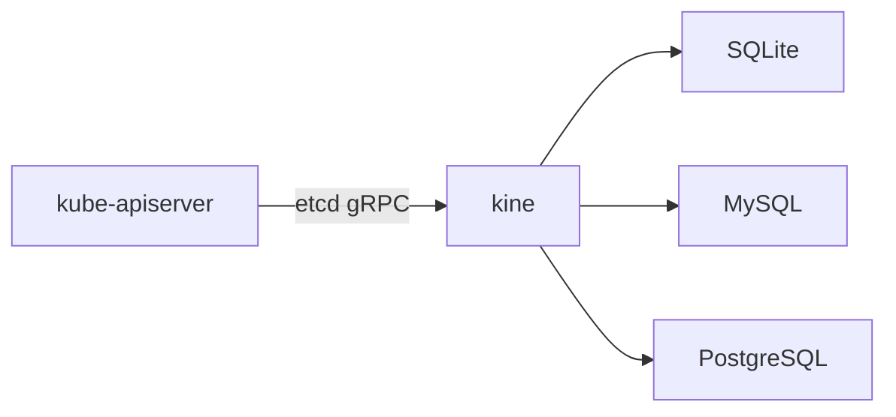
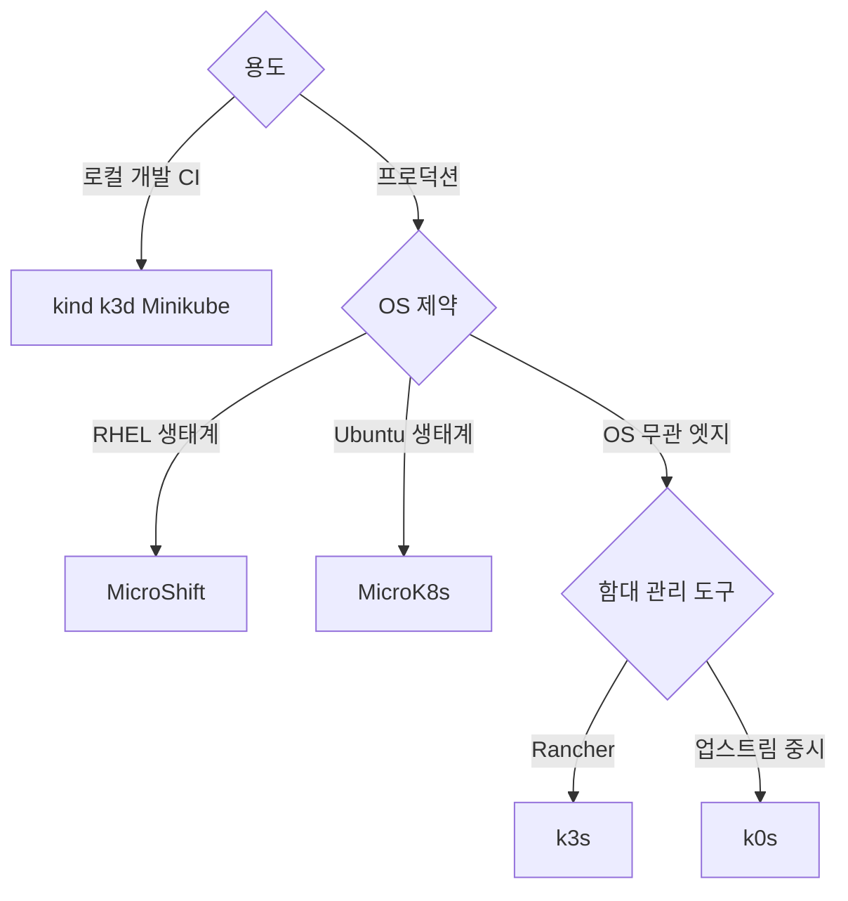

# 경량 Kubernetes

경량 Kubernetes는 **"쓰지 않는 것을 덜어낸 Kubernetes"** 다. 컨트롤
플레인을 단일 바이너리에 임베디드하고, 레거시 클라우드 프로바이더·
in-tree 볼륨 플러그인·사용하지 않는 컨트롤러를 제거한다. 실행 메모리
500MB~1GB, 단일 바이너리 50~300MB 내외로 **엣지·IoT·ARM·개발 머신**
에서 진짜 Kubernetes를 돌릴 수 있게 한다.

**"경량"의 실제 의미는 네 가지다.**

1. **바이너리·이미지 크기** — 업스트림 여러 컴포넌트를 하나로 합침.
2. **메모리 발자국** — 사용하지 않는 기능·컨트롤러 비활성.
3. **운영 단순성** — 단일 systemd 서비스, 기본 배터리 포함.
4. **경량 데이터스토어** — SQLite·dqlite·kine으로 etcd 대체 가능.

**주의.** "경량"은 **API·리소스 모델이 업스트림과 동등** 함을 의미한다.
Kubernetes가 아닌 다른 물건이 아니다. CNCF 공인 Certified Kubernetes
Distribution이므로 kubectl·Helm·CRD·Operator 생태계가 그대로 작동한다.

**이 글이 다루지 않는 것.** Talos Linux는 "경량"이지만 Immutable OS
관점이 주제이므로 [클러스터 구축 방법](./cluster-setup-methods.md)에서
다룬다. RKE2는 "보안 내장 배포판"으로 같은 글에서 별도 서술한다.

> 관련: [클러스터 구축 방법](./cluster-setup-methods.md)
> · [HA 클러스터 설계](./ha-cluster-design.md)

---

## 1. 라인업

| 배포 | 주체 | 포지셔닝 | 저작 연도 |
|------|------|---------|----------|
| k3s | Rancher → SUSE, CNCF Sandbox | 엣지·IoT 1순위 | 2019 |
| k0s | Mirantis | 100% 업스트림, 호스트 의존 최소 | 2020 |
| MicroK8s | Canonical | Ubuntu·snap 생태계, dqlite 자동 HA | 2018 |
| MicroShift | Red Hat | OpenShift 파생, RHEL 엣지 단일 노드 | 2022 |
| k3d | Rancher | k3s on Docker, 로컬 개발 전용 | 2019 |
| kind | SIG Testing | K8s in Docker, CI·conformance | 2018 |
| Minikube | SIG | 로컬 입문·VM 기반 | 2016 |

**프로덕션 후보는 k3s·k0s·MicroK8s·MicroShift** 네 가지. 나머지는
개발·CI 용도.

| 도구 | 주 용도 |
|------|--------|
| kind | K8s 자체 컴포넌트 CI·conformance 테스트 표준 |
| k3d | k3s를 Docker에 띄우는 로컬 에뮬레이션 |
| Minikube | 입문·실습, VM 기반 |

---

## 2. 프로덕션 경량 배포판

### 2.1 k3s — 엣지·IoT 실전 1순위

k3s는 Rancher(현 SUSE)가 시작해 2020-08 **CNCF Sandbox** 에 기증됐다.
2026-04 현재까지 **Sandbox** 단계를 유지하고 있으며 Incubation 신청
(TOC #1957)이 진행 중이다. Sandbox여도 **실무 채택률은 최상위**.

**특징.**

| 항목 | 내용 |
|------|------|
| 배포 단위 | 단일 바이너리(~50MB) + systemd |
| 데이터스토어 | SQLite(단일 노드 기본), embedded etcd(HA), 외부 RDBMS |
| 기본 CNI | Flannel(VXLAN) — Cilium·Calico 교체 가능 |
| 기본 CRI | containerd (embedded) |
| 번들 컴포넌트 | Traefik v3.6.x(1.32+), ServiceLB, CoreDNS, local-path-provisioner, metrics-server, helm-controller |
| 제거 | in-tree 클라우드 프로바이더, 레거시 스토리지 |
| ARM 지원 | armv7·arm64 공식 |
| 최소 메모리 | 서버 512MB·에이전트 256MB |

**설치 예.**

```bash
# 단일 서버(SQLite)
curl -sfL https://get.k3s.io | sh -

# HA 첫 서버(embedded etcd 시작)
curl -sfL https://get.k3s.io | K3S_TOKEN=<token> sh -s - server --cluster-init

# HA 추가 서버
curl -sfL https://get.k3s.io | K3S_TOKEN=<token> sh -s - server \
  --server https://<first>:6443

# 에이전트(워커) 조인
curl -sfL https://get.k3s.io | K3S_TOKEN=<token> sh -s - agent \
  --server https://<server>:6443
```

**systemd 운영.** 서비스명은 `k3s`(서버)·`k3s-agent`(에이전트).
환경변수는 `/etc/systemd/system/k3s.service.env`로 주입, 플래그는
`/etc/rancher/k3s/config.yaml`로 선언. 로그는 `journalctl -u k3s -f`.

### 2.2 k3s 필수 운영 플래그

엣지에서 자원을 실제로 줄이려면 **번들 컴포넌트를 비활성** 해야 한다.

```yaml
# /etc/rancher/k3s/config.yaml
disable:
  - traefik          # 별도 ingress 쓰는 경우
  - servicelb        # MetalLB·외부 LB 쓰는 경우
  - metrics-server   # Prometheus·Remote Write 쓰는 경우
  - local-storage    # Longhorn·외부 CSI 쓰는 경우
  - helm-controller  # GitOps 쓰는 경우
disable-kube-proxy: true   # Cilium 등 kube-proxy 대체 CNI 쓸 때
flannel-backend: none      # Cilium 으로 교체 시
disable-network-policy: true
write-kubeconfig-mode: "0644"
```

비활성 후에는 addon 매니페스트가 **자동 제거**된다.

### 2.3 ServiceLB·MetalLB 충돌

k3s는 **ServiceLB(구 Klipper-lb)** 로 외부 LB 없이 `type:
LoadBalancer` 를 제공한다. 각 노드가 hostPort로 트래픽을 잡아 서비스로
포워딩.

- MetalLB와 함께 돌리면 **IP 관리가 충돌**한다. 둘 중 하나만.
- `svccontroller.k3s.cattle.io/enablelb=true` 라벨로 **gateway 역할
  노드만** ServiceLB 활성 가능.

### 2.4 k3s Embedded Registry Mirror (Spegel, GA)

k3s 1.29.12+·1.30.8+·1.31.4+·1.35+ 에서 **Spegel 기반 P2P OCI 미러가
내장**됐다. `--embedded-registry` 한 플래그로 각 노드 containerd가
다른 노드의 이미지 캐시를 P2P로 가져온다. **수백 엣지 사이트의 레지
스트리 미러 설계를 바꾼다**.

```yaml
embedded-registry: true
```

중앙 레지스트리 미러가 없는 환경에서도 클러스터 내부에서 이미지 분산.
`registries.yaml` 기반 전통적 미러와 보완/대체 관계.

### 2.5 k3s etcd S3 스냅샷

k3s HA(embedded etcd)는 **네이티브 S3 백업**을 제공한다. kubeadm 기반
처럼 별도 CronJob·etcd-backup 스크립트가 필요 없다.

```yaml
etcd-snapshot-schedule-cron: "0 */6 * * *"
etcd-snapshot-retention: 30
etcd-s3: true
etcd-s3-endpoint: s3.example.com
etcd-s3-bucket: k3s-backups
etcd-s3-access-key: <key>
etcd-s3-secret-key: <secret>
```

수동 실행은 `k3s etcd-snapshot save`.

### 2.6 k3s 보안 — SELinux·Rootless·CIS

**SELinux.** RHEL·Rocky·Alma 등 SELinux enforcing 환경에서 k3s는
`container-selinux` + `k3s-selinux` RPM 설치가 필요하다. 설치 없이
enforcing 유지하면 **CrashLoopBackOff** 가 흔한 첫 장애.

```bash
sudo yum install -y container-selinux k3s-selinux
```

또한 enforcing 모드에서는 custom `--data-dir` 미지원이라 기본
(`/var/lib/rancher/k3s`)을 쓴다.

**Rootless.** systemd user unit + cgroup v2 delegation으로 비루트
실행 가능. 엣지 물리 접근 위협 시 탈옥 영향을 축소.

**CIS 하드닝.** `protect-kernel-defaults: true`·`secrets-encryption:
true`·audit log 활성 등 공식 "CIS Hardening Guide" 제공.

### 2.7 k0s — 최소주의, 호스트 의존 없음

k0s는 Mirantis 주도. "100% 업스트림, 추가 패치 제로, 호스트 의존 제로"
가 설계 원칙.

**특징.**

| 항목 | 내용 |
|------|------|
| 배포 단위 | 단일 바이너리(~250MB) + systemd |
| 데이터스토어 | **단일 컨트롤러 기본은 kine+SQLite**, 멀티 컨트롤러는 etcd 기본. etcd와 kine은 **상호 배타** |
| 기본 CNI | kube-router(기본) 또는 Calico 선택 |
| 번들 컴포넌트 | 최소주의 — 기본 애드온 없음 |
| OS 의존 | **없음**(커널만) |
| FIPS | 상용 k0s-enterprise 에서 제공 |

**`k0sctl` 멀티 노드 선언형 설치.**

```yaml
# k0sctl.yaml
spec:
  hosts:
    - ssh: {address: 10.0.0.10}
      role: controller
    - ssh: {address: 10.0.0.11}
      role: controller
    - ssh: {address: 10.0.0.12}
      role: controller+worker
    - ssh: {address: 10.0.0.20}
      role: worker
  k0s:
    version: "1.34.2+k0s.0"
```

**언제 쓰는가.** 업스트림 동등성이 중요하고, 번들 애드온의 자유도를
원할 때. k3s보다 깔끔한 기본값을 선호하는 조직.

### 2.8 MicroK8s — Canonical, snap·자동 HA

MicroK8s는 Canonical 의 Ubuntu·snap 생태계 경량 배포다. **snap 전송
업데이트·자동 HA·애드온 원클릭** 이 특징.

**특징.**

| 항목 | 내용 |
|------|------|
| 배포 단위 | snap 패키지 |
| 데이터스토어 | **dqlite**(Raft 기반 SQLite) |
| 기본 CNI | Calico |
| 번들 애드온 | dns·storage·ingress·metallb·observability·gpu·istio |
| OS 의존 | snapd(Ubuntu 권장) |
| ARM 지원 | arm64 |

**dqlite의 모델과 한계.**

- Canonical 이 개발한 Raft 확장 SQLite. etcd 없이 HA 자동 구성.
- **voter/spare 역할을 동적으로 재배치** — 노드를 4·5·7로 늘려도
  투표자(voter) 수가 3으로 유지되는 케이스가 있어 독자가 "HA가 늘었다"
  고 오해하기 쉽다. 실제 투표자는 `microk8s status --format yaml` 로
  확인.
- **모든 노드가 요청을 받아 leader로 포워딩** 하는 모델 — leader write
  bottleneck 이 etcd보다 먼저 찾아온다. 대규모 write 워크로드에는
  불리.

**설치·HA 예.**

```bash
# 노드 1
sudo snap install microk8s --classic --channel=1.35/stable
# 노드 1에서 토큰 발급
microk8s add-node
# 노드 2·3에서 실행 → 3+ 노드면 자동 HA
microk8s join <url>
microk8s enable dns ingress storage metrics-server
```

**스냅 자동 업데이트 통제.** 기본 snap은 자동 refresh. 엣지에서는
`snap refresh --hold=forever` 또는 `refresh.timer` 제어 필수.

### 2.9 MicroShift — Red Hat, RHEL Edge (단일 노드 전용)

MicroShift는 OpenShift의 엣지용 파생. **"워크로드 HA·수평 확장을
지원하지 않음"** 이 공식 설계다. 멀티 노드를 만들려면 **다중 인스턴스
active/active + 외부 LB·DNS 라우팅** 으로 풀어야 한다.

**특징.**

| 항목 | 내용 |
|------|------|
| 배포 단위 | RPM · bootc(image mode) |
| 데이터스토어 | embedded etcd(단일 인스턴스) |
| CRI | CRI-O |
| 번들 | CoreDNS, OVN-Kubernetes, CSI, kube-apiserver/ingress |
| 메모리 | idle ~500MB |
| 관리 | Red Hat ACM + OpenShift GitOps |

**차별점.** OpenShift 생태계(ACM·GitOps·ACS)와 fleet 관리 수준으로
통합. **bootc image mode** 로 A/B 파티션·롤백·원자적 업그레이드.

**제약.** 단일 노드 전용이라 노드 장애 = 사이트 장애. 리전/중앙 DR과
다중 사이트 배포로 가용성을 설계해야 한다.

---

## 3. kine — 경량의 핵심 엔진

**kine은 etcd v3 gRPC API 를 SQL로 번역하는 shim** 이다. k3s·k0s가
내부적으로 공유(upstream은 `k3s-io/kine`).



**의미.**

- kube-apiserver 입장에서는 **여전히 etcd로 보인다**.
- 백엔드가 관계형 DB라 **pg_dump·mysqldump로 스냅샷** 가능.
- Raft 쿼럼이 없어 **단일 노드 또는 외부 RDBMS HA에 위임**.
- **쓰기 병목은 백엔드에 의존** — SQLite는 동시성 제약, MySQL·
  PostgreSQL은 HA 인프라 재사용 가능.

**언제 쓰는가.**

| 시나리오 | 권장 |
|---------|------|
| 단일 노드 엣지 | kine + SQLite(k3s 기본) |
| 기존 RDBMS HA 보유 조직 | kine + MySQL/PostgreSQL |
| 멀티 노드 K8s HA | kine 대신 etcd |

---

## 4. 데이터스토어 비교

| 데이터스토어 | 배포판 | 쿼럼 | HA 모델 | 언제 쓰나 |
|------------|--------|:----:|---------|---------|
| SQLite | k3s·k0s | 없음 | 없음(단일) | 단일 노드 엣지 |
| Embedded etcd | k3s·k0s·MicroShift | Raft (3·5·7) | K8s 노드 내 HA | 멀티 노드 프로덕션 |
| dqlite | MicroK8s | Raft(voter 최대 3) | 자동 | Ubuntu·snap 생태계 |
| kine + MySQL/Postgres | k3s·k0s | 외부 DB HA | DB 복제 | 기존 RDBMS HA 재사용 |
| 외부 etcd | k3s·k0s | Raft | 별도 etcd 클러스터 | etcd 독립 운영 |

---

## 5. 종합 비교

### 5.1 Day-0 관점

| 항목 | k3s | k0s | MicroK8s | MicroShift |
|------|:---:|:---:|:--------:|:----------:|
| 단일 바이너리 | ✓ | ✓ | snap | RPM·bootc |
| OS 제약 | 없음 | **없음** | snap 지원 OS | RHEL |
| 기본 CNI | Flannel | kube-router | Calico | OVN-Kubernetes |
| 기본 Ingress | Traefik v3 | 없음 | 애드온 | OpenShift 스타일 |
| 기본 LB | ServiceLB | 없음 | MetalLB 애드온 | OpenShift 기반 |
| ARM 지원 | **공식** | ✓ | ✓ | x86_64 우선 |

### 5.2 Day-2 관점

| 항목 | k3s | k0s | MicroK8s | MicroShift |
|------|:---:|:---:|:--------:|:----------:|
| 업그레이드 | `system-upgrade-controller` | `k0sctl apply` | snap 채널 | RPM·bootc |
| HA | 3+ server(embedded etcd) | 3+ controller(etcd) | 3+ 노드 자동(dqlite) | **미지원** |
| 네이티브 S3 백업 | **✓** | 제한 | snap 애드온 | 외부 |
| P2P 이미지 미러 | **✓(Spegel)** | ✗ | ✗ | ✗ |
| 에어갭 | **공식(tarball + registries.yaml)** | 지원 | 제한적 | RHEL 리포 |
| 상용 지원 | SUSE | Mirantis | Canonical | Red Hat |

### 5.3 인증서 갱신

전 배포판 공통: **1년 기본 수명**. k3s·RKE2는 **만료 90일 전 서버
재시작 시 자동 갱신**. 엣지 노드가 재부팅 없이 1년 이상 돌면 만료
사고 위험.

**모니터링.**

```bash
# k3s 서버에서
ls /var/lib/rancher/k3s/server/tls/*.crt | \
  xargs -I{} openssl x509 -in {} -noout -enddate -subject

# 또는 readyz 경로
kubectl get --raw /readyz?verbose
```

### 5.4 자원 소비 참고치

**측정 조건**: 단일 노드 idle, 애드온 비활성, 워크로드 없음.

| 배포 | idle 메모리 | 바이너리·이미지 | 출처 |
|------|-----------|----------------|------|
| k3s 서버 | ~750MB | 단일 50MB | ACM 논문·공식 benchmark |
| k0s 컨트롤러 | ~660MB | 단일 250MB | Portainer 벤치마크 |
| MicroK8s | ~800MB | snap ~300MB | Canonical 자료 |
| MicroShift | ~500MB | RPM 합계 ~400MB | Red Hat 자료 |

실제 운영에서는 애드온·워크로드에 따라 크게 변한다. 용량 계획에
그대로 쓰면 위험.

---

## 6. 선택 기준



**의사결정 축.**

1. **로컬 개발·CI → kind·k3d·Minikube**.
2. **OpenShift·ACM 생태계 → MicroShift**.
3. **Ubuntu 기반·자동 업데이트 OK → MicroK8s**.
4. **OS 무관·업스트림 동등 선호 → k0s**.
5. **엣지 다수 사이트·Rancher 함대 관리 → k3s**.

---

## 7. k3s vs RKE2 — 언제 어느 것

둘 다 SUSE가 유지. 조직은 보통 **둘 다** 쓴다.

| 축 | k3s | RKE2 |
|----|-----|------|
| 주 용도 | 엣지·IoT·소규모 | 데이터센터·정부·금융 |
| 보안 기본선 | 기본 | **CIS·FIPS·SELinux 기본 강화** |
| 업스트림 동기 | 빠름 | 업스트림 완전 추종 |
| 번들 | Traefik·ServiceLB 등 | Canal·Cilium 기본 옵션 |

**공식 권고.** 데이터센터는 RKE2, 엣지는 k3s. 상세는
[클러스터 구축 방법](./cluster-setup-methods.md) 참조.

---

## 8. 엣지·IoT 특화 고려사항

### 8.1 오프라인 부팅·OTA 3단계

실제 엣지 함대 운영은 3단계 파이프라인.

| 단계 | 작업 |
|------|------|
| ① 공장 프로비저닝 | OS 이미지 + k3s 바이너리 + airgap-images 사전 탑재 |
| ② 현장 부팅 | 인증서·노드 토큰 부트스트랩, DHCP·고정IP, 콜 홈 |
| ③ OTA 업그레이드 | bootc·rpm-ostree·SLE Micro·Flatcar로 이미지 교체 |

### 8.2 Image Mode 운영 모델

| 이미지 기반 OS | 파이프라인 | 어느 경량과 궁합 |
|--------------|-----------|---------------|
| RHEL bootc·rpm-ostree | A/B 파티션·롤백 | MicroShift |
| Flatcar Container Linux | Ignition + 자동 업데이트 | k3s·k0s·kubeadm |
| SUSE SLE Micro | Rancher Prime + rpm-ostree | RKE2·k3s |
| Fedora IoT | rpm-ostree | 실험·호비스트 |

**Image Mode는 2026 엣지의 지배적 운영 모델**. "패키지 설치"보다
"이미지 교체 + 롤백"이 표준이 되는 흐름.

### 8.3 네트워크 불안정성

- 레지스트리 미러를 **각 엣지 노드 로컬** 에 두거나 k3s Spegel 활용.
- 이미지 캐시를 로컬 스토리지에 보존.
- Argo CD·Flux를 각 엣지 내부에서 돌리거나, **풀·재시도 내성** 있게
  구성.

### 8.4 하드웨어 제약

| 항목 | 가이드 |
|------|-------|
| 최소 메모리 | 서버 2GB 권장(1GB 가능, 워크로드 제한) |
| 디스크 | 산업용 SSD·eMMC. SD카드는 로그 write로 빠르게 마모 |
| 아키텍처 | armv7(구형 Pi)·arm64(모던) k3s·k0s 공식 |

### 8.5 GPU·Jetson 엣지

**NVIDIA 스택.**

- k3s·MicroK8s: NVIDIA GPU Operator 공식 지원.
- containerd에 **NVIDIA Container Toolkit + runtime class** 설정.
- Jetson(ARM64 + L4T): NVIDIA Device Plugin이 NGC 컨테이너 연동.
- time-slicing·MIG는 GPU Operator를 통해서만 일관된 관리.

**엣지 GPU 특유 주의.**

- **전력·thermal throttling** — 패시브 쿨링 장비는 워크로드 간 thermal
  스케줄이 필요.
- **스왑** — Jetson L4T에서 zram·zswap 권장(기본 swap OFF 정책과 충돌
  없이).
- **펌웨어·JetPack 버전** 과 드라이버 매칭.

### 8.6 systemd-oomd·OOMScore

Fedora·Ubuntu 24.04+의 **systemd-oomd**는 cgroup v2에서 메모리 압박
시 임의로 프로세스를 종료한다. kubelet·containerd가 OOMKill되는 사례
보고됨.

**대응.**

```bash
sudo systemctl mask systemd-oomd      # 엣지에서는 mask 권장
# 또는 service override에 OOMScoreAdjust=-999
```

### 8.7 보안 기본선

- OS 디스크 암호화(LUKS).
- Secure Boot(가능하면 Measured Boot).
- kubelet·API 인증서 단기화 + 주기 rotation.
- 출구 트래픽만 허용(콜 홈·OTA만).
- k3s rootless·SELinux enforcing·CIS 하드닝 활성.

---

## 9. 멀티 사이트 엣지 함대 관리

경량 단일 클러스터 자체보다 **수백~수천 클러스터를 어떻게 관리하나**
가 엣지의 진짜 문제다.

| 패턴 | 도구 |
|------|------|
| 중앙 GitOps 풀 | Flux·Argo CD(노드별 에이전트) |
| 함대 UI·API | Rancher Manager(k3s), Canonical MAAS(MicroK8s), Red Hat ACM(MicroShift) |
| 함대 롤아웃 | Argo CD ApplicationSet, Rancher Fleet |
| 정책 배포 | Kyverno·Gatekeeper |
| 관측성 | Prometheus Remote Write·Loki·Grafana Cloud |

HA 쿼럼·존 분산의 수학은 [HA 클러스터 설계](./ha-cluster-design.md)
참조(3·5·7 홀수 원칙은 embedded etcd 도 동일).

---

## 10. 스토리지 — 경량 파트너

| 스토리지 | 특징 | 경량 적합성 |
|---------|------|----------|
| local-path-provisioner | hostPath 기반·단일 노드 전용 | **단일 노드 엣지 1순위** |
| Longhorn | iSCSI·3복제 기본·snapshot·S3 백업 | 멀티 노드 경량 |
| OpenEBS LocalPV | 각 노드 로컬 디스크 최적 | 단일 노드 |
| Rook-Ceph | 대규모 통합 | **경량에는 과함** |

**local-path 주의.** Pod이 다른 노드로 이동하면 **데이터가 따라가지
않는다**. StatefulSet에서는 `nodeAffinity` 로 고정하거나 분산 스토리지
선택.

---

## 11. 안티패턴

| 안티패턴 | 문제 | 대안 |
|---------|------|------|
| 로컬 개발을 k3s 서버로 운영 | 운영 감각 다름 | kind·k3d 사용 |
| k3s ServiceLB + MetalLB 동시 활성 | IP 관리 충돌 | 둘 중 하나만 |
| 엣지 단일 노드를 "HA"라 주장 | 노드·전원 장애에 무력 | 리전 DR로 풀어라 |
| MicroK8s snap 자동 업데이트를 엣지에 방치 | 통제 없는 패치 | `snap refresh --hold` |
| 경량에 Rook-Ceph 탑재 | 자원·복잡도 초과 | Longhorn·local-path |
| k3s SQLite로 수십 노드 | 쓰기 병목 | embedded etcd HA |
| 엣지에 kubeadm 직접 | 자원·운영 과부하 | 경량 배포판 |
| MicroShift를 멀티 노드로 시도 | 공식 미지원 | 다중 인스턴스 + 외부 LB |
| SELinux enforcing에서 k3s-selinux 미설치 | CrashLoopBackOff | `container-selinux + k3s-selinux` |
| systemd-oomd 기본 활성 상태 방치 | kubelet OOMKill | mask 또는 OOMScoreAdjust |

---

## 12. 체크리스트

**선정 단계.**

- [ ] OS 제약(Ubuntu·RHEL·임의)
- [ ] 단일 노드 vs 멀티 노드 vs 함대
- [ ] 번들 애드온 범위·`--disable` 플래그
- [ ] 데이터스토어(SQLite·etcd·dqlite·kine+RDBMS) 결정
- [ ] 업그레이드 채널·Image Mode(bootc·rpm-ostree·SLE Micro)
- [ ] 에어갭·레지스트리 미러(Spegel 등)
- [ ] 아키텍처(x86·armv7·arm64)
- [ ] GPU·Jetson 여부

**운영.**

- [ ] 단일 노드 장애 시나리오(전원·네트워크)
- [ ] 레지스트리 미러·이미지 캐시 로컬
- [ ] 인증서 만료 모니터링(`openssl x509 -enddate`)
- [ ] SELinux·Rootless·CIS 하드닝
- [ ] systemd-oomd 정책
- [ ] etcd/dqlite 스냅샷·S3 백업
- [ ] 함대 관리(Rancher·ACM·Fleet)
- [ ] 로그·메트릭 중앙 전송

---

## 참고 자료

- [K3s Documentation](https://docs.k3s.io/) — 2026-04-24
- [K3s Architecture](https://docs.k3s.io/architecture) — 2026-04-24
- [K3s Datastore — SQLite·etcd·kine·external](https://docs.k3s.io/datastore) — 2026-04-24
- [K3s HA Embedded etcd](https://docs.k3s.io/datastore/ha-embedded) — 2026-04-24
- [K3s Networking Services (ServiceLB·Traefik)](https://docs.k3s.io/networking/networking-services) — 2026-04-24
- [K3s Managing Packaged Components (--disable)](https://docs.k3s.io/installation/packaged-components) — 2026-04-24
- [K3s Embedded Registry Mirror (Spegel)](https://docs.k3s.io/installation/registry-mirror) — 2026-04-24
- [K3s CIS Hardening Guide](https://docs.k3s.io/security/hardening-guide) — 2026-04-24
- [K3s Advanced — SELinux, Rootless](https://docs.k3s.io/advanced) — 2026-04-24
- [K3s etcd-snapshot / Backup & Restore](https://docs.k3s.io/datastore/backup-restore) — 2026-04-24
- [K3s Air-Gap Install](https://docs.k3s.io/installation/airgap) — 2026-04-24
- [k3s-io/kine — etcd shim](https://github.com/k3s-io/kine) — 2026-04-24
- [k3s — CNCF project page (Sandbox)](https://www.cncf.io/projects/k3s/) — 2026-04-24
- [k0s Documentation](https://docs.k0sproject.io/) — 2026-04-24
- [k0sctl](https://github.com/k0sproject/k0sctl) — 2026-04-24
- [MicroK8s Documentation](https://canonical.com/microk8s/docs) — 2026-04-24
- [MicroK8s High Availability (dqlite)](https://canonical.com/microk8s/docs/high-availability) — 2026-04-24
- [Red Hat MicroShift 4.20 — Understanding MicroShift](https://docs.redhat.com/en/documentation/red_hat_build_of_microshift/4.20/html-single/understanding_microshift/index) — 2026-04-24
- [openshift/microshift](https://github.com/openshift/microshift) — 2026-04-24
- [SUSE — When to use K3s and RKE2](https://www.suse.com/c/rancher_blog/when-to-use-k3s-and-rke2/) — 2026-04-24
- [Lightweight Kubernetes Distributions: Performance Comparison (ACM)](https://dl.acm.org/doi/10.1145/3578244.3583737) — 2026-04-24
