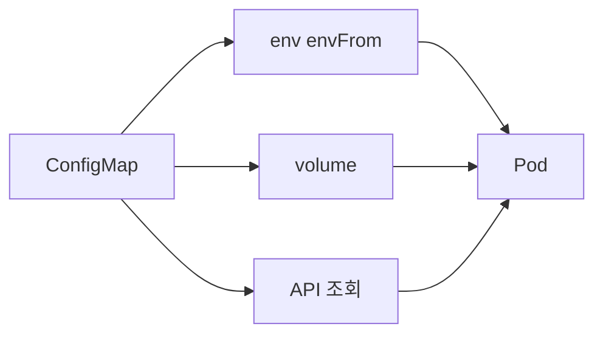
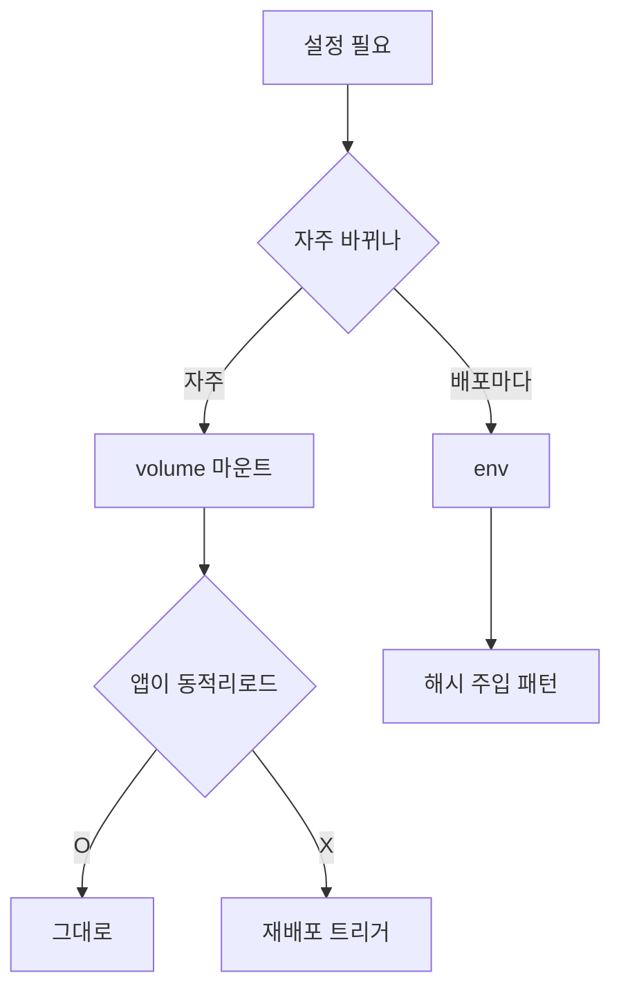

# ConfigMap

ConfigMap은 **비기밀 구성 데이터**를 key-value로 보관하는 오브젝트다.
이미지와 설정을 분리해 동일 이미지를 여러 환경(dev/stg/prd)에서 재사용하게
한다. 겉보기엔 단순하지만 **주입 방식별 업데이트 전파 규칙**,
**재배포 트리거 설계**, **immutable과 대규모 watch 부하**는 운영 사고가
가장 흔히 나는 지점이다.

이 글은 ConfigMap의 4가지 주입 경로, volume/env 업데이트 차이, Reloader·
checksum·Argo CD 해시 주입 같은 재배포 트리거 생태계, 그리고 1.34에서
도입된 `fileKeyRef`(initContainer → main 환경변수 전달)까지 다룬다.

> Secret(기밀 데이터): [Secret](./secret.md)
> Pod 자체의 라이프사이클: [Pod 라이프사이클](../workloads/pod-lifecycle.md)
> 외부 시크릿(ExternalSecrets·Vault)·공급망: `security/` 섹션

---

## 1. ConfigMap의 위치



공식 문서 선언: *"ConfigMap does not provide secrecy or encryption.
If the data you want to store are confidential, use a Secret."*

| 항목 | ConfigMap | Secret |
|---|:-:|:-:|
| 저장 형태 | UTF-8 문자열(`data`) + base64(`binaryData`) | **항상 base64**(`data`) + stringData |
| etcd 암호화 | 선택 | **반드시** KMS 권장 |
| API 노출 제어 | RBAC | RBAC + 가시성 관례(env 로그 주의) |
| immutable | 1.21 GA | 1.21 GA |
| 크기 제한 | **1 MiB** (전체 오브젝트) | 동일 |

**원칙**: 키·토큰·비밀번호는 예외 없이 Secret. 민감하지 않지만 자주 바뀌는
튜닝 값·피처 플래그는 ConfigMap.

---

## 2. 생성 방식

| 방식 | 명령 | 언제 |
|---|---|---|
| `--from-literal` | `kubectl create configmap app --from-literal=log_level=info` | 작은 값 한두 개 |
| `--from-file` | `kubectl create configmap app --from-file=./nginx.conf` | 설정 **파일 통째**로 |
| `--from-env-file` | `kubectl create configmap app --from-env-file=.env` | `KEY=VALUE` 한 파일 → envFrom 용 |
| 매니페스트 | `kind: ConfigMap` YAML | **GitOps 표준** |
| Kustomize `configMapGenerator` | `kustomize build` | 내용 변경 시 **이름에 해시 접미** |
| Helm | `{{ include ... }}` | 템플릿·values 바인딩 |

### Kustomize의 해시 접미 — 가장 단순한 재배포 트리거

```yaml
# kustomization.yaml
configMapGenerator:
- name: app-config
  literals:
    - log_level=info
```

생성 결과 이름: `app-config-abc12345`. 내용이 바뀌면 **이름 자체가 바뀌어
Deployment의 `envFrom` 참조가 변경 → 자동 롤아웃**. 별도 Reloader가 필요
없는 장점이 있지만, **해시 이름을 참조하는 리소스를 Kustomize 밖에서
관리**하면 참조 깨짐에 주의.

---

## 3. 주입 4가지 — 핵심 표

같은 ConfigMap이라도 어떻게 주입했느냐에 따라 **업데이트 전파·재시작 필요·
보안 노출**이 전부 다르다.

| 방식 | 예시 | 업데이트 전파 | 재시작 필요 | 주의 |
|---|---|---|:-:|---|
| **env**(개별 키) | `env[].valueFrom.configMapKeyRef` | ❌ 안 됨 | **O** | ConfigMap 삭제/키 누락 시 Pod 시작 실패(`optional: true`로 완화) |
| **envFrom**(모든 키) | `envFrom.configMapRef` + 선택적 `prefix` | ❌ 안 됨 | **O** | 1.33 이하는 C_IDENTIFIER 규칙 위배 키 **스킵**, 1.34부터 relax가 기본 |
| **volume**(파일 마운트) | `volumes.configMap` | **O** | ❌ 선택 | kubelet 동기화 주기 지연, **subPath는 예외** |
| **volume + subPath** | `volumeMounts.subPath` | ❌ 안 됨 | **O** | 공식 문서 명시 — 가장 흔한 함정 |

### env의 함정 두 가지

- **CM 누락 시 Pod 시작 실패**: 기본 `optional: false`. 부트스트랩 순서
  문제에서 단골. **우선순위: 배포 순서 제어 > `optional: true`** — optional 남용은
  설정 누락을 조용히 숨겨 런타임 장애로 터지게 한다.
- **민감 정보 leak 위험**: `kubectl describe pod`, 컨테이너 크래시 로그,
  덤프·APM 등 env가 노출되는 경로가 생각보다 많다. 민감 값은 Secret에도
  **volume 주입을 우선**하는 이유이기도 하다.

### envFrom의 `prefix` — 키 충돌 회피 패턴

```yaml
envFrom:
- configMapRef:
    name: app-config
  prefix: APP_          # 모든 키에 APP_ 붙여 주입
- configMapRef:
    name: db-config
  prefix: DB_
```

여러 CM을 한 컨테이너에 합칠 때 키 충돌을 방지한다. 컨테이너 안에서는
`APP_LOG_LEVEL`·`DB_HOST` 형태로 보인다.

### volume + subPath — "왜 내 파일은 업데이트가 안 되지?"

```yaml
# 안 됨: subPath는 ConfigMap 업데이트를 전파받지 못한다 (공식 정책)
volumeMounts:
- name: cfg
  mountPath: /etc/app/config.yaml
  subPath: config.yaml
```

- 전체 디렉터리 마운트로 변경하거나
- 파일명이 겹치는 다른 파일을 덮어야 할 때는 **Init 컨테이너에서 복사**
  패턴으로 우회

---

## 4. volume 업데이트 — 얼마나 걸리나

공식 문서: *"The kubelet checks whether the mounted ConfigMap is fresh on
every periodic sync. ... The total delay from the moment when the
ConfigMap is updated to the moment when new keys are projected to the Pod
can be as long as the kubelet sync period + cache propagation delay,
where the cache propagation delay depends on the chosen cache type."*

| 캐시 전략 | 동작 | 최대 지연(대략) |
|---|---|---|
| `Watch`(기본, `configMapAndSecretChangeDetectionStrategy`) | kubelet이 변경 이벤트 구독 | **수 초 + 다음 kubelet sync 주기(기본 60s)** |
| `Cache`(TTL) | 만료 시 재조회 | TTL + sync 주기 |
| `Get`(매 sync마다) | 매번 API 조회 | sync 주기 |

**중요**: Watch가 변경 감지 자체는 즉시(수 초)이지만, Pod 안 파일에 반영되기까지는
kubelet의 주기적 sync 루프(`syncFrequency`, 기본 60s + 지터)에 의해 결정된다.
즉 "최악 ~ 60s"는 Watch에서도 동일. 관련: [kubernetes/#30189](https://github.com/kubernetes/kubernetes/issues/30189).

### 마운트된 파일의 **원자적 업데이트**

kubelet은 `..data`·심볼릭 링크 스위치 방식으로 **원자 교체**를 수행한다.
애플리케이션이 파일을 **부분적 읽기 중간 상태**로 보는 일은 없지만,
**파일 변경 감지(inotify)**는 심링크 대상 변경이므로 일부 라이브러리는
기본 설정으로는 이벤트를 놓친다(예: `IN_CLOSE_WRITE` 구독 등).

- 파일 변경 시 자동 reload가 필요하다면 앱이 폴링 또는 `inotify IN_MOVED_TO`/
  `IN_DELETE_SELF`를 구독하도록 구성
- "업데이트돼도 프로세스는 안 읽음" → **재시작 트리거**가 필요한 이유
  (다음 섹션)

---

## 5. 재배포 트리거 — 4가지 선택지

"ConfigMap을 바꿨는데 Pod이 그대로"를 해결하는 표준 전략이다.

| 전략 | 도구 | 장점 | 단점 |
|---|---|---|---|
| **이름 해시 접미** | Kustomize `configMapGenerator`, Helm 해시 | **선언적** — Deployment 참조 변경 → 자연 롤아웃 | 이름이 매번 달라짐, 외부 참조 주의 |
| **Pod template annotation 해시** | Helm `{{ sha256sum }}` | Deployment `spec.template` 해시 변경 → 새 RS | Helm 의존, 템플릿 결정론 필요 |
| **Reloader(env-vars strategy)** | Stakater Reloader(기본) | 앱 수정 불필요 | GitOps **sync drift** 발생 가능 |
| **Reloader(annotations strategy)** | Stakater Reloader | **GitOps 안전**(annotation만 변경) | Reloader 설치·권한 필요 |

### Helm — `checksum/config` 패턴

```yaml
# Deployment 템플릿 안에서
spec:
  template:
    metadata:
      annotations:
        checksum/config: {{ include (print $.Template.BasePath "/configmap.yaml") . | sha256sum }}
```

ConfigMap 내용이 바뀌면 annotation 값이 바뀌고, 그 결과 `spec.template`
해시도 바뀌어 새 ReplicaSet이 생성된다. **이름을 유지하면서** 롤아웃을
트리거하는 가장 GitOps 친화적인 방법.

**전제**: ConfigMap이 **같은 Helm 차트 내부**에 존재해야 한다. 외부 CM이나
ExternalSecrets로 동적으로 생성되는 리소스에는 이 패턴을 쓸 수 없다 —
이 경우 Reloader annotations 전략이 유일한 답이다.

### Reloader — env-vars vs annotations

Reloader([stakater/Reloader](https://github.com/stakater/Reloader))는 두 전략을 제공한다:

| 전략 | 동작 | GitOps 적합도 |
|---|---|:-:|
| env-vars(기본) | Deployment `spec.template`에 더미 env 주입 | **낮음** — Argo CD가 sync drift로 인식 |
| annotations | `reloader.stakater.com/last-reloaded-from` pod template annotation만 갱신 | **높음** |

Argo CD/Flux를 쓰면 **반드시 annotations 전략**으로 설정. 공식 [Reload Strategies](https://deepwiki.com/stakater/Reloader/2.3-reload-strategies) 문서도 GitOps 환경에서 annotations 전략을 권고한다.

참고: Deployment의 `.spec.template` 변경만 롤아웃을 유발하므로, 참조한 CM의
data가 바뀌어도 **Kubernetes 자체는 롤아웃을 일으키지 않는다**. 위 전략들은
모두 이 한계를 우회하는 패턴이다.

---

## 6. immutable — 대규모 클러스터의 필수 옵션

```yaml
apiVersion: v1
kind: ConfigMap
metadata:
  name: nginx-conf
immutable: true
data:
  nginx.conf: |
    ...
```

- Kubernetes 1.21 GA
- 한 번 `true`로 설정하면 **해제 불가**, data·binaryData 수정 불가
- 삭제 후 **새 이름**으로 재생성하는 워크플로우가 전제
- **kubelet이 변경을 watch하지 않음** → 대규모 클러스터(수천 Pod이 같은 CM
  참조)에서 **apiserver 부하가 극적으로 감소**

### 언제 걸어야 하는가

| 시나리오 | immutable 권장 |
|---|:-:|
| 이미지처럼 **불변 릴리스 아티팩트**로 취급하는 설정 | **강력 권장** |
| Kustomize `configMapGenerator` + 해시 접미 | **강력 권장**(어차피 이름이 바뀌므로) |
| 수천 Pod이 **동일 CM**을 volume 마운트 | **강력 권장**(watch 부하 제거) |
| 운영 중 값만 살짝 바꾸며 돌리는 동적 설정 | 비권장 |

### immutable + GitOps 장애 시나리오

Argo CD/Flux가 immutable CM의 `data`를 수정하도록 apply하면 apiserver가
reject하고 **Sync Failed** 상태로 멈춘다. 이 상태에서 Auto-Prune이 없거나
구 CM을 참조하는 Pod이 남아 있으면 배포 파이프라인이 블록된다.

**안전 패턴**: immutable은 반드시 **"이름이 바뀌는" 전략**(Kustomize 해시
접미·Helm 해시 suffix)과 함께 쓴다. 이 조합에서는 새 이름의 새 CM이 만들어
지고 구 CM은 Argo CD가 GC한다.

---

## 7. binaryData, 크기, 이름 규칙

### binaryData

- 값은 **base64 인코딩된 문자열**
- `data`와 **키 중복 금지**(apiserver reject)
- 인증서·이미지 같은 바이너리. 그러나 실제로는 Secret에 담는 경우가 더
  많다

### 1 MiB 제한

- ConfigMap 전체 오브젝트 크기 상한
- 원인: **etcd의 요청 크기 제한**과 연결
- 회피 패턴:
  - ConfigMap **여러 개로 분할** (키 네임스페이싱으로 한 Pod에 여러 CM 마운트)
  - 대용량 구성은 **Object Storage(S3·MinIO·Ceph RGW) + initContainer로 다운로드**
  - ZIP 압축 후 `binaryData` (여전히 1 MiB 제한 내에서)
  - **Image Volume**(1.31+ Alpha, 1.33 Beta): 설정 파일을 OCI 이미지로 빌드해
    `volumes.image`로 마운트. ConfigMap의 1 MiB 제한을 완전히 우회하는
    현대적 대안. 상세는 [Kubernetes — Image Volumes](https://kubernetes.io/docs/tasks/configure-pod-container/image-volumes/)

### 이름 규칙

- `metadata.name`: DNS subdomain(RFC 1123). 라벨당 **63자**, 전체 **253자**
- `data`/`binaryData` 키: `[-._a-zA-Z0-9]+`
- envFrom으로 주입 시 키가 **C_IDENTIFIER(`[A-Za-z_][A-Za-z0-9_]*`)**가
  아니면 **스킵**되었다(1.33 이하). KEP-4369로 동작 변경:
  - 1.30 Alpha, 1.32 Beta, **1.34 Stable(GA)** — `-`·`.` 포함 키가 기본 허용
  - **주의**: 이 KEP 머지 과정에서 InvalidVariableNames **Event 회귀**가
    보고됨([kubernetes/#130099](https://github.com/kubernetes/kubernetes/issues/130099)).
    "스킵되면 경고 이벤트가 뜬다"를 **전제하지 말고** `kubectl get events`로
    직접 확인할 것

### RBAC — 누가 ConfigMap을 읽을 수 있는가

CM은 Secret과 달리 평문이라 **RBAC이 유일한 접근 통제 레이어**다.

| 주체 | 기본 권한 | 주의 |
|---|---|---|
| Pod(자기 네임스페이스 CM 볼륨 마운트) | kubelet이 대리 — 사용자 RBAC 무관 | 민감 정보는 Secret으로 분리 |
| kubectl 사용자 | `get/list/watch configmaps` 부여 시 전체 data 열람 | Role은 **특정 `resourceNames`로 좁히기** |
| 네임스페이스 전체 | ClusterRole `view`에 포함 | 민감 CM은 별도 네임스페이스로 격리 |

RBAC 구체 설계는 → `kubernetes/security/rbac`.

---

## 8. 1.34+ — `fileKeyRef`로 initContainer에서 환경변수 전달

1.34(Alpha, feature gate `EnvFiles`)에서 **initContainer가 생성한 파일의
값**을 main 컨테이너의 환경변수로 주입할 수 있게 됐다.

```yaml
spec:
  initContainers:
  - name: gen-env
    image: alpine
    command: ["/bin/sh", "-c", "echo hello > /envs/app.env"]
    volumeMounts:
    - name: envs
      mountPath: /envs
  containers:
  - name: app
    image: app:1.0
    env:
    - name: APP_HELLO
      valueFrom:
        fileKeyRef:
          path: app.env
          volumeName: envs
          key: ""              # 전체 내용을 값으로
    volumeMounts:
    - name: envs
      mountPath: /envs
  volumes:
  - name: envs
    emptyDir: {}
```

| 배경 | 의미 |
|---|---|
| 기존 | initContainer가 만든 값을 main에 넘기려면 **별도 CM/Secret 생성** 필요 |
| `fileKeyRef` | emptyDir 공유 볼륨 파일만 읽음 — **API 호출 0회** |
| 상태 | 1.34 Alpha. 운영 투입 전 GA 확인 필요 |

ConfigMap 설계 관점에서 **"동적으로 계산되는 설정을 CM에 먼저 저장해야
했던 부담"**이 줄어드는 방향.

---

## 9. 주입 방식 결정 가이드



| 판단 축 | volume | env |
|---|---|---|
| 파일 포맷(nginx.conf, application.yaml) | ✅ | ❌ |
| 짧은 스칼라(LOG_LEVEL=info) | 가능 | ✅ |
| 값 변경 시 **재시작 불필요** | ✅ | ❌ |
| env 로그 노출 회피 | ✅ | ❌ |
| 앱이 env만 읽는 구조 | ❌ | ✅ |

**기본값**: 의심되면 **volume**. env는 **명시적으로 env가 맞는 값**에만.

---

## 10. 안티패턴

| 안티패턴 | 결과 | 대안 |
|---|---|---|
| 비밀번호를 ConfigMap에 저장 | 로그·describe·audit 모두 노출 | Secret + etcd 암호화 |
| `subPath`로 단일 파일 마운트하고 업데이트 기대 | **영원히 반영 안 됨** | 디렉터리 마운트 또는 init-copy |
| 한 CM에 **수백 KB** 쑤셔 넣기 | 1 MiB 제한 근접, watch 부하 | 분할 또는 외부 스토리지 |
| Reloader env-vars 전략 + Argo CD | **영구 sync drift** | annotations 전략 |
| env로 Secret 주입 후 **크래시 로그** 수집 | 로그 파이프라인에 비밀 유출 | volume 주입 |
| immutable 미사용 + 수천 Pod 동일 CM | apiserver watch 부하 | immutable로 전환 |
| Helm 해시 annotation 없는 CM 수정 | "배포했는데 안 바뀐다" 혼란 | checksum/config 또는 Reloader |
| `optional: false` env에 배포 의존성 무시 | **Pod 시작 실패 루프** | 배포 순서 제어 우선, `optional: true`는 차선 |
| Kustomize 해시 접미 사용 후 **구 CM 청소 안 함** | 네임스페이스에 구 CM 누적 | `kubectl get cm -l <label>` 정기 청소, Argo CD Prune |
| 민감 정보가 담긴 CM을 `view` ClusterRole 주체에게 노출 | 전체 네임스페이스 독자에게 노출 | 별도 네임스페이스 + 제한적 Role |

---

## 11. 프로덕션 체크리스트

- [ ] **민감 정보는 전부 Secret** — grep으로 `password`·`token`·`apikey` 검색
- [ ] volume vs env 선택 근거 문서화
- [ ] subPath로 단일 파일 마운트 금지(재배포 트리거 부재)
- [ ] 재배포 트리거 전략 **한 팀에서 한 가지**로 통일(Kustomize 해시 / Helm checksum / Reloader annotations 중 하나)
- [ ] Argo CD/Flux 사용 시 Reloader는 **annotations 전략**
- [ ] 대규모·정적 CM은 **immutable** 활성
- [ ] 1 MiB 근접 CM은 분할 또는 외부 스토리지로 이전
- [ ] envFrom 키 이름에 특수문자(`.`, `-`) 포함 여부 확인 — 1.33 이하는 스킵
- [ ] CM 변경의 **audit 로그 정책** 수립(누가·언제·무엇을)
- [ ] GitOps 저장소에 CM YAML 존재 — kubectl apply로 직접 생성한 CM은 drift 원인

---

## 12. 트러블슈팅

| 증상 | 근본 원인 | 진단·조치 |
|---|---|---|
| **CM 변경이 파일에 반영되지 않음** | `subPath` 사용 | mountPath 전환 또는 재배포 |
| **env만 변경 안 됨** | env는 정의상 비전파 | Reloader·checksum 트리거 |
| **Pod 시작 실패 `CreateContainerConfigError`** | 참조 CM 부재 / 키 누락 | `describe pod`·`optional: true` |
| **envFrom에 일부 키만 들어감** | 키가 C_IDENTIFIER 위배로 스킵 | 키 리네이밍 또는 1.34+ feature gate |
| **Argo CD가 계속 OutOfSync** | Reloader env-vars 전략의 더미 env | annotations 전략으로 변경 |
| **apiserver watch 부하 증가** | 대형 CM을 수천 Pod이 참조 | `immutable: true` 또는 분할 |
| **파일 변경 감지 라이브러리가 못 잡음** | kubelet의 심링크 교체 방식 | inotify 구독 이벤트 종류 조정 또는 폴링 |
| **CM 크기 초과 `object too large`** | 1 MiB 제한 | 분할, 외부 스토리지 |
| **kustomize 적용 후 참조 에러** | 해시 이름 변경, 외부 참조 누락 | Kustomize 내 참조로 통일 |

### 자주 쓰는 명령

```bash
# CM이 네임스페이스 전체 Pod에 어떻게 주입됐는지
kubectl get pods -A -o json \
  | jq '.items[] | {pod: .metadata.name, env: [.spec.containers[].env // [] | .[] | select(.valueFrom.configMapKeyRef)]}'

# 특정 Pod의 volume 주입 CM 목록
kubectl get pod <name> -o jsonpath='{.spec.volumes[*].configMap.name}'

# immutable 여부
kubectl get cm <name> -o jsonpath='{.immutable}'

# 해시 주입 annotation 확인
kubectl get deploy <name> -o jsonpath='{.spec.template.metadata.annotations}'

# kubelet sync 주기(노드) — Pod sync 루프 주기. CM 볼륨 전파 상한도 이 값에 의존
kubectl get --raw /api/v1/nodes/<node>/proxy/configz | jq .kubeletconfig.syncFrequency

# envFrom 스킵 이벤트(1.33 이하)
kubectl get events --field-selector reason=InvalidEnvironmentVariableNames
```

---

## 13. 이 카테고리의 경계

- **ConfigMap 자체** → 이 글
- **Secret**(기밀·TLS·dockerconfig·etcd 암호화) → [Secret](./secret.md)
- **SA 토큰·CA 번들 주입·복합 볼륨** → [Projected Volume](./projected-volume.md)
- **Pod 자기 메타데이터(IP·라벨·자원)** 주입 → [Downward API](./downward-api.md)
- **외부 시크릿(ExternalSecrets·Vault·SOPS·Sealed Secrets)** → `security/`
- **RBAC·네임스페이스 격리 설계** → `kubernetes/security/`·[네임스페이스 설계](../resource-management/namespace-design.md)
- **Argo CD·Flux 재배포 전략·GitOps** → `cicd/`
- **Pod 라이프사이클·graceful restart** → [Pod 라이프사이클](../workloads/pod-lifecycle.md)
- **리소스 제한**(RQ/LR) → [Requests·Limits](../resource-management/requests-limits.md)

---

## 참고 자료

- [Kubernetes — ConfigMaps](https://kubernetes.io/docs/concepts/configuration/configmap/)
- [Kubernetes — Configure a Pod to Use a ConfigMap](https://kubernetes.io/docs/tasks/configure-pod-container/configure-pod-configmap/)
- [Kubernetes — Updating Configuration via a ConfigMap](https://kubernetes.io/docs/tutorials/configuration/updating-configuration-via-a-configmap/)
- [Kubernetes — Immutable ConfigMaps and Secrets](https://kubernetes.io/docs/concepts/configuration/configmap/#configmap-immutable)
- [KEP-1412 — Immutable Secrets and ConfigMaps](https://github.com/kubernetes/enhancements/tree/master/keps/sig-node/1412-immutable-secrets-and-configmaps)
- [KEP-4369 — Allow `-` and `.` in env var names (1.34 Stable)](https://github.com/kubernetes/enhancements/issues/4369)
- [kubernetes/#130099 — envFrom invalid key event regression](https://github.com/kubernetes/kubernetes/issues/130099)
- [Kubernetes v1.34 Release Blog (fileKeyRef / EnvFiles)](https://kubernetes.io/blog/2025/08/27/kubernetes-v1-34-release/)
- [Kubernetes — Image Volumes (1.33 Beta)](https://kubernetes.io/docs/tasks/configure-pod-container/image-volumes/)
- [stakater/Reloader](https://github.com/stakater/Reloader)
- [Reloader — Reload Strategies](https://docs.stakater.com/reloader/latest/how-to-guides/restart-pods-when-configmap-changes.html)
- [Argo CD + Kustomize ConfigMap Rollouts — Codefresh](https://codefresh.io/blog/using-argo-cd-and-kustomize-for-configmap-rollouts/)
- [kubernetes/#30189 — kubelet refresh times for configmaps](https://github.com/kubernetes/kubernetes/issues/30189)
- [Ahmet Alp Balkan — Why Kubernetes secrets take so long to update](https://ahmet.im/blog/kubernetes-secret-volumes-delay/)

(최종 확인: 2026-04-22)
