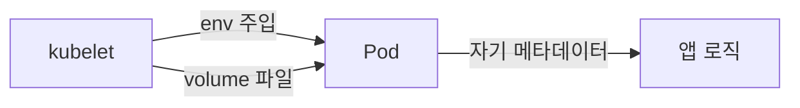

# Downward API

Downward API는 **Pod이 자기 자신의 메타데이터를 런타임에 알도록** 하는
메커니즘이다. 로깅·트레이싱의 리소스 속성, JVM 힙 크기 자동 계산, 리더
선출용 Pod IP·호스트명 등 **"kube-apiserver에 질의하지 않고도" 자기 정보를
얻는 표준 경로**다.

이름은 "API"지만 **새 네트워크 호출이 발생하지 않는다**. kubelet이 Pod
생성·업데이트 시점에 환경변수로 채워 넣거나 볼륨 파일로 기록할 뿐이다.
그래서 RBAC도 별도로 필요 없다.

이 글은 노출 가능한 필드의 **완전한 목록**, env vs volume의 능력 차이,
업데이트 전파 규칙, `resourceFieldRef`의 `divisor`, 그리고 OpenTelemetry·
JVM 튜닝·리더 식별 등 **실전 패턴**을 다룬다.

> 관련: [ConfigMap](./configmap.md) · [Secret](./secret.md) · [Projected Volume](./projected-volume.md) · [Requests·Limits](../resource-management/requests-limits.md)

---

## 1. 위치 — "Pod이 자기를 아는" 유일한 표준



**언제 필요한가**:
- 로깅·트레이싱: `service.instance.id = pod-name`
- JVM 메모리 자동 튜닝: `-Xmx`를 컨테이너 `limits.memory` 기반으로
- 리더 선출 힌트: `POD_IP` + `HOSTNAME`
- 관측용 라벨 export: `app`, `version` 같은 Pod 라벨을 Prometheus exporter가 메트릭 라벨로
- 멀티 AZ 동작: `spec.nodeName`으로 자기 AZ 추정(단, 노드 라벨 직접 노출 불가 — 아래 참고)

**대체 수단이 부적절한 경우**:
- Pod이 **자기 Spec·Status**를 알고 싶을 때는 kube-apiserver 호출보다
  Downward API가 정답(권한 없음, latency 없음, 장애 영향 없음)

---

## 2. 노출 필드 — 완전한 표

env(`fieldRef`)와 volume(`downwardAPI`)이 **지원하는 필드가 다르다**.
특히 `metadata.labels`·`metadata.annotations`을 **전체 덤프로** 받으려면
volume이 유일한 경로.

### Pod-level `fieldRef`

| Field | env | volume |
|---|:-:|:-:|
| `metadata.name` | ✅ | ✅ |
| `metadata.namespace` | ✅ | ✅ |
| `metadata.uid` | ✅ | ✅ |
| `metadata.generateName` | ✅(1.28+) | ✅ |
| `metadata.labels['<KEY>']` | ✅ | ✅ |
| `metadata.annotations['<KEY>']` | ✅ | ✅ |
| `metadata.labels` **(전체)** | ❌ | ✅ |
| `metadata.annotations` **(전체)** | ❌ | ✅ |
| `spec.serviceAccountName` | ✅ | ❌ |
| `spec.nodeName` | ✅ | ❌ |
| `status.hostIP` | ✅ | ❌ |
| `status.hostIPs` | ✅ | ❌ |
| `status.podIP` | ✅ | ❌ |
| `status.podIPs` | ✅ | ❌ |

### Container-level `resourceFieldRef`

env와 volume **모두 지원**. `containerName`이 **필수**(여러 컨테이너 중
어느 것의 자원을 읽을지 지정).

| Resource | 설명 |
|---|---|
| `requests.cpu`·`limits.cpu` | 코어 단위(divisor로 millicore 변환) |
| `requests.memory`·`limits.memory` | 바이트 |
| `requests.ephemeral-storage`·`limits.ephemeral-storage` | 바이트 |
| `requests.hugepages-<size>`·`limits.hugepages-<size>` | 예: `hugepages-2Mi`, `hugepages-1Gi` |

### 노출 불가능한 것 — 자주 하는 오해

| 희망 | 현실 | 대안 |
|---|---|---|
| **노드 라벨**(예: `topology.kubernetes.io/zone`) | ❌ 불가 | nodeAffinity + **라벨을 Pod에 미러링**하는 컨트롤러 또는 앱이 nodeName으로 API 조회 |
| **노드 annotations** | ❌ 불가 | 위와 동일 |
| Secret/ConfigMap 값 | ❌ 불가(의미상 불필요) | `env.valueFrom.secretKeyRef`·`configMapKeyRef` |
| Pod이 아닌 **다른 Pod**의 정보 | ❌ 불가 | kube-apiserver 조회 |
| IngressIP·LoadBalancer IP | ❌ 불가 | Service status 조회 |

---

## 3. 업데이트 전파 — env는 정적, volume은 (일부) 동적

| 소스 | env | volume |
|---|:-:|:-:|
| `metadata.labels`·`annotations` 변경 | ❌ | **✅ 동적 반영** |
| 리소스 in-place resize(1.33 Beta / **1.35 GA**) | ❌ 재시작 필요 | **✅ 파일 값 갱신** |
| 기타(name, uid, IP 등) | 생성 시 고정 | 생성 시 고정 |

### 왜 volume만 반영되는가

kubelet은 Pod 메타데이터 변경을 감지하면 volume projection을 **원자 교체**
한다(ConfigMap과 동일한 `..data` symlink 스왑 메커니즘). env는 정의상
컨테이너 프로세스 시작 시점의 스냅샷.

**symlink 스왑의 숨은 함정**: 파일이 atomic하게 교체돼도 **앱이 파일
디스크립터를 캐싱**하면 구 값을 계속 읽는다. `inotify`를 쓰는 경우 심링크
대상 변경 이벤트는 `CLOSE_WRITE`가 아니라 `IN_MOVED_TO`/`IN_DELETE_SELF`로
관측해야 하며, 이를 놓치는 라이브러리가 흔하다. 재열기·폴링 중 한 가지
전략을 앱에서 명시적으로 구현해야 한다.

**subPath 제약**: ConfigMap·Secret과 동일하게 **`subPath`로 Downward volume을
마운트하면 업데이트 전파가 중단**된다(공식 제약). 디렉터리 마운트로 전환.

### In-Place Pod Resize와의 상호작용 — 1.33 Beta / 1.35 GA

`resizePolicy[].restartPolicy: NotRequired`로 컨테이너가 **재시작 없이**
`limits.memory`가 커지면, **env는 구 값** 그대로이고 **volume 파일은 새 값**
으로 갱신된다. 앱이 런타임에 한 번 읽고 끝내는 패턴이면 env든 volume이든
오래된 값을 사용하게 된다.

올바른 스키마 예시:

```yaml
containers:
- name: app
  image: app:1.0
  resources:
    requests: { cpu: 100m, memory: 256Mi }
    limits:   { cpu: 500m, memory: 512Mi }
  resizePolicy:
  - resourceName: cpu
    restartPolicy: NotRequired        # 재시작 없이 변경
  - resourceName: memory
    restartPolicy: RestartContainer   # 메모리는 재시작 필요 시
```

상세는 [Requests·Limits](../resource-management/requests-limits.md).

---

## 4. 사용 예

### env — 가장 흔한 11개

```yaml
env:
- name: POD_NAME
  valueFrom: { fieldRef: { fieldPath: metadata.name } }
- name: POD_NAMESPACE
  valueFrom: { fieldRef: { fieldPath: metadata.namespace } }
- name: POD_UID
  valueFrom: { fieldRef: { fieldPath: metadata.uid } }
- name: POD_IP
  valueFrom: { fieldRef: { fieldPath: status.podIP } }
- name: HOST_IP
  valueFrom: { fieldRef: { fieldPath: status.hostIP } }
- name: NODE_NAME
  valueFrom: { fieldRef: { fieldPath: spec.nodeName } }
- name: SA_NAME
  valueFrom: { fieldRef: { fieldPath: spec.serviceAccountName } }
- name: APP_LABEL
  valueFrom: { fieldRef: { fieldPath: "metadata.labels['app.kubernetes.io/name']" } }
- name: CPU_LIMIT_MC
  valueFrom:
    resourceFieldRef:
      containerName: app
      resource: limits.cpu
      divisor: 1m
- name: MEM_LIMIT_MI
  valueFrom:
    resourceFieldRef:
      containerName: app
      resource: limits.memory
      divisor: 1Mi
- name: MEM_REQUEST_MI
  valueFrom:
    resourceFieldRef:
      containerName: app
      resource: requests.memory
      divisor: 1Mi
```

### volume — labels·annotations 전체 덤프

```yaml
volumes:
- name: podinfo
  downwardAPI:
    defaultMode: 0444
    items:
    - path: labels
      fieldRef: { fieldPath: metadata.labels }
    - path: annotations
      fieldRef: { fieldPath: metadata.annotations }
    - path: cpu_limit
      resourceFieldRef:
        containerName: app
        resource: limits.cpu
        divisor: 1m
```

각 파일 포맷:

```
# /etc/podinfo/labels
app.kubernetes.io/name="demo"
app.kubernetes.io/version="1.2.3"
```

값은 Go `strconv.Quote`(shell 호환 quoting)로 쿼트된다. 키 정렬 순서는
공식적으로 **보장되지 않으므로** 앱이 특정 순서에 의존하면 안 된다.

---

## 5. `divisor` — 단위 정규화

`resourceFieldRef`에서 **값을 어느 단위로 내려받을지** 결정. 잘못 설정하면
앱이 수백 배 틀린 메모리 제한으로 동작한다.

| resource | divisor 예 | 반환 단위 |
|---|---|---|
| `limits.cpu` | `1`(기본) | 코어 |
| `limits.cpu` | `1m` | millicore |
| `limits.memory` | `1`(기본) | **바이트** |
| `limits.memory` | `1Mi` | MiB |
| `limits.memory` | `1Gi` | GiB |
| `limits.hugepages-1Gi` | `1Gi` | 페이지 수 |

**규칙**:
- **결과는 ceiling(올림)** — 공식 디자인 문서 명시. `limits.cpu: 250m`을
  divisor `1`로 받으면 **`1`** (0.25가 올림되어 1 core). `700m`도 `1` 반환
- 원하는 정밀도를 얻으려면 divisor를 작게: `250m` + `1m` → **`250`**
- manifest에 **divisor를 생략하면 apiserver가 `0`으로 저장**하는 알려진
  동작이 있다([#128865](https://github.com/kubernetes/kubernetes/issues/128865))
  — 반드시 **명시**

### limit 미설정 시 fallback

컨테이너에 `limits` 지정이 없으면 kubelet은 **Node Allocatable 최대값**을
노출한다. 앱이 "limit=100Gi"를 기반으로 JVM 힙을 설정하면 OOM 지옥.
→ 해결: `limits`를 명시적으로 설정하거나 앱 코드에서 경계값 검증.

---

## 6. 실전 패턴

### JVM 힙 자동 튜닝

```yaml
env:
- name: MEM_LIMIT_MI
  valueFrom:
    resourceFieldRef:
      containerName: app
      resource: limits.memory
      divisor: 1Mi
command: ["java"]
args:
- "-Xmx$(( MEM_LIMIT_MI * 80 / 100 ))m"    # 한계의 80%
- "-jar"
- "app.jar"
```

> Java 10+는 cgroup 인식이 개선되어 `-XX:MaxRAMPercentage=80.0`로 끝나는
> 경우도 많다. **컨테이너 JVM 옵션이 자동 인식하면 Downward API는 불필요.**

### OpenTelemetry 리소스 속성

```yaml
env:
- name: OTEL_SERVICE_NAME
  valueFrom: { fieldRef: { fieldPath: "metadata.labels['app.kubernetes.io/name']" } }
- name: OTEL_RESOURCE_ATTRIBUTES
  # k8s.container.name은 Downward로 얻을 수 없어 리터럴 — 공식 관례
  value: "k8s.container.name=app,k8s.pod.name=$(POD_NAME),k8s.pod.uid=$(POD_UID),k8s.namespace.name=$(POD_NAMESPACE),k8s.node.name=$(NODE_NAME)"
```

**OpenTelemetry Operator**의 자동 주입이 더 완전하지만, operator를 쓰지
않는 환경의 수동 표준 패턴.

### 리더 선출·피어 디스커버리

```yaml
env:
- name: POD_IP
  valueFrom: { fieldRef: { fieldPath: status.podIP } }
- name: POD_NAME
  valueFrom: { fieldRef: { fieldPath: metadata.name } }
```

StatefulSet의 Headless Service와 조합해 `POD_NAME.svc.ns.svc.cluster.local`
로 개별 Pod 주소 생성.

**`hostNetwork: true` 함정**: 이 경우 `status.podIP == status.hostIP`가 되어
같은 노드에 배치된 두 Pod이 **같은 IP**를 받는다. 피어 식별이 깨지므로
호스트 네트워크 워크로드에서는 `POD_NAME` 기반 식별을 쓰거나 **hostNetwork
회피**.

### Prometheus 메트릭 라벨

```yaml
volumeMounts:
- name: podinfo
  mountPath: /etc/podinfo
volumes:
- name: podinfo
  downwardAPI:
    items:
    - path: labels
      fieldRef: { fieldPath: metadata.labels }
```

앱이 `/etc/podinfo/labels`를 읽어 Prometheus 메트릭의 `pod`, `namespace`
라벨에 부여. kube-state-metrics를 **대체가 아닌 보완**.

---

## 7. Istio·Linkerd 같은 서비스 메시의 사용

서비스 메시 사이드카가 Downward API를 암묵적으로 사용한다. 사용자가 직접
작성하지 않아도 **sidecar injector가 `POD_NAME`·`POD_NAMESPACE`·`POD_IP`·
`SPIFFE_ID` 기반 워크로드 ID를 주입**. 이 구조 덕에 메시 데이터플레인이
애플리케이션에 별도 권한·구성 없이 Pod 컨텍스트를 얻는다.

→ Service Mesh 구현·mTLS 전략은 `network/`·`security/`.

---

## 8. 안티패턴

| 안티패턴 | 결과 | 대안 |
|---|---|---|
| Secret을 Downward로 빼내려 시도 | **불가** + 혼선 | `secretKeyRef` 또는 volume |
| **노드 라벨**을 Pod에 주입하려 시도 | 불가 | Pod에 라벨 미러링 컨트롤러 또는 API 조회 |
| `limits` 없이 `resourceFieldRef: limits.memory` | **Node Allocatable** 반환 → OOM | `limits` 명시 |
| env로 `metadata.labels` 전체 얻으려 시도 | 불가 | volume projection |
| `resourceFieldRef`에서 divisor 누락 | CPU·memory가 **바이트·코어 정수**로 나와 혼란 | 명시적 `divisor` |
| volume projection으로 `podIP` 받으려 시도 | 불가([#64168](https://github.com/kubernetes/kubernetes/issues/64168)) | env 사용 |
| 라벨·annotation을 Downward로 **자주 갱신**하며 앱 동작 제어 | 전파 지연·경쟁 상태 | 명시적 설정 CM 분리 |

---

## 9. 프로덕션 체크리스트

- [ ] `POD_NAME`·`POD_NAMESPACE`·`POD_IP`·`NODE_NAME` 4종 **표준 env** 전 워크로드 주입
- [ ] `OTEL_RESOURCE_ATTRIBUTES` 또는 관측 파이프라인 라벨에 Pod 메타데이터 반영
- [ ] 메모리 기반 앱은 `limits.memory` **반드시 설정**(limit 없으면 Node Allocatable 반환)
- [ ] JVM 힙은 **`-XX:MaxRAMPercentage`** 우선, Downward API는 fallback
- [ ] volume projection을 쓰는 경우 `defaultMode: 0444` — 임의 쓰기 차단
- [ ] `resourceFieldRef`는 **divisor 명시**
- [ ] StatefulSet·리더 선출: `POD_NAME`/`POD_IP`로 피어 디스커버리 표준화
- [ ] 노드 메타데이터 필요 시 **Downward API 대신 API 조회 또는 라벨 미러링 컨트롤러**
- [ ] 업데이트가 필요한 라벨·annotation은 **volume projection**

---

## 10. 트러블슈팅

| 증상 | 근본 원인 | 진단·조치 |
|---|---|---|
| env `POD_IP`가 `HOST_IP`와 동일 | `hostNetwork: true` | hostNetwork 회피 또는 `POD_NAME` 기반 식별 |
| `status.podIPs` 중 두 번째가 비어 있음 | dual-stack 환경의 할당 지연 | 앱에서 재시도 또는 readiness를 양쪽 할당 이후로 |
| `resourceFieldRef`가 **엄청 큰 값** 반환 | `limits` 미설정 → Node Allocatable fallback | limits 명시 |
| **CPU가 항상 1로 반환** | divisor 생략(apiserver가 0 저장, `#128865`) 또는 divisor `1`로 코어 ceiling | divisor 명시(`1m` 등) |
| manifest apply 시 `divisor: 0` 상태로 저장됨 | [#128865](https://github.com/kubernetes/kubernetes/issues/128865) | divisor 반드시 명시 |
| volume의 label 파일이 업데이트 안 됨 | **subPath 사용** 또는 kubelet sync 지연 | subPath 제거 또는 디렉터리 마운트 |
| volume 파일 값이 앱에 반영 안 됨 | **파일 디스크립터 캐싱** 또는 inotify 이벤트 종류 미스 | 재열기·폴링 또는 `IN_MOVED_TO` 구독 |
| `resource` 에러 `not allowed` | `hugepages-2Mi` 요청했는데 노드에 hugepage 설정 없음 | 노드 설정 검토 또는 필드 제거 |
| `metadata.labels` 전체 env로 못 가져옴 | env는 개별 키만 지원 | volume projection |
| `nodeName` volume으로 시도 | volume은 Pod-level 필드 제한 | env만 가능 |
| In-Place Resize 후 env 값 구 값 | env는 정적 | volume projection로 전환 또는 재시작 |

### 자주 쓰는 명령

```bash
# Pod 안에서
env | grep -E "POD_|NODE_|HOST_"
ls /etc/podinfo && cat /etc/podinfo/labels

# 특정 Pod의 Downward 필드 확인
kubectl exec <pod> -- env | grep POD_
kubectl exec <pod> -- cat /etc/podinfo/labels

# Pod spec에 Downward API 주입 현황
kubectl get pod <name> -o json \
  | jq '.spec.containers[].env[]? | select(.valueFrom.fieldRef or .valueFrom.resourceFieldRef)'
```

---

## 11. 이 카테고리의 경계

- **Downward API 자체** → 이 글
- **ConfigMap / Secret 주입** → [ConfigMap](./configmap.md) · [Secret](./secret.md)
- **Projected Volume(복합 볼륨·SA Token projection)** → [Projected Volume](./projected-volume.md) — Downward API는 Projected Volume의 `sources` 중 하나로도 합성 가능하며, 실무에서는 여러 메타데이터 소스를 하나의 볼륨으로 묶는 것이 표준
- **Pod 라이프사이클·In-Place Resize 상호작용** → [Pod 라이프사이클](../workloads/pod-lifecycle.md) · [Requests·Limits](../resource-management/requests-limits.md)
- **서비스 메시의 Pod ID 주입** → `network/` · `security/`
- **노드 메타데이터 노출 컨트롤러 패턴** → `kubernetes/security/` 또는 `extensibility/`

---

## 참고 자료

- [Kubernetes — Downward API](https://kubernetes.io/docs/concepts/workloads/pods/downward-api/)
- [Kubernetes — Expose Pod Information via Environment Variables](https://kubernetes.io/docs/tasks/inject-data-application/environment-variable-expose-pod-information/)
- [Kubernetes — Expose Pod Information via Files (Volume)](https://kubernetes.io/docs/tasks/inject-data-application/downward-api-volume-expose-pod-information/)
- [Kubernetes — downwardAPI Volume Reference](https://kubernetes.io/docs/concepts/storage/volumes/#downwardapi)
- [kubernetes/#64168 — podIP/nodeName not available via volume](https://github.com/kubernetes/kubernetes/issues/64168)
- [OpenTelemetry Kubernetes Resource Attributes](https://opentelemetry.io/docs/specs/semconv/resource/k8s/)
- [OpenJDK — `-XX:MaxRAMPercentage`](https://docs.oracle.com/en/java/javase/21/docs/specs/man/java.html)

(최종 확인: 2026-04-22)
