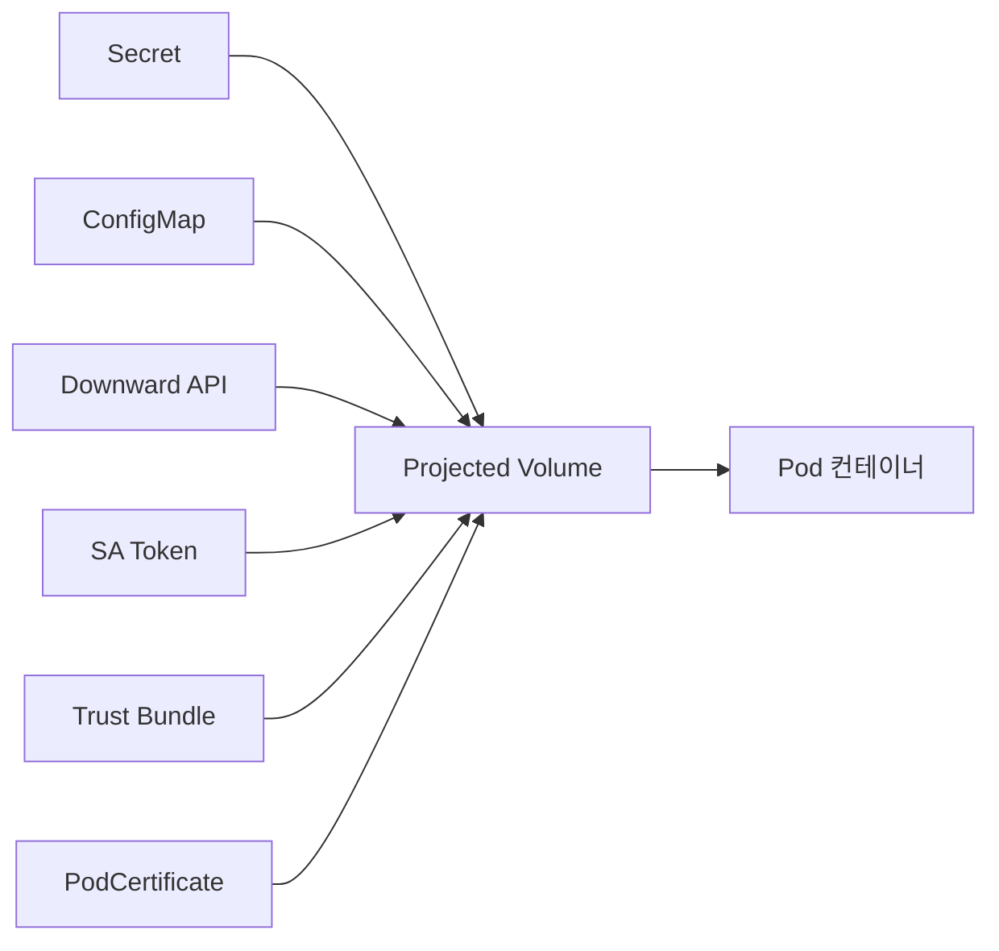
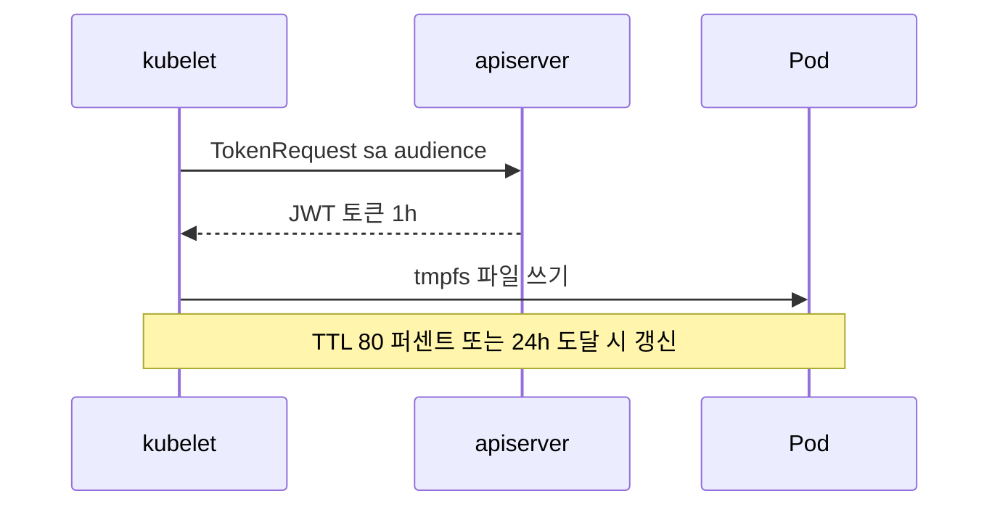
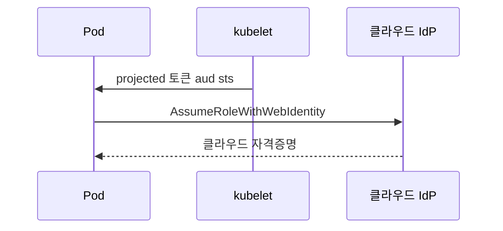

# Projected Volume

Projected Volume은 **여러 소스(Secret·ConfigMap·Downward API·
ServiceAccountToken·ClusterTrustBundle·PodCertificate)를 하나의 디렉터리로
합성**하는 볼륨이다. 겉보기엔 단지 "편의 도구"처럼 보이지만, 실제로는
**바운드 SA 토큰**(1.22 GA)·**ClusterTrustBundle**(1.33 Beta)·
**PodCertificate**(1.35 Beta) 같은 **현대 Kubernetes의 Pod 신원·신뢰 모델**이
전부 이 메커니즘 위에 올라가 있다.

즉 Projected Volume을 이해하는 것은 **IRSA/Workload Identity·SPIFFE·mTLS
부트스트랩·CA 번들 배포 같은 "런타임 신원 발급"의 공통 기반**을 이해하는
것이다.

이 글은 6가지 소스의 스펙, **SA Token projection의 회전·audience 의미**,
ClusterTrustBundle·PodCertificate의 역할, 그리고 Istio·Linkerd·Vault가
이 메커니즘을 쓰는 이유까지 다룬다.

> 관련: [ConfigMap](./configmap.md) · [Secret](./secret.md) · [Downward API](./downward-api.md)
> mTLS 전략·Zero Trust·SPIFFE → `security/` 섹션
> Service Mesh 구현체 → `network/` 섹션

---

## 1. 위치 — "단일 디렉터리에 여러 소스"



**왜 합성인가**:
- `/etc/tls/`에 CA + 서버 cert + 서버 key + SA 토큰을 **한 번에** 마운트
- 앱은 단일 경로만 알면 됨 → Helm chart·Operator 추상화가 깔끔해짐
- **바운드 SA 토큰은 오직 Projected Volume으로만 생성**(legacy Secret 미사용)

### 레거시 legacy SA 토큰과의 결정적 차이

| 축 | Legacy SA 토큰 | Projected 바운드 토큰 |
|---|---|---|
| 저장 | `Secret` 실체화 (etcd에 영구) | **파일에만 존재** (tmpfs) |
| 만료 | 없음(영구) | **audience·expirationSeconds 지정 + Pod 소멸 시 무효** |
| audience 지정 | 불가 | **`audience: vault` 등 다중 발급 가능** |
| 갱신 | 수동 | kubelet이 TTL 80%·24h 중 **먼저 도달 시 자동 갱신** |
| 청중 제한 | API Server 전용 | 외부 서비스(Vault·클라우드 IdP 등)까지 |
| 1.24 이후 | **자동 생성 중단** | **표준** |

**모든 projected volume은 tmpfs**(노드 메모리)에 마운트된다. Secret과
동일하게 디스크에 영구 저장되지 않으며, 따라서 시크릿 성질의 자료
(토큰·키·cert)를 배치하기에 안전하다.

---

## 2. 스펙 — 6가지 소스

```yaml
volumes:
- name: all-in-one
  projected:
    defaultMode: 0444           # 전체 소스의 기본 파일 모드
    sources:
    - secret: { ... }
    - configMap: { ... }
    - downwardAPI: { ... }
    - serviceAccountToken: { ... }
    - clusterTrustBundle: { ... }   # 1.33 Beta
    - podCertificate: { ... }       # 1.35 Beta
```

### 소스별 역할 표

| 소스 | 목적 | 지원 버전 |
|---|---|---|
| `secret` | 기존 Secret 파일 projection | 1.0+ |
| `configMap` | 기존 ConfigMap 파일 projection | 1.0+ |
| `downwardAPI` | Pod 메타데이터 파일 projection | 1.0+ |
| `serviceAccountToken` | **바운드 SA 토큰** 발급·자동 회전 | 1.22 GA |
| `clusterTrustBundle` | 클러스터 공유 CA 번들 | 1.33 Beta(`ClusterTrustBundleProjection`) |
| `podCertificate` | Pod별 X.509 인증서·자동 갱신 | 1.35 Beta(`PodCertificateRequest`) |

### 제약

- **모든 소스는 Pod와 같은 네임스페이스**여야 함
- **subPath 마운트 시 업데이트 전파 중단** (다른 볼륨 유형과 동일)
- `defaultMode`는 전체에 적용, **소스별 `items.mode`로 오버라이드 가능**

---

## 3. ServiceAccountToken Projection — 실전 핵심

```yaml
volumes:
- name: token
  projected:
    sources:
    - serviceAccountToken:
        audience: vault         # 청중 — 이 토큰을 받는 쪽 식별자
        expirationSeconds: 3600 # 최소 600, 기본 3600
        path: token             # mountPath 내 파일명
```

### 동작 순서



### audience의 의미

- 토큰 JWT의 `aud` 클레임
- **수신 측(Vault·클라우드 IdP·OIDC verifier)은 자기 audience 값이 맞는지
  검증**해야 안전 — 그렇지 않으면 A 서비스용 토큰이 B 서비스에 통과
- **미지정 기본값**: API Server의 issuer(다중 발급 불필요한 경우)

### expirationSeconds

| 값 | 의미 |
|---|---|
| 미지정 | 기본 **3600**(1h) |
| 최소 | **600**(10분) — apiserver가 하한 강제 |
| 최대 | apiserver `--service-account-max-token-expiration`으로 운영자 제한 |

### 자동 회전 규칙

kubelet은 다음 중 **먼저 도달하는 시점**에 선제적으로 새 토큰을 발급받아
파일을 교체:
- **남은 TTL이 80% 미만**
- **토큰 생성 후 24시간 경과** — `expirationSeconds`를 30h·48h처럼 길게
  잡아도 24h마다 선제 갱신됨

→ 앱은 파일을 **주기적으로 재열기** 해야 함(심링크 교체 + fd 캐시 문제는
ConfigMap/Downward 글과 동일).

### legacy 호환 — `--service-account-extend-token-expiration`

apiserver 옵션 `--service-account-extend-token-expiration`(기본 **true**)이
켜져 있으면 **1h로 요청한 토큰도 내부적으로 1년까지 연장 발급**된다. 이는
legacy 클라이언트(이전 client-go) 호환 목적이며, audit에 `tokenaudiences`와
`authentication.kubernetes.io/legacy-token` warning이 남는다. "토큰이 의도와
달리 1년짜리로 나온다"의 근본 원인으로 운영에서 자주 등장 — **legacy
클라이언트가 없다면 false로 운영** 권장.

### 무엇이 좋아졌는가 — legacy 대비

- 탈취 시 **유효 기간** 제한
- **Pod 삭제 시 즉시 무효** (TokenReview에서 Pod UID 확인)
- audience 제한으로 **최소 권한 범위화**
- etcd에 Secret으로 실체화되지 않음 → **유출 경로 감소**

---

## 4. IRSA·Workload Identity·SPIFFE의 공통 메커니즘

퍼블릭 클라우드의 **IRSA**(AWS IAM Roles for SAs), **GKE Workload Identity**,
**Azure Workload Identity**는 모두 **Projected SA Token**을 클라우드
IdP(STS 등)와 OIDC Federation으로 주고받는 구조다.



### 온프레미스의 대응 — SPIFFE·SPIRE

- Pod의 projected SA 토큰을 SPIRE agent가 검증
- SPIRE가 **SPIFFE ID + X.509-SVID**를 발급
- 워크로드는 로컬 UDS(`/run/spire/sockets/agent.sock`)로 SVID 수령

같은 패턴이 **Istio·Linkerd·Cilium Service Mesh**의 **mTLS 부트스트랩**에도
사용. 핵심: **projected SA 토큰이 "워크로드 신원 부트스트랩의 1차 재료"**.

> 전략·비교는 `security/`·`network/` 주인공 글에서.

---

## 5. ClusterTrustBundle Projection — 1.33 Beta

CA 번들을 **클러스터 범위 리소스**로 선언하고 Pod에 자동 마운트·갱신하는
메커니즘. Feature gate: `ClusterTrustBundleProjection`.

```yaml
- clusterTrustBundle:
    signerName: example.com/ca   # 이 서명자의 모든 번들
    labelSelector:
      matchLabels: { version: live }
    path: ca-roots.pem
    optional: true
```

### 선택 방식 두 가지

| 방식 | 의미 |
|---|---|
| `name: <crd-name>` | 특정 ClusterTrustBundle 하나 |
| `signerName: ...` + `labelSelector: {}` | 그 서명자의 **모든** CTB. `labelSelector: {}` 빈 오브젝트 필수 |

### labelSelector 함정 — "아무것도 매칭되지 않음"

ClusterTrustBundle projection의 `labelSelector`는 **반직관적인 기본값**을
갖는다:

| `labelSelector` | 의미 |
|---|---|
| **미지정(absent)** | **어떤 CTB도 매칭되지 않음** — 빈 파일 |
| `labelSelector: {}` (빈 오브젝트) | **모든 CTB 매칭** |
| `labelSelector: { matchLabels: {...} }` | 라벨 매칭 CTB |

`signerName`만 지정하고 `labelSelector`를 생략하면 파일이 비어 있다
(또는 `optional: false`면 Pod 시작 실패). "그 서명자의 모든 번들을 가져오고
싶다"면 **반드시 `labelSelector: {}`** 명시.

### 무엇이 좋아졌는가

- 기존: 모든 팀이 **ConfigMap으로 ca-bundle을 복붙** → 회전 시 일괄 업데이트
  누락
- CTB: 한 번 선언, **kubelet이 자동으로 PEM 정규화·중복 제거·변경 반영**
- 서명자별 분리 모델 → **mTLS 도입 클러스터의 표준 CA 배포 경로**

### 관련 상위 개념 — `kubernetes.io/clusterTrustBundle` signer

- Kubelet이 CSR을 처리하는 **내장 서명자**는 별개. CTB는 **번들 자체의
  배포** 담당
- 외부 PKI(HashiCorp Vault PKI·cert-manager Issuer) 산출물을 CTB로 노출하는
  패턴 확산 중

---

## 6. PodCertificate Projection — 1.34 Alpha / 1.35 Beta

Pod별 **X.509 인증서**를 자동 발급·갱신. 상태 정리:

| 버전 | 상태 | 기본 |
|---|---|:-:|
| 1.34 | Alpha | off |
| **1.35** | **Beta** | **여전히 off** |

활성화 요건:
- Feature gate: `PodCertificateRequest`
- API 런타임 활성화: `--runtime-config=certificates.k8s.io/v1beta1=true`
- 서명자 구현이 `PodCertificateRequest` 리소스를 처리해야 동작

```yaml
- podCertificate:
    signerName: example.com/my-signer
    keyType: ED25519              # 권장: ED25519 또는 ECDSAP256
    maxExpirationSeconds: 86400
    path: cert-chain.pem
```

### keyType 권장 선택

| keyType | 권장 |
|---|---|
| `ED25519` | **기본 권장** — 성능·키 크기·보안 모두 우수 |
| `ECDSAP256` | 차선. 호환성 중시 |
| `ECDSAP384`/`ECDSAP521` | 규정 요구 시 |
| `RSA3072`/`RSA4096` | legacy 호환 전용 — 신규 금지 |

### 의미

- 기존: mTLS를 위해 **cert-manager + Secret projection** 조합으로 Pod cert
  공급
- PodCertificate: **Kubernetes native**로 Pod 라이프사이클과 묶인 cert 발급
- 서명자는 외부 CA(Vault PKI·Intermediate CA)에 위임 가능

### 주의

- **Beta** 단계, 기본 비활성. 프로덕션 투입 전 이슈 트래킹 필요
- 앱은 파일 변경 감지(inotify·폴링) **반드시 구현**

---

## 7. 실전 합성 예 — 전형적인 "모든 것을 한 볼륨에"

```yaml
volumes:
- name: pod-identity
  projected:
    defaultMode: 0400
    sources:
    - serviceAccountToken:
        audience: vault
        expirationSeconds: 3600
        path: token
    - clusterTrustBundle:
        signerName: internal-pki.example.com/root
        path: ca.pem
    - configMap:
        name: app-config
        items:
        - key: app.yaml
          path: app.yaml
    - downwardAPI:
        items:
        - path: metadata/labels
          fieldRef: { fieldPath: metadata.labels }
```

결과:

```
/var/run/identity/
├── token              # SA token (aud=vault, 1h 회전)
├── ca.pem             # 내부 PKI root CA (자동 갱신)
├── app.yaml           # 애플리케이션 설정
└── metadata/labels    # Pod 라벨 덤프
```

앱은 단일 디렉터리만 알면 되고, kubelet이 모든 파일을 라이프사이클에
맞춰 유지한다.

---

## 8. 현존 생태계 사용 사례

| 도구·플랫폼 | Projected Volume 활용 |
|---|---|
| **Istio / Linkerd / Cilium Mesh** | 사이드카·Ambient 워크로드 ID 부트스트랩(aud=`istio-ca` 등) |
| **SPIRE** | Agent가 `kubernetes.io/serviceaccount` aud 토큰 검증 |
| **Vault Agent Injector·CSI** | `aud=vault` projected 토큰으로 Vault `k8s-auth` 인증 |
| **IRSA·GKE/Azure Workload Identity** | projected 토큰 + OIDC Federation |
| **cert-manager CSI Driver** | Pod 볼륨에 직접 TLS 인증서 주입(유사 패턴) |
| **Envoy·HAProxy ingress** | clusterTrustBundle로 root CA 배포 |

Service Mesh·Zero Trust 전략은 → `network/`·`security/`.

---

## 9. 권한·보안 주의

- **파일 모드**: `defaultMode: 0400` 또는 소스별 `items.mode`로 **그룹·기타
  권한 차단**
- `runAsUser`·`fsGroup` 설정이 마운트 파일 소유권에 영향 — 비 root UID로
  앱을 실행하면 `fsGroup`으로 읽기 권한 부여 필요
- **`automountServiceAccountToken: false`** + Projected로 **명시 주입**이
  최소 권한 패턴
- audience별로 **별도 projection** — 한 파일로 다 같이 쓰지 말 것

### automountServiceAccountToken과의 관계

- Pod이나 SA에 `automountServiceAccountToken: true`(기본)면 kubelet이
  `BoundServiceAccountTokenVolume`(1.22 GA) 메커니즘으로 **자동으로
  projected volume을 `/var/run/secrets/kubernetes.io/serviceaccount`**에
  마운트. 이 projection은 내부적으로 `audience=<kubernetes.default.svc>`·
  `ca.crt`·`namespace`·`token` 네 항목을 합성한 **동일한 Projected Volume**
- 앱이 in-cluster kube-client를 쓰려면 이 경로가 유효해야 함
- **Pod 레벨 `automountServiceAccountToken`이 SA 레벨 설정을 override** —
  SA에서 true여도 Pod에서 false로 끌 수 있고, 그 반대도 가능
- **automount를 끄고** Projected로 **명시** 주입하면 감사·최소 권한 설계가
  훨씬 깔끔

---

## 10. 안티패턴

| 안티패턴 | 결과 | 대안 |
|---|---|---|
| projected 없이 legacy SA token Secret 사용 | 영구 토큰 노출 위험 | Projected `serviceAccountToken` |
| 같은 토큰을 여러 audience에 재사용 | audience 검증 전제 깨짐·권한 혼합 | audience별 **별도 projection 경로** |
| `defaultMode` 미지정 → world-readable | 권한 최소화 실패 | `0400` 또는 `0440` + `fsGroup` |
| subPath로 projected 단일 파일 마운트 | 업데이트 전파 중단 | 디렉터리 마운트 |
| CA 번들을 ConfigMap으로 각 팀 복붙 | 회전 누락 | ClusterTrustBundle |
| `expirationSeconds: 60` 같은 극단적 단축 | kubelet API 호출 폭증 | 최소 600s |
| Projected 파일을 **읽은 뒤 캐시**만 하고 재열기 없음 | 회전 반영 안 됨 | 주기적 재열기·inotify |
| `audience` 미지정 토큰으로 외부 서비스 호출 | 오용 위험·혼동 | 외부용은 **명시적 audience** |

---

## 11. 프로덕션 체크리스트

- [ ] legacy `kubernetes.io/service-account-token` Secret **잔존 여부** 주기 점검
- [ ] 모든 Pod에 `automountServiceAccountToken: false` 기본, 필요 시 Projected로 명시 주입
- [ ] in-cluster kube-client 필요 앱은 **기본 projection**(`/var/run/secrets/kubernetes.io/serviceaccount`) 유지
- [ ] 외부 서비스(Vault·클라우드·SPIRE)는 **audience별 별도 projection**
- [ ] `expirationSeconds` 600~3600 권장, 외부 서비스 연동 최소값 준수
- [ ] `apiserver --service-account-max-token-expiration` 운영자 상한 설정
- [ ] `apiserver --service-account-extend-token-expiration=false` (legacy 클라이언트 없다면) — 1년 연장 방지
- [ ] audit policy에 `tokenreviews`·`serviceaccounts/token` Metadata 이상 기록
- [ ] PodCertificate 도입 검토 시 v1beta1 API 런타임 활성 및 서명자 구현 확인
- [ ] CA 번들은 **ClusterTrustBundle** 채택(1.33+) — 팀별 복붙 지양
- [ ] `defaultMode: 0400` 또는 소스별 `items.mode` 지정
- [ ] 앱이 **파일 재열기·inotify**로 토큰·cert 회전 반영
- [ ] Audit policy에 TokenRequest **create Metadata 레벨** 이상 기록

---

## 12. 트러블슈팅

| 증상 | 근본 원인 | 진단·조치 |
|---|---|---|
| 앱이 **401 Unauthorized**(외부 서비스) | audience 불일치·만료 | aud 클레임 확인, `expirationSeconds` 상한, kubelet 회전 주기 |
| 토큰 파일이 **영원히 같은 값** | 앱이 파일 재열기 안 함 | 재열기·inotify |
| `Permission denied` | runAsUser != 파일 uid·mode 제한 | `fsGroup` 또는 `defaultMode` |
| `expirationSeconds: 300` 거부 | 최소 600 위배 | 600 이상으로 상향 |
| Projected volume 생성 실패 `cannot project` | 소스 중 하나가 **다른 네임스페이스** | 같은 네임스페이스로 이동 |
| CTB 파일 비어 있음 | `signerName`만 쓰고 **`labelSelector` 생략** → 매칭 0 | `labelSelector: {}` 명시 |
| CTB apply 후 여전히 파일 비어 있음 | Feature gate off 또는 kubelet 재시작 필요 | `ClusterTrustBundleProjection` 활성 확인 |
| PodCertificate 파일 누락 | 서명자 구현이 요청 무시 | 서명자 로그·CSR 상태 |
| `automount: false`인데 앱이 API 호출 시도 | 기본 경로 없음 | Projected로 명시 주입 또는 automount 복원 |
| subPath로 마운트 후 회전 안 반영 | subPath 제약 | 디렉터리 마운트 |
| 토큰 `aud=""`로 발급됨 | `audience` 누락 → API Server 기본값 | 외부용은 명시 |

### 자주 쓰는 명령

```bash
# 바운드 토큰 claims 확인 (aud, exp 검증)
TOKEN=$(kubectl exec <pod> -- cat /var/run/secrets/kubernetes.io/serviceaccount/token)
echo "$TOKEN" | cut -d. -f2 | base64 -d 2>/dev/null | jq

# 수동 TokenRequest (audience 임의 지정) — Vault k8s-auth 연동 테스트 등
kubectl create token <sa> --audience=vault --duration=1h

# Pod-bound 토큰 수동 발급 (CSI·Injector 디버깅)
kubectl create token <sa> --audience=vault \
  --bound-object-kind=Pod --bound-object-name=<pod>

# TokenRequest 감사 — Events보다 apiserver audit log가 정답
# audit policy에서 resource=serviceaccounts, subresource=token을 Metadata 이상으로

# Projected 마운트 전체 파일 목록
kubectl exec <pod> -- find /projected-volume -type f -o -type l

# CTB 조회 (1.33+)
kubectl get clustertrustbundles
kubectl describe clustertrustbundle <name>

# TokenRequest 감사 이벤트
kubectl get events --field-selector reason=TokenRequestFailed
```

---

## 13. 이 카테고리의 경계

- **Projected Volume 자체**(6소스·SA Token·CTB·PodCertificate) → 이 글
- **Secret / ConfigMap** → [Secret](./secret.md) · [ConfigMap](./configmap.md)
- **Pod 메타데이터 주입** → [Downward API](./downward-api.md)
- **Service Mesh·mTLS 전략·Zero Trust** → `network/` · `security/`
- **SPIFFE/SPIRE·Vault Transit·외부 PKI** → `security/`
- **cert-manager·Issuer·Let's Encrypt** → `security/` 또는 `network/`
- **IRSA / Workload Identity / OIDC Federation** 상세 → `security/`

---

## 참고 자료

- [Kubernetes — Projected Volumes](https://kubernetes.io/docs/concepts/storage/projected-volumes/)
- [Kubernetes — Managing Service Accounts](https://kubernetes.io/docs/reference/access-authn-authz/service-accounts-admin/)
- [Kubernetes — Configure Service Accounts for Pods](https://kubernetes.io/docs/tasks/configure-pod-container/configure-service-account/)
- [KEP-1205 — Bound Service Account Tokens](https://github.com/kubernetes/enhancements/blob/master/keps/sig-auth/1205-bound-service-account-tokens/README.md)
- [KEP-2799 — Reduction of Secret-based SA Tokens (1.24)](https://github.com/kubernetes/enhancements/blob/master/keps/sig-auth/2799-reduction-of-secret-based-service-account-token/README.md)
- [KEP-3257 — ClusterTrustBundles](https://github.com/kubernetes/enhancements/tree/master/keps/sig-auth/3257-cluster-trust-bundles)
- [KEP-4317 — PodCertificateRequest](https://github.com/kubernetes/enhancements/issues/4317)
- [SPIFFE/SPIRE](https://spiffe.io/)
- [HashiCorp Vault — Kubernetes Auth](https://developer.hashicorp.com/vault/docs/auth/kubernetes)
- [AWS IRSA — IAM Roles for Service Accounts](https://docs.aws.amazon.com/eks/latest/userguide/iam-roles-for-service-accounts.html)
- [GKE Workload Identity](https://cloud.google.com/kubernetes-engine/docs/concepts/workload-identity)

(최종 확인: 2026-04-22)
