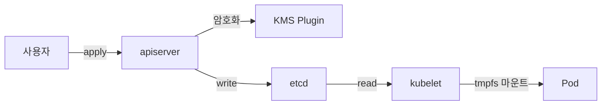

# Secret

Kubernetes Secret은 토큰·비밀번호·인증서 같은 **기밀 데이터**를 담는
오브젝트다. 겉모습은 ConfigMap과 쌍둥이지만 **저장·전파·감사·암호화**의
모든 축에서 설계가 다르다.

가장 흔한 오해는 **"base64는 암호화다"** — 아니다. base64는 단지 바이너리
안전 전송을 위한 인코딩이다. Secret의 실제 보호는 **etcd 암호화(KMS)**,
**최소 권한 RBAC**, **주입 경로 선택**(env 금지·volume 권장),
**외부 시크릿 매니저 연동**의 네 축 위에 선다.

이 글은 Secret의 8가지 내장 타입, 주입 경로별 위험, immutable, etcd KMS v2
암호화, 바운드 SA 토큰(Bound ServiceAccount Token), 그리고 외부 시크릿
생태계(ESO·Sealed Secrets·SOPS·Vault)의 **경계**를 다룬다.

> ConfigMap(비기밀): [ConfigMap](./configmap.md)
> SA 토큰 projection 상세: [Projected Volume](./projected-volume.md)
> 외부 시크릿 **도구 자체**는 `security/` 섹션의 주인공 글
> Secret as code·공급망: `security/` 섹션

---

## 1. Secret의 위치 — "base64는 암호화가 아니다"



공식 문서 선언: *"Kubernetes Secrets are, by default, stored unencrypted in
the API server's underlying data store (etcd). Anyone with API access can
retrieve or modify a Secret, and so can anyone with access to etcd."*

| 축 | ConfigMap | Secret |
|---|---|---|
| 저장 형태 | UTF-8 + base64 binaryData | **data 값 전체 base64** |
| etcd 암호화 | 선택 | **KMS 권장 (필수화)** |
| kubelet volume 저장소 | 기본 디스크 | **tmpfs(노드 메모리)** |
| 로그·describe 노출 | 평문 | `describe secret`은 마스킹, **`describe pod`는 env 값 전체 출력** |
| 주입 권장 | env/volume 유연 | **volume 권장**(env는 leak 경로 많음) |
| 대규모 watch 부하 | 동일 | immutable로 완화 동일 |

**tmpfs 부작용**: Secret volume은 노드 메모리를 소비한다. 한 Pod에 다수
Secret 볼륨을 마운트하는 고밀도 환경에서는 메모리 용량 계획에 포함해야
하며, 1.30+ [스왑 관리](https://kubernetes.io/docs/concepts/cluster-administration/swap-memory-management/)에서도
Secret tmpfs는 `noswap`을 유지해 디스크 스왑으로 기밀이 흘러나가지 않도록
보장된다.

**핵심 원칙 5가지**:
1. **etcd 암호화는 필수** (KMS v2 권장)
2. **env 주입 지양, volume 주입 우선**
3. **RBAC `resourceNames`로 Secret별 최소 권한**
4. **audit logging**(create/update/delete/patch 최소)
5. **운영 기밀은 외부 시크릿 매니저**(ESO/Vault)로 관리

---

## 2. 타입 8가지 — 내장 타입과 필수 키

`type` 필드는 kubelet·컨트롤러의 **전용 처리 로직**을 결정한다. 잘못된 타입은
생성은 되어도 kubelet이 제대로 못 쓴다.

| 타입 | 용도 | 필수 키 |
|---|---|---|
| `Opaque`(기본) | 임의 key-value | 없음 |
| `kubernetes.io/service-account-token` | SA 토큰 | `token`, `ca.crt`, `namespace` |
| `kubernetes.io/dockercfg` | 레거시 Docker 설정 | `.dockercfg` |
| `kubernetes.io/dockerconfigjson` | 프라이빗 레지스트리 pull | `.dockerconfigjson` |
| `kubernetes.io/basic-auth` | 베이식 인증 | `username`, `password` |
| `kubernetes.io/ssh-auth` | SSH 키 | `ssh-privatekey` |
| `kubernetes.io/tls` | TLS 인증서 | `tls.crt`, `tls.key` |
| `bootstrap.kubernetes.io/token` | 노드 부트스트랩 토큰 | `token`, `expiration`, `usage-*` |

### 타입별 실무 주의

- **`tls`**: `tls.crt`는 보통 **fullchain(서버+중간 CA)**을 포함. CA만 따로
  배포하려면 `Opaque`에 `ca.crt` 키로 별도 저장이 관례
- **`dockerconfigjson`**: Pod `spec.imagePullSecrets`에 지정할 때만 의미.
  네임스페이스 단위로 분리하고, 사용자 RBAC에서 해당 네임스페이스 접근 제어
- **`service-account-token`**: 필수 키는 apiserver가 자동 채움 — 사용자는
  `metadata.annotations["kubernetes.io/service-account.name"]`만 지정.
  **1.24부터 SA당 자동 생성 중단**(KEP-2799) — 외부 시스템이 정적 토큰을
  요구할 때만 수동 생성. 런타임 앱은 **Projected Volume의 바운드 토큰**
- **`bootstrap.kubernetes.io/token`**: kubeadm 노드 조인용. `kube-system`
  네임스페이스·이름 규칙(`bootstrap-token-<id>`) 엄격

### legacy `Opaque`로 섞어 쓰기

모든 내장 타입은 `Opaque`로도 표현 가능하지만 **전용 타입을 써야** 하는
이유:
- kubelet이 필수 키 검증
- `kubectl describe` 가독성
- 감사·보안 스캐너가 타입 기반 정책 적용

---

## 3. 주입 경로 — env vs volume

```yaml
# env (비권장)
env:
- name: DB_PASSWORD
  valueFrom:
    secretKeyRef:
      name: db
      key: password

# volume (권장)
volumeMounts:
- name: db
  mountPath: /etc/db
  readOnly: true
volumes:
- name: db
  secret:
    secretName: db
    defaultMode: 0400
```

### env 주입의 실제 leak 경로

공식 문서: *"Environment variables ... expose sensitive data to container
inspection, logs, and child processes."*

| 경로 | 노출 |
|---|---|
| `kubectl describe pod` | **env는 `name=value`가 그대로 출력**, envFrom만 참조 이름만 표시 |
| `/proc/<pid>/environ` | 호스트·공격자 접근 시 **평문** |
| `ps e`·컨테이너 내부 `env` | 자식 프로세스 전부 상속 → **평문** |
| 애플리케이션 **크래시 로그**·덤프 | 환경변수 덤프 라이브러리가 전부 로그로 |
| OpenTelemetry·APM 리소스 속성 | 자동 수집 구성에 `HOSTNAME` 등과 함께 딸려감 |

**자주 오해하는 점**: `kubectl describe pod`이 Secret 값을 마스킹하리라 믿고
env 주입을 허용하면 안 된다. `describe pod`은 PodSpec 그대로를 출력하므로
env의 `valueFrom.secretKeyRef`는 이름만 보이지만, **resolved 값을 보여주는
환경(예: 일부 UI·로그)에선 그대로 노출**된다. 원천적으로 volume 주입이 정답.

### envFrom 키 규칙 — `-`·`.` 함정

ConfigMap과 동일하게 1.33 이하에서는 `aws-access-key` 같은 `-` 포함 키가
envFrom으로 스킵된다. 1.34 Stable(KEP-4369)부터 기본 허용. 관련 상세는
[ConfigMap 글의 envFrom 규칙](./configmap.md#7-binarydata-크기-이름-규칙).

### volume 주입의 장점

- 파일은 **`0400`** 등 파일 모드로 제한 가능(`defaultMode`)
- 프로세스 자식 상속 없음
- kubelet이 **tmpfs**에 마운트 → 디스크 영구 저장 방지
- **업데이트 전파**(immutable이 아닐 때) — env는 전파 안 됨

### `envFrom`으로 모든 키 쏟아붓지 말기

`envFrom.secretRef`는 편리하지만 새 키 추가가 즉시 **모든 env로 노출**된다.
보안 경계 유지가 어려워 **명시적 `env[].valueFrom`**가 안전.

---

## 4. immutable — 전파·보안·성능의 삼중 이득

```yaml
apiVersion: v1
kind: Secret
metadata:
  name: api-key
immutable: true
type: Opaque
data:
  apikey: <base64>
```

- Kubernetes 1.21 GA
- 한 번 `true` 해제 불가
- **kubelet이 watch하지 않음** → 대규모 클러스터 apiserver 부하 감소
- ConfigMap과 달리 Secret은 **수정이 곧 키 회전 시그널**이므로 immutable의
  함의가 더 크다 → 회전은 **이름 교체(rotate by replacement)** 패턴이 자연스러움

### 회전 패턴 두 가지

| 패턴 | 동작 | 장단 |
|---|---|---|
| **in-place 수정** | 같은 Secret의 data만 교체 | volume 마운트면 파일이 **원자 교체** (tmpfs 심링크) — 앱이 파일 재읽기 가능해야 함 |
| **이름 교체**(immutable 전제) | 새 이름 Secret 생성 → Pod 참조 변경 → 구 Secret 삭제 | Deployment 롤링으로 **연속 교체**, 감사·롤백이 명확 |

GitOps에서는 **이름 교체 + Kustomize 해시 접미**가 정석. ExternalSecrets
`refreshInterval`도 내부적으로는 같은 Secret의 in-place 업데이트를 한다.

---

## 5. etcd 암호화 at-rest — KMS v2가 정답

Secret은 기본 etcd에 **평문 저장**이다. etcd 노드에 접근만 해도 전부 탈취
가능. 프로덕션에서는 **`EncryptionConfiguration`** 필수.

```yaml
apiVersion: apiserver.config.k8s.io/v1
kind: EncryptionConfiguration
resources:
- resources:
  - secrets
  - configmaps         # 선택: 민감 CM도 함께
  providers:
  - kms:
      apiVersion: v2
      name: vault-transit
      endpoint: unix:///opt/kms/vault.sock
      timeout: 3s
  - aesgcm:            # aescbc는 padding oracle 이슈로 지양(#73514)
      keys:
      - name: local-key
        secret: <32byte base64>
  - identity: {}       # 반드시 마지막. 첫 번째에 두면 새 쓰기가 평문이 된다
```

### provider 체인 해석

**첫 provider가 새 쓰기에 사용**, 읽기는 **모든 provider를 위에서 아래로 시도**.

- **신규 쓰기는 `kms`(Vault Transit)** 로 암호화
- 기존 `aesgcm`/`aescbc`로 암호화된 리소스는 **여전히 해독 가능**
- 마지막 `identity` = 평문 fallback — **반드시 배열 마지막**
- 첫 위치에 `identity`를 두면 **새 Secret이 평문으로 etcd에 기록**되는
  사고 발생. 1.28+ 부터는 시작 시 경고 로그가 나오지만, 배치 초기 검증에
  의존하지 말 것

### 알고리즘 선택

| Provider | 권장 |
|---|---|
| `kms`(v2) | **최우선** — DEK 캐시·키 회전·감사 |
| `aesgcm` | 차선. **키 회전 의무**(쓰기마다 nonce 증가) |
| `aescbc` | 지양. padding oracle 취약 — [kubernetes/#73514](https://github.com/kubernetes/kubernetes/issues/73514) |
| `secretbox` | XSalsa20+Poly1305. 키 회전 의무 |
| `identity` | 평문 — 마이그레이션 fallback 전용 |

### KMS v1 vs v2

| 항목 | v1 | v2 |
|---|---|---|
| 상태 | 1.28부터 **deprecated**, 1.29부터 **기본 비활성** | **1.27 Beta, 1.29 GA** |
| 암호화 모델 | 매 Secret마다 KEK 호출 → DEK 생성 → 암호화 | **envelope + DEK 캐시** — 단일 DEK를 여러 오브젝트에 재사용 |
| 성능 | 매 쓰기마다 KMS 왕복 | KMS 호출이 **~1000배 감소** (공식: *"three orders of magnitude faster"*) |
| 키 회전 | 수동·복잡 | `key_id` 변경 자동 감지, DEK 재생성 |
| 운영 | 신규 도입 금지 | **필수 선택지** |

**온프레미스 조합**: HashiCorp Vault Transit + 자체 관리 KMS Plugin이
표준. 퍼블릭 KMS(AWS KMS/GCP KMS/Azure Key Vault)는 오프라인 환경에 맞지
않음.

### 기존 Secret 재암호화 — 반드시 해야 하는 후속 단계

```bash
# 신규 provider 적용 후 모든 기존 Secret을 재저장 → 새 provider로 재암호화
kubectl get secrets -A -o json \
  | kubectl replace -f -
```

**이 단계를 빠뜨리면** 구 Secret은 여전히 구 키·구 provider로 etcd에
남아 있다. compliance audit이 이 부분을 반드시 확인한다.

#### 대규모 클러스터 주의

| 함정 | 완화 |
|---|---|
| 수만 개 Secret 동시 쓰기 → apiserver 429 throttling | **네임스페이스 단위 반복**, `--qps` 제한 |
| **immutable Secret**은 replace 실패 | `--field-selector` 또는 jq 필터로 제외 |
| 재암호화 중 중단 시 혼재 상태 | 사전 `kubectl get secrets -A -o yaml > backup.yaml` 백업 |
| 대상이 `service-account-token`까지 포함 | 보통 제외: `--field-selector type!=kubernetes.io/service-account-token` |
| Argo CD drift로 복구 문제 | 재암호화는 apiserver 내부 작업 — data가 바뀌지 않으므로 GitOps diff 없음 |

#### 플러그인 교체(dual-socket 전환)

KMS Plugin 자체를 교체하거나 백엔드를 옮길 때는 **한 시점에 두 소켓을
동시 listen**시키고 provider 배열에 **구/신을 둘 다 등록**한 뒤 단계별로
전환한다:

1. 신규 Plugin을 다른 소켓 경로로 기동
2. `EncryptionConfiguration`에 **신규 Plugin을 두 번째 위치**(읽기는 되나 쓰기 안 됨)로 추가 → apiserver reload
3. 각 노드 apiserver가 **양쪽 해독 가능** 확인
4. 신규 Plugin을 **첫 번째 위치**로 이동 → apiserver reload
5. 전체 Secret 재암호화
6. 구 Plugin·소켓 제거

### 검증 — etcd에서 직접 읽어보기

```bash
# etcdctl get /registry/secrets/<ns>/<name>
# 앞 몇 바이트가 provider prefix
# k8s:enc:kms:v2:...    KMS v2로 암호화됨
# k8s:enc:aescbc:v1:... aescbc로 암호화됨
# prefix 없는 JSON      identity(평문) — 사고
```

---

## 6. 키 회전 — KMS v2 절차

30일 ~ 90일 주기 권장. 절차:

1. KMS(Vault Transit)에서 **새 키 버전 생성** (`vault write -f transit/keys/k8s-secrets/rotate`)
2. KMS Plugin 로그로 **`key_id` 변경 확인**
3. 전체 Secret 재암호화:
   ```bash
   kubectl get secrets -A -o json | kubectl replace -f -
   ```
4. audit log에서 Secret 재저장 이벤트 수 = 대상 Secret 수 확인
5. 구 키 버전 **일정 기간 보존 후 폐기**(PCI-DSS·SOC2 등 규정에 따라)

### 자동화

- Reloader가 Secret 변경 시 Pod 롤링을 담당 → 앱 레벨 **회전 반영**
- ExternalSecrets `refreshInterval`로 외부 스토어 변경을 자동 반영
- 키 자체의 회전은 플랫폼팀의 **주기적 작업**(Ansible·GitOps Job)

---

## 7. Bound ServiceAccount Token — 1.22+ 표준

레거시 `kubernetes.io/service-account-token` Secret은 **영구 토큰**이었다.
탈취 시 무기한 유효 → 1.22에서 **Bound Token** 도입.

### 기존 vs 현재

| 항목 | Legacy(1.21 이하) | Bound(1.22+) |
|---|---|---|
| 저장 | `secrets`로 실체화 | **API 경유 발급**(TokenRequest) — 파일에만 마운트 |
| 만료 | 없음(영구) | **시간 만료 + Pod/SA 삭제 시 즉시 무효** |
| 청중(audience) | 없음 | `audiences` 지정 가능 |
| 자동 마운트 | 모든 Pod에 기본 | 기본 유지되나 `automountServiceAccountToken: false`로 off 권장 |

1.24부터는 `default-token-xxxxx` Secret이 **자동 생성되지 않는다**. 앱이
외부에서 k8s API를 쓰려면 **Projected Volume의 바운드 토큰**을 쓴다
→ 상세는 [Projected Volume](./projected-volume.md).

### legacy token Secret이 아직 필요한 경우

- 외부 시스템(CI·스크립트)이 static token을 요구
- 드문 레거시 컨트롤러

→ 명시적으로 만들지 않으면 생성되지 않음. audit에서 legacy token 잔존 여부
주기 점검.

---

## 8. 외부 시크릿 도구 — 비교 표 (깊이는 `security/`에서)

Secret 매니페스트를 **Git에 평문 저장**하는 안티패턴 회피 수단. 도구
자체의 상세 동작·운영은 `security/` 섹션 주인공 글에서 다룬다. 여기서는
경계와 선택 기준만.

| 도구 | 모델 | GitOps 적합 | 외부 스토어 | 운영 비용 |
|---|---|:-:|---|---|
| **External Secrets Operator** | 스토어의 값을 **Secret 오브젝트로 동기화** | ✅ | Vault·AWS SM·Azure KV·GCP SM·자체 | 중 |
| **Sealed Secrets** | 암호문 YAML을 **클러스터 내에서 복호화** | ✅ | 없음(key in-cluster) | 낮 |
| **SOPS** | KMS·PGP로 **파일 단위 암호화**, 배포 시 복호 | ✅ | KMS·PGP | 낮 |
| **HashiCorp Vault**(agent injector 또는 CSI) | **Secret 오브젝트 없이** 파일에 직접 주입 | 중 | 자체 | 높음 |

### 선택 기준 (경험)

| 팀·상황 | 권장 |
|---|---|
| 작은 팀·GitOps 입문·소수 시크릿 | **Sealed Secrets** 또는 **SOPS** |
| 중대형 조직·다중 스토어·자동 회전 | **External Secrets Operator** |
| Vault 이미 운영 중 | **ESO + Vault** 또는 **Vault Agent Injector** |
| 온프레미스 고보안 | **Vault Transit + ESO + KMS v2** 조합 |

**ESO 설계 주의**: `SecretStore`(네임스페이스 한정) vs `ClusterSecretStore`
(클러스터 공유)의 선택이 **권한 격리의 핵심**. 멀티테넌시 클러스터에서
ClusterSecretStore 하나로 모든 네임스페이스를 묶으면 한 팀의 RBAC 침해가
다른 팀 시크릿 전체를 노출한다. **기본은 네임스페이스별 SecretStore**.

`security/` 주인공 글에서 **동작 원리·운영·장애 대응**을 구체화한다.

---

## 9. 크기·이름·감사

| 항목 | 제약 |
|---|---|
| 전체 Secret 크기 | **1 MiB**(etcd 연관). **실무 권장 ~256 KiB** — watch·요청 한계 |
| `data` 값 | base64 필수. 바이너리 안전 |
| `stringData` | 평문으로 쓰면 apiserver가 base64 인코딩(쓰기 전용). **같은 키가 `data`와 `stringData`에 있으면 `stringData`가 덮어씀** |
| 이름 | DNS subdomain(RFC 1123), 라벨 63자·전체 253자 |
| 타입 수정 | **불가** — 재생성 |

**`stringData`의 GitOps 함정**: YAML 소스에 `stringData`로 평문 기록하면
Git·Argo CD diff에 **그대로 노출**된다. 평문 레포 체크인을 피하려면 ESO/
Sealed Secrets/SOPS가 그래서 필요하다.

### 최소 audit 정책

```yaml
apiVersion: audit.k8s.io/v1
kind: Policy
# 소음 차단 먼저
rules:
- level: None
  users: ["system:kube-scheduler", "system:kube-controller-manager"]
  verbs: ["get", "list", "watch"]
  resources:
  - group: ""
    resources: ["leases", "endpoints"]

# Secret: get/list/watch는 Metadata만 — 값 누출 방지
- level: Metadata
  verbs: ["get", "list", "watch"]
  resources:
  - group: ""
    resources: ["secrets"]

# Secret: 쓰기는 RequestResponse
- level: RequestResponse
  verbs: ["create", "update", "patch", "delete"]
  resources:
  - group: ""
    resources: ["secrets"]
```

- **get/list/watch는 Metadata 레벨만** — RequestResponse로 두면 **감사 로그 자체에 비밀 값이 저장**된다(치명)
- **create/update/patch/delete는 RequestResponse**. apiserver response body
  의 일부 마스킹에도 불구하고 감사 로그는 별도 보안 수준으로 분리 저장
  (Loki/S3 encryption 등)
- **`- level: None`을 맨 위에** 두어 리더 선출·프로브 등 무의미 이벤트를
  걸러내지 않으면 감사 로그 볼륨이 폭증한다

### 관측 — KMS·Secret 핵심 메트릭

| 메트릭 | 의미 | 알람 포인트 |
|---|---|---|
| `apiserver_storage_transformation_duration_seconds` | provider 변환 지연 | P99 > 100ms |
| `apiserver_storage_transformation_operations_total{status="failure"}` | 암복호 실패 | 0 이상이면 즉시 |
| `apiserver_envelope_encryption_dek_cache_fill_percent` | KMS v2 DEK 캐시 | 90% 초과 시 capacity 검토 |
| `apiserver_envelope_encryption_key_id_hash_total` | 현재 KEK id별 건수 | 회전 후 구 `key_id` 건수 감소 확인 |
| Vault `vault.core.unsealed` | Vault seal 상태 | 0이면 alert |
| ESO `externalsecret_sync_calls_error` | 외부 스토어 동기화 실패 | 증가 시 alert |
| kube-state-metrics `kube_secret_type` + TLS 만료 파서 | TLS Secret 만료 | 30일/7일 전 |

---

## 10. 운영 체크리스트

- [ ] **etcd KMS v2 암호화** 활성 (provider 체인 + 재암호화 완료)
- [ ] KMS Plugin **healthcheck·메트릭** 수집(응답 시간·에러율)
- [ ] 키 **30~90일 회전** 스케줄 문서화
- [ ] 모든 컨테이너 **`automountServiceAccountToken: false`** (명시적 필요 시만 true)
- [ ] Secret 주입은 **volume 우선** — env 주입 시 리뷰 필수
- [ ] env 주입 금지 Secret 타입 지정(예: `tls`·`ssh-auth` 키를 env로 넣지 않기)
- [ ] **RBAC `resourceNames`** 로 Secret별 최소 권한
- [ ] legacy `service-account-token` Secret 잔존 여부 주기 점검
- [ ] audit policy: get/list/watch **Metadata 레벨** 유지(비밀 값 유출 방지)
- [ ] 외부 시크릿 매니저(ESO/Vault) 도입 여부 결정 — 팀 규모·시크릿 수
- [ ] imagePullSecrets는 네임스페이스별 분리, Pod·SA에 명시
- [ ] 대규모 정적 Secret은 **immutable**
- [ ] TLS Secret 만료 모니터링(30일 전 알람)

---

## 11. 안티패턴

| 안티패턴 | 결과 | 대안 |
|---|---|---|
| 매니페스트의 base64 값을 "암호화"로 착각 | Git에 사실상 평문 커밋 | Sealed Secrets / SOPS / ESO |
| Secret을 env로 주입 + 크래시 로그 수집 | 로그 파이프라인에 **평문 유출** | volume 주입 |
| `default-token-xxxxx` legacy Secret 사용 | 영구 토큰 → 탈취 시 무제한 | Projected Bound Token |
| 모든 네임스페이스에 동일 dockerconfigjson | 한 네임스페이스 침해가 전체로 확산 | 네임스페이스별 분리·최소 권한 |
| audit policy에서 get·list를 **RequestResponse** | 감사 로그 자체가 유출 벡터 | Metadata 레벨 유지 |
| KMS v1 계속 사용 | deprecated·성능·회전 문제 | **KMS v2 마이그레이션** 의무 |
| KMS 도입 후 **기존 Secret 재암호화 누락** | 구 키로 etcd에 남은 Secret | `kubectl get secrets -A -o json \| kubectl replace -f -` |
| Secret을 **GitOps 저장소에 평문**으로 체크인 | 영구 기밀 유출 | ESO/SOPS/Sealed Secrets |
| 팀별로 **서로 다른 외부 시크릿 도구** 혼용 | 운영 분산·사고 대응 혼란 | 조직 표준 1개 확정 |

---

## 12. 트러블슈팅

| 증상 | 근본 원인 | 진단·조치 |
|---|---|---|
| **Pod `CreateContainerConfigError`** | 참조 Secret 부재·키 누락 | `describe pod`·`optional: true` 또는 배포 순서 |
| imagePullSecret 실패 `ErrImagePull` | dockerconfigjson 권한·포맷 | `kubectl get secret <name> -o json \| jq -r '.data[".dockerconfigjson"]' \| base64 -d` |
| TLS 인증서 **만료 직전 경보 없음** | cert 만료 모니터링 부재 | cert-manager·외부 모니터링 연동 |
| **Secret 수정해도 파일 업데이트 안 됨** | immutable·subPath 사용 | immutable 풀어 재생성·subPath 제거 |
| `automount` 끈 뒤 kubectl in-cluster API 호출 실패 | SA 토큰 마운트 없음 | Projected Volume 명시 마운트 |
| etcd에서 Secret **평문** 확인됨 | `identity` provider가 첫 순서 | provider 순서 수정·재암호화 |
| KMS Plugin timeout | socket·버전·리소스 | KMS Plugin healthcheck·로그·timeout 조정 |
| **"secret too large"** | 1 MiB 초과 | 분할 또는 외부 스토어 |
| 대량 Secret 변경 시 kube-apiserver CPU 급증 | watch 부하 | immutable·레이트리밋 |
| ESO `SecretSync` 실패 | ClusterSecretStore 인증·네트워크 | ESO controller 로그·`kubectl describe externalsecret` |

### 자주 쓰는 명령

```bash
# 타입별 Secret 현황
kubectl get secrets -A -o custom-columns=NS:.metadata.namespace,NAME:.metadata.name,TYPE:.type

# Secret value 즉석 디코딩 (RBAC 주의)
kubectl get secret <name> -o jsonpath='{.data.password}' | base64 -d; echo

# imagePullSecrets 확인
kubectl get pod <name> -o jsonpath='{.spec.imagePullSecrets[*].name}'

# automount 비활성 Pod 리스트
kubectl get pods -A -o json \
  | jq -r '.items[] | select(.spec.automountServiceAccountToken==false) | .metadata.namespace+"/"+.metadata.name'

# legacy SA token Secret 잔존 확인
kubectl get secrets -A --field-selector type=kubernetes.io/service-account-token

# 전체 Secret 재암호화 (KMS 키 회전 후)
kubectl get secrets -A -o json | kubectl replace -f -

# audit policy 확인 (컨트롤 플레인에서)
cat /etc/kubernetes/audit-policy.yaml
```

---

## 13. 이 카테고리의 경계

- **Secret 자체**(타입·주입·immutable·etcd KMS·Bound Token 개요) → 이 글
- **ConfigMap** → [ConfigMap](./configmap.md)
- **SA Token projection·복합 볼륨** → [Projected Volume](./projected-volume.md)
- **Pod 자기 메타데이터 주입** → [Downward API](./downward-api.md)
- **외부 시크릿 도구 상세**(ESO·Vault·Sealed Secrets·SOPS) → `security/` 섹션 주인공 글
- **공급망·이미지 서명·SBOM** → `security/`
- **Zero Trust·mTLS 전략** → `security/`·`network/`
- **Argo CD·Flux에서의 secret 취급** → `cicd/`
- **네임스페이스 격리·멀티테넌시** → [네임스페이스 설계](../resource-management/namespace-design.md)

---

## 참고 자료

- [Kubernetes — Secrets](https://kubernetes.io/docs/concepts/configuration/secret/)
- [Kubernetes — Secret Types](https://kubernetes.io/docs/concepts/configuration/secret/#secret-types)
- [Kubernetes — Encrypting Confidential Data at Rest](https://kubernetes.io/docs/tasks/administer-cluster/encrypt-data/)
- [Kubernetes — Using a KMS provider for data encryption](https://kubernetes.io/docs/tasks/administer-cluster/kms-provider/)
- [Kubernetes Blog — KMS V2 Moves to Beta (1.27)](https://kubernetes.io/blog/2023/05/16/kms-v2-moves-to-beta/)
- [Kubernetes — Good practices for Kubernetes Secrets](https://kubernetes.io/docs/concepts/security/secrets-good-practices/)
- [Kubernetes — ServiceAccount Bound Tokens (TokenRequest)](https://kubernetes.io/docs/reference/access-authn-authz/service-accounts-admin/#bound-service-account-token-volume)
- [KEP-1412 — Immutable Secrets and ConfigMaps](https://github.com/kubernetes/enhancements/tree/master/keps/sig-node/1412-immutable-secrets-and-configmaps)
- [KEP-3299 — KMS v2 Improvements](https://github.com/kubernetes/enhancements/tree/master/keps/sig-auth/3299-kms-v2-improvements)
- [External Secrets Operator](https://external-secrets.io/)
- [Sealed Secrets](https://github.com/bitnami-labs/sealed-secrets)
- [Mozilla SOPS](https://github.com/getsops/sops)
- [HashiCorp Vault — Kubernetes Auth](https://developer.hashicorp.com/vault/docs/auth/kubernetes)
- [Ahmet Alp Balkan — Why Kubernetes secrets take so long to update](https://ahmet.im/blog/kubernetes-secret-volumes-delay/)

(최종 확인: 2026-04-22)
