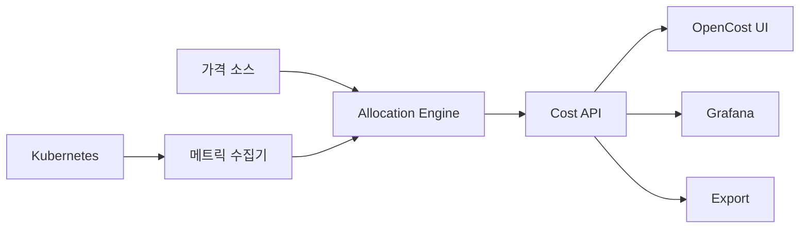
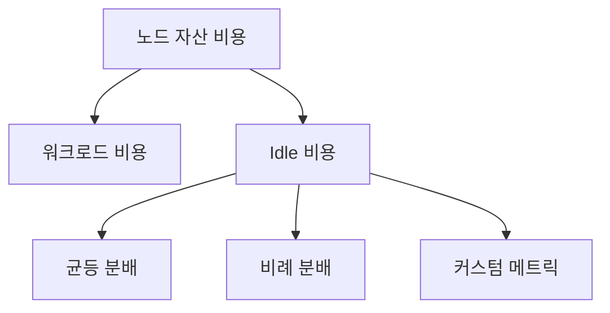
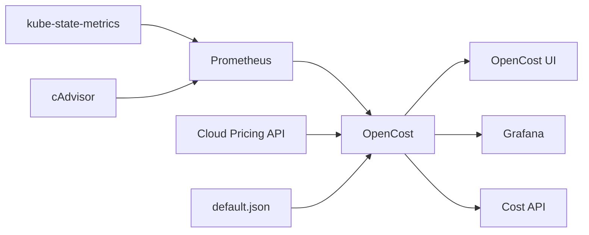

# Kubecost·OpenCost로 Kubernetes 비용 분석

> Kubernetes는 클라우드 빌링과 워크로드의 경계를 **고의적으로 흐린다**.
> 여러 파드가 한 노드를 공유하고 Service Mesh가 트래픽을 재배치하며
> HPA·VPA가 리소스를 실시간으로 바꾼다. 클라우드 빌링이 "노드 시간당 요금"
> 으로 끝날 때, 엔지니어가 알고 싶은 것은 "**어느 팀이·어느 서비스가·
> 어느 시점에 얼마를 썼는가**"다. 이 간극을 메우는 표준 오픈소스 도구가
> **OpenCost**이며 그 상용 판이 **Kubecost**다.

- **OpenCost**: CNCF Incubating(2024-10-25 승격), Apache 2.0, IBM Kubecost 기증
- **대체 관계**: Kubecost의 코어 엔진을 오픈소스화한 것이 OpenCost
- **온프레미스 적용**: `default.json` + `customPricing`으로 자사 가격 반영
- **FOCUS**: FinOps Foundation 비용 데이터 표준 지원 (플러그인 기반)

선행: [Requests·Limits](../resource-management/requests-limits.md),
[HPA](../autoscaling/hpa.md), [VPA](../autoscaling/vpa.md).
연계: [Karpenter](../autoscaling/karpenter.md),
[분산 스토리지](../storage/distributed-storage.md).

---

## 1. 왜 Kubernetes 전용 비용 도구가 필요한가

### 1.1 클라우드 빌링이 못 보는 것

클라우드 빌링은 "인스턴스 × 시간" 단위다. Kubernetes는 이 단위를
**깨뜨린다**. 한 노드 위에 10개 네임스페이스가 공존하고, 각 파드가
각자 다른 시점에 들어오고 나간다.

| 질문 | 빌링 단독으로 답할 수 있는가 |
|---|---|
| team-a 네임스페이스가 이번 달 얼마 썼는가 | ❌ |
| `checkout-service`가 `cart-service`보다 비싼가 | ❌ |
| 이번 배포로 비용이 늘었는가 | ❌ |
| HPA 스케일 아웃이 효율적인가 | ❌ |
| Idle 용량이 얼마나 되는가 | ❌ |
| 리소스 overcommit로 얼마 절약했나 | ❌ |

이 질문을 답하려면 **파드 수명주기·리소스 요청·실사용률**을
클러스터 내부 관측치와 결합해야 한다. 그게 OpenCost·Kubecost의
역할이다.

### 1.2 온프레미스에서도 의미 있는가

있다. 온프레미스는 클라우드 API가 없어 "노드 시간당 가격"이 자명하지
않지만, **회계부서·플랫폼팀이 합의한 내부 단가**(감가상각 + 전력
+ 인건비 등)를 커스텀 가격으로 주입하면 동일한 Showback·Chargeback
파이프라인이 가능하다. Kubernetes FinOps의 본질은 클라우드 청구서가
아니라 **공유 자원의 내부 재분배**다.

### 1.3 관련 카테고리와의 경계

- **측정·할당**: 여기(OpenCost·Kubecost)
- **오토스케일링** 자체: [HPA](../autoscaling/hpa.md), [VPA](../autoscaling/vpa.md), [Karpenter](../autoscaling/karpenter.md)
- **비용 메트릭 장기 저장**: `observability/` (Prometheus·Mimir·Thanos)
- **IaC 기반 비용 예산**: `iac/` (Terraform cost estimation)

---

## 2. OpenCost 개요

### 2.1 위치와 거버넌스

| 항목 | 값 |
|---|---|
| 프로젝트 | OpenCost |
| 거버넌스 | CNCF Incubating |
| CNCF 가입 | 2022-06-17 (Sandbox) |
| Incubating 승격 | 2024-10-25 |
| 라이선스 | Apache 2.0 |
| 원 개발 | 2022년 Kubecost가 코어 엔진을 CNCF Sandbox에 기증. 2024년 Kubecost가 IBM/Apptio로 인수된 이후에도 주도 유지 |
| 주요 기여 | IBM/Apptio, Randoli, AWS·Azure·GCP·Oracle·DigitalOcean |
| 2025년 릴리스 | 11개 |

### 2.2 OpenCost는 무엇을 표준화하는가

OpenCost의 핵심 가치는 "코드"가 아니라 **명세(Specification)**다.
[OpenCost Specification](https://opencost.io/docs/specification/)은
**Kubernetes 환경에서 어떤 수식으로 비용을 할당해야 하는가**를 벤더
중립으로 규정한다. Kubecost·CloudZero·Apptio·Finout 등 대부분의 상용
도구가 이 명세를 참조 구현하거나 호환한다.

### 2.3 코어 원칙



| 구성 | 역할 |
|---|---|
| 메트릭 수집기 | kubelet, cAdvisor, kube-state-metrics, Prometheus |
| 가격 소스 | 클라우드 Pricing API 또는 온프레미스 default.json |
| Allocation Engine | max(request, usage) 기반 비용 분배 |
| Cost API | REST, 다운스트림 통합 |
| Export | CSV, Parquet, FOCUS 플러그인 |

---

## 3. 비용 할당 모델

### 3.1 근본 수식

```
Total Cluster Costs
  = Resource Allocation Costs + Resource Usage Costs + Cluster Overhead Costs
  = Workload Costs + Cluster Idle Costs + Overhead Costs
```

| 항목 | 의미 |
|---|---|
| Workload Costs | 파드별로 귀속되는 비용 |
| Idle Costs | 할당되지 않은 용량 (Requests 합 < 노드 용량) |
| Overhead Costs | (a) 매니지드 K8s 컨트롤 플레인 요금, (b) self-managed는 CP 노드 자산, (c) 모든 노드 공유 DaemonSet — 세 축이 구분된다. 온프레미스는 (b)+(c)가 주축 |

### 3.2 Workload 비용 — `max(request, usage)`

Workload 단위(Pod → Deployment → Namespace → Label)로 다음을 계산한다.

| 리소스 | 수식 |
|---|---|
| CPU | `max(request, usage)` 코어시간 × CPU 단가 |
| GPU | `request` GPU시간 × GPU 단가 (공유 불가 전제) |
| Memory | `max(request, usage)` GiB시간 × RAM 단가 |
| Storage | PVC 용량 × 시간 × Storage 단가 |
| Network | Ingress/Egress 바이트 × 존간·리전간·인터넷 요율 |
| Load Balancer | LB 개수 × 시간 + 연결·바이트량 |

**왜 `max(request, usage)`인가**: 파드가 request만 걸고 실제로 안
쓰더라도 그 자원은 **다른 파드가 쓸 수 없다**. 클러스터 관점에서는
request만큼 비용이 발생한 것이다. 반대로 request 없이 burst로 usage가
폭발하면 실사용분이 더 크므로 그걸 청구한다.

### 3.3 Idle 비용과 재분배



| 전략 | 설명 | 적합 |
|---|---|---|
| 균등 분배 | 모든 테넌트에 동일 비율 | 무상 공유 자원 원칙 |
| 비례 분배 | 워크로드 비용에 비례 | 큰 테넌트가 더 부담 |
| 커스텀 메트릭 | 인원수·티켓 수 등 외부 단위 | 비즈니스 기준 |

Idle 비율이 만성적으로 30% 이상이면 **Cluster Autoscaler·Karpenter
튜닝 또는 노드 프로파일 재설계**를 먼저 검토한다. 재분배는 이 튜닝
이후의 이야기다.

### 3.4 Allocation vs Usage Cost 모델

| 모델 | 계산 | 예 |
|---|---|---|
| Allocation | `Amount × Duration × HourlyRate` | CPU 요청 단가 |
| Usage | `Amount × UnitRate` | 데이터 전송량 요금 |

두 모델을 혼용하는 이유는 클라우드 빌링 자체가 시간 단가와 사용량
단가를 섞기 때문이다.

---

## 4. 아키텍처

### 4.1 기본 배포 (Prometheus 기반)



- Prometheus: scrape interval 60s 이하 권장, 14일 보관 최소
- OpenCost: **단일 Deployment (replicas=1 전제)**. 공식적으로 leader
  election 기반 HA는 지원되지 않는다. ETL 로컬 볼륨이 분할되므로
  multi-replica 금지. 장애 시 Prometheus 저장 메트릭에서 재계산으로
  stateless 복원이 현실적 전략
- UI: 별도 Service, 읽기 전용
- Cloud Pricing API: AWS·GCP·Azure 네이티브 연동
- default.json: 클라우드 연동 실패 시 fallback 또는 온프레미스 주 가격

### 4.2 Promless 모드 (2025+)

2025년 OpenCost는 **Prometheus 의존을 선택 사항**으로 만드는 두
경로를 도입했다. 경량 클러스터·엣지 환경에서 Prometheus를 돌리지
않고도 운영할 수 있다.

| 경로 | 상태 | 설명 |
|---|---|---|
| 환경변수 기반 Prometheus-less | GA 근접 | `PROMETHEUS_SERVER_ENDPOINT` 등 변수를 비활성화하고 내부 ETL만으로 최소 집계 |
| **Collector Datasource** | **Beta** (2026-04 기준) | 자체 경량 컬렉터로 메트릭 직접 수집 |

**주의**: Helm values 키명은 OpenCost Helm chart 버전에 따라 다르다.
차트 `values.yaml` schema를 직접 확인해 적용한다. 프로덕션은
Prometheus 기반이 여전히 표준이며, Promless는 Prometheus 운영 부담이
큰 소규모 클러스터에서 우선 검토한다.

### 4.3 멀티 클러스터

OpenCost는 **단일 클러스터**가 기본 전제다. 멀티 클러스터 집계는 다음
경로를 취한다.

| 경로 | 방식 | 운영 부담 |
|---|---|---|
| Prometheus Federation | 중앙 Prom이 각 OpenCost 메트릭 수집 | 중 |
| Thanos·Mimir | 원격 저장 위에 글로벌 OpenCost 쿼리 | 중-높음 |
| Kubecost Enterprise | 내장 멀티 클러스터 UI | 없음 (유료) |

전사 단일 대시보드가 필요하면 Thanos/Mimir + OpenCost 조합이 온프레미스
기준 현실적이다. Mimir 아키텍처는 [Mimir·Thanos·Cortex·VictoriaMetrics](../../observability/metric-storage/mimir-thanos-cortex.md)
참조.

---

## 5. 온프레미스 커스텀 가격

사용자 환경이 100% 온프레미스라면 이 섹션이 가장 중요하다.

### 5.1 기본 동작과 한계

- `default.json` 초기값은 **GCP us-central1 기준**: CPU **0.031611**,
  RAM **0.004237**, GPU **0.95**, storage **0.00005479** (모두 $/단위·시)
- 온프레미스에서는 **Cloud Costs 기능(클라우드 비용 동기화)이 미지원**
- 따라서 자사 단가를 `customPricing`으로 주입해야 의미 있는 수치가 나온다

**온프레미스 필수 체크리스트** (이중집계 방지):

| 항목 | 설정 |
|---|---|
| `opencost.cloudCost.enabled` | `false` |
| `cloudIntegrationSecret` | 생성하지 않음 |
| AWS·GCP·Azure 자격 ConfigMap | 제거 |
| `customPricing.enabled` | `true` |

cloud integration이 켜진 상태로 `customPricing`을 쓰면 데이터가
**이중 집계**된다. 두 경로가 서로 다른 단가를 내므로 대시보드 수치가
편차를 보이며, 원인 추적이 어렵다.

### 5.2 단가 설계

자사 단가 = **감가상각 + 전력 + 냉각 + 네트워크 + 인건비 + 마진** 을 시간당으로 환산.

```
CPU 단가 = (노드 총비용 연감가 ÷ 노드 총 코어 ÷ 연간 시간) × 계수
RAM 단가 = (노드 총비용 연감가 ÷ 노드 총 GiB ÷ 연간 시간) × 계수
```

계수는 보통 CPU 60% : RAM 40% 비중으로 분리한다(클러스터 평균 consume 비율 반영).

**Rook-Ceph 등 레플리카 기반 스토리지 주의**: OpenCost는 PVC의 **논리
용량**(사용자 요청분) 기준으로 비용을 계산한다. 3-way replica면 물리
소비가 3배이므로 단가에 `replica_factor`를 곱해 실제 물리 감가를
회수해야 한다.

```
Rook-Ceph 3-replica storage 단가
  = (디스크 연감가 ÷ 물리 용량 GB ÷ 연간 시간) × 3

Rook-Ceph EC(k=4, m=2) 단가
  = 기본 단가 × (k+m)/k = 기본 단가 × 1.5
```

### 5.3 Helm values 예시

```yaml
opencost:
  customPricing:
    enabled: true
    configPath: /tmp/custom-config
    createConfigmap: true
    costModel:
      description: 사내 감가 기준 온프레미스 단가 (2026-04 개정)
      # $/코어시간
      CPU: 0.025
      # $/GiB시간
      RAM: 0.004
      # $/GB시간 (Rook-Ceph NVMe)
      storage: 0.00015
      # $/GPU시간 (H100 기준 사내 감가)
      GPU: 2.80
      # 스팟 없음 (온프레미스)
      spotCPU: 0.025
      spotRAM: 0.004
      # 내부망이라 network egress 0 (필요 시 분리 회계)
      internetEgress: 0.0
      zoneNetworkEgress: 0.0
      regionNetworkEgress: 0.0
```

### 5.4 노드 프로파일별 단가 분리

모든 노드가 같은 단가가 아니다. 고사양 GPU 노드는 별도 가격이어야
한다. 현재(2026-04 기준) OpenCost Helm chart의 `customPricing.costModel`
은 **전역 단가만 지원**한다. `nodeClasses` 같은 라벨 기반 오버라이드
필드는 공식 스키마에 존재하지 않는다(설정해도 무시된다).

노드별 단가 차등이 필요하면 다음 경로 중 선택한다.

| 경로 | 장단점 |
|---|---|
| **노드 풀별 별도 클러스터** | 완전 분리. 단 클러스터 운영 배수 증가 |
| **Asset API + custom pricing script** | `/assets`로 노드 자산을 가져와 라벨별 단가를 외부에서 곱해 후처리. 대시보드 자체 구축 필요 |
| **Kubecost Enterprise Node Pool Pricing** | UI에서 라벨 기반 설정. 유료 |
| **CSV 기반 custom pricing (사내 스크립트)** | default.json 동적 생성 + ConfigMap sidecar reload |

실무에서는 (a) "GPU 노드만 분리 클러스터"가 가장 흔하고 안정적이다.
소규모라면 (b) Asset API 후처리가 현실적이다.

### 5.5 가격 갱신 주기

- **분기 1회** 회계부서와 재협상 후 ConfigMap 갱신
- 변경 시 최소 1주 **과도기 주석** (대시보드에 고지)
- Git으로 관리 — 비용 값도 **인프라 변경 이력**의 일부다

---

## 6. 설치·운영

### 6.1 Helm 설치

```bash
helm repo add opencost https://opencost.github.io/opencost-helm-chart
helm repo update

kubectl create namespace opencost

helm install opencost opencost/opencost \
  --namespace opencost \
  --values values.yaml
```

### 6.2 최소 Prometheus 요건

| 설정 | 권장값 | 이유 |
|---|---|---|
| scrape_interval | ≤ 60s | 파드 수명 짧은 경우 놓침 방지 |
| retention | ≥ 15d | 월별 리포트 생성에 2주 이상 필요 |
| `kube-state-metrics` | 필수 | Pod/Deployment/Node 메타 |
| `node-exporter` | 선택 | 호스트 레벨 상관관계 |
| scrape 대상 | `opencost` Service | `/metrics` 노출 필수 |

### 6.3 인증·권한 (ESO + Vault 환경)

온프레미스 실무에서 OpenCost 주변 자격은 대체로 **Parquet Exporter의
S3 호환 오브젝트 스토리지 자격**이다(Rook-Ceph RGW, MinIO 등 장기
보관용). ExternalSecret로 관리한다.

```yaml
apiVersion: external-secrets.io/v1beta1
kind: ExternalSecret
metadata:
  name: opencost-parquet-s3
  namespace: opencost
spec:
  refreshInterval: 1h
  secretStoreRef:
    name: vault-backend
    kind: ClusterSecretStore
  target:
    name: opencost-parquet-s3
  data:
    - secretKey: AWS_ACCESS_KEY_ID
      remoteRef:
        key: opencost/parquet-exporter
        property: access_key
    - secretKey: AWS_SECRET_ACCESS_KEY
      remoteRef:
        key: opencost/parquet-exporter
        property: secret_key
    - secretKey: AWS_ENDPOINT_URL
      remoteRef:
        key: opencost/parquet-exporter
        property: endpoint
```

opencost-plugins에서 Snowflake·BigQuery 등 외부 비용 소스를 통합할
때도 동일 패턴으로 플러그인 자격을 관리한다.

### 6.4 리소스 스펙

| 클러스터 규모 | OpenCost requests | limits |
|---|---|---|
| ~100 Pods | 100m / 128Mi | 500m / 512Mi |
| ~1000 Pods | 500m / 1Gi | 2 / 4Gi |
| 10000+ Pods | 2 / 4Gi | 8 / 16Gi |

Prometheus 쪽이 병목인 경우가 훨씬 많다. OpenCost 단독 튜닝 전에
Prometheus 쿼리 성능을 먼저 점검한다.

---

## 7. API와 대시보드

### 7.1 Allocation API

OpenCost는 두 엔드포인트를 제공한다.

| 엔드포인트 | 응답 형태 | 용도 |
|---|---|---|
| `/allocation` | 단일 merged 객체 | 전체 구간 합산 조회 |
| `/allocation/compute` | step 배열 | 시계열 분석, 그래프 |

```bash
# 지난 7일 네임스페이스별 할당 비용 (step 배열)
curl "http://opencost.opencost.svc:9003/allocation/compute?\
window=7d&aggregate=namespace&accumulate=false"

# 7일 누적 단일 합계
curl "http://opencost.opencost.svc:9003/allocation?\
window=7d&aggregate=namespace"
```

주요 파라미터.

| 파라미터 | 의미 |
|---|---|
| `window` | `1h`, `1d`, `7d`, `30d` 또는 ISO 구간 |
| `aggregate` | `namespace`, `controller`, `pod`, `label:team` 등 |
| `includeIdle` | Idle 비용 결과 포함 여부 |
| `shareIdle` | Idle 비용을 워크로드에 분배할지 |
| `idleByNode` | 노드 단위로 Idle 계산 |
| `external` | 외부 자산(클라우드 DB 등) 포함 여부 |
| `accumulate` | `true`면 전체 window를 하나로 합침 |

### 7.2 CSV·Parquet·FOCUS Export

OpenCost 2.x는 **Export framework**로 타입 세이프 export를 지원한다.
FOCUS 호환 컬럼명 출력은 **HTTP 쿼리 파라미터가 아니라 별도 러너**로
제공된다.

| 경로 | 도구 | 용도 |
|---|---|---|
| Parquet 대량 export | [`opencost-parquet-exporter`](https://github.com/opencost/opencost-parquet-exporter) | S3·MinIO·Rook-Ceph object gateway로 장기 보관 |
| Custom Cost Plugin | [opencost-plugins](https://github.com/opencost/opencost-plugins) | Snowflake·BigQuery·사내 ERP 비용을 FOCUS 컬럼으로 통합 |
| CSV export | `/allocation` 응답을 `jq -r`로 가공 | 일회성 리포트 |

FOCUS(FinOps Open Cost and Usage Specification)는 FinOps Foundation의
비용 데이터 표준이다(v1.0 2024-06). OpenCost의 FOCUS 지원은 플러그인·
Export 러너 단위로 이뤄지며 `/allocation?format=focus` 같은 쿼리
파라미터는 **존재하지 않는다**. 전사 BI에 FOCUS 표준으로 공급하려면
Parquet Exporter + 플러그인 조합이 표준이다.

### 7.3 Grafana 대시보드

| ID | 이름 | 적합 |
|---|---|---|
| **22208** | OpenCost / Overview | OpenCost 공식, opencost-mixin 기반. 온프레미스 OSS 스택 권장 |
| 15714 | Kubecost Cluster Costs Overview | Grafana Cloud Managed Prom 연동 상정 |

커스텀 대시보드는 네임스페이스·팀 라벨별로 분리하고, SLO 대시보드
옆에 배치하여 **비용-성능 트레이드오프**를 한 눈에 본다.

---

## 8. 실무 패턴

### 8.1 Showback vs Chargeback

| 방식 | 설명 | 도입 난이도 |
|---|---|---|
| **Showback** | 각 팀에 비용 가시성만 제공. 실제 청구 없음 | 낮음 |
| **Chargeback** | 팀 예산에서 실제 차감 | 높음 |

대부분 **Showback 3~6개월 후 Chargeback 전환**이 정석이다. 처음부터
Chargeback은 행동 변화 전에 정치적 갈등만 낳는다.

### 8.2 라벨 스키마 표준화

비용 할당은 **라벨 위생**이 전부다.

| 라벨 | 값 예시 | 용도 |
|---|---|---|
| `team` | `checkout`·`search`·`data-platform` | 1차 집계 |
| `env` | `prod`·`staging`·`dev` | 2차 집계 |
| `product` | `order-api`·`recommendation` | 제품별 P&L |
| `cost-center` | `CC-1234` | 회계 연동 |
| `owner` | 이메일·Slack 핸들 | 알림 경로 |

**Kyverno·Pod Security Admission**으로 필수 라벨을 강제한다. 누락된
워크로드는 `__unallocated__` 버킷에 쌓이며, 경험칙으로 이 버킷이 20%
이상이면 라벨 위생 재점검이 필요하다.

### 8.3 Budget Alert (OpenCost 단독의 한계 보완)

OpenCost는 **Budget Alerts가 없다**. Prometheus + Alertmanager로
자체 구현한다. OpenCost가 노출하는 실제 메트릭은 노드 단가 + 컨테이너
할당량이며, 두 시계열의 곱으로 네임스페이스 비용을 유도한다.

| 메트릭 (주요) | 의미 |
|---|---|
| `node_cpu_hourly_cost` | 노드별 CPU 시간당 단가 |
| `node_ram_hourly_cost` | 노드별 RAM 시간당 단가 |
| `node_total_hourly_cost` | 노드 총합 |
| `pv_hourly_cost` | PV 시간당 단가 |
| `container_cpu_allocation` | 컨테이너 CPU 할당 (코어) |
| `container_memory_allocation_bytes` | 컨테이너 메모리 할당 (바이트) |
| `kubecost_load_balancer_cost` | LB 시간당 단가 |

```yaml
# PrometheusRule: 네임스페이스 월 예산 초과 경보
groups:
  - name: cost-budget
    rules:
      - alert: NamespaceBudgetExceeded
        expr: |
          sum by (namespace) (
              avg_over_time(container_cpu_allocation[1h])
            * on (instance) group_left
              avg_over_time(node_cpu_hourly_cost[1h])
            + avg_over_time(container_memory_allocation_bytes[1h]) / 1024^3
            * on (instance) group_left
              avg_over_time(node_ram_hourly_cost[1h])
          ) * 24 * 30 > 1000
        for: 1h
        labels:
          severity: warning
        annotations:
          summary: "{{ $labels.namespace }} 월 예상 비용 $1000 초과"
```

**주의**: 조인 키는 OpenCost 버전에 따라 `instance` 또는 `node`이다.
배포 전 `curl http://opencost:9003/metrics | grep node_cpu_hourly_cost`
로 실제 라벨을 확인한다. Kubecost Enterprise는 UI에서 바로 설정
가능하지만, 온프레미스 OSS 스택에서는 PrometheusRule로 대체된다.

### 8.4 CI 리포트

PR 머지 시 비용 영향 자동 코멘트. Karpenter·KEDA 등과 결합하기도
한다.

```bash
# 예: 지난 7일 단일 합계 응답에서 app별 총비용
curl -s "http://opencost:9003/allocation?window=7d&aggregate=label:app" \
  | jq '.data["checkout-api"].totalCost'

# step 배열이 필요하면 /allocation/compute + accumulate=true
curl -s "http://opencost:9003/allocation/compute?\
window=7d&aggregate=label:app&accumulate=true" \
  | jq '.data[0]["checkout-api"].totalCost'
```

---

## 9. OpenCost vs Kubecost (Enterprise) 비교

### 9.1 기능 행렬

| 기능 | OpenCost | Kubecost Free | Kubecost Enterprise |
|---|---|---|---|
| 라이선스 | Apache 2.0 | 상용 free tier | 상용 유료 |
| 가격 | 무료 (인프라만) | 무료 (코어·기능 제한) | Business $449/월~, Enterprise custom |
| 코어 수 상한 | 제한 없음 | **250 cores** | 제한 없음 |
| 단일 클러스터 할당 | ✓ | ✓ | ✓ |
| **멀티 클러스터 연결** | ✗(외부 조합) | ✓ (context switcher) | ✓ |
| **멀티 클러스터 통합 뷰** | ✗ | ✗ (전환만 가능) | ✓ |
| **Budget Alerts** | ✗(PromRule 자작) | ✗ | ✓ |
| **자동 리포트** | ✗ | ✗ | ✓ |
| **RBAC·SSO·SAML** | ✗ | ✗ | ✓ |
| **Cost Optimizer 권고** | 제한 | 제한 | ✓ |
| **메트릭 보관** | Prometheus 설정 | 15일 | 무제한 |
| **Network Cost (상세)** | 기본 | 기본 | 심화 |

### 9.2 Enterprise가 실제 가치인가

| 조직 상황 | 추천 |
|---|---|
| 단일 클러스터 · 팀 <20 · 회계 연동 단순 | OpenCost |
| 10+ 클러스터 · 복잡한 P&L · 규정 준수 | Kubecost Enterprise 검토 |
| 온프레미스만 · 외부 과금 금지 | OpenCost(자체 확장) |
| AWS/GCP 멀티 클라우드 + 온프레미스 혼합 | Kubecost Enterprise 또는 CloudZero |

Kubecost Enterprise의 가치는 UI·자동화에 있다. **코어 수치는 OpenCost와
동일**하다는 점을 기억하면 구매 협상이 쉽다.

---

## 10. 2025~2026 주요 변화

### 10.1 OpenCost 2025 (11개 릴리스) 요약

| 영역 | 내용 |
|---|---|
| **Promless** | Prometheus 없이 Collector Datasource(Beta)로 운영 |
| **MCP Server** | LLM 에이전트가 자연어로 비용 쿼리 |
| **Plugins** | 외부 비용 소스(Snowflake·BigQuery·사내 ERP) 통합 |
| **Export System** | 타입 세이프 export 프레임워크(FOCUS 포함) |
| **Diagnostics** | 진단 러너·대시보드 추가 |
| **Heartbeat** | 시스템 health timestamp 이벤트 |
| **Cloud Provider** | Oracle·DigitalOcean 기여 확대 |

### 10.2 2026 로드맵

- **KubeModel 2.0**: 데이터 모델 재설계 — 다차원 리소스·빠르게 변하는
  Pod/Node 토폴로지 처리
- **AI Costing**: LLM·학습 워크로드 비용 추적 전용 기능(토큰·GPU-hour
  등). [DRA](../ai-ml/dra.md) 운영 기능 성숙과 맞물림
- **Supply Chain Security**: SBOM·signed release 강화

### 10.3 FOCUS 표준 정착

FinOps Foundation의 **FOCUS(FinOps Open Cost and Usage Specification)**가
2024-06 v1.0 발표 후 빠르게 확산 중이다. AWS·Azure·GCP 빌링 데이터가
모두 FOCUS 변환 가능하므로, OpenCost FOCUS export를 **전사 BI의 공통
입력**으로 삼으면 벤더 락인이 줄어든다.

---

## 11. 흔한 오해와 함정

| 오해 | 사실 |
|---|---|
| "OpenCost는 온프레미스 지원이 약하다" | `customPricing`으로 충분. Cloud Costs 기능이 없을 뿐 |
| "Kubecost Free = OpenCost" | 별도 바이너리. Kubecost Free는 OpenCost 기반 + 자체 UI, 250 cores·15일 보관 등 제한 |
| "OpenCost HA는 replicas=2로 가능" | **leader election 미지원**. replicas=1 고정, Prometheus 기반 재계산이 복원 경로 |
| "비용은 실시간이다" | Prometheus scrape·OpenCost 집계 주기에 의존. 분 단위 지연 정상 |
| "request만 보면 된다" | `max(request, usage)`가 표준. burst도 잡힌다 |
| "Idle 30% 미만이 목표" | 워크로드 패턴에 따라 10~40%까지 정상. 절대치보다 추세 |
| "라벨 없이도 쓸 수 있다" | 가능하지만 쓸모없다. `__unallocated__` 비중이 전부가 된다 |
| "Kubecost Enterprise만 멀티 클러스터 가능" | Thanos/Mimir로 OpenCost도 가능. UI가 차이 |
| "cloud integration과 customPricing 동시 사용 OK" | **이중집계**. 온프레미스는 cloud integration 끄기 |
| "Rook-Ceph PV 단가는 디스크 감가 그대로" | replica·EC 비율 반영 필요. 3-replica면 × 3 |
| "Promless가 표준이다" | Collector Datasource는 Beta(2026-04). 프로덕션은 Prometheus 기반 |
| "`/allocation?format=focus`로 FOCUS export" | 존재하지 않는 파라미터. Plugin·Parquet Exporter 경유 |

---

## 12. 트러블슈팅

### 12.1 수치가 클라우드 청구서와 다르다

| 원인 | 확인 |
|---|---|
| `default.json` 기본값(GCP us-central1) 그대로 사용 | `customPricing.enabled=true` 확인 |
| cloud integration + customPricing 동시 사용(이중집계) | `cloudCost.enabled=false` 확인 |
| scrape 누락 기간 | Prometheus `up{job="opencost"}` 시계열 확인 |
| 네임스페이스 라벨 누락 | `__unallocated__` 비율 체크 |
| Idle 분배 전략 차이 | Allocation API `includeIdle`·`shareIdle`로 비교 |
| Rook-Ceph replica factor 미반영 | storage 단가 × replica_factor 확인 |
| Reserved Instance·Savings Plan | OpenCost는 on-demand 가격 기반. Kubecost Enterprise만 보정 |

### 12.2 대시보드 숫자가 튄다

- Pod 재시작 폭주 시 `max(request, usage)`의 request 쪽이 급변 — VPA `Auto` 모드 점검
- HPA min/max 범위 좁을 때 빈번한 스케일 → CPU 단가 spike
- Prometheus `remote_write` 지연으로 최신 5분 데이터 누락

### 12.3 메모리 누수 증상

- Prometheus 쿼리가 너무 넓은 window로 반복 — OpenCost ETL 저장 기간을
  줄인다. 환경변수·플래그 이름은 버전에 따라 다르므로
  `helm show values opencost/opencost | grep -i etl`로 확인 후 적용
- 수천 Pod 이름을 라벨로 보유 — 카디널리티 폭발.
  [카디널리티 관리](../../observability/metric-storage/cardinality-management.md) 참조

---

## 13. 핵심 요약

1. OpenCost = **CNCF Incubating 표준 비용 할당 엔진**, Apache 2.0.
   Kubecost의 코어가 오픈소스화된 것.
2. 비용 공식: `Total = Workload + Idle + Overhead`,
   Workload는 `max(request, usage)` 기준.
3. 온프레미스는 `default.json` + `customPricing`으로 자사 단가 주입.
   Cloud Costs 기능은 클라우드 전용.
4. OpenCost 단독은 **Budget Alert·멀티 클러스터 UI 없음**.
   PromRule + Thanos/Mimir 조합으로 보완 또는 Kubecost Enterprise 검토.
5. 2025 주요 변화: **Promless(Beta)·MCP Server·FOCUS export·Plugin
   framework**. 2026은 **KubeModel 2.0·AI Costing·공급망 보안**.
6. 성공 조건은 도구가 아니라 **라벨 위생**이다. `team`·`env`·`cost-center`
   필수 라벨을 Kyverno·Pod Security로 강제.

---

## 참고 자료

- [OpenCost 공식 사이트](https://opencost.io/) (확인: 2026-04-24)
- [OpenCost Specification](https://opencost.io/docs/specification/) (확인: 2026-04-24)
- [OpenCost On-Premises 구성](https://opencost.io/docs/configuration/on-prem/) (확인: 2026-04-24)
- [OpenCost API](https://opencost.io/docs/integrations/api/) (확인: 2026-04-24)
- [OpenCost API Examples](https://opencost.io/docs/integrations/api-examples/) (확인: 2026-04-24)
- [OpenCost Prometheus Integration](https://opencost.io/docs/integrations/prometheus/) (확인: 2026-04-24)
- [OpenCost Metrics Reference](https://opencost.io/docs/integrations/metrics/) (확인: 2026-04-24)
- [OpenCost Plugins](https://opencost.io/docs/integrations/plugins/) (확인: 2026-04-24)
- [OpenCost Parquet Exporter](https://github.com/opencost/opencost-parquet-exporter) (확인: 2026-04-24)
- [OpenCost default.json (GitHub)](https://github.com/opencost/opencost/blob/develop/configs/default.json) (확인: 2026-04-24)
- [OpenCost Helm Chart values.yaml](https://github.com/opencost/opencost-helm-chart/blob/main/charts/opencost/values.yaml) (확인: 2026-04-24)
- [OpenCost 2025 Year in Review](https://opencost.io/blog/opencost-2025-year-in-review/) (확인: 2026-04-24)
- [OpenCost 2025 회고·2026 로드맵 — CNCF](https://www.cncf.io/blog/2026/01/12/opencost-reflecting-on-2025-and-looking-ahead-to-2026/) (확인: 2026-04-24)
- [OpenCost Advances to CNCF Incubator](https://www.cncf.io/blog/2024/10/31/opencost-advances-to-the-cncf-incubator/) (확인: 2026-04-24)
- [OpenCost Incubating 프로젝트 페이지 — CNCF](https://www.cncf.io/projects/opencost/) (확인: 2026-04-24)
- [OpenCost GitHub](https://github.com/opencost/opencost) (확인: 2026-04-24)
- [Introducing OpenCost Plugins](https://opencost.io/blog/introducing-opencost-plugins/) (확인: 2026-04-24)
- [Kubecost Docs — OpenCost Product Comparison](https://docs.kubecost.com/architecture/opencost-product-comparison) (확인: 2026-04-24)
- [Unlimited Clusters Free with Kubecost](https://blog.kubecost.com/blog/unlimited-clusters-free-with-kubecost/) (확인: 2026-04-24)
- [FinOps Foundation FOCUS Spec](https://focus.finops.org/) (확인: 2026-04-24)
- [CloudZero — Kubecost vs OpenCost 2026](https://www.cloudzero.com/blog/kubecost-vs-opencost/) (확인: 2026-04-24)
- [Finout — Kubecost vs OpenCost 6 Differences](https://www.finout.io/blog/kubecost-vs-opencost) (확인: 2026-04-24)
- [LFX Insights — OpenCost](https://insights.linuxfoundation.org/project/opencost) (확인: 2026-04-24)
- [Grafana Dashboard 22208 — OpenCost Overview](https://grafana.com/grafana/dashboards/22208-opencost-overview/) (확인: 2026-04-24)
- [Grafana Dashboard 15714 — Kubecost Cluster Costs](https://grafana.com/grafana/dashboards/15714-kubecost-cluster-costs-overview/) (확인: 2026-04-24)
