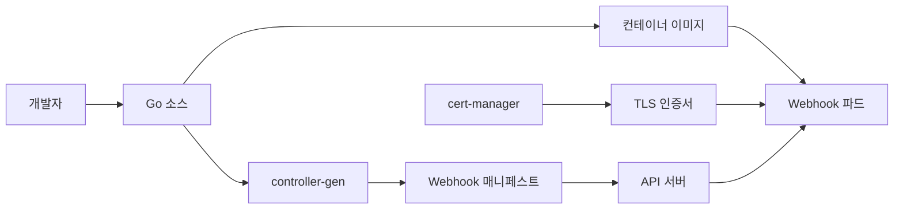

# Admission Webhook 개발

이 글은 **개발자 관점**에서 Mutating·Validating Admission Webhook을
어떻게 **구현·테스트·배포**하는지를 다룬다. Webhook 종류·내장 admission
플러그인·VAP·MAP의 **운영·보안 관점**은
[security/Admission Controllers](../security/admission-controllers.md)
에서 다룬다. 여기서는 서버 코드·인증서·CI까지 개발 파이프라인 전체를
본다.

개발자가 답해야 할 핵심 질문은 여섯 가지다.

1. **AdmissionReview 프로토콜이 어떻게 생겼나** — JSON 요청·응답·UID
2. **Mutating이 어떻게 객체를 고치나** — JSONPatch 생성
3. **프레임워크로 얼마나 줄어드나** — Kubebuilder·controller-runtime
4. **TLS 인증서는 어떻게 관리하나** — cert-manager CAInjector
5. **로컬에서 어떻게 디버깅하나** — envtest·mirrord·telepresence
6. **CI에서 무엇을 검증해야 하나** — golden 테스트·e2e

> 관련: [security/Admission Controllers](../security/admission-controllers.md)
> · [Validating Admission Policy 저작](./validating-admission-policy.md)
> · [CRD](./crd.md) · [Operator 패턴](./operator-pattern.md)

---

## 1. 개발 전체 그림



- **Kubebuilder 마커**(Go 주석) → `controller-gen`이 `Validating/
  MutatingWebhookConfiguration` 매니페스트 생성
- **Reconciler Manager**가 Webhook HTTP 서버를 함께 띄움
- **cert-manager**가 TLS 인증서 발급·회전, `CAInjector`가 매니페스트에
  CA bundle 주입

---

## 2. AdmissionReview 프로토콜

Webhook은 HTTPS POST를 받아 JSON `AdmissionReview` 객체를 파싱하고
응답한다.

```json
// 요청 (apiserver → webhook)
{
  "apiVersion": "admission.k8s.io/v1",
  "kind": "AdmissionReview",
  "request": {
    "uid": "705ab4f5-...",
    "kind": {"group": "", "version": "v1", "kind": "Pod"},
    "operation": "CREATE",
    "userInfo": {"username": "alice"},
    "object": { "...": "Pod spec" },
    "oldObject": null,
    "dryRun": false
  }
}
```

```json
// 응답 (validating)
{
  "apiVersion": "admission.k8s.io/v1",
  "kind": "AdmissionReview",
  "response": {
    "uid": "705ab4f5-...",
    "allowed": false,
    "status": {"code": 403, "message": "reason"}
  }
}
```

```json
// 응답 (mutating, JSONPatch)
{
  "apiVersion": "admission.k8s.io/v1",
  "kind": "AdmissionReview",
  "response": {
    "uid": "705ab4f5-...",
    "allowed": true,
    "patchType": "JSONPatch",
    "patch": "<base64 JSONPatch>"
  }
}
```

**UID는 요청과 응답이 반드시 같아야 한다**. 다르면 apiserver가 응답을
버린다. 디버깅에서 자주 놓치는 포인트.

---

## 3. 최소 webhook 서버 (net/http, 학습용 의사코드)

프레임워크 의존 없이 구현하면 전체 구조가 보인다. 아래는 **import·
에러 처리 생략된 학습용 의사코드**다. 실제로는 controller-runtime
사용을 권장.

```go
func handleValidate(w http.ResponseWriter, r *http.Request) {
    var review admissionv1.AdmissionReview
    _ = json.NewDecoder(r.Body).Decode(&review)

    resp := &admissionv1.AdmissionResponse{
        UID:     review.Request.UID,              // 요청과 반드시 동일
        Allowed: true,
    }
    // ... Pod를 파싱해 privileged 컨테이너 검사 ...
    if denied {
        resp.Allowed = false
        resp.Result = &metav1.Status{Code: 403, Message: "privileged 금지"}
    }

    out := admissionv1.AdmissionReview{
        TypeMeta: review.TypeMeta,
        Response: resp,
    }
    w.Header().Set("Content-Type", "application/json")
    _ = json.NewEncoder(w).Encode(out)
}

func main() {
    http.HandleFunc("/validate", handleValidate)
    _ = http.ListenAndServeTLS(":8443",
        "/tls/tls.crt", "/tls/tls.key", nil)
}
```

실전에서 직접 쓰기엔 부족하다. Object schema 검증·Patch 생성·metric·
healthz가 모두 수동이다. 대부분 controller-runtime을 쓴다.

---

## 4. Kubebuilder·controller-runtime 스캐폴딩

### 웹훅 생성 명령

```bash
kubebuilder create webhook \
  --group apps --version v1 --kind Widget \
  --defaulting --programmatic-validation
```

생성되는 것(Kubebuilder **v4** 레이아웃 기준):

- `internal/webhook/v1/widget_webhook.go` — `CustomDefaulter`·
  `CustomValidator` 구현 뼈대 (v3에서는 `api/v1/`)
- `config/webhook/` — Service·Certificate·Webhook 매니페스트 + 마커
- `Makefile` 타겟에 `make manifests`·`make generate` 반영
- `cmd/main.go`에서 `SetupWebhookWithManager()` 호출 주입

### Conversion webhook과의 공유

CRD 멀티버전을 쓰면 **같은 바이너리**에 Defaulting/Validating/Conversion
셋이 등록된다. controller-runtime이 경로(`/mutate-...`·`/validate-...`·
`/convert`)로 자동 분기하므로 서버 설계는 변함없다. Conversion webhook
자체는 [CRD 문서](./crd.md#7-conversion-webhook)에서 다룬다.

### CustomDefaulter·CustomValidator 인터페이스

controller-runtime `webhook.CustomDefaulter`·`webhook.CustomValidator`
인터페이스를 구현하면 AdmissionReview 파싱·응답 직렬화를 전혀 안
만져도 된다.

```go
// +kubebuilder:webhook:path=/mutate-apps-v1-widget,mutating=true,failurePolicy=fail,groups=apps,resources=widgets,verbs=create;update,versions=v1,name=mwidget.kb.io,sideEffects=None,admissionReviewVersions=v1

type WidgetDefaulter struct{}

func (d *WidgetDefaulter) Default(ctx context.Context, obj runtime.Object) error {
    w := obj.(*appsv1.Widget)
    if w.Spec.Replicas == nil {
        w.Spec.Replicas = ptr.To[int32](3)
    }
    return nil
}
```

```go
// +kubebuilder:webhook:path=/validate-apps-v1-widget,mutating=false,failurePolicy=fail,groups=apps,resources=widgets,verbs=create;update,versions=v1,name=vwidget.kb.io,sideEffects=None,admissionReviewVersions=v1

type WidgetValidator struct{}

func (v *WidgetValidator) ValidateCreate(ctx context.Context, obj runtime.Object) (warnings admission.Warnings, err error) {
    w := obj.(*appsv1.Widget)
    if w.Spec.Replicas != nil && *w.Spec.Replicas > 100 {
        return nil, apierrors.NewBadRequest("replicas must be <= 100")
    }
    return admission.Warnings{"widget API는 베타입니다"}, nil
}
```

- `admission.Warnings`는 HTTP `Warning` 헤더로 사용자에 전달된다.
  kubectl 출력에 바로 보임. 개발자가 정책 변경을 알리는 데 유용.
- `failurePolicy=fail`·`sideEffects=None`·`admissionReviewVersions=v1`은
  마커에서 반드시 명시한다. 누락하면 apiserver가 거절하거나 dry-run이
  끊긴다.

### Manager 통합 (WebhookServer + healthz)

Kubebuilder `main.go`는 Webhook 서버를 Manager 구성에 포함한다. 핵심
옵션과 의미를 이해해두면 운영 사고를 많이 막는다.

```go
mgr, err := ctrl.NewManager(cfg, ctrl.Options{
    Scheme: scheme,
    HealthProbeBindAddress: ":8081",
    WebhookServer: webhook.NewServer(webhook.Options{
        Port:    9443,                                          // 기본 9443
        CertDir: "/tmp/k8s-webhook-server/serving-certs",       // 기본 경로
    }),
    GracefulShutdownTimeout: ptr.To(30 * time.Second),
})
_ = mgr.AddHealthzCheck("healthz", healthz.Ping)
_ = mgr.AddReadyzCheck("readyz", mgr.GetWebhookServer().StartedChecker())
_ = (&appsv1.Widget{}).SetupWebhookWithManager(mgr)
```

운영 포인트:

- **기본 포트는 9443**. `CertDir` 기본은 `/tmp/k8s-webhook-server/
  serving-certs`. Service `targetPort`와 반드시 일치해야 한다.
- **readyz에 `StartedChecker()`를 연결**: webhook 서버가 리스닝 전에는
  readyz가 실패 → Service가 해당 Pod를 endpoint에서 뺀다. apiserver는
  이 Pod로 요청을 보내지 않는다.
- **`GracefulShutdownTimeout`**: SIGTERM 시 인플라이트 요청이 끝날
  때까지 대기. 롤링 업데이트 중 `connection refused` 예방에 필수.
- Webhook는 **모든 replica가 동시에 트래픽을 받는다**. `LeaderElection`
  은 컨트롤러에만 해당.

### Scheme 등록

Webhook이 `appsv1.Widget` 같은 CR을 decode 하려면 `main.go`의 scheme에
타입이 등록돼야 한다. Kubebuilder scaffold가 기본 추가하지만 손댈 때
실수가 잦다.

```go
utilruntime.Must(clientgoscheme.AddToScheme(scheme))
utilruntime.Must(appsv1.AddToScheme(scheme))
```

### controller-gen이 만드는 매니페스트

```yaml
# config/webhook/manifests.yaml
apiVersion: admissionregistration.k8s.io/v1
kind: ValidatingWebhookConfiguration
metadata:
  name: vwidget.kb.io
  annotations:
    cert-manager.io/inject-ca-from: platform-system/widget-webhook-cert
webhooks:
  - name: vwidget.kb.io
    clientConfig:
      service:
        name: widget-webhook
        namespace: platform-system
        path: /validate-apps-v1-widget
      caBundle: ""                  # CAInjector가 런타임에 주입
    rules: [...]
    failurePolicy: Fail
    sideEffects: None
    admissionReviewVersions: [v1]
```

---

## 5. JSONPatch 생성 (Mutating)

Mutating webhook은 `patch` 필드에 **RFC 6902 JSONPatch**를 base64로
넣는다. 직접 만들면:

```go
patch := []map[string]any{
    {"op": "add", "path": "/spec/containers/0/env", "value": []any{
        map[string]any{"name": "REGION", "value": "us-east-1"},
    }},
}
raw, _ := json.Marshal(patch)
resp.Patch = raw
pt := admissionv1.PatchTypeJSONPatch
resp.PatchType = &pt
```

Kubebuilder `CustomDefaulter`를 쓰면 **controller-runtime이 입력·출력
객체의 diff를 자동 계산**해 JSONPatch로 만들고 응답에 싣는다(apiserver
가 아니라 webhook 서버 쪽 라이브러리). 개발자가 JSONPatch를 직접
만들 일이 거의 없다.

### 주의

- Patch 경로의 `/`와 `~`는 **이스케이프 필수**(`~1`·`~0`). 라벨 키에
  슬래시가 있으면 자주 실수한다. `JSONPatch.escapeKey` 같은 헬퍼 사용.
- Mutating 웹훅은 apiserver가 **재호출(reinvocation)** 할 수 있다.
  이미 주입한 값이 있으면 중복 주입하지 않도록 **idempotent**하게.
- **status는 mutating webhook으로 바꿀 수 없다**. spec 변경 admission
  경로에서 status를 건드리려 하면 apiserver가 무시한다. status는
  컨트롤러 몫.

---

## 6. 인증서 관리

Webhook은 HTTPS 필수. Service DNS(`<name>.<namespace>.svc`)가 반드시
인증서 SAN에 포함돼야 한다.

### cert-manager + CAInjector 표준 패턴

```yaml
apiVersion: cert-manager.io/v1
kind: Certificate
metadata:
  name: widget-webhook-cert
  namespace: platform-system
spec:
  dnsNames:
    - widget-webhook.platform-system.svc
    - widget-webhook.platform-system.svc.cluster.local
  issuerRef:
    name: widget-ca-issuer
    kind: Issuer
  secretName: widget-webhook-tls
```

```yaml
apiVersion: admissionregistration.k8s.io/v1
kind: ValidatingWebhookConfiguration
metadata:
  name: vwidget.kb.io
  annotations:
    cert-manager.io/inject-ca-from: platform-system/widget-webhook-cert
```

`CAInjector`가 `cert-manager.io/inject-ca-from` annotation을 보고
매니페스트의 `caBundle`에 CA를 자동 주입한다. 인증서 회전 시에도
매니페스트가 자동 갱신되어 **사람 개입 없이 만료 대응**된다.

### 대안

- **self-signed + init 스크립트**: 소규모·단일 클러스터. 회전·회귀
  문제 많음.
- **managed certificate(EKS·GKE)**: 클라우드 CA 연동. 클러스터 이동 시
  재설정 필요.

프로덕션은 **cert-manager가 사실상 표준**이다.

---

## 7. 로컬 개발·디버깅

### envtest (controller-runtime)

경량 apiserver + etcd를 프로세스 내에 띄워 webhook 동작을 테스트한다.

```go
testEnv = &envtest.Environment{
    CRDDirectoryPaths:        []string{"config/crd/bases"},
    WebhookInstallOptions: envtest.WebhookInstallOptions{
        Paths: []string{"config/webhook"},
    },
}
cfg, err := testEnv.Start()
```

### Service 대신 URL 라우팅 (로컬 코드 클러스터 연결)

- **mirrord**(MetalBear) 또는 **telepresence**로 로컬 프로세스를
  클러스터 네트워크에 편입. 요청이 로컬 IDE의 브레이크포인트로 도달.
- 또는 `clientConfig.url`로 외부 URL을 직접 가리키기(개발 전용).
  이 경우 apiserver가 그 URL에 도달 가능해야 한다.

### 빠른 반복

- `skaffold`·`tilt`: 코드 변경 → 이미지 빌드 → kind에 재배포 자동화.
- `kind create cluster` + `make deploy`가 흔한 루프.

---

## 8. 로깅 규칙 (logr)

controller-runtime은 `logr.Logger`를 `context`에 담아 전달한다. Webhook
핸들러는 이를 꺼내 **구조화 로깅**을 한다.

```go
func (v *WidgetValidator) ValidateCreate(ctx context.Context, obj runtime.Object) (admission.Warnings, error) {
    log := logf.FromContext(ctx)
    w := obj.(*appsv1.Widget)
    log.Info("validating widget", "name", w.Name, "namespace", w.Namespace,
        "uid", string(w.UID))
    ...
}
```

관례:

- `AdmissionRequest.UID`를 **반드시** 로그 key로 남긴다. apiserver audit
  과의 상관관계 추적에 필수.
- `log.Error(err, "message", key, val)` 형식. fmt.Errorf로 감싼 에러는
  message에 덧붙이지 말고 `%w`로 wrap.
- `log.V(1).Info` 이하는 debug. 프로덕션 로그 레벨이 0(default)이면
  출력되지 않는다.

---

## 9. 테스트 전략

### 단위 테스트

`Default()`·`ValidateCreate()` 같은 함수는 **순수 함수에 가까워** 쉽게
테스트된다. fake object를 만들어 호출 + 결과 diff·에러 검증.

### Golden 테스트

AdmissionReview 요청 JSON 파일과 기대 응답 JSON 파일을 `testdata/`에
두고, 서버에 POST 해서 응답이 완전히 일치하는지 비교. 회귀 방지에
강력하다.

```bash
curl -sX POST https://webhook.svc.cluster.local/validate \
  -H 'Content-Type: application/json' \
  -d @testdata/requests/privileged-pod.json \
  | jq > out.json
diff testdata/expected/privileged-pod.json out.json
```

### envtest + controller-runtime webhook 통합

실제 apiserver 경로로 Pod CRUD를 실행해 webhook이 호출되는지·
defaulter가 값을 채웠는지 검증.

### e2e (Chainsaw·kuttl)

`kind` 클러스터에 webhook 배포 후 Chainsaw 시나리오로 "허용/거절이
의도대로 되는지" 검증. CI에 통합.

---

## 10. 배포 패턴

### Helm (단일 차트)

- Webhook Deployment·Service·`ValidatingWebhookConfiguration`·
  `Certificate`를 한 차트에.
- `helm upgrade` 시 인증서·매니페스트가 함께 갱신되어 편하다.
- **순서 문제**: 인증서가 준비되기 전에 매니페스트가 적용되면 webhook이
  일시적으로 fail. `helm.sh/hook: post-install,post-upgrade` 또는
  `cert-manager CAInjector`의 ready-probe로 해결.

### Kustomize + ArgoCD

Kubebuilder 기본 구조가 kustomize 기반. `SyncWave`로 `Certificate` →
`Service/Deployment` → `WebhookConfiguration` 순서 강제.

### Operator 번들 (OLM)

Operator SDK가 Webhook도 Bundle에 포함. OLM이 cert-manager처럼 CA
주입까지 처리한다. OpenShift 생태계에서 흔함.

---

## 11. 개발 시점에 결정할 webhook 스펙

개발자가 마커·Spec에 반드시 반영해야 하는 필드와 의미. **HA·PDB·메트릭
알람 임계·매니지드 제약** 같은 순수 운영 주제는
[security/Admission Controllers](../security/admission-controllers.md)
가 주인공.

| 항목 | 의미·권장 |
|------|----------|
| `matchConditions` CEL | 1.28 beta, **1.30 GA**. 사전 필터로 webhook 호출 감소. 변수 `object`·`oldObject`·`request`·`authorizer`, 최대 64개 |
| `namespaceSelector`·`objectSelector` | 기본적으로 자기 네임스페이스·opt-in 라벨만 대상 |
| `timeoutSeconds` | 2~5s. 서버 `context.Deadline()`과 일치시킨다 |
| `sideEffects: None` | `--dry-run=server` 호환. 외부 변경 있으면 `NoneOnDryRun`. `AdmissionRequest.DryRun==true`를 코드에서 감지해 외부 쓰기 스킵 |
| `reinvocationPolicy: IfNeeded` | 첫 라운드 이후 **다른 webhook이 객체를 수정**했을 때 재호출. 자기 patch에 의한 재호출은 아님 |
| `admissionReviewVersions: ["v1"]` | wire version 표준 |
| `failurePolicy` | 정책 성격에 맞게 `Fail`/`Ignore` (운영 기본선은 security 글 참조) |

### `DryRun` 처리

```go
func (v *WidgetValidator) ValidateCreate(ctx context.Context, obj runtime.Object) (admission.Warnings, error) {
    req, _ := admission.RequestFromContext(ctx)
    if req.DryRun != nil && *req.DryRun {
        return nil, nil     // 외부 카운터·DB에 쓰지 않는다
    }
    ...
}
```

### Warnings 전달 경로

`admission.Warnings`는 webhook 응답의 `AdmissionResponse.Warnings []
string`으로 실린다. apiserver가 이를 받아 클라이언트에 **HTTP Warning
헤더**로 전달하고, kubectl 출력에 노출된다. 비파괴적 정책 변경을
알리는 데 유용.

### Scale-out 주의

Webhook replica는 **모두 트래픽을 받는다**. 파일 기반 counter·
in-memory rate limiter 같은 **로컬 상태**는 replica 간에 일관성이
깨진다. 상태가 필요하면 외부 저장소(etcd/Redis) 또는 stateless 설계.
envtest에선 잘 안 드러나고 e2e에서 터진다.

### 흔한 개발 버그

- UID 응답 누락·불일치 → apiserver가 응답 폐기.
- Mutating에서 status 수정 시도 → apiserver가 무시. status는 컨트롤러
  몫.
- webhook이 자기 자신의 리소스(Deployment 등)를 바꾸도록 매칭 → 데드락.
  `objectSelector`로 본인 제외.
- JSONPatch 경로의 `~`·`/` 이스케이프 누락. 예: 라벨 키
  `app.kubernetes.io/name`은 `/metadata/labels/app.kubernetes.io~1name`.

---

## 12. 개발 완료 체크리스트 (Definition of Done)

- [ ] Kubebuilder v4 레이아웃(`internal/webhook/v1/`). net/http 직접
  구현은 학습용만.
- [ ] CustomDefaulter·CustomValidator 인터페이스 사용.
  `admission.Warnings`로 사용자에게 비파괴 경고 전달.
- [ ] 모든 마커에 `failurePolicy`·`sideEffects`·
  `admissionReviewVersions` 명시.
- [ ] `AdmissionRequest.DryRun` 체크로 외부 쓰기 스킵.
- [ ] cert-manager + CAInjector로 TLS 발급·주입. 매니페스트에
  `cert-manager.io/inject-ca-from` annotation 명시.
- [ ] `namespaceSelector`로 `kube-system` 제외, `objectSelector`로 본인
  제외.
- [ ] Mutating은 **idempotent**. 이미 주입된 값 재검사.
- [ ] `matchConditions` CEL로 1차 필터링 → webhook 호출 감소.
- [ ] **Golden 테스트**로 AdmissionReview 응답 회귀 방지.
- [ ] envtest로 defaulter·validator 통합 테스트, e2e는 Chainsaw + kind.
- [ ] HA: replicas ≥ 2, PDB `minAvailable: 1`, topologySpread.
- [ ] `controller_runtime_webhook_requests_total{code}` +
  `apiserver_admission_webhook_admission_duration_seconds` 대시보드.
- [ ] 배포 파이프라인에 SyncWave·hook으로 "cert → service → webhook
  config" 순서 보장.

---

## 참고 자료

- Kubernetes 공식 — Dynamic Admission Control:
  https://kubernetes.io/docs/reference/access-authn-authz/extensible-admission-controllers/
- Kubebuilder Book — Admission Webhook:
  https://book.kubebuilder.io/reference/admission-webhook
- Kubebuilder Book — Webhook Markers:
  https://book.kubebuilder.io/reference/markers/webhook
- controller-runtime Webhook GoDoc:
  https://pkg.go.dev/sigs.k8s.io/controller-runtime/pkg/webhook
- Operator SDK — Admission Webhooks:
  https://sdk.operatorframework.io/docs/building-operators/golang/webhook/
- cert-manager — CAInjector:
  https://cert-manager.io/docs/concepts/ca-injector/
- Slack Engineering — Simple Kubernetes Webhook:
  https://slack.engineering/simple-kubernetes-webhook/
- Chainsaw (e2e):
  https://github.com/kyverno/chainsaw
- mirrord (로컬 개발):
  https://mirrord.dev/
- telepresence (로컬 개발):
  https://www.telepresence.io/

확인 날짜: 2026-04-24
