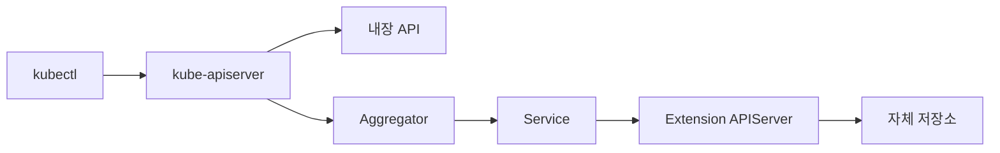
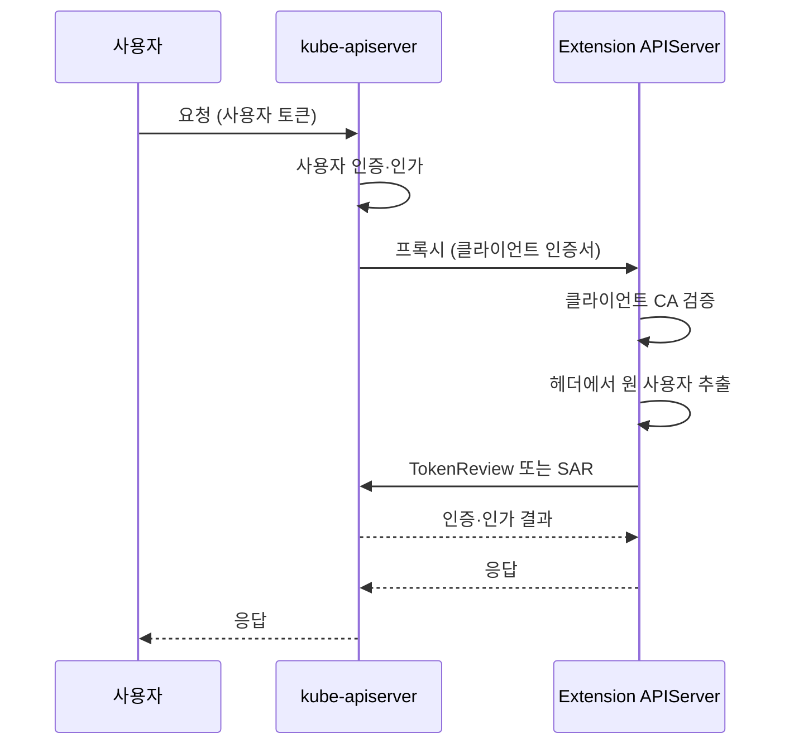

# API Aggregation Layer

API Aggregation Layer(AA)는 **자체 API 서버를 클러스터 API 트리에 편입**
시키는 확장점이다. kube-apiserver가 특정 API 그룹·버전 경로를 외부
extension apiserver로 프록시하여, 클라이언트에게는 동일한 kube-apiserver
엔드포인트로 보이게 한다. [CRD](./crd.md)가 스키마만 선언하고 컨트롤러
가 동작을 만드는 방식이라면, Aggregation은 **요청·저장·응답 전체를
직접 구현**한다.

대표 사례는 `metrics.k8s.io`·`custom.metrics.k8s.io`·`external.metrics.
k8s.io`(metrics-server 계열), `packages.operators.coreos.com`(OLM),
Cozystack·vCluster 같은 플랫폼이다. HPA가 메트릭을 읽을 때 내부적으로
이 경로를 탄다.

운영 관점 핵심 질문은 여섯 가지다.

1. **CRD 대신 AA를 써야 할 때는 언제인가** — 저장소·프로토콜·성능
2. **kube-apiserver가 extension apiserver를 어떻게 인증하나** —
   requestheader 체인과 별도 CA
3. **extension apiserver가 원 사용자를 어떻게 확인하나** —
   `extension-apiserver-authentication` ConfigMap, `TokenReview`·
   `SubjectAccessReview`
4. **APIService가 `Available=False`가 되면 어떻게 진단하나** —
   FailedDiscoveryCheck, MissingEndpoints
5. **HA·라우팅은 어떻게 보장하나** — `--enable-aggregator-routing`,
   PDB, replicas
6. **왜 대부분의 사람은 CRD로 충분한가** — 운영비용·장애 전이

> 관련: [CRD](./crd.md)
> · [Operator 패턴](./operator-pattern.md)
> · [Admission Webhook](./admission-controllers.md)
> · [Authentication](../security/authentication.md)
> · [RBAC](../security/rbac.md)

---

## 1. 아키텍처 개요



- **Aggregator**는 kube-apiserver 내부 모듈. `APIService` 리소스가
  선언한 API 그룹·버전을 보고 요청을 외부 서비스로 프록시한다.
- **Extension apiserver**는 별도 Pod로 실행되며, 자체 저장소·로직·
  프로토콜을 가진다. etcd를 쓸 수도, 외부 DB를 쓸 수도, 완전히
  메모리에서 계산할 수도 있다(metrics-server가 대표).
- 클라이언트는 차이를 느끼지 못한다. `kubectl get nodes --raw
  /apis/metrics.k8s.io/v1beta1/nodes`처럼 같은 kubeconfig·같은 포트로
  호출한다.

### CRD와의 근본 차이

| 측면 | CRD | Aggregation |
|------|-----|-------------|
| 저장소 | etcd(kube-apiserver 공유) | 자유(etcd·외부 DB·메모리) |
| 요청 처리 | kube-apiserver 내 | 외부 Pod에서 직접 |
| 네트워크 홉 | 없음 | 있음(apiserver ↔ extension) |
| 스키마 | OpenAPI + CEL | 자유(protobuf·바이너리·스트리밍) |
| 서브리소스 | `/status`·`/scale` 정도 | 자유(`/exec`·`/proxy`·`/logs` 등) |
| 운영 비용 | 낮음(apiserver가 전부) | 높음(Pod·서비스·인증서 별도) |
| 장애 전이 | 없음 | **extension 장애 → API 그룹 전체 차단** |

---

## 2. 언제 AA를 선택하는가

실전에서 AA가 **유일한 해답**인 경우는 좁다.

### AA가 필요한 경우

- **저장소가 etcd가 아니다** — metrics-server처럼 계산된 메트릭을
  휘발성 캐시로만 보관, 또는 SQL·시계열 DB에 저장해야 하는 경우.
- **요청 처리에 사용자 정의 로직이 지배적이다** — `/proxy`로 외부 API
  를 그대로 노출, `/exec`처럼 스트리밍 프로토콜, 외부 시스템 조회 후
  합성 응답.
- **CRD의 구조적 스키마 제약으로 표현 불가** — union 타입, 동적 필드
  구조, 대용량 바이너리 페이로드.
- **성능·리소스 사용이 극한** — 수백만 객체, 초당 수천 RPS. etcd에
  부담을 주지 않는 전용 저장소 필요.

### CRD로 충분한 경우

- 선언적 스펙 + reconciliation 루프 — 90% 이상의 운영 확장이 여기.
- 필드 간 관계·불변성 검증 — CEL로 해결.
- status·scale 서브리소스로 HPA·`kubectl scale` 연동 — CRD 기본 지원.

### 판단 기준

> **"자체 저장소·자체 프로토콜·자체 수명주기 중 하나 이상이
> 꼭 필요한가?"** 아니면 CRD를 쓴다.

AA는 운영 부담과 장애 반경이 한 단계 크다. 인증서 회전, HA, 네트워크
경로, RBAC, 디스커버리 타임아웃 — 전부 직접 책임진다.

---

## 3. APIService 리소스

```yaml
apiVersion: apiregistration.k8s.io/v1
kind: APIService
metadata:
  name: v1beta1.metrics.k8s.io     # <version>.<group> 고정 형식
spec:
  group: metrics.k8s.io
  version: v1beta1
  groupPriorityMinimum: 100        # 같은 group 내 우선순위
  versionPriority: 100             # 같은 group 내 version 우선순위
  service:
    name: metrics-server
    namespace: kube-system
    port: 443
  caBundle: <base64 CA>
  insecureSkipTLSVerify: false
```

### 우선순위 필드

| 필드 | 의미 | 권장 값 |
|------|------|---------|
| `groupPriorityMinimum` | 디스커버리 정렬·충돌 해소용 그룹 우선순위 | 1000~2000(서드파티), >10000(내부 인프라) |
| `versionPriority` | 같은 그룹 내 버전 우선순위. 높을수록 preferred | 15~100 |

kubectl이 리소스 이름 충돌(`pods`가 둘)을 만났을 때 높은
`groupPriorityMinimum`을 우선한다. 서드파티 API는 **내장 API와 충돌
하지 않는 네이밍**이 첫 번째 원칙이고, 우선순위는 그다음이다.

### `service` vs `url` 외부 참조

`spec.service` 대신 `spec.url`로 클러스터 외부를 가리킬 수도 있으나
**프로덕션에서 권장하지 않는다**. 네트워크 경로·인증서·가용성·
레이턴시를 모두 직접 보장해야 하고, discovery 5초 예산을 넘기면
전 클러스터 API discovery가 타임아웃한다.

### Local APIService

`spec.service: null`이면 **kube-apiserver 자신이 처리**한다. 모든
내장 API(core·apps·batch 등)가 이렇게 등록되어 있다. `kubectl get
apiservice`로 확인해 보면 내장 그룹이 전부 `Local: true`로 보인다.

---

## 4. 인증·인가 흐름

AA에서 가장 흔한 사고는 **인증 체인 오설정**이다. 흐름을 정확히
이해해야 디버깅이 가능하다.



### 4-1. kube-apiserver → extension 인증

kube-apiserver가 extension으로 프록시할 때 **자신을 클라이언트 인증서
로 식별**한다. 관련 플래그:

```bash
kube-apiserver \
  --proxy-client-cert-file=/etc/kubernetes/front-proxy-client.crt \
  --proxy-client-key-file=/etc/kubernetes/front-proxy-client.key \
  --requestheader-client-ca-file=/etc/kubernetes/front-proxy-ca.crt \
  --requestheader-allowed-names=front-proxy-client \
  --requestheader-username-headers=X-Remote-User \
  --requestheader-group-headers=X-Remote-Group \
  --requestheader-extra-headers-prefix=X-Remote-Extra-
```

프록시 요청에는 **원 사용자의 토큰이 아니라** 다음 정보가 실린다.

- 클라이언트 인증서(kube-apiserver 본인)
- `X-Remote-User: <원 사용자>`
- `X-Remote-Group: <원 그룹들>`
- `X-Remote-Extra-*: <추가 속성>`

### 4-2. front-proxy CA를 별도로 두는 이유

> **절대 kubernetes CA를 front-proxy CA로 재사용하지 말 것.**

그렇게 하면 아무 kubelet 인증서를 가진 주체가 **extension apiserver에
"원 사용자" 헤더를 위조**해 클러스터 관리자로 가장할 수 있다. kubeadm
은 기본적으로 `/etc/kubernetes/pki/front-proxy-ca.crt`를 따로 만든다.
수동 구축 시 가장 흔히 틀리는 지점.

### 4-3. extension apiserver의 요청 검증

extension은 `kube-system/extension-apiserver-authentication` ConfigMap
을 읽어 검증 기준을 얻는다.

```yaml
apiVersion: v1
kind: ConfigMap
metadata:
  name: extension-apiserver-authentication
  namespace: kube-system
data:
  requestheader-client-ca-file: |
    -----BEGIN CERTIFICATE-----
    ...
  requestheader-allowed-names: '["front-proxy-client"]'
  requestheader-username-headers: '["X-Remote-User"]'
  requestheader-group-headers: '["X-Remote-Group"]'
  requestheader-extra-headers-prefix: '["X-Remote-Extra-"]'
  client-ca-file: ...            # 일반 클라이언트 인증 CA
```

검증 순서:

1. 클라이언트 인증서가 `requestheader-client-ca-file`의 CA로 서명
   되었는가.
2. 인증서 CN이 `requestheader-allowed-names`에 있는가.
3. 검증 성공 시에만 `X-Remote-*` 헤더의 사용자 정보를 신뢰한다.

ConfigMap을 못 읽으면 extension은 **"헤더 검증 비활성"**이거나 시작
실패한다. 아래 RBAC이 필수인 이유.

### 4-4. extension apiserver의 RBAC 요구사항

```yaml
# 1) ConfigMap 읽기 권한
apiVersion: rbac.authorization.k8s.io/v1
kind: RoleBinding
metadata:
  name: my-ext-apiserver-auth-reader
  namespace: kube-system
roleRef:
  apiGroup: rbac.authorization.k8s.io
  kind: Role
  name: extension-apiserver-authentication-reader   # 빌트인
subjects:
  - kind: ServiceAccount
    name: my-ext-apiserver
    namespace: platform-system
---
# 2) TokenReview·SubjectAccessReview 위임 권한
apiVersion: rbac.authorization.k8s.io/v1
kind: ClusterRoleBinding
metadata:
  name: my-ext-apiserver-auth-delegator
roleRef:
  apiGroup: rbac.authorization.k8s.io
  kind: ClusterRole
  name: system:auth-delegator                        # 빌트인
subjects:
  - kind: ServiceAccount
    name: my-ext-apiserver
    namespace: platform-system
```

`system:auth-delegator`는 extension이 **원 사용자의 다른 리소스 접근
권한**을 kube-apiserver에 물어볼 때 필요하다. 예: extension API가
특정 네임스페이스 Pod의 메트릭을 돌려줄 때 "호출자가 그 Pod을
`get pods/metrics` 할 권한이 있나?"를 `SubjectAccessReview`로 확인.

### 4-5. front-proxy CA 오설정 복구

이미 kubernetes CA를 front-proxy CA로 재사용한 클러스터는 보안 사고
직전 상태다. 복구 절차는 신규 설치보다 복잡하고 **다운타임**이
동반된다.

> **두 CA를 혼동하지 말 것.** AA에는 독립적인 두 PKI가 있다.
> (a) **front-proxy CA** — kube-apiserver가 extension을 호출할 때
> 자신을 증명하는 클라이언트 인증서 체인. (b) **APIService
> `caBundle`** — extension 서빙 인증서의 CA. 복구 대상은 (a)이며,
> (b)는 별도 PKI이므로 손대지 않는다.

1. 신규 front-proxy CA·클라이언트 인증서 생성(`/etc/kubernetes/pki/
   front-proxy-ca.crt`·`front-proxy-client.{crt,key}`).
2. 컨트롤 플레인 노드 전체에 동일 파일 배포, kube-apiserver 정적
   Pod manifest의 `--requestheader-client-ca-file`·`--proxy-client-*`
   갱신.
3. **한 노드씩 순차 재시작** — 일시적으로 노드 간 front-proxy CA가
   다른 시간이 있으면 extension으로의 프록시가 일부 실패.
4. `extension-apiserver-authentication` ConfigMap이 새 CA로 갱신
   되었는지 확인(apiserver 자동 생성).
5. 등록된 모든 APIService의 `caBundle`이 extension 서빙 인증서
   체인과 일치하는지 재확인. extension 서빙 인증서를 새 CA로 발급한
   것이 아니라 **extension의 서빙 인증서는 그대로**, kube-apiserver가
   extension을 호출할 때 쓰는 **클라이언트 인증서만** 바뀌었음에
   주의.
6. extension Pod 순차 롤아웃. 새 `extension-apiserver-authentication`
   ConfigMap을 읽어 새 front-proxy CA로 헤더 검증하도록 재시작.

노드 교차 시점에 `FailedDiscoveryCheck`·`401 Unauthorized`가 최대
수 분간 집계된다. 메인터넌스 창 확보 권장.

---

## 5. 가용성과 라우팅

### APIService.status.conditions

```bash
kubectl get apiservice v1beta1.metrics.k8s.io -o jsonpath='{.status.conditions}' | jq
```

| Condition | 의미 | 흔한 원인 |
|-----------|------|----------|
| `Available=True` | 프록시 연결·discovery OK | 정상 |
| `FailedDiscoveryCheck` | kube-apiserver가 `/apis/<group>/<version>` 호출 실패 | 서비스 Endpoint 없음, TLS 오류, 5초 타임아웃 초과 |
| `MissingEndpoints` | 서비스 뒤에 Ready Pod 0 | Pod crash, readinessProbe 실패 |
| `ServiceNotFound` | `spec.service` 가리키는 서비스 없음 | 네임스페이스·이름 오타 |

### 5-1. Discovery 5초 예산

kube-apiserver는 클러스터 전체 discovery(`/apis`)를 구성할 때 등록된
**모든 APIService를 직렬로** 점검하지 않고 병렬로 호출한다. 그러나
각 APIService에 **5초 라운드트립 예산**이 있다. 느린 extension 하나가
`kubectl api-resources`·`kubectl get`·헬름 설치 등 모든 디스커버리
경로를 느리게 만든다.

### 5-2. `--enable-aggregator-routing`

기본 동작: kube-apiserver는 `spec.service`를 **ClusterIP**로 해석하여
호출한다. 즉 kube-proxy(iptables/IPVS)를 거친다.

문제:
- kube-proxy가 미기동인 컨트롤 플레인 노드에서 APIService가
  `Available=False`로 굳어진다(커넥션 캐시로 restart 전까지 복구
  안 됨). 실제 리포트된 버그.
- 대규모 클러스터에서 kube-proxy 경로가 추가 레이턴시 원인이 된다.

해법:

```bash
kube-apiserver --enable-aggregator-routing=true
```

- kube-apiserver가 **Service → EndpointSlice의 Pod IP를 직접 선택**
  해 호출(클라이언트 측 로드 밸런싱).
- 여러 replica extension에 **round-robin 부하 분산**이 실질적으로
  동작.
- kube-proxy 의존 제거 → 컨트롤 플레인 부팅 순서 문제 회피.

metrics-server·SIGs 대부분의 extension apiserver 문서가 이 플래그를
**HA 전제로 요구**한다.

### 5-3. Aggregator 캐싱과 복구 지연

kube-apiserver 내부의 `AvailableConditionController`가 각 APIService
의 헬스를 주기적으로 프로빙(기본 30초 간격)하여 `Available` condition
을 갱신한다. 따라서 extension이 복구되어도 **최대 30초 지연** 후에야
`Available=True`가 된다.

추가로 kube-apiserver의 HTTP transport 캐시(`tlsCache`)는 APIService
별로 재사용된다. Issue #135883·#74280에서 보듯, 초기 프로빙이 잘못된
엔드포인트로 묶이면 **kube-apiserver 재시작 전까지 같은 소켓을 재사용**
한다. `--enable-aggregator-routing=true`로 EndpointSlice 경로를 쓰면
대부분 해소되지만, **EndpointSlice watch 반영 자체도 몇 초 지연**된다.
빠른 failover를 가정하지 말고 PDB·readiness로 "멀쩡한 replica가
항상 하나 이상"이 되도록 설계해야 한다.

### 5-4. API Priority & Fairness 재귀 호출

extension apiserver는 인증·인가 위임을 위해 kube-apiserver로
`TokenReview`·`SubjectAccessReview`를 **역방향 호출**한다. 이 서브요청
은 kube-apiserver의 APF 큐를 다시 통과한다. 부하가 높으면 **priority
inversion**이 발생한다.

- 사용자 요청 → kube-apiserver APF 큐 → extension → `SAR` → kube-apiserver APF 큐
- 같은 PriorityLevel에 물려 있으면 두 번째 큐 대기로 **원 요청이
  timeout**. 대규모 클러스터의 `metrics.k8s.io` 전면 지연이 이 유형.

해법:

- extension SA를 별도 `FlowSchema`에 매핑, `system`·`exempt` 수준의
  PriorityLevelConfiguration으로 라우팅.
- 예: `system:serviceaccount:kube-system:metrics-server` 를
  `system-leader-election` 같은 별도 레벨로 분리.
- `apiserver_flowcontrol_rejected_requests_total`·
  `apiserver_flowcontrol_current_inqueue_requests`를 PriorityLevel
  라벨로 브레이크다운해 재귀 호출 병목을 관측.

```yaml
apiVersion: flowcontrol.apiserver.k8s.io/v1
kind: FlowSchema
metadata:
  name: extension-apiserver-auth
spec:
  priorityLevelConfiguration:
    name: system
  matchingPrecedence: 500
  rules:
    - subjects:
        - kind: ServiceAccount
          serviceAccount:
            name: my-ext-apiserver
            namespace: platform-system
      resourceRules:
        - verbs: [create]
          apiGroups: [authentication.k8s.io, authorization.k8s.io]
          resources: [tokenreviews, subjectaccessreviews]
          clusterScope: true
```

### 5-5. HA 요구사항

extension apiserver가 죽으면 **해당 API 그룹 전체 요청이 차단**된다.
대부분의 운영 사고가 여기서 발생.

| 항목 | 권장 |
|------|------|
| replicas | ≥ 2, 가능하면 3 |
| anti-affinity | 노드·존 분산 |
| PDB | `minAvailable: 1` (드레인 중 전면 중단 방지) |
| readiness probe | 저장소·의존성까지 검증 |
| graceful shutdown | `terminationGracePeriodSeconds ≥ 30s`, in-flight drain |
| 인증서 회전 | cert-manager `Certificate` + 자동 리로드, `caBundle` 자동 주입 |
| `--enable-aggregator-routing` | **반드시 on** |

cert-manager 사용 시 APIService의 `caBundle`은 다음 어노테이션으로
자동 주입된다. `CustomResourceDefinition.conversion.webhook`·
`MutatingWebhookConfiguration`도 동일.

```yaml
apiVersion: apiregistration.k8s.io/v1
kind: APIService
metadata:
  name: v1.custom.example.com
  annotations:
    cert-manager.io/inject-ca-from: platform-system/ext-apiserver-tls
spec:
  service: { name: ext-apiserver, namespace: platform-system }
  group: custom.example.com
  version: v1
  groupPriorityMinimum: 1000
  versionPriority: 15
  # caBundle: <cert-manager CAInjector가 채움>
```

CA만 따로 들어오는 `inject-ca-from-secret`도 가능(PKI가 외부 관리인
경우). 이 어노테이션 없이 `caBundle`을 GitOps에 직접 박아두면, CA
만료 시 **수동 동기화가 반드시 누락**된다.

---

## 6. Extension APIServer 구현 요점

Go로 작성한다면 `k8s.io/apiserver`·`k8s.io/sample-apiserver`가 표준
출발점이다. 직접 RPC를 만드는 대신 아래 빌딩블록을 조립한다.

### 6-1. 핵심 라이브러리

| 라이브러리 | 역할 |
|-----------|------|
| `k8s.io/apiserver` | 요청 파이프라인(auth·admission·storage) 스켈레톤 |
| `k8s.io/sample-apiserver` | 최소 동작 예제. 구조 참고용 |
| `k8s.io/apimachinery` | OpenAPI·타입 변환 |
| `k8s.io/kube-aggregator` | Aggregator 측 코드(참고용) |
| `apiserver-runtime`·`apiserver-builder-alpha` | 스캐폴드·주석 기반 생성(실험적) |

### 6-2. Storage 선택

실전 기준선: 단일 kube-apiserver가 권장 구성에서 ~3k QPS, etcd 단일
샤드는 8GB 미만을 권고한다. **"수백만 객체·초당 수천 RPS"**라는
말은 이 수치와 비교해야 한다.

- CR 개수가 수만 이하, QPS가 수백 이하면 CRD + etcd로 충분.
- 객체 수가 etcd 샤드 경고선에 근접하거나, list·watch 부하가 공유
  apiserver에 번지면 AA + 전용 저장소 고려.
- 계산량이 본질(메트릭 집계·트래픽 합성 응답)이면 저장소를 고민하기
  전에 **애초에 etcd에 저장할 대상이 아닌지** 되묻는다.


| 저장소 | 예시 | 특징 |
|--------|------|------|
| In-memory | metrics-server | 휘발성, 수평 확장 어려움 |
| etcd(공유) | 권장 안 함 | kube-apiserver etcd 부담, 경계 침식 |
| etcd(전용) | OLM 일부, vCluster | 격리 우수, 관리 비용 |
| 외부 DB (Postgres·MySQL) | 플랫폼 전용 | 트랜잭션·쿼리 자유 |
| 외부 API 프록시 | 클라우드 자원 노출 | 상태 없음, backend latency 종속 |

**공유 etcd는 강하게 비권장**. 네임스페이스 경계·RBAC 경계를 깨고
apiserver 복구 절차가 복잡해진다. 격리가 필요하면 전용 etcd.

#### 실전 사례에서 무엇을 선택했나

| 프로젝트 | API 그룹 | 저장소 | 왜 AA를 골랐나 | 감수한 trade-off |
|----------|---------|-------|---------------|-----------------|
| metrics-server | `metrics.k8s.io` | in-memory 원형 버퍼 | kubelet `/metrics/resource` 집계를 매초 갱신. CRD에 넣으면 etcd 트래픽 폭발 | 재시작 시 데이터 증발, 수평 확장 제한 |
| Prometheus Adapter | `custom.metrics.k8s.io`·`external.metrics.k8s.io` | 무상태(Prometheus 쿼리 프록시) | HPA가 임의 쿼리를 실시간 읽어야 함 | 백엔드 Prometheus 장애 = API 그룹 정지 |
| OLM `packageserver` | `packages.operators.coreos.com` | in-memory(CatalogSource 조인) | 여러 CR을 한 API 응답으로 합성 | packageserver 복제 동기화 복잡도 |
| vCluster | 가상 apiserver의 전체 API(host에 투과 노출 시) | 전용 SQLite 또는 etcd | 네임스페이스 하나를 완전한 "가상 클러스터"로 노출 | 리소스 사용량, 운영 도구 학습 비용 |
| Cozystack | 동적으로 생성되는 그룹 | 외부 컨트롤러 | 테넌트별 API 동적 등록 | APIService·RBAC·discovery 모두 동적 관리 |

공통 패턴 — **etcd 폭발을 피하거나, 요청 시 실시간 합성이 필요하거나,
완전한 가상 apiserver가 필요한 경우**. 이 세 카테고리 밖이면 CRD가
거의 항상 더 싸다.

### 6-3. 디스커버리·OpenAPI 게시

kube-apiserver는 extension에 다음 엔드포인트를 요구한다.

| 경로 | 목적 | 버전·상태 |
|------|------|----------|
| `/apis/<group>/<version>` | 레거시 리소스 목록 discovery(v1) | 5초 예산 |
| `/apis` 의 `apidiscovery.k8s.io/v2` 집계 | **Aggregated Discovery** | 1.30 GA, 구현 **필수** |
| `/openapi/v2` | OpenAPI v2 스키마 | 레거시, 여전히 소비자 있음 |
| `/openapi/v3` | OpenAPI v3 스키마 | 1.27 기본, SSA·`kubectl explain --recursive` 품질 좌우 |
| `/healthz`·`/readyz`·`/livez` | 헬스 체크 | — |
| `/metrics` | Prometheus 노출 | — |

#### Aggregated Discovery v2 구현 의무

Aggregated Discovery(KEP-3352)는 1.30에서 GA, **1.33에서 v2beta1이
제거**됐다. extension이 v2 엔드포인트를 구현하지 않으면:

- `kubectl api-resources` 호출 시 kube-apiserver가 레거시 경로로
  fallback. 디스커버리 레이턴시가 리소스 종류 수에 선형으로 증가.
- **네임스페이스 삭제가 `Terminating`에서 영구 정지**하는 사고가
  관측된다(Issue #119662). 네임스페이스 컨트롤러가 garbage collection
  대상 리소스를 전수 조회하는데, 느린 레거시 discovery가 타임아웃으로
  이어져 finalizer가 풀리지 않는다.

`k8s.io/apiserver`의 `genericapiserver` 프레임워크는 v2 집계를 기본
제공한다. 직접 구현하면 `apidiscovery.k8s.io/v2.APIGroupDiscoveryList`
응답을 반드시 만들어야 한다.

#### OpenAPI v3 미게시의 여파

- `kubectl describe`·`kubectl explain` 필드 깊이가 얕아짐
- Server-Side Apply의 `x-kubernetes-*` 메타데이터 소실, 필드 소유권
  충돌 증가
- VSCode YAML LSP·Terraform `kubernetes_manifest`가 타입을 못 읽어
  오류 조기 탐지 실패

`genericapiserver`가 자동 생성하므로 직접 끄지만 않으면 된다. 구현
시에도 `OpenAPIV3Config`를 비활성화하지 말 것.

#### Warm-up readiness

시작 직후 extension은 다음을 준비해야 본격 트래픽을 받을 수 있다.

| 항목 | 의미 |
|------|------|
| Discovery·OpenAPI 스펙 빌드 | v1·v2·OpenAPI v2/v3 응답 계산 캐시 |
| `extension-apiserver-authentication` ConfigMap load | 헤더 검증 CA·allowed-names 초기화 |
| Storage cache prime | etcd·외부 DB 초기 list/watch 동기화 |
| Admission·conversion 초기화 | 내부 webhook·CEL 컴파일 |

이 단계가 끝나기 전에 kube-apiserver가 요청을 보내면 504·502가 사용자
에게 그대로 노출된다. readinessProbe를 **위 모든 단계 완료 이후에만
200**을 반환하도록 구성한다.

`generic-apiserver` 프레임워크가 전부 제공하지만, 직접 구현 시
discovery 응답 크기와 속도에 주의. 리소스 수십 개면 자동 생성 응답이
수 MB가 될 수 있다.

### 6-4. Admission·Validation 직접 구현

CRD와 달리 extension은 **admission 체인을 스스로** 돌린다. 내장
admission(NamespaceLifecycle·MutatingAdmissionWebhook 등)은 앞단
kube-apiserver에서 이미 돌지 않는다. 필요한 검증·기본값은 extension
내부에서 구현.

---

## 7. 관측과 진단

### 7-1. APIService 메트릭

kube-apiserver 측:

| 메트릭 | 의미 | 알람 기준 |
|--------|------|----------|
| `aggregator_unavailable_apiservice{name}` | APIService별 unavailable 게이지 | >0 5분 지속 |
| `aggregator_unavailable_apiservice_total{name,reason}` | 누적 장애 카운터, `reason` 라벨 | `rate()`로 증가율 감시 |
| `apiserver_request_duration_seconds{group=<ext>}` | extension 경유 요청 지연 | p99 > 1s |
| `apiserver_request_total{group=<ext>,code=~"5.."}` | 5xx 비율 | > 1% |
| `apiserver_flowcontrol_rejected_requests_total{priority_level}` | APF 거절 — extension SA 레벨 주목 | > 0 5분 지속 |
| `apiserver_flowcontrol_current_inqueue_requests{priority_level}` | APF 큐 대기 — 재귀 호출 병목 징후 | 지속 상승 |

> **주의**: `aggregator_unavailable_apiservice_total`은 **counter
> semantics**다. 반드시 `rate()` 또는 `increase()`로 알람 작성. raw
> 값을 threshold로 쓰면 과거 `gauge` 버그 잔재(OpenShift 구 버전
> 등)에서 stale 값이 쌓여 무한 경보를 낸다.

kube-prometheus-stack은 `KubeAggregatedAPIErrors`·
`KubeAggregatedAPIDown` 알람을 기본 번들로 제공한다. 메트릭이 끊기거나
`Available=False`가 되면 발화.

### 7-2. Extension 측 관측과 감사 로그

- **자체 `/metrics`** 노출. `apiserver_request_*` 동명 메트릭을
  내보내 상위 apiserver와 비교 가능.
- **stale 캐시 여부** — in-memory 저장소는 재시작 시 데이터 증발.
  warm-up 동안 readiness 미반환으로 트래픽 우회.

#### 감사 로그의 상관관계

kube-apiserver 감사 로그는 extension 경유 요청에 대해 **프록시 호출
진입까지만** 기록한다. `requestURI`·`X-Remote-User`·`verb` 등은 남지만
**extension 내부에서 일어난 storage I/O·서브요청은 불투명**하다.
SOC 2·PCI-DSS·ISO 27001 감사에서 "누가 무엇을 언제 했는가"를 엔드투엔드
로 재구성하려면 두 스트림을 조인해야 한다.

| 필드 | kube-apiserver audit | extension audit | 조인 키 |
|------|---------------------|-----------------|---------|
| `auditID` | O | O(직접 전파 필요) | `auditID` |
| `user.username` | O | — (헤더에서 복원) | `X-Remote-User` |
| `sourceIPs` | 원 클라이언트 | kube-apiserver IP | — |
| `requestObject` | 요청 body | 변환된 내부 body | — |

실무 원칙:

- extension은 kube-apiserver의 `Audit-ID` 헤더를 **그대로 자기
  로그에 포함**. 프레임워크 설정 한 줄.
- 감사 policy는 **kube-apiserver 쪽과 동일한 필드 네이밍**으로 작성.
  Log aggregator(OpenSearch·Loki) 쿼리 일관성.
- extension이 자체 인증을 추가로 돌리지 않는 이상, `sourceIPs`는
  kube-apiserver만 보인다. 원 클라이언트 IP가 필요하면 `X-Forwarded-
  For` 커스텀 헤더를 명시적으로 전달하는 별도 설계가 필요.

### 7-3. 자주 보는 장애와 대응

| 증상 | 원인 | 대응 |
|------|------|------|
| `FailedDiscoveryCheck`, timeout | extension 느림, readiness false | Pod 리소스·저장소 상태 확인, probe 튜닝 |
| `MissingEndpoints` | Pod CrashLoop, readinessProbe 실패 | Pod 로그, probe 경로·TLS |
| `ServiceNotFound` | namespace·name 오타 | `kubectl get svc -n <ns>` |
| 간헐적 403 on valid token | SAR 위임 누락(`system:auth-delegator`) | ClusterRoleBinding 확인 |
| `unable to authenticate the request` | ConfigMap 미읽음 | `extension-apiserver-authentication-reader` RoleBinding |
| restart 전까지 복구 안 됨 | connection cache, kube-proxy 부팅 순서 | `--enable-aggregator-routing=true`, kube-apiserver restart 회피 설계 |
| CA 만료로 전역 장애 | caBundle·front-proxy-client 인증서 만료 | cert-manager `CAInjector`, 만료 D-30 경보 |

---

## 8. 운영 체크리스트

- [ ] **선택 근거를 문서화**했다 — "자체 저장소·자체 프로토콜·극한
      성능 중 어느 것 때문에 AA가 필요한가". 근거 없으면 CRD로 회귀.
- [ ] kube-apiserver에 **front-proxy CA가 kubernetes CA와 분리**되어
      있다(`--requestheader-client-ca-file`).
- [ ] kube-apiserver에 `--enable-aggregator-routing=true`가 켜져
      있다. HA extension이 실제로 부하 분산된다.
- [ ] extension Pod이 **≥2 replica**, anti-affinity·PDB 있음.
- [ ] extension SA에 `extension-apiserver-authentication-reader`
      RoleBinding, `system:auth-delegator` ClusterRoleBinding 부여.
- [ ] APIService의 `caBundle`이 extension 실제 서빙 인증서 체인과
      일치. cert-manager `CAInjector`로 자동 주입 권장.
- [ ] discovery 응답이 **5초 안에** 안정적으로 돌아온다. 부팅 후
      warm-up(ConfigMap load · storage prime · OpenAPI 빌드 완료) 동안
      readiness를 거짓 반환.
- [ ] **Aggregated Discovery v2**(`apidiscovery.k8s.io/v2`) 구현.
      미구현 시 네임스페이스 Terminating stuck 위험(1.30+).
- [ ] **OpenAPI v3** 게시. `genericapiserver` 기본값 유지.
- [ ] `aggregator_unavailable_apiservice`·`aggregator_unavailable_
      apiservice_total`(counter, `rate()`) 알람 설정.
- [ ] **APF FlowSchema**로 extension SA의 `TokenReview`·`SAR` 경로를
      별도 PriorityLevel로 분리. 재귀 호출 priority inversion 방지.
- [ ] 감사 로그에서 kube-apiserver의 `Audit-ID`를 extension 쪽으로
      전파. `user.username`은 `X-Remote-User` 헤더에서 복원.
- [ ] 인증서 만료 모니터링(D-30 경보). 1회 만료 = API 그룹 전역 장애.
- [ ] 저장소가 etcd(공유)가 아닌지 확인. 공유 etcd는 격리 원칙 위반.
- [ ] graceful shutdown: `terminationGracePeriodSeconds` 충분, in-flight
      요청 드레인. kube-apiserver는 502·503을 바로 사용자에게 노출.
- [ ] 대안(CRD + controller)을 **다시 한번** 비교했다. AA는 되돌리기
      어렵다.

---

## 9. CRD·Webhook·AA 선택 요약

| 요구사항 | 선택 |
|---------|------|
| 선언 + reconciliation, 표준 CRUD | **CRD + controller** |
| 필드 간 제약·불변성 | **CRD + CEL** |
| 정책(여러 리소스·조건) 강제 | [VAP](./validating-admission-policy.md) |
| 사이드카 주입·외부 조회 기반 mutate | [Mutating Webhook](./admission-controllers.md) |
| 자체 저장소·프로토콜·성능 극한 | **Aggregation Layer** |

대부분의 팀은 **CRD → CEL → Webhook** 순으로 올라가다 멈춘다. AA가
맞는 자리는 좁고, 그 좁은 자리에서 AA는 대체 불가다. 이 두 사실이
모두 진실이다.

---

## 참고 자료

- Kubernetes 공식 — API Aggregation Layer:
  https://kubernetes.io/docs/concepts/extend-kubernetes/api-extension/apiserver-aggregation/
- Kubernetes 공식 — Configure the Aggregation Layer:
  https://kubernetes.io/docs/tasks/extend-kubernetes/configure-aggregation-layer/
- Kubernetes 공식 — Set up an Extension API Server:
  https://kubernetes.io/docs/tasks/extend-kubernetes/setup-extension-api-server/
- Kubernetes 공식 — APIService v1 API Reference:
  https://kubernetes.io/docs/reference/kubernetes-api/cluster-resources/api-service-v1/
- Kubernetes Blog — Dynamic Kubernetes API Server for the Aggregation
  Layer (Cozystack):
  https://kubernetes.io/blog/2024/11/21/dynamic-kubernetes-api-server-for-cozystack/
- sample-apiserver:
  https://github.com/kubernetes/sample-apiserver
- kube-aggregator:
  https://github.com/kubernetes/kube-aggregator
- metrics-server:
  https://github.com/kubernetes-sigs/metrics-server
- Kubernetes Issue #135883 — APIService stuck unhealthy with
  connection cache:
  https://github.com/kubernetes/kubernetes/issues/135883
- Kubernetes Issue #119662 — Namespace stuck in Terminating
  (Aggregated Discovery 미구현 영향):
  https://github.com/kubernetes/kubernetes/issues/119662
- Kubernetes Issue #120739 — apiservice-registration-controller
  readiness block:
  https://github.com/kubernetes/kubernetes/issues/120739
- KEP-3352 Aggregated Discovery:
  https://github.com/kubernetes/enhancements/blob/master/keps/sig-api-machinery/3352-aggregated-discovery/README.md
- KEP-1040 API Priority and Fairness:
  https://github.com/kubernetes/enhancements/blob/master/keps/sig-api-machinery/1040-priority-and-fairness/README.md
- Kubernetes 공식 — API Priority and Fairness:
  https://kubernetes.io/docs/concepts/cluster-administration/flow-control/
- Prometheus Operator Runbook — KubeAggregatedAPIErrors:
  https://runbooks.prometheus-operator.dev/runbooks/kubernetes/kubeaggregatedapierrors/
- cert-manager — CA Injector:
  https://cert-manager.io/docs/concepts/ca-injector/
- vCluster 아키텍처:
  https://www.vcluster.com/docs/architecture
- OLM 아키텍처(packageserver):
  https://github.com/operator-framework/operator-lifecycle-manager/blob/master/doc/design/architecture.md
- apiserver-runtime:
  https://github.com/kubernetes-sigs/apiserver-runtime

확인 날짜: 2026-04-24
