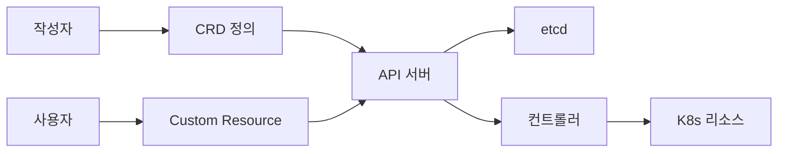

# CustomResourceDefinition (CRD)

CRD는 쿠버네티스 API 서버에 **새로운 리소스 종류**를 선언적으로 추가하는
기본 확장점이다. 직접 구현·컴파일 없이 `apiextensions.k8s.io/v1` 리소스
하나로 apiserver가 `kubectl get widgets`·`kubectl apply -f widget.yaml`
을 바로 이해하도록 만든다. [Operator 패턴](./operator-pattern.md)의
선행 조건이자, [API Aggregation](./api-aggregation.md)의 대안이다.

운영 관점 핵심 질문은 여섯 가지다.

1. **스키마는 왜 structural이어야 하나** — 서버 측 기본값·pruning 전제
2. **언제 CEL 검증을 쓰나** — 복합 제약·불변성, 웹훅 전에 고려
3. **여러 버전을 어떻게 호환시키나** — storage version + conversion
4. **서브리소스는 왜 중요한가** — `status` 분리, HPA 연동
5. **리소스 업그레이드가 기존 객체를 깨지 않게 하려면** — ratcheting
6. **필드로 필터링·감시하려면** — selectableFields

> 관련: [Operator 패턴](./operator-pattern.md)
> · [API Aggregation](./api-aggregation.md)
> · [Admission Controllers 운영](../security/admission-controllers.md)
> · [Validating Admission Policy 저작](./validating-admission-policy.md)

---

## 1. CRD·CR·Controller의 관계



CRD는 **스키마**만 정의한다. 실제 동작(파드 생성·외부 API 호출 등)은
별도의 **컨트롤러**가 CR을 watch 하며 수행한다. 컨트롤러 없는 CRD는
데이터 저장소로 동작한다(예: 외부 시스템이 CR로 설정을 읽음).

---

## 2. 최소 CRD 스켈레톤

```yaml
apiVersion: apiextensions.k8s.io/v1
kind: CustomResourceDefinition
metadata:
  name: widgets.example.com          # <plural>.<group> 고정 형식
spec:
  group: example.com
  names:
    kind: Widget
    listKind: WidgetList
    plural: widgets
    singular: widget
    shortNames: [wg]
    categories: [platform]
  scope: Namespaced                  # 또는 Cluster
  versions:
    - name: v1
      served: true
      storage: true
      schema:
        openAPIV3Schema:
          type: object
          required: [spec]
          properties:
            spec:
              type: object
              properties:
                size:
                  type: integer
                  minimum: 1
                  maximum: 100
                color:
                  type: string
                  enum: [red, blue, green]
              required: [size]
            status:
              type: object
              properties:
                phase:
                  type: string
      subresources:
        status: {}
      additionalPrinterColumns:
        - name: Size
          type: integer
          jsonPath: .spec.size
        - name: Phase
          type: string
          jsonPath: .status.phase
```

적용 후:

```bash
kubectl get widgets
kubectl get wg
kubectl get all -n team-a          # categories 포함
```

---

## 3. Structural Schema

`apiextensions.k8s.io/v1`는 **structural schema를 강제**한다. 조건:

- **모든 필드가 `type`을 가진다**(object·array·string·integer·boolean·
  number).
- 각 sub-schema에는 `properties`·`additionalProperties`·`items` 중
  **하나만** 사용.
- `required`·`enum`·`pattern` 등은 결정된 타입에 붙는다.

Structural이 강제되기 때문에 apiserver가 **서버 측 기본값(default)**,
**pruning**(스키마에 없는 필드 제거), **server-side apply 머지**를
예측 가능하게 처리한다.

### 예외 키워드

| 키워드 | 용도 |
|--------|------|
| `x-kubernetes-preserve-unknown-fields: true` | 스키마에 없는 필드 보존. 사용자 정의 확장 영역에만 |
| `x-kubernetes-embedded-resource: true` | 내장된 K8s 객체(PodSpec 등) 임을 명시 |
| `x-kubernetes-int-or-string: true` | intstr 양쪽 허용 |
| `x-kubernetes-list-type` | `map`·`set`·`atomic` 리스트 병합 전략(SSA) |
| `x-kubernetes-list-map-keys` | map 리스트의 key 필드 배열 |
| `x-kubernetes-map-type` | `granular`(기본)·`atomic` 오브젝트 merge 정책 |

> **금지**: 루트 레벨 `spec.preserveUnknownFields: true`는 `v1`에서
> 허용되지 않는다. v1beta1 마이그레이션 시 반드시 스키마 레벨
> `x-kubernetes-preserve-unknown-fields`로 옮길 것.

### Server-Side Apply 호환성

여러 컨트롤러·사용자가 같은 CR의 리스트를 건드릴 때 `list-type` 선언이
없으면 기본 `atomic`으로 취급되어 **마지막 writer가 전체를 덮어쓴다**.
대표적으로 `status.conditions`·`spec.ports` 같은 공유 리스트가
깜빡이는 버그의 원인이다.

| 값 | 동작 | 권장 용도 |
|----|------|----------|
| `atomic` | 전체를 단일 필드로 취급. 한 field manager가 소유 | 단일 소유 리스트 |
| `set` | 프리미티브 중복 없음 집합 | `finalizers`, tag 리스트 |
| `map` | 오브젝트 리스트. `list-map-keys`의 키 기준 merge | `conditions`, `containers` |

`map`은 `x-kubernetes-list-map-keys: [name]`처럼 **키 필드를 명시**해야
한다. 오브젝트 필드 자체의 merge 정책은 `x-kubernetes-map-type`으로
`granular`(필드별 merge) 또는 `atomic`(객체 전체 단일 소유)을 선택.

### 스키마 품질이 곧 DX

CRD 스키마는 `/openapi/v3`로 게시되어 `kubectl explain`, client-go 모델,
Terraform `kubernetes_manifest`, VSCode YAML LSP가 소비한다.
`description`·`required`·`example`을 성실히 채우면 사용자 경험이
극적으로 향상된다.

### 서버 측 기본값

```yaml
properties:
  replicas:
    type: integer
    default: 3
```

기본값은 **structural schema일 때만** 적용된다. CR 저장 전에 apiserver
가 자동 주입한다.

---

## 4. CEL 검증 (`x-kubernetes-validations`)

1.25 beta → **1.29 GA**. OpenAPI의 단순 제약을 넘어 **필드 간 관계·
전이 규칙**을 선언한다. Webhook 없이 apiserver에서 동기 평가되어 운영
부담이 적다.

```yaml
spec:
  type: object
  properties:
    minReplicas: { type: integer }
    maxReplicas: { type: integer }
  x-kubernetes-validations:
    - rule: "self.maxReplicas >= self.minReplicas"
      message: "maxReplicas must be >= minReplicas"
    - rule: "self.minReplicas >= 1"
      messageExpression: "'minReplicas must be >= 1, got ' + string(self.minReplicas)"
```

### 전이 규칙 (immutability)

`self`는 새 값, `oldSelf`는 이전 값. UPDATE에서만 `oldSelf`가 존재.

```yaml
properties:
  storageClass:
    type: string
    x-kubernetes-validations:
      - rule: "self == oldSelf"
        message: "storageClass는 생성 후 변경 불가"
```

### 에러 제어

- `reason`: `FieldValueInvalid`·`FieldValueRequired`·`FieldValueForbidden`
  ·`FieldValueDuplicate` 중 하나. HTTP status·클라이언트 오류 매핑에
  영향.
- `fieldPath`: 에러를 객체 scope가 아니라 **자식 필드**로 가리킨다
  (JSONPath). kubectl 오류 위치 출력에 반영.
- `optionalOldSelf`: 전이 규칙에 CREATE 시에도 `oldSelf`를 `Optional`로
  노출. "최초 허용, 이후 변경 불가" 같은 마이그레이션 친화 패턴.

```yaml
- rule: "self == oldSelf"
  message: "storageClass는 생성 후 변경 불가"
  reason: FieldValueForbidden
  fieldPath: ".spec.storageClass"
```

### 비용 예산

- 각 규칙은 내부 **cost budget** 안에서만 실행된다.
- 대형 리스트 순회는 `maxItems`·`maxLength`로 스키마상 크기를 제한해
  비용을 줄인다.
- 성능 예산 초과 시 CRD 등록 자체가 거절된다.

### VAP와의 역할 분담

| 대상 | 도구 |
|------|------|
| 해당 CRD의 **데이터 무결성** (필드 간 관계, 불변) | CEL 검증 |
| 여러 리소스·권한·조직 정책 | [VAP](./validating-admission-policy.md) |
| 외부 조회·사이드카 주입 | Webhook |

---

## 5. 서브리소스

```yaml
subresources:
  status: {}
  scale:
    specReplicasPath: .spec.replicas
    statusReplicasPath: .status.replicas
    labelSelectorPath: .status.selector
```

### `status` 분리

- `/status` 서브리소스는 **spec·status를 분리 업데이트** 가능하게 한다.
  `PUT /apis/.../widgets/foo` 로는 status를 못 바꾸고, `/status` 경로로
  만 변경된다.
- 컨트롤러는 `status`만 건드리도록 RBAC을 `verbs: [get, update, patch]`
  + `resources: [widgets/status]`로 분리한다.

### 경쟁 조건

`/status` 서브리소스로 분리해도 `resourceVersion` 기반 optimistic
concurrency는 여전히 존재한다. 두 replica가 동시에 status를 갱신하면
한쪽은 `Conflict`(HTTP 409)를 받고 재시도해야 한다. Leader Election이
느슨한 컨트롤러는 **status 깜빡임**을 일으킨다. 자세한 구현 패턴은
[Operator 패턴](./operator-pattern.md) 참조.

### `scale` 서브리소스

- `kubectl scale`·**HPA**가 CR을 확장 가능하게 한다.
- `specReplicasPath`가 `spec.replicas`면 HPA가 이 필드를 조절한다.
- `labelSelectorPath`는 HPA가 현재 파드를 찾을 때 쓰인다(metrics-server
  관점).

---

## 6. 버전과 저장 버전

`versions[]`는 여러 개를 가질 수 있고, **정확히 하나가 `storage: true`**
다. 나머지는 "serving만" 제공되어 apiserver가 읽기·쓰기 시점에 storage
버전으로 변환한다.

```yaml
versions:
  - name: v1alpha1
    served: true
    storage: false
    deprecated: true
    deprecationWarning: "v1alpha1 is deprecated, use v1"
  - name: v1
    served: true
    storage: true
```

### 저장 버전 마이그레이션 절차

올바른 순서가 중요하다. **순서를 지키지 않으면 재인코딩이 일어나지
않는다**.

1. 새 버전을 `served: true, storage: false`로 추가. Conversion Webhook
   구축·라운드트립 테스트.
2. 기존 CR을 새 버전으로 read 가능한지 검증(`kubectl get widgets -v=8
   --raw` 등).
3. **`storage: true`를 새 버전으로 스위치**. 이 시점부터 **새 쓰기**는
   새 버전으로 저장된다. 기존 객체는 아직 구 버전 스토리지.
4. **기존 CR을 재인코딩**. 아래 "재인코딩 방법" 참조.
5. `status.storedVersions`에 구 버전이 사라졌는지 확인.
6. 사용자·컨트롤러를 새 버전으로 이전.
7. 구 버전을 `served: false` → 이후 CRD에서 제거.

`spec.versions`의 구 버전 삭제는 `status.storedVersions`에 해당 버전이
**남아 있지 않을 때만** 가능하다. 남아 있으면 apiserver 등록 실패.

### 재인코딩 방법

**중요**: `kubectl apply`는 spec이 같으면 no-op로 처리되어 **재인코딩을
보장하지 않는다**. 실제 쓰기를 일으키는 경로를 써야 한다.

| 도구 | 설명 |
|------|------|
| `StorageVersionMigration`(`storagemigration.k8s.io/v1alpha1`, 1.30 alpha) | in-tree 리소스. apiserver가 직접 재기록 |
| [kube-storage-version-migrator](https://github.com/kubernetes-sigs/kube-storage-version-migrator) | out-of-tree 컨트롤러, 실전 표준 |
| `kubectl replace -f`(get json → replace) | 소규모·긴급 처리 |
| `kubectl patch --type=merge -p '{}'` | no-op patch. 쓰기를 일으키는 트릭 |

---

## 7. Conversion Webhook

여러 버전 간 스키마가 호환되지 않으면 **Webhook 변환**이 필요하다.

```yaml
conversion:
  strategy: Webhook
  webhook:
    clientConfig:
      service:
        name: widget-converter
        namespace: platform-system
        path: /convert
      caBundle: <base64 CA>
    conversionReviewVersions: [v1]
```

### ConversionReview

요청:

```yaml
apiVersion: apiextensions.k8s.io/v1
kind: ConversionReview
request:
  uid: 705ab4f5-...
  desiredAPIVersion: example.com/v1
  objects:
    - apiVersion: example.com/v1alpha1
      kind: Widget
      ...
```

응답:

```yaml
apiVersion: apiextensions.k8s.io/v1
kind: ConversionReview
response:
  uid: 705ab4f5-...
  result: { status: Succeeded }
  convertedObjects:
    - apiVersion: example.com/v1
      kind: Widget
      ...
```

### 구현 원칙

- **idempotent**: 같은 객체가 여러 번 변환돼도 결과 동일.
- **라운드트립 테스트**: `v1 → v1alpha1 → v1`이 원본과 일치하는지 CI
  에서 반드시 검증. 정보 손실이 있으면 업그레이드 경로가 깨진다.
- **양방향 지원**: `desiredAPIVersion`은 upgrade뿐 아니라 downgrade에도
  도달할 수 있다.
- **실패 시 상세 메시지**: `result.message`에 어떤 필드 때문에 실패
  했는지 남겨 클라이언트가 인지하게.
- **타임아웃 고려**: apiserver는 conversion을 **모든 CR 읽기에서**
  호출할 수 있다. 웹훅이 느리면 list·watch 전체가 느려진다.

### 가용성 요구

Conversion Webhook은 validating·mutating webhook과 달리
**`failurePolicy` 필드가 없다**. 즉 **실패는 항상 fail-closed**이며,
웹훅 장애 = CR 전체 read·write 불가. 운영 필수:

- **replicas ≥ 2**, `topologySpreadConstraints`·anti-affinity로 노드
  분산.
- **PodDisruptionBudget**(`minAvailable: 1`)로 드레인 중 전면 중단 방지.
- **`timeoutSeconds` ≤ 5s**. 그보다 길면 apiserver 요청이 누적된다.
- **`cert-manager CAInjector`**로 `caBundle` 자동 주입·회전.
- 인증서 만료 경보 필수. CA 만료 1회로 CR 전역 장애.

---

## 8. Validation Ratcheting (1.30 beta, 1.33 GA)

기존 CR이 **스키마 갱신으로 갑자기 invalid**가 되는 사고를 막는 장치.

- UPDATE 시 **달라지지 않은 필드**는 새로운 검증 규칙을 적용하지 않는다.
- 변경된 필드만 새 규칙을 태운다.

효과: `pattern`·`enum`·새 `required` 추가 같은 "타이트닝 변경"을 안전
하게 배포할 수 있다. 기존 CR은 touch 전까지 그대로 살아 있고, 사용자가
해당 필드를 고칠 때에만 검증이 적용된다.

---

## 9. Selectable Fields

`spec.versions[*].selectableFields`에 나열한 필드는 `kubectl get
--field-selector`와 watch 쿼리에서 **인덱스처럼** 사용할 수 있다.
1.32 전후 GA.

```yaml
versions:
  - name: v1
    selectableFields:
      - jsonPath: .spec.color
      - jsonPath: .status.phase
    schema: { ... }
```

```bash
kubectl get widgets --field-selector spec.color=red
```

기존에는 metadata 필드(`name`·`namespace`)만 field-selector가 됐다.
이 기능으로 **CR 고유 상태 필드**로 필터링할 수 있어 컨트롤러·운영
도구가 훨씬 효율적이다. 노드 agent가 자기 노드의 CR만 list/watch 하는
패턴에 필수.

---

## 10. Printer Columns·ShortNames·Categories

- **printer columns**: `kubectl get` 출력을 CR 상태에 맞게 커스터마이즈.
  `priority: 0`은 기본, `priority: 1`은 `-o wide`에서만 노출.
- **shortNames**: `kubectl get wg`로 타이핑 줄임. 충돌 주의(같은 그룹에
  동일 단축명 금지).
- **categories**: `kubectl get all`이나 `kubectl get storage`처럼 묶음
  조회 가능.

사소해 보이지만 운영 편의와 PR 리뷰 속도에 직결된다. 설계 초기부터
채운다.

> **주의**: `all` 카테고리는 남용 금지. `kubectl get all -n <ns>`에
> 팀 CR이 섞이면 `kubectl delete all -n <ns>` 사고로 이어진다. 사용자가
> 매일 찾는 핵심 리소스만 `all`에 포함하고, 나머지는 별도 카테고리
> (`platform`·`storage`·`network` 등)로 분리.

---

## 11. RBAC·Finalizer와의 관계

### RBAC

CRD가 등록되면 `apiGroups: ["example.com"]`에 `widgets`·
`widgets/status`·`widgets/scale` 등 리소스가 생긴다. 각 동사를 **역할별
로 분리**해 최소권한을 적용한다.

```yaml
- apiGroups: ["example.com"]
  resources: ["widgets"]
  verbs: [get, list, watch]
- apiGroups: ["example.com"]
  resources: ["widgets/status"]
  verbs: [update, patch]
- apiGroups: ["example.com"]
  resources: ["widgets/finalizers"]
  verbs: [update]
```

컨트롤러는 reconcile 루프에서 **이미 존재하는 CR의 status·finalizer만**
건드린다. `create` 권한은 일반적으로 불필요하다.

### Finalizer

CR 삭제 시 컨트롤러가 외부 리소스(DB·클라우드 자원)를 정리해야 하면
`metadata.finalizers`를 사용한다. 자세한 동작과 재시도 전략은
[Operator 패턴](./operator-pattern.md)에서 다룬다.

---

## 12. 배포 파이프라인

CRD와 CR은 **반드시 분리해서** 배포한다. CRD가 먼저 등록돼야 CR 적용이
가능하기 때문이다. 대표 패턴별 특징:

| 패턴 | CRD upgrade | 장점 | 함정 |
|------|-------------|------|------|
| Helm `crds/` 디렉토리 | ❌ install-only | 간단, 최초 설치 자동 | **upgrade·delete 시 Helm이 손대지 않음**. 변경이 반영 안 됨 |
| Helm 별도 CRD 차트 | ⚠️ 사용자 명시 | 차트 버전 분리 | 순서 조율 필요 |
| Helm `helm.sh/hook: crd-install` | ❌ Helm 3 deprecated | — | 쓰지 말 것 |
| kustomize 분리 파이프라인 | ✅ | 명시적 순서 | 툴링 직접 관리 |
| ArgoCD Sync Wave `PreSync` | ✅ | GitOps 친화 | wave 값·Sync 옵션 정확히 |
| Kubebuilder·Operator SDK 번들 | ✅ | Operator와 연동 일체 | 번들 CLI 필요 |

Helm `crds/`는 **대형 운영 환경에서 가장 자주 사고**가 난다. CRD 변경
PR을 머지해도 `helm upgrade`가 CRD를 그대로 두기 때문이다. 기존 Helm
차트를 유지해야 하면 **CRD만 별도 kustomize job으로 분리**하는 것이
실전 해법이다.

---

## 13. 관측과 진단

CRD 등록·버전·Conversion 상태는 모두 apiserver에서 관측 가능하다.

### Condition

```bash
kubectl get crd widgets.example.com -o jsonpath='{.status.conditions}' | jq
```

확인할 주요 condition:

- `Established=True` — apiserver가 리소스를 실제로 서비스 중
- `NamesAccepted=True` — plural·shortNames·categories 충돌 없음.
  `ListKindConflict` 같은 reason은 같은 그룹 내 이름 충돌
- `NonStructuralSchema=False` — v1 스키마로 등록됨
- `KubernetesAPIApprovalPolicyConformant=True` — k8s.io·kubernetes.io
  그룹 사용 시만 적용

### apiserver 메트릭

- `apiextensions_apiserver_conversion_webhook_request_total{result}` —
  Webhook 성공·실패 카운터
- `apiextensions_apiserver_conversion_webhook_duration_seconds` —
  Webhook 레이턴시 분포. p99 > 500ms는 알람.
- `apiserver_requested_deprecated_apis` — deprecated 버전 호출 카운터.
  클라이언트 이전 추적.
- `apiserver_storage_objects{resource}` — CR 객체 수. 대량 급증은
  컨트롤러 버그 징후.

---

## 14. 운영 리스크와 장애 패턴

| 증상 | 원인 | 대응 |
|------|------|------|
| CRD 등록 실패 | Structural schema 위반(type 누락) | schema lint(`kubeconform`·`kubebuilder-tools`) |
| CR 저장 시 필드 사라짐 | Structural + pruning 기본 동작 | 필요 필드를 schema에 명시, 보존 영역은 `x-kubernetes-preserve-unknown-fields` |
| 업그레이드 후 기존 CR `Invalid` | 스키마 타이트닝 | Ratcheting 활성(기본), 또는 사전 마이그레이션 Job |
| Conversion webhook 지연 | 웹훅 HA 부족 | replicas ≥ 2, timeout ≤ 5s, 캐시 가능 경로 cache |
| `status.storedVersions`에 옛 버전 | re-encode 누락 | Storage Version Migrator 실행 |
| HPA가 CR을 못 읽음 | `scale` 서브리소스 미정의·경로 오류 | `specReplicasPath`·`statusReplicasPath` 점검 |
| field-selector 동작 안 함 | `selectableFields` 미선언 | CRD에 필드 추가, apiserver 재기동 불필요 |

---

## 15. 운영 체크리스트

- [ ] `apiextensions.k8s.io/v1`만 사용. `v1beta1`은 1.22에서 제거됨.
- [ ] 모든 필드에 `type` 지정(structural schema). `kubeconform`·
  `kubebuilder-tools`로 CI 검사.
- [ ] 필드 간 제약·불변성은 `x-kubernetes-validations` CEL로. Webhook
  필요성이 있을 때만 admission으로 넘긴다.
- [ ] 컨트롤러가 건드리는 상태는 `subresources.status`로 분리.
  Scalable 리소스는 `scale` 포함.
- [ ] 버전 추가는 **Conversion Webhook + 라운드트립 테스트 CI**와 함께.
- [ ] **Storage version 변경**은 3단계(새 버전 도입 → storage 이동 →
  re-encode)로. `status.storedVersions` 확인 필수.
- [ ] `selectableFields`로 운영·컨트롤러 조회 효율화. 대규모 CR은 특히
  중요.
- [ ] `additionalPrinterColumns`·`shortNames`·`categories`는 초기부터
  설계. 나중에 추가는 가능하지만 사용자 습관은 안 바뀐다.
- [ ] RBAC은 **리소스·서브리소스 단위**로 분리. 컨트롤러는 status·
  finalizer에만 쓰기 권한.
- [ ] Validation Ratcheting 동작 확인(1.30 beta 기본 on, 1.33 GA).
  스키마 타이트닝 변경은 카나리 네임스페이스에서 먼저.
- [ ] 배포 파이프라인: **CRD 먼저 → CR 다음**. Helm `crds/`는
  install-only임을 인지, upgrade 자주 하는 팀은 kustomize·ArgoCD Sync
  Wave로 분리.
- [ ] CI에서 `kubectl apply --server-side --dry-run=server -f crd.yaml`
  + 대표 CR 샘플로 **structural schema + CEL** 동시 검증.
- [ ] CRD 변경 PR에 `storedVersions` 영향 분석 및 conversion webhook
  라운드트립 테스트 필수.

---

## 참고 자료

- Kubernetes 공식 — CustomResourceDefinitions:
  https://kubernetes.io/docs/tasks/extend-kubernetes/custom-resources/custom-resource-definitions/
- Kubernetes 공식 — CRD Versioning:
  https://kubernetes.io/docs/tasks/extend-kubernetes/custom-resources/custom-resource-definition-versioning/
- Kubernetes 공식 — CEL in Kubernetes:
  https://kubernetes.io/docs/reference/using-api/cel/
- Kubernetes Blog — CRD Validation Rules Beta:
  https://kubernetes.io/blog/2022/09/23/crd-validation-rules-beta/
- Kubernetes Blog — CEL Transition Rules (Immutability):
  https://kubernetes.io/blog/2022/09/29/enforce-immutability-using-cel/
- Kubernetes Blog — Validation Ratcheting:
  https://kubernetes.io/blog/2024/04/17/crd-validation-ratcheting/
- KEP-2876 CRD Validation Expression Language:
  https://github.com/kubernetes/enhancements/tree/master/keps/sig-api-machinery/2876-crd-validation-expression-language
- KEP-4358 Custom Resource Field Selectors:
  https://github.com/kubernetes/enhancements/tree/master/keps/sig-api-machinery/4358-custom-resource-field-selectors
- KEP-4008 CRD Validation Ratcheting:
  https://github.com/kubernetes/enhancements/tree/master/keps/sig-api-machinery/4008-crd-validation-ratcheting
- Kubebuilder — CRD Validation Markers:
  https://book.kubebuilder.io/reference/markers/crd-validation
- Storage Version Migrator:
  https://github.com/kubernetes-sigs/kube-storage-version-migrator

확인 날짜: 2026-04-24
