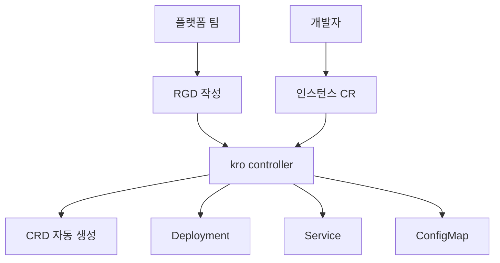

# kro — Kube Resource Orchestrator

kro는 **여러 Kubernetes 리소스를 묶어 하나의 재사용 가능한 API로
노출**하는 리소스 오케스트레이터다. `ResourceGraphDefinition`(RGD)을
작성하면 kro가 런타임에 CRD를 생성하고, 그 CRD 인스턴스가 만들어질
때마다 배후 리소스(Deployment·Service·ConfigMap·클라우드 CR 등)를
의존 순서대로 조립한다. Helm의 템플릿과 [Operator](./operator-pattern.
md)의 수명주기 관리 사이 빈틈을 메운다.

Google Cloud, AWS, Microsoft가 2025년 초 공동 발표한 프로젝트로,
**Kubernetes SIG Cloud Provider 서브프로젝트**로 운영된다. 플랫폼
팀이 매번 Operator를 작성하지 않고도 **"내부 개발자용 API"**를
선언적으로 정의할 수 있다는 점이 차별점이다.

**Platform Engineering / Internal Developer Platform(IDP) 맥락**에서
주목받는다. Backstage Software Template이 만드는 매니페스트가 kro
인스턴스 CR이 되고, 팀 개발자는 추상화된 필드만 채운다. 원샷 파이프
라인이 아니라 **선언 + 지속 재조정** 모델이라는 점이 기존 Helm-기반
IDP와 결정적으로 다르다.

운영 관점 핵심 질문은 여섯 가지다.

1. **kro는 CRD·Operator를 대체하는가** — 대체재가 아니라 합성 계층
2. **SimpleSchema vs OpenAPI**, 무엇을 포기하고 무엇을 얻나
3. **의존성은 어떻게 추론되나** — CEL 분석 → DAG
4. **인스턴스 삭제는 누가 정리하나** — ownerReferences 없음, ApplySet
5. **Crossplane·Helm·Kustomize와 어떻게 다른가** — 포지셔닝
6. **프로덕션에 넣기 전 알아야 할 것** — v1alpha1, 권한 경계, 장애 반경

> **현재 상태** (2026-04 기준): v0.9.x, API `kro.run/v1alpha1`. 프로덕션
> 도입 시 **breaking change 가능성**을 수용할 수 있어야 한다.

> 관련: [CRD](./crd.md)
> · [Operator 패턴](./operator-pattern.md)
> · [API Aggregation](./api-aggregation.md)
> · [VAP](./validating-admission-policy.md)

---

## 1. 전체 흐름



- **플랫폼 팀**은 RGD 하나로 API 표면(스키마)과 배후 리소스 템플릿을
  동시에 선언한다.
- **kro controller**가 RGD를 읽어 구체적인 CRD를 생성·등록. RGD마다
  전용 micro-controller가 기동된다.
- **개발자**는 생성된 CRD의 인스턴스만 작성. 내부 리소스 구조는 몰라도
  된다.

추상화 한 겹만 넣고 싶을 때 Operator를 풀코드로 작성하지 않아도 된다는
점이 핵심.

---

## 2. 어디에 어울리는가

| 요구사항 | 선택 |
|---------|------|
| 단일 API 선언 + 풍부한 reconciliation 로직 | [CRD + Operator](./operator-pattern.md) |
| "앱 하나 = Deployment + Service + HPA + ServiceMonitor 묶음"을 내부 API로 노출 | **kro** |
| 클라우드 리소스까지 포괄하는 조합(Crossplane·ACK·ASO CR과 합성) | **kro**(각 provider controller는 별도) |
| Helm 템플릿 렌더 + 수명주기 관리 동시 | **kro** |
| 완전히 새로운 저장소·프로토콜 | [API Aggregation](./api-aggregation.md) |
| 일회성 환경별 배포 구성 | Helm·Kustomize |

kro는 **"CRD + Operator 풀구현은 과잉이지만, Helm 템플릿으로는 부족한
구간"**을 정조준한다. 대표 유즈케이스:

- 내부 개발자용 `Application` API (Deployment·Service·HPA·Ingress
  원샷 배포)
- 팀별 환경 상위 API (Namespace·NetworkPolicy·ResourceQuota·기본 RBAC)
- 데이터 플랫폼 프리셋 (S3/GCS 버킷 CR + Kafka Topic CR + IAM)
- 멀티 리소스 Managed Service 묶음 (클라우드 CR 조합)

---

## 3. ResourceGraphDefinition 구조

```yaml
apiVersion: kro.run/v1alpha1
kind: ResourceGraphDefinition
metadata:
  name: web-application
spec:
  schema:
    apiVersion: v1alpha1
    kind: WebApplication
    group: platform.example.com     # 기본 kro.run
    scope: Namespaced
    spec:
      name: string | required=true
      image: string | default="nginx:latest"
      replicas: integer | default=1 minimum=1 maximum=20
      ingress:
        enabled: boolean | default=false
        host: string
      env: map[string]string
    status:
      url: ${ingress.status.loadBalancer.ingress[0].hostname}
      availableReplicas: ${deployment.status.availableReplicas}
  resources:
    - id: deployment
      template:
        apiVersion: apps/v1
        kind: Deployment
        metadata:
          name: ${schema.spec.name}
          namespace: ${schema.metadata.namespace}
        spec:
          replicas: ${schema.spec.replicas}
          selector:
            matchLabels: { app: ${schema.spec.name} }
          template:
            metadata:
              labels: { app: ${schema.spec.name} }
            spec:
              containers:
                - name: app
                  image: ${schema.spec.image}
      readyWhen:
        - ${deployment.status.availableReplicas >= schema.spec.replicas}
    - id: service
      template:
        apiVersion: v1
        kind: Service
        metadata:
          name: ${schema.spec.name}
          namespace: ${schema.metadata.namespace}
        spec:
          selector: { app: ${schema.spec.name} }
          ports: [{ port: 80, targetPort: 8080 }]
    - id: ingress
      includeWhen:
        - ${schema.spec.ingress.enabled}
      template:
        apiVersion: networking.k8s.io/v1
        kind: Ingress
        metadata:
          name: ${schema.spec.name}
        spec:
          rules:
            - host: ${schema.spec.ingress.host}
              http:
                paths:
                  - path: /
                    pathType: Prefix
                    backend:
                      service:
                        name: ${service.metadata.name}
                        port: { number: 80 }
```

세 부분으로 구성된다.

- **`spec.schema`** — 사용자 API 표면(CRD로 변환)
  - 그 안의 `spec.schema.status`는 **생성되는 CRD의 `.status` 필드
    정의**(인스턴스가 노출할 값)
- **`spec.resources`** — 생성할 리소스 템플릿 배열
- **RGD의 `.status`** — 별도 층위. kro controller가 RGD 자체의
  active·invalid·topological order 같은 메타 상태를 여기 기록

> **혼동 주의**: "status"가 (1) RGD의 schema 안에서 **인스턴스 CRD가
> 노출할 필드**, (2) **RGD 리소스 자체의 `.status`**, (3) 인스턴스
> 리소스의 `.status` 세 층위로 쓰인다. 셋 다 다른 대상이다.

kro는 RGD 생성 시점에 **전 CEL 표현식을 정적 타입 체크**한다. 스키마
필드·리소스 ID·OpenAPI 타입이 맞지 않으면 RGD가 `Active`가 되지
않고 오류를 드러낸다. 인스턴스를 만들어봐야 알던 Helm·Kustomize의
약점을 이 지점에서 막는다.

---

## 4. SimpleSchema

OpenAPI v3 전체를 노출하지 않고 **"한 줄에 타입·기본값·제약을 표현"**
하는 DSL이다.

```yaml
spec:
  name:        string | required=true
  replicas:    integer | default=3 minimum=1 maximum=50
  env:         string | enum="dev,stage,prod"
  image:       string | pattern="^[a-z0-9./-]+:[\\w.-]+$"
  description: string | description="사람 읽기용 설명"
  tags:        []string
  labels:      map[string]string
  database:
    name:     string | required=true
    size:     integer | default=10
```

지원 마커:

| 마커 | 의미 |
|------|------|
| `required=true` | 필수 필드 |
| `default=VALUE` | 기본값(필드 미제공 시) |
| `minimum=N`·`maximum=N` | 숫자 범위 |
| `enum="a,b,c"` | 열거형 |
| `pattern="regex"` | 정규식 |
| `description="…"` | `kubectl explain` 노출 |

### 재사용 타입

```yaml
types:
  Container:
    image: string | required=true
    tag:   string | default="latest"
spec:
  app: Container
```

타입은 인라인 확장되어 CRD 스키마에 펼쳐진다. 재귀 참조 가능.

### 한계와 결정의 의미

- OpenAPI v3의 `oneOf`·`anyOf`·복잡한 논리 조합은 표현 불가.
- 세밀한 검증은 **인스턴스 측 admission**(VAP·Webhook)에 의존.
- 대신 **읽기 쉬움·작성 속도·사용자 DX**를 얻는다. 플랫폼 API는
  어차피 복잡한 논리 제약보다 **"표면이 단순해야 채택**"된다.

---

## 5. 리소스 제어

### 5-1. `readyWhen` — 게이트

해당 리소스가 "다음 단계로 진행 가능"하다고 판단할 기준.

```yaml
- id: database
  template: { kind: RDSInstance, ... }
  readyWhen:
    - ${database.status.conditions.filter(c, c.type == 'Ready')
          .all(c, c.status == 'True')}
    - ${database.status.endpoint != ''}
```

- `readyWhen`이 없으면 "resource가 생성되고 참조 필드가 resolve
  가능하면 ready".
- 참조 범위는 **자기 자신뿐**(`${<this-id>.…}`). 다른 리소스 상태를
  섞으면 DAG가 탁해지고, kro가 명시적으로 제한.
- 모든 dependent 리소스는 upstream의 `readyWhen`이 모두 true가 될
  때까지 생성을 **지연**한다. 데이터베이스가 준비되기 전에 Deployment
  가 잘못된 DSN을 받는 경합을 제거.

### 5-2. `includeWhen` — 조건부 포함

```yaml
- id: ingress
  includeWhen:
    - ${schema.spec.ingress.enabled}
    - ${schema.spec.environment == 'production'}
```

- 모든 식이 true일 때만 리소스 생성.
- **false 전환 시 리소스 삭제**. 이에 의존하는 하위 리소스도 cascade
  삭제.
- 참조는 `schema.spec` 우선. **upstream `.status`를 섞으면 flip-flop**
  으로 생성·삭제 루프가 돈다. 반드시 피할 것(공식 가이드).

### 5-3. `forEach` — 컬렉션

```yaml
- id: regionalDeployments
  forEach:
    - region: ${schema.spec.regions}
    - tier:   ${schema.spec.tiers}
  template:
    kind: Deployment
    metadata:
      name: ${schema.metadata.name}-${region}-${tier}
    spec:
      replicas: ${schema.spec.replicas}
      ...
```

- **데카르트 곱**으로 확장(regions × tiers).
- 인스턴스·컬렉션 경계 충돌 방지를 위해 `metadata.name`에 **모든
  iterator 변수**를 포함해야 한다.
- 기본 상한 **1000개 리소스/컬렉션**, 최대 **10 차원**
  (컨트롤러 플래그 `--rgd-max-collection-size`·
  `--rgd-max-collection-dimension-size`로 조정 가능).
- 컬렉션 아이템별 `readyWhen`은 `each` 키워드 사용:
  ```yaml
  readyWhen:
    - ${each.status.availableReplicas > 0}
  ```

### 5-4. `externalRef` — 외부 리소스 읽기

```yaml
- id: platformCM
  externalRef:
    apiVersion: v1
    kind: ConfigMap
    metadata:
      name: platform-config
      namespace: platform-system
```

- 해당 리소스를 **읽기만** 한다(kro가 생성·갱신·삭제 안 함).
- 라벨 셀렉터 기반 컬렉션도 가능:
  ```yaml
  metadata:
    selector:
      matchLabels: { team: platform }
  ```
- informer로 watch. 외부 리소스 변경 시 자동 재조정.
- 필드 부재 가능성 대비 **옵셔널 접근자** 사용:
  ```yaml
  url: ${platformCM.data.?apiUrl.orValue("http://default")}
  ```

---

## 6. CEL과 의존성 추론

kro는 Kubernetes CEL을 **값 전달·조건 평가**의 공통어로 쓴다.

```yaml
# 스키마 참조
replicas: ${schema.spec.replicas}

# 다른 리소스 참조 → 자동 의존성
image: ${config.data.IMAGE}

# 삼항
resources:
  limits:
    memory: ${schema.spec.environment == 'production' ? '2Gi' : '512Mi'}

# 집계
podNames: ${workers.map(p, p.metadata.name).join(',')}
count:    ${string(size(items))}

# 옵셔널
host: ${service.status.?loadBalancer.?ingress[0].hostname
          .orValue('pending')}
```

### 의존성 DAG

- CEL 파서가 `${resourceId.…}` 참조를 수집 → 방향 그래프 구성.
- 순환 의존은 **RGD 거절**. A → B, B → A를 만들 수 없음.
- 위상 정렬로 생성 순서를 결정, **삭제는 역순**.
- 상호 참조 없는 리소스는 병렬 생성. 배포 속도의 이점.

### 정적 타입 체크

kro는 RGD 생성 시 OpenAPI 스키마를 apiserver에서 조회하여 `${…}`
반환 타입이 대상 필드와 호환되는지 검사한다. 문자열 필드에 정수
표현을 넣는 실수는 **인스턴스 생성 전에** 차단된다. Helm에서
`.Values.x`가 비어 렌더 오류가 나는 전형적 운영 사고를 방지.

---

## 7. 인스턴스 수명주기

### 7-1. 생성·재조정

사용자 관점:

```yaml
apiVersion: platform.example.com/v1alpha1
kind: WebApplication
metadata:
  name: my-app
  namespace: team-a
spec:
  name: my-app
  image: myrepo/api:v1.2.0
  replicas: 3
  ingress:
    enabled: true
    host: api.example.com
```

위 한 파일로 Deployment·Service·Ingress가 순서대로 만들어진다.

### 7-2. 상태(status)

| 필드 | 의미 |
|------|------|
| `state` | `ACTIVE`·`IN_PROGRESS`·`FAILED`·`DELETING`·`ERROR` |
| `conditions[InstanceManaged]` | 파이널라이저·라벨 정상 |
| `conditions[GraphResolved]` | 템플릿 전개 완료 |
| `conditions[ResourcesReady]` | 모든 하위 리소스 ready |
| `conditions[Ready]` | **집계 헬스**. 모니터링은 이 조건만 보면 됨 |

RGD에 선언한 `status` 표현(`url`·`availableReplicas` 등)도 함께
갱신된다.

### 7-3. 삭제와 ApplySet

중요한 설계 결정: **kro는 하위 리소스 GC에 `ownerReferences`를 쓰지
않는다.** 대신 Kubernetes **ApplySet** 사양의 라벨·어노테이션으로
소유권을 추적.

이유:

1. **정렬된 삭제** — kro는 역위상 순서로 리소스를 지운다(DB → Service
   → Deployment가 아니라 반대). ownerReferences 기반 GC는 순서를
   보장하지 않음.
2. **스코프 교차** — Namespaced 인스턴스가 ClusterRole·Namespace 같은
   Cluster-scoped 리소스를 관리할 수 있어야 함. ownerReferences는
   Namespaced→Cluster 불가.

> **예외: ArgoCD 통합**. ArgoCD가 kro 인스턴스가 만든 하위 리소스의
> **상태를 추적하도록** 만드려면, RGD 템플릿 쪽에서 **하위 리소스에
> 명시적으로 `ownerReferences`를 추가**하고(`controller: false`,
> `blockOwnerDeletion: true`), `argocd.argoproj.io/tracking-id`
> 어노테이션을 전파하는 패턴을 공식 FAQ가 제시한다. 이 경우 kro의
> ApplySet 기반 GC와 ArgoCD의 자원 트리 표시가 공존한다.

관련 라벨(중요):

| 라벨/어노테이션 | 용도 |
|---------------|------|
| `kro.run/owned=true` | kro 관리 표시 |
| `kro.run/instance-id` | 인스턴스 UID 연결 |
| `kro.run/node-id` | RGD 내부 리소스 ID |
| `applyset.kubernetes.io/id` | ApplySet 식별자 |
| `applyset.kubernetes.io/part-of` | 인스턴스 ApplySet 링크 |
| `kro.run/reconcile: suspended` | **재조정 일시 중단**(디버깅) |

### 7-4. 드리프트 복원

하위 리소스를 사용자가 직접 수정하면 **kro가 원복**한다. 이는 장점
이자 운영 함정: GitOps 파이프라인이 개입하는 리소스를 RGD에 포함
시키면 서로 overwrite 경쟁. 관리 주체는 **한 명**이어야 한다.

---

## 8. 유사 도구와의 포지셔닝

| 도구 | 핵심 메커니즘 | 포지션 |
|------|-------------|-------|
| **kro** | RGD → CRD 동적 생성 + CEL DAG | **팀 내부용 합성 API**, 낮은 학습비용, 클러스터 단일 |
| **Helm** | Go 템플릿 + 차트 패키징 | 배포 단위 패키지, 수명주기 관리 약함 |
| **Kustomize** | YAML overlay | 환경별 변형, API 추상화 아님 |
| **Crossplane Composition** | XRD·Composition·Function(KCL/Go/Python) | 다중 클러스터·광범위 인프라, 성숙·기능 많음 |
| **CRD + Operator** | 풀 Go 구현 | 커스텀 로직 극한, 개발 비용 최대 |
| **kro(in Crossplane)** | `function-kro` | Crossplane 파이프라인 안에 kro 문법 삽입 |

### vs Crossplane

- **범위**: Crossplane은 멀티클러스터·대형 플랫폼 지향, 여러 저작
  언어(KCL·Go·Python·HCL) 지원. kro는 **단일 클러스터 합성**에 집중.
- **추상화 수단**: Crossplane Composition은 XRD(Cluster-scoped가 주)
  + Composition + Function. kro는 RGD 한 파일.
- **성숙도**: Crossplane이 압도적. kro는 빠르게 쫓는 중.
- **동거**: 둘을 대체재로 고르지 않고, **Crossplane Composition
  Function(`function-kro`)**으로 kro 문법을 Crossplane 파이프라인
  한 단계로 쓰는 경로도 열려 있다. Crossplane 진영이 이를 "경쟁자"가
  아니라 파이프라인 단계로 수용한 것은, kro의 강점(정적 타입 체크·
  선언적 DAG)이 Crossplane XRD 저작자가 KCL·Python 대신 고를 만한
  대안이기 때문. 이미 Crossplane 기반 플랫폼을 쓰는 조직이라면 kro를
  **새 composition 저작 방식으로 점진 도입**하는 것이 안전.

### vs Helm

- Helm은 **템플릿 렌더 → 적용** 원샷, kro는 **지속적 재조정 + 드리프트
  복원**.
- Helm 차트는 값이 비어 렌더 오류가 나야 알 수 있지만, kro는 **정적
  타입 체크**로 조기 차단.
- Helm을 쓰던 팀이 "수명주기 관리까지 필요한데 Operator는 과하다"
  라고 느낄 때의 선택지.

### vs Operator

- Operator는 **커스텀 상태기계·외부 API 통합·복잡한 reconciliation**
  이 핵심일 때.
- kro는 **리소스 합성만 필요하고 외부 로직은 불필요할 때**. 커스텀
  컨트롤러를 짜지 않고도 합성 API를 만들 수 있다는 점이 실질 가치.
- 둘은 보완. 팀이 Operator를 이미 갖고 있다면, 그 Operator의 CR을
  다른 리소스와 묶는 **상위 합성 계층**으로 kro가 들어올 수 있다.

---

## 9. 운영 시 주의사항

### 9-1. API 안정성

- 현재 `kro.run/v1alpha1`. **breaking change 예고 정책**이 있고
  migration 가이드를 제공하지만, 안정 보장은 아직 아니다.
- 프로덕션 도입 전 내부 플랫폼 한두 개로 파일럿 권장.

### 9-2. 권한(RBAC)·멀티테넌시·감사

kro controller가 **RGD에 나열된 모든 리소스 종류**를 create·update·
delete·watch 할 수 있어야 한다.

- 기본 설치는 `cluster-admin`에 가까운 광범위 권한을 쓸 수 있다.
  **프로덕션에서는 RGD가 실제로 다루는 리소스 종류만** 허용하는
  minimal ClusterRole을 쓰도록 재구성.
- RGD를 작성하는 사용자와 kro controller의 권한은 별개다. RGD **작성
  자**가 위험한 리소스(예: ClusterRole)를 만들 수 있게 하려면 별도
  admission 정책([VAP](./validating-admission-policy.md))으로 제한.

#### 멀티테넌시 한계

- **RGD는 Cluster-scoped 리소스**다. 팀별로 RGD 네임스페이스를
  분리할 수 없다.
- 한 팀의 RGD가 다른 네임스페이스에 리소스를 생성할 수 있음
  (kro controller가 전역 권한을 가지므로). 팀 간 격리가 강하게
  필요하면 RGD 생성 권한을 **플랫폼 팀으로 한정**하거나, kro
  controller를 테넌트별로 분리 배포(권장, 각 controller가 제한된
  네임스페이스만 watch)하는 패턴.
- 인스턴스(`kind: WebApplication` 등)는 대부분 Namespaced로 설계하여
  팀 경계 안에서만 쓰이도록 한다.

#### 감사 로그

- **인스턴스 CRUD**는 일반 CRD처럼 `audit.k8s.io` 이벤트로 남는다
  (`user.username`에 실제 사용자).
- **하위 리소스 CRUD는 kro controller SA 명의**로 남는다
  (`system:serviceaccount:kro-system:kro`). 감사 상관관계를 위해
  - kro가 붙이는 `kro.run/instance-name`·`kro.run/instance-id`
    라벨로 역추적,
  - 감사 policy에서 kro controller SA 요청을 별도 파이프라인으로
    라우팅하여 인스턴스 변경 이벤트와 조인.
- 컴플라이언스(SOC2·ISO 27001) 감사는 "누가 이 Deployment를 만들었는
  가"를 단순 조회로 풀 수 없다는 점 인지. 라벨 기반 조인 쿼리가
  전제.

### 9-3. Graph Revisions와 Breaking Change

RGD 변경 시 kro는 기존 인스턴스에 안전한지 분석한다.

- **호환되는 변경**(신규 필드 추가 등): 즉시 활성화.
- **Breaking change**: RGD가 활성화되지 않음. 명시적 승인 또는 새
  버전으로 분리 필요.
- 기존 인스턴스는 이전 revision으로 계속 동작. 개발자가 "모르는 새
  깨지는" 사고를 줄이는 장치.

### 9-4. 장애 반경

- kro controller가 죽으면 **모든 RGD 인스턴스 재조정 정지**.
- 컨트롤러 Pod HA: replicas ≥ 2 + **leader election**(k8s Lease 기반)
  으로 단일 active/다중 standby. Helm 차트 기본값이 이미 활성.
- PDB, 리소스 한도 넉넉히. RGD 한 개의 CEL 오류가 전체 큐를 막지
  않도록 최신 버전 업그레이드 유지.
- **Admission Webhook 미사용**: kro는 검증·변환용 admission webhook을
  띄우지 않는다. RGD 자체의 정적 타입 체크가 컨트롤러 내부에서 일어난
  다. 이로 인해 webhook 기반 Operator(Crossplane·cert-manager 등)
  대비 **클러스터 부팅·업그레이드 시 인증서·네트워크 경합 장애가 없다
  는 이점**. 대신 인스턴스 생성 시 **실패 시점**은 즉시 거절이 아니라
  컨트롤러 로그·상태 필드로 드러난다는 차이.
- **동적 CRD 등록 실패 시나리오**: RGD가 참조하는 API 그룹 이름 충돌,
  권한 부족, 기존 CRD와의 스키마 비호환이 발생하면 RGD `.status`에
  `Ready=False`와 Reason이 남고 **기존 인스턴스는 직전 revision으로
  계속 동작**. kubectl describe로 즉시 확인.

### 9-5. 관측

| 메트릭 | 의미 |
|--------|------|
| kro controller 자체 `/metrics` | reconcile 실패·지연 |
| 인스턴스 `state` 집계 | ACTIVE 비율 ≥ 목표 |
| `conditions[Ready]=False` 인스턴스 수 | 알람 지표 |
| 이벤트(`kubectl describe`) | GraphResolved·ResourceCreated 추적 |

### 9-6. 디버깅

```bash
# 인스턴스 상태
kubectl get webapplication -n team-a my-app -o yaml

# 재조정 일시 중단
kubectl annotate webapplication my-app \
  kro.run/reconcile=suspended

# 리소스 생성 관계 확인
kubectl get all -l kro.run/instance-name=my-app -n team-a
```

`observedGeneration`이 `metadata.generation`과 같으면 컨트롤러가 최신
상태를 봤다는 뜻. 다르면 컨트롤러 지연·장애 의심.

---

## 10. 운영 체크리스트

- [ ] **API 안정성 리스크** 수용 — `v1alpha1`, breaking change 정책
      확인. 프로덕션 도입 전 파일럿.
- [ ] kro controller에 **최소권한 ClusterRole** 부여(RGD에 나오는
      kind만). 기본 cluster-admin 권한은 운영 환경에서 교체.
- [ ] 누가 RGD를 작성할 수 있는지 RBAC·[VAP](./validating-admission-
      policy.md)로 제한. RGD는 곧 새 API 표면이므로 거버넌스 대상.
- [ ] 컨트롤러 HA: replicas ≥ 2, leader election, PDB.
- [ ] 인스턴스 `conditions[Ready]=False` 5분 지속 알람.
- [ ] Drift 복원과 외부 관리자(GitOps·사용자 수동 편집) **중복
      소유권 금지**. 한 리소스의 관리 주체는 하나.
- [ ] RGD 변경은 **호환성 분석 결과 확인** 후 적용. Breaking change는
      새 버전으로 분리.
- [ ] `forEach` 확장 상한(기본 1000·10 차원) 초과 가능성 리뷰.
- [ ] `includeWhen` 표현식에 **upstream `.status`를 섞지 않음**
      (flip-flop 방지).
- [ ] 삭제 정렬이 중요한 종속관계(DB → 앱 등)를 RGD DAG에 명시.
- [ ] `kro.run/reconcile: suspended`를 **긴급 디버깅 전용**으로만
      사용(장기 방치 금지).
- [ ] Operator·Crossplane과의 **역할 분담 정책**을 팀 내 문서화.
      겹치면 유지보수 주체 혼선.

---

## 참고 자료

- kro 공식 사이트:
  https://kro.run/
- GitHub — kubernetes-sigs/kro:
  https://github.com/kubernetes-sigs/kro
- Google Cloud Blog — Introducing kro:
  https://cloud.google.com/blog/products/containers-kubernetes/introducing-kube-resource-orchestrator
- AWS — Resource Composition with kro (EKS):
  https://docs.aws.amazon.com/eks/latest/userguide/kro.html
- Crossplane Blog — function-kro (YAML+CEL in Crossplane):
  https://blog.crossplane.io/function-kro-yaml-cel/
- Kubernetes CEL 공식 문서:
  https://kubernetes.io/docs/reference/using-api/cel/
- Kubernetes ApplySet KEP-3659:
  https://github.com/kubernetes/enhancements/tree/master/keps/sig-cli/3659-kubectl-apply-prune
- kro Docs — ResourceGraphDefinition Overview:
  https://kro.run/docs/overview
- kro Docs — Schema:
  https://kro.run/docs/concepts/rgd/schema/
- kro Docs — Conditionals (`includeWhen`):
  https://kro.run/docs/concepts/rgd/resource-definitions/conditional-creation/
- kro Docs — Collections (`forEach`):
  https://kro.run/docs/concepts/rgd/resource-definitions/collections/
- kro Docs — External References:
  https://kro.run/docs/concepts/rgd/resource-definitions/external-references/
- kro Docs — CEL Expressions:
  https://kro.run/docs/concepts/rgd/cel-expressions/
- kro Docs — Instances (ApplySet):
  https://kro.run/docs/concepts/instances/
- kro Docs — FAQ (ArgoCD 통합 패턴):
  https://kro.run/docs/faq/
- kro Releases (버전 추적):
  https://github.com/kubernetes-sigs/kro/releases
- SIG Cloud Provider:
  https://www.kubernetes.dev/community/community-groups/sigs/cloud-provider/

확인 날짜: 2026-04-24
