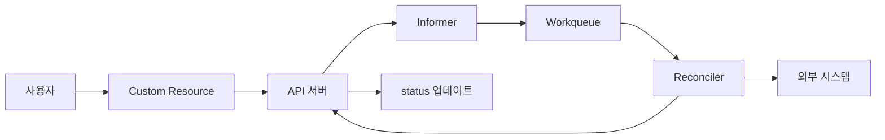
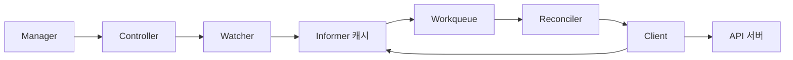
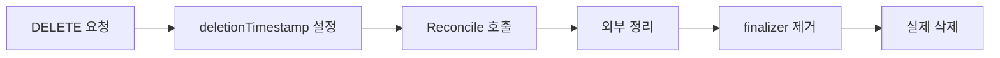

# Operator 패턴

Operator는 **도메인 지식을 담은 컨트롤러**다. 사용자가 CR([CRD](./crd.md)
참조)로 원하는 상태를 선언하면, 컨트롤러가 현재 상태를 관찰·비교·조치
(observe·diff·act)해 원하는 상태로 수렴시킨다. DB 복제 셋업·라이선스
갱신·스키마 마이그레이션 같은 "사람이 하던 일"을 코드로 옮긴다.

운영 관점 핵심 질문은 일곱 가지다.

1. **컨트롤러 기본 구조는 뭔가** — control loop·informer·workqueue
2. **Level-triggered와 Edge-triggered는 왜 중요한가** — 신뢰성의 핵심
3. **Reconcile 함수는 어떻게 작성해야 하나** — idempotent·단일 책임
4. **외부 리소스 정리는 어떻게 하나** — finalizer 패턴
5. **여러 replica로 띄우면 충돌하지 않나** — leader election
6. **어느 프레임워크를 쓸까** — Kubebuilder·Operator SDK·Metacontroller
7. **어떻게 성숙도를 측정하나** — Capability Level Model

> 관련: [CRD](./crd.md) · [API Aggregation](./api-aggregation.md)
> · [Admission Controllers 운영](../security/admission-controllers.md)

---

## 1. Operator의 구성



Operator = **CRD(스키마) + Controller(도메인 로직)**. CRD는
`apiextensions.k8s.io`가 책임지고, Controller는 Go·Rust·Python으로
구현된 프로세스다. 본 글은 Controller 쪽에 집중한다.

---

## 2. Control Loop

쿠버네티스의 모든 컨트롤러가 따르는 표준 루프.

```
for {
    desired := APIServer.Get(resource)     // Observe
    current := getCurrentState(desired)     // Observe
    diff    := compare(current, desired)    // Diff
    if diff != nil {
        act(diff)                           // Act
    }
    APIServer.UpdateStatus(resource)        // Report
}
```

쿠버네티스는 **안정 상태를 목표로 하지 않는다**. 컨트롤러가 항상 돌면서
조금씩 상태를 고쳐 나가는 **계속된 reconciliation**이 정상 동작이다.

---

## 3. Level-triggered vs Edge-triggered

| 방식 | 신호 해석 | 신뢰성 | 복잡도 |
|------|----------|--------|--------|
| Edge-triggered | 이벤트(변화)에 반응 | 이벤트 유실 시 깨짐 | 낮음 |
| **Level-triggered** | **현재 상태**를 보고 반응 | 이벤트 유실에 강함 | 높음 |

쿠버네티스·controller-runtime은 **level-triggered**를 표준으로 한다.
informer가 이벤트를 전달해도 Reconciler는 이벤트 내용을 믿지 않고,
**항상 최신 상태를 다시 읽어 판단**한다. 덕분에 아래가 보장된다.

- 이벤트가 압축·중복·유실돼도 eventual consistency 보장
- 재시작·롤링 업그레이드 후 자동 복구
- `Reconcile` 함수에 Create/Update/Delete 분기 **불필요**

> Edge 스타일로 "create 시 이거 하고 update 시 저거 하고" 쓰는 순간
> Operator는 불안정해진다. `onCreate`·`onUpdate`·`onDelete`가 보이면
> 리팩터링 신호다.

---

## 4. controller-runtime 아키텍처

Go 진영의 사실상 표준. Kubebuilder·Operator SDK가 모두 이것을 래핑한다.



- **Manager**: 전체 수명·캐시·leader election·메트릭·헬스를 묶음.
- **Informer 캐시**: apiserver를 watch 하며 로컬 `cache.Store`를
  채운다. Reconciler는 이 캐시에서 읽어 apiserver 부하를 줄인다.
- **Workqueue**: 중복 제거·rate limit·지연 재큐(exponential backoff)를
  지원하는 큐.
- **Client**: 쓰기는 apiserver, 읽기는 캐시로 자동 분기. 직접 apiserver
  만 쓰고 싶으면 `APIReader`를 사용.

### 최소 Reconciler 스켈레톤

```go
type WidgetReconciler struct {
    client.Client
    Scheme *runtime.Scheme
}

func (r *WidgetReconciler) Reconcile(ctx context.Context, req ctrl.Request) (ctrl.Result, error) {
    log := log.FromContext(ctx)

    var widget appv1.Widget
    if err := r.Get(ctx, req.NamespacedName, &widget); err != nil {
        return ctrl.Result{}, client.IgnoreNotFound(err)
    }

    if !widget.DeletionTimestamp.IsZero() {
        return r.finalize(ctx, &widget)
    }

    if !controllerutil.ContainsFinalizer(&widget, finalizerName) {
        controllerutil.AddFinalizer(&widget, finalizerName)
        return ctrl.Result{}, r.Update(ctx, &widget)
    }

    if err := r.reconcileResources(ctx, &widget); err != nil {
        return ctrl.Result{}, err
    }

    return ctrl.Result{RequeueAfter: 30 * time.Second}, r.updateStatus(ctx, &widget)
}

func (r *WidgetReconciler) SetupWithManager(mgr ctrl.Manager) error {
    return ctrl.NewControllerManagedBy(mgr).
        For(&appv1.Widget{}).
        Owns(&appsv1.Deployment{}).      // 자식 리소스 이벤트 watch
        Complete(r)
}
```

---

### 동시성과 Rate Limiter

- **`MaxConcurrentReconciles`** 기본값은 **1**. 같은 리소스 key에 대한
  동시 실행은 workqueue가 이미 차단하므로 올려도 안전하다. 대규모
  클러스터는 10~50까지 올리는 경우가 흔하다.
- 기본 rate limiter는 `DefaultControllerRateLimiter()` = 지수 백오프
  (`5ms~1000s`) + 토큰버킷(`10 qps, burst 100`)의 `max`.
- 외부 API가 느린 경우 커스텀 `RateLimiter`로 교체. `workqueue.
  NewItemFastSlowRateLimiter` 또는 `rate.NewLimiter` 기반.

```go
ctrl.NewControllerManagedBy(mgr).
    For(&appv1.Widget{}).
    WithOptions(controller.Options{
        MaxConcurrentReconciles: 10,
        RateLimiter: workqueue.NewItemExponentialFailureRateLimiter(
            200*time.Millisecond, 5*time.Minute),
    }).
    Complete(r)
```

### 샤딩

CR 수만 개 이상에서는 replica마다 **라벨 셀렉터 기반 파티셔닝**으로
샤딩한다. Manager의 `Cache.ByObject`로 namespace·라벨 필터를 걸고,
replica 각각이 서로 다른 파티션을 처리한다. Leader election과는 별개
개념이다(샤드마다 leader 따로 둠).

---

## 5. Reconciler 설계 원칙

### 5.1 Idempotent 해야 한다

같은 CR을 여러 번 Reconcile 해도 결과가 같아야 한다. 이는 이벤트 중복·
재시작·leader 교체 상황에서 필수다.

- "이미 존재하면 생성 생략" 같은 분기를 **모든 리소스**에 적용.
- Server-Side Apply(아래 5.2)로 **선언적 적용**.
- 외부 API 호출도 멱등 키(`idempotency-key` 헤더·자원 고유 ID)로 보호.

### 5.2 Server-Side Apply를 기본선으로

`CreateOrUpdate`의 3-way merge는 **여러 컨트롤러가 같은 리소스**를
건드릴 때 경쟁을 해결하지 못한다. SSA는 **field ownership**(field
manager)을 추적해 충돌을 감지·해결한다.

```go
widget.Labels["app"] = "widget"
widget.Spec.Replicas = ptr.To[int32](3)
err := r.Patch(ctx, widget,
    client.Apply,
    client.FieldOwner("widget-controller"),
    client.ForceOwnership,
)
```

- **FieldManager 이름은 컨트롤러마다 고유**하고 **Reconcile 간 동일**해야
  한다. 랜덤·버전 접미사 금지 — 매번 바뀌면 ownership이 흩어져 필드가
  영영 지워지지 않는다.
- `client.ForceOwnership`은 "내가 선언한 필드는 내가 소유한다"를 강제.
  Argo Rollouts처럼 같은 객체를 건드리는 다른 컨트롤러가 있을 때 충돌을
  해결한다.
- 다중 컨트롤러 환경에서 각자 **자기 서브셋만** 선언하면 공존 가능.
  "Cooperative ownership" 패턴.

자식 리소스(Deployment·Service)도 같은 방식으로 적용한다. SSA가 오류
없이 돌면 재생성 루프·depth-first 오류를 거의 완전히 제거한다.

### 5.2 단일 책임

한 컨트롤러는 **한 CRD**만 관리. 여러 CRD를 한 컨트롤러에 넣으면 오류
격리·스케일·테스트가 전부 어려워진다. Kubebuilder는 리소스별 컨트롤러
생성을 권장한다.

### 5.3 조기 리턴·재큐 전략

```go
// 일시 오류 → 기본 지수 백오프로 재시도
return ctrl.Result{}, err

// 특정 시간 뒤 재검사
return ctrl.Result{RequeueAfter: 30 * time.Second}, nil

// 성공·대기 불필요
return ctrl.Result{}, nil
```

- 에러를 반환하면 controller-runtime이 **지수 백오프**로 재큐한다.
- `RequeueAfter`는 "외부 시스템이 아직 준비 안 됐다"는 주기적 폴링에
  사용. apiserver 이벤트에 의존할 수 없는 외부 상태 점검용.

### 5.4 작업 크기 제한

한 Reconcile 호출은 **수 초 이내**에 끝내야 한다. 오래 걸리는 작업은
status에 phase를 기록해 다음 호출에서 이어서 진행. 긴 작업을 블로킹
하면 워커 슬롯이 고갈된다.

---

## 6. Status와 Conditions

`spec`은 사용자가 쓰고, `status`는 컨트롤러가 쓴다. 표준 표현은
**Condition 배열**이다.

```go
meta.SetStatusCondition(&widget.Status.Conditions, metav1.Condition{
    Type:    "Ready",
    Status:  metav1.ConditionTrue,
    Reason:  "AllResourcesReady",
    Message: "Deployment·Service가 모두 준비됨",
    ObservedGeneration: widget.Generation,
})
```

| 필드 | 용도 |
|------|------|
| `type` | `Ready`·`Available`·`Degraded`·`Progressing` 등 표준 이름 |
| `status` | `True`·`False`·`Unknown` |
| `reason` | CamelCase 짧은 사유. 메트릭·알람 태깅 |
| `message` | 사람이 읽는 상세 |
| `observedGeneration` | 이 condition을 만든 spec generation |
| `lastTransitionTime` | 마지막 상태 변화 시각 |

`observedGeneration`은 두 곳에 존재한다.

- `status.observedGeneration`: 최상위 필드. 단순 지표.
- `status.conditions[].observedGeneration`: 각 condition이 어느
  generation에서 만들어졌는지. **KEP-1623 권장**.

최상위 `status.observedGeneration == metadata.generation`이 참일 때만
"status가 최신 spec을 반영"한다고 본다. 클라이언트·readinessGate는
이를 기준으로 readiness를 판단한다.

### 이벤트 발행 (EventRecorder)

Condition과 별개로 **`kubectl describe`에 보이는 Events**를 남긴다.
운영자가 문제 발생 시 가장 먼저 보는 신호원이다.

```go
r.Recorder = mgr.GetEventRecorderFor("widget-controller")
...
r.Recorder.Eventf(&widget, corev1.EventTypeNormal,
    "Synced", "Deployment %s reconciled", deploy.Name)
r.Recorder.Eventf(&widget, corev1.EventTypeWarning,
    "SyncFailed", "failed to reconcile: %v", err)
```

EventType은 `Normal`·`Warning`만 사용. Reason은 CamelCase 짧은 키로.

### 업데이트 경합

`/status` 서브리소스는 spec과 독립적으로 업데이트되지만 `resourceVersion`
기반 optimistic concurrency는 여전히 존재한다. 두 replica가 동시에
status를 쓰면 한쪽은 `Conflict`(HTTP 409). controller-runtime의 retry
래퍼(`retry.RetryOnConflict`)로 감싼다.

---

## 7. Finalizer 패턴

CR 삭제 시 외부 리소스(DB·클라우드·퍼블릭 엔드포인트)를 정리해야 하면
finalizer를 사용한다.



### 단계

1. **`DeletionTimestamp` 먼저 확인**: 값이 있으면 정리 경로로 진입
   (finalizer 부재여도 무시).
2. **finalizer 추가를 apiserver Update로 먼저 저장**. 성공 응답을
   받은 **뒤에만** 외부 리소스 생성에 착수. 순서를 바꾸면 컨트롤러가
   finalizer 저장 직전에 죽었을 때 외부 자원이 고아가 된다.
3. **외부 리소스 생성**: 생성한 것만 `status` 또는 annotation에 기록.
4. **외부 정리 수행**: 삭제 시 실패하면 finalizer 유지 → 다음 reconcile
   에서 재시도.
5. **성공 시 finalizer 제거** → apiserver GC가 객체를 실제 삭제.

### 흔한 버그

- **finalizer 무한 잔류**: 외부 시스템이 영구 불능 상태일 때. `stuck`
  처리를 위한 escape hatch가 필요(수동 제거 가이드·관리자 CLI).
- **finalizer를 먼저 제거**: 외부 정리 전에 제거하면 즉시 GC되고 외부
  자원이 **고아(orphan)** 가 된다.
- **Conflict 재시도 누락**: finalizer 제거 시 apiserver가 409를 돌려
  주는 경우가 잦다. 반드시 재시도.

---

## 8. Owner References와 GC

컨트롤러가 만든 자식 리소스(Deployment·Service 등)는 `ownerReferences`
로 부모 CR을 가리킨다.

```go
if err := ctrl.SetControllerReference(&widget, deploy, r.Scheme); err != nil {
    return err
}
```

| 필드 | 효과 |
|------|------|
| `controller: true` | 이 오너가 **주 컨트롤러**임. 하나만 가능 |
| `blockOwnerDeletion: true` | 오너 삭제 전 자식을 먼저 정리 |
| 기본 propagation | `Background` — 부모 삭제 후 자식 백그라운드 GC |

Owner reference가 있으면 부모 CR 삭제만으로 자식이 자동 정리된다.
**cluster-scoped 리소스는 네임스페이스 리소스의 자식이 될 수 없다**.
이 방향으로 ownerRef를 걸면 GC가 **즉시 삭제**한다.

---

## 9. Leader Election

Operator를 **replicas ≥ 2**로 띄워도 한 시점에는 **한 replica만** 조치
해야 한다. 동시 reconcile은 status 깜빡임·외부 API 중복 호출을 만든다.

```go
mgr, err := ctrl.NewManager(cfg, ctrl.Options{
    LeaderElection:                true,
    LeaderElectionID:              "widget-operator-lock",
    LeaderElectionNamespace:       "platform-system",
    LeaderElectionReleaseOnCancel: true,     // graceful shutdown 시 lease 반납
})
```

### 동작 원리

- controller-runtime은 `coordination.k8s.io/v1 Lease`를 분산 락으로 사용
  (v0.14+ 기본. `LeaderElectionResourceLock` 명시 불필요).
- 리더가 주기적으로 lease를 갱신. 갱신 실패 시 다른 replica가 획득.
- **리더 전환 구간 동안 짧은 중복 reconcile**이 가능하다. 완전한 상호
  배제는 아니므로 Reconcile은 여전히 idempotent 필요.

### 기본 타이밍 값과 튜닝

| 옵션 | 기본값 | 의미 |
|------|--------|------|
| `LeaseDuration` | 15s | lease 유효 기간 |
| `RenewDeadline` | 10s | 리더가 이 시간 안에 갱신 실패하면 사임 |
| `RetryPeriod` | 2s | 후보 replica가 lease 획득을 시도하는 주기 |

apiserver latency가 높은 환경(원격·저속 링크)은 각각 1.5~2배로 늘려
false failover를 줄인다. `LeaderElectionReleaseOnCancel: true`는 Pod
종료 시 lease를 즉시 반납해 **리더 전환 구간을 최소화**한다.

---

## 10. 이벤트·Predicate·Watch 설계

Reconciler는 **자기 리소스 + 자식 리소스**의 이벤트를 받는다.

```go
// controller-runtime v0.15+ 형식
return ctrl.NewControllerManagedBy(mgr).
    For(&appv1.Widget{},
        builder.WithPredicates(predicate.GenerationChangedPredicate{})).
    Owns(&appsv1.Deployment{}).        // 자식 변경 → 부모 재큐
    Watches(
        &corev1.ConfigMap{},           // v0.15+: client.Object 직접 전달
        handler.EnqueueRequestsFromMapFunc(r.configMapToWidgets),
    ).
    Complete(r)
```

- **`For`**: 주 리소스 watch.
- **`Owns`**: owner reference로 연결된 자식 자동 watch.
- **`Watches`**: 관계 없는 리소스도 매핑 함수로 연결. 예: 공유
  ConfigMap이 여러 CR에 영향을 줄 때. (v0.15에서 `source.Kind{Type: ...}`
  제거, 직접 `client.Object`를 전달한다. 더 낮은 계층 제어가 필요하면
  `WatchesRawSource`를 사용.)
- **Predicate**: **반드시 `For`·`Watches`별로 분리 적용**. 빌더 전역
  `WithEventFilter(GenerationChangedPredicate)`를 쓰면 `Owns` 자식의
  `.status` 변경(예: Deployment `ReadyReplicas`)까지 필터링되어 부모
  CR의 `Ready` 판정이 트리거되지 않는 함정이 있다.

### 피해야 할 패턴

- 클러스터 전역 Pod watch — 대규모 환경에서 Informer 메모리 폭발.
- 자체 CR 업데이트를 자기가 다시 받는 루프 — `generation` 필터로 방어.

---

## 11. 프레임워크 비교

| 프레임워크 | 언어 | 특징 |
|-----------|------|------|
| **Kubebuilder** | Go | controller-runtime의 공식 프로젝트 스캐폴딩. CNCF 사실상 표준 |
| **Operator SDK** | Go·Ansible·Helm | RHEL·OpenShift 친화. OLM·OperatorHub 연동. Go 모드는 Kubebuilder 기반 |
| **Metacontroller** | 언어 무관(HTTP hook) | `CompositeController`(부모·자식 관리)와 `DecoratorController`(기존 리소스 보강) 제공. Python·Node.js로도 구현 가능 |
| **kopf** | Python | 데코레이터 기반. 소규모·프로토타입 |
| **cdk8s-plus** | TypeScript·Go | 리소스 생성 DSL, Operator 자체보다는 매니페스트 생성 |
| **shell-operator** | 셸 | 이벤트에 셸 스크립트 실행. 단순 작업용 |

**선택 가이드**

- **프로덕션 Go Operator**: Kubebuilder(기본) 또는 Operator SDK(OLM 필요
  시).
- **언어 제약**: webhook 인터페이스만 제공하면 되는 Metacontroller.
- **설치형 소프트웨어 캡슐화**: Operator SDK + Helm 또는 Ansible
  Operator(컨트롤러 코드 없이 플레이북으로 reconcile).

### Operator Lifecycle Manager (OLM)

Operator를 **클러스터에 설치·업그레이드·권한 관리**하는 메타 컨트롤러.
OperatorHub.io·Red Hat OpenShift가 기본으로 쓴다. 두 세대가 공존한다.

| 버전 | 상태 | 주요 컴포넌트 | 메인 API |
|------|------|--------------|---------|
| **OLM v0** | 유지보수 | olm·catalog-operator | `Subscription`·`ClusterServiceVersion` |
| **OLM v1** | 활발 | operator-controller + catalogd(+ cert-manager) | `ClusterExtension`·`ClusterCatalog` |

v0의 `rukpak`은 2024-08 archive돼 **operator-controller**로 흡수됐다.
신규 배포는 OLM v1을 우선 고려. 기존 v0 번들도 v1이 순차 호환한다.

---

## 12. Operator Capability Level

Operator Framework가 정의한 성숙도 모델. 자기 Operator를 어느 레벨
까지 구현할지 스펙으로 삼는다.

| Level | 이름 | 핵심 기능 |
|-------|------|----------|
| 1 | Basic Install | 앱 설치·구성 |
| 2 | Seamless Upgrades | 앱 버전 업그레이드 |
| 3 | Full Lifecycle | 백업·실패 복구·스토리지 관리 |
| 4 | Deep Insights | 메트릭·알람·로그·워크로드 분석 |
| 5 | Auto Pilot | 오토스케일·자동 튜닝·비정상 감지·예측 교정 |

대부분의 OSS Operator는 Level 2~3에 머무르고, RDBMS·Kafka·Vault 같은
상용 Operator가 Level 4~5를 겨냥한다. 설계 초기에 **어느 레벨이 목표인
지** 문서화하면 기능·비용 논쟁이 줄어든다.

---

## 13. 테스트 전략

### envtest

`controller-runtime/pkg/envtest`가 **경량 apiserver + etcd**를 띄워
실제 API 흐름을 테스트한다.

```go
testEnv = &envtest.Environment{
    CRDDirectoryPaths: []string{filepath.Join("..", "config", "crd", "bases")},
}
cfg, err := testEnv.Start()
```

- 실 apiserver 계열과 동일한 검증(structural schema·CEL)이 돈다.
- 네트워크·CRI·kubelet 없음. 파드 실행 시험은 별도 e2e.

### 단위·통합·e2e 피라미드

- **단위**: 순수 함수(리소스 빌더·status 조립). fake client 사용 가능.
- **통합**: envtest로 Reconcile을 태우고 결과 리소스·status 검증.
- **e2e**: `kind`·`k3d` 클러스터에 실제 배포 후 E2E 시나리오. 선언적
  시나리오 도구는 **Chainsaw**(Kyverno 프로젝트)가 현 표준, 기존 KUTTL
  테스트는 자동 변환 지원.

### 정적 검사

- `golangci-lint` + `revive`: 표준 린트.
- `controller-gen verify`: CRD 스키마·RBAC 마커 정합성.
- CI에서 **라운드트립 fuzz 테스트**로 Conversion Webhook 검증
  (`sigs.k8s.io/controller-tools` fuzz 지원).

---

## 14. 배포·패키징

| 대상 | 권장 |
|------|------|
| 단일 팀 내부 Operator | Kustomize base + ArgoCD `ApplicationSet` |
| 퍼블릭 배포(벤더) | Operator SDK `bundle.Dockerfile` + OLM v1 Catalog |
| 설치 경험 우선 | Helm chart(+ `crds/` install only, upgrade는 별도 Job) |
| 멀티 클러스터 | ArgoCD Hub `Application` + 워크스페이스별 오버레이 |

Operator 자체의 Deployment는 `maxSurge: 1, maxUnavailable: 0`, PDB
`minAvailable: 1`이 표준. Leader election이 있으므로 replicas ≥ 2는
가용성을 올리지만 동시 동작은 보장하지 않음.

---

## 15. 멀티클러스터 Operator

"한 Operator가 여러 클러스터를 관리"하는 요구가 늘고 있다. 두 접근.

| 접근 | 특징 |
|------|------|
| **클러스터당 Manager 인스턴스** | 단순. 각 Manager가 자기 클러스터만 watch. Cluster API·Karmada와 결합 |
| **`cluster.Cluster` 추상화 + 멀티 캐시** | 단일 프로세스가 여러 클러스터 Client 보유. controller-runtime `pkg/cluster` |

RBAC·네트워크 경로(허브 → 멤버 클러스터 API 도달 가능해야 함)·Lease
위치(각 클러스터에 따로, 또는 허브 집중) 모두 선택이 필요하다.
Cluster API·Crossplane provider-kubernetes가 멀티 클러스터 Operator의
대표 사례.

---

## 16. 관측 가능성

controller-runtime이 자동 노출하는 핵심 메트릭.

| 메트릭 | 용도 |
|--------|------|
| `controller_runtime_reconcile_total{result}` | reconcile 횟수·성공·실패 |
| `controller_runtime_reconcile_time_seconds` | 레이턴시. p99 SLI |
| `controller_runtime_reconcile_errors_total` | 에러 수 |
| `workqueue_depth{name}` | 큐 깊이. 백로그 감지 |
| `workqueue_retries_total` | 재시도 누적 |
| `workqueue_unfinished_work_seconds` | 오래된 작업 시간 |
| `rest_client_requests_total` | apiserver 호출 — 레이트 급증 탐지 |

### 알람 임계 예

- reconcile p99 > 5s 1분 지속
- error rate > 0.5/s
- queue depth > 100 5분 지속

Grafana에는 controller-runtime·kubebuilder 팀이 배포한 공식 대시보드
템플릿이 있다. 신규 Operator는 이것을 기준선으로 시작한다.

---

## 17. 운영 리스크와 장애 패턴

| 증상 | 원인 | 대응 |
|------|------|------|
| CR이 삭제 안 됨 | finalizer 잔류 | 외부 시스템 점검, stuck CR 가이드 제공 |
| status 깜빡임 | leader 겹침·reconcile 경쟁 | Lease 튜닝, `observedGeneration` 필터 |
| 컨트롤러 OOM | 전역 Pod watch·큰 informer | 필드·라벨 필터, `Owns`·predicate 활용 |
| 재큐 폭증 | edge 스타일 이벤트 의존 | level-triggered 재작성, `GenerationChangedPredicate` |
| 자식 리소스가 계속 재생성 | SSA vs kubectl apply merge 경합 | field manager 일치, list-type 설계 |
| 업그레이드 시 기존 CR 파손 | 스키마 타이트닝 | [CRD](./crd.md) Ratcheting 활용, 카나리 |
| 외부 API rate limit | idempotency·backoff 누락 | 요청 캐시, 지수 백오프, 멱등 키 |

---

## 18. 운영 체크리스트

- [ ] **단일 책임**: 한 컨트롤러·한 CRD. 복수 CRD는 별도 컨트롤러로.
- [ ] Reconcile 함수는 idempotent. `onCreate`·`onUpdate`·`onDelete`
  분기가 있다면 리팩터링.
- [ ] `status.conditions`를 표준 스키마로. `observedGeneration` 반드시
  설정.
- [ ] 외부 리소스를 관리하면 **finalizer 필수**. stuck 대응 가이드 제공.
- [ ] `ownerReferences`로 자식 리소스를 부모에 연결. GC 자동화.
- [ ] `LeaderElection: true` + 적절한 lease 네임스페이스·ID. 리더 전환
  구간에도 Reconcile이 안전하도록 idempotent 유지.
- [ ] Informer는 **필요 범위만**. 네임스페이스·라벨·필드 셀렉터로 스코프
  제한.
- [ ] `GenerationChangedPredicate`로 status 변경 재큐 차단.
- [ ] 메트릭: `controller_runtime_reconcile_total`,
  `controller_runtime_reconcile_errors_total`,
  `workqueue_depth`, `workqueue_unfinished_work_seconds` 알람.
- [ ] `rbac` 마커를 통해 Reconcile에 필요한 권한만 생성. `*` 금지,
  `verbs: [get, list, watch]`부터 점진 추가.
- [ ] `envtest` + e2e 테스트. Conversion Webhook 라운드트립 fuzz.
- [ ] 업그레이드 정책(Operator 자신): Deployment rolling update,
  maxSurge/maxUnavailable, PDB, readinessProbe.
- [ ] Capability Level 목표 명시. 운영 계획과 일치.

---

## 참고 자료

- Kubernetes 공식 — Controller 개념:
  https://kubernetes.io/docs/concepts/architecture/controller/
- Kubernetes 공식 — Operator 패턴:
  https://kubernetes.io/docs/concepts/extend-kubernetes/operator/
- Kubebuilder Book:
  https://book.kubebuilder.io/
- Kubebuilder Good Practices:
  https://book.kubebuilder.io/reference/good-practices
- Operator SDK:
  https://sdk.operatorframework.io/
- controller-runtime GoDoc:
  https://pkg.go.dev/sigs.k8s.io/controller-runtime
- controller-runtime GitHub:
  https://github.com/kubernetes-sigs/controller-runtime
- Operator Framework — Capability Levels:
  https://operatorframework.io/operator-capabilities/
- Metacontroller:
  https://metacontroller.github.io/metacontroller/
- Red Hat — Kubernetes Operators Best Practices:
  https://www.redhat.com/en/blog/kubernetes-operators-best-practices
- Kubernetes Blog — Server-Side Apply:
  https://kubernetes.io/blog/2022/10/20/advanced-server-side-apply/
- Kubernetes 공식 — Server-Side Apply:
  https://kubernetes.io/docs/reference/using-api/server-side-apply/
- OLM v1 operator-controller:
  https://github.com/operator-framework/operator-controller
- Chainsaw (e2e):
  https://github.com/kyverno/chainsaw
- controller-runtime Releases:
  https://github.com/kubernetes-sigs/controller-runtime/releases

확인 날짜: 2026-04-24
