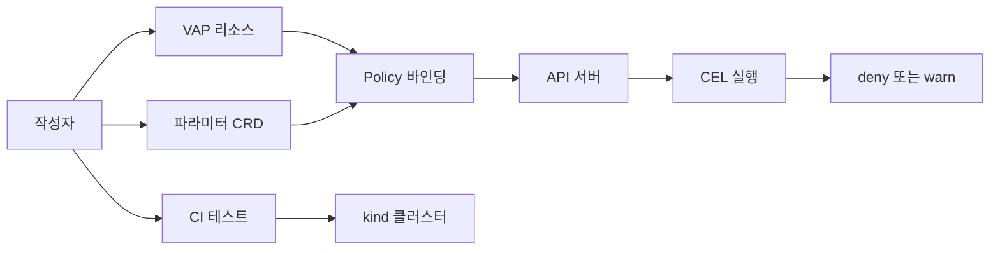

# Validating Admission Policy (저작 관점)

이 글은 **정책 작성자 관점**에서 `ValidatingAdmissionPolicy`(VAP)의
**CEL 문법·파라미터 CRD 설계·테스트 방법**을 다룬다. VAP가 무엇인지·
언제 쓰나·운영 롤아웃은 이미
[security/Admission Controllers](../security/admission-controllers.md)
에서 다룬다. 여기서는 **CEL 표현식을 어떻게 안전하고 빠르게 작성하나**
에 집중한다.

정책 저자가 답해야 할 핵심 질문은 여섯 가지다.

1. **CEL의 어디까지 쓸 수 있나** — macro·표준 라이브러리·K8s 확장
2. **파라미터는 어떻게 설계하나** — ConfigMap vs 사용자 CRD
3. **표현식을 재사용하려면** — variables·match conditions
4. **타입 안전성을 보장하려면** — typeChecking과 `status`
5. **정책이 의도대로 동작하는지 어떻게 검증하나** — CEL 플레이·kind e2e
6. **CEL 비용 예산을 어떻게 맞추나** — maxItems·early exit

> 관련: [security/Admission Controllers](../security/admission-controllers.md)
> · [Admission Webhook 개발](./admission-controllers.md)
> · [CRD](./crd.md)

---

## 1. VAP 저작 흐름



세 리소스가 한 세트다.

- **`ValidatingAdmissionPolicy`**: CEL 규칙 정의(로직).
- **`ValidatingAdmissionPolicyBinding`**: 어느 네임스페이스·리소스에
  적용할지(범위).
- **파라미터 CRD**(선택): 정책이 참조하는 "값"(설정).

로직과 범위와 값이 분리되어 **동일 로직을 여러 환경에 다른 파라미터로
적용**할 수 있다.

---

## 2. CEL 문법 기초

쿠버네티스 CEL은 **단일 표현식**이다. 값 하나를 반환하는 한 줄~몇 줄짜리
식. Go·JavaScript 문법과 비슷하지만 **제한된 언어**다.

### 비교·논리·조건

```cel
self.minReplicas <= self.replicas && self.replicas <= self.maxReplicas

type(self) == string ? self == '99%' : self == 42

has(self.expired) && self.created + self.ttl < self.expired
```

### Macro

| Macro | 의미 |
|-------|------|
| `has(field)` | 필드 존재 여부. null safe 접근의 기본 |
| `all(x, pred)` | 모든 원소가 predicate 만족 |
| `exists(x, pred)` | 하나 이상 만족 |
| `exists_one(x, pred)` | 정확히 하나 만족 |
| `map(x, expr)` | 변환 |
| `filter(x, pred)` | 필터 |

### Null 안전 접근(Optional)

`.?`로 **경로가 없어도 에러 없이** null을 반환한다(1.25+).

```cel
self.metadata.?annotations.?['policy.io/skip']       // 없으면 null
self.spec.?containers.?[0].?image                    // 깊은 경로
```

`optional` 타입(1.29+)으로 명시적 처리 가능.

```cel
optional.of('value').hasValue()              // true
optional.none().orValue('default')           // 'default'
```

---

## 3. Kubernetes 고유 CEL 라이브러리

K8s가 CEL에 얹은 확장 함수 모음. 버전별로 점진 추가됐다. 값은
해당 라이브러리가 **Kubernetes API에서 일반 사용 가능해진 시점**
(CRD Validation Rules·VAP 양쪽에서 안정적으로 쓸 수 있는 버전) 기준.
정확한 현행 상태는 공식 [CEL in Kubernetes](https://kubernetes.io/docs/reference/using-api/cel/)
문서 확인.

| 라이브러리 | 도입 | 대표 함수 |
|-----------|------|----------|
| List | 1.25 | `isSorted()`, `sum()`, `min()`, `max()`, `indexOf()` |
| Regex | 1.25 | `.matches('^ok.*')`, `.find()`, `.findAll()` |
| URL | 1.25 | `url.parse(s).getHost()`, `getScheme()`, `getPort()` |
| Authorizer | 1.27 (alpha 1.26) | `authorizer.group(g).resource(r).verb(v).check().allowed()` |
| Quantity | 1.29 | `quantity.parse('1Gi') < quantity.parse('2Gi')` |
| IP·CIDR | 1.30 | `ip.parse()`, `cidr.parse().containsIP(...)` |
| Format | 1.32 | `format.base64.encode('x')` |
| Semver | 1.34 | `semver.compare('1.2.3', '1.2.4') < 0` |

### CEL 타입 체계

| 타입 | 예 |
|------|-----|
| `int`·`uint` | `1`, `3u` |
| `double` | `1.5` |
| `string`·`bytes` | `'hello'`, `b'hello'` |
| `bool` | `true`, `false` |
| `list`·`map` | `[1,2,3]`, `{'a': 1}` |
| `null_type`·`dyn` | null·동적 |
| `timestamp`·`duration` | `timestamp('2026-01-01T00:00:00Z')`, `duration('5s')` |

CEL은 `integer`가 아니라 `int`·`uint`를 쓴다. `int(x)` 변환이 자주
필요하다.

### Authorizer 활용

VAP만의 강력한 기능. **요청자의 다른 리소스 권한**을 정책 안에서 교차
검증한다. Webhook 없이 가능한 유일한 CEL 경로.

```yaml
validations:
  - expression: |
      object.spec.secretName == "" ||
      authorizer.group("").resource("secrets")
        .namespace(object.metadata.namespace)
        .name(object.spec.secretName)
        .check("get").allowed()
    message: "참조하는 Secret을 조회할 권한이 필요합니다"
```

### Quantity·IP·CIDR

리소스 예산·네트워크 정책 작성 시 핵심.

```yaml
- expression: >-
    object.spec.containers.all(c,
      quantity.parse(c.resources.limits.memory) <= quantity.parse("4Gi"))
  message: "memory limit 4Gi 초과 금지"

- expression: >-
    object.spec.clusterIPs.all(a,
      cidr.parse("10.0.0.0/8").containsIP(ip.parse(a)))
  message: "clusterIP는 10.0.0.0/8 내부만 허용"
```

---

## 4. VAP 리소스의 저작 요소

```yaml
apiVersion: admissionregistration.k8s.io/v1
kind: ValidatingAdmissionPolicy
metadata:
  name: replica-limit.example.com
spec:
  failurePolicy: Fail
  paramKind:
    apiVersion: policy.example.com/v1
    kind: ReplicaLimit
  matchConstraints:
    resourceRules:
      - apiGroups: ["apps"]
        apiVersions: ["v1"]
        operations: ["CREATE", "UPDATE"]
        resources: ["deployments"]
  matchConditions:
    - name: exclude-system
      expression: "!object.metadata.namespace.startsWith('kube-')"
  variables:
    - name: desired
      expression: "object.spec.replicas"
    - name: limit
      expression: "int(params.maxReplicas)"
  validations:
    - expression: "variables.desired <= variables.limit"
      reason: Invalid
      messageExpression: >-
        "replicas must be <= " + string(variables.limit) +
        ", got " + string(variables.desired)
  auditAnnotations:
    - key: replicas
      valueExpression: "string(variables.desired)"
```

### 필수 저작 요소

| 필드 | 역할 |
|------|------|
| `matchConstraints.resourceRules` | 어떤 리소스·동사를 대상으로 할지 |
| `matchConstraints.excludeResourceRules` | 제외 리소스(예: 감사 이벤트) |
| `matchConstraints.matchPolicy` | `Exact` 또는 `Equivalent`. CRD가 복수 버전을 서빙하면 `Equivalent` 권장 |
| `matchConditions` | **CEL 사전 필터**. 뒤이은 validations·audit 비용 절감 |
| `variables` | **재사용 가능한 식**. 중복 평가 방지 |
| `validations` | 검증 규칙 목록 |
| `auditAnnotations` | audit 이벤트에 남길 값 |
| `paramKind` | 파라미터 리소스 종류 |

### CEL에서 참조 가능한 변수

| 변수 | 내용 |
|------|------|
| `object` | 생성·갱신되는 새 객체(DELETE에선 null) |
| `oldObject` | 기존 객체(CREATE에선 null) |
| `request` | AdmissionRequest 메타 |
| `namespaceObject` | 대상 네임스페이스 객체 |
| `params` | `paramKind`가 참조하는 파라미터 리소스 |
| `authorizer` | RBAC 교차 검증 |
| `variables` | `spec.variables`로 선언한 컴포지트 값 |

**`request` 하위 필드**(자주 쓰는 것):

| 필드 | 의미 |
|------|------|
| `request.uid` | 요청 ID |
| `request.operation` | `CREATE`·`UPDATE`·`DELETE`·`CONNECT` |
| `request.dryRun` | `true`이면 dry-run 요청 |
| `request.userInfo.username` | 요청자 username |
| `request.userInfo.groups` | 요청자 group list |
| `request.resource` | `{group, version, resource}` |
| `request.subResource` | `status`·`scale`·빈 문자열 |
| `request.name`·`request.namespace` | 대상 객체 이름·네임스페이스 |
| `request.requestKind` | `{group, version, kind}` |

---

## 5. 파라미터 CRD 설계

정책 **로직**은 `ValidatingAdmissionPolicy`에, **값**은 별도 CRD 또는
ConfigMap으로 분리한다. 로직 변경 없이 값만 환경별로 교체할 수 있다.

### 파라미터 CRD 스켈레톤

```yaml
apiVersion: apiextensions.k8s.io/v1
kind: CustomResourceDefinition
metadata:
  name: replicalimits.policy.example.com
spec:
  group: policy.example.com
  scope: Cluster                  # 대부분 cluster-scoped
  names:
    kind: ReplicaLimit
    plural: replicalimits
  versions:
    - name: v1
      served: true
      storage: true
      schema:
        openAPIV3Schema:
          type: object
          properties:
            spec:
              type: object
              required: [maxReplicas]
              properties:
                maxReplicas:
                  type: integer
                  minimum: 1
                  maximum: 10000
```

```yaml
apiVersion: policy.example.com/v1
kind: ReplicaLimit
metadata:
  name: prod-limit
spec:
  maxReplicas: 50
```

### 바인딩에서 참조

```yaml
apiVersion: admissionregistration.k8s.io/v1
kind: ValidatingAdmissionPolicyBinding
metadata:
  name: replica-limit-prod
spec:
  policyName: replica-limit.example.com
  paramRef:
    name: prod-limit
    parameterNotFoundAction: Deny   # Allow 또는 Deny
  validationActions: [Deny, Audit]
  matchResources:
    namespaceSelector:
      matchLabels:
        env: prod
```

| 옵션 | 의미 |
|------|------|
| `paramRef.name` | 특정 파라미터 인스턴스 참조 |
| `paramRef.selector` | label selector로 여러 인스턴스 선택 |
| `parameterNotFoundAction` | 파라미터 누락 시 `Allow`/`Deny` |
| `paramRef.namespace` | namespace-scoped 파라미터 사용 시 |

### 설계 원칙

- **ConfigMap**은 쉽지만 스키마·검증이 약하다. 파라미터가 복잡해지면
  CRD로 간다.
- **파라미터 CRD도 CEL 검증을 건다**. `x-kubernetes-validations`으로
  `maxReplicas <= 10000`을 검사해 정책 입력을 사전 차단.
- 파라미터 리소스는 **보통 cluster-scoped**. 네임스페이스별로 다른
  값을 주려면 `paramRef.selector`로 여러 파라미터 인스턴스를 매핑하거나
  별도 바인딩을 생성한다.
- `parameterNotFoundAction: Deny`가 **보안 기본값**. Allow는 파라미터
  누락 시 정책이 침묵하는 위험.

### Cluster-scoped vs Namespace-scoped 파라미터

| 파라미터 scope | `paramRef.namespace` | 동작 |
|---------------|---------------------|------|
| Cluster-scoped CRD | 사용 불가 | `paramRef.name`만 필요 |
| Namespaced CRD | 명시하지 않음 | **요청 대상 리소스의 네임스페이스**에서 조회 |
| Namespaced CRD | 명시 | 지정 네임스페이스에서 조회 |

멀티테넌트 정책에서는 **Namespaced 파라미터 + `paramRef.namespace` 미
지정**이 자주 쓰인다. 요청 네임스페이스에 따라 자동으로 다른 파라미터를
쓰게 된다.

---

## 6. Variables로 재사용과 가독성

긴 식이 반복되면 **`spec.variables`로 이름을 붙여** 재사용한다. VAP 내
모든 validations·auditAnnotations에서 `variables.<name>`으로 참조.

```yaml
variables:
  - name: allContainers
    expression: "object.spec.containers + object.spec.initContainers.orValue([])"
  - name: images
    expression: "variables.allContainers.map(c, c.image)"
  - name: hasLatestTag
    expression: "variables.images.exists(i, i.endsWith(':latest') || !i.contains(':'))"
validations:
  - expression: "!variables.hasLatestTag"
    message: "latest 태그 금지"
  - expression: "variables.allContainers.all(c, has(c.resources.limits))"
    message: "모든 컨테이너에 limits 필수"
```

- `variables`는 **lazy evaluation**. 참조될 때만 평가되고, **한 번
  평가되면 결과가 캐싱**되어 여러 validation이 재참조해도 비용이 한
  번만 든다.
- **선언 순서상 앞쪽** variable만 참조 가능. 뒤쪽 variable 참조는
  불가(순환 차단). 의존 순서대로 정렬해야 한다.
- 의도 있는 이름은 validation 메시지·auditAnnotations와 조합해 로그
  가독성을 크게 높인다.

---

## 7. matchConditions로 범위 좁히기

`matchConstraints`의 apiGroup·operation 필터 뒤에 한 번 더 CEL 필터를
걸 수 있다. 자기 네임스페이스·특정 라벨·annotation 기준으로 **빠르게
제외**해 validations 비용을 줄인다.

```yaml
matchConditions:
  - name: exclude-system
    expression: "!object.metadata.namespace.startsWith('kube-')"
  - name: opt-in-only
    expression: |
      has(object.metadata.labels) &&
      object.metadata.labels['policy.example.com/enforce'] == 'true'
```

- **정책당 최대 64개** 조건(webhook `matchConditions`와 같은 스펙이지만
  리소스 단위가 다르다).
- **선언 순서대로 평가**되고 첫 false에서 중단(short-circuit AND).
  비용 큰 조건을 뒤로 배치하면 총비용이 준다.
- `matchConditions` 평가 자체에도 cost budget이 있다(본편의 약 1/10).
- 요청자 식별이나 IP 기반 필터는 `request.userInfo`·`authorizer`로 가능.

---

## 8. Validations·Audit·Warn

### validations 필드

```yaml
validations:
  - expression: "object.spec.replicas <= params.maxReplicas"
    message: "고정 메시지"
  - expression: "object.spec.replicas > 0"
    messageExpression: >-
      "replicas must be > 0, got " + string(object.spec.replicas)
    reason: Invalid
    fieldPath: ".spec.replicas"
```

- `message` vs `messageExpression`: 후자가 CEL로 동적 메시지 조립.
- `reason`: `Unauthorized`·`Forbidden`·`Invalid`·`RequestEntityTooLarge`.
  HTTP 코드·클라이언트 에러 타입에 매핑된다.
- `fieldPath`: 에러를 전체 객체가 아니라 **구체 필드**에 귀속시킨다.
  kubectl 출력에서 해당 필드가 강조된다.

### auditAnnotations

Audit 이벤트에 남는 키·값. 위반 패턴 분석에 활용.

```yaml
auditAnnotations:
  - key: replicas
    valueExpression: "string(object.spec.replicas)"
  - key: image
    valueExpression: "object.spec.containers[0].image"
```

### validationActions 조합

| 조합 | 허용 | 의미 |
|------|:----:|------|
| `[Audit]` | ✅ | 위반 시 audit log만 |
| `[Warn]` | ✅ | 클라이언트에 Warning 헤더 |
| `[Deny]` | ✅ | 거절 |
| `[Warn, Audit]` | ✅ | 경고 + 기록 |
| `[Deny, Audit]` | ✅ | 거절 + 기록 |
| `[Deny, Warn]` | ❌ | 중복 의미(Deny에 Warning 암시) |

운영 관점 롤아웃 단계는 security 글 참조.

### auditAnnotations가 남는 위치

auditAnnotations는 **`audit.k8s.io/v1 Event`의 `annotations` 맵**에
주입된다. 키는 `<policy-name>/<annotation-key>` prefix가 붙고, audit
policy level이 **`Metadata` 이상**이어야 기록된다. 운영 파이프라인은
[security/Audit Logging](../security/audit-logging.md) 참조.

---

## 9. typeChecking

**정책 생성 시점**에 apiserver가 CEL 표현식의 타입을 검증한다. 잘못된
필드 참조·타입 불일치를 즉시 warning으로 반환한다.

```bash
kubectl describe validatingadmissionpolicy replica-limit.example.com
...
Status:
  Type Checking:
    Expression Warnings:
      - FieldRef: spec.validations[0].expression
        Warning: |
          no such key: replica
          (did you mean "replicas"?)
```

- 경고는 **정책을 거부하지 않는다**. 로그·CI에서 반드시 점검.
- `matchConstraints.resourceRules`로 타깃 타입이 결정되면 apiserver가
  해당 타입으로 타입 검사.
- CRD를 타깃으로 하면 해당 CRD의 OpenAPI schema 품질이 typeChecking
  정확도에 직결. [CRD](./crd.md)에서 `description`·`required`를
  충실히 작성하라는 이유.

### 런타임 평가 실패와 failurePolicy

CEL이 런타임에 실패하는 경우(null 역참조, cost 초과, 타입 에러):

- `failurePolicy: Fail` — 요청 거절(보안 기본값).
- `failurePolicy: Ignore` — 요청 통과. 실패 사실은 audit annotation에만
  기록.

가장 흔한 원인은 **null 역참조**다. `object.spec.foo`가 `foo`가 없을
때 터진다. 반드시 **`has(object.spec.foo) && ...`**·**`.?`** 연산자로
가드한다. typeChecking이 잡지 못하는 런타임 에러가 실제 배포에서
노출되는 주 경로.

---

## 10. 비용 예산

CEL 식마다 **runtime cost budget**과 **estimated cost limit**이 있다.
초과 시 정책 등록 자체 거부(estimated) 또는 실행 시 실패(runtime).

### 실무 가이드

- **입력 크기 제한**: `maxItems`·`maxLength`가 스키마에 있으면 CEL이
  비용을 낮게 추정한다. 타깃 CRD에 반드시 제한값 선언.
- **early exit**: `all()`·`exists()`는 첫 결정에서 종료된다. 리스트
  순회 로직은 가능한 이 매크로로.
- **nested 루프 회피**: `containers.all(c, images.exists(...))`처럼
  O(n·m) 패턴은 빠르게 커진다. variables로 먼저 `map()`한 리스트를
  캐싱.
- **regex 주의**: 긴 문자열에 `.*pattern.*`은 비싸다. `contains`·
  `startsWith` 우선.
- **matchConditions로 선제 컷**: validations를 아예 안 돌게 만들어
  총비용 감소.

---

## 11. 테스트 전략

### CEL 플레이그라운드 수준

- [playcel.io](https://playcel.io/) 또는 [cel.dev/play](https://cel.dev/play)
  에서 표현식을 대화형으로 검증.
- 객체 샘플 JSON을 넣고 식이 true/false·값을 내는지 즉시 확인.

### 단위 테스트

정책 YAML과 대표 Object 샘플(`testdata/`)로 `kubectl --dry-run=server
apply`에 태워 응답을 비교.

```bash
kubectl --dry-run=server apply -f deny-case/deployment.yaml 2>&1 \
  | grep -q "replicas must be"
```

### 통합 테스트

`kind` 클러스터에 **정책 + 바인딩 + 파라미터 CRD**를 올리고 여러 샘플
리소스를 적용·삭제해 결과 검증.

```bash
kind create cluster --image kindest/node:v1.34.0
kubectl apply -f policy.yaml -f binding.yaml -f params.yaml
kubectl apply -f cases/valid.yaml      # 성공해야 함
kubectl apply -f cases/denied.yaml     # 실패 + 메시지 일치
```

### Golden 테스트

응답 메시지·`reason`·`fieldPath`를 골든 파일과 비교. reasons 문자열
변경 regression 탐지.

### Chainsaw 스크립트

e2e 선언적 시나리오. VAP 배포 → valid·invalid 케이스 순차 검증.

```yaml
apiVersion: chainsaw.kyverno.io/v1alpha1
kind: Test
spec:
  steps:
    - try:
        - apply: {file: policy.yaml}
        - apply: {file: binding.yaml}
        - apply: {file: cases/valid.yaml}
        - apply:
            file: cases/denied.yaml
            expect:
              - check:
                  status: Failure
                  reason: Invalid
```

---

## 12. Gatekeeper·Kyverno에서의 VAP 생성

OPA Gatekeeper(v3.16+)와 Kyverno(1.11+)는 **기존 정책을 VAP로 변환**해
apiserver에서 직접 실행하는 모드를 제공한다.

- Gatekeeper: `ConstraintTemplate`에 `generateVAP: true` 설정.
- Kyverno: 지원되는 정책 형태를 감지해 자동 VAP 생성.

장점: 기존 Rego·Kyverno DSL 자산을 유지하면서 webhook 네트워크 홉 제거.
단점: 일부 고급 기능(외부 조회·복잡한 조합)은 VAP로 변환 불가 → 해당
정책은 기존 engine webhook 유지.

---

## 13. 개발 완료 체크리스트

- [ ] **파라미터 CRD**에 `openAPIV3Schema` + `x-kubernetes-validations`
  작성. 입력을 사전 차단.
- [ ] `paramRef.parameterNotFoundAction: Deny` 기본. Allow는 의도적
  선택일 때만.
- [ ] `matchConditions`로 범위를 좁혀 validations 호출 수 최소화.
- [ ] 긴 식은 `variables`로 추출. 재사용·가독성·성능 모두 개선.
- [ ] `messageExpression`·`fieldPath`·`reason`을 적극 활용한 **행동
  가능한 오류 메시지**.
- [ ] typeChecking 경고가 0이 되도록 수정. CI에서 `status.typeChecking`
  을 검사.
- [ ] 대상 CRD/리소스에 `maxItems`·`maxLength` 선언. CEL 비용 추정
  정확도 확보.
- [ ] `playcel.io` 기반 샘플 테스트 + `kubectl --dry-run=server`
  검증 + kind/Chainsaw e2e 3단 피라미드.
- [ ] `Deny + Audit` 조합으로 auditAnnotations을 **분석 가능한 키·
  값**으로.
- [ ] Gatekeeper·Kyverno 쓰면 VAP 생성 모드 활용. 핵심 정책부터 점진
  전환.
- [ ] 정책 라이프사이클: `Audit` → `Warn, Audit` → `Deny, Audit`
  롤아웃. 상세는
  [security/Admission Controllers](../security/admission-controllers.md).

---

## 참고 자료

- Kubernetes 공식 — Validating Admission Policy:
  https://kubernetes.io/docs/reference/access-authn-authz/validating-admission-policy/
- Kubernetes 공식 — CEL in Kubernetes:
  https://kubernetes.io/docs/reference/using-api/cel/
- Kubernetes Blog — VAP GA (1.30):
  https://kubernetes.io/blog/2024/04/24/validating-admission-policy-ga/
- CEL Spec — google/cel-spec:
  https://github.com/google/cel-spec
- CEL Playground:
  https://playcel.io/
- CEL dev playground:
  https://cel.dev/play
- KEP-3488 CEL for Admission Control:
  https://github.com/kubernetes/enhancements/tree/master/keps/sig-api-machinery/3488-cel-admission-control
- Datree — VAP local testing guide:
  https://github.com/datreeio/validating-admission-policy
- OPA Gatekeeper VAP integration:
  https://open-policy-agent.github.io/gatekeeper/website/docs/validating-admission-policy/
- Kyverno — Validating policy types:
  https://kyverno.io/docs/policy-types/

확인 날짜: 2026-04-24
