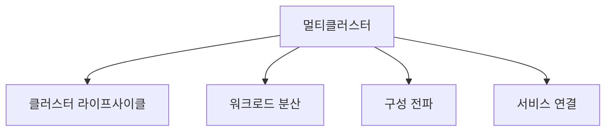
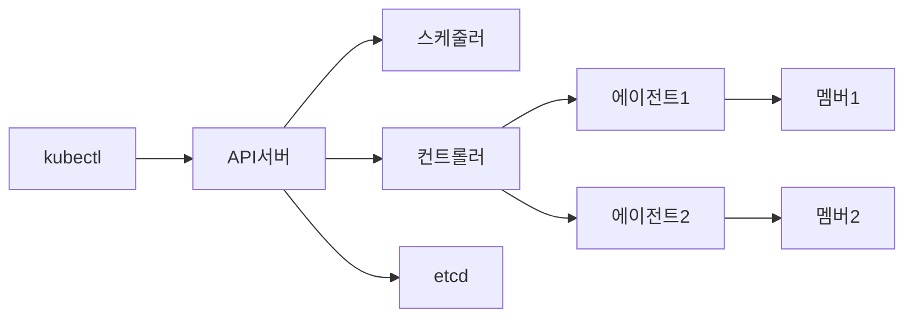
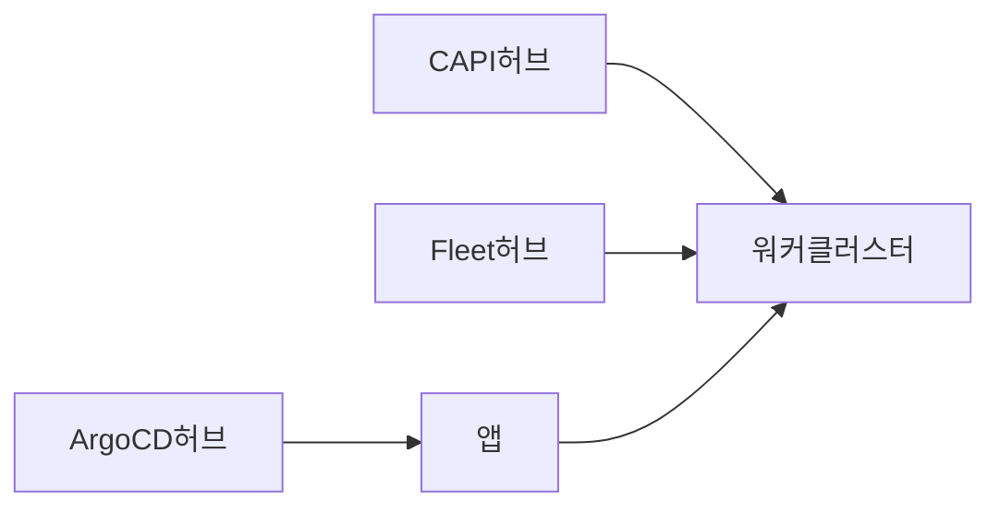
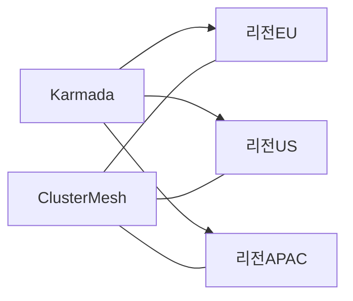
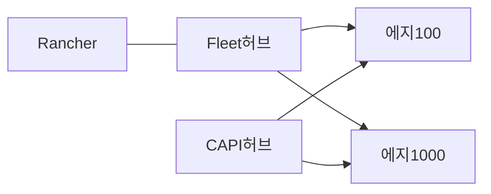

# 멀티클러스터 패턴 — Karmada · Fleet · Cluster API

> 클러스터를 "하나 더 늘리는" 순간, 멀티테넌시는 "다른 문제"가 된다.
> 한 클러스터 안에서는 RBAC·네임스페이스·정책만 맞추면 되지만,
> 클러스터가 N개가 되면 **프로비저닝·업그레이드·워크로드 분산·구성 전파·서비스 디스커버리·아이덴티티 연합** 이
> 각각 독립된 엔지니어링 영역이 된다.

선행 글의 테넌시 스펙트럼(NaaS·CPaaS·CaaS)에서 가장 오른쪽, **"한 클러스터로는 해결되지 않을 때"** 의 도메인이다.
CaaS가 여러 개로 증식하는 순간 테넌시 문제는 다시 **멀티클러스터 오케스트레이션 문제**로 변형된다.

- [멀티테넌시 개요](./multi-tenancy-overview.md) — 한 클러스터 안에서 테넌트 격리.
- [vCluster·Capsule](./vcluster-capsule.md) — 가상/네임스페이스 테넌시.

이 글은 그 다음 레이어, 즉 "여러 클러스터를 묶는" 세 가지 대표 도구의
역할 경계와 조합 패턴을 정리한다.

---

## 1. 왜 멀티클러스터가 되는가

싱글 클러스터를 고집하는 편이 대부분 운영에 유리하지만,
다음 중 하나가 해당되면 거의 예외 없이 멀티클러스터로 간다.

| 동기 | 전형적 상황 |
|------|-------------|
| Blast radius 격리 | 상호 불신 고객, 규제 환경, M&A로 들어온 조직 |
| 지역·지연 최소화 | 사용자 지역별 클러스터(aeu, apn, use) |
| 고가용성·DR | 리전/AZ 장애 시 전체 중단 불가 |
| 데이터 주권·에어갭 | GDPR·국가법·산업망·생산현장 |
| 버전·업그레이드 위험 분산 | canary cluster 선행 업그레이드 |
| 스케일 상한 | etcd·API server 단일 클러스터의 수평 한계 |
| 에지 | 수백~수만 개 소형 클러스터(공장, 매장, 장비) |
| 조직 경계 | 사업부 단위 자율 운영, 책임 분리 |

멀티클러스터는 공짜가 아니다. 도입 즉시 **4개 축**의 엔지니어링 부담이 생긴다.



각 축을 푸는 대표 도구가 바로 **Cluster API, Karmada, Fleet/ArgoCD, Service Mesh**다.

---

## 2. 네 축 — 각각 다른 문제

| 축 | 핵심 질문 | 대표 도구 |
|----|----------|----------|
| 라이프사이클 | 클러스터를 어떻게 선언적으로 만들고 업그레이드하나 | **Cluster API(CAPI)**, Rancher Turtles, Talos, Gardener |
| 워크로드 분산 | 한 워크로드를 여러 클러스터에 어떻게 스케줄·페일오버하나 | **Karmada**, Open Cluster Management(OCM), KubeAdmiral |
| 구성 전파 | N개 클러스터에 YAML/Helm을 어떻게 일관 배포하나 | **Fleet**, **ArgoCD ApplicationSet**, Flux MultiClusterController |
| 서비스 연결 | 클러스터를 넘어 서비스 이름으로 호출하는 법 | Istio/Cilium ClusterMesh, Linkerd Multi-cluster (상세는 [network/](../../network/)) |

이 글은 앞 세 축의 대표 도구를 집중적으로 다룬다. 네 번째 축(mesh·CNI)은 해당 카테고리 참조.

---

## 3. Cluster API — 클러스터 그 자체를 선언적 리소스로

### 3.1 정체성

- SIG Cluster Lifecycle의 공식 서브프로젝트, **Kubernetes 네이티브 클러스터 라이프사이클 API**.
- 2026-04 기준 **v1.13.x 계열**(2026-04 라인), Apache 2.0.
- **Management Cluster**(CAPI 컨트롤러 실행) ↔ **Workload Cluster**(관리 대상) 구조.

### 3.2 핵심 CRD

```yaml
apiVersion: cluster.x-k8s.io/v1beta2
kind: Cluster
metadata:
  name: prod-eu-01
spec:
  topology:
    class: prod-standard
    version: v1.33.2
    controlPlane:
      replicas: 3
    workers:
      machineDeployments:
        - class: worker
          name: md-0
          replicas: 6
  clusterNetwork:
    pods:      { cidrBlocks: [10.244.0.0/16] }
    services:  { cidrBlocks: [10.96.0.0/12] }
```

주요 리소스:

| 리소스 | 역할 |
|--------|------|
| `Cluster` | 하나의 워크로드 클러스터 선언 |
| `ClusterClass` | 같은 모양 클러스터를 찍어내는 템플릿 |
| `Machine` | 개별 노드 |
| `MachineDeployment` / `MachineSet` | 워커 노드 풀·롤링 업데이트 |
| `KubeadmControlPlane` / `*ControlPlane` | 컨트롤 플레인 관리 |
| `MachineHealthCheck` | 노드 건강 모니터링·자동 교체 |

### 3.3 Provider 모델

CAPI는 코어가 아니라 **Provider 조합**으로 실제 인프라를 다룬다.

| Provider 종류 | 역할 | 대표 구현 |
|---------------|------|----------|
| Infrastructure | VM/네트워크/LB 프로비저닝 | CAPA(AWS), CAPZ(Azure), CAPG(GCP), CAPV(vSphere), CAPM3(Metal3), CAPO(OpenStack), CAPD(Docker, 테스트용) |
| Bootstrap | 노드 부트스트랩 구성 생성 | kubeadm(기본), MicroK8s, Talos, K3s |
| Control Plane | 컨트롤 플레인 수명주기 | KubeadmControlPlane, K3s, Talos, RKE2 |

**온프레미스 운영의 표준 조합**은 CAPM3(Metal3) + kubeadm + KubeadmControlPlane,
혹은 CAPV(vSphere) + Talos.
Rook-Ceph·Cilium·Gateway API 같은 스택은 별도 add-on으로 주입
(ClusterResourceSet 또는 Fleet/ArgoCD).

### 3.4 ClusterClass — Managed Topology

**v1.9에서 GA**로 진입. v1.12부터 **Chained Upgrades**(한 번에 여러 minor 버전)와
실험적 **In-place Updates**(머신 재생성 없이 업그레이드)가 추가되어
베어메탈 환경의 업그레이드 비용이 크게 줄었다.
같은 모양의 클러스터를 대량 생성·업그레이드할 때의 기본기다.

```yaml
apiVersion: cluster.x-k8s.io/v1beta2
kind: ClusterClass
metadata:
  name: prod-standard
spec:
  controlPlane:
    ref: { kind: KubeadmControlPlaneTemplate, name: prod-cp }
  infrastructure:
    ref: { kind: Metal3ClusterTemplate, name: prod-infra }
  workers:
    machineDeployments:
      - class: worker
        template:
          bootstrap: { ref: { kind: KubeadmConfigTemplate, name: prod-worker } }
          infrastructure: { ref: { kind: Metal3MachineTemplate, name: prod-worker } }
```

### 3.5 Rancher Turtles와의 관계

Rancher 운영자가 많다면 **Rancher Turtles**를 통해 CAPI 클러스터를 Rancher가 관리하는
클러스터 컬렉션으로 임포트할 수 있다. CAPI의 선언성 + Rancher UI/Fleet 운영을 결합.

### 3.6 CAPI의 경계 — 하지 않는 일

- **워크로드 분산**: CAPI는 "클러스터를 만든다"로 끝난다. 그 위에 무엇을 배포하는가는 다른 도구의 몫.
- **클러스터 간 서비스 연결**: Service Mesh·DNS 연합 영역.
- **Day-2 운영**: 노드 교체·업그레이드는 돕지만, Kyverno/Prometheus/Vault 같은 add-on 설치는
  `ClusterResourceSet`으로만 최소 지원. 일반적으로 **Fleet/ArgoCD와 결합**한다.

---

## 4. Karmada — 여러 클러스터에 워크로드 스케줄

### 4.1 정체성

- **CNCF Incubating 프로젝트**, Huawei·CNCF 커뮤니티 공동 개발.
- 2026 기준 **v1.17.1**(2026-03), Apache 2.0, Kubernetes 1.24~1.35 호환 확인.
- "쿠버네티스 네이티브 API로 멀티클러스터 스케줄러를 한 번 더 씌운다"는 접근.

### 4.2 아키텍처



컴포넌트:

- **karmada-apiserver** — Kubernetes API와 동일한 스펙의 컨트롤 플레인 API.
- **karmada-scheduler** — 멤버 클러스터에 리소스를 어느 비율/어느 조건으로 배치할지 결정.
- **karmada-controller-manager** — Binding, Work, EndpointSlice 동기화.
- **karmada-webhook** — 정책 유효성 검증.
- **karmada-agent** / **push-mode** — 멤버 클러스터에 실제 리소스 적용.
- **karmada-descheduler**(옵션) — 런타임에 재배치.

테넌트·팀은 karmada-apiserver에 `kubectl`로 붙이고, 일반 Deployment/Service를 만든다.
그 뒤 **PropagationPolicy**가 "이걸 어느 클러스터로 보낼지"를 결정한다.

### 4.3 핵심 CRD

```yaml
apiVersion: policy.karmada.io/v1alpha1
kind: PropagationPolicy
metadata:
  name: nginx-propagate
  namespace: default
spec:
  resourceSelectors:
    - apiVersion: apps/v1
      kind: Deployment
      name: nginx
  placement:
    clusterAffinity:
      clusterNames: [cluster-eu-01, cluster-us-01]
    replicaScheduling:
      replicaSchedulingType: Divided
      replicaDivisionPreference: Weighted
      weightPreference:
        staticWeightList:
          - targetCluster: { clusterNames: [cluster-eu-01] }
            weight: 2
          - targetCluster: { clusterNames: [cluster-us-01] }
            weight: 1
```

| CRD | 역할 |
|-----|------|
| `PropagationPolicy` (namespace) / `ClusterPropagationPolicy` (cluster) | 리소스 ↔ 대상 클러스터 매핑·스케줄링 |
| `OverridePolicy` / `ClusterOverridePolicy` | 클러스터별 필드 덮어쓰기(이미지 prefix, replica, env) |
| `ResourceBinding` / `ClusterResourceBinding` | 스케줄 결과가 담기는 내부 리소스 |
| `Work` | 멤버 클러스터로 실제 전달되는 리소스 단위 |
| `Cluster` | 멤버 클러스터 등록 |

### 4.4 스케줄링 전략

| 전략 | 설명 | 사용 |
|------|------|------|
| `Duplicated` | 모든 대상 클러스터에 동일 replica 생성 | DR·지역 동기 복제 |
| `Divided` / `Weighted` | 가중치 비율로 replica 분할 | 비용·지연 최적화 |
| `Divided` / `Aggregated` | 용량 많은 클러스터에 몰아주기 | bin-packing |
| `spreadConstraint` | 지역·provider 기준 분산 | 리전 장애 대비 |
| Failover | 클러스터 실패 시 자동 재스케줄 | HA |

### 4.5 Federated HPA와 Multi-cluster Service

멀티클러스터가 "배포 N번"을 넘어 **한 덩어리의 런타임**으로 동작하려면
두 가지가 더 필요하다. Karmada는 이를 네이티브 CRD로 제공한다.

**FederatedHPA** (`autoscaling.karmada.io/v1alpha1`, v1.6+): 여러 멤버 클러스터에 분할 배포된
워크로드의 **총 replica 수를 단일 HPA처럼 스케일**한다. 멤버별 현재 replica 합산 + 메트릭 집계 →
karmada-scheduler의 분할 전략에 따라 재배포.

```yaml
apiVersion: autoscaling.karmada.io/v1alpha1
kind: FederatedHPA
metadata:
  name: nginx
  namespace: default
spec:
  scaleTargetRef:
    apiVersion: apps/v1
    kind: Deployment
    name: nginx
  minReplicas: 6
  maxReplicas: 60
  metrics:
    - type: Resource
      resource:
        name: cpu
        target:
          type: Utilization
          averageUtilization: 60
```

**Multi-cluster Service** (MCS API): 한 클러스터에서 `kind: ServiceExport`로 서비스를 내보내면,
다른 멤버 클러스터에서 `ServiceImport`를 통해 동일 DNS 이름으로 호출할 수 있다.
Karmada는 SIG Multicluster의 MCS API를 구현하므로
Cilium ClusterMesh나 Submariner 없이도 기본 수준의 서비스 연합이 가능하다.
단, 네트워크 평면(L3)까지 연결되어야 실제 트래픽이 흐른다는 점은 주의.

### 4.6 Karmada의 강점과 주의점

| 강점 | 주의점 |
|------|--------|
| Kubernetes API 그대로 사용 — 기존 YAML·kubectl 그대로 | karmada-apiserver가 SPOF, HA 구성 필수 |
| 가중치·리전·용량 기반 스케줄링 | 멤버 클러스터 버전 스큐 관리 필요 |
| Failover·재배치 자동화 | CRD 전파는 가능하나 **cluster-scoped CRD**는 주의(네임스페이스 정책과 충돌) |
| FederatedHPA·MCS 기본 제공 | 관찰성: karmada-apiserver와 멤버 양쪽 모니터링 필요 |
| CNCF Incubating으로 거버넌스 투명 | 러닝커브가 Fleet보다 높음 |

---

## 5. Fleet — 대규모 GitOps 배포 엔진

### 5.1 정체성

- Rancher 팀이 만든 GitOps 도구. Rancher 없이 **standalone** 가능.
- 설계 목표: "최대 **백만 개** 클러스터의 에지 플릿을 관리".
- 2026 기준 **v0.15.x**, Apache 2.0.
- Raw YAML / Kustomize / Helm을 모두 받지만, 내부에서는 **Helm 기반 패키징 포맷으로 래핑**해
  일관된 배포 단위(Bundle)로 취급한다.

### 5.2 핵심 CRD

| CRD | 역할 |
|-----|------|
| `GitRepo` | Git 저장소와 경로 선언 |
| `Bundle` | 배포 단위(리소스 묶음), GitRepo가 자동 생성 |
| `BundleDeployment` | 특정 클러스터에 실제 배포된 Bundle 인스턴스 |
| `Cluster` | Fleet이 관리하는 다운스트림 클러스터 |
| `ClusterGroup` | 레이블 selector로 묶인 클러스터 집합 |
| `ClusterRegistration` | 다운스트림 클러스터 자동 등록 요청 |

### 5.3 타게팅 예시

```yaml
apiVersion: fleet.cattle.io/v1alpha1
kind: GitRepo
metadata:
  name: platform-addons
  namespace: fleet-default
spec:
  repo: https://github.com/org/platform-gitops
  branch: main
  paths: [charts/cilium, charts/prometheus]
  targets:
    - name: prod-eu
      clusterSelector:
        matchLabels: { env: prod, region: eu }
      helm:
        values:
          replicaCount: 5
    - name: prod-us
      clusterSelector:
        matchLabels: { env: prod, region: us }
```

- Bundle 안에 **클러스터별 values 오버라이드**가 선언적으로 들어간다.
- 재조정 주기·폴링 주기·업데이트 순서(bundle dependency)도 CRD에 명시.

### 5.4 Fleet이 잘하는 것

- **수천~수만 클러스터 에지** 관리 — 지속적 헬스체크·재시도·부분 배포 재개.
- Bundle별 기기별 값 주입 — 매장/지점/장비 단위 구성.
- Rancher UI 안에서 운영자 경험 일관.

### 5.5 Fleet의 경계

- **실시간 리소스 그래프·diff UI**는 ArgoCD만큼 풍부하지 않다.
- **워크로드 스케줄링**(replica 분할·failover) 기능은 없음 — 그건 Karmada 영역.
- 클러스터 **프로비저닝**은 Fleet 영역 아님 — Rancher provisioning 또는 CAPI로.

---

## 6. 보조 — ArgoCD ApplicationSet, OCM, KubeAdmiral

### 6.1 ArgoCD ApplicationSet

ArgoCD의 **하나의 Application → 하나의 클러스터** 한계를 벗어나기 위한 CRD.
`Cluster generator`가 ArgoCD에 등록된 클러스터 Secret(label selector 매칭)을 읽어
클러스터마다 Application을 자동 생성한다.
다른 Generator(Git file/directory, List, SCM, Pull Request)와 조합 가능.

- **강점**: ArgoCD UI의 리소스 그래프/diff/sync wave를 그대로 멀티클러스터에서 활용.
- **약점**: 클러스터 수천 개 규모에서는 application-controller 수평 확장 필수,
  Git repo 1개 기준 폴링 빈도·bandwidth에 유의.
- **ArgoCD 자체 CRD/패턴 상세는 [cicd/](../../cicd/) 참조.**

### 6.2 Open Cluster Management (OCM)

CNCF Sandbox, Red Hat 중심의 Placement·ManifestWork 기반 프레임워크.
Karmada와 유사 포지션이지만 **모듈러 API**에 가깝고, Policy·Observability 애드온 생태계가 강점.
Red Hat Advanced Cluster Management(RHACM) 또는 ACM 기반 플랫폼을 쓰는 조직에서는
OCM이 자연스러운 선택, Karmada보다 ACM 통합 맛이 낫다.

### 6.3 KubeAdmiral

ByteDance가 공개한 Karmada 포크 기반 멀티클러스터 스케줄러. 대규모 내부 운영에 맞게 확장.
특수 요구(수백만 Pod, 중국 CSP 환경)가 있을 때 검토.

---

## 7. 도구 비교

| 영역 | CAPI | Karmada | Fleet | ArgoCD ApplicationSet |
|------|:----:|:-------:|:-----:|:---------------------:|
| 클러스터 프로비저닝 | ✓ | ✗ | ✗ | ✗ |
| 워크로드 스케줄(Divided/Weighted/Failover) | ✗ | ✓ | ✗ | ✗ |
| GitOps 기반 Config 전파 | △(ClusterResourceSet) | △(PropagationPolicy) | ✓ | ✓ |
| 대규모 에지(수천~수만) | △(클러스터 자체 관리) | △ | ✓ | △ |
| 실시간 그래프·diff UI | ✗ | ✗(Dashboard 별도) | △(Rancher UI) | ✓ |
| 성숙도 | K8s SIG 공식 | CNCF Incubating | CNCF 편입 없음 | CNCF Graduated(ArgoCD) |
| 소유 조직 | Kubernetes 커뮤니티 | 커뮤니티(Huawei 기원) | SUSE/Rancher | Argo 커뮤니티 |
| 주된 역할 | 라이프사이클 | 스케줄링 | 구성 전파 | 애플리케이션 배포 |

---

## 8. 대표 아키텍처 — 조합이 기본이다

한 도구로 끝내지 말 것. 실무는 **축별로 다른 도구를 조합**한다.

### 8.1 베어메탈 · 온프레미스 플랫폼



- **CAPI + Metal3**: 베어메탈 워크로드 클러스터 자동 프로비저닝.
- **Fleet** 또는 **ArgoCD ApplicationSet**: 플랫폼 add-on(Cilium, Prometheus, Vault) 전파.
- 개별 팀 앱: ArgoCD로 개별 클러스터 배포.

### 8.2 멀티리전 SaaS



- **Karmada**가 리전 간 replica 분할·페일오버·버퍼링.
- **Cilium ClusterMesh** 또는 Istio multi-cluster가 서비스 연결.
- CAPI는 각 리전 클러스터의 프로비저닝·업그레이드 파이프라인.

### 8.3 에지(매장·공장) 플릿



- **Fleet**이 주연. 에지 장비에 Helm/YAML을 느슨하게 전파.
- **CAPI + RKE2**(또는 k3s/Talos)가 장비를 실제로 만들고 업그레이드.

---

## 9. 공통 함정

### 9.1 Identity Federation

멀티클러스터는 "한 사용자가 여러 클러스터에서 동일 권한을 갖도록" 하는 문제를 곧바로 만든다.

- **OIDC 통합**: 모든 클러스터의 kube-apiserver를 **동일 IdP**에 물리는 것이 출발점.
- 클러스터마다 RBAC이 다르면 감사 시 "누가 어디서 뭐 했나"를 풀기 어려움.
- Karmada/Fleet hub의 서비스어카운트 권한을 **member 클러스터에서 최소화**.
- 서비스↔서비스 워크로드 신원은 **SPIFFE/SPIRE** 또는 mesh의 Workload Identity federation.
  상세는 [security/](../../security/) 및 [network/](../../network/) 참조.

### 9.2 네임스페이스 충돌

같은 이름 네임스페이스가 다른 의미로 쓰이면 GitOps 전파가 사고가 된다.
**클러스터 + 네임스페이스**를 키로 한 네이밍 규약을 사전에 고정.

### 9.3 버전 스큐 관리

멀티클러스터는 "버전이 다른 상태"를 상시 인정해야 한다.

- Karmada: 멤버 클러스터 버전 스큐는 공식 테스트 범위 내에서만.
- CAPI: ClusterClass로 업그레이드 단계를 표준화, Chained Upgrade로 배치.
- Fleet/ArgoCD: 버전 전환 기간의 values/manifests 분기 전략.

### 9.4 DNS와 서비스 디스커버리

- 클러스터 내부 `svc.cluster.local`은 **클러스터 경계를 넘지 못한다**.
- 해결 축:
  - **SIG Multicluster MCS API**(ServiceExport/ServiceImport) — Karmada, ClusterMesh 등이 구현.
  - Service Mesh 기반(Cilium ClusterMesh, Istio multi-cluster, Linkerd) — 상세는 [network/](../../network/).
  - 외부 DNS + LB — 가장 단순, 그러나 클러스터 간 L7 인지 부족.
- 멀티클러스터 인그레스 표준은 Gateway API 생태계에서 계속 진화 중.

### 9.5 etcd·API server 부하

- Karmada/Fleet/ArgoCD hub는 자체 `etcd`·API server에 수만 개 Work/Application이 몰린다.
- **응답성 SLO 모니터링, compaction 주기, 리소스별 watch 효율**을 초기부터 설계.
- 단일 hub의 장애가 "N개 클러스터 동시에 운영 불가"로 번지지 않도록 **hub HA + 지역 hub 분할** 고려.

### 9.6 Hub 장애 모델과 DR

가장 자주 간과되는 함정. **Hub가 죽으면 워크로드가 같이 죽는가?** 아니다 — 하지만 "조건부"다.

| 도구 | Hub 장애 시 동작 |
|------|-----------------|
| **Karmada** | 이미 멤버에 전파된 `Work`는 member에서 계속 실행. **신규 전파·재스케줄·Failover는 중단**. MCS·FederatedHPA도 정지 |
| **Fleet** | 이미 전달된 Bundle은 member의 fleet-agent가 캐시 기반으로 유지. **신규 git 변경 반영은 중단** |
| **ArgoCD** | 이미 배포된 리소스는 member에서 동작. **drift 교정·새 배포는 중단** |
| **CAPI** | 이미 살아 있는 workload cluster는 정상. **새 Cluster/MachineDeployment·업그레이드·자동 복구는 중단** |

공통점: **Hub는 runtime 의존이 아니라 control-plane 의존**이다. 그래서 DR 전략은 두 갈래로 나뉜다.

**① Hub를 HA로**

- Karmada: karmada-apiserver·etcd 모두 HA(3+ replica)로 구성, 멤버 등록을 **pull 모드**로 두면 hub 일시 장애에도 agent가 자가 복구.
- Fleet/ArgoCD: 컨트롤러 2+ replica, leader election. Git 리포지토리는 별도 백업.
- CAPI: management cluster 자체를 멀티 AZ 또는 멀티 리전 백업.

**② Hub를 잃어도 되는 설계**

- Member는 가능한 한 **자율 동작**(stateful 데이터는 member에, global state는 재구축 가능하게).
- Hub 자체를 GitOps로 선언(Hub의 구성도 Git에). 장애 시 **새 Hub를 재현**할 수 있어야 한다.
- RTO/RPO 목표를 **"Hub 재구축 시간 vs 애플리케이션 중단 비용"** 으로 명시.

**Active-Active vs Active-Passive 선택**

- **Active-Active**(예: Karmada에 가중치 50:50 분할): 리전 장애 시 남은 쪽이 trafffic 흡수,
  대신 평소 용량을 2배 이상으로 유지해야 감당 가능.
- **Active-Passive**(예: passive 리전은 보관용 워크로드만, 장애 시 promote): 비용은 낮지만
  Failover 시간 동안의 트래픽 손실을 감수. Karmada Failover나 외부 DNS TTL로 조율.

Hub 재구축 runbook을 **분기 1회 실제 drill**로 검증해야
"선언은 됐지만 실제로는 안 되는" 상태를 막을 수 있다.

### 9.7 비용·관찰성

- Prometheus/Loki를 각 클러스터마다 돌리면 카디널리티 지옥.
- 메트릭: **Thanos/Mimir/Grafana Cloud** 같은 집계 계층.
- 로그: **Loki**(멀티 테넌시 모드) 또는 중앙 OpenSearch.
- 트레이스: **Tempo/Jaeger** + OpenTelemetry Collector.
- 비용: OpenCost/Kubecost의 멀티클러스터 aggregator.
- 상세는 [observability/](../../observability/) 카테고리 참조.

---

## 10. 선택 가이드

| 상황 | 먼저 도입할 것 |
|------|---------------|
| "클러스터를 어떻게 선언적으로 만들지?" | Cluster API(+ Infra Provider 택1) |
| "GitOps로 클러스터 20~수천 개에 같은 스택 뿌리자" | Fleet 또는 ArgoCD ApplicationSet |
| "한 앱을 여러 리전에 가중치로 나눠 돌리고 장애 시 이동하자" | Karmada |
| "에지 매장 수천 개에 구성 배포" | Fleet |
| "Rancher 기반 운영" | Fleet + Rancher Turtles(CAPI 임포트) |
| "ArgoCD UI를 팀이 이미 사랑함" | ApplicationSet에서 시작 |
| "Karmada는 부담, 간단한 replica 분할만" | ArgoCD + 수동 클러스터 Application 분리 |

또한 기능 축뿐 아니라 **조직 역량 축**도 고려해야 한다.

| 조직 조건 | 시사점 |
|----------|-------|
| 플랫폼팀 3인 이하, 24x7 불가 | Karmada는 보류. Fleet/ArgoCD ApplicationSet로 GitOps 중심 |
| 플랫폼팀 전담 + 온콜 운영 | Karmada·CAPI 도입해도 안전하게 운영 가능 |
| 클러스터 수 < 5 | 멀티클러스터 도구 없이 kubeconfig 직접 운영이 더 저렴 |
| 클러스터 수 수백 이상 | Fleet·CAPI는 사실상 필수 |

핵심 원칙: **한 도구가 모든 축을 해결한다고 믿지 말 것.**
축별로 책임을 나누고, 각 도구의 hub/manager 컴포넌트를 HA로 두고,
플랫폼 팀이 "축별 SLO·런북"을 따로 갖는 것이 실무 기준이다.

---

## 11. 더 읽기

| 다음 | 왜 |
|-----|----|
| [멀티테넌시 개요](./multi-tenancy-overview.md) | 한 클러스터 안의 격리(이 글의 전제) |
| [vCluster·Capsule](./vcluster-capsule.md) | 클러스터를 늘리기 전 vCluster로 충분한지 재검토 |
| [클러스터 구축 방법](../cluster-setup/cluster-setup-methods.md) | CAPI 대안(kubeadm/Kubespray/RKE2) 이해 |
| [HA 클러스터 설계](../cluster-setup/ha-cluster-design.md) | 멀티클러스터 hub도 결국 HA가 필요 |
| [Gateway API](../service-networking/gateway-api.md) | 멀티클러스터 인그레스의 미래 |
| [서비스 메시 (network/)](../../network/) | 클러스터 연결 축 |
| [observability/](../../observability/) | 멀티클러스터 메트릭·로그·트레이스 집계 |
| [cicd/](../../cicd/) | ArgoCD·Fleet GitOps 패턴 심화 |

---

## 참고 자료

- [Cluster API — The Book](https://cluster-api.sigs.k8s.io/) · 2026-04-24 확인
- [kubernetes-sigs/cluster-api (GitHub)](https://github.com/kubernetes-sigs/cluster-api) · 2026-04-24 확인
- [Kubernetes Blog — Cluster API v1.12: In-place and Chained Upgrades](https://kubernetes.io/blog/2026/01/27/cluster-api-v1-12-release/) · 2026-04-24 확인
- [Kubernetes Blog — ClusterClass and Managed Topologies](https://kubernetes.io/blog/2021/10/08/capi-clusterclass-and-managed-topologies/) · 2026-04-24 확인
- [Cluster API — Provider List](https://cluster-api.sigs.k8s.io/reference/providers) · 2026-04-24 확인
- [Karmada — Project site](https://karmada.io/) · 2026-04-24 확인
- [karmada-io/karmada (GitHub)](https://github.com/karmada-io/karmada) · 2026-04-24 확인
- [Karmada — Resource Propagating](https://karmada.io/docs/userguide/scheduling/resource-propagating/) · 2026-04-24 확인
- [Karmada — FederatedHPA](https://karmada.io/docs/userguide/autoscaling/federatedhpa/) · 2026-04-24 확인
- [Karmada — Multi-cluster Service](https://karmada.io/docs/userguide/service/multi-cluster-service/) · 2026-04-24 확인
- [SIG Multicluster — MCS API](https://multicluster.sigs.k8s.io/concepts/multicluster-services-api/) · 2026-04-24 확인
- [CNCF Blog — Karmada and OCM](https://www.cncf.io/blog/2022/09/26/karmada-and-open-cluster-management-two-new-approaches-to-the-multicluster-fleet-management-challenge/) · 2026-04-24 확인
- [Rancher Fleet — Docs](https://fleet.rancher.io/) · 2026-04-24 확인
- [Argo CD — ApplicationSet Cluster Generator](https://argo-cd.readthedocs.io/en/stable/operator-manual/applicationset/Generators-Cluster/) · 2026-04-24 확인
