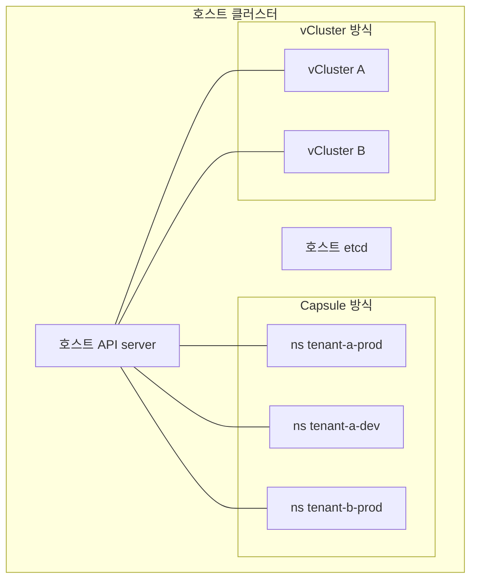
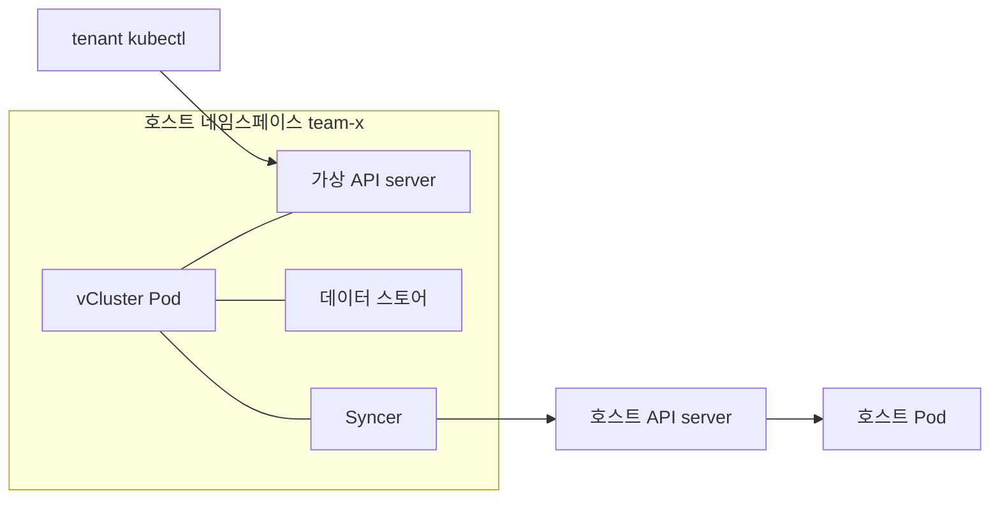
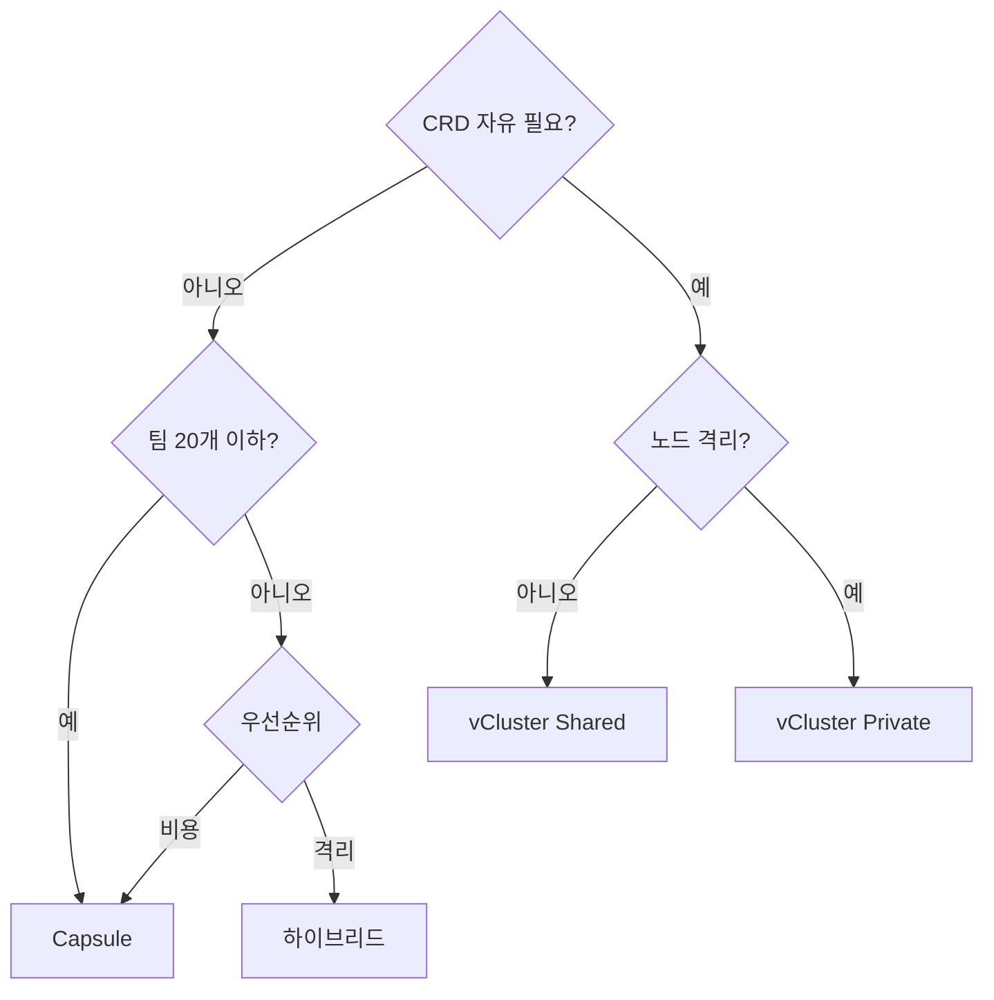

# vCluster·Capsule — 가상 클러스터 vs 네임스페이스 오케스트레이션

> **Capsule**: 네임스페이스를 "테넌트" 단위로 묶어 정책(RBAC·Quota·NetworkPolicy·LimitRange)을
> 선언적으로 전파하는 **Namespace-as-a-Service** 컨트롤러.
>
> **vCluster**: 호스트 클러스터 안에 테넌트별 **가상 컨트롤 플레인**(API server + 데이터 스토어 + 컨트롤러)을
> 띄워, 각 테넌트에게 "자기 클러스터" 경험을 제공하는 **Control-Plane-as-a-Service** 솔루션.

두 도구는 같은 목표(안전한 테넌트 공유)를 다른 레이어에서 풀어낸다.
선행 글 [멀티테넌시 개요](./multi-tenancy-overview.md)의 3모델 중
**NaaS의 대표가 Capsule, CPaaS의 대표가 vCluster**다.
이 글은 두 도구의 구조·운영·함정·선택 기준을 실무 깊이로 정리한다.

---

## 1. 둘이 같은 문제를 다르게 푼다

| 질문 | Capsule의 답 | vCluster의 답 |
|------|-------------|--------------|
| 테넌트 경계는 무엇인가 | 네임스페이스 그룹(=`Tenant` CRD) | 가상 API server 하나 |
| 테넌트는 무엇을 볼 수 있나 | 자기 네임스페이스 리소스 | 자기 가상 클러스터 전체 |
| 테넌트가 CRD 설치 가능? | 아니오 | 예 |
| 호스트와 분리되는 것 | RBAC, 정책 스코프 | API server, etcd, 컨트롤러, DNS |
| 컨트롤 플레인 오버헤드 | 매우 낮음 | 테넌트당 Pod 수개 |
| 주요 리스크 | 쿠버네티스 CVE가 전 테넌트 영향 | 호스트 노드 커널 공유(기본 모드) |



---

## 2. Capsule — 네임스페이스 오케스트레이션

### 2.1 핵심 리소스: `Tenant` CRD

Capsule은 `Tenant`라는 클러스터 스코프 CRD로
"같은 팀·고객에 속한 네임스페이스 묶음"을 선언한다.

```yaml
apiVersion: capsule.clastix.io/v1beta2
kind: Tenant
metadata:
  name: solar
spec:
  owners:
    - name: alice
      kind: User
    - name: dev-team
      kind: Group
    - name: automation-sa
      kind: ServiceAccount
      namespace: pipelines
  namespaceOptions:
    quota: 5                                    # tenant당 네임스페이스 5개 상한
    additionalMetadataList:
      - labels:
          tenant: solar
          cost-center: "CC-1024"
  resourceQuotas:
    scope: Tenant                               # 테넌트 전체 합산 쿼터
    items:
      - hard:
          requests.cpu: "20"
          requests.memory: 40Gi
          limits.cpu: "40"
          limits.memory: 80Gi
  limitRanges:
    items:
      - limits:
          - type: Container
            default: { cpu: 500m, memory: 512Mi }
            defaultRequest: { cpu: 100m, memory: 128Mi }
  networkPolicies:
    items:
      - policyTypes: [Ingress, Egress]
        podSelector: {}
        ingress:
          - from:
              - podSelector: {}                 # 같은 ns만 허용
              - namespaceSelector:
                  matchLabels:
                    capsule.clastix.io/tenant: solar
        egress:
          - to:
              - namespaceSelector:
                  matchLabels:
                    kubernetes.io/metadata.name: kube-system
  nodeSelector:
    tenant: solar                               # 전용 노드 풀 강제
  containerRegistries:
    allowed: ["registry.internal.example", "ghcr.io/solar/*"]
```

이 한 오브젝트만으로 네임스페이스 자동 생성, RBAC, Quota, LimitRange,
NetworkPolicy, 레지스트리 allowlist가 전부 전파된다.

### 2.2 네임스페이스 self-service

Tenant owner는 직접 네임스페이스를 만들 수 있다.

```bash
kubectl --as alice create ns solar-prod
```

Capsule admission webhook이 요청을 가로채서:

1. 생성자가 `solar` 테넌트의 owner인지 확인.
2. `namespaceOptions.quota`를 초과하지 않는지 확인.
3. Tenant 라벨(`capsule.clastix.io/tenant: solar`)을 자동 주입.
4. Tenant에 묶인 모든 정책(RQ/LR/NP)을 새 네임스페이스에 생성.

owner에게 `namespaces` 클러스터 스코프 권한을 직접 주지 않는다는 점이 핵심이다.
**임의 네임스페이스 생성 권한 = cluster-admin 리스크**인데,
Capsule은 "owner가 특정 Tenant에 속할 때만" 제한된 권한을 위임한다.

### 2.3 리소스 복제 — GlobalTenantResource / TenantResource

공통 Secret·ConfigMap·PolicyException 등을 여러 테넌트 네임스페이스에 뿌릴 때.

| 리소스 | 스코프 | 사용자 |
|--------|-------|--------|
| `GlobalTenantResource` | 클러스터 | 플랫폼 관리자 전용 — 모든 Tenant 또는 selector 매칭 Tenant에 전파 |
| `TenantResource` | 네임스페이스 | Tenant owner 사용 가능 — 자기 Tenant 네임스페이스 간 전파 |

예: 모든 테넌트에 기본 `default-deny` NetworkPolicy 심기.

```yaml
apiVersion: capsule.clastix.io/v1beta2
kind: GlobalTenantResource
metadata:
  name: default-deny-baseline
spec:
  resyncPeriod: 60s
  tenantSelector:
    matchLabels:
      capsule.clastix.io/tier: "standard"
  resources:
    - rawItems:
        - apiVersion: networking.k8s.io/v1
          kind: NetworkPolicy
          metadata:
            name: default-deny-all
          spec:
            podSelector: {}
            policyTypes: [Ingress, Egress]
```

### 2.4 capsule-proxy — `kubectl get nodes` 안 터지게 하기

Tenant owner가 `kubectl get nodes`를 하면 클러스터 스코프 권한이 없어서 Forbidden이 떨어진다.
해결이 **capsule-proxy**다. 호스트 API server 앞에 붙어:

- cluster-scoped 요청(`nodes`, `namespaces`, `storageclasses`, `persistentvolumes` 등)을 가로채
  테넌트 소유 리소스만 **레이블 기반 필터링**해서 돌려준다.
- Ingress/IngressClass·NetworkPolicy는 안정적으로 필터링되나,
  **Gateway API 리소스(GatewayClass/Gateway/HTTPRoute)** 는 버전에 따라 지원 범위가 다르다.
  Cilium + Gateway API 스택에서는 현재 버전이 목표 리소스를 필터링하는지 `ProxySettings`와
  릴리스 노트로 먼저 확인할 것.

운영 포인트:

- capsule-proxy는 별도 Deployment로 배포. 가용성을 위해 2+ replica.
- 테넌트는 kubeconfig의 `server` 필드를 capsule-proxy 주소로 변경해 접속.
- 호스트 API server SLO와 capsule-proxy SLO는 **직렬 연결**이므로 장애 합이 된다.
  프록시 레이턴시·오류율을 별도 SLO로 관리.

### 2.5 운영 특성

- **설치**: Helm 차트 한 방. controller + webhook + capsule-proxy.
- **업그레이드**: 호스트 클러스터와 독립. CRD 버전업 시 `helm upgrade`.
  `v1beta1 → v1beta2` 전환은 conversion webhook이 매개하지만,
  old API로 작성된 YAML/GitOps 매니페스트는 사전에 전환해 두어야
  업그레이드 후 `deprecated API` 경고와 예기치 않은 스키마 차이를 피할 수 있다.
- **CNCF 상태**: Sandbox(2022-12 편입), 라이선스 Apache 2.0.
- **최신 버전**: 2026-04 기준 **v0.12.x**. API는 `capsule.clastix.io/v1beta2`.
- **성능**: webhook 호출이 Namespace 생성 경로에만 개입 → p99 영향 미미.
- **NetworkPolicy 자동 전파의 전제**: Tenant `spec.networkPolicies`는 오브젝트를 만들 뿐이고
  **CNI가 NetworkPolicy를 강제해야 실제 격리**가 걸린다. Flannel 단독 구성 등에서는 무의미.
  Cilium·Calico·Kube-router 등 강제 구현이 활성화된 환경에서만 의도대로 동작.

### 2.6 Capsule의 한계

| 한계 | 영향 |
|------|------|
| CRD·ClusterRole·Admission Webhook은 테넌트가 설치 불가 | 테넌트가 Operator 풀스택을 자유롭게 못 올림 |
| 쿠버네티스 CVE 하나로 전 테넌트 영향 | 호스트 API server·kubelet 침해 = 게임 오버 |
| CoreDNS·메트릭·이벤트 스트림은 공용 | 측면 채널 정보 노출 가능 |
| 노드 격리는 Capsule이 직접 제공 안 함 | `nodeSelector`/Taint와 Karpenter 등으로 별도 구성 |

---

## 3. vCluster — 가상 컨트롤 플레인

### 3.1 아키텍처

테넌트마다 **StatefulSet 하나**로 요약되는 경량 컨트롤 플레인을 호스트 네임스페이스에 띄운다.



컴포넌트:

- **가상 API server**: 업스트림 kube-apiserver, 테넌트가 `kubectl` 붙이는 대상.
- **데이터 스토어**: 기본 embedded etcd, 옵션으로 외부 etcd·MySQL·PostgreSQL(kine 경유).
- **Syncer**: 가상 Pod/Service/ConfigMap을 호스트 네임스페이스로 **이름 네임스페이스 접두사 변환**하여 복제.
- **CoreDNS**: 가상 클러스터 내부용. 호스트와 분리된 DNS 공간.
- **스케줄러(옵션)**: 기본은 **호스트 스케줄러가 가상 Pod을 배치**한다.
  가상 스케줄러를 켜면(`controlPlane.advanced.virtualScheduler.enabled: true`) 테넌트의
  `nodeSelector`·TopologySpread·커스텀 스케줄러가 가상 클러스터 관점에서 동작한다.

### 3.2 배포판(distro) 선택

vCluster는 초기에는 k3s·k0s·vanilla k8s·k8s(EKS-D) 등 여러 distro를 지원했으나,
**v0.25에서 k3s·k0s가 deprecated**, **v0.26에서 k0s 제거**, **v0.33에서 k3s 제거**되었다.

| distro | 상태(v0.33 기준) | 특징 |
|--------|-------------------|------|
| `k8s` (vanilla) | **현행 기본** | 업스트림 kube-apiserver + embedded etcd, 기본 데이터 스토어는 etcd |
| `k3s` | 제거 | 기존 v0.24 이하 사용자는 [distro migration 가이드](https://www.vcluster.com/docs/vcluster/next/manage/upgrade/distro-migration)로 k8s 이관 필수 |
| `k0s` | 제거 | 더 이상 선택 불가 |

프로덕션 멀티테넌시는 `k8s` distro + 외부 DB(kine) 조합이 일반적.

### 3.3 Syncer — 무엇이 호스트로 가고 무엇이 남는가

syncer는 방향별로 동작이 다르다. (기본값은 shared-nodes 모드 기준)

| 리소스 | 방향 | 이유 |
|--------|------|------|
| Pod, Service, Endpoints, ConfigMap, Secret, PVC | 가상 → 호스트 | 실제 스케줄·실행은 호스트에서 |
| Ingress/Gateway(옵션) | 가상 → 호스트 | 호스트 LB/Gateway가 트래픽 수용 |
| StorageClass, IngressClass, PriorityClass, Node | 호스트 → 가상(읽기 뷰) | 테넌트에게 사용 가능한 선택지 노출 |
| Deployment, StatefulSet, DaemonSet, CRD, Webhook | 가상에만 존재 | 호스트 API에 도달하지 않음 |

이 설계 덕분에 테넌트는 자기 CRD·Webhook·Operator를 자유롭게 설치해도
호스트 API server에는 보이지 않는다. **CRD 격리의 원천**이 여기다.

syncer는 이름 변환(`name-x-namespace-x-vcluster`)과 필드 패치를 수행하며,
대량의 Pod·Secret을 동기화할 때 **reconcile 큐 지연**이 수백 ms~초 단위까지 발생할 수 있다.
프로덕션에서는 vCluster Pod에 여유 CPU/메모리를 주고, 너무 큰 테넌트는 분할 권고.

### 3.4 운영 모드 — Shared / Private / Standalone

vCluster는 v0.27 이후 노드 배치 모델이 다양해졌다.

| 모드 | 특징 | 격리 강도 | 대가 |
|------|------|----------|------|
| **Shared nodes** (기본) | 가상 Pod이 호스트 노드에 스케줄, 호스트 CNI/CSI 사용 | 중 | 비용 최소, 호스트 커널 공유 |
| **Private nodes** (v0.27+) | 전용 워커 노드가 가상 클러스터에 붙음, 독립 CNI/CSI 가능 | 높음 | 노드 전용 할당 비용, 일부 sync 기능 비활성 |
| **Standalone** (v0.29+) | 호스트 클러스터 없이 vCluster가 실제 클러스터로 단독 운영 | 높음 | CAPI와 겹치는 포지션 — 자세한 비교는 다음 글 |

> **vind**(v0.32+): "모드"가 아니라 **Docker 기반 로컬 실행 방법**이다.
> CI나 로컬 개발 환경에서 vCluster를 빠르게 띄울 때 사용한다
> (`vcluster create ... --driver docker`).

Private nodes는 "가상 클러스터지만 노드는 진짜 전용"인 모델이라
규제 환경에서 vCluster를 쓸 수 있게 해준 전환점이다.
대신 sync 대상 리소스(Service·Secret의 호스트 복제)가 제한되므로
플랫폼 통합(예: 호스트 인그레스가 가상 서비스를 포워딩하는 구조)은 재설계가 필요.

### 3.5 설치·수명주기

```bash
brew install loft-sh/tap/vcluster          # CLI
vcluster create team-x -n team-x           # 네임스페이스당 하나 생성
vcluster connect team-x -n team-x          # kubeconfig 병합
vcluster delete team-x -n team-x           # 삭제
```

Helm으로도 설치되며, Argo CD ApplicationSet로 "테넌트 신청 → vCluster 프로비저닝"을
GitOps 파이프라인에 묶는 구성이 일반적이다.

### 3.6 데이터 스토어와 백업

| 스토어 | 적합 | 백업 |
|--------|------|------|
| Embedded etcd (기본, k8s distro) | 소~중규모 프로덕션 | v0.31+ 내장 스냅샷(Volume/S3/Azure Blob) |
| 외부 etcd | 대규모·기존 etcd 인프라 재사용 | 기존 etcd 스냅샷 체계 |
| 외부 MySQL/PostgreSQL(kine) | 관리형 DB 선호 | DB 백업 체계 재사용 |

v0.31부터 **가상 클러스터 스냅샷·복원**이 내장되어 DR·이관이 간단해졌다.
v0.33부터 Azure Blob 스냅샷, 자동 leaf-cert 재생성, PodDisruptionBudget 내장 옵션,
Helm v4 지원이 추가되어 HA 운영의 경계가 한 단계 좁혀졌다.

### 3.7 최신 버전·거버넌스

- 2026-04 기준 **v0.33.x**. CNCF Certified Kubernetes Distribution 인증.
- 라이선스 Apache 2.0, 메인테이닝: **vCluster Labs(구 Loft Labs)**.
- 2026-04 기준 **CNCF 편입 아님**. 거버넌스는 단일 벤더 주도.
  2025-09 CNCF 블로그가 vCluster의 멀티테넌시 역할을 조명한 사례는 있으나
  Sandbox/Incubating 편입은 아니라는 점을 채택 결정에 반영.

### 3.8 vCluster의 한계

| 한계 | 영향 |
|------|------|
| 기본 모드는 호스트 노드 커널 공유 | 컨테이너 탈출 시 여전히 위협. Private nodes·gVisor·User NS 병행 필요 |
| 가상 API server의 SLO는 독립 관리 필요 | vCluster Pod 크래시·재시작이 테넌트 전체에 보이는 장애 |
| 디버깅 경로 길어짐 | 문제 지점: 가상 API → syncer → 호스트 API → kubelet 중 어디인가 |
| 호스트 리소스 가시성 제한 | 테넌트가 `kubectl get nodes`로 본 상태는 실제 호스트와 다를 수 있음 |
| 운영 도구 중복 | Prometheus/Logging 등 관측 스택을 가상 클러스터에 또 설치해야 할 수 있음 |

---

## 4. 둘 비교

| 항목 | Capsule | vCluster |
|------|---------|----------|
| 테넌트 격리 레이어 | 네임스페이스·RBAC·정책 | 가상 API server·DNS·CRD |
| 테넌트의 자유도 | 제한(플랫폼 정책 안에서) | 높음(cluster-admin 경험) |
| CRD·Webhook·Operator 설치 | ✗ | ✓ |
| 버전 격리 | ✗ (한 버전) | △ (distro/버전 차이 가능, 단 호스트와 skew 범위 내) |
| 고정비 | 거의 0 | 테넌트당 Pod·스토리지 |
| 성능 영향 | 미미 | API 호출 1홉 추가, syncer 부하·크기에 따라 ms~초 |
| 업그레이드 | 호스트 + Capsule Chart | 호스트 + 각 vCluster 개별 |
| 백업·DR | 호스트 etcd에 모든 것 | 호스트 etcd + 각 vCluster 스토어 |
| 관측성 | 호스트 스택 재사용 | 가상 API 메트릭·로그 별도 수집 |
| 학습 곡선 | Tenant CRD만 | K8s 분산 시스템 전체 이해 필요 |
| 전형 use case | 내부 팀 · SaaS 공유 · 내부 플랫폼 | 개발자 셀프서비스 · PR preview · SaaS 컨트롤 플레인 · AI 팩토리 |

---

## 5. 하이브리드 패턴 — 둘 다 쓰는 법

실무에서 자주 보는 조합:

### 5.1 Capsule 위에 vCluster 얹기

- 플랫폼은 Capsule `Tenant`로 팀 경계·쿼터·정책을 공통 강제.
- 팀 중 **개발자 플랫폼이 필요한 팀에게는 vCluster를 같은 테넌트 네임스페이스에 배포**.
- 결과: 플랫폼 거버넌스(레지스트리 allowlist, Quota)는 테넌트 전체에 걸리고,
  팀 내부에서는 cluster-admin 경험이 가능.

### 5.2 테넌트 등급별 분리

| 등급 | 도구 | 이유 |
|------|------|------|
| 내부 개발자 공용 환경 | Capsule | 최소 비용, 빠른 온보딩 |
| 내부 팀 중 플랫폼 개발 | Capsule + vCluster | CRD 자유도 필요 |
| 외부 고객·민감 데이터 | vCluster Private Nodes 또는 별도 클러스터(CAPI) | 규제·격리 |

### 5.3 GitOps 통합

- `TenantTemplate`(Crossplane Composition 또는 kro ResourceGraphDefinition)으로
  "Tenant + vCluster + ArgoCD AppProject + Prometheus Scrape"를 하나의 XR로 선언.
- 테넌트 온보딩이 **PR 한 건**이 된다.

---

## 6. 운영 — 업그레이드·관찰성·보안

### 6.1 업그레이드

| 항목 | Capsule | vCluster |
|------|---------|----------|
| 호스트 K8s 업그레이드 | 영향 거의 없음 | vCluster distro skew 정책 확인 필수 |
| 도구 버전 업 | `helm upgrade capsule` 한 번 | 각 vCluster `helm upgrade` 또는 `vcluster upgrade` |
| CRD 마이그레이션 | `v1beta1 → v1beta2` 등 수동 확인 | distro별 업그레이드 가이드 준수 |

vCluster의 "N개 테넌트 × M개 버전"은 운영 toil의 주 원천이다.
Fleet/ArgoCD ApplicationSet로 **일괄 업그레이드 파이프라인**을 꼭 만들어 둘 것.

v0.33 이후 도움이 되는 HA 옵션:

- **PodDisruptionBudget 내장 옵션**: `controlPlane.statefulSet.highAvailability` 하위에서 PDB 자동 생성.
- **Helm v4 지원**: 기존 템플릿 엔진 이슈(예: 대형 values 파일의 렌더 비용) 개선.
- **자동 leaf-cert 재생성**: 인증서 만료로 인한 API server 장애를 줄임.

### 6.2 관찰성

- **Capsule**: 호스트 Prometheus가 테넌트 레이블(`capsule.clastix.io/tenant`)로 자연스럽게 분리 가능.
- **vCluster**: 가상 API server와 syncer 메트릭은 호스트 ServiceMonitor로 스크래핑 가능하나,
  **가상 클러스터 내부의 워크로드 메트릭**은 가상 측에 추가 스택이 필요할 수 있다.
  OpenTelemetry Collector를 호스트/가상 양쪽에 두어 이중 파이프라인을 구성하는 것이 표준.

### 6.3 보안 체크리스트

Capsule:

- Tenant owner에 `cluster-admin` 금지, `Tenant` CRD 수정 권한 제한.
- capsule-proxy kubeconfig 배포 시 TLS·SNI로 호스트 API와 명확히 분리.
- `containerRegistries.allowed`를 빈 리스트로 두지 말 것(안 쓰면 생략, 쓰면 명시).

vCluster:

- 호스트 네임스페이스는 `restricted` PSA 적용.
- 가상 API server 인증서의 SAN·issuer 관리(프로덕션에서는 내부 PKI 통합).
- syncer ServiceAccount가 호스트에서 가진 권한이 최소한인지 정기 점검.
- 민감 테넌트는 Private Nodes + gVisor/Kata/User NS 조합.

---

## 7. 선택 가이드



실무 요약:

- **시작은 Capsule.** 대부분의 내부 멀티테넌시는 여기서 끝난다.
- **개발자 자율이 필요해지면 vCluster를 Capsule 테넌트 안에 얹는다.**
- **외부 고객·규제가 들어오면 vCluster Private Nodes 또는 CAPI 멀티클러스터로 이동**
  ([멀티클러스터 패턴](./multi-cluster-patterns.md)).

---

## 8. 자주 빠지는 함정

### 8.1 Capsule에서 cluster-scoped 리소스 요청

- 증상: 테넌트가 `kubectl get storageclasses` 실행 → Forbidden.
- 원인: 기본 kubeconfig는 호스트 API server로 직결.
- 해결: **capsule-proxy 경유 kubeconfig** 배포.
  테넌트에게 직접 호스트 주소를 주지 말 것.

### 8.2 Capsule Tenant Quota와 기존 ResourceQuota 충돌

- `resourceQuotas.scope: Tenant`는 테넌트 합산, `Namespace`는 네임스페이스별이다.
- 두 가지를 섞어 쓸 때 합산·네임스페이스 쿼터가 **둘 다 통과**해야 생성 가능.
- 운영 중 "값은 남아있는데 생성 실패"가 나면 Tenant 스코프 쿼터를 의심.

### 8.3 vCluster에서 StorageClass가 안 보임

- 기본값 `sync.fromHost.storageClasses.enabled: auto` 는
  **가상 스케줄러가 켜져 있을 때만** 호스트 StorageClass를 가상으로 읽기 노출한다.
- 호스트 스케줄러를 쓰면서 테넌트가 StorageClass를 보려면 `true`로 명시해야 한다.
- 호스트 이름(`managed-pd`)과 가상 이름(`default`)을 다르게 보이려면
  `patches`로 매핑해야 한다. "이름이 같으면 그대로, 다르면 패치"가 원칙.

### 8.4 vCluster Pod 이름이 호스트에서 "모두 다른 이름"

- Pod `foo` → 호스트에서 `foo-x-default-x-vcluster-name`으로 변환.
- 호스트에서 `kubectl logs`를 직접 쓰면 혼란. 디버깅은 가상 `kubectl`로.
- 로그 집계(Loki·Elastic)에서는 호스트 Pod 이름이 아닌 **가상 메타데이터 레이블**을 인덱싱 키로.

### 8.5 vCluster CoreDNS 설정 누락

- 기본 CoreDNS는 가상 클러스터 내부에 있으나,
  `sync.fromHost.services`나 외부 서비스 해석 규칙이 없으면 DNS 실패.
- 초기 구성 시 `--connect`로 접속해 `kubectl get pods -n kube-system`이 정상인지 먼저 확인.

### 8.6 Private Nodes 전환 시 sync 비활성

- Private Nodes 모드는 Service·Secret 등의 **호스트 동기화가 꺼진다**.
- 호스트 인그레스에서 가상 Service를 참조하는 기존 구성은 동작 불가.
- 전환 전 "어떤 리소스를 호스트가 봐야 하는가" 목록화 필수.

### 8.7 백업 경계 혼동

- Capsule: 호스트 etcd 하나만 백업하면 Tenant·Namespace·정책 전부 복구.
- vCluster: **호스트 etcd + 각 vCluster 스토어** 둘 다 백업해야 완전 복구.
  v0.31+ 내장 snapshot 또는 Velero로 가상 클러스터별 백업 스케줄 구성.

---

## 9. 다음 글과의 연결

| 다음 읽기 | 왜 |
|----------|-----|
| [멀티클러스터 패턴](./multi-cluster-patterns.md) | vCluster·Capsule로 부족한 구간을 Karmada·Fleet·CAPI가 메움 |
| [멀티테넌시 개요](./multi-tenancy-overview.md) | 본 글의 이론적 배경 |
| [RBAC](../security/rbac.md) | Capsule owner 권한 설계 기반 |
| [Network Policy](../service-networking/network-policy.md) | Tenant networkPolicies 기본값 설계 |
| [Gateway API](../service-networking/gateway-api.md) | Capsule·vCluster 모두 Gateway API와의 통합이 표준 경로 |

---

## 참고 자료

- [Capsule — Project site](https://projectcapsule.dev/) · 2026-04-24 확인
- [Capsule — Tenant Quickstart](https://projectcapsule.dev/docs/tenants/quickstart/) · 2026-04-24 확인
- [Capsule — Replications(Global/TenantResource)](https://projectcapsule.dev/docs/replications/) · 2026-04-24 확인
- [Capsule — ProxySettings](https://projectcapsule.dev/docs/proxy/proxysettings/) · 2026-04-24 확인
- [projectcapsule/capsule (GitHub)](https://github.com/projectcapsule/capsule) · 2026-04-24 확인
- [CNCF — Capsule Sandbox project](https://www.cncf.io/projects/capsule/) · 2026-04-24 확인
- [vCluster — Official site](https://www.vcluster.com/) · 2026-04-24 확인
- [vCluster — Architecture](https://www.vcluster.com/docs/vcluster/introduction/architecture/) · 2026-04-24 확인
- [vCluster — Private Nodes](https://www.vcluster.com/blog/vcluster-v-027-private-nodes) · 2026-04-24 확인
- [loft-sh/vcluster (GitHub)](https://github.com/loft-sh/vcluster) · 2026-04-24 확인
- [TomTom Engineering — Capsule multi-tenancy](https://engineering.tomtom.com/capsule-kubernetes-multitenancy/) · 2026-04-24 확인
