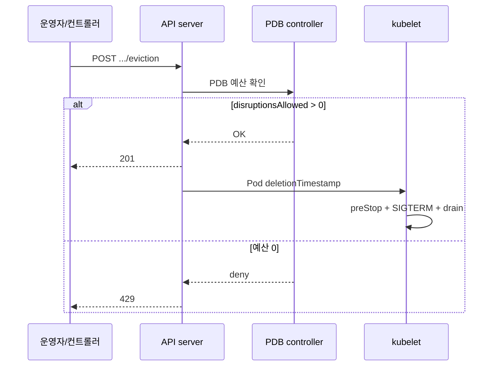
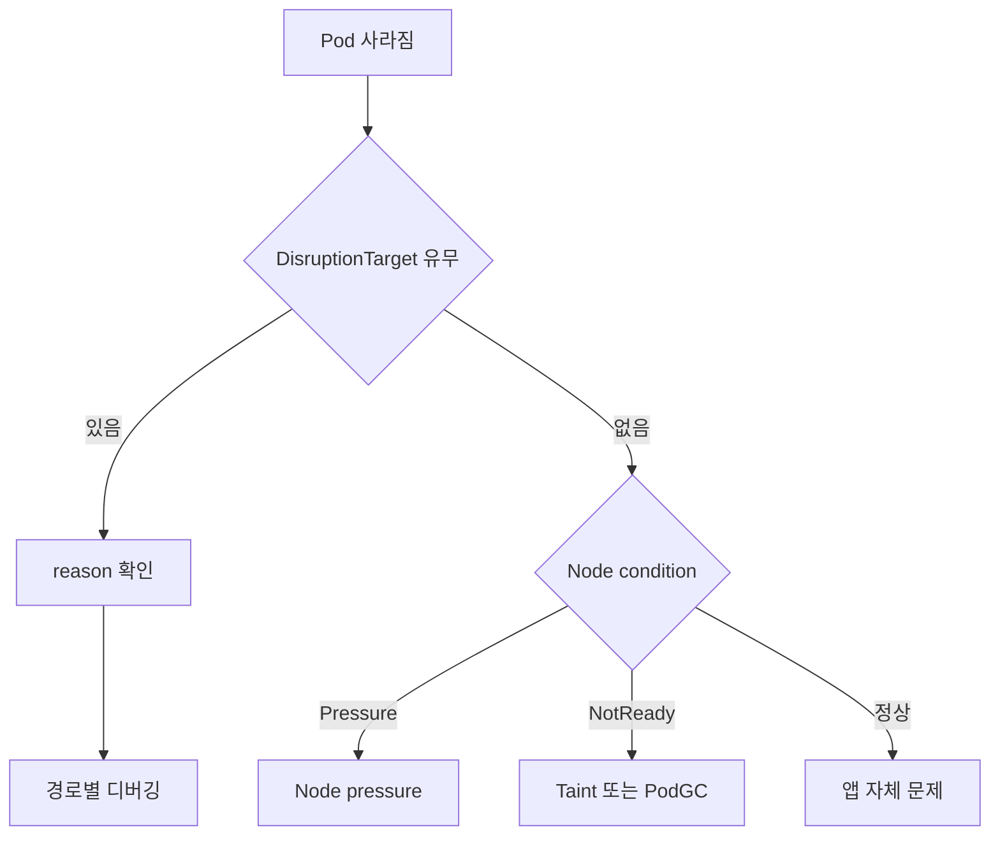

# Eviction

"Eviction"은 단일 개념이 아니라 **다섯 가지 독립 경로**의 묶음이다.
경로마다 주체·PDB 존중 여부·grace period·관측 신호가 다르다. 한
증상을 디버깅할 때 먼저 "어느 경로인가"를 판별해야 한다(Pod GC는
엄밀히 "경로"보다 사후 정리에 가깝지만 reason·증상 진단 편의를 위해
함께 둔다).

| 경로 | 주체 | PDB 존중 | grace | 대표 reason |
|------|------|:-------:|------|----------|
| **API-initiated** | 운영자·컨트롤러(`kubectl drain`·CA·Karpenter) | ✅ | Pod grace 그대로 | `EvictionByEvictionAPI` |
| **Node-pressure** | kubelet | ❌ | hard=0, soft=`eviction-max-pod-grace-period` 상한 | `TerminationByKubelet` |
| **Node graceful shutdown** | kubelet(OS shutdown) | ❌ | `shutdownGracePeriod`·`ByPodPriority` | `TerminationByKubelet` |
| **Taint-based** | taint-eviction-controller | ❌ | `tolerationSeconds`만 | `DeletionByTaintManager` |
| **Preemption** | scheduler | ❌ | Pod grace(짧게 권장) | `PreemptionByScheduler` |
| **Pod GC** | kube-controller-manager | ❌ | 즉시 | `DeletionByPodGC` |

이 글은 경로별 동작 원리·진단 포인트·최신 변경사항을 다룬다.
**PDB 설계**는 [PDB](./pdb.md), **종료 순간의 무중단 엔지니어링**은
[Graceful Shutdown](./graceful-shutdown.md)에 있다.

운영 관점 핵심 질문은 여섯 가지다.

1. **`kubectl drain`은 내부에서 무엇을 하는가** — Eviction API +
   DaemonSet 제외 + cordon.
2. **kubelet의 node-pressure eviction이 왜 `terminationGrace`를
   무시하는가** — hard threshold의 정의.
3. **NoExecute taint로 인한 eviction은 왜 PDB를 못 막는가** —
   경로가 다르다.
4. **scheduler preemption은 PriorityClass 외에 무엇을 보는가** —
   cost·graceful period.
5. **노드가 사라지면 Pod은 언제 정리되나** — `node.kubernetes.io/
   unreachable` 타임아웃과 PodGC.
6. **1.29에서 taint manager가 분리된 이유와 영향** —
   SeparateTaintEvictionController.

> 관련: [PDB](./pdb.md)
> · [Graceful Shutdown](./graceful-shutdown.md)
> · [Taint·Toleration](../scheduling/taint-toleration.md)
> · [Priority·Preemption](../scheduling/priority-preemption.md)
> · [Requests·Limits](../resource-management/requests-limits.md)

---

## 1. API-initiated Eviction

`kubectl drain`·CA·Karpenter·cluster 업그레이드 자동화가 사용하는
경로. **정책적으로 안전한** 종료를 의도한다.

### 1-1. Eviction 서브리소스

```http
POST /api/v1/namespaces/<ns>/pods/<name>/eviction
Content-Type: application/json

{
  "apiVersion": "policy/v1",
  "kind": "Eviction",
  "metadata": { "name": "<pod>", "namespace": "<ns>" },
  "deleteOptions": { "gracePeriodSeconds": 60 }
}
```

- `policy/v1`이 현재 표준. `policy/v1beta1`은 1.22에서 제거.
- `deleteOptions.gracePeriodSeconds`를 명시하지 않으면 Pod의
  `terminationGracePeriodSeconds`가 그대로 사용된다.

### 1-2. HTTP 응답 코드

| 코드 | 의미 | 원인 |
|:----:|------|------|
| **201 Created** | 허용 | PDB 예산 OK, Pod 삭제 시작 |
| **429 Too Many Requests** | 거절 | PDB 위반, API 레이트 리밋 |
| **500 Internal Server Error** | 오류 | 여러 PDB 중복 등 설정 문제 |

> **주의**: 일부 문서가 200 OK로 표기하지만, apiserver는 **201**을
> 반환한다. 자동화 도구가 응답 코드를 엄격 파싱하면 실패할 수 있다.

### 1-3. 처리 시퀀스



### 1-4. `kubectl drain`의 내부

```
1. kubectl drain <node>
2. Node cordon (scheduling 차단)
3. 대상 Pod 목록 수집
   - DaemonSet Pod은 --ignore-daemonsets 없으면 실패
   - mirror Pod, 완료된 Pod 제외
4. 각 Pod에 POST .../eviction
5. 429 재시도, 200/201 성공, 삭제 완료 확인
6. 모든 Pod이 사라질 때까지 polling
```

```bash
kubectl drain node-1 \
  --ignore-daemonsets \
  --delete-emptydir-data \
  --grace-period=60 \
  --timeout=15m \
  --disable-eviction=false      # 기본 false, true로 두면 eviction API 우회(위험)
```

`--disable-eviction=true`는 **eviction 대신 직접 DELETE**를 사용해
PDB를 무시한다. 긴급용일 뿐 일상 사용 금지.

### 1-5. Cluster Autoscaler vs Karpenter의 정책 차이

둘 다 Eviction API를 쓰지만 **실패 시 동작**과 **drain 범위 제어**
가 다르다.

| 측면 | Cluster Autoscaler | Karpenter |
|------|-------------------|-----------|
| drain 타임아웃 | `--max-graceful-termination-sec`(기본 600s) | NodePool의 `TerminationGracePeriod`(1.33+) |
| 타임아웃 시 행동 | **drain 포기**, 노드 축소 취소 | PDB 체크 후 blocked → consolidation skip |
| PDB 충돌 시 | 재시도 후 포기 | `kubectl get events reason=DisruptionBlocked` |
| "이 Pod은 건드리지 마" | `cluster-autoscaler.kubernetes.io/safe-to-evict=false` annotation | `karpenter.sh/do-not-disrupt: "true"` annotation |
| consolidation 공격성 | 낮음(scale-down만) | 높음(replacement·consolidation 포함) |

실무 함의:

- Karpenter는 더 자주 노드를 교체하므로 **PDB·preStop·grace 예산
  설계가 느슨하면 사고 빈도가 더 잦다**.
- CA는 drain에서 포기하고 지나가므로 "어떤 노드가 왜 유휴인 채로
  남아 있지?"가 비용 누수로 이어진다.
- `karpenter.sh/do-not-disrupt`는 **PDB와 별개 계층**에서 해당 Pod이
  사는 노드를 완전히 consolidation 대상에서 제외. 유한 grace로
  해결 불가한 배치 Job·ML 훈련용.

### 1-6. Stuck 재시도 패턴

429가 계속 나오면 루프에 빠진다. 전형적 원인·조치:

| 원인 | 조치 |
|------|------|
| PDB `disruptionsAllowed=0` 지속 | [PDB](./pdb.md) §6 드레인 stuck 디버깅 |
| PDB `unhealthyPodEvictionPolicy=IfHealthyBudget`에 비정상 Pod | `AlwaysAllow`로 변경 |
| ReplicaSet이 Ready Pod을 못 만듬(이미지·스케줄링 실패) | 해당 리소스 먼저 수리 |
| 다중 PDB가 같은 Pod에 겹침 | 가장 엄격한 쪽이 예산 0 — 중첩 제거 |

---

## 2. Node-pressure Eviction (kubelet)

노드가 자원 임계치를 넘으면 **kubelet이 자체 판단으로** Pod을
내린다. PDB·`terminationGracePeriodSeconds` 존중 제한적이다.

### 2-0. oom-killer vs node-pressure eviction

다른 레이어에서 동작하는 **두 메커니즘**이다. 혼동이 잦다.

| 축 | **Kernel oom-killer** | **Kubelet node-pressure** |
|---|----------------------|---------------------------|
| 주체 | 리눅스 커널 | kubelet 프로세스 |
| 트리거 | cgroup memory limit 초과 | 노드 전체 eviction signal |
| 범위 | 컨테이너(프로세스) | Pod 전체 |
| 종료 방식 | SIGKILL, grace 없음 | hard=0·soft=`maxPodGracePeriod` |
| Pod reason | `OOMKilled`(container status) | `Evicted`(pod status) |
| `DisruptionTarget` | 없음 | `TerminationByKubelet` |
| Pod phase | `Running`(새 프로세스로 교체) 또는 `Failed` | **`Failed`** |

- **컨테이너가 limit을 넘음** → oom-killer, `OOMKilled`.
- **노드 전체 메모리 압박** → node-pressure, `Evicted`.
- "같은 시점 여러 노드에서 랜덤 Pod이 사라짐" = node-pressure,
  "특정 컨테이너만 반복 kill" = limit·cgroup 문제.

### 2-1. Eviction Signals

| Signal | 계산 공식 | 용도 |
|--------|---------|------|
| `memory.available` | `capacity - memory.workingSet` | 메모리 압박 |
| `nodefs.available` | `node.stats.fs.available` | 노드 파일시스템 공간 |
| `nodefs.inodesFree` | `node.stats.fs.inodesFree` | inode 고갈 |
| `imagefs.available` | `node.stats.runtime.imagefs.available` | 컨테이너 이미지 저장소 |
| `imagefs.inodesFree` | `node.stats.runtime.imagefs.inodesFree` | imagefs inode |
| `containerfs.available` | **1.31 Beta, CRI-O 전용** | 쓰기 가능 컨테이너 레이어 분리 |
| `containerfs.inodesFree` | 동일 | 분리 containerfs inode |
| `pid.available` | `rlimit.maxpid - curproc` | PID 고갈 |

> **Linux 메모리 계산 주의**: `free -m`이 아니라 **cgroup memory.
> workingSet**에서 `inactive_file`을 뺀 값이다. 리눅스 페이지 캐시
> 중 `active_file`은 여전히 "사용 중"으로 집계되어, `free`가 여유
> 있어 보여도 kubelet이 eviction을 트리거할 수 있다.

> **containerfs 현실**: KEP-4191의 split-image-filesystem은
> **CRI-O v1.29+에서만 구현**됐고 containerd는 미지원(2026-04 기준).
> containerd 사용 클러스터에서는 `containerfs.*` signal이 사실상
> `nodefs.*`와 동일하게 매핑되어 분리 효과 없음. 또한 사용자 정의
> threshold override도 제한적.

### 2-2. Soft vs Hard Threshold

```yaml
# KubeletConfiguration
evictionSoft:
  memory.available: "10%"
  nodefs.available: "15%"
evictionSoftGracePeriod:
  memory.available: 1m30s
  nodefs.available: 2m
evictionMaxPodGracePeriod: 30       # soft eviction 시 Pod grace 상한
evictionHard:
  memory.available: "5%"
  nodefs.available: "10%"
  pid.available: "4%"
evictionMinimumReclaim:
  memory.available: 100Mi
  nodefs.available: 500Mi
evictionPressureTransitionPeriod: 5m
```

- **Soft**: threshold 위반이 `evictionSoftGracePeriod` 지속되면
  eviction. Pod grace는 `terminationGracePeriodSeconds`와
  `evictionMaxPodGracePeriod` 중 **작은 쪽**을 사용.
- **Hard**: 즉시, Pod grace=0. SIGKILL 직행.

### 2-3. 선별 순서

kubelet은 다음 순서로 자원 회수 시도:

1. **미사용 컨테이너 이미지 제거**(imagefs 압박 시)
2. **죽은 컨테이너 제거**
3. **Pod eviction** — 아래 우선순위로

Pod 선별 우선순위(낮은 순위부터 먼저 evict):

```
1) BestEffort
2) Burstable (requests 초과한 Pod이 먼저)
3) Guaranteed (가장 나중)
```

같은 QoS 내에서는 **requests 대비 사용량 초과가 큰 Pod**이 먼저
evict된다. DaemonSet Pod은 일반적으로 priority가 높아 마지막에
고려된다.

### 2-4. Node Condition과 Pressure Transition

eviction 발생 시 Node에 condition이 붙는다.

| Condition | 의미 |
|-----------|------|
| `MemoryPressure=True` | `memory.available`이 threshold 밑 |
| `DiskPressure=True` | `nodefs.available`·`imagefs.available` 밑 |
| `PIDPressure=True` | `pid.available` 밑 |

**`evictionPressureTransitionPeriod`**(기본 5분)는 condition의
flap을 막기 위한 쿨다운이다. threshold가 빠르게 왔다갔다 해도
condition 상태는 느리게 바뀐다. 이 값이 짧으면 scheduler가
condition을 근거로 스케줄링을 판단할 때 noise가 커진다.

### 2-5. Swap-aware eviction (1.32+)

Swap이 활성인 노드에서 eviction manager가 **swap을 추가 메모리로
간주**한다. memory threshold 계산 시 swap 가용량을 포함하여,
swap이 있는 노드는 eviction이 덜 트리거된다.

- `NodeSwap` feature gate 기본 on (1.28 Beta → 1.30 기본 NoSwap
  모드로 전환, `LimitedSwap` 명시 시 swap 사용).
- `LimitedSwap`에서는 **Burstable QoS의 non-high-priority Pod**만
  swap 접근. Guaranteed·BestEffort는 swap 제외.
- memory 압박 시 **requests 초과 사용 Pod**이 먼저 kill 대상.

### 2-6. `terminationGracePeriodSeconds` 무시 규칙

Node-pressure eviction은 **기본적으로 Pod의 grace를 덮어쓴다**:

- Hard threshold: grace=0, SIGKILL 즉시.
- Soft threshold: `evictionMaxPodGracePeriod`와 Pod grace 중 작은 쪽.

이 때문에 stateful 앱·Service Mesh proxy가 drain을 못 마치고 종료
되는 사고가 자주 발생. **핵심은 node-pressure 자체를 예방**하는
것(requests 적정·limit 설정·node 자원 여유)이다.

---

## 3. Taint-based Eviction

`NoExecute` 효과의 taint가 노드에 추가되면, taint를 tolerate하지
않는 Pod이 evict된다. **PDB를 존중하지 않는다.**

### 3-1. `tolerationSeconds`

```yaml
spec:
  tolerations:
    - key: node.kubernetes.io/not-ready
      operator: Exists
      effect: NoExecute
      tolerationSeconds: 300
```

- toleration이 있지만 `tolerationSeconds`가 지정되면 N초 후 evict.
- Kubernetes가 자동 부여하는 기본 toleration:
  - `node.kubernetes.io/not-ready` — `tolerationSeconds: 300`(기본)
  - `node.kubernetes.io/unreachable` — 동일

즉 노드가 `Ready=False`가 된 지 5분이 지나면 해당 노드의 Pod이
일괄 evict되기 시작한다. 이 값은 kube-apiserver의
**DefaultTolerationSeconds admission plugin**이 자동 주입하며,
`--default-not-ready-toleration-seconds`·`--default-unreachable-
toleration-seconds` 플래그로 조정 가능.

### 3-2. taint-eviction-controller 분리

**KEP-3902**. taint-based eviction이 `node-lifecycle-controller`
에서 분리되어 **`taint-eviction-controller`**라는 독립 controller가
됐다.

- 버전 상태: **1.29 Beta(기본 on) → 1.34 GA**.
- kube-controller-manager `--controllers=-taint-eviction-controller`
  로 비활성 가능(대규모 스케일 이슈·커스텀 controller 사용 시).
- 기능 자체는 동일. 코드 유지보수·향후 확장성을 위한 분리.
- GA 이후 `SeparateTaintEvictionController` feature gate는 운영자
  제어 대상이 아니라 **항상 활성** 상태로 간주.

### 3-3. 대표 사고

- 네트워크 일시 단절로 kubelet → apiserver heartbeat 누락 →
  `Ready=False`·`Unreachable` taint → 5분 후 전 노드 Pod 일괄 evict
  → **스케줄 가능한 다른 노드가 없으면** 전 서비스 장애.
- 해법: `tolerationSeconds`를 클러스터 특성에 맞게 조정, 네트워크
  stability 확보, HA·multi-AZ 분산, critical Pod에 긴 toleration.

---

## 4. Preemption (scheduler)

높은 PriorityClass Pod이 노드에 스케줄 불가할 때, scheduler가 **낮은
우선순위 Pod을 evict**하여 자리를 만든다. PDB 무시, grace 존중.

### 4-1. 동작 흐름

1. 새 Pod가 Pending. scheduler가 스케줄 가능 노드를 찾지 못함.
2. 각 노드별로 "얼마나 낮은 priority Pod을 희생시켜야 공간이 나오
   는가" 계산(**victim 선택 + cost 계산**).
3. cost가 가장 낮은 노드를 선택, victim Pod에 **PodDisruption
   Condition=PreemptionByScheduler** 부착 후 삭제.
4. victim Pod은 `terminationGracePeriodSeconds`를 존중받으며 종료.

### 4-2. cost의 실제

- PDB 위반이 발생하는 victim 구성은 **가능한 한 피함**(PDB를 강제
  하지는 않지만 선호).
- 같은 노드에서 victim 수 최소화.
- grace period 긴 victim 선호 않음(전체 대기 시간 증가).
- **`system-cluster-critical`·`system-node-critical`는 victim이
  되지 않는다**. 값이 매우 높아(2e9+) 일반 워크로드가 이들을 preempt
  할 수 없기 때문. 반대로 **이들 Pod 자체는 다른 Pod을 preempt 가능**
  (기본 `preemptionPolicy: PreemptLowerPriority`). Critical Pod이
  스케줄되지 않으면 DNS·kube-proxy 장애로 이어지므로 이 기본값을
  바꾸지 말 것.

### 4-3. `preemptionPolicy: Never`

```yaml
apiVersion: scheduling.k8s.io/v1
kind: PriorityClass
metadata:
  name: best-effort-batch
value: 100
preemptionPolicy: Never
```

스케줄 못 하면 Pending으로 남되, **다른 Pod을 preempt하지는 않음**.
배치 Job이 조용히 기다려야 할 때 유용.

### 4-4. cross-Node Preemption은 없다

scheduler는 **단일 노드 단위로** victim을 찾는다. 두 노드에서 한
Pod씩 preempt해서 공간을 만드는 최적화는 없다. 노드가 너무 촘촘히
차 있으면 preemption도 해결 못 함.

---

## 5. Node Graceful Shutdown 경로

OS 수준 shutdown(전원 버튼·`shutdown` 명령·cloud VM stop)이 떨어질
때 kubelet이 중재하는 경로. Pod 레벨 drain이 아니라 **노드 전체
Pod**을 일시에 내린다.

- **trigger**: systemd inhibitor lock(Linux)·Windows signal.
- **주체**: kubelet(`shutdownGracePeriod`·`shutdownGracePeriodCritical
  Pods`·`shutdownGracePeriodByPodPriority`).
- **reason**: `TerminationByKubelet`(DisruptionTarget).
- **PDB 무시**: API 경로가 아니라 kubelet이 직접 kill.
- **기본 0·0**: 설정하지 않으면 중재 없이 전원 off. 대부분 클러스터
  의 실전 사고 원인.

앱 레벨 종료 엔지니어링(Pod grace·preStop·SIGTERM 핸들러·시간
예산)은 이 글 범위 밖이다. 해당 내용은 [Graceful Shutdown](./
graceful-shutdown.md)에서 전담.

이 글에서 다루는 이유: `TerminationByKubelet` reason이 **Node-
pressure·Node graceful shutdown·system-critical preemption** 세
경로에서 모두 동일하게 부착되기 때문. DisruptionTarget 하나로
원인을 좁힐 수 없고, Node condition·이벤트를 함께 봐야 한다.

| 조건 | 실제 경로 |
|------|----------|
| `MemoryPressure=True`·`DiskPressure=True` | Node-pressure |
| `kubelet_graceful_shutdown_*` 메트릭 발생 | Node graceful shutdown |
| 높은 priority Pod 기동 이벤트 동반 | system-critical preemption |

---

## 6. Pod Garbage Collection

노드가 사라지거나(`node.kubernetes.io/unreachable`) 장기간 heartbeat
가 없으면 Pod은 **orphan** 상태가 된다. PodGC가 이를 정리한다.

| 시나리오 | 정리 주체 | reason |
|---------|----------|--------|
| 노드 Object가 사라짐 | PodGC controller | `DeletionByPodGC` |
| 노드가 `Unreachable` 장기화 | 위와 동일(1.26+ out-of-service taint + podgc) | 동일 |
| 완료된 Pod이 `terminated-pod-gc-threshold` 초과 | PodGC | 정기 수거 |

`--terminated-pod-gc-threshold`(기본 12500)는 kube-controller-manager
옵션으로, Succeeded·Failed 상태 Pod 수가 이 값을 넘으면 가장 오래된
것부터 GC. CronJob·Job이 대량 생성되는 클러스터에서 중요.

### Out-of-service Taint (1.26 GA)

운영자가 노드에 `node.kubernetes.io/out-of-service` taint를 명시적
부착하면 **PodGC가 stateful Pod을 즉시 정리**한다. 과거에는 Pod이
Terminating에 영구 남아 StatefulSet의 다음 Pod 기동이 막히는 문제가
있었다.

```bash
kubectl taint node worker-3 \
  node.kubernetes.io/out-of-service=:NoExecute
```

노드가 **실제로 죽은 게 확실할 때만** 사용(오판 시 split-brain).

---

## 7. DisruptionTarget Condition

**Pod의 `DisruptionTarget` condition 부착 기능**(`PodDisruption
Conditions` feature gate, 1.26 Beta → **1.31 GA**)으로, evict된
Pod에 `DisruptionTarget` condition이 부착된다. reason으로 경로
추적.

> Job 전용의 **`PodFailurePolicy`**(재시도/실패 정책)는 별개 기능
> (KEP-3329). 같은 KEP 시리즈에서 파생됐지만 이름·용도·GA 시점이
> 다르다. 혼동 주의.

| reason | 경로 |
|--------|------|
| `EvictionByEvictionAPI` | API-initiated (`kubectl drain`·CA·Karpenter) |
| `PreemptionByScheduler` | Scheduler preemption |
| `DeletionByTaintManager` | NoExecute taint |
| `DeletionByPodGC` | 노드 사라짐 / GC |
| `TerminationByKubelet` | Node-pressure·graceful node shutdown·system-critical preemption |

```bash
kubectl get pod <name> -o jsonpath='{.status.conditions}' | jq '.[] |
  select(.type=="DisruptionTarget")'
```

이 필드 하나로 **어느 경로로 evict됐는지** 즉시 판별 가능. 포스트
모템·알람 라벨링의 핵심 근거.

---

## 8. 관측과 디버깅

### 8-1. 공통 진단 쿼리

```bash
# 최근 Pod 종료 원인 집계
kubectl get pods -A -o json | jq -r '.items[] |
  select(.status.containerStatuses[]?.lastState.terminated != null) |
  {ns: .metadata.namespace, name: .metadata.name,
   reason: .status.containerStatuses[].lastState.terminated.reason,
   signal: .status.containerStatuses[].lastState.terminated.signal}'

# DisruptionTarget이 붙은 Pod
kubectl get pods -A -o json | jq '.items[] |
  select(.status.conditions[]?.type=="DisruptionTarget") |
  {ns: .metadata.namespace, name: .metadata.name,
   reason: .status.conditions[] | select(.type=="DisruptionTarget").reason}'

# 노드 condition
kubectl get nodes -o custom-columns='NAME:.metadata.name,\
MEM:.status.conditions[?(@.type=="MemoryPressure")].status,\
DISK:.status.conditions[?(@.type=="DiskPressure")].status,\
PID:.status.conditions[?(@.type=="PIDPressure")].status'
```

### 8-2. 감사 로그(audit trail)

"누가 이 Pod을 evict했는가"를 정확히 추적하려면 kube-apiserver
감사 로그가 결정적이다. Pod deletion·eviction은 별도 이벤트로 기록.

관심 대상:

- **eviction 서브리소스**: `requestURI` 가 `/api/v1/namespaces/
  <ns>/pods/<pod>/eviction`.
- **주체(user.username)** — `system:serviceaccount:kube-system:
  cluster-autoscaler`·`system:serviceaccount:karpenter:karpenter`·
  사용자(`admin@corp`) 구분으로 경로가 자동 분류.
- **PDB 위반 시 응답 코드 429**도 감사 로그에 그대로 남음. 반복
  재시도 패턴 탐지.

audit policy 예:

```yaml
rules:
  - level: RequestResponse
    verbs: [create]
    resources:
      - group: ""
        resources: [pods/eviction]
  - level: Metadata
    verbs: [delete]
    resources:
      - group: ""
        resources: [pods]
```

Loki·OpenSearch·Datadog로 aggregating 시 `verb`·`objectRef.
subresource`·`user.username`·`responseStatus.code`를 필수 필드로
보존.

### 8-3. 메트릭

| 메트릭 | 출처 | 의미 |
|--------|------|------|
| `kubelet_evictions{eviction_signal}` | kubelet | 신호별 eviction 수 |
| `kubelet_eviction_stats_age_seconds` | kubelet | 마지막 eviction 후 경과 |
| `kube_pod_container_status_last_terminated_reason` | kube-state-metrics | 이전 종료 원인 |
| `scheduler_preemption_attempts_total` | scheduler | preemption 시도 |
| `scheduler_preemption_victims` | scheduler | victim 수 분포 |
| `apiserver_admission_controller_admission_duration_seconds{name="PodDisruptionBudget"}` | apiserver | Eviction API PDB 체크 지연 |
| `aggregator_unavailable_apiservice`(해당되면) | apiserver | drain 중 API 경로 차단 여부 |

### 8-4. 경로별 판단 플로우



### 8-5. 자주 보는 증상과 경로

| 증상 | 가능성 높은 경로 |
|------|----------------|
| "수 분 후 다 evict됨, 노드 평범" | Taint-based(Unreachable 5분) |
| "메모리 쓰는 Pod만 갑자기 사라짐" | Node-pressure(MemoryPressure) |
| "높은 priority Pod 배포 직후 낮은 Pod 사라짐" | Preemption |
| "`kubectl drain` 중" | API-initiated |
| "노드 재부팅 후 Pod이 없음" | Graceful node shutdown(kubelet) |
| "노드 삭제 후 Terminating 정지" | PodGC 미동작 → `out-of-service` taint |

---

## 9. 드레인을 안전하게 수행하는 절차

노드 하나를 drain하는 표준 런북:

```bash
# 0) 현재 상태 캡처 (rollback 대비)
kubectl get pods -o wide --field-selector spec.nodeName=<node>

# 1) cordon (새 Pod 스케줄 차단)
kubectl cordon <node>

# 2) PDB 상태 확인 (예산 0인 것 먼저 수습)
kubectl get pdb -A -o wide

# 3) drain — 여러 안전 옵션 조합
kubectl drain <node> \
  --ignore-daemonsets \
  --delete-emptydir-data \
  --grace-period=60 \
  --timeout=15m

# 4) 실패 시 원인별 대응
#    - 429: PDB 점검(pdb.md §6)
#    - Terminating 영구 정지: finalizer·volume detach 점검
#    - DaemonSet 오류: --ignore-daemonsets 여부

# 5) 완료 후 확인
kubectl get pods -A --field-selector spec.nodeName=<node>

# 6) 유지보수 후
kubectl uncordon <node>
```

### 금지·주의

- **`kubectl delete pod --force --grace-period=0`**: Eviction API
  우회 + API server에서 즉시 제거. kubelet의 실제 종료를 기다리지
  않아 **고아 프로세스** 위험. 쿼럼 앱에서 split-brain 직행.
- **`kubectl drain --disable-eviction=true`**: 위와 동급의 위험.
- **클러스터 전체 동시 drain**: 노드 간 격차 없이 몰리면 Pod이
  재배치될 여유 노드가 사라져 cascade failure.

---

## 10. 운영 체크리스트

- [ ] **경로 판별 습관**: 증상이 보이면 `DisruptionTarget` condition
      부터 확인. reason이 정확한 디버깅 시작점.
- [ ] `kubectl drain`은 반드시 `--ignore-daemonsets`·`--delete-
      emptydir-data`·충분한 `--timeout` 지정.
- [ ] **`--disable-eviction`·`--force --grace-period=0` 금지**.
      긴급·데이터 손상 감수 시에만.
- [ ] kubelet **eviction threshold**를 명시 설정. hard·soft·
      minimumReclaim·maxPodGracePeriod·pressureTransitionPeriod.
      기본 제로 설정은 운영 사고.
- [ ] `pid.available` threshold 포함(자주 누락). fork bomb·
      Python multiprocessing 폭주 방어선.
- [ ] 노드 자원 예약 — `systemReserved`·`kubeReserved`·`reserved
      Memory`가 allocatable과 명확히 분리.
- [ ] **tolerationSeconds 기본값 검토**: `not-ready`·`unreachable`
      모두 300초. HA·네트워크 안정성에 맞게 조정.
- [ ] **Critical Pod**(DNS·kube-proxy 등)에 **긴 toleration** +
      priority class + PDB 설정. taint·preemption로 우연히 죽지
      않게.
- [ ] Node가 죽었을 때 StatefulSet이 막히면 `node.kubernetes.io/
      out-of-service` taint 수동 부착. 노드가 진짜 죽었을 때만.
- [ ] `kubelet_evictions{eviction_signal}`·scheduler preemption
      메트릭을 대시보드·알람 대상으로. 급증 = 자원·priority 설계
      문제 신호.
- [ ] **Grace의 상한** 인지: node-pressure hard eviction은 0초,
      soft는 `evictionMaxPodGracePeriod` 상한. 앱 `termination
      GracePeriodSeconds` 설정만으로 drain 보장 안 된다.
- [ ] taint-eviction-controller 분리(**1.29 Beta → 1.34 GA**) 인지.
      대규모 클러스터에서 scale 이슈 시 해당 controller만 별도
      튜닝·비활성 가능. 1.34+ 클러스터는 feature gate 제어 불가.
- [ ] Eviction reason별 postmortem 템플릿. `EvictionByEvictionAPI`
      와 `TerminationByKubelet`은 다른 팀이 책임질 가능성.

---

## 참고 자료

- Kubernetes 공식 — API-initiated Eviction:
  https://kubernetes.io/docs/concepts/scheduling-eviction/api-eviction/
- Kubernetes 공식 — Node-pressure Eviction:
  https://kubernetes.io/docs/concepts/scheduling-eviction/node-pressure-eviction/
- Kubernetes 공식 — Pod Priority and Preemption:
  https://kubernetes.io/docs/concepts/scheduling-eviction/pod-priority-preemption/
- Kubernetes 공식 — Taints and Tolerations:
  https://kubernetes.io/docs/concepts/scheduling-eviction/taint-and-toleration/
- Kubernetes 공식 — Safely Drain a Node:
  https://kubernetes.io/docs/tasks/administer-cluster/safely-drain-node/
- Kubernetes Blog — 1.29: Decoupling taint manager:
  https://kubernetes.io/blog/2023/12/19/kubernetes-1-29-taint-eviction-controller/
- Kubernetes Blog — v1.34: Decoupled Taint Manager GA:
  https://kubernetes.io/blog/2025/09/15/kubernetes-v1-34-decoupled-taint-manager-is-now-stable/
- Kubernetes Blog — Protect Mission-Critical Pods with PriorityClass:
  https://kubernetes.io/blog/2023/01/12/protect-mission-critical-pods-priorityclass/
- KEP-4191 Split Image Filesystem:
  https://github.com/kubernetes/enhancements/blob/master/keps/sig-node/4191-split-image-filesystem/README.md
- KEP-2000 Graceful Node Shutdown:
  https://github.com/kubernetes/enhancements/blob/master/keps/sig-node/2000-graceful-node-shutdown/README.md
- Cluster Autoscaler FAQ (`--max-graceful-termination-sec`):
  https://github.com/kubernetes/autoscaler/blob/master/cluster-autoscaler/FAQ.md
- Karpenter — Disruption:
  https://karpenter.sh/docs/concepts/disruption/
- Kubernetes Blog — v1.32 Swap Linux improvements:
  https://kubernetes.io/blog/2025/03/25/swap-linux-improvements/
- KEP-2400 Node memory swap support:
  https://github.com/kubernetes/enhancements/blob/master/keps/sig-node/2400-node-swap/README.md
- KEP-3902 SeparateTaintEvictionController:
  https://github.com/kubernetes/enhancements/blob/master/keps/sig-node/3902-decouple-taint-manager-from-node-lifecycle-controller/README.md
- KEP-3329 Pod Disruption Conditions:
  https://github.com/kubernetes/enhancements/blob/master/keps/sig-apps/3329-retriable-and-non-retriable-failures/README.md
- Kubernetes 공식 — Out-of-service Taint:
  https://kubernetes.io/docs/reference/labels-annotations-taints/#node-kubernetes-io-out-of-service

확인 날짜: 2026-04-24
