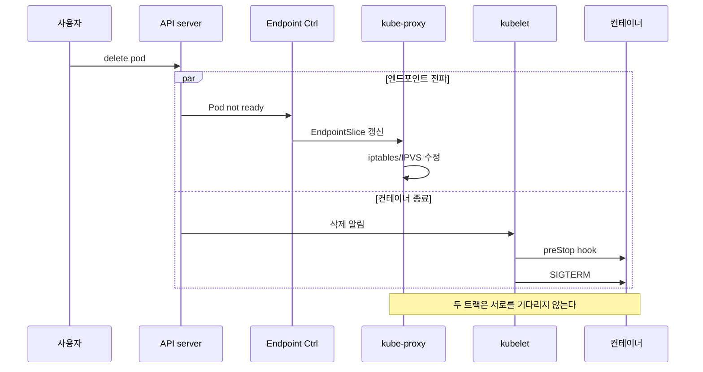

# Graceful Shutdown

Pod 종료는 **동시에 진행되는 비동기 이벤트의 경쟁**이다. 엔드포인트
제거·SIGTERM·kube-proxy 룰 갱신·Ingress 컨트롤러 재설정이 독립적으로
일어나고, 누구도 서로를 기다리지 않는다. 이 경쟁에서 한 발짝만 미끄
러지면 in-flight 요청이 폭발한다(502·504·RST).

이 글은 **"어떻게 설계해야 무중단이 되는가"**에 집중한다. Pod의
종료 상태 머신·hook 문법·probe의 기본은
[Pod 라이프사이클](../workloads/pod-lifecycle.md)이 커버하고, eviction
API의 HTTP 레벨 동작은 [Eviction](./eviction.md)에, PDB의 예산 계산은
[PDB](./pdb.md)에 있다. 여기서는 **시간 예산 설계·언어별 SIGTERM
핸들링·Service Mesh·사이드카·노드 레벨 종료**를 다룬다.

운영 관점 핵심 질문은 여섯 가지다.

1. **왜 SIGTERM 직후 502가 나는가** — 엔드포인트 전파 ≠ SIGTERM.
2. **`preStop.sleep`은 얼마여야 하는가** — 컨트롤 플레인·데이터 플레인
   경로마다 다르다.
3. **언어·프레임워크마다 다른 SIGTERM 동작** — Node·Java·Go·Python·
   nginx.
4. **사이드카 종료 순서는 왜 1.33에서 바뀌었는가** — native sidecar
   GA.
5. **Service Mesh(Envoy/Linkerd)와 함께 있을 때의 경쟁** —
   `EXIT_ON_ZERO_ACTIVE_CONNECTIONS`의 존재 이유.
6. **노드가 재부팅되면 누가 graceful을 보장하나** — kubelet의
   `shutdownGracePeriod`.

> 관련: [Pod 라이프사이클](../workloads/pod-lifecycle.md)
> · [PDB](./pdb.md)
> · [Eviction](./eviction.md)
> · [Service](../service-networking/service.md)
> · [EndpointSlice](../service-networking/endpointslice.md)

---

## 1. 종료 순간 동시에 벌어지는 일

Pod 삭제 요청이 들어오면 API server가 두 갈래를 **동시에** 트리거
한다.



### 지연의 근원

| 구간 | 지연 원인 | 관측 |
|------|----------|------|
| Pod → EndpointSlice | kube-controller-manager 배치 | ~0.5~2s |
| EndpointSlice → kube-proxy | watch + 배치 처리 | 노드별 ~1~5s |
| kube-proxy → iptables·IPVS | rule reload 크기 비례 | 대규모 서비스에서 수 초 |
| Ingress 컨트롤러 재설정 | 컨트롤러별 debounce | NGINX 수 초, Envoy ms |
| CoreDNS TTL | 서비스 IP 캐시 | 5~30s |

**컨테이너가 SIGTERM을 받자마자 리스닝을 멈추면**, 아직 갱신되지
않은 kube-proxy·Ingress가 여전히 그 Pod로 요청을 보낸다. 50x 에러가
몰리는 고전적 원인.

### 해결 원칙

**"리스닝은 유지한 채, 새 연결만 차단하고 기존 요청을 완주시킨다."**

- 컨트롤 플레인 전파 여유를 위해 `preStop.sleep` N초 삽입.
- 앱은 SIGTERM 수신 시 즉시 종료하지 말고, **`/readyz`만 false**로
  바꾼 뒤 in-flight 드레인 후 종료.
- `terminationGracePeriodSeconds`는 이 모든 시간을 덮어야 한다.

---

## 2. 시간 예산 설계

### 2-1. 공식

```
grace ≥ preStop.sleep + 앱 drain + 안전 마진
```

- `grace` = `terminationGracePeriodSeconds`(기본 30)
- `preStop.sleep` = 엔드포인트 전파 대기(HTTP 짧게, 장수명 connection
  길게)
- `앱 drain` = 현재 요청 완주·커넥션 close·커밋 플러시
- **안전 마진 ≥ 5s**: SIGKILL 직전 로그 플러시·리소스 반환 시간

### 2-2. 프로파일별 권장

| 워크로드 | `preStop.sleep` | 앱 drain | grace |
|----------|----------------|---------|-------|
| Stateless HTTP (p99 < 1s) | 5~10s | 5s | 30s |
| HTTP + 외부 호출 (p99 ~5s) | 10~15s | 20s | 45s |
| gRPC 스트리밍 | 15s | **세션 timeout에 맞춤** | 60s+ |
| WebSocket·Transcoding | — | **Rainbow Deploy 권장** | 유한 방식 비권장 |
| 배치 Job | 0 | SIGTERM 후 플러시 | 60s |
| 비동기 consumer(Kafka·SQS) | 5s | 진행 중 메시지 ack·commit | 60s+ |

> **경쟁 관계**: `preStop`과 `terminationGracePeriodSeconds`는
> **병렬로 카운트**된다. `grace=30 + preStop.sleep=25`면 앱은 SIGTERM
> 후 **5초 내** SIGKILL 위험. 예산을 합계로 계산하면 안 됨.

> **극한값 금지**: `terminationGracePeriodSeconds: 0`은 `--force`
> 경로에서만 의미 있고, 일반 배포에선 SIGKILL을 즉시 요청하는
> 효과라 graceful과 정반대. 음수는 유효하지 않다. "무한"은 없다.

### 2-3. Probe 레벨 grace (`livenessProbe.terminationGracePeriodSeconds`)

**1.22 Alpha → 1.25 Beta(기본 on) → 1.27 GA**. liveness probe가
실패해 컨테이너를 죽일 때 **Pod 전체 grace가 아니라 이 probe만의
짧은 grace**를 적용한다.

```yaml
livenessProbe:
  httpGet:
    path: /healthz
    port: 8080
  terminationGracePeriodSeconds: 10
```

- 배경: `grace=300`으로 잡힌 stateful Pod이 hang되면 liveness 실패
  감지 후에도 5분을 기다려야 재시작. 이 값으로 **hang 감지 → 빠른
  재시작**을 분리.
- 정상 삭제·eviction에는 영향 없음. Pod 레벨 grace 그대로.

### 2-4. preStop.sleep (KEP-3960)

`exec`로 `sleep N`을 돌리던 관례 대신 내장 action이 생겼다.

```yaml
lifecycle:
  preStop:
    sleep:
      seconds: 10
```

- **버전 상태**: 1.29 Alpha, **1.30 Beta(기본 on)**. 1.32에서 GA
  승격 시도가 revert되어 1.33 시점 Beta 유지. GA 프로모션은 최신
  릴리스 노트 확인.
- `seconds: 0`(no-op) 허용: **KEP-4818**, 1.32 Alpha → **1.33 Beta
  (기본 on)**.
- distroless·scratch 이미지도 사용 가능(외부 `sleep` 바이너리 불필요).
- exec 대비 리소스 사용 없음·이식성 우수.

> **1.29 클러스터**에서는 Alpha 상태이므로 `PodLifecycleSleepAction`
> feature gate 활성이 필요할 수 있다. 1.30+는 기본 on.

---

## 3. 앱 레벨 SIGTERM 처리

"신호를 잡아 drain을 시작"하는 로직이 없으면 모든 대기 시간은 낭비
된다.

### 3-1. 핵심 패턴

```
1. SIGTERM 수신
2. Readiness false 전환   (/readyz=false)
3. 진행 중 요청은 끝낼 때까지 처리
4. 새 요청 accept 중단·close listener
5. 커넥션 풀·DB 트랜잭션 flush·close
6. exit 0
```

Readiness false는 EndpointSlice 재갱신을 트리거하므로 **preStop.sleep
과 목적이 중복되는 것이 아니라 보강**한다.

### 3-2. 언어·프레임워크별

| 런타임 | 기본 SIGTERM 동작 | 권장 패턴 |
|--------|------------------|----------|
| **Go (net/http)** | 기본 즉시 종료 | `Server.Shutdown(ctx)` — context로 drain 시간 제한 |
| **Node.js** | 기본 즉시 종료 | `server.close()` + connection tracking(HTTP/1.1은 keep-alive 강제 종료 필요) |
| **Python (gunicorn)** | 기본 graceful 30s | `graceful-timeout` 조정, `worker_class`가 sync면 요청 중 SIGTERM 무시됨 |
| **Java (Spring Boot)** | 기본 즉시 종료 | `server.shutdown=graceful` + `spring.lifecycle.timeout-per-shutdown-phase` |
| **nginx** | `SIGQUIT` = graceful | **SIGTERM은 즉시 종료**. `preStop`에서 `nginx -s quit`으로 전환 필요 |
| **Apache httpd** | `SIGWINCH` = graceful | 동일, preStop에서 `apachectl -k graceful-stop` |
| **PID 1 주의** | shell이 PID 1이면 신호 전파 실패 | `exec` 또는 `tini`·`dumb-init` 사용 |

### 3-3. PID 1 함정

컨테이너 entrypoint가 `CMD ["sh", "-c", "./app"]`처럼 shell을 거치면
**shell이 PID 1**이 되어 SIGTERM을 자식 프로세스에 전파하지 않는다.

```dockerfile
# 나쁨 — SIGTERM이 ./app에 도달하지 않음
CMD ["sh", "-c", "./app --flag"]

# 좋음 — exec으로 자식을 PID 1로 승격
CMD ["./app", "--flag"]

# 또는 signal forwarder
CMD ["tini", "--", "./app"]
```

이 실수로 인해 **앱이 SIGTERM을 절대 받지 못하고 grace 끝까지 가다
SIGKILL** 당하는 사고가 흔하다. `kubectl exec` 후 `kill -TERM 1`
로 재현 가능.

### 3-4. HTTP keep-alive와 drain

SIGTERM 수신 후 `server.close()`만 호출해도 **keep-alive 유휴
연결은 그대로 매달려 있다**. Node.js·Java에서 특히 눈에 띈다. 해법:

- `Connection: close` 응답 헤더 전환 후 close.
- 최대 idle 시간을 짧게(`keepAliveTimeout` 5s 등).
- 활성 connection 수 게이지 확인 — 0이 되면 서버 close 호출.

---

## 4. 롱 커넥션·gRPC·WebSocket

### 4-1. 유한 grace로 해결 불가한 경우

- WebSocket 세션 평균 수 분~수 시간
- gRPC bidi 스트림, video transcode job
- SSE(Server-Sent Events)

`terminationGracePeriodSeconds`를 수 분 이상 키우면 드레인·롤링
전체가 느려지고 **PDB 점유 시간도 증가**. 대신 **Rainbow Deployment**
(구 replica를 자연 소멸할 때까지 공존) 패턴을 쓴다.

```
Deployment v1 (replicas=N) — 수명이 다할 때까지 유지
Deployment v2 (replicas=N) — 신규 트래픽 전용
LB 레벨에서 신규 연결은 v2로, v1은 유지만.
```

### 4-2. gRPC 특화

- **GOAWAY** 프레임으로 새 RPC 차단을 서버에서 유도.
- Go gRPC: `server.GracefulStop()` — in-flight RPC 완료 후 close.
- 클라이언트가 요청 중이라도 `ctx` timeout을 짧게 잡아 과도한 대기
  회피.

### 4-3. WebSocket·SSE

- 서버에서 `1001 Going Away`(WS) 또는 이벤트 스트림 종료 메시지
  보내 **클라이언트가 재연결**을 시작하게 한다.
- 다음 Pod이 Ready 되어 있어야 의미. TSC(Topology Spread Constraints)
  + readinessGates 조합 권장.

### 4-4. StatefulSet 특수성

StatefulSet Pod은 재생성 시 **동일한 network identity와 PV를 재사용**
하므로 graceful shutdown 실패가 다음 Pod 기동에 직접 영향을 미친다.

- 이전 Pod이 파일 lock·프로세스 lease·replication log를 정리하지 못
  하면, 새 Pod이 같은 PV를 마운트하려다 **lock 충돌** 또는 **split-
  brain**.
- `podManagementPolicy: OrderedReady`(기본)에서는 이전 Pod의 drain이
  끝날 때까지 다음 Pod이 내려오지 않는다. grace를 넉넉히.
- 쿼럼 기반 앱은 lease TTL을 grace보다 짧게 설정해, 비정상 종료 시
  다른 노드가 자동 failover할 수 있도록.
- `Parallel` 정책은 drain 속도 향상 수단이 아니라 **동시 생성·삭제**
  를 허용하는 것뿐. 업데이트는 여전히 `updateStrategy` 별개.

---

## 5. 사이드카 컨테이너 (1.33 GA)

### 5-1. 왜 바뀌었는가

기존: 모든 컨테이너가 동시 SIGTERM. 사이드카가 앱보다 먼저 죽으면
**앱이 네트워크·로그·토큰을 잃는** 창이 발생. Istio·Linkerd 운영자가
preStop hack으로 덮어왔다.

### 5-2. native sidecar 동작

```yaml
spec:
  initContainers:
    - name: proxy
      restartPolicy: Always     # 이 필드가 sidecar로 승격
      image: envoyproxy/envoy
  containers:
    - name: app
      image: myapp
```

- 기동: 모든 sidecar가 Ready가 되어야 `containers`가 시작.
- 종료: **앱이 먼저 종료된 뒤**, 사이드카가 **역순**으로 종료.
- 버전: **1.28 Alpha → 1.29 Beta(기본 on) → 1.33 GA**. 1.33+ 클러스터
  는 `SidecarContainers` feature gate 조작 없이 바로 사용.

### 5-3. 주의

- 사이드카의 graceful은 **우선순위가 낮다**. 앱이 grace를 전부 소비
  하면 사이드카는 SIGTERM→SIGKILL을 거의 즉시 받는다. **exit code
  non-zero는 정상**이며 감사 도구가 무시해야 한다.
- Job에서 사이드카(`restartPolicy: Always`)는 **Job 완료를 막지
  않는다**. 주 컨테이너 종료 시 Job 완료, 사이드카는 SIGTERM.
- 기존에 preStop으로 종료 순서를 맞춰 두었다면 1.33+ 클러스터에서
  **중복 로직이 된다**. sidecar로 승격 후 기존 preStop 제거 가능.

---

## 6. Service Mesh의 graceful shutdown

사이드카 프록시(Envoy/Linkerd)가 끼면 graceful의 책임자가 **앱 ↔
프록시 둘**로 나뉜다.

### 6-1. Istio (Envoy sidecar)

- `terminationDrainDuration`(기본 5s) — istio-agent가 Envoy에
  drain 신호를 보낸 뒤 SIGKILL 하기까지의 **상한**.
- `EXIT_ON_ZERO_ACTIVE_CONNECTIONS=true` — 활성 connection 0이 되면
  **즉시 exit**(느린 drain의 헛기간 제거).
- `MINIMUM_DRAIN_DURATION` — 위 옵션이 켜졌을 때만 의미. 활성
  connection 폴링 시작 전까지의 **하한**(early-exit 방지).
- 구분 팁: Istio의 `terminationDrainDuration`은 pilot-agent 레벨 상한,
  Envoy 자체의 `drainDuration`(기본 45s)은 hot-restart 드레인으로 별개.
- 권장: `terminationDrainDuration ≤ terminationGracePeriodSeconds -
  (앱 drain)`. 앱이 먼저 끝나야 프록시가 마지막 요청을 돌려줄 수 있다.

```yaml
# Istio sidecar annotation
annotations:
  proxy.istio.io/config: |
    terminationDrainDuration: 30s
```

### 6-2. Linkerd

- 자체 graceful signal 처리. 관련 변수·env 필요 없음.
- `linkerd-proxy`는 SIGTERM 수신 시 **활성 요청 완료 후 exit**.
- 과거 `linkerd-await`로 앱 시작·종료 순서를 조율하던 것은 native
  sidecar(1.33 GA)로 대체 가능.

### 6-3. mesh가 있을 때 예산 공식

```
grace ≥ preStop.sleep + 앱 drain + proxy drain + 마진
```

그리고 순서:

1. kube-proxy·Ingress에서 Pod 제거(Readiness=false + preStop.sleep).
2. 앱이 drain(프록시는 아직 라우팅).
3. 앱 exit.
4. 프록시 drain 종료·exit.

이 순서가 깨지면 앱이 이미 죽은 뒤에도 mesh가 요청을 던진다 → 502.

> **native sidecar 전제**: 위 순서는 1.33+ 클러스터에서 프록시를
> `restartPolicy: Always` init container(§5)로 올렸을 때 kubelet이
> 자동 보장한다. pre-1.33이나 sidecar를 일반 `containers[]`에 두면
> 앱과 프록시가 **동시에** SIGTERM을 받으므로, `preStop` 체이닝으로
> 순서를 수동 만들어야 한다. 이 경우의 관례는 프록시에 "앱의 Ready
> 가 false가 될 때까지 기다리는" preStop httpGet을 거는 방식.

---

## 7. Cloud LB deregistration delay

Cloud LoadBalancer(AWS NLB/ALB·GCP LB·Azure LB)가 Pod을 target에서
**deregister**하는 시간은 in-cluster 엔드포인트 전파보다 훨씬 길다.
EKS·GKE 운영자가 가장 자주 마주치는 502/504 원인.

| LB | 기본 동작 | 기본 지연 |
|----|----------|----------|
| AWS ALB(IP target) | target `draining` 상태로 유지 | `deregistration_delay.timeout_seconds`(기본 300s) |
| AWS NLB(IP target) | 동일, 다만 TCP connection 더 엄격 | 300s + **2~3 min propagation** |
| GCP Backend Service | `connectionDraining.drainingTimeoutSec` | 기본 0 → drain 없음, 설정 필요 |
| Azure LB | SLB rule 재구성까지 | 초~분 단위 |

### 의미

`preStop.sleep`을 15초로 잡았다 해도 AWS LB는 여전히 해당 Pod 주소
로 수 분간 연결을 보낸다. **Pod이 이미 exit한 뒤의 요청**은
연결 거부·RST가 된다.

### 권장 구성

1. `deregistration_delay.timeout_seconds`를 **합리적으로 단축**(30s
   전후)으로 조정. 기본 300s는 stateful에 적합, stateless API는 과도.
2. `preStop.sleep ≥ deregistration_delay` + 약간의 여유. Pod이 LB
   target에서 완전히 빠질 때까지 리스닝 유지.
3. `terminationGracePeriodSeconds ≥ preStop.sleep + 앱 drain + 마진`
   를 만족하도록 상향. 300s deregistration이면 grace도 수백 초가
   필요.
4. ALB target group의 `target_group_attributes`를 IaC에 박아 두어
   환경별 drift 방지. aws-load-balancer-controller 사용 시
   `Ingress`·`Service` annotation으로 설정.

### 예: EKS + ALB

```yaml
apiVersion: networking.k8s.io/v1
kind: Ingress
metadata:
  annotations:
    alb.ingress.kubernetes.io/target-group-attributes: |
      deregistration_delay.timeout_seconds=30
---
apiVersion: apps/v1
kind: Deployment
spec:
  template:
    spec:
      terminationGracePeriodSeconds: 60
      containers:
        - name: app
          lifecycle:
            preStop:
              sleep:
                seconds: 35     # deregistration_delay + 여유
```

이 조합 없이 기본값으로 배포하면 롤링 시 502 스파이크가 표준 증상.

---

## 8. 노드 레벨 graceful shutdown

노드 재부팅·cordon이 아니라 **OS 수준 shutdown**(전원 버튼·cloud
vm stop)이 떨어지면 kubelet이 중재한다.

### 8-1. kubelet 설정

```yaml
# /etc/kubernetes/kubelet-config.yaml (KubeletConfiguration)
shutdownGracePeriod: 90s
shutdownGracePeriodCriticalPods: 30s
```

- `shutdownGracePeriod` — Pod 전체에 주어지는 총 시간.
- `shutdownGracePeriodCriticalPods` — 그 중 마지막에 critical Pod
  (`system-cluster-critical`·`system-node-critical`)에 할당되는 시간.
- 예: 90·30 → 일반 Pod 60s 먼저 종료 → 그 후 critical 30s.

**1.28 GA**. systemd inhibitor lock 기반이므로 **systemd 기반 리눅스**
에서만 동작. Bottlerocket 등 minimal OS는 지원 여부 별도 확인.

### 8-2. 실전 주의

- 기본값은 **0·0**이다 — 설정하지 않으면 kubelet은 중재 없이 kill.
  노드 풀 자동화(CA·Karpenter) 도입 팀이 가장 자주 놓치는 설정.
- **PDB는 노드 shutdown을 막지 않는다**. PDB는 API 경로(eviction)에서
  만 작동. 운영자는 노드 level에서 **Eviction API를 거친 drain**을
  반드시 선행해야 한다.
- `DisruptionTarget=TerminationByKubelet` condition이 노드 shutdown
  종료된 Pod에 붙는다. 포스트모템 분석 단서.

### 8-3. PriorityClass 기반 세분화

`shutdownGracePeriodByPodPriority`(1.24+)로 priority 값별 예산을
세분할 수 있다. critical/non-critical 이분법보다 세밀한 제어가
필요한 대규모 클러스터에서 유용.

```yaml
shutdownGracePeriodByPodPriority:
  - priority: 100000          # system-critical
    shutdownGracePeriodSeconds: 30
  - priority: 10000           # 중요 애플리케이션
    shutdownGracePeriodSeconds: 60
  - priority: 0               # 기본
    shutdownGracePeriodSeconds: 30
```

총합이 `shutdownGracePeriod`와 일치해야 한다. 값이 겹치면 정렬 후
매칭되는 최고 우선순위가 적용.

### 8-4. Karpenter의 drainage

Karpenter consolidation·expiration·empty-node 축소 시 노드 drain
단계는 **Eviction API를 사용**하므로 PDB·`preStop`·grace가 모두
적용된다. 다만:

- `karpenter.sh/do-not-disrupt: "true"` 어노테이션은 해당 Pod이 사는
  노드를 consolidation 대상에서 **완전히 제외**. 유한 grace로 해결
  불가한 워크로드(긴 Job·전문 ML)용.
- `karpenter.sh/disruption-grace-period`(롤아웃 주기 설정)와 Pod의
  `terminationGracePeriodSeconds`는 별개 계층. drain 시작 후 Pod
  grace가 소진되면 SIGKILL.
- Karpenter는 PDB 위반 직전까지 drain을 시도하고 멈춘다. `kubectl get
  events -A --field-selector reason=DisruptionBlocked`로 진단.

---

## 9. 관측과 진단

### 9-1. 관측 포인트

| 지표 | 의미 | 출처 |
|------|------|------|
| 5xx 스파이크 | 드레인 전파 실패 | Service Mesh·Ingress |
| RST·TCP reset | in-flight connection 강제 끊김 | LB 로그·`netstat` |
| Pod `lastState.terminated.reason=Error`·`signal=9` | SIGKILL로 종료 | `kubectl describe pod` |
| `DisruptionTarget` condition | evict 원인 추적 | Pod `.status.conditions` |
| `apiserver_request_total{verb=DELETE,resource=pods}` 급증 | 대량 drain 중 | apiserver |
| `kubelet_graceful_shutdown_start_time_seconds` · `kubelet_graceful_shutdown_end_time_seconds` | 노드 graceful 진행 | kubelet |
| `kube_pod_container_status_last_terminated_reason` | 이전 종료 원인 집계 | kube-state-metrics |

### 9-2. 공통 증상과 원인

| 증상 | 원인 | 수정 |
|------|------|------|
| 롤링 중 502/504 | 앱이 SIGTERM에 즉시 종료 | `preStop.sleep` + 앱 drain 핸들러 |
| SIGTERM이 앱에 도달 안 함 | PID 1 shell | `exec` 또는 `tini` |
| SIGKILL로 종료 | grace 모자람 | grace·drain 예산 재계산 |
| 502가 특정 Ingress 컨트롤러에서만 | 컨트롤러 reload debounce | preStop.sleep 증가 |
| 사이드카 먼저 죽으면서 앱 실패 | 기존(pre-1.29) 사이드카 | native sidecar 전환 |
| Envoy가 앱보다 늦게 죽으며 502 | terminationDrainDuration 과다 | `EXIT_ON_ZERO_ACTIVE_CONNECTIONS` 활성 |
| 클라우드 LB 레벨 RST·5xx | LB deregistration 지연 > preStop.sleep | `deregistration_delay.timeout_seconds` 단축 + `preStop.sleep` 동기화 |
| 노드 재부팅 시 앱이 갑자기 사라짐 | `shutdownGracePeriod=0` | KubeletConfiguration 설정 |
| **Pod이 `Terminating` 상태로 영구 정지** | finalizer 미해제·CSI volume detach 실패 | finalizer 소유 컨트롤러 상태 확인, 필요 시 `kubectl patch --type merge -p '{"metadata":{"finalizers":[]}}'` (리스크 감수 후) |
| StatefulSet 재기동 시 볼륨 마운트 실패·split-brain | 이전 Pod이 graceful 종료 못 해 lock·lease 잔존 | grace 상향, 쿼럼 앱은 lease TTL 기반 복구 |

### 9-3. 로그 유실 방지

- **stdout 버퍼링**: Python `-u`·`PYTHONUNBUFFERED=1`, Node `process.
  stdout.setBlocking(true)`. SIGKILL 시 버퍼 로그 소실.
- **로그 수집 사이드카**(fluent-bit 등)는 **native sidecar**로 올리면
  앱 종료 후에도 로그가 flush된다.
- SIGTERM 직후 "shutdown received"·"drain complete" 등의 마커 로그를
  남겨 사건 순서를 postmortem에서 재구성 가능하게 한다.

---

## 10. 운영 체크리스트

- [ ] 모든 서비스 Pod에 **`preStop.sleep`**(5s 이상) 설정. 컨트롤
      플레인 전파 대기용. distroless도 가능(KEP-3960, 1.30 Beta 기본
      on). 1.29 이하는 feature gate 확인.
- [ ] **SIGTERM 핸들러**가 앱 코드에 있다. Readiness 전환 + in-flight
      drain + connection close + exit 0.
- [ ] **PID 1 검증**: `kubectl exec <pod> -- cat /proc/1/comm`이 앱
      바이너리여야 한다. `sh`이면 entrypoint 수정 또는 `tini`.
- [ ] `terminationGracePeriodSeconds`가 **`preStop.sleep + 앱 drain`
      + 마진**을 덮는다. 병렬 카운트 주의.
- [ ] **롱 커넥션**(WS·gRPC stream)은 유한 grace 대신 **Rainbow
      Deploy**·클라이언트 재연결 전략.
- [ ] **Service Mesh 동거 시** `EXIT_ON_ZERO_ACTIVE_CONNECTIONS=true`
      (Istio) 또는 native sidecar(1.33 GA) + 순서 보장.
- [ ] **native sidecar(1.33 GA)** 이전은 proxy-앱 종료 순서 명시적
      제어. 1.33+ 클러스터는 `restartPolicy: Always` init container로
      자동 보장.
- [ ] **Node graceful shutdown** 활성: `shutdownGracePeriod`·
      `shutdownGracePeriodCriticalPods` 설정. 기본 0·0은 사고.
- [ ] **로그 버퍼링** 해제 또는 로그 사이드카를 native sidecar로
      구성.
- [ ] **관측**: 배포·드레인 시 5xx·RST 스파이크, `signal=9` 종료
      비율을 대시보드화. 회귀 즉시 탐지.
- [ ] 런북: "배포 후 502 증가" = preStop·SIGTERM·mesh 순으로 점검.
      `DisruptionTarget` condition 확인.

---

## 참고 자료

- Kubernetes 공식 — Pod Lifecycle (Termination):
  https://kubernetes.io/docs/concepts/workloads/pods/pod-lifecycle/#pod-termination
- Kubernetes 공식 — Container Lifecycle Hooks:
  https://kubernetes.io/docs/concepts/containers/container-lifecycle-hooks/
- Kubernetes 공식 — Sidecar Containers:
  https://kubernetes.io/docs/concepts/workloads/pods/sidecar-containers/
- Kubernetes 공식 — Node Shutdowns:
  https://kubernetes.io/docs/concepts/cluster-administration/node-shutdown/
- KEP-3960 PreStop Sleep Action (1.29 Alpha → 1.30 Beta):
  https://github.com/kubernetes/enhancements/blob/master/keps/sig-node/3960-pod-lifecycle-sleep-action/README.md
- KEP-4818 Allow zero value for Sleep Action (1.32 Alpha → 1.33 Beta):
  https://github.com/kubernetes/enhancements/blob/master/keps/sig-node/4818-allow-zero-value-for-sleep-action-of-prestop-hook/README.md
- Kubernetes Blog — v1.33 Updates to Container Lifecycle:
  https://kubernetes.io/blog/2025/05/14/kubernetes-v1-33-updates-to-container-lifecycle/
- Kubernetes Blog — Probe-level terminationGracePeriodSeconds 1.25 GA:
  https://kubernetes.io/blog/2022/05/13/grpc-probes-now-in-beta/
- KEP-753 Sidecar Containers:
  https://github.com/kubernetes/enhancements/blob/master/keps/sig-node/753-sidecar-containers/README.md
- KEP-2000 Graceful Node Shutdown:
  https://github.com/kubernetes/enhancements/blob/master/keps/sig-node/2000-graceful-node-shutdown/README.md
- Google Cloud — Terminating with Grace:
  https://cloud.google.com/blog/products/containers-kubernetes/kubernetes-best-practices-terminating-with-grace
- Envoy — Draining:
  https://www.envoyproxy.io/docs/envoy/latest/intro/arch_overview/operations/draining
- Istio — Graceful Connection Drain:
  https://docs.tetrate.io/service-bridge/operations/graceful-connection-drain
- Linkerd — Graceful Pod Shutdown:
  https://linkerd.io/2-edge/tasks/graceful-shutdown/
- learnkube — Graceful Shutdown:
  https://learnkube.com/graceful-shutdown
- AWS EKS Best Practices — Load Balancing:
  https://docs.aws.amazon.com/eks/latest/best-practices/load-balancing.html
- Karpenter — Disruption:
  https://karpenter.sh/docs/concepts/disruption/

확인 날짜: 2026-04-24
