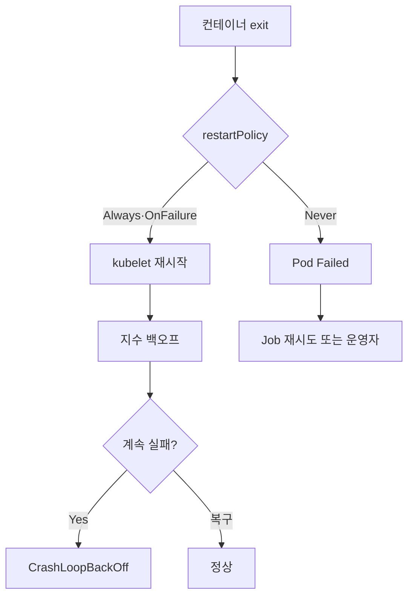

# Pod Failure·Backoff

Pod이 "왜 지금 재시작되는가"와 "왜 더 이상 재시작되지 않는가"는
다른 질문이다. Kubernetes는 **세 계층**으로 실패를 제어한다.

1. **컨테이너 재시작** — `restartPolicy` + 지수 백오프
2. **Pod 수준 실패 처리** — Pod phase(`Failed`)와 소유 컨트롤러
3. **Job의 재시도 정책** — `backoffLimit`·`activeDeadlineSeconds`·
   `PodFailurePolicy`·`backoffLimitPerIndex`

운영자는 매일 `CrashLoopBackOff`를 본다. 이 상태가 실제로 **재시도
중**인지, **의도적으로 중단**된 것인지, **예산이 소진돼 Job이 포기한
상태**인지 구분할 줄 알아야 한다.

운영 관점 핵심 질문은 다섯 가지다.

1. **`CrashLoopBackOff` 백오프 곡선은 어떻게 계산되나** — 10s 초기,
   5분 cap, 10분 정상 후 reset.
2. **`restartPolicy: OnFailure`와 `Never`가 실전에서 의미하는 것** —
   exit 0 vs non-zero, Job 컨트롤러의 재생성과 다름.
3. **Job이 무한 재시도 하지 않게 만들려면** — `backoffLimit` +
   `activeDeadlineSeconds` + `ttlSecondsAfterFinished`.
4. **특정 exit code나 disruption을 재시도에서 빼려면** —
   `PodFailurePolicy`(1.31 GA).
5. **Indexed Job에서 실패한 index만 빠르게 포기하려면** —
   `backoffLimitPerIndex`(1.33 GA).

> 관련: [Pod 라이프사이클](../workloads/pod-lifecycle.md)
> · [Job·CronJob](../workloads/job-cronjob.md)
> · [Eviction](./eviction.md)
> · [Graceful Shutdown](./graceful-shutdown.md)
> · [Pod 디버깅](../troubleshooting/pod-debugging.md)

---

## 1. 세 계층의 실패 제어



| 계층 | 주체 | 결정 사항 |
|------|------|----------|
| **컨테이너** | kubelet | 재시작 여부·백오프 대기 시간 |
| **Pod** | kubelet·워크로드 컨트롤러 | Pod phase 전환, 컨트롤러 재생성 |
| **Job** | Job controller | 재시도 횟수, 조기 포기, 실패 유형별 정책 |

세 계층을 섞어서 생각하지 말 것. "Deployment의 Pod이 죽었는데
재시작이 느리다"는 **컨테이너** 문제, "Job이 배치되지 않는다"는
**Job 계층** 문제.

---

## 2. restartPolicy

Pod 수준에서 **컨테이너 종료 시 kubelet의 재시작 여부**를 결정.

| 값 | 설명 | 적합 |
|----|------|------|
| `Always`(기본) | exit code와 무관하게 재시작 | Deployment·StatefulSet·DaemonSet(상시 실행 서비스) |
| `OnFailure` | exit code ≠ 0인 경우에만 재시작 | Job(재시도 대상) |
| `Never` | 재시작하지 않음 | Job + `PodFailurePolicy` 병용, 디버깅용 |

### 워크로드 컨트롤러와의 제약

| 컨트롤러 | 허용되는 값 |
|----------|-----------|
| Deployment·ReplicaSet·DaemonSet·StatefulSet | `Always`만 허용 |
| Job·CronJob | `OnFailure`·`Never` |
| 독립 Pod | 모두 허용 |

Deployment에서 `Always` 외 값을 지정하면 apiserver가 거절한다.
Deployment가 재시작을 보장하는 것이 아니라 **ReplicaSet이 Pod을
재생성**하기 때문에 `Always`가 강제된다.

### `OnFailure` vs `Never` + 컨트롤러 재생성

Job에서 `restartPolicy`와 Job 컨트롤러의 Pod 재생성은 **다른 경로**
다.

| 정책 | 컨테이너 종료 시 | Pod 종료 시 |
|------|---------------|------------|
| `OnFailure` | **같은 Pod 안에서** 재시작 | Pod 자체는 끝까지 유지 |
| `Never` | Pod 전체 `Failed` | Job controller가 **새 Pod 생성** |

- `OnFailure`: kubelet이 컨테이너만 재시작. Pod UID·IP·볼륨 **유지**.
  short-lived 스크립트 반복에 유리.
- `Never`: 실패한 Pod은 Failed로 남고, Job이 새 Pod을 띄운다. 각
  시도를 `kubectl get pods`에서 **완전히 분리된 로그**로 남기고 싶을
  때. `PodFailurePolicy`는 이 경로에서만 동작.

---

## 3. 컨테이너 재시작 백오프 곡선

`restartPolicy`가 재시작을 허용해도 **계속 실패**하면 kubelet이
**지수 백오프**로 재시도 간격을 늘린다. 이 대기 중일 때 보이는 것이
`CrashLoopBackOff`.

### 3-1. 공식

```
delay(n) = min(10s × 2^(n-1), 300s)
```

| n | 대기 |
|:-:|------|
| 1 | 10s |
| 2 | 20s |
| 3 | 40s |
| 4 | 80s |
| 5 | 160s |
| 6+ | 300s(5분 cap) |

### 3-2. Reset 조건

컨테이너가 **10분 동안 연속 정상 실행**되면 백오프 카운터가 리셋
되어 다음 실패는 다시 10s부터 시작. "가끔 죽는 앱"과 "계속 죽는 앱"
을 구분하는 메커니즘.

### 3-3. 그래서 실무에서 무엇을 봐야 하나

- 백오프가 300s에 도달하면 **5분마다 한 번씩** 재시도. 로그에서
  5분 간격 패턴이면 완전 정착.
- `kubectl describe pod` 하단의 `Last State`와 `Exit Code`가
  최우선 단서.
- 재시작 카운터 `restartCount`가 계속 증가하면 백오프가 작동 중.
- **kubelet 자체 문제가 아님** — 앱의 exit code·이미지·설정을 본다.

### 3-4. 백오프 자체의 튜너블 (1.33+)

오랫동안 절대 상수였던 10s 초기·300s cap이 **kubelet 수준에서 조정
가능**해진다.

| KEP | feature gate | 기본값 → 조정 |
|-----|-------------|-------------|
| KEP-4603 (1.33 Alpha) | `ReduceDefaultCrashLoopBackOffDecay` | 초기 **10s → 1s**, cap **300s → 60s** |
| KEP-5593 (1.35 Beta) | `KubeletCrashLoopBackOffMax` | `crashLoopBackOff.maxContainerRestartPeriod`로 cap 지정 |

용도: SLO 민감한 서비스에서 "한 번 죽었는데 5분 기다리는" 문제 완화.
실험적 기능이므로 프로덕션 도입 전 릴리스 노트·feature gate 상태
확인 필수.

### 3-5. `CrashLoopBackOff`의 원인 분류

| 원인 | 단서 | 대응 |
|------|------|------|
| 앱 코드 오류 | stdout 스택트레이스, exit ≠ 0 | 앱 수정·롤백 |
| 설정 오류(env·ConfigMap) | 앱 로그 첫 줄에서 `config not found` | ConfigMap·Secret 점검 |
| Readiness/Liveness probe 실패 | `Liveness probe failed` 이벤트 | probe 경로·타이밍 재설계 |
| 시작 느린 앱 + startup probe 부재 | 초기화 도중 liveness에 kill | **startup probe 추가**, 상세는 [Pod 디버깅](../troubleshooting/pod-debugging.md) |
| OOMKilled | `Last State.Reason=OOMKilled`, `Exit Code=137` | memory limit 상향·누수 조사 |
| **PreStopHookError** | `Exit Code=143`, SIGTERM | graceful 로직 버그 |
| Image pull 실패 | `ImagePullBackOff`(다른 상태) | 레지스트리·권한 |
| 의존 서비스 미기동 | sidecar DB 없음 | init container 의존 순서 |

> **주의**: `ImagePullBackOff`는 `CrashLoopBackOff`와 **다른 상태**
> 다. 컨테이너가 **시작조차 못 한** 경우. kubectl은 둘을 다 "STATUS"
> 에 노출하므로 혼동 쉬움.

---

## 4. Container-level restartPolicy

기존에는 `restartPolicy`가 **Pod 수준**에만 존재했다. 점진적으로
컨테이너 단위의 세밀한 제어가 들어왔다.

### 4-1. Init/Sidecar 컨테이너 (1.29+)

1.29부터 **init container**에 컨테이너 수준 `restartPolicy` 지정
가능. sidecar 컨테이너의 공식 구현도 이 필드 기반.

```yaml
spec:
  initContainers:
    - name: logging-proxy
      restartPolicy: Always      # 이 필드가 sidecar로 승격
      image: fluent-bit
```

- `restartPolicy: Always` init container = **sidecar 컨테이너**로
  동작(1.33 GA). Pod 수명 동안 유지.
- 일반 init container는 Pod 수준 `restartPolicy`를 따름.
- 상세는 [Graceful Shutdown §5](./graceful-shutdown.md).

### 4-2. 일반 컨테이너 per-container restartPolicy·Rules (1.34 Alpha)

**KEP-5307**(`ContainerRestartRules` feature gate, 1.34 Alpha →
1.35 Beta). 일반 `containers[]`도 개별 `restartPolicy`를 가질 수
있고, **exit code 범위별 재시작 규칙**까지 선언 가능.

```yaml
containers:
  - name: worker
    restartPolicy: OnFailure
    restartPolicyRules:
      - action: Restart
        exitCodes:
          operator: In
          values: [100, 101, 102]    # 재시도 대상
      - action: DoNotRestart
        exitCodes:
          operator: In
          values: [42]               # 즉시 포기
```

의미: `PodFailurePolicy`(Job 전용)보다 **가벼운 대체재**가 컨테이너
수준에서 생긴다. Deployment·StatefulSet 같은 상시 워크로드도 "이
exit code는 재시도, 저 exit code는 중단" 제어가 가능. 배치 잡·ML
학습에 특히 유용.

Beta 기본 활성 이전에는 feature gate 활성 필요. 프로덕션 도입 전
클러스터 버전·상태 확인.

---

## 5. Job의 재시도 정책

Job은 **컨테이너 재시작**과 **Pod 재생성** 두 경로를 모두 제어한다.

### 5-1. 기본 필드

```yaml
apiVersion: batch/v1
kind: Job
metadata:
  name: backup
spec:
  completions: 1
  parallelism: 1
  backoffLimit: 6                    # 누적 실패 허용(기본 6)
  activeDeadlineSeconds: 3600        # Job 전체 타임아웃(초)
  ttlSecondsAfterFinished: 86400     # 완료 24시간 후 자동 삭제
  template:
    spec:
      restartPolicy: Never
      containers:
        - name: main
          image: backup:latest
```

| 필드 | 의미 |
|------|------|
| `backoffLimit` | 실패 허용 총 횟수. 기본 **6**. 초과 시 Job `Failed` |
| `activeDeadlineSeconds` | Job이 **활성인 총 시간**. 초과 시 진행 Pod 모두 종료 |
| `ttlSecondsAfterFinished` | 종료(Complete/Failed) 후 경과 시 자동 삭제 |
| `completions` | 성공해야 할 Pod 수 |
| `parallelism` | 동시 실행 Pod 수 |

### 5-2. `backoffLimit`의 계산 단위

- `restartPolicy: OnFailure`일 때는 **Pod 내부 컨테이너 재시작 실패
  수**가 누적.
- `restartPolicy: Never`일 때는 **새로 생성된 Pod의 실패 수**가
  누적.

양쪽 모두 Pod이 `Failed` phase가 된 횟수를 집계한다. 지수 백오프도
같이 적용되어, 실패가 누적될수록 **Job controller가 새 Pod을 만드는
간격**이 늘어난다(10s → 5분 cap).

### 5-3. `activeDeadlineSeconds` vs `backoffLimit`

둘 다 Job을 종료시키지만 경로가 다르다.

| 필드 | 초과 시 동작 | `conditions[type=Failed].reason` |
|------|-------------|----------------------------------|
| `backoffLimit` | 더 이상 새 Pod을 만들지 않음 | `BackoffLimitExceeded` |
| `activeDeadlineSeconds` | 진행 Pod **즉시 종료**, Job 종료 | `DeadlineExceeded` |

`activeDeadlineSeconds`는 `backoffLimit`을 **덮어쓴다**. 진행 중
Pod이 있어도 강제로 끝냄. SLA·리소스 보호용.

### 5-4. `ttlSecondsAfterFinished`의 중요성

CronJob이 매일 실행되면 완료된 Job 객체가 쌓인다. 기본값 null이면
**영원히 남는다**. 대규모 클러스터의 etcd 용량 문제의 흔한 원인.

```yaml
ttlSecondsAfterFinished: 86400    # 24시간 후 자동 삭제
```

CronJob은 별도로 `.spec.successfulJobsHistoryLimit`(기본 3)·
`failedJobsHistoryLimit`(기본 1)도 제공하지만, `ttl`이 더 명시적.

### 5-5. Job 실패 제어 관련 최근 GA 플래그

실패·재시도 동작을 바꾸는 필드들이 1.33~1.35에서 연속 GA. 상세
사용법은 [Job·CronJob](../workloads/job-cronjob.md), 여기서는 실패
제어 맥락에서 요약.

| 필드 | 버전 | 실패 제어 관점 |
|------|------|-------------|
| **`podReplacementPolicy`** | 1.34 GA (KEP-3939) | `TerminatingOrFailed`(기본) vs `Failed`. **`podFailurePolicy` 설정 시 자동 `Failed`로 강제**. GPU·라이선스 slot 배타 점유에서 "기존 Pod이 완전히 종료되기 전에는 교체 Pod 생성 안 함"을 보장 |
| **`JobSuccessPolicy`** | 1.33 GA (KEP-3998) | leader-worker 패턴에서 일부 index 성공만으로 Job 조기 성공 종료. 남은 worker Pod은 "실패 아닌 종료" 경로로 정리 |
| **`JobManagedBy`** | 1.35 GA (KEP-4368) | 외부 컨트롤러(Kueue·MultiKueue)에 위임. **설정 시 내장 Job 컨트롤러의 재시도·실패 처리가 전부 스킵**됨 — "왜 backoffLimit이 동작 안 하지?"의 흔한 근원 |

> Kueue를 쓰는 조직은 **`spec.suspend: true`로 Job을 생성하고**
> 쿼터 확보 후 resume하는 패턴이 표준. `Suspended` condition은
> "실패 아닌 대기"이며, 실패 카운트에 들어가지 않는다. AI/ML 배치
> 파이프라인의 포스트모템에서 반드시 알아야 할 배경지식.

---

## 6. Indexed Job과 `backoffLimitPerIndex` (1.33 GA)

`completionMode: Indexed` Job은 Pod에 **완료 인덱스**를 부여
(`batch.kubernetes.io/job-completion-index` 어노테이션). 분산
학습·배치 샤딩에 사용.

```yaml
spec:
  completionMode: Indexed
  completions: 1000
  parallelism: 50
  backoffLimit: 2147483647          # 기본 MaxInt32
  backoffLimitPerIndex: 3           # 각 index별 3회까지만
  maxFailedIndexes: 100             # 실패 index 100개 넘으면 Job 포기
  template:
    spec:
      restartPolicy: Never
      # ...
```

### 왜 필요한가

기본 `backoffLimit`은 **전체 Job의 누적 실패**를 센다. 1000개 index
중 하나가 계속 실패하면 `backoffLimit` 소진으로 **다른 정상 index
까지 함께 포기**되어야 한다. `backoffLimitPerIndex`는 **문제 index
만 빠르게 포기**하고 나머지는 진행시킨다.

### 핵심 필드

| 필드 | 의미 |
|------|------|
| `backoffLimitPerIndex` | 각 index가 허용하는 재시도 수 |
| `maxFailedIndexes` | 실패한 index 총 수 한도. 초과 시 Job 전체 포기 |

- **버전**: KEP-3850, 1.29 Alpha → **1.33 GA**.
- `completionMode: Indexed` + `restartPolicy: Never` 필수.
- 이 경우 `backoffLimit` 기본값이 `MaxInt32`로 바뀐다. 개별 index가
  관리하므로 전체 카운트는 실질 무한.

### 실전 활용

- **분산 추론 배치**: index당 하나의 데이터 샤드. 일부 샤드가 꼭
  망가진 데이터여도 나머지는 완료되어야 전체 처리량 보장.
- **대규모 퍼징·테스트**: index당 서로 다른 입력. 일부 입력이 무한
  루프·오류여도 전체 스윕을 멈추지 않음.

---

## 7. PodFailurePolicy (1.31 GA)

`backoffLimit`만으로는 **"이 실패는 재시도, 저 실패는 즉시 포기"**
를 구분할 수 없다. `PodFailurePolicy`가 이를 보완.

- 버전: KEP-3329, 1.25 Alpha → 1.26 Beta → **1.31 GA**.
- `restartPolicy: Never` 필수.
- Job의 `backoffLimit`과 공존.

### 7-1. 세 가지 action

| action | 효과 |
|--------|------|
| `FailJob` | Job 즉시 실패. 더 이상 Pod 생성 안 함 |
| `FailIndex` | 해당 index만 포기(`backoffLimitPerIndex`와 함께) |
| `Ignore` | 실패 카운트에서 제외. backoffLimit 소진 안 시킴 |

매칭되는 규칙이 없으면 **평소대로 `backoffLimit`에 카운트**된다
(별도 action 지정 불필요).

### 7-2. 매칭 조건

```yaml
podFailurePolicy:
  rules:
    # A. exit code 기반
    - action: FailJob
      onExitCodes:
        containerName: main
        operator: In                # 또는 NotIn
        values: [1, 42, 127]
    # B. Pod condition 기반
    - action: Ignore
      onPodConditions:
        - type: DisruptionTarget    # evict·preempt·taint 등
```

### 7-3. 대표 유즈케이스

#### 1) "재시도해도 의미 없는" 실패는 즉시 포기

```yaml
podFailurePolicy:
  rules:
    - action: FailJob
      onExitCodes:
        containerName: main
        operator: In
        values: [42]    # 앱이 "Configuration invalid"를 42로 리턴
```

`backoffLimit: 6`이어도 해당 exit code가 나오면 **즉시 Job 포기**.
잘못된 설정·코드 버그에 6배 시간 낭비 안 함.

#### 2) 디스럽션을 재시도 예산에서 제외

```yaml
podFailurePolicy:
  rules:
    - action: Ignore
      onPodConditions:
        - type: DisruptionTarget
```

Cluster Autoscaler·Karpenter·노드 드레인으로 evict된 Pod의 실패는
**Job의 문제가 아니라 인프라 이벤트**다. `Ignore`로 재시도 예산에서
빼면, 긴 Job이 스팟 인스턴스 회수로 억울하게 포기되는 사고를 막는다.

배치·ML 학습의 SLO 필수 패턴. [Eviction](./eviction.md)의
`DisruptionTarget` condition과 직결.

#### 3) Indexed Job에서 문제 index만 포기

```yaml
spec:
  completionMode: Indexed
  backoffLimitPerIndex: 3
  podFailurePolicy:
    rules:
      - action: FailIndex
        onExitCodes:
          containerName: main
          operator: In
          values: [99]      # "이 데이터는 영구 오류"
```

exit 99를 본 index는 backoffLimitPerIndex 소진 전이라도 즉시 포기,
다른 index 진행.

### 7-4. 평가 순서

1. 규칙을 위에서부터 차례로 본다.
2. **첫 매치가 채택**된다. 이후 규칙은 무시.
3. 매치가 없으면 평소대로 `backoffLimit`에 카운트.
4. 즉 **가장 구체적인 규칙을 맨 위**에 둔다.

### 7-5. 제약

- `restartPolicy: OnFailure`에서는 **동작하지 않는다**. 컨테이너만
  재시작되므로 Pod이 Failed phase로 가지 않기 때문.
- Job 전용. Deployment·StatefulSet에는 없음.

---

## 8. 관측과 진단

### 8-1. `kubectl`

```bash
# Pod의 재시작·exit code·마지막 종료 상태
kubectl describe pod <name>

# 상태 요약
kubectl get pods -o json | jq '.items[] |
  {name: .metadata.name,
   restarts: [.status.containerStatuses[]?.restartCount] | add,
   lastExit: .status.containerStatuses[]?.lastState.terminated.exitCode,
   reason: .status.containerStatuses[]?.lastState.terminated.reason}'

# Job의 condition
kubectl get job <name> -o jsonpath='{.status.conditions}' | jq
```

Job의 `conditions[].type`으로 실패 종류를 구분:

| type | 의미 |
|------|------|
| `Complete` | 모든 completions 성공 |
| `Failed` | backoffLimit 초과 또는 activeDeadline 초과 |
| `FailureTarget` | `PodFailurePolicy`의 `FailJob` 트리거(추가적으로 Failed 발생) |
| `Suspended` | `spec.suspend: true`로 일시 중단 |

### 8-2. 메트릭

| 메트릭 | 출처 | 의미 |
|--------|------|------|
| `kube_pod_container_status_restarts_total` | kube-state-metrics | 컨테이너 재시작 누적 |
| `kube_pod_container_status_waiting_reason{reason="CrashLoopBackOff"}` | kube-state-metrics | CrashLoopBackOff 상태 Pod |
| `kube_pod_container_status_terminated_reason{reason="OOMKilled"}` | kube-state-metrics | OOM으로 종료된 컨테이너 |
| `kube_job_status_failed` | kube-state-metrics | 실패한 Job 수 |
| `kube_job_spec_completions` | kube-state-metrics | Job의 목표 completions |
| `kube_job_status_succeeded` | kube-state-metrics | 성공한 completions |
| `kubelet_started_containers_errors_total` | kubelet | 컨테이너 시작 오류 |

### 8-3. 알람 기준

- `rate(kube_pod_container_status_restarts_total[15m]) > 0` 지속 =
  장애 진행 중.
- `kube_pod_container_status_waiting_reason{reason="CrashLoopBackOff
  "} == 1` 5분 지속 = 즉시 경보.
- `kube_pod_container_status_terminated_reason{reason="OOMKilled"}`
  증가 = memory limit·누수 점검.
- `kube_job_status_failed` 증가 = 배치 파이프라인 상태 악화.

### 8-4. 디버깅 런북

**0. "Job/Pod이 진행되지 않음"의 분기**

실패가 아니라 **아예 시작 못 하는 경우**도 많다. 실패와 분리해서
먼저 본다.

| 상태 | 의미 | 확인 |
|------|------|------|
| `Suspended` | Job `spec.suspend: true` 또는 Kueue 쿼터 대기 | `kubectl get job -o json` `conditions` |
| `SchedulingGated` | Pod에 scheduling gate 부착. 외부 컨트롤러 승인 대기 | `kubectl describe pod` `schedulingGates` |
| `Pending` + `Insufficient cpu/memory` | 스케줄 가능 노드 없음 | `kubectl describe pod` 이벤트 |
| `ContainerCreating` 영구 정지 | CNI·CSI 초기화 실패 | 이벤트·kubelet 로그. `Failed` phase 아님, backoffLimit 카운트 안 됨 |
| `ImagePullBackOff` | 레지스트리·자격증명·네트워크 | `describe pod` 이벤트, ImagePullSecret 확인 |

위에 해당하면 "실패 제어"가 아니라 스케줄링·네트워크·인증 문제.

**1~5. 실제 실패 진단**

1. `kubectl describe pod <name>` → `Last State`·`Exit Code`·이벤트.
2. exit code 해석:
   - `0` = 정상. 그런데 `Always` restart? exit 이유를 먼저 찾는다.
   - `1` = 일반 오류(앱 로그).
   - `137` = SIGKILL. **`reason` 필드 교차 확인 필수**:
     `reason=OOMKilled`면 메모리 한계. 없으면 grace 초과·`--force`
     delete·node-pressure hard threshold.
   - `143` = SIGTERM(graceful shutdown 중 직접 exit).
   - `255` = entrypoint 못 찾음·shell script 오류.
3. `kubectl logs <pod> --previous`로 **이전 컨테이너** 로그. 재시작
   간 stdout은 휘발되므로 포스트모템 증거 확보 필수.
4. `kubectl get events --sort-by=.lastTimestamp`로 이벤트 타임라인.
   기본 리텐션 1시간. 장기 보존은 `kubernetes-event-exporter`로
   Loki·OpenSearch에 내보내기.
5. Job이라면 `conditions`에서 `reason` 확인
   (`BackoffLimitExceeded`·`DeadlineExceeded`·`PodFailurePolicy`·
   `FailureTarget`).

---

## 9. 운영 체크리스트

- [ ] **워크로드별 `restartPolicy` 적정성** — Deployment=`Always`
      (강제), Job=`OnFailure` 또는 `Never`. 혼동으로 인한 apiserver
      거절 방지.
- [ ] **Job 필수 삼종 세트**: `backoffLimit` 명시, `activeDeadline
      Seconds` 상한, `ttlSecondsAfterFinished` 설정. 셋 모두 누락은
      프로덕션 안티패턴.
- [ ] **OOMKilled 대응 표준화**: memory limit·request 정합성, 누수
      추적, 필요 시 VPA·`LimitRange` 재설계.
- [ ] **디스럽션 Ignore 패턴**: 장시간 Job·Spot 사용 배치에
      `PodFailurePolicy` + `DisruptionTarget=Ignore` 적용. 인프라
      이벤트가 배치 실패로 집계되지 않도록.
- [ ] **Indexed Job 설계**: 대규모 분산 작업은 `backoffLimitPerIndex`
      + `maxFailedIndexes`(1.33 GA). 전체 예산 공유 금지.
- [ ] **CrashLoopBackOff 런북**: describe → exit code → previous
      logs → events 순서. 팀 표준화.
- [ ] **ImagePullBackOff는 별개**. 레지스트리·ImagePullSecret·
      Network·Nodedns 체크.
- [ ] **`kubectl logs --previous`** 습관. 재시작 간 로그가 휘발되
      므로 포스트모템 증거 확보.
- [ ] **알람**: `CrashLoopBackOff` 5분 지속, `OOMKilled` 증가,
      `Job_status_failed` 증가. kube-prometheus-stack 기본 알람
      확인.
- [ ] **`PodFailurePolicy`의 `restartPolicy: Never` 전제** 인지.
      `OnFailure`에서는 동작하지 않음.
- [ ] **CronJob 누적 관리**: `ttlSecondsAfterFinished`·
      `successfulJobsHistoryLimit`·`failedJobsHistoryLimit`. etcd
      객체 폭주 방지.

---

## 참고 자료

- Kubernetes 공식 — Pod Lifecycle (Restart policy):
  https://kubernetes.io/docs/concepts/workloads/pods/pod-lifecycle/#restart-policy
- Kubernetes 공식 — Jobs:
  https://kubernetes.io/docs/concepts/workloads/controllers/job/
- Kubernetes 공식 — Automatic Cleanup (TTL):
  https://kubernetes.io/docs/concepts/workloads/controllers/ttlafterfinished/
- Kubernetes 공식 — Pod Failure Policy:
  https://kubernetes.io/docs/tasks/job/pod-failure-policy/
- Kubernetes Blog — v1.33 Backoff Limit Per Index GA:
  https://kubernetes.io/blog/2025/05/13/kubernetes-v1-33-jobs-backoff-limit-per-index-goes-ga/
- Kubernetes Blog — 1.28 Improved failure handling for Jobs:
  https://kubernetes.io/blog/2023/08/21/kubernetes-1-28-jobapi-update/
- KEP-3329 Retriable and Non-Retriable Failures
  (PodFailurePolicy, PodDisruptionConditions):
  https://github.com/kubernetes/enhancements/blob/master/keps/sig-apps/3329-retriable-and-non-retriable-failures/README.md
- KEP-3850 Backoff Limits per Index:
  https://github.com/kubernetes/enhancements/tree/master/keps/sig-apps/3850-backoff-limits-per-index-for-indexed-jobs
- KEP-4603 Tune CrashLoopBackOff:
  https://github.com/kubernetes/enhancements/issues/4603
- KEP-5307 Container Restart Policy / Rules:
  https://github.com/kubernetes/enhancements/tree/master/keps/sig-node/5307-container-restart-policy
- KEP-3939 Pod Replacement Policy:
  https://github.com/kubernetes/enhancements/tree/master/keps/sig-apps/3939-allow-replacement-when-fully-terminated
- KEP-3998 Job Success Policy:
  https://github.com/kubernetes/enhancements/tree/master/keps/sig-apps/3998-job-success-completion-policy
- KEP-4368 Job Managed By:
  https://github.com/kubernetes/enhancements/issues/4368
- Kubernetes Blog — v1.34 Pod Replacement Policy GA:
  https://kubernetes.io/blog/2025/09/05/kubernetes-v1-34-pod-replacement-policy-for-jobs-goes-ga/
- Kubernetes Blog — 1.33 SuccessPolicy GA:
  https://kubernetes.io/blog/2025/05/15/kubernetes-1-33-jobs-success-policy-goes-ga/
- Kubernetes Blog — v1.34 Per-Container Restart Policy:
  https://kubernetes.io/blog/2025/08/29/kubernetes-v1-34-per-container-restart-policy/
- Kubernetes 공식 — Job API Reference:
  https://kubernetes.io/docs/reference/kubernetes-api/workload-resources/job-v1/

확인 날짜: 2026-04-24
