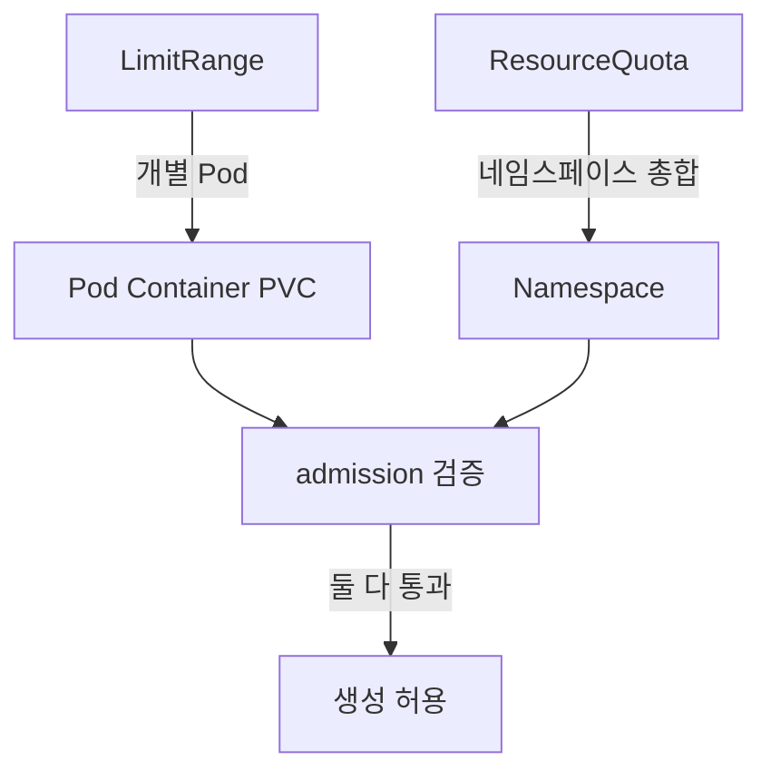
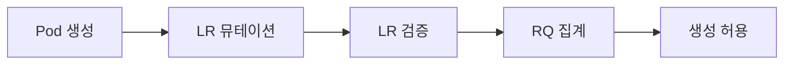

# LimitRange·ResourceQuota

**LimitRange**와 **ResourceQuota**는 **네임스페이스 경계를 지키는 두 축**이다.
둘은 이름이 비슷하지만 **작동 레이어가 전혀 다르다**:

- **LimitRange**: **개별 Pod/Container/PVC** 하나하나의 requests·limits에
  기본값·하한·상한을 부여
- **ResourceQuota**: **네임스페이스 총합**(CPU·메모리·오브젝트 개수 등)을
  제한

그리고 **함께 써야 비로소 안전**해진다. ResourceQuota가 compute 쿼터를
설정하면 **모든 Pod에 requests/limits 명시가 강제**되는데, 여기서
LimitRange가 **기본값을 주입해 admission을 통과**시킨다. 한쪽만 쓰면
**Pod 시작 실패 루프** 또는 **한 팀이 전체 클러스터 잠식**으로 이어진다.

이 글은 두 오브젝트의 스펙, **스코프(Terminating·PriorityClass·DRA 등)**
의 실무 활용, 둘의 상호작용, 멀티테넌시 운영 패턴, 안티패턴까지 다룬다.

> 관련: [Requests·Limits](./requests-limits.md) · [네임스페이스 설계](./namespace-design.md)

---

## 1. 위치 — "레이어가 다른 두 제약"



| 축 | LimitRange | ResourceQuota |
|---|---|---|
| 대상 | 개별 오브젝트 | 네임스페이스 전체 합 |
| 종류 | Container·Pod·PVC | compute·storage·count·extended |
| 필드 | `max`·`min`·`default`·`defaultRequest`·`maxLimitRequestRatio` | `hard` + 선택적 `scopes`·`scopeSelector` |
| 실패 시 | admission reject(HTTP 403) | admission reject |
| 실행 중 Pod | **영향 없음** | 영향 없음 |

**기억 규칙**:
- **LR = 브레이크**(개별 속도 제한)
- **RQ = 연료 탱크**(합친 용량)

---

## 2. LimitRange 스펙

```yaml
apiVersion: v1
kind: LimitRange
metadata:
  name: container-defaults
spec:
  limits:
  - type: Container
    max:                   # Pod 생성 시 limits <= max 검증
      cpu: "2"
      memory: 2Gi
    min:                   # requests >= min
      cpu: 50m
      memory: 64Mi
    default:               # limits 미지정 시 주입
      cpu: 500m
      memory: 512Mi
    defaultRequest:        # requests 미지정 시 주입
      cpu: 100m
      memory: 128Mi
    maxLimitRequestRatio:  # limit / request <= ratio
      cpu: "4"
      memory: "2"
  - type: Pod
    max:
      cpu: "4"
      memory: 4Gi
  - type: PersistentVolumeClaim
    max:
      storage: 100Gi
    min:
      storage: 1Gi
```

### 필드 의미

| 필드 | 목적 | 검증 시점 |
|---|---|---|
| `default` | limits 미지정 시 **주입** | admission(mutation) |
| `defaultRequest` | requests 미지정 시 **주입** | admission(mutation) |
| `min` | requests 최소값 검증 | admission(validate) |
| `max` | limits 최대값 검증 | admission(validate) |
| `maxLimitRequestRatio` | overcommit 비율 상한 | admission(validate) |

### 동작 순서

1. **Mutation**: `default`·`defaultRequest` **주입**
2. **Validation**: `min`·`max`·`maxLimitRequestRatio` **검증**
3. 통과 → Pod 생성. 실패 → HTTP 403

### 주의 — "default < request"의 함정

```yaml
# LimitRange
default:    { cpu: 500m }
defaultRequest: { cpu: 500m }

# Pod
resources:
  requests: { cpu: 700m }   # limits 미지정
  # 결과: limits = 500m (LR default) + requests = 700m → limits < requests
  # → API reject: "must be less than or equal to cpu limit"
```

**LR은 default와 request의 일관성을 검증하지 않는다**. 사용자가 requests를
default보다 크게 주면서 limits를 생략하면 거부.

### 다중 LimitRange는 **비결정적**

한 네임스페이스에 LimitRange가 **두 개 이상**이면 어느 default가 적용되는지
**보장되지 않는다**(공식 권고). **네임스페이스당 하나**로 제한할 것.

---

## 3. ResourceQuota 스펙

```yaml
apiVersion: v1
kind: ResourceQuota
metadata:
  name: team-a-quota
spec:
  hard:
    # compute
    requests.cpu: "20"
    requests.memory: 40Gi
    limits.cpu: "40"
    limits.memory: 80Gi
    # extended (GPU) — requests. prefix만 가능
    requests.nvidia.com/gpu: "4"
    # storage
    requests.storage: 200Gi
    persistentvolumeclaims: "20"
    # 스토리지 클래스별 세분화
    rook-ceph-block.storageclass.storage.k8s.io/requests.storage: 100Gi
    # object count
    pods: "100"
    services: "30"
    configmaps: "50"
    secrets: "50"
    deployments.apps: "20"
```

### 자원 카테고리

| 카테고리 | 예 |
|---|---|
| compute | `requests.cpu`·`requests.memory`·`limits.cpu`·`limits.memory`·`hugepages-<size>` |
| extended | `requests.nvidia.com/gpu`·`requests.amd.com/gpu`·`requests.intel.com/gpu.i915` (limits.* **불가**) |
| DRA | `<device-class-name>.deviceclass.resource.k8s.io/devices` (예: `examplegpu.deviceclass.resource.k8s.io/devices`). **1.32 Beta, 1.34+ 프로덕션 권장**. `DRAResourceQuota` feature gate |
| storage | `requests.storage`·`persistentvolumeclaims`·`<sc>.storageclass.storage.k8s.io/...` |
| count | `pods`·`services`·`configmaps`·`secrets`·`<kind>.<group>` |

### `cpu`·`memory` alias

`spec.hard.cpu`는 **`requests.cpu`의 alias**다. 명시적으로 `requests.cpu`
를 쓰는 편이 가독성·혼동 방지에 유리.

---

## 4. Scope·ScopeSelector — 고급 사용

같은 네임스페이스 안에서도 **부분집합에만 적용**되는 쿼터.

### `scopes`로 단순 분리

```yaml
scopes:
- NotTerminating        # activeDeadlineSeconds 없는 Pod만
- NotBestEffort         # requests/limits 있는 Pod만
```

| 스코프 | 대상 |
|---|---|
| `Terminating` | Pod `spec.activeDeadlineSeconds`가 **nil이 아닌** Pod (보통 Job이 아래로 전파한 Pod) |
| `NotTerminating` | 위가 아닌 모든 Pod |
| `BestEffort` | **BestEffort QoS 클래스**(모든 컨테이너가 CPU·memory requests/limits를 하나도 안 줌) |
| `NotBestEffort` | BestEffort가 아닌 Pod |

**제약**:
- 한 RQ에 `Terminating`+`NotTerminating`을 **동시 지정하면 매칭되는 Pod이
  없음** → 쿼터 무용. `BestEffort`+`NotBestEffort`도 마찬가지
- `BestEffort` 스코프는 **compute 리소스 제한 불가**. `pods` count 정도만
  의미 있음
- `Job.spec.activeDeadlineSeconds`가 Pod `spec`으로 **자동 전파되지 않을
  수 있음** — Pod 레벨 직접 확인 필요

### `scopeSelector`로 라벨 기반

```yaml
scopeSelector:
  matchExpressions:
  - operator: In
    scopeName: PriorityClass
    values: ["high", "platinum"]
```

- `PriorityClass`: 우선순위별 쿼터 분리(고우선순위는 별도 제한)
- `CrossNamespacePodAffinity`: 크로스 네임스페이스 affinity 사용 Pod 제한
- `VolumeAttributesClass`: **PVC**(Pod 아님)에 적용. VAC는 1.31 Beta, **1.34 GA**. `<=1.31`은 scopeSelector 버그로 제한 불완전, **1.32+ / VAC 자체는 1.34+** 권장

`scopeSelector` 연산자:
- `In`/`NotIn`: 값 배열 **비어 있지 않아야** 함
- `Exists`: 값 배열 **비어 있어야** 함 — "모든 PriorityClass 지정 Pod" 같은 패턴에 유용

### 실전 — 배치·서비스 분리

```yaml
# 장기 서비스용 — 큰 쿼터
apiVersion: v1
kind: ResourceQuota
metadata: { name: online, namespace: team-a }
spec:
  hard:   { requests.cpu: "40", requests.memory: 80Gi }
  scopes: [NotTerminating]
---
# 배치 Job용 — 별도 쿼터
apiVersion: v1
kind: ResourceQuota
metadata: { name: batch, namespace: team-a }
spec:
  hard:   { requests.cpu: "20", requests.memory: 40Gi }
  scopes: [Terminating]
```

팀 예산을 **서비스 60 / 배치 40** 으로 분리. 배치가 서비스 슬롯을 잠식하는
사고 방지.

---

## 5. 상호작용 — "둘이 함께 써야 한다"

**단독 RQ의 함정**:

```yaml
# ResourceQuota만 설정
spec:
  hard:
    requests.cpu: "10"
    requests.memory: 20Gi
    limits.cpu: "20"
    limits.memory: 40Gi
```

- 이제 **모든 신규 Pod는 requests/limits 명시 필수**
- 사용자가 누락하면 admission reject — **대량 장애**
- 해결: **LimitRange로 default 주입**

```yaml
# 세트로 함께 배포
apiVersion: v1
kind: LimitRange
metadata: { name: defaults, namespace: team-a }
spec:
  limits:
  - type: Container
    defaultRequest: { cpu: 100m, memory: 128Mi }
    default:        { cpu: 500m, memory: 512Mi }
```

### admission 순서



1. **LimitRange Mutation**: default 주입
2. **LimitRange Validation**: min/max 검증
3. **ResourceQuota Check**: 네임스페이스 합산 검증

한쪽만 쓰면 안전하지 않다. **반드시 둘을 함께**.

### 배포 순서 — GitOps에서 자주 막히는 지점

네임스페이스에 LR·RQ·Workload를 함께 apply할 때 **순서가 중요**:

1. **LimitRange 먼저** — default 주입 준비
2. **ResourceQuota 다음** — 제한 활성
3. **Workload 마지막** — LR가 default 주입, RQ가 예산 검증

반대 순서(RQ 먼저)로 하면 기존 requests/limits 미지정 Pod의 **재생성이
reject되어 Deployment 롤링 실패로 정지**한다. Argo CD `sync-wave`·Flux
`dependsOn`으로 순서를 명시.

### Pod-Level Resource Spec(KEP-2837)과의 상호작용 — 1.32 Beta

1.32부터 `spec.resources`가 **Pod 레벨**에 도입됐다. 기존엔 컨테이너 단위
합산이었던 리소스 선언을 **Pod 전체로 지정** 가능:

```yaml
spec:
  resources:
    requests: { cpu: 1, memory: 2Gi }
    limits:   { cpu: 2, memory: 4Gi }
  containers:
  - name: app
    # 컨테이너 requests/limits 미지정 — Pod 레벨에서 집계
```

**주의**:
- RQ의 `requests.cpu`·`limits.cpu` 계산에 **Pod 레벨 값이 반영**됨
- LimitRange의 `type: Container` 기본값은 Pod-level spec과 **공존 규칙이
  단순하지 않음**
- 현재 Beta 상태, 프로덕션 투입 전 동작 검증 필요

---

## 6. 멀티테넌시 운영 패턴

### 패턴 1: 팀별 네임스페이스 + 표준 번들

```yaml
# 네임스페이스 생성 템플릿(Kustomize·Helm·Operator)
- Namespace
- LimitRange(defaults)
- ResourceQuota(online, NotTerminating)
- ResourceQuota(batch, Terminating)
- NetworkPolicy(default-deny)
- ServiceAccount(default with limited RBAC)
```

네임스페이스 **생성 시 같이 배포할 "기본 리소스 세트"**를 Operator/
GitOps로 표준화.

### 패턴 2: PriorityClass 기반 버스트 허용

| 우선순위 | 쿼터 | 의미 |
|---|---|---|
| `standard` | `requests.cpu: 20` | 일반 워크로드 |
| `high` | `requests.cpu: 10` | 중요 서비스(이미 Guaranteed) |
| `burst`(특수 PriorityClass) | `requests.cpu: 5` | **일시 버스트 예산** — preemptible |

`scopeSelector: PriorityClass`로 쿼터 분리. 버스트는 전체 예산과 독립된
작은 슬롯이지만 언제든 preempt 가능.

### 패턴 3: 스토리지 클래스별 제한

```yaml
hard:
  rook-ceph-block.storageclass.storage.k8s.io/requests.storage: 500Gi
  rook-ceph-block.storageclass.storage.k8s.io/persistentvolumeclaims: "20"
  # 고속 SSD는 총 500Gi·PVC 20개까지
  standard.storageclass.storage.k8s.io/requests.storage: 2Ti
  # 느린 스토리지는 2Ti 허용
```

온프레미스 rook-ceph처럼 클래스별 비용/성능이 다를 때 필수.

---

## 7. 실행 중 모니터링

```bash
# 네임스페이스 쿼터 현황
kubectl describe resourcequota -n team-a

# 전체 네임스페이스 usage 요약
kubectl get resourcequota -A -o json \
  | jq -r '.items[] | [.metadata.namespace, .metadata.name, (.status.used // {}), (.status.hard // {})] | @json'

# usage가 90% 이상인 네임스페이스 찾기
kubectl get resourcequota -A -o json | jq -r '
  .items[] |
  .status as $s |
  ($s.used | to_entries[]) as $u |
  ($s.hard[$u.key] // null) as $h |
  select($h != null and ($u.value | tonumber? // 0) / ($h | tonumber? // 1) > 0.9) |
  "\(.metadata.namespace)\t\(.metadata.name)\t\($u.key)\t\($u.value)/\($h)"
'
```

### Prometheus 메트릭

| 메트릭 | 의미 |
|---|---|
| `kube_resourcequota{type="used"}` | 현재 사용량 (kube-state-metrics 필요) |
| `kube_resourcequota{type="hard"}` | 한도 (kube-state-metrics 필요) |
| 알람: `used / hard > 0.9` | 임박 경고 |
| 알람: 생성 실패 이벤트 `reason=FailedCreate` 급증 | 쿼터 바닥 |

---

## 8. 안티패턴

| 안티패턴 | 결과 | 대안 |
|---|---|---|
| ResourceQuota만 설정 + LimitRange 없음 | **대량 Pod 시작 실패** | LimitRange default와 반드시 세트 |
| LimitRange만 설정 | 네임스페이스 총합 제어 없음 | ResourceQuota 추가 |
| 한 네임스페이스에 **다중 LimitRange** | 비결정적 default | 하나로 통합 |
| CPU만 쿼터, memory 누락 | 메모리 누수 한 Pod이 노드 잠식 | `limits.memory` 필수 |
| `BestEffort` 스코프로 영영 제한 없이 운영 | eviction 폭탄 | 명시적 제한 |
| RQ 생성 **후** 기존 Pod에 적용 기대 | RQ는 신규만 영향 | 재배포로 반영 |
| count 쿼터 없이 services·configmaps 무한 | apiserver 부하 | count 쿼터 |
| 스토리지클래스 미분 쿼터 | 고비용 SSD를 누군가 독점 | `<sc>.storageclass.storage.k8s.io/requests.storage` |
| `requests.nvidia.com/gpu` **`limits.*`로 시도** | API reject | `requests.` prefix만 |
| PriorityClass 스코프 미사용·단일 RQ | 배치가 서비스 예산 소진 | scope 분리 |
| `kubectl apply` 한 번으로 RQ 올리기 | 진행 중 Pod에 영향 없음 → 기대치 misalign | 점진 상향 + 모니터링 |

---

## 9. 프로덕션 체크리스트

- [ ] 모든 워크로드 네임스페이스에 **LimitRange + ResourceQuota 세트** 배포
- [ ] LimitRange는 **하나만**(다중 LR 금지)
- [ ] ResourceQuota에 **requests·limits 양쪽** compute 제한 설정
- [ ] memory 쿼터 누락 여부 점검 — CPU만 있는 네임스페이스 없어야
- [ ] PriorityClass 스코프로 **서비스 vs 배치** 분리 쿼터
- [ ] 스토리지클래스별 쿼터(rook-ceph-block, standard 등)
- [ ] count 쿼터(`pods`·`services`·`configmaps`·`secrets`) 합리적 상한
- [ ] `kube_resourcequota used/hard > 0.9` 알람
- [ ] `FailedCreate` 이벤트 급증 알람
- [ ] 네임스페이스 생성 템플릿(Operator/GitOps)에 LR·RQ·NetPol 포함
- [ ] 쿼터 상향은 **PR 기반 리뷰·GitOps 변경 이력**
- [ ] RQ 변경이 **실행 중 Pod에 영향 없다**는 사실 팀에 교육

---

## 10. 트러블슈팅

| 증상 | 근본 원인 | 진단·조치 |
|---|---|---|
| `forbidden: exceeded quota` | RQ 한도 초과 | `describe resourcequota`, 예산 재편 |
| `must specify requests.cpu` | RQ는 있는데 LR의 default 없음 | LimitRange 배포 |
| `spec.containers[0].resources.requests: Invalid value` | LR default와 requests 충돌 | limits 명시 |
| `PersistentVolumeClaim exceeds quota` | storage/스토리지클래스 쿼터 | 쿼터 상향 또는 claim 축소 |
| `pods must not exceed quota` | count 쿼터 | pods 상향 또는 정리 |
| batch Job이 서비스 쿼터까지 사용 | scope 분리 안 함 | `scopes: [Terminating]` |
| `limits.cpu: 5` 미사용인데 쿼터 소진 | 실행 중 Pod의 limit 합 | 과거 큰 limit 설정 검토 |
| RQ 수정 후 반영 안 됨 | 기존 Pod 그대로 계산 | 재배포로 새 요구치 반영 |
| **RQ가 전파되지 않음** | admission plugin `ResourceQuota` 비활성 | kube-apiserver `--enable-admission-plugins` 확인 |
| DRA 자원이 쿼터에 잡히지 않음 | 1.32+ DRA quota 필드명 확인 | `<class>.deviceclass.resource.k8s.io/devices` |

### 자주 쓰는 명령

```bash
# 한 네임스페이스의 쿼터 상태 상세
kubectl describe resourcequota -n <ns>

# LR/RQ 전체 목록
kubectl get limitrange,resourcequota -A

# 쿼터 에러 이벤트
kubectl get events -A --field-selector reason=FailedCreate | grep -i quota

# admission plugin 확인 (kube-apiserver manifest)
sudo grep enable-admission-plugins /etc/kubernetes/manifests/kube-apiserver.yaml

# Pod 생성 시 LR 주입된 값 비교(mutating 확인)
kubectl get pod <name> -o jsonpath='{.spec.containers[0].resources}'
```

---

## 11. 이 카테고리의 경계

- **LimitRange·ResourceQuota 자체** → 이 글
- **개별 Pod의 requests/limits·QoS·쓰로틀·OOM** → [Requests·Limits](./requests-limits.md)
- **네임스페이스 설계·테넌시 패턴** → [네임스페이스 설계](./namespace-design.md)
- **PriorityClass·Preemption** → `scheduling/priority-preemption`
- **HPA·VPA·Cluster Autoscaler** → `autoscaling/`
- **DRA·GPU·hugepages** → `special-workloads/` · `ai-ml/`
- **NetworkPolicy·멀티테넌시 보안** → `security/`

---

## 참고 자료

- [Kubernetes — Limit Ranges](https://kubernetes.io/docs/concepts/policy/limit-range/)
- [Kubernetes — Resource Quotas](https://kubernetes.io/docs/concepts/policy/resource-quotas/)
- [Kubernetes — Configure Default CPU/Memory Requests and Limits](https://kubernetes.io/docs/tasks/administer-cluster/manage-resources/)
- [LimitRange API v1](https://kubernetes.io/docs/reference/kubernetes-api/policy-resources/limit-range-v1/)
- [ResourceQuota API v1](https://kubernetes.io/docs/reference/kubernetes-api/policy-resources/resource-quota-v1/)
- [KEP-3760 — Resource Quota with Scope Selector for Cross-Namespace Affinity](https://github.com/kubernetes/enhancements/issues/3760)
- [KEP-2837 — Pod Level Resource Specifications](https://github.com/kubernetes/enhancements/blob/master/keps/sig-node/2837-pod-level-resource-spec/README.md)
- [Kubernetes — DRA Resource Quotas](https://kubernetes.io/docs/concepts/scheduling-eviction/dynamic-resource-allocation/)

(최종 확인: 2026-04-22)
