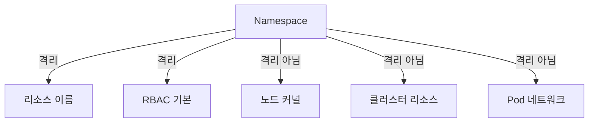
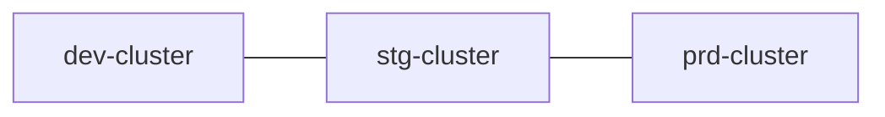
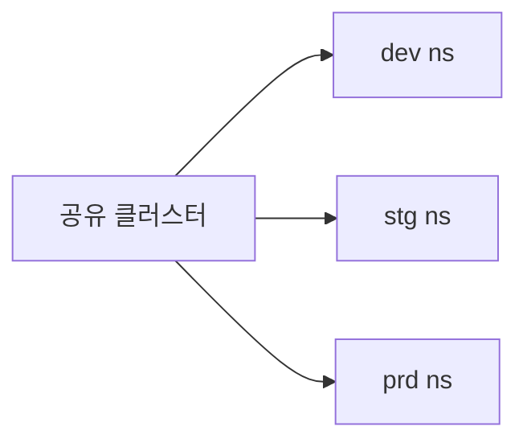
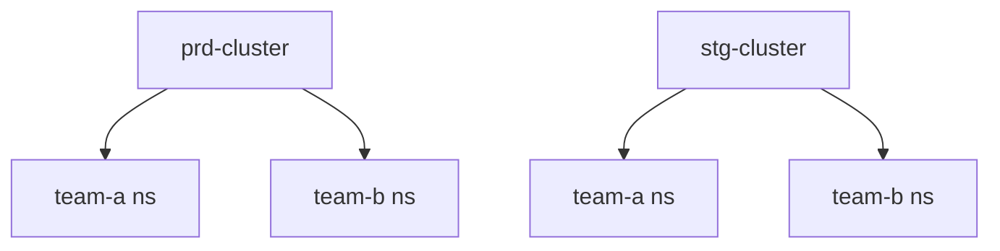
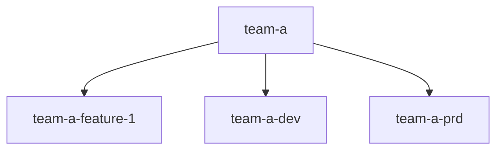

# 네임스페이스 설계

Kubernetes 네임스페이스는 **리소스 이름 공간**이지 **보안 경계**가 아니다.
이 한 문장이 네임스페이스 설계의 시작점이다. 네임스페이스만으로는 테넌트를
격리할 수 없고, RBAC·NetworkPolicy·ResourceQuota·PodSecurity를 함께 써야
비로소 "운영 가능한 경계"가 만들어진다.

이 글은 네임스페이스가 **무엇을 격리하고 무엇을 격리하지 못하는지**, 주요
**분리 축**(환경·팀·앱·테넌트), 실무 **배치 패턴 3가지**(cluster-per-env /
namespace-per-env / hybrid), 네임스페이스 **생성 시 같이 배포할 기본 리소스
세트**, **Hierarchical Namespaces(HNC)**, 그리고 vCluster·Capsule과의 경계
까지 다룬다.

> 관련: [LimitRange·ResourceQuota](./limitrange-resourcequota.md)
> · [Requests·Limits](./requests-limits.md) · 멀티테넌시/vCluster → `multi-tenancy/`

---

## 1. 네임스페이스가 격리하는 것·못하는 것



| 격리되는 것 | 격리 안 되는 것 |
|---|---|
| 오브젝트 이름 (같은 이름 다른 네임스페이스에 공존) | **노드 커널·cgroup**(같은 노드 다른 Pod) |
| RBAC `Role` 기본 scope | ClusterRole, CRD, ClusterIssuer 같은 **cluster-scoped** 리소스 |
| NetworkPolicy 적용 범위 기준 | **Pod → Pod L3/L4 통신** (NetworkPolicy 없으면 전부 허용) |
| 기본 Service DNS suffix | PersistentVolume의 **노드 로컬 스토리지** |
| ResourceQuota 단위 | kubelet·CNI·CSI 같은 **호스트 컴포넌트** |

**원칙**: 네임스페이스는 "누가 어떤 리소스를 만들 수 있나"의 스코핑 도구.
**실제 격리는 NetworkPolicy + RBAC + PSA(Pod Security Admission) + RQ/LR**의
조합이 만든다.

---

## 2. 분리 축 — 무엇을 기준으로 네임스페이스를 나눌까

실제 조직은 여러 축이 동시 적용된다.

| 축 | 예 | 장점 | 단점 |
|---|---|---|---|
| **환경** | `dev`·`stg`·`prd` | 단순, RQ 분리 용이 | **제어 플레인 공유** — 업그레이드·API 장애 파급 |
| **팀** | `team-payments`·`team-growth` | 오너십 명확, RBAC 단순 | 다른 환경 공존 시 혼재 |
| **애플리케이션** | `svc-checkout`·`svc-orders` | 리소스 경계 명확 | 팀과 1:N이면 RBAC 복잡 |
| **테넌트**(SaaS) | `tenant-abc`·`tenant-xyz` | 테넌트별 쿼터·RBAC | 수백~수천 개 네임스페이스 관리 비용 |
| **시스템** | `kube-system`·`monitoring`·`ingress` | 플랫폼 vs 워크로드 분리 | 일반적으로 당연 |

### 조합 매트릭스 — "팀 × 앱 × 환경"의 실제 네이밍

| 조합 | 예 | 규모 |
|---|---|---|
| 환경만 | `dev`·`prd` | 작은 조직 |
| 팀+환경 | `team-a-dev`·`team-a-prd` | 중간 규모 |
| 팀+앱+환경 | `payments-checkout-prd` | 대규모 |
| 앱+환경 (팀은 RBAC) | `checkout-prd` | 많은 팀이 한 앱 공유 |

**권장 네이밍 규칙** (RFC 1123):
- 소문자·숫자·`-`만
- 라벨 63자, 전체 253자
- 예약 prefix 피하기: `kube-`, `openshift-`, `istio-system`, `linkerd` 등

---

## 3. 배치 패턴 3가지 — 클러스터 전략

### 패턴 A: Cluster-per-Environment (환경별 별도 클러스터)



- **가장 안전** — 환경 간 제어 플레인 완전 분리
- 업그레이드 리허설이 dev·stg에서 가능
- 온프레미스에서 **가장 전형적**

| 장점 | 단점 |
|---|---|
| 환경 간 블래스트 반경 0 | 클러스터 유지 비용 증가 |
| 업그레이드·API 장애 격리 | 플랫폼 도구(Prometheus·ArgoCD) 중복 |
| compliance 단순 | 크로스 환경 테스트 어려움 |

### 패턴 B: Namespace-per-Environment (한 클러스터 안에 dev·stg·prd)



- 비용 최적, 시작 단계에 매력적
- **절대 권장 안 함** — 제어 플레인 장애가 모든 환경 파급, RBAC 실수가
  prd 직결
- 온프레미스·엣지에서 **자원 극도로 제한**될 때만 예외

### 패턴 C: Hybrid — 환경 클러스터 분리 + 환경 내부 팀·앱 네임스페이스



- **현업 표준** — 환경은 클러스터로, 팀·앱은 네임스페이스로
- 제어 플레인 격리 + 운영 비용 균형
- 온프레미스 rook-ceph 스토리지 클러스터도 **환경별 분리**가 정석

### 결정 매트릭스

| 기준 | A: cluster-per-env | C: hybrid | B: ns-per-env |
|---|:-:|:-:|:-:|
| 제어 플레인 격리 | ✅ | ✅ | ❌ |
| 비용 | 높음 | 중간 | 낮음 |
| compliance(PCI·SOC2) | ✅ | 조건부 | ❌ |
| 팀 단위 격리 | ✅ | ✅ | 약함 |
| 운영 복잡도 | 중간 | 낮음 | 낮음 |

→ **기본 선택은 Hybrid**. 규제 요건 있으면 A. B는 피해야 함.

---

## 4. 네임스페이스 생성 시 "기본 리소스 세트"

네임스페이스를 만들 때 **항상 같이** 배포해야 하는 리소스 묶음.

```yaml
# 1. Namespace
apiVersion: v1
kind: Namespace
metadata:
  name: team-a
  labels:
    pod-security.kubernetes.io/enforce: baseline
    pod-security.kubernetes.io/enforce-version: v1.35    # 고정 버전 권장
    pod-security.kubernetes.io/audit: restricted
    pod-security.kubernetes.io/warn: restricted
    team: team-a
    environment: prd

# 2. LimitRange (default 주입)
---
apiVersion: v1
kind: LimitRange
metadata: { name: defaults, namespace: team-a }
spec:
  limits:
  - type: Container
    default:        { cpu: 500m, memory: 512Mi }
    defaultRequest: { cpu: 100m, memory: 128Mi }
    max:            { cpu: "4", memory: 8Gi }

# 3. ResourceQuota
---
apiVersion: v1
kind: ResourceQuota
metadata: { name: online, namespace: team-a }
spec:
  hard:
    requests.cpu: "20"
    requests.memory: 40Gi
    limits.cpu: "40"
    limits.memory: 80Gi
    pods: "100"
  scopes: [NotTerminating]

# 4. NetworkPolicy — default deny
---
apiVersion: networking.k8s.io/v1
kind: NetworkPolicy
metadata: { name: default-deny, namespace: team-a }
spec:
  podSelector: {}
  policyTypes: [Ingress, Egress]

# 5. ServiceAccount (자동 마운트 off)
---
apiVersion: v1
kind: ServiceAccount
metadata: { name: default, namespace: team-a }
automountServiceAccountToken: false

# 6. RoleBinding (팀 그룹에 role 부여)
---
apiVersion: rbac.authorization.k8s.io/v1
kind: RoleBinding
metadata: { name: team-a-developers, namespace: team-a }
subjects:
- { kind: Group, name: team-a-developers, apiGroup: rbac.authorization.k8s.io }
roleRef:
  { kind: ClusterRole, name: edit, apiGroup: rbac.authorization.k8s.io }
```

### 자동화

- **Operator 패턴**: Namespace 생성 이벤트를 watch해 위 세트 자동 배포
  (예: [Project Capsule](https://projectcapsule.dev/), retired된 [HNC](https://github.com/kubernetes-retired/hierarchical-namespaces))
- **GitOps**: Argo CD ApplicationSet로 네임스페이스당 리소스 생성
- **Kyverno/OPA Gatekeeper**: 네임스페이스 **생성 시 정책 강제**(라벨 필수, LR/RQ 존재 필수)
- **kro**(Kube Resource Orchestrator, CNCF Sandbox): `ResourceGroup`으로
  네임스페이스 + 부속 리소스 세트를 한 덩어리로 선언

NetworkPolicy는 **Cilium/Calico/kube-router** 등 NetPol 지원 CNI에서만
동작. Flannel 기본은 NetPol 무시 → 실제 격리 효과 없음을 사전 확인.

---

## 5. PodSecurity Admission — 네임스페이스 단위 강제

```yaml
metadata:
  labels:
    pod-security.kubernetes.io/enforce: baseline
    pod-security.kubernetes.io/enforce-version: latest
    pod-security.kubernetes.io/audit: restricted
    pod-security.kubernetes.io/warn: restricted
```

| 프로파일 | 의미 |
|---|---|
| `privileged` | 거의 무제한(시스템 네임스페이스 전용) |
| **`baseline`** | 권한 상승 방지 — 운영 기본 |
| **`restricted`** | 최강. `runAsNonRoot`·`seccompProfile` 등 엄격 |

**원칙**:
- `enforce`는 `baseline`부터, 새 워크로드는 `restricted` 목표
- `audit`·`warn`은 `restricted`로 두어 **점진 마이그레이션**
- **`enforce-version`은 `v1.35`처럼 고정**. `latest`는 클러스터 업그레이드
  시 restricted 규칙이 조용히 바뀌어 기존 Pod이 reject되는 사고 유발 —
  업그레이드마다 명시적으로 bump

PSA 상세는 → `kubernetes/security/pod-security-admission`.

---

## 6. Hierarchical Namespaces (HNC)

HNC는 **네임스페이스에 부모-자식 관계**를 부여해 정책을 **자동 전파**.



### 기능

- 부모의 `Role`·`RoleBinding`·`NetworkPolicy`·`ResourceQuota` 등이 **자식에
  자동 복제**
- **위임 생성**: 팀이 클러스터 관리자 권한 없이 **자식 네임스페이스 생성**
- `HierarchyConfiguration` CR로 상속 설정

### 상태 (2026-04 기준)

- 공식 K8s 프로젝트에서 **retired 상태** — `kubernetes-retired/` 리포
- 운영 중인 조직은 여전히 유지 중이지만 **신규 도입 시 대안 검토 권장**
- 대안: **Capsule**(네임스페이스 오케스트레이션), **vCluster**(가상 클러스터)

### Capsule — 네임스페이스 오케스트레이션 (CNCF Sandbox)

- `Tenant` CR 하나가 여러 네임스페이스를 묶어 **팀 경계** 제공
- 팀별 allowed container registries·node selectors·ingress class 강제
- HNC보다 **활발한 유지보수** — 2022-12 CNCF Sandbox 합류, 현재 `projectcapsule/capsule`
- **규모 가이드**: 팀당 네임스페이스 500개 이상 또는 테넌트 수 50개 이상이면
  Capsule `Tenant` 모델로 단일화 권장

### vCluster — "네임스페이스 속 클러스터"

- 한 네임스페이스 안에 **가상의 K8s 컨트롤 플레인** 기동
- 테넌트가 **CRD·ClusterRole까지** 독립적으로 가짐
- 본격 격리 — HNC/Capsule보다 한 단계 무거움

→ 상세 비교는 `kubernetes/multi-tenancy/` 섹션.

---

## 7. 운영 모범 — 라벨·annotation 표준

모든 네임스페이스에 **강제해야 하는 라벨**:

| 키 | 값 예 | 용도 |
|---|---|---|
| `team` | `team-a` | 오너십·FinOps 비용 분류 |
| `environment` | `prd`/`stg`/`dev` | 환경 필터·알람 라우팅 |
| `cost-center` | `billing-2024-1234` | FinOps 태깅 |
| `tier` | `platform`·`workload`·`system` | 플랫폼 vs 워크로드 구분 |
| `managed-by` | `argocd`·`manual` | GitOps 관리 여부 |
| `pod-security.kubernetes.io/enforce` | `baseline` | PSA 강제 |

### Kyverno로 라벨 강제

```yaml
apiVersion: kyverno.io/v1
kind: ClusterPolicy
metadata: { name: require-ns-labels }
spec:
  validationFailureAction: Enforce
  rules:
  - name: check-team-label
    match:
      any:
      - resources: { kinds: [Namespace] }
    validate:
      message: "Namespace must have 'team' and 'environment' label"
      pattern:
        metadata:
          labels:
            team: "?*"
            environment: "?*"
```

---

## 8. 안티패턴

| 안티패턴 | 결과 | 대안 |
|---|---|---|
| `default` 네임스페이스에 운영 워크로드 | RBAC·정책 없음, 임시 리소스와 혼재 | 전용 네임스페이스 |
| **환경을 네임스페이스로만** 분리 | 제어 플레인 장애가 전 환경 파급 | cluster-per-env 또는 Hybrid |
| LR/RQ 없이 네임스페이스 생성 | 첫 인시던트 시 한 팀이 전체 점유 | 생성 템플릿에 세트 포함 |
| NetworkPolicy 없이 네임스페이스만으로 격리 | Pod 간 전부 통신 가능 | default-deny NetPol 기본 |
| 팀당 1 네임스페이스 고집 | 앱 간 혼선, PDB·HPA 스코프 얽힘 | 팀+앱 조합 |
| 팀 권한을 **ClusterRoleBinding**으로 부여 | 전체 클러스터 접근 | `RoleBinding` + `Role`로 네임스페이스 한정 |
| 예약 prefix(`kube-`·`istio-system`) 사용 | 충돌·권한 실수 | 금지 |
| 네임스페이스 이름에 `_`·대문자 | RFC 1123 위배 reject | 소문자+`-` |
| PSA 라벨 미적용 | 권한 상승 Pod 수락 | `baseline` 이상 강제 |
| 생성된 네임스페이스에 RoleBinding 수동 추가 | 일관성 붕괴 | 생성 템플릿 자동화 |
| 테넌트마다 별도 클러스터를 자동 가정 | 비용·운영 폭증 | Capsule·vCluster 검토 |
| 네임스페이스 삭제를 **부주의하게** | 내부 Pod·PVC 일괄 삭제 → 데이터 손실 | finalizer·백업·승인 절차 |

---

## 9. 프로덕션 체크리스트

- [ ] **환경은 클러스터로, 팀·앱은 네임스페이스로** (Hybrid 패턴)
- [ ] 모든 워크로드 네임스페이스에 **LR + RQ + NetworkPolicy(default-deny) + PSA 라벨 + ServiceAccount(automount off)** 기본 세트
- [ ] 네임스페이스 생성은 **Operator/Kyverno/GitOps 자동화** — 수동 kubectl 금지
- [ ] 표준 라벨(team, environment, cost-center 등) **Kyverno로 강제**
- [ ] `default` 네임스페이스 **비워두기**
- [ ] 예약 prefix 네이밍 **차단**
- [ ] PSA 현재 상태 대시보드(네임스페이스별 enforce 프로파일)
- [ ] 테넌트 수 많으면 **Capsule/vCluster** 검토
- [ ] 네임스페이스 삭제는 **승인 절차 + 리소스 사전 백업**
- [ ] 크로스 네임스페이스 Service 액세스는 **명시적 NetworkPolicy + RBAC**
- [ ] ResourceQuota 사용률 대시보드
- [ ] HNC 사용 중이면 **retirement 인지 + 마이그레이션 계획**

---

## 10. 트러블슈팅

| 증상 | 근본 원인 | 진단·조치 |
|---|---|---|
| 네임스페이스가 **`Terminating` 상태로 멈춤** | finalizer 남음(주로 PV 정리·CRD instance·외부 리소스 컨트롤러) | 먼저 `kubectl describe ns <name>` 로그 분석 → 원인 finalizer 담당 컨트롤러 복구. 강제 제거(`/finalize` 엔드포인트)는 **최후 수단** — rook-ceph PV 등 고아화 위험 |
| 같은 이름 리소스가 다른 네임스페이스에서 충돌 | ClusterRole·Webhook 같은 **cluster-scoped** | 리소스 kind 확인 |
| `default` 네임스페이스에 계속 자원이 생김 | `kubectl apply` 파일에 `namespace:` 누락 | 템플릿 정비 |
| 팀 A가 팀 B 네임스페이스 리소스 수정 | ClusterRole 과다 부여 | Role로 네임스페이스 한정 |
| NetworkPolicy 걸었는데 **트래픽 통함** | CNI가 NetPol 지원 안 함 or default-allow | Cilium/Calico 확인, default-deny |
| PSA가 기존 Pod을 reject하지 않음 | `enforce`는 **신규만** 검증 | `audit`·`warn`으로 점진 마이그레이션 |
| cross-namespace Service DNS 해석 안 됨 | CoreDNS 또는 NetPol | `<svc>.<ns>.svc.cluster.local`, NetPol egress |
| 수천 네임스페이스 생성 시 apiserver 느림 | 리소스 watch 부하 | HNC 대신 Capsule·vCluster |
| HNC 컨트롤러 업데이트 안 됨 | **retired 프로젝트** | Capsule/vCluster 이관 |

### 자주 쓰는 명령

```bash
# 네임스페이스 라벨 미준수
kubectl get ns -L team,environment

# 네임스페이스 Terminating 강제 해제 — 최후 수단, 데이터 손실 위험
# 이 명령은 finalizer 담당 컨트롤러의 cleanup(PV release, CRD 정리, 외부 리소스
# 회수)을 건너뛴다. rook-ceph PV·외부 리소스 고아화 위험.
# 반드시: 먼저 `kubectl describe ns <name>`로 남은 리소스·finalizer 확인,
# PVC·PV·CRD instance 수동 정리 완료 후 실행.
kubectl get ns <name> -o json \
  | jq '.spec.finalizers = []' \
  | kubectl replace --raw "/api/v1/namespaces/<name>/finalize" -f -

# 네임스페이스의 리소스·쿼터·정책 개요
kubectl -n <ns> get limitrange,resourcequota,networkpolicy,role,rolebinding,serviceaccount

# PSA 프로파일 전체 현황
kubectl get ns -o json \
  | jq -r '.items[] | .metadata.name + "\t" + (.metadata.labels."pod-security.kubernetes.io/enforce" // "none")'

# cluster-scoped 리소스 보유자(네임스페이스 경계 넘음)
kubectl api-resources --namespaced=false
```

---

## 11. 이 카테고리의 경계

- **네임스페이스 설계 자체** → 이 글
- **LR/RQ 스펙·스코프** → [LimitRange·ResourceQuota](./limitrange-resourcequota.md)
- **개별 Pod의 requests/limits·QoS** → [Requests·Limits](./requests-limits.md)
- **RBAC·PSA·Audit** → `kubernetes/security/`
- **vCluster·Capsule·멀티테넌시 모델** → `kubernetes/multi-tenancy/`
- **NetworkPolicy·서비스 메시** → `kubernetes/service-networking/` · `network/`
- **Cluster Autoscaler·Karpenter와 네임스페이스의 관계** → `autoscaling/`
- **FinOps·비용 태깅** → `observability/`·`cost/`

---

## 참고 자료

- [Kubernetes — Namespaces](https://kubernetes.io/docs/concepts/overview/working-with-objects/namespaces/)
- [Kubernetes — Multi-tenancy](https://kubernetes.io/docs/concepts/security/multi-tenancy/)
- [Kubernetes — Pod Security Admission](https://kubernetes.io/docs/concepts/security/pod-security-admission/)
- [Hierarchical Namespaces (HNC) — Retired](https://github.com/kubernetes-retired/hierarchical-namespaces)
- [Project Capsule — Namespace orchestration (CNCF)](https://projectcapsule.dev/)
- [vCluster](https://www.vcluster.com/)
- [Kyverno](https://kyverno.io/)
- [OPA Gatekeeper](https://open-policy-agent.github.io/gatekeeper/website/)
- [Aptakube — Namespaces best practices](https://aptakube.com/blog/namespaces-best-practices)
- [K8s SIG-Auth — Multitenancy WG](https://github.com/kubernetes-sigs/multi-tenancy)

(최종 확인: 2026-04-22)
