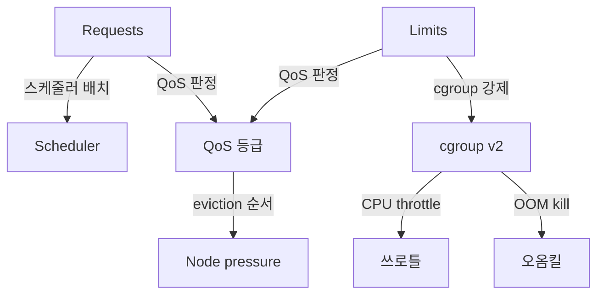
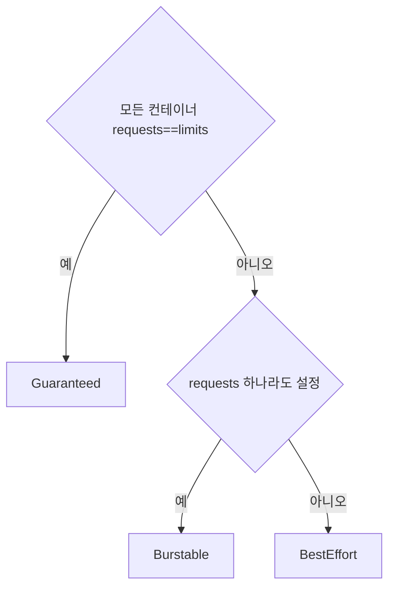

# Requests·Limits

Kubernetes에서 **Requests·Limits**는 단순한 "숫자 두 개"가 아니다.
이 값이 **스케줄러의 배치 결정**, **cgroup의 런타임 강제**, **QoS 등급
판정**, **eviction 순서**, **OOM kill 대상**, **In-Place Resize 가능 여부**
까지 전부를 지배한다. 잘못 설정하면 한 워커노드가 말라 죽고, 잘 설정하면
같은 하드웨어로 2~3배 많은 워크로드를 돌린다.

이 글은 requests/limits의 의미와 **cgroup v2 매핑**, QoS 3등급과 eviction
순서, **CPU limit을 걸 것인가 말 것인가** 논쟁, OOM과 workingSet,
**1.35 GA된 In-Place Pod Resize**와 VPA 통합, 그리고 Goldilocks·VPA를 활용한
실무 플레이북까지 다룬다.

> 관련: [LimitRange·ResourceQuota](./limitrange-resourcequota.md)
> · [Pod 라이프사이클](../workloads/pod-lifecycle.md)
> · HPA/VPA → `autoscaling/` · 스케줄링 상세 → `scheduling/`

---

## 1. 위치 — 두 값의 서로 다른 역할



| 값 | 누가 쓰나 | 무엇을 결정 |
|---|---|---|
| **requests.cpu** | kube-scheduler | 노드 선택(Allocatable - sum(requests)) |
| **requests.memory** | kube-scheduler + eviction 정책 | 위와 동일 + "보장된 양" |
| **limits.cpu** | kubelet → runtime → **cgroup `cpu.max`** | **CFS 쓰로틀** 상한 |
| **limits.memory** | kubelet → **cgroup `memory.max`** | 초과 시 **OOMKilled** |

**핵심 선언**: requests는 **스케줄러의 세계**, limits는 **cgroup의 세계**.
둘은 같은 단위를 쓰지만 **전혀 다른 레이어에서 강제**된다.

---

## 2. cgroup v2 매핑 — "왜 1 core인데 쓰로틀되는가"

현대 리눅스는 cgroup v2 통일 계층이 표준. kubelet이 container runtime을
거쳐 파일 하나에 값을 쓰는 방식.

| K8s 스펙 | cgroup v2 파일 | 의미 |
|---|---|---|
| `requests.cpu: 500m` | `cpu.weight` (cgroup v1의 `cpu.shares` 대응) | **상대 가중치**(경합 시 비율 분배) |
| `limits.cpu: 1000m` | `cpu.max = "100000 100000"` | **100ms 윈도우당 100ms 쿼터** (CFS) |
| `limits.memory: 512Mi` | `memory.max` | **하드 상한**, 초과 시 OOMKilled |
| `requests.memory` → `memory.low`/`memory.min` | **MemoryQoS feature gate** 활성 시에만 | 기본 배포에선 설정 **안 됨** |

### `cpu.weight` 변환 공식 변경 — 2026년 1월

오래된 공식은 1 CPU 요청을 `cpu.weight=39`로 맵핑해 **노드 시스템 프로세스
(기본 weight 100)보다 낮게** 배치되는 문제가 있었다. 2026-01 배포된 새 공식은
1 CPU를 `cpu.weight≈102`로 맵핑해 시스템 프로세스와 동등해진다. 컨테이너
런타임 및 kubelet 버전에 따라 반영 여부가 다르므로 **노드별로 확인 필요**.
근거: [K8s 블로그 2026-01-30](https://kubernetes.io/blog/2026/01/30/new-cgroup-v1-to-v2-cpu-conversion-formula/).

### MemoryQoS — 여전히 alpha

KEP-2570의 MemoryQoS는 `requests.memory`를 `memory.low`/`memory.min`에
매핑해 메모리 회수 보호를 강화하려는 기능이다. **1.27 Alpha로 도입된 후
livelock 이슈로 승격이 보류**되었고 1.35 기준 여전히 alpha, 기본 off.
프로덕션에서 **`memory.low`/`memory.min`이 기본적으로 설정되리라 가정하지
말 것**. 기본 kubelet은 `memory.max`만 설정한다.

### CFS quota 구조

```
cpu.max = <quota> <period>       # 예: "100000 100000" = 100ms 내 100ms
```

- 기본 period **100ms**
- quota는 **limit.cpu * period**
- 쿼터 소진 시 **다음 period까지 쓰로틀**

### cgroup v1 → v2 전환 체크

```bash
# 노드에서
stat -fc %T /sys/fs/cgroup   # cgroup2fs = v2, tmpfs = v1 (혼합)

# 컨테이너 내부
cat /sys/fs/cgroup/cpu.max
cat /sys/fs/cgroup/memory.max
```

K8s 1.25+는 v2 전제. 기존 배포된 RHEL 8/Ubuntu 20 LTS는 v1인 경우가 있어
**노드 이미지 세대 확인 필수**.

---

## 3. QoS 3등급 — 등급 결정 규칙

등급은 **사용자가 직접 지정하지 않는다.** kubelet이 requests·limits를 보고
**자동 판정**한다.



### 판정 표

| 조건 | QoS | 특징 |
|---|:-:|---|
| **모든 컨테이너**의 CPU·memory에 requests==limits 설정 | **Guaranteed** | eviction 최후, OOM 보호 최대 |
| requests 하나라도 있고 G 조건 미충족 | **Burstable** | 가장 일반적 |
| requests·limits **둘 다 전혀 없음** | **BestEffort** | 운영 워크로드 **금지** |

### eviction 순서 — 노드 압박 시 누가 먼저 죽는가

kubelet은 6종 eviction signal을 본다:

| signal | 자원 |
|---|---|
| `memory.available` | 노드 가용 메모리 |
| `nodefs.available`·`nodefs.inodesFree` | kubelet 파일시스템 |
| `imagefs.available`·`imagefs.inodesFree` | 이미지·컨테이너 rwlayer |
| `pid.available` | PID 번호 풀 |

각 signal에 hard/soft threshold가 있고, threshold 위반 시 eviction 시작:

| 우선 순서 | 기준 |
|:-:|---|
| 1 | **requests 초과 사용 중인 Pod이 먼저** (QoS 무관) |
| 2 | 그중 **Priority 낮은** 순 |
| 3 | tie-break: `(usage - requests)` **큰 순** |

**QoS의 역할**:
- BestEffort는 requests=0이므로 **항상 "초과 사용 중"** → 1순위 후보
- Guaranteed와 "Burstable + 사용량 ≤ requests"는 마지막 그룹

**결론**: 운영 워크로드는 최소 **Burstable**, 중요 워크로드는 **Guaranteed**.
근거: [Node-pressure Eviction — Eviction signals](https://kubernetes.io/docs/concepts/scheduling-eviction/node-pressure-eviction/#eviction-signals).

### `oom_score_adj` — OOM kill 우선순위

리눅스 OOM killer는 **각 프로세스의 `oom_score`**를 비교한다.
kubelet이 QoS별로 다른 `oom_score_adj`를 부여:

| QoS | `oom_score_adj` | 의미 |
|---|:-:|---|
| Guaranteed | **-997** | 거의 마지막에 죽음 |
| BestEffort | **1000** | 먼저 죽음 |
| Burstable | `min(max(2, 1000 - (1000*memoryRequestBytes)/memoryCapacityBytes), 999)` | requests 비율에 따라 |

**요점**: requests를 **정직하게 설정**할수록 같은 노드의 다른 Burstable
Pod 대비 **죽을 확률이 낮아진다**. 이는 운영 설계의 중요 레버.

---

## 4. CPU limit 논쟁 — 걸 것인가, 말 것인가

**이 글의 핵심 논쟁.**

### 사실: CPU limit은 쓰로틀을 유발한다

- CFS quota는 **100ms 윈도우**
- 앱이 **짧은 버스트**(GC·요청 스파이크)로 quota 소진 → **~40ms 쓰로틀**
  대기
- **유휴 CPU가 넘쳐도** 쓰로틀 발생(시간 기반이지 용량 기반이 아니다)
- P99 지연의 주요 범인

### 공식·업계 입장(2026)

| 관점 | 논거 |
|---|---|
| **Tim Hockin(SIG-Node), Henning Jacobs(Zalando) 등** | **CPU limit을 걸지 말라** — 지연에 치명적, requests로 충분 |
| 보수적 입장 | **batch/background**, **멀티테넌시 강제 격리**엔 limit 필요 |
| 중도 | requests만, 다만 **멀티테넌시에서 `LimitRange`로 상한** 강제 |

### 실전 기준

| 워크로드 유형 | CPU limit |
|---|---|
| **지연 민감 API/웹** | **금지** — requests만 |
| 배치 Job | 선택. 주변 워크로드 보호용이면 설정 |
| 노이지 네이버 우려되는 테넌트 | `LimitRange` 통해 강제 |
| ML 학습·빌드 | 금지 — 버스트 활용 |
| 사이드카(envoy·fluent-bit) | 작은 requests, limit 약간 상향 또는 미설정 |

### 모니터링

```promql
# 컨테이너 쓰로틀 비율
rate(container_cpu_cfs_throttled_periods_total[5m])
  / rate(container_cpu_cfs_periods_total[5m])

# Pod 단위 쓰로틀 시간(초/초)
rate(container_cpu_cfs_throttled_seconds_total{container!=""}[5m])
```

쓰로틀 비율이 **1%를 넘으면** 검토 필요. `groundcover`·`Datadog`이 공통
제시하는 기준.

---

## 5. Memory OOM의 실제

`limits.memory` 초과 시 **즉시 OOMKilled**. 메모리는 CPU와 달리
"쓰로틀"이 없다. **Hard cap**.

### workingSet vs RSS

kubelet·cAdvisor가 eviction 판정에 쓰는 지표는 **`working_set_bytes`**:

```
working_set = memory.usage_in_bytes - inactive_file
```

- **active anonymous + active file cache**
- 일반적인 "앱이 실제로 쓰는 메모리" — 이게 limit에 가까워지면 OOM
- 모니터링은 `container_memory_working_set_bytes` 우선

**함정**: 일부 APM이 **`container_memory_usage_bytes`**(= inactive cache 포함)
를 그래프로 띄워서 **늘 100% 쓰는 것처럼** 보이게 한다. working_set을
봐야 한다.

### OOMKilled 진단

```bash
kubectl describe pod <name> | grep -A3 "Last State"
# Last State:     Terminated
#   Reason:       OOMKilled
#   Exit Code:    137

# 노드 dmesg
journalctl -k | grep -i "killed process"
```

### 스왑(1.30 GA)

`LimitedSwap` 활성 선행 조건:
- Linux 커널 + **cgroup v2**
- 노드에 **swap 파일·파티션 구성** (`swapon -s`로 확인)
- kubelet 설정에 `memorySwap.swapBehavior: LimitedSwap`
- `failSwapOn: false`

이때 **Burstable Pod**만 제한적으로 스왑을 쓸 수 있다(Guaranteed·BestEffort
제외). 프로덕션에서는 **여전히 보수적 접근** 권장 — 지연 예측이 나빠지고,
시크릿을 담는 tmpfs는 `noswap`으로 보호된다.

---

## 6. In-Place Pod Resize — 1.35 GA

**1.33 Beta → 1.35 Stable(GA)**. `InPlacePodVerticalScaling` feature gate
기본 활성.

### 동작

```yaml
apiVersion: v1
kind: Pod
spec:
  containers:
  - name: app
    image: app:1.0
    resources:
      requests: { cpu: 500m, memory: 512Mi }
      limits:   { cpu: 1, memory: 1Gi }
    resizePolicy:
    - resourceName: cpu
      restartPolicy: NotRequired       # 재시작 없이 변경
    - resourceName: memory
      restartPolicy: RestartContainer  # 메모리는 재시작해서 적용
```

### 기본값·허용 조합

| resource | 기본 `restartPolicy` | 가능한 값 |
|---|---|---|
| cpu | `NotRequired` | `NotRequired`, `RestartContainer` |
| memory | `NotRequired` | `NotRequired`, `RestartContainer` |

**중요 변경(1.35)**: CPU/memory 모두 기본이 `NotRequired`가 됨 — 재시작
없는 리사이즈가 **기본**.

### resize 트리거

```bash
# kubectl 클라이언트 버전 v1.32 이상 필요
kubectl patch pod <name> --subresource=resize --patch \
  '{"spec":{"containers":[{"name":"app","resources":{"requests":{"memory":"1Gi"},"limits":{"memory":"2Gi"}}}]}}'
```

- `--subresource=resize`는 **새 엔드포인트** `/pods/{name}/resize`
- **클라이언트 kubectl ≥ v1.32** 없으면 플래그 미인식. 서버 1.35 + 구버전
  kubectl은 자주 나오는 혼동

### 축소 시 PodResizeInProgress 에러

**현재 usage가 새 memory limit보다 크면** resize가 `PodResizeInProgress`
/`Error` 상태로 **cgroup 반영 실패**. kubelet은 best-effort로 OOM을 피하려
하지만 **성공은 보장 안 함**. 안전 패턴:

1. memory 축소는 **`RestartContainer`** 로 수행
2. 또는 usage가 새 limit 이하로 떨어진 뒤 재시도
3. resize 상태 확인: `kubectl get pod <name> -o jsonpath='{.status.resize}'`

### VPA 통합 — `InPlaceOrRecreate` (1.35 Beta)

Vertical Pod Autoscaler의 **`InPlaceOrRecreate` 업데이트 모드**:

1. VPA 권고가 바뀌면 **In-Place resize 시도**
2. 노드 capacity 부족이면 **기존 방식의 evict-and-recreate**로 fallback
3. 단계적 이행 경로 — 권장 모드로 이동 중

### 한계

- **DaemonSet/StatefulSet의 일부 리사이즈 시나리오** 제약 있음
- **QoS 클래스 자체를 바꾸는 방향의 resize는 거부** — 예: Guaranteed를
  requests≠limits로 바꿔 Burstable로 전이시키는 변경은 API reject (클래스
  불변 원칙)
- memory **축소**는 현재 usage와 충돌 시 PodResizeInProgress 에러

→ 상세 이슈·진행은 [Kubernetes 1.35 In-Place GA 블로그](https://kubernetes.io/blog/2025/12/19/kubernetes-v1-35-in-place-pod-resize-ga/).

---

## 7. Overcommit 전략

노드 단위로 `sum(requests) <= Allocatable`은 강제. 그러나 **`sum(limits)` >
Allocatable**은 허용된다 = **overcommit**.

### 두 전략

| 전략 | requests | limits | 노드 사용률 |
|---|---|---|---|
| **Conservative**(보수) | 피크의 90% | requests와 동일(Guaranteed) | 낮음 |
| **Balanced**(균형) | 정상 상태의 80% | requests의 150% | 중간 |
| **Aggressive**(공격적) | P50 수준 | requests의 300% 또는 미설정 | 높음 — 경합 시 위험 |

### "request=50%·limit=150%" 관례

블로그에서 자주 보는 공식. 근거는:
- **CPU**: 버스트 활용 → 쓰로틀 회피
- **Memory**: 아님 — memory는 **hard**이므로 공식 적용 금지

**메모리는 워크로드의 실제 working_set 95~99퍼센타일**에 **여유 20~30%** 더하는 식으로 개별 산출. 동일 공식을 CPU와 공유하면 OOM 남발.

---

## 8. Extended Resources

CPU/메모리 외의 "개수형" 자원.

### GPU — NVIDIA Device Plugin

```yaml
resources:
  limits:
    nvidia.com/gpu: 1           # 정수만, requests 자동 동일
```

- **requests와 limits가 같아야 함**(K8s가 강제)
- 스케줄러가 `Allocatable[nvidia.com/gpu]` 기반 배치
- MIG(A100/H100)·time-slicing은 **Device Plugin 설정**으로 세분화

→ 상세는 [GPU 스케줄링](../special-workloads/) 섹션.

### hugepages

```yaml
resources:
  limits:
    hugepages-2Mi: 64Mi
    hugepages-1Gi: 2Gi
```

- Guaranteed QoS에서만 권장
- 노드에 **`/proc/sys/vm/nr_hugepages`** 사전 설정 필요

### ephemeral-storage

```yaml
resources:
  requests: { ephemeral-storage: 1Gi }
  limits:   { ephemeral-storage: 2Gi }
```

- `/var/log`, emptyDir, 컨테이너 rwlayer 등을 포함
- 초과 시 **eviction**(OOM 아님)

---

## 9. 운영 플레이북 — 시작 값 산출

### 1단계: 기초 측정

프로덕션 유사 부하 며칠간 관측.

```promql
# CPU: 95퍼센타일(스파이크 포함)
quantile_over_time(0.95, sum by (pod) (rate(container_cpu_usage_seconds_total{container!=""}[5m]))[7d:])

# Memory: 최대 working_set
max_over_time(container_memory_working_set_bytes{container!=""}[7d])
```

### 2단계: Goldilocks·VPA Recommender

- **Goldilocks**(Fairwinds): 네임스페이스 단위로 **권고 대시보드** 생성
- **VPA Recommender**(off 모드): 실제 트래픽 기반 권고 산출 — `kubectl get vpa`
  로 조회

### 3단계: 공식 적용

| 자원 | 시작 값 |
|---|---|
| `requests.cpu` | P50 \* 1.1 |
| `limits.cpu` | **설정 안 함**(지연 민감) 또는 requests \* 1.5 (배치) |
| `requests.memory` | P95 working_set + 10% |
| `limits.memory` | requests.memory \* 1.25 ~ 1.5 |

### 4단계: 반복 튜닝

1.35 GA된 **VPA `InPlaceOrRecreate`** 모드로 자동 조정.

---

## 10. 안티패턴

| 안티패턴 | 결과 | 대안 |
|---|---|---|
| **BestEffort로 운영 서비스** | 첫 eviction 대상 | 최소 Burstable |
| **모든 컨테이너에 CPU limit** | 지연 민감 워크로드가 쓰로틀 | 지연 민감 금지, 배치만 |
| request=limit(Guaranteed)을 일괄 강제 | 하드웨어 낭비, 쓰로틀 가능 | 워크로드별 개별 판단 |
| **limits.memory 없이 운영** | 한 앱이 노드 잡아먹음 | 반드시 설정 |
| memory limit을 requests의 300%로 | hard cap이라 overcommit 무의미·위험 | working_set 기반 25~50% 여유 |
| `container_memory_usage_bytes` 기반 모니터링 | inactive cache가 과대 표시 | `working_set_bytes` |
| CPU limit을 **무조건 걸고** 쓰로틀 비율 무시 | 장애 후에야 인지 | CFS throttle 메트릭 상시 모니터 |
| GPU 워크로드에 `requests ≠ limits` 시도 | apiserver가 reject | 둘 동일 |
| JVM `-Xmx`를 **limits 기반 80%**로 설정 후 **limits 미설정** | Node Allocatable 전체 가정 → OOM | limits 설정 또는 `-XX:MaxRAMPercentage` |
| HPA를 CPU 기반으로 돌리며 **CPU limit 낮게 고정** | HPA는 requests 대비 사용률을 보지만, limit이 사용량을 막아 **HPA가 스케일업을 트리거 못함** | limit 제거 또는 충분히 높게 |
| Go 앱에 **`automaxprocs` 미사용** | `GOMAXPROCS`가 노드 전체 CPU 수로 잡혀 CPU limit 의미 없어짐 | `uber-go/automaxprocs` 라이브러리 |

---

## 11. 프로덕션 체크리스트

- [ ] 모든 운영 Pod이 **최소 Burstable**(requests 설정)
- [ ] 중요 워크로드는 **Guaranteed** 또는 명시적 근거
- [ ] **지연 민감 워크로드는 CPU limit 미설정** — 기본 규칙으로 문서화
- [ ] memory는 **반드시 limits 설정**
- [ ] `container_cpu_cfs_throttled_periods_total` 알람 (>1% 비율)
- [ ] `container_memory_working_set_bytes` 기반 모니터링(usage 아님)
- [ ] cgroup **v2 노드** 표준화
- [ ] Goldilocks·VPA Recommender로 정기 권고 리뷰
- [ ] 1.35+ **In-Place Resize·VPA InPlaceOrRecreate** 단계 도입 계획
- [ ] `LimitRange`로 네임스페이스 기본값·상한 강제
- [ ] `ResourceQuota`와 함께 테넌시 경계 설정
- [ ] GPU·hugepages는 Guaranteed + Device Plugin 구성 확인
- [ ] 스왑 정책 — 기본 비활성, 필요 시에만 `LimitedSwap`
- [ ] OOMKilled 이벤트 알람 — 근본 원인 조사 트리거

---

## 12. 트러블슈팅

| 증상 | 근본 원인 | 진단·조치 |
|---|---|---|
| Pod **Pending**, `FailedScheduling` | requests가 Allocatable보다 큼·어피니티 | `describe pod` events, `kubectl get nodes -o=custom-columns...` |
| **OOMKilled** 반복 | limits.memory 부족, 메모리 리크 | `kubectl logs --previous`, working_set 그래프, heap 덤프 |
| **CPU 쓰로틀** 지연 스파이크 | CPU limit + 버스트 부하 | limit 제거(지연 민감) 또는 상향 |
| `memory.max` 위반이 아닌데 죽음 | 시스템 메모리 부족 → eviction | `kubectl get events`·노드 dmesg·`kube_pod_container_status_last_terminated_reason` |
| In-Place Resize 안 먹힘 | 1.33/1.34 Beta + feature gate off | 1.35로 업그레이드 또는 feature gate 활성 |
| `kubectl patch` 리소스 변경이 그냥 pod 재시작만 | `--subresource=resize` 누락 | 올바른 엔드포인트 사용 |
| Pod은 살아 있는데 **앱 사용률 100%** 쓰로틀 | CPU limit 낮음 | 쓰로틀 메트릭 확인 후 limit 조정·제거 |
| HPA가 사용률 100%에서도 스케일 안 됨 | HPA가 requests 기준이므로 limit과 무관 | requests 올리거나 타겟 조정 |
| Guaranteed가 eviction 1순위 | 실제는 BestEffort/Burstable로 잘못 판정 | requests==limits **전 컨테이너** 충족 확인 |
| `nvidia.com/gpu: 0.5` 거부 | 정수만 허용 | time-slicing 플러그인 설정 |
| ephemeral-storage eviction | `/var/log` 폭주·emptyDir 누적 | 로그 로테이션·volume 마운트 |
| node pressure에도 Guaranteed 안 죽음 | 의도된 동작 | Priority로 승급 또는 `PriorityClass` 재검토 |

### 자주 쓰는 명령

```bash
# 노드 Allocatable vs 합산 requests
kubectl describe node <name> | grep -A5 "Allocated resources"

# QoS 등급 확인
kubectl get pod <name> -o jsonpath='{.status.qosClass}'

# 쓰로틀 상위 컨테이너
kubectl top pod -A --containers | sort -k4 -h | tail

# OOMKilled Pod 이력
kubectl get events -A --field-selector reason=OOMKilling
kubectl get pods -A -o json \
  | jq -r '.items[] | select(.status.containerStatuses[]?.lastState.terminated.reason=="OOMKilled") | .metadata.namespace+"/"+.metadata.name'

# In-Place resize (1.35+)
kubectl patch pod <name> --subresource=resize --patch \
  '{"spec":{"containers":[{"name":"app","resources":{"limits":{"memory":"2Gi"}}}]}}'

# cgroup 값 직접 확인 (디버깅)
kubectl exec <pod> -- cat /sys/fs/cgroup/cpu.max
kubectl exec <pod> -- cat /sys/fs/cgroup/memory.max
```

---

## 13. 이 카테고리의 경계

- **Requests·Limits 자체** → 이 글
- **네임스페이스 단위 제한**(LimitRange·ResourceQuota) → [LimitRange·ResourceQuota](./limitrange-resourcequota.md)
- **네임스페이스 설계·테넌시** → [네임스페이스 설계](./namespace-design.md)
- **스케줄러·Affinity·Taint** → `scheduling/` 섹션
- **HPA·VPA·KEDA·Karpenter** → `autoscaling/` 섹션
- **Pod QoS와 PriorityClass의 상호작용**(preemption) → `scheduling/priority-preemption`
- **GPU 스케줄링·time-slicing·MIG** → `special-workloads/`
- **OpenTelemetry·메트릭 수집** → `observability/`
- **Karpenter·Cluster Autoscaler의 request-aware 동작** → `autoscaling/`

---

## 참고 자료

- [Kubernetes — Resource Management for Pods and Containers](https://kubernetes.io/docs/concepts/configuration/manage-resources-containers/)
- [Kubernetes — Pod Quality of Service Classes](https://kubernetes.io/docs/concepts/workloads/pods/pod-qos/)
- [Kubernetes — Node-pressure Eviction](https://kubernetes.io/docs/concepts/scheduling-eviction/node-pressure-eviction/)
- [Kubernetes Blog — 1.35 In-Place Pod Resize GA](https://kubernetes.io/blog/2025/12/19/kubernetes-v1-35-in-place-pod-resize-ga/)
- [Kubernetes Blog — 1.33 In-Place Pod Resize Beta](https://kubernetes.io/blog/2025/05/16/kubernetes-v1-33-in-place-pod-resize-beta/)
- [Kubernetes — Resize CPU and Memory Resources assigned to Pods](https://kubernetes.io/docs/tasks/configure-pod-container/resize-pod-resources/)
- [KEP-1287 — In-place Pod Resize](https://github.com/kubernetes/enhancements/tree/master/keps/sig-node/1287-in-place-update-pod-resources)
- [AEP-4016 — VPA In-place Updates Support](https://github.com/kubernetes/autoscaler/blob/master/vertical-pod-autoscaler/enhancements/4016-in-place-updates-support/README.md)
- [KEP-2570 — MemoryQoS (alpha)](https://github.com/kubernetes/enhancements/blob/master/keps/sig-node/2570-memory-qos/README.md)
- [K8s 블로그 — cpu.weight 변환 공식 변경 (2026-01)](https://kubernetes.io/blog/2026/01/30/new-cgroup-v1-to-v2-cpu-conversion-formula/)
- [Kubernetes — Node Swap (1.30 GA)](https://kubernetes.io/docs/concepts/cluster-administration/swap-memory-management/)
- [Tim Hockin — Why CPU Limits Are Harmful](https://x.com/thockin/status/1134193838841225216)
- [Henning Jacobs — Kubernetes CPU Throttling Myth](https://medium.com/@betz.mark/understanding-resource-limits-in-kubernetes-cpu-time-a00284884c51)
- [Datadog — Kubernetes CPU limits deep dive](https://www.datadoghq.com/blog/kubernetes-cpu-requests-limits/)
- [Fairwinds — Goldilocks](https://github.com/FairwindsOps/goldilocks)
- [Kubernetes VPA](https://github.com/kubernetes/autoscaler/tree/master/vertical-pod-autoscaler)

(최종 확인: 2026-04-22)
