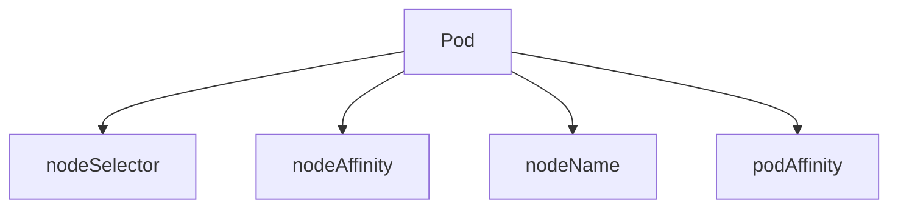

# NodeSelector·Affinity

Kubernetes 스케줄러에게 "어디에 배치할지" 힌트를 주는 방법은 여럿이다.
가장 단순한 `nodeSelector`부터, `nodeAffinity`, `podAffinity`/
`podAntiAffinity`, 그리고 최근 안정화된 `matchLabelKeys`·
`mismatchLabelKeys`까지 **표현력과 성능 비용이 모두 다르다**.

이 글은 4가지 배치 규칙의 의미와 차이, **Affinity 연산자**, **`required`
vs `preferred`의 trade-off**, 대규모 클러스터에서 podAntiAffinity가
스케줄 지연의 주범이 되는 이유, Beta 단계로 실무 도입이 늘고 있는
`matchLabelKeys`/`mismatchLabelKeys`, 그리고 온프레미스 클러스터의 전형적
레이블·패턴까지 다룬다.

**스케줄 파이프라인에서의 위치**: 스케줄러는 먼저 **NodeResourcesFit**
플러그인으로 requests 기반 배치 가능 노드를 필터링한 뒤, 이 글의 affinity·
taint·topology spread 등으로 추가 필터와 스코어링을 수행한다. 즉
Requests·Limits가 1차, Affinity가 2차.

> 관련: [Taint·Toleration](./taint-toleration.md) · [Topology Spread](./topology-spread.md)
> · [Scheduler 내부](./scheduler-internals.md) · [Priority·Preemption](./priority-preemption.md)

---

## 1. 4가지 배치 규칙 — 한눈에



| 방식 | 강제성 | 표현력 | 언제 |
|---|:-:|:-:|---|
| `nodeSelector` | 하드 | 낮음 | 간단한 라벨 매칭 |
| `nodeAffinity` | 하드·소프트 | 중간 | 존·리전·하드웨어 조건 |
| `nodeName` | 하드 | 최저 | **스케줄러 우회** 디버깅·시스템 |
| `podAffinity`·`podAntiAffinity` | 하드·소프트 | 높음 | 공배치·분산 |

여러 규칙을 동시에 지정하면 **AND**(전부 만족). nodeSelector + nodeAffinity
+ podAntiAffinity가 함께 걸리면 셋 모두 통과해야 스케줄.

---

## 2. nodeSelector — 가장 단순

```yaml
spec:
  nodeSelector:
    disktype: ssd
    kubernetes.io/os: linux
```

- 지정된 **모든** 라벨을 가진 노드에만 배치
- 라벨 하나라도 누락 → 매칭 안 됨
- 소프트 옵션 없음, 연산자 없음 → 한계가 금방 옴

**실질적 용도**: "Linux만", "SSD 노드만" 같은 단순 조건.

---

## 3. nodeAffinity — 실무 표준

```yaml
spec:
  affinity:
    nodeAffinity:
      requiredDuringSchedulingIgnoredDuringExecution:
        nodeSelectorTerms:
        - matchExpressions:
          - key: topology.kubernetes.io/zone
            operator: In
            values: [zone-a, zone-b]
          - key: node.kubernetes.io/instance-type
            operator: In
            values: [m5.large]
      preferredDuringSchedulingIgnoredDuringExecution:
      - weight: 50
        preference:
          matchExpressions:
          - key: disktype
            operator: In
            values: [nvme]
```

### `required` vs `preferred`

| 종류 | 의미 | 효과 |
|---|---|---|
| `requiredDuringSchedulingIgnoredDuringExecution` | **하드** — 매칭 안 되면 스케줄 실패 | nodeSelector 강화판 |
| `preferredDuringSchedulingIgnoredDuringExecution` | **소프트** — weight(1-100) 가중치 스코어 | 가능하면 선호, 아니면 다른 노드 |

**이름의 뜻**:
- `DuringScheduling` — 스케줄 시점에 평가
- `IgnoredDuringExecution` — **실행 중 노드 레이블이 바뀌어도 evict 안 함**
  (`RequiredDuringExecution`은 아직 존재 안 함)

### 논리 구조

| 레벨 | 관계 |
|---|---|
| `nodeSelectorTerms` 여러 개 | **OR** — 하나라도 매칭하면 통과 |
| 한 term 안의 `matchExpressions` 여러 개 | **AND** — 모두 매칭해야 통과 |
| 한 `matchExpressions` 안의 `values` 여러 개 | 연산자 의미에 따름 (`In`이면 OR, `NotIn`이면 AND) |

### 연산자

| 연산자 | 의미 | 사용 가능 영역 |
|---|---|---|
| `In` | 값이 리스트 안에 | nodeAffinity, podAffinity |
| `NotIn` | 값이 리스트 밖에(= 안티 아피니티) | nodeAffinity, podAffinity |
| `Exists` | 키만 있으면 됨 | nodeAffinity, podAffinity |
| `DoesNotExist` | 키가 없어야 함 | nodeAffinity, podAffinity |
| `Gt` | 숫자 비교 (값 하나) | **nodeAffinity 전용** |
| `Lt` | 숫자 비교 (값 하나) | **nodeAffinity 전용** |

`Gt`/`Lt`는 **정수 라벨 비교**에만. `node-pool-version: "3"` 같은 버전
비교에 유용. podAffinity/podAntiAffinity의 `labelSelector`는 표준
`LabelSelector` 스키마이므로 `Gt`/`Lt`를 쓸 수 없다.

---

## 4. podAffinity·podAntiAffinity

**노드가 아니라 같은 노드(또는 zone)에 있는 다른 Pod**을 기준으로 배치.

```yaml
affinity:
  podAntiAffinity:
    requiredDuringSchedulingIgnoredDuringExecution:
    - labelSelector:
        matchLabels: { app: api }
      topologyKey: kubernetes.io/hostname     # 같은 노드 금지 = HA
  podAffinity:
    preferredDuringSchedulingIgnoredDuringExecution:
    - weight: 80
      podAffinityTerm:
        labelSelector:
          matchLabels: { app: redis }
        topologyKey: topology.kubernetes.io/zone  # redis와 같은 zone 선호
```

### topologyKey — 가장 중요한 필드

| topologyKey | 의미 |
|---|---|
| `kubernetes.io/hostname` | **노드 단위** — 같은 노드에 배치/회피 |
| `topology.kubernetes.io/zone` | **존 단위** — 같은 존에 배치/회피 |
| `topology.kubernetes.io/region` | 리전 단위 |
| 커스텀 라벨 | 랙·AZ·전원 도메인 등 |

빈 값은 허용 안 됨. 정확한 도메인 선택이 HA·성능의 핵심.

### 대규모 클러스터의 함정 — 스케줄러 비용

podAntiAffinity는 **새 Pod 배치 시 label selector에 매치되는 모든 기존 Pod
과 모든 후보 노드를 조합 비교**한다. (N = 후보 노드 수, M = 매칭 Pod 수)
수천 Pod이 같은 label selector로 anti-affinity를 걸면:

- 스케줄 지연 수 초 → 수십 초
- HPA scale-out 시 **새 replica가 스케줄 못 받음**
- **성능 기준 권장**: 수백 Pod 이상이면 **Topology Spread Constraints**로
  대체

### 스케줄러 경고 — 공식 문서

> *"Inter-pod affinity and anti-affinity require substantial amount of
> processing which can slow down scheduling in large clusters
> significantly. We do not recommend using them in clusters larger than
> several hundred nodes."* ([공식 문서](https://kubernetes.io/docs/concepts/scheduling-eviction/assign-pod-node/))

**결론**: 수백 노드 이상 클러스터에서 podAntiAffinity는 **피하고** Topology
Spread로 대체.

---

## 5. matchLabelKeys · mismatchLabelKeys — Beta(기본 활성)

Pod affinity의 골칫거리: "**배포마다 달라지는 hash 라벨**"(예: `pod-template-hash`)을
selector에 넣고 싶어도 매니페스트 작성 시점에 알 수 없다.

### `matchLabelKeys` — 내 라벨과 같은 라벨 가진 Pod

```yaml
podAffinity:
  requiredDuringSchedulingIgnoredDuringExecution:
  - labelSelector:
      matchExpressions:
      - { key: app, operator: In, values: [cache] }
    matchLabelKeys:           # "내 Pod의 이 키 값을 selector에 덧붙임"
    - pod-template-hash
    topologyKey: kubernetes.io/hostname
```

- 스케줄러가 **자기 Pod의 `pod-template-hash`를 읽어** selector에 추가
- 결과: "같은 버전의 cache와 같은 노드" 배치
- **1.29 Alpha → 1.31 Beta(기본 활성)**. 1.35 시점에도 **여전히 Beta**.
  feature gate `MatchLabelKeysInPodAffinity` 기본 on

### `mismatchLabelKeys`

```yaml
podAntiAffinity:
  requiredDuringSchedulingIgnoredDuringExecution:
  - labelSelector:
      matchExpressions:
      - { key: app, operator: In, values: [web] }
    mismatchLabelKeys:
    - version
    topologyKey: kubernetes.io/hostname
```

- 자기 `version`과 **다른** version의 web Pod을 같은 노드에서 회피
- 버전별 Pod 혼재 시 테넌시 격리에 유용

---

## 6. 내장·권장 노드 라벨

### 표준 라벨

| 라벨 | 의미 |
|---|---|
| `kubernetes.io/hostname` | 노드 호스트명 |
| `kubernetes.io/os` | `linux`·`windows` |
| `kubernetes.io/arch` | `amd64`·`arm64` |
| `topology.kubernetes.io/region` | 리전 |
| `topology.kubernetes.io/zone` | 존 — **온프레미스에서는 랙·행·전원 도메인에 매핑** |
| `node.kubernetes.io/instance-type` | 인스턴스 타입(클라우드 + Kubespray 등) |

### `node-restriction.kubernetes.io/` prefix

이 prefix가 붙은 라벨은 **kubelet이 수정할 수 없다** — 침해된 노드가
자기에게 유리한 라벨을 붙여 워크로드를 유치하는 공격 방어.

- `NodeRestriction` admission plugin 필수
- 예: `node-restriction.kubernetes.io/fips=true`
- **주의**: `example.com.node-restriction.kubernetes.io/...` 같은 방식은
  prefix 매칭이 깨져 **admission 보호가 적용되지 않는다**. 공식 prefix를
  그대로 사용

### 온프레미스 관례

| 라벨 | 쓰임 |
|---|---|
| `topology.kubernetes.io/zone=rack-A` | 랙·AZ 매핑 |
| `node.kubernetes.io/role=worker` | 역할 분리 |
| `storage-class=nvme` | 로컬 SSD/NVMe 노드 |
| `gpu=h100` | GPU 타입 구분 |
| `workload=batch`·`workload=online` | 전용 풀 |

→ rook-ceph 같은 분산 스토리지 노드에는 `storage=ceph-osd` 라벨 + 
taint 조합(다음 글) 패턴이 표준.

---

## 7. 실전 패턴

### 존 분산 (고전 패턴, 소규모)

```yaml
podAntiAffinity:
  requiredDuringSchedulingIgnoredDuringExecution:
  - labelSelector:
      matchLabels: { app: api }
    topologyKey: topology.kubernetes.io/zone
```

- "같은 존에 `app=api` 중복 금지"
- 3 존·3 replica → 각 존 1개
- **수백 노드 이하**에서만. 그 이상이면 Topology Spread

### GPU 노드 고정

```yaml
nodeAffinity:
  requiredDuringSchedulingIgnoredDuringExecution:
    nodeSelectorTerms:
    - matchExpressions:
      - { key: gpu, operator: In, values: [h100, a100] }
```

- nodeSelector로도 가능하지만 여러 GPU 타입 허용 시 In 연산자가 편리
- taint/toleration과 함께 써서 **"GPU 워크로드만 GPU 노드에"** 양방향 강제

### DB + 앱 공배치(부하 줄이기)

```yaml
podAffinity:
  preferredDuringSchedulingIgnoredDuringExecution:
  - weight: 100
    podAffinityTerm:
      labelSelector:
        matchLabels: { app: redis }
      topologyKey: topology.kubernetes.io/zone
```

- "redis와 **같은 존에**" — 크로스 존 트래픽 비용·지연 감소
- 소프트(preferred)로 두어 공간 없으면 다른 존 허용

### 하드웨어 특성 기반

```yaml
nodeAffinity:
  preferredDuringSchedulingIgnoredDuringExecution:
  - weight: 70
    preference:
      matchExpressions:
      - { key: cpu-generation, operator: Gt, values: ["3"] }
```

---

## 8. 스케줄러 스코어링 — weight의 실제

`preferred` 규칙은 스케줄러 프레임워크의 **`NodeAffinity` score 플러그인**
(pod 간의 경우 `InterPodAffinity`)이 처리:

1. 각 노드에서 **매칭되는 `preferred` 규칙의 weight를 모두 합산** → raw score
2. **전체 노드 범위에서 0~100으로 정규화**(normalizeScore 단계)
3. 다른 score 플러그인의 결과와 가중 평균

| 함의 | |
|---|---|
| weight=1과 weight=100의 차이 | **상대적** — 전체 노드에서 정규화 후에야 의미 결정 |
| 여러 `preferred` 규칙 | weight가 **합산**되므로 상위 규칙에 큰 가중치 |
| 모든 노드 raw score 동일 | 다른 플러그인(리소스 fit, topology spread)이 tie-break |

스케줄러 프로파일(`KubeSchedulerConfiguration`)에서 플러그인별 weight·
enable/disable 조정 가능 → [Scheduler 내부](./scheduler-internals.md).

---

## 9. 안티패턴

| 안티패턴 | 결과 | 대안 |
|---|---|---|
| 수천 Pod에 `podAntiAffinity required` | **스케줄 지연**·HPA scale-out 실패 | Topology Spread Constraints |
| `nodeName` 남용 | 스케줄러 우회 → 비정상 상태·리소스 낭비 | nodeSelector 또는 nodeAffinity |
| hostname topologyKey를 **zone 용**으로 착각 | 분산 실패 | `topology.kubernetes.io/zone` |
| 하드 규칙만 사용(`required`) | 매칭 안 되면 무한 Pending | soft(`preferred`) 병행 |
| nodeAffinity `values` 빈 리스트 | API reject | 최소 1개 |
| `node-restriction.kubernetes.io/` 없이 신뢰 가정 | 침해 노드가 라벨 위조 | prefix 사용 |
| `IgnoredDuringExecution`을 `RequiredDuringExecution`으로 착각 | 실행 중 노드 라벨 바뀌면 evict 기대 | 해당 기능은 **아직 없음** |
| 모든 워크로드에 같은 hash 라벨로 pod-affinity | 1.28 이하에선 hash 없어 작성 불가 | 1.31+ Beta `matchLabelKeys` |
| 크로스-존 podAntiAffinity를 `required`로 | 존 장애 시 스케줄 불가 | `preferred` 또는 Topology Spread |

---

## 10. 프로덕션 체크리스트

- [ ] **수백 노드 이상**에선 podAntiAffinity 대신 **Topology Spread**
- [ ] nodeAffinity 하드 규칙은 **`preferred`와 병행** — Pending 함정 회피
- [ ] GPU·SSD 같은 전용 노드는 **nodeAffinity + taint** 양방향
- [ ] 노드 라벨 표준화: `zone`·`instance-type`·`workload`·`gpu`
- [ ] `node-restriction.kubernetes.io/` 민감 라벨에 적용
- [ ] `matchLabelKeys`(Beta, 기본 활성) 검토 — 버전별 공배치·격리
- [ ] 스케줄 지연 알람: `scheduler_scheduling_attempt_duration_seconds_p99`
- [ ] `FailedScheduling` 이벤트 모니터 — 아피니티 위배가 자주 범인
- [ ] 온프레미스에서 **랙·전원 도메인**을 `topology.kubernetes.io/zone` 로 매핑 권장
- [ ] 크로스 존 트래픽 비용·지연이 문제면 preferred podAffinity(공배치)

---

## 11. 트러블슈팅

| 증상 | 근본 원인 | 진단·조치 |
|---|---|---|
| Pod **Pending, `FailedScheduling`** | `nodeAffinity` 하드 규칙 매칭 없음 | `kubectl describe pod` Events, 노드 라벨 재확인 |
| HPA scale-out 후 일부 Pod Pending | podAntiAffinity required + 노드 부족 | Topology Spread로 전환 또는 soft |
| 특정 노드에만 몰림 | preferred 가중치·soft가 약함 | 하드 nodeAffinity 또는 anti-affinity 혼합 |
| 노드 라벨 변경 후 기존 Pod 그대로 | `IgnoredDuringExecution` 정의상 동작 | 재배포 트리거 |
| `Gt`/`Lt` 매칭 실패 | 값이 숫자 문자열이 아님·라벨 비어 있음 | 라벨 포맷 확인 |
| `matchLabelKeys` 무시됨 | 1.30 이하에선 Alpha(기본 off) | 1.31+ Beta(기본 on) 클러스터 사용, 1.29에서 쓰려면 feature gate 명시 활성 |
| 스케줄 시간 수십 초 | 대규모 podAntiAffinity | Topology Spread, 노드 범위 축소 |
| 예상 존에 배치 안 됨 | zone 라벨 부재(온프레미스 기본값 없음) | `kubectl label node`로 수동 설정 |
| 크로스 존 트래픽 급증 | 분산 규칙만 있고 공배치 힌트 없음 | preferred podAffinity |

### 자주 쓰는 명령

```bash
# 노드 라벨 확인
kubectl get nodes --show-labels
kubectl get nodes -L topology.kubernetes.io/zone,kubernetes.io/arch

# Pod의 affinity 요약
kubectl get pod <name> -o jsonpath='{.spec.affinity}' | jq

# FailedScheduling 이벤트
kubectl get events -A --field-selector reason=FailedScheduling

# 특정 라벨 가진 노드
kubectl get nodes -l gpu=h100

# 노드 라벨 설정(온프레미스)
kubectl label node <name> topology.kubernetes.io/zone=rack-A
kubectl label node <name> workload=online

# node-restriction 라벨 예
kubectl label node <name> node-restriction.kubernetes.io/fips=true
```

---

## 12. 이 카테고리의 경계

- **nodeSelector/nodeAffinity/podAffinity** → 이 글
- **Taint·Toleration** → [Taint·Toleration](./taint-toleration.md)
- **Topology Spread Constraints**(대규모 분산 표준) → [Topology Spread](./topology-spread.md)
- **PriorityClass·Preemption** → [Priority·Preemption](./priority-preemption.md)
- **Scheduler 프레임워크·플러그인·extender** → [Scheduler 내부](./scheduler-internals.md)
- **Pod 라이프사이클·probes** → [Pod 라이프사이클](../workloads/pod-lifecycle.md)
- **리소스 할당·QoS** → [Requests·Limits](../resource-management/requests-limits.md)

---

## 참고 자료

- [Kubernetes — Assigning Pods to Nodes](https://kubernetes.io/docs/concepts/scheduling-eviction/assign-pod-node/)
- [Kubernetes — Well-Known Labels, Annotations and Taints](https://kubernetes.io/docs/reference/labels-annotations-taints/)
- [Kubernetes — Node Labels for Isolation](https://kubernetes.io/docs/concepts/scheduling-eviction/assign-pod-node/#built-in-node-labels)
- [KEP-3633 — matchLabelKeys for Pod (Anti)Affinity](https://github.com/kubernetes/enhancements/tree/master/keps/sig-scheduling/3633-matchlabelkeys-for-podaffinity)
- [Kubernetes Blog — Advanced Scheduling](https://kubernetes.io/blog/2017/03/advanced-scheduling-in-kubernetes/)
- [Cast AI — Inter-Pod Affinity 성능](https://cast.ai/blog/kubernetes-scheduler-how-to-make-it-work-with-inter-pod-affinity-and-anti-affinity/)
- [K8s scheduler source — interPodAffinity plugin](https://github.com/kubernetes/kubernetes/tree/master/pkg/scheduler/framework/plugins/interpodaffinity)

(최종 확인: 2026-04-22)
