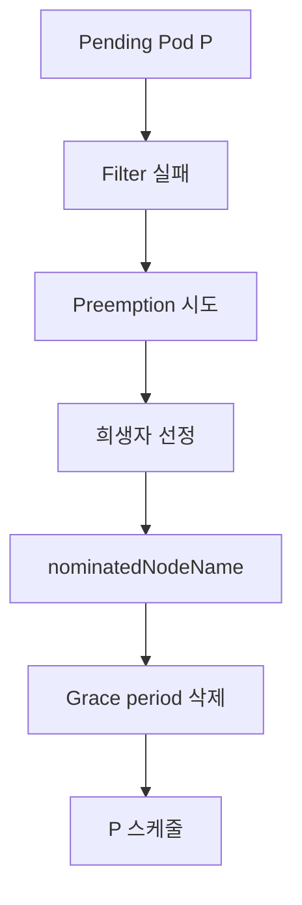

# Priority·Preemption

**PriorityClass**는 Pod의 상대 중요도를 정수로 선언한다. 노드 리소스가 부족해
스케줄 불가능할 때, 스케줄러는 **낮은 우선순위 Pod을 축출(preempt)**해
높은 우선순위 Pod을 배치한다. 말은 간단하지만 운영 관점에서 이것은
**"누가 먼저 죽는가"**의 정책이자, **"내 서비스가 언제 중단될 수 있는가"**의
계약이다.

이 글은 PriorityClass 스펙, 내장 `system-cluster-critical`·
`system-node-critical`의 값 범위, **preemption 알고리즘 단계별**, PDB와의
상호작용 한계, **NonPreemptingPriority**, ResourceQuota 스코프 결합 패턴,
Cluster Autoscaler·Karpenter와의 상호작용까지 다룬다.

> 관련: [NodeSelector·Affinity](./node-selector-affinity.md) · [Taint·Toleration](./taint-toleration.md)
> · [Topology Spread](./topology-spread.md) · [Scheduler 내부](./scheduler-internals.md)
> · QoS·eviction → [Requests·Limits](../resource-management/requests-limits.md)

---

## 1. PriorityClass 스펙

```yaml
apiVersion: scheduling.k8s.io/v1
kind: PriorityClass
metadata:
  name: high-priority
value: 1000000                  # 정수 (큰 값일수록 우선)
globalDefault: false
preemptionPolicy: PreemptLowerPriority   # 기본. 또는 Never
description: "결제 서비스 전용"
```

```yaml
# Pod에서 사용
apiVersion: v1
kind: Pod
spec:
  priorityClassName: high-priority
```

### 필드 요약

| 필드 | 의미 |
|---|---|
| `value` | 정수. 범위 `-2,147,483,648` ~ `1,000,000,000`. **큰 값이 우선** |
| `globalDefault` | `true`면 PriorityClass 미지정 Pod에 적용. **클러스터당 하나만** |
| `preemptionPolicy` | `PreemptLowerPriority`(기본) / `Never` |
| `description` | 운영 메모 |

### 값 범위 관례

| 대역 | 용도 |
|---|---|
| `> 1,000,000,000` | **시스템 예약** — 커스텀 금지 |
| `system-node-critical` = **2,000,001,000** | kubelet·CNI·CSI 등 |
| `system-cluster-critical` = **2,000,000,000** | core-dns, kube-proxy 같은 클러스터 핵심 |
| `100,000 ~ 1,000,000` | 프로덕션 고우선순위(결제·주문) |
| `1,000 ~ 100,000` | 일반 서비스 |
| `0` ~ `1,000` | 백그라운드·배치 |
| `음수` | preempt 대상 되는 "일시 처리 가능 워크로드" |

---

## 2. Pod 우선순위 효과

우선순위는 **2가지 방식**으로 스케줄러에 영향을 준다:

### A. 큐 순서 — 스케줄링 대기 줄

pending Pod이 여러 개일 때 스케줄러가 **priority 큰 순서로** 처리.
리소스가 충분하면 preempt 없이 단순 우선 배치.

### B. Preemption — 축출

리소스 부족 시 **낮은 priority Pod을 evict**시켜 자리를 만든다.

`preemptionPolicy: Never`면 큐 순서만 받고 preempt는 하지 않음.

---

## 3. Preemption 알고리즘 — 단계별



### 단계 상세

1. **스케줄 시도**: Pod P가 filter 단계를 통과 못함(리소스 부족)
2. **후보 노드 탐색**: 각 노드에서 "P보다 우선순위 낮은 Pod들을 제거하면
   P가 들어갈 수 있나"를 평가
3. **PDB 우선 시도**: PDB 위배 안 하는 조합 먼저
4. **victim 선정**:
   - 희생 Pod 수를 최소화
   - 높은 우선순위 victim은 피함
   - graceful 종료 시간이 짧은 쪽 선호
5. **`nominatedNodeName` 설정**: P의 status에 타깃 노드 지정
6. **Graceful eviction**: victim Pod에 delete 요청, `terminationGracePeriodSeconds`만큼 대기
7. **재스케줄**: P가 자리 비워진 노드에 배치 시도

### 한계 — 크로스-노드 preemption 없음

스케줄러는 **한 노드 안에서**만 victim을 찾는다. 노드 A에서 Pod 하나 제거,
노드 B에서 Pod 하나 제거해 P에 자원 확보 — **이런 조합은 고려 안 함**.

필요하면 out-of-tree 플러그인 [scheduler-plugins/CrossNodePreemption](https://github.com/kubernetes-sigs/scheduler-plugins/blob/master/pkg/crossnodepreemption/README.md)을
커스텀 스케줄러로 도입 — 상세는 [Scheduler 내부](./scheduler-internals.md).

### 한계 — PDB는 "best-effort"

공식 문서: *"PodDisruptionBudget ... is supported, but not guaranteed."*
PDB 위배 없는 조합을 **먼저 시도**하지만, 다른 방법이 없으면 **PDB를
위반하고라도** preempt 수행. 이는 가용성 설계에서 중요한 제약.

### Graceful Termination Gap

victim Pod의 `terminationGracePeriodSeconds` 동안 **P는 계속 대기**.
긴 grace period를 가진 victim은 P의 배치를 오래 지연시킨다.

**대응**: 우선순위 낮은 워크로드는 **짧은 terminationGracePeriod**(예: 10초)
유지. 그래도 정상적으로 드레인 되는 앱 설계(graceful shutdown + PDB)가 전제.

---

## 4. NonPreemptingPriority — 1.24 Stable

```yaml
apiVersion: scheduling.k8s.io/v1
kind: PriorityClass
metadata:
  name: high-non-preempting
value: 1000000
preemptionPolicy: Never           # 핵심
```

- 큐 순서는 **높게** 받음 (일반 Pod보다 먼저 스케줄 시도)
- 그러나 **preempt는 하지 않음** — 공간 없으면 Pending
- 히스토리: **1.19 Alpha → 1.21 Beta → 1.24 GA**(KEP-902)

### 언제 쓰나

| 용도 | 이유 |
|---|---|
| 데이터 사이언스·ML 학습 Job | 진행 중인 학습을 망치지 않고 공간 기다림 |
| 야간 배치 작업 | 프로덕션 트래픽 축출 방지 |
| 버스트용 임시 Pod | 일시적 공간 나면 실행 |

---

## 5. ResourceQuota + PriorityClass 스코프

고우선순위 악용을 막기 위해 **ResourceQuota를 우선순위별로 분리**.

```yaml
apiVersion: v1
kind: ResourceQuota
metadata: { name: high-quota, namespace: team-a }
spec:
  hard:
    requests.cpu: "10"
    requests.memory: 20Gi
    pods: "20"
  scopeSelector:
    matchExpressions:
    - operator: In
      scopeName: PriorityClass
      values: [high, mission-critical]
```

```yaml
# 일반 워크로드용
spec:
  hard:
    requests.cpu: "40"
    requests.memory: 80Gi
    pods: "200"
  scopeSelector:
    matchExpressions:
    - operator: NotIn
      scopeName: PriorityClass
      values: [high, mission-critical]
```

### 효과

- 팀이 고우선순위를 남용해 다른 팀을 축출하려 해도 **자기 고우선순위 쿼터에
  갇힘**
- 전체 클러스터 preemption 폭풍 방지

### 멀티테넌시 보안 권고 (공식)

> *"In a cluster where not all users are trusted, a malicious user could
> create Pods at the highest possible priorities, causing other Pods to
> be evicted/not get scheduled."*

**대응**:
- 고우선순위 PriorityClass를 **특정 네임스페이스에만 허용** (ResourceQuota scope)
- Kyverno/OPA Gatekeeper로 `priorityClassName` 사용 제한
- audit log에서 priorityClass 사용 모니터

---

## 6. QoS·eviction·priority — 세 개념의 관계

혼동하기 쉬운 두 개념:

| 개념 | 결정 시점 | 결정 내용 |
|---|---|---|
| **Priority·Preemption** | **스케줄 시점** | 새 Pod을 위해 기존 Pod 축출 |
| **QoS + node-pressure eviction** | **kubelet 런타임** | 노드 리소스 압박 시 Pod 종료 순서 |

### Priority가 kubelet eviction에도 참조됨 (1.17+ 기본 활성)

`PodPriorityBasedGracefulNodeShutdown` 등 kubelet의 node-pressure eviction
경로도 **Pod Priority를 판단 기준에 통합**한다. 공식 동작:

1. 먼저 **리소스 요청 초과 + Priority**를 결합해 제거 후보 식별
2. 그다음 **사용량(`usage - requests`)**으로 tie-break

즉 **priority는 스케줄러·kubelet 양쪽에서** 참조된다. "QoS가 같을 때
priority가 tie-break" 수준이 아니라 **동등한 판단 요소**.

---

## 7. Cluster Autoscaler·Karpenter와의 상호작용

Preemption과 오토스케일러는 서로 역할이 겹쳐 복잡한 동작을 만든다.

### Cluster Autoscaler(CA)

CA는 **Pending Pod**을 보고 노드 추가 결정. 그런데 Preemption이 먼저 일어나면
Pod이 Pending 시간 매우 짧아 **CA가 scale-up 하기 전에 victim 축출**.

실무 트레이드오프:
- **즉시성 필요** → preemption 선호
- **victim 최소화·비용 선호** → preemption 지연으로 **CA에 기회 제공**
  (`expendable-pods-priority-cutoff` 설정)

### Karpenter

Karpenter는 **preemption을 덜 선호**하고 **NodePool/노드 provision**을 우선
시도. 그러나 NodePool 한도·지연 때문에 preemption은 여전히 발생.

### scale-down 역학

Preemption으로 victim이 제거되면 해당 노드가 **언더유틸라이즈**되어 CA/
Karpenter의 scale-down 대상이 될 수 있다. "preempt → scale-down → 다음에
또 scale-up" 진동이 발생하지 않도록 **`scale-down-delay-after-add`** 같은
설정으로 튜닝.

---

## 8. 안티패턴

| 안티패턴 | 결과 | 대안 |
|---|---|---|
| **모든 워크로드에 high-priority 부여** | 우선순위 의미 상실, preemption 폭풍 | 계층화 — 3~5개 레벨 |
| `globalDefault: true` PriorityClass 여러 개 | API reject | 클러스터당 하나만 |
| 시스템 예약(`> 10^9`) 값에 커스텀 PriorityClass | 시스템 축출 가능 | **하한: 1,000,000,000 이하** |
| victim Pod에 **PDB 없음** | preempt 시 가용성 급락 | PDB 필수 |
| victim `terminationGracePeriodSeconds: 300` | P의 스케줄 5분 지연 | 낮은 우선순위는 grace 짧게 |
| ResourceQuota 없이 고우선순위 허용 | 팀 간 축출 폭풍 | PriorityClass scope RQ |
| `preemptionPolicy: Never` 우선순위 남용 | 큐만 먼저, 실제 공간 못 받음 | 상황별 PreemptLowerPriority |
| 두 개 이상 PriorityClass가 같은 `value` | tie-break 비결정적 | 값 고유화 |
| `globalDefault: true` + `preemptionPolicy: Never` | **클러스터 전역 preemption 비활성화** — 모든 기본 Pod이 preempt 못함 | globalDefault는 preemption 정책도 고려해 신중히 |
| 멀티 스케줄러 환경에서 A가 B Pod 축출 | **preemption 루프**(A 축출 → B 재배치 → A 다시 Pending) | 스케줄러별 Pod scope 분리, `schedulerName` 엄격 관리 |
| `system-cluster-critical`을 일반 앱에 | 아예 preempt 안 됨 | 실제 시스템 컴포넌트만 |
| CA 설정 없이 preempt 폭증 | scale-up 지연, victim만 계속 죽음 | `expendable-pods-priority-cutoff` 튜닝 |

---

## 9. 프로덕션 체크리스트

- [ ] **PriorityClass 레벨 문서화** — 최대 5단계 (critical / high / normal / low / batch)
- [ ] `globalDefault` 는 **normal 수준**에만 부여(모든 Pod의 기본)
- [ ] system-cluster-critical·system-node-critical 값 **변경 금지**
- [ ] 중요 서비스는 **PDB 필수** — preempt 시 최소 가용성 보장
- [ ] 낮은 우선순위 Pod은 **짧은 terminationGracePeriodSeconds**(≤30s)
- [ ] 멀티테넌시: 고우선순위에 **ResourceQuota scope** 제한
- [ ] Kyverno/Gatekeeper로 **네임스페이스별 허용 priorityClass** 정책
- [ ] CA/Karpenter 튜닝 — `expendable-pods-priority-cutoff`, `scale-down-delay`
- [ ] `kube_pod_priority`·`scheduler_preemption_attempts_total`·`scheduler_preemption_victims` 메트릭 모니터
- [ ] `NonPreemptingPriority` 필요한 배치 워크로드 식별
- [ ] Pod의 **`nominatedNodeName`** 필드 모니터 — 장기 preempt 대기 경보

---

## 10. 트러블슈팅

| 증상 | 근본 원인 | 진단·조치 |
|---|---|---|
| 고우선순위 Pod Pending 지속 | 후보 노드가 없거나 victim 모두 PDB 위배 | `kubectl describe pod` events, PDB 재검토 |
| preempt 됐는데 victim 오래 안 죽음 | 긴 `terminationGracePeriod` | grace 단축 또는 PreStop 정리 |
| PDB 위반하며 축출됨 | PDB는 **best-effort** | PDB는 강제 보장 아님을 인지 |
| 우선순위 낮은 Pod 반복 축출 | preempt 폭풍 | PriorityClass 설계 재검토, RQ scope |
| preempt 후 P가 여전히 Pending | 다른 노드의 다른 제약(affinity·taint) | `describe pod` condition |
| QoS 같은데 특정 Pod만 eviction | priority 낮은 쪽 먼저 | priority 보정 |
| `nominatedNodeName`이 계속 바뀜 | 여러 Pending Pod 경쟁 | 우선순위 구조 재검토 |
| `globalDefault` 못 만듦 | 이미 다른 GD 존재 | 기존 GD 확인·수정 |
| CA가 노드 안 늘림 | preemption이 먼저 일어나 Pending 시간 짧음 | `expendable-pods-priority-cutoff` 조정 |
| system-cluster-critical 축출됨 | 없어야 할 상황 — feature gate·APIserver 설정 | kubelet·scheduler 로그 |

### 자주 쓰는 명령

```bash
# PriorityClass 전체 확인
kubectl get priorityclass

# Pod의 priority 값
kubectl get pod <name> -o jsonpath='{.spec.priority}{"\t"}{.spec.priorityClassName}{"\n"}'

# preempt 예정인 Pod의 nominatedNodeName
kubectl get pods -A -o json \
  | jq -r '.items[] | select(.status.nominatedNodeName!=null) | .metadata.namespace+"/"+.metadata.name+"\t"+.status.nominatedNodeName'

# 최근 preempt 이벤트
kubectl get events -A --field-selector reason=Preempted

# PDB 상태
kubectl get pdb -A
kubectl describe pdb <name>

# RQ scope로 priority 쿼터 확인
kubectl describe resourcequota -n <ns>
```

---

## 11. 이 카테고리의 경계

- **Priority·Preemption 자체** → 이 글
- **PodDisruptionBudget·graceful shutdown** → [Pod 라이프사이클](../workloads/pod-lifecycle.md) · `reliability/`
- **Node-pressure eviction·QoS** → [Requests·Limits](../resource-management/requests-limits.md)
- **Scheduler 플러그인·프로파일** → [Scheduler 내부](./scheduler-internals.md)
- **Topology Spread·Affinity·Taint** → 앞 글들
- **HPA·VPA·Cluster Autoscaler·Karpenter** → `autoscaling/`
- **SLO·에러 예산 기반 우선순위** → `sre/`

---

## 참고 자료

- [Kubernetes — Pod Priority and Preemption](https://kubernetes.io/docs/concepts/scheduling-eviction/pod-priority-preemption/)
- [Kubernetes — Limit Priority Class consumption by default](https://kubernetes.io/docs/concepts/policy/resource-quotas/#limit-priority-class-consumption-by-default)
- [KEP-564 — Pod Priority Non-Preempting](https://github.com/kubernetes/enhancements/tree/master/keps/sig-scheduling/902-non-preempting-priority-class)
- [Cluster Autoscaler FAQ — Expendable Pods](https://github.com/kubernetes/autoscaler/blob/master/cluster-autoscaler/FAQ.md)
- [Kubernetes — PriorityClass API](https://kubernetes.io/docs/reference/kubernetes-api/policy-resources/priority-class-v1/)

(최종 확인: 2026-04-22)
