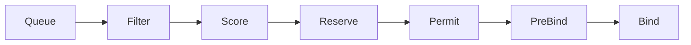
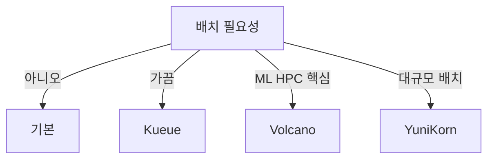
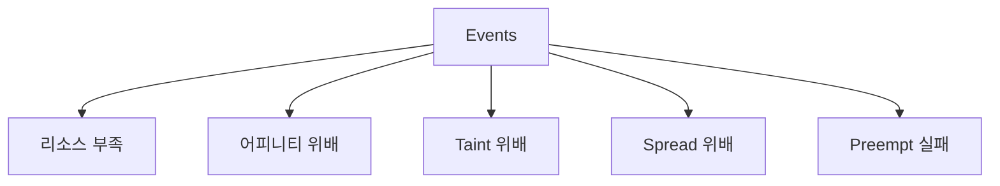

# Scheduler 내부

앞선 네 글(Affinity·Taint·Topology Spread·Priority)은 모두 **kube-scheduler
의 특정 플러그인이 수행하는 계산**이었다. 이 글은 그것들을 받쳐주는
**스케줄링 프레임워크**의 내부 — 스케줄링 사이클의 각 단계, 내장 플러그인
목록, **KubeSchedulerConfiguration** 프로파일, Extender(레거시), 멀티
스케줄러, 그리고 Volcano·Kueue·YuniKorn 같은 **커스텀·전문 스케줄러**의
경계를 다룬다.

운영자 관점에서 이 글의 핵심 질문은 "언제 기본 스케줄러로 충분하고,
언제 커스텀 스케줄러가 필요한가" 그리고 "스케줄러 성능이 문제일 때 어디를
봐야 하는가"다.

> 관련: [NodeSelector·Affinity](./node-selector-affinity.md) · [Taint·Toleration](./taint-toleration.md)
> · [Topology Spread](./topology-spread.md) · [Priority·Preemption](./priority-preemption.md)
> · GPU·배치 워크로드 → `ai-ml/` · `special-workloads/`

---

## 1. 스케줄링 사이클 — 한눈에



각 단계는 **Scheduling Framework의 확장 포인트**(extension point)다.
플러그인은 **하나 이상의 포인트에 등록**되어 동작한다.

### 단계별 역할

| 단계 | 역할 | 대표 플러그인 |
|---|---|---|
| **QueueSort** | pending Pod 큐 정렬(우선순위 기반) | `PrioritySort` |
| **PreFilter** | Filter 전 공용 전처리·캐시 생성 | `NodeResourcesFit`, `PodTopologySpread` |
| **Filter** | 배치 불가 노드 **제거** (하드 조건) | `NodeAffinity`, `TaintToleration`, `NodePorts` |
| **PostFilter** | Filter 실패 시 복구 — **Preemption 발동** | `DefaultPreemption` |
| **PreScore** | Score 전 공용 전처리 | `PodTopologySpread`, `InterPodAffinity` |
| **Score** | 남은 노드에 점수(0~100) 부여 | `NodeResourcesBalancedAllocation`, `ImageLocality` |
| **NormalizeScore** | 스코어를 0~100으로 정규화 | 대부분 스코어 플러그인 |
| **Reserve** | 자원을 **"예약"** 상태로 표시 (프레임워크 내부) | `VolumeBinding` |
| **Permit** | 배치 보류·지연(gang scheduling용) | custom(e.g. Coscheduling) |
| **PreBind** | 바인딩 전 준비(볼륨 attach 등) | `VolumeBinding` |
| **Bind** | Pod↔Node 바인딩 실제 기록 | `DefaultBinder` |
| **PostBind** | 바인딩 후 hook | 관측용 |

### 결과

Filter가 모두 통과하고 Score 최상위 노드가 Reserve→Bind까지 성공하면
**`pod.spec.nodeName`이 채워지고** kubelet이 이어 받는다.

---

## 2. 내장 플러그인 지도

각 플러그인이 **어느 단계**에 관여하는지 알아두면 설정·디버깅이 수월하다.

| 플러그인 | PreFilter | Filter | PostFilter | PreScore | Score | Reserve | Permit | PreBind | Bind |
|---|:-:|:-:|:-:|:-:|:-:|:-:|:-:|:-:|:-:|
| `NodeResourcesFit` | ✅ | ✅ |  |  | ✅ |  |  |  |  |
| `NodeName` |  | ✅ |  |  |  |  |  |  |  |
| `NodePorts` | ✅ | ✅ |  |  |  |  |  |  |  |
| `NodeAffinity` | ✅ | ✅ |  | ✅ | ✅ |  |  |  |  |
| `NodeUnschedulable` |  | ✅ |  |  |  |  |  |  |  |
| `NodeVolumeLimits` | ✅ | ✅ |  |  |  |  |  |  |  |
| `PodTopologySpread` | ✅ | ✅ |  | ✅ | ✅ |  |  |  |  |
| `InterPodAffinity` | ✅ | ✅ |  | ✅ | ✅ |  |  |  |  |
| `TaintToleration` |  | ✅ |  | ✅ | ✅ |  |  |  |  |
| `VolumeBinding` | ✅ | ✅ |  |  | ✅ | ✅ |  | ✅ |  |
| `VolumeRestrictions` |  | ✅ |  |  |  |  |  |  |  |
| `VolumeZone` |  | ✅ |  |  |  |  |  |  |  |
| `ImageLocality` |  |  |  |  | ✅ |  |  |  |  |
| `NodeResourcesBalancedAllocation` |  |  |  |  | ✅ |  |  |  |  |
| `DefaultPreemption` |  |  | ✅ |  |  |  |  |  |  |
| `DefaultBinder` |  |  |  |  |  |  |  |  | ✅ |
| `PrioritySort` (QueueSort) | — | — | — | — | — | — | — | — | — |

**1.33~1.35 최신 추가**:
- `DynamicResources`(DRA): 1.32 Beta → **1.34 GA/기본 활성**. GPU·특수 자원
- `SchedulingGates`: 1.27 Beta → **1.30 Stable**. Pod 스케줄 보류 플래그 (외부 controller가 해제)

---

## 3. KubeSchedulerConfiguration — v1 설정

kube-scheduler는 `--config` 플래그로 **YAML 설정 파일**을 받는다.

```yaml
apiVersion: kubescheduler.config.k8s.io/v1
kind: KubeSchedulerConfiguration
parallelism: 16                      # 동시 스케줄 고루틴 수
percentageOfNodesToScore: 50         # Score 단계에서 고려할 노드 비율
profiles:
- schedulerName: default-scheduler   # 이 프로파일을 쓰는 Pod의 schedulerName
  plugins:
    filter:
      disabled:
      - name: NodePorts              # 플러그인 비활성
    score:
      enabled:
      - name: NodeResourcesBalancedAllocation
        weight: 10                   # 가중치 조정
  pluginConfig:
  - name: PodTopologySpread
    args:
      defaultConstraints:
      - maxSkew: 3
        topologyKey: kubernetes.io/hostname
        whenUnsatisfiable: ScheduleAnyway
      defaultingType: List
```

### 주요 튜닝 필드

| 필드 | 의미 |
|---|---|
| `parallelism` | 동시 스케줄 병렬도 — 대규모 클러스터에서 중요 |
| `percentageOfNodesToScore` | 대규모 클러스터에서 모든 노드 스코어링 비용 절감 |
| `profiles` | 여러 프로파일(스케줄러명이 다른 별개 스케줄러처럼 동작) |
| `plugins.enabled/disabled` | 플러그인 on/off, **weight 조정** |
| `pluginConfig` | 플러그인별 상세 인자(예: TopologySpread `defaultConstraints`) |

### `percentageOfNodesToScore` 튜닝

공식 기본 수식: **`max(5, 50 - numNodes/125)`** %

| 노드 수 | 스코어링 비율 |
|---|---|
| 100 | 50% |
| 500 | 46% |
| 2000 | 34% |
| 5000 | 10% |
| 6250+ | **5%**(하한) |

- 스코어링 품질 vs 스케줄 지연 간 **트레이드오프**
- 수천 노드 클러스터에서 기본값이 이미 매우 낮음 — 섣부른 상향은 지연 악화

---

## 4. 멀티 프로파일 — 한 스케줄러, 여러 정책

```yaml
profiles:
- schedulerName: default-scheduler
  plugins: {...}
- schedulerName: batch-scheduler
  plugins:
    score:
      disabled:
      - name: NodeResourcesBalancedAllocation   # bin-packing과 상충
  pluginConfig:
  - name: NodeResourcesFit
    args:
      scoringStrategy:
        type: MostAllocated                     # bin-packing
        resources:
        - { name: cpu,    weight: 1 }
        - { name: memory, weight: 1 }
```

`NodeResourcesFit`의 `scoringStrategy.type`은 세 값 중 하나:
- `LeastAllocated`(기본): 자원이 많이 남은 노드 선호 — **분산**
- `MostAllocated`: 자원이 많이 쓰인 노드 선호 — **bin-packing** (배치 Job에 적합)
- `RequestedToCapacityRatio`: 사용자 정의 함수

Pod에서 `spec.schedulerName: batch-scheduler`로 지정하면 해당 프로파일이
적용된다. **한 kube-scheduler 프로세스**가 여러 프로파일을 동시 서비스.

### 언제 멀티 프로파일을 쓰나

- 배치 Job과 서비스가 같은 클러스터에 혼재
- 팀별로 다른 스코어 가중치
- scheduler-plugins out-of-tree 플러그인을 **특정 프로파일에만** 적용

---

## 5. Scheduler Extender — 레거시 확장

HTTP webhook으로 외부 프로세스가 **Filter/Score/Prioritize/Bind**에 개입.

```yaml
extenders:
- urlPrefix: https://extender.example.com
  filterVerb: filter
  prioritizeVerb: prioritize
  weight: 5
  bindVerb: ""
  nodeCacheCapable: true
```

### 왜 레거시인가

- HTTP 왕복 비용 큼 — 스케줄 지연
- Framework 이전에 도입된 확장 방식
- **Scheduling Framework 플러그인이 표준**으로 자리잡은 뒤로는 사용 감소

**현재 현실**: in-tree 플러그인 + scheduler-plugins(out-of-tree) + 커스텀
스케줄러(다음 섹션) 조합이 주류. Extender는 **기존 통합만 유지보수**하는
수준.

---

## 6. 멀티 스케줄러 — 여러 스케줄러 프로세스

한 클러스터에 **kube-scheduler + 제2 스케줄러**가 **각자 다른 `schedulerName`**
을 담당하도록 공존. kube-scheduler 자체는 **leader election 기반 active-passive**
이므로 replica를 여러 개 띄워도 **리더 하나만** 실제 스케줄링한다(HA 목적).
멀티 스케줄러 환경에서도 **각 스케줄러별 leader election은 독립**.

```yaml
# Pod이 제2 스케줄러를 사용
spec:
  schedulerName: volcano
```

### 언제 정당한가

| 상황 | 답 |
|---|---|
| 단순히 Score 가중치만 다르게 | **멀티 프로파일로 충분** |
| QueueSort 로직이 근본적으로 다름 | 멀티 스케줄러 필요 |
| Gang scheduling / 일괄 admission | Volcano·Kueue·YuniKorn |
| HPC 잡 매니저(PBS·Slurm 의존) | 별도 스케줄러 |
| 테스트·실험 스케줄러 | 완전 분리로 안전 |

### 충돌 주의

- 두 스케줄러가 **서로의 관할 Pod을 preempt**하면 **preemption 루프** 발생
  (→ [Priority·Preemption](./priority-preemption.md) 트러블슈팅)
- Pod의 `schedulerName`을 RBAC·Kyverno로 엄격 관리

---

## 7. 전문 스케줄러 — Volcano·Kueue·YuniKorn

기본 kube-scheduler는 **서비스 워크로드 중심**. 배치·HPC·ML 학습에서는
**gang scheduling**(전원 일괄 스케줄) 등이 필요해 전문 스케줄러가 등장.

### 비교 표

| 스케줄러 | 모델 | 주 용도 | kube-scheduler 관계 |
|---|---|---|---|
| **Kueue**(k8s SIG) | **Job 레벨 queueing**, 기본 스케줄러 그대로 사용 | 팀별 배치 큐·쿼터 | **보완** — 기본 스케줄러 위에서 admission 제어 |
| **Volcano**(CNCF) | 자체 스케줄러 | HPC·ML(딥러닝) gang·job-dependency | **대체**(특정 워크로드만) |
| **YuniKorn**(Apache) | 자체 스케줄러 | K8s + YARN 혼합, 대규모 배치 | **대체** |
| **scheduler-plugins/Coscheduling** | kube-scheduler **플러그인** | 경량 gang | **확장**(같은 프로세스) |
| **Kubeflow Trainer** (과거 Training Operator) | Kueue/Volcano와 통합 | ML 트레이닝 | 워크로드 정의 |

### 선택 기준



- **가끔·작은 규모**: Kueue(기본 스케줄러 + 큐)
- **ML/HPC 핵심**: Volcano(gang·job dependency)
- **YARN 연계·엄청난 규모**: YuniKorn

### 온프레미스 고려

ai-ml 워크로드 비중이 크면 **Kueue + kube-scheduler(+scheduler-plugins)**
조합이 보수적 1차 선택. 성장해 모델 학습이 주류가 되면 Volcano·
Kubeflow로 확장.

상세는 `ai-ml/` · `special-workloads/` 섹션.

---

## 8. 스케줄러 관측 — 핵심 메트릭

| 메트릭 | 의미 | 알람 기준 |
|---|---|---|
| `scheduler_scheduling_attempt_duration_seconds` | 시도 지연 (histogram) | P99 > 1초 |
| `scheduler_pod_scheduling_duration_seconds` | Pod 단위 전체 지연 | P99 > 5초 |
| `scheduler_pending_pods{queue="active"}` | 대기 큐 Pod 수 | 지속 증가 |
| `scheduler_pending_pods{queue="backoff"}` | backoff 큐 | backoff 급증 |
| `scheduler_pending_pods{queue="unschedulable"}` | 스케줄 불가 Pod | >0 경보 |
| `scheduler_pending_pods{queue="gated"}` | SchedulingGates 해제 대기 | controller 미해제 조기 경보 |
| `scheduler_pod_scheduling_sli_duration_seconds` | **Pod 관점 전체 지연** (SLI) | SLO 설계 기본 지표 |
| `scheduler_queue_incoming_pods_total` | 큐 유입 속도 | 부하 추세 |
| `scheduler_preemption_attempts_total` | preemption 시도 | 폭증 이상 |
| `scheduler_preemption_victims` | victim 분포 | — |
| `scheduler_framework_extension_point_duration_seconds` | **단계별** 지연 | 병목 식별 |
| `scheduler_goroutines{work="SchedulingQueue"}` | 고루틴 | 병렬도 점검 |

### 쿼리 예

```promql
# P99 스케줄 지연
histogram_quantile(0.99,
  sum by (le, profile) (rate(scheduler_scheduling_attempt_duration_seconds_bucket[5m])))

# 단계별 평균 지연
sum by (extension_point) (
  rate(scheduler_framework_extension_point_duration_seconds_sum[5m]))
/ sum by (extension_point) (
  rate(scheduler_framework_extension_point_duration_seconds_count[5m]))

# 지속적으로 스케줄 못 받는 Pod 수
scheduler_pending_pods{queue="unschedulable"}
```

---

## 9. 트러블슈팅 시나리오

### Pod Pending 원인 레이어 — 어디부터 볼까



| 이벤트 메시지 | 담당 플러그인 |
|---|---|
| 리소스 부족 | `NodeResourcesFit` |
| 어피니티 위배 | `NodeAffinity` |
| Taint 위배 | `TaintToleration` |
| Spread 위배 | `PodTopologySpread` |
| Preempt 실패 | `DefaultPreemption` + PDB |

```bash
kubectl describe pod <name>
# Events 섹션이 정답을 알려주는 1차 소스

kubectl get events --field-selector reason=FailedScheduling,involvedObject.name=<pod>
```

### 스케줄 지연이 큼

1. `scheduler_framework_extension_point_duration_seconds`로 **어느 단계**?
2. `InterPodAffinity`·`PodTopologySpread`가 크면 → **Topology Spread로
   마이그레이션**, podAntiAffinity 제거
3. `NodeResourcesFit`가 크면 → 노드 수 많음, `percentageOfNodesToScore`
   조정
4. `VolumeBinding`이 크면 → CSI 드라이버·외부 스토리지 응답 느림

### Preemption 폭풍

1. `scheduler_preemption_attempts_total` 급증
2. PriorityClass 설계 재검토 — 레벨 수, 값 간 간격
3. ResourceQuota PriorityClass scope로 고우선순위 쿼터 분리

---

## 10. 커스텀 스케줄러 구현 — 간단 가이드

완전 새로운 로직이 필요할 때:

### 옵션 A: scheduler-plugins(out-of-tree) — 가장 많음

[kubernetes-sigs/scheduler-plugins](https://github.com/kubernetes-sigs/scheduler-plugins) 저장소의 플러그인:
- **Coscheduling**: 경량 gang scheduling
- **CapacityScheduling**: Elastic Quota
- **NodeResourceTopology**: NUMA·CPU pinning 인지
- **TargetLoadPacking**: 실제 사용률 기반 bin-packing
- **Trimaran**: 실측 부하 기반 스케줄링

운영상 안전한 사용 방법:

1. **기본 kube-scheduler는 그대로 유지** — out-of-tree 이미지는 `schedulerName`을
   분리한 **제2 프로파일** 또는 **멀티 스케줄러**로 도입
2. **버전 호환 매트릭스**: scheduler-plugins 이미지는 업스트림 kube-scheduler와
   버전 짝이 맞아야 함. 1.33/1.34 이미지가 다름 — 불일치 시 기동 실패·이상 동작
3. **컨트롤 플레인 업그레이드 시 선행 의무**: scheduler-plugins 이미지를 같은
   시점에 업데이트해야 함
4. 기본 스케줄러를 **직접 교체**(이미지 덮어쓰기)는 블래스트 반경이 크므로
   지양 — 테스트 클러스터에서 충분히 검증 후에도 멀티 스케줄러 배포 권장

### 옵션 B: 완전 새 스케줄러

Framework SDK(`k8s.io/kubernetes/pkg/scheduler`)를 이용. 실무에서 거의
**쓸 일 없다** — Volcano·Kueue 같은 기존 도구로 충분.

---

## 11. 안티패턴

| 안티패턴 | 결과 | 대안 |
|---|---|---|
| 수천 노드에서 **모든 플러그인 활성** + `percentageOfNodesToScore: 100` | 스케줄 지연 급증 | 필요 없는 Score 플러그인 비활성, 샘플링 비율 조정 |
| 두 번째 스케줄러를 **아무 이유 없이** 배포 | 관리 복잡도, preemption 충돌 | 멀티 프로파일 먼저 |
| Extender로 신규 통합 | 레거시, 지연 큼 | Framework 플러그인 |
| `PrioritySort` 비활성 | 우선순위 큐가 깨져 FIFO로 동작 | 기본 유지 |
| scheduler Pod을 **단일 인스턴스만** 운영 | 단일 장애 | leader-election 기반 HA(2~3 replica) |
| ML/배치에 **기본 스케줄러만** | gang scheduling 없어 리소스 낭비 | Kueue·Volcano |
| 스케줄러 버전 **API skew 위배** | 컴포넌트 불일치 | control plane 컴포넌트 동버전 원칙 |
| `schedulerName` 오타 | Pod 영원히 Pending(존재하지 않는 스케줄러 대기) | Kyverno로 허용 값 강제 |

---

## 12. 프로덕션 체크리스트

- [ ] kube-scheduler **HA**(2~3 replica, leader-election)
- [ ] `KubeSchedulerConfiguration` 파일 **버전 관리 + GitOps**
- [ ] 대규모 클러스터는 `percentageOfNodesToScore` 튜닝(기본 adaptive 점검)
- [ ] **멀티 프로파일**로 배치/서비스 분리(필요 시)
- [ ] 스케줄러 메트릭 대시보드: `attempt_duration_seconds`, `pending_pods`, `preemption_attempts_total`, `framework_extension_point_duration_seconds`
- [ ] `FailedScheduling` 이벤트 집계·알람
- [ ] Extender는 신규 도입 금지
- [ ] ML/배치 워크로드 규모에 따라 **Kueue → Volcano** 경로 계획
- [ ] 멀티 스케줄러 환경에서 **preemption 루프** 모니터
- [ ] `schedulerName` Kyverno로 허용 값 제한
- [ ] scheduler-plugins 도입 시 버전 호환 매트릭스 확인
- [ ] kube-scheduler HA는 **leader election 기반 active-passive** — 멀티 replica는 동시 스케줄링이 아님
- [ ] apiserver·controller-manager·scheduler의 **feature gate 일관성**(특히 SchedulingGates·DynamicResources·MatchLabelKeysInPodAffinity)
- [ ] 기존 Pod 재분산이 필요하면 **Descheduler**(스케줄러의 보완) 도입

---

## 13. 트러블슈팅

| 증상 | 근본 원인 | 진단·조치 |
|---|---|---|
| Pod **영원히 Pending** | `schedulerName` 오타·해당 스케줄러 미설치 | Pod spec 확인, 스케줄러 존재 여부 |
| 스케줄 지연 수 초 이상 | Score 플러그인 비용(InterPodAffinity 등) | extension_point 메트릭으로 식별 |
| `FailedScheduling: 0/N nodes are available` | Filter 전부 실패 | Events 메시지 분석 |
| preemption 반복 | PriorityClass 설계 문제·멀티 스케줄러 충돌 | [Priority·Preemption](./priority-preemption.md) |
| Pod이 `schedulerName: volcano`인데 kube-scheduler가 스케줄 | 기본 스케줄러가 다른 이름 Pod도 집는 경우 | Volcano controller 권한 점검 |
| 프로파일이 적용 안 됨 | `schedulerName` 불일치 | `kubectl get pod -o yaml` 확인 |
| 대규모 클러스터 스케줄 전체 지연 | `parallelism` 기본이 작음 | 16~32로 상향 |
| Extender timeout | HTTP 왕복 지연 | timeout 조정 또는 Extender 제거 |
| scheduler leader 교체 후 스케줄 지연 | 캐시 재구축 중 | 정상(수 분) — 지속되면 로그 확인 |
| SchedulingGates Pod 영원히 Pending | gate 해제 안 됨 | controller·operator 확인 |

### 자주 쓰는 명령

```bash
# 현재 스케줄러 설정
kubectl get cm -n kube-system | grep scheduler
kubectl -n kube-system describe pod kube-scheduler-<master>

# 스케줄러 메트릭 직접 조회
kubectl get --raw /metrics | grep scheduler_

# 스케줄러 로그
kubectl logs -n kube-system -l component=kube-scheduler --tail=200

# Pod의 스케줄러
kubectl get pod <name> -o jsonpath='{.spec.schedulerName}'

# 프로파일별 Pod 수
kubectl get pods -A -o json \
  | jq -r '.items | group_by(.spec.schedulerName) | .[] | "\(.[0].spec.schedulerName // "default-scheduler")\t\(length)"'

# SchedulingGates Pod 찾기
kubectl get pods -A -o json \
  | jq -r '.items[] | select(.spec.schedulingGates!=null) | .metadata.namespace+"/"+.metadata.name'
```

---

## 14. 이 카테고리의 경계

- **Scheduler 내부** → 이 글
- **NodeSelector·Affinity·Taint·Topology Spread·Priority** → 앞 4개 글
- **Pod 라이프사이클·scheduling gates** → [Pod 라이프사이클](../workloads/pod-lifecycle.md)
- **Requests·Limits·QoS·eviction** → [Requests·Limits](../resource-management/requests-limits.md)
- **Kueue·Volcano·Job 오케스트레이션** → `special-workloads/` · `ai-ml/`
- **기존 Pod 재분산(Descheduler)** → `scheduling/` 확장, [GitHub](https://github.com/kubernetes-sigs/descheduler) — kube-scheduler는 **신규 스케줄만** 담당, 클러스터 상태 변화에 따른 재배치는 Descheduler가 보완
- **DRA·GPU** → `ai-ml/`
- **HPA·VPA·Cluster Autoscaler·Karpenter** → `autoscaling/`
- **스케줄러 성능 튜닝(공식 가이드)** → [Kubernetes — Scheduler Performance Tuning](https://kubernetes.io/docs/concepts/scheduling-eviction/scheduler-perf-tuning/)

---

## 참고 자료

- [Kubernetes — Kube-scheduler](https://kubernetes.io/docs/concepts/scheduling-eviction/kube-scheduler/)
- [Kubernetes — Scheduling Framework](https://kubernetes.io/docs/concepts/scheduling-eviction/scheduling-framework/)
- [Kubernetes — Scheduler Performance Tuning](https://kubernetes.io/docs/concepts/scheduling-eviction/scheduler-perf-tuning/)
- [KubeSchedulerConfiguration v1 API](https://kubernetes.io/docs/reference/config-api/kube-scheduler-config.v1/)
- [Configuring Multiple Schedulers](https://kubernetes.io/docs/tasks/extend-kubernetes/configure-multiple-schedulers/)
- [kubernetes-sigs/scheduler-plugins](https://github.com/kubernetes-sigs/scheduler-plugins)
- [Kueue](https://kueue.sigs.k8s.io/)
- [Volcano (CNCF)](https://volcano.sh/)
- [Apache YuniKorn](https://yunikorn.apache.org/)
- [InfraCloud — Batch Scheduling Comparison](https://www.infracloud.io/blogs/batch-scheduling-on-kubernetes/)

(최종 확인: 2026-04-22)
