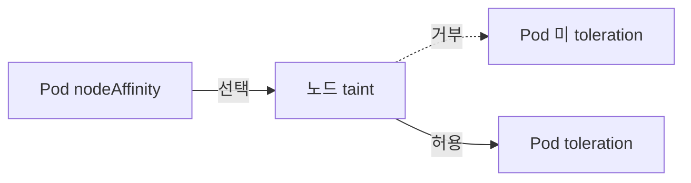

# Taint·Toleration

**Taint**는 "노드가 Pod을 거부"하는 방법이다. NodeSelector·Affinity가
"Pod → 노드" 방향의 유치라면, Taint는 "노드 → Pod" 방향의 **거절**이다.
대칭적으로 보이지만 실무에서 둘은 **다른 문제**를 해결한다:

- **Affinity**: 이 Pod는 **어떤 노드에** 가고 싶은가
- **Taint**: 이 노드는 **어떤 Pod이 오게 할 것인가**

이 글은 `NoSchedule`/`PreferNoSchedule`/`NoExecute` **3가지 effect**,
`tolerationSeconds`, kubelet이 자동으로 부여하는 **내장 taint**(not-ready,
disk-pressure 등)와 TaintBasedEviction, **dedicated node 패턴**에서
taint+affinity를 함께 써야 하는 이유, 그리고 GPU·rook-ceph 같은 온프레미스
전용 노드 운영 예를 다룬다.

> 관련: [NodeSelector·Affinity](./node-selector-affinity.md) · [Topology Spread](./topology-spread.md)
> · [Priority·Preemption](./priority-preemption.md) · [Scheduler 내부](./scheduler-internals.md)

---

## 1. Affinity와의 역방향



| 방향 | 의미 | 예 |
|---|---|---|
| Affinity | Pod이 **가고 싶은 노드** 지정 | GPU Pod → GPU 노드 |
| Taint | 노드가 **받기 싫은 Pod** 거부 | GPU 노드 → 일반 Pod 차단 |

둘은 **보완 관계**다. GPU 전용 노드를 만들려면 **둘 다 필요**:
1. GPU 노드에 `gpu=h100:NoSchedule` taint → 일반 Pod이 못 옴
2. GPU Pod에 toleration → taint 허용
3. GPU Pod에 nodeAffinity → 일반 노드로 **가지 않게 유도**

Taint만 있으면 다른 Pod이 toleration만 흉내내면 침투 가능. 반드시
**taint + nodeAffinity + (toleration)** 3종 세트.

---

## 2. Effect 3종

```yaml
# kubectl taint nodes node1 key1=value1:NoSchedule
spec:
  taints:
  - key: key1
    value: value1
    effect: NoSchedule
```

### 의미·대상

| Effect | 대상 | 동작 |
|---|---|---|
| `NoSchedule` | **신규 스케줄** | 매칭 toleration 없으면 스케줄 거부, **실행 중 Pod 유지** |
| `PreferNoSchedule` | 신규 스케줄(소프트) | 가능하면 회피, 어쩔 수 없으면 허용 |
| `NoExecute` | **실행 중 Pod까지** | 매칭 toleration 없으면 **즉시 evict**. `tolerationSeconds`로 유예 가능 |

### Toleration 매칭

```yaml
tolerations:
- key: key1
  operator: Equal          # 기본값
  value: value1
  effect: NoSchedule
  tolerationSeconds: 300   # NoExecute에만 의미
```

Operator:
- **`Equal`**(기본): key·value **전부 일치**
- **`Exists`**: key만 존재하면 매칭 (value 생략)

특수 케이스:
- **`key` 비움 + `Exists`**: **모든 taint 허용** (매우 강력, 시스템 Pod 전용)
- **`effect` 비움**: 연산자와 무관하게 해당 key의 **모든 effect 허용**

### `tolerationSeconds`의 세 상태 (NoExecute에만 의미)

| 값 | 동작 |
|---|---|
| **미지정** | 무한 tolerate — 수동 제거 전까지 유지 |
| `N > 0` | N초 후 evict |
| `0` | 즉시 evict (사실상 toleration 없는 것과 동일) |

---

## 3. 다중 taint·toleration 평가

노드에 taint가 여러 개일 때:

1. 노드의 모든 taint 나열
2. Pod이 가진 toleration과 매칭되는 것 **제거**
3. **남은 taint 중**:
   - `NoSchedule` 하나라도 있음 → **스케줄 거부**
   - `PreferNoSchedule`만 있음 → 가능하면 회피
   - `NoExecute` 하나라도 있음 → 실행 중이면 **evict**

### 예시

```bash
kubectl taint nodes node1 key1=v1:NoSchedule
kubectl taint nodes node1 key1=v1:NoExecute
kubectl taint nodes node1 key2=v2:NoSchedule
```

Pod이 `key1`의 양쪽 effect만 toleration:
- `key2:NoSchedule`은 남음 → **스케줄 거부**
- 이미 실행 중이면 `key2`는 `NoExecute`가 아니므로 유지

---

## 4. 내장 taint — kubelet·컨트롤러가 자동 부여

노드 상태·이벤트에 따라 자동으로 taint가 붙고 떨어진다.

| Taint key | 조건 | Effect |
|---|---|---|
| `node.kubernetes.io/not-ready` | Ready 컨디션 false | `NoSchedule` 즉시, **노드 상태 확정 후 `NoExecute` 추가** |
| `node.kubernetes.io/unreachable` | 노드에서 응답 없음 | `NoSchedule` 즉시, **확정 후 `NoExecute` 추가** |
| `node.kubernetes.io/memory-pressure` | 메모리 압박 | `NoSchedule` |
| `node.kubernetes.io/disk-pressure` | 디스크 압박 | `NoSchedule` |
| `node.kubernetes.io/pid-pressure` | PID 고갈 | `NoSchedule` |
| `node.kubernetes.io/unschedulable` | cordon | `NoSchedule` |
| `node.kubernetes.io/network-unavailable` | CNI 미준비 | `NoSchedule` |
| `node-role.kubernetes.io/control-plane` | kubeadm 컨트롤 플레인 | `NoSchedule` |

`not-ready`/`unreachable`의 `NoExecute`는 즉시가 아니라 **노드 컨트롤러가
상태를 확정(기본 40초 타임아웃)한 뒤에** 추가된다는 점이 중요하다.

### TaintBasedEviction — 자동 eviction 300초

노드가 **not-ready**·**unreachable**이 되면 `NoExecute` taint가 자동 부여
되어 Pod이 evict된다. 그러나 **대부분 Pod에 기본 toleration 300초**가 붙어
있다:

```yaml
# DefaultTolerationSeconds admission plugin이 자동 주입
tolerations:
- key: node.kubernetes.io/not-ready
  operator: Exists
  effect: NoExecute
  tolerationSeconds: 300
- key: node.kubernetes.io/unreachable
  operator: Exists
  effect: NoExecute
  tolerationSeconds: 300
```

**의미**:
- 노드가 잠깐 응답 없어도 **5분 내 복구**되면 Pod 그대로
- 5분 넘으면 evict → Deployment·StatefulSet 컨트롤러가 다른 노드로 재생성
  (DaemonSet은 노드 단위 리소스라 다른 노드로 "재생성"되지 않고 해당
  노드가 복구될 때까지 기다림)

### `tolerationSeconds` 조정 — 민감 워크로드

장애 복구 시간을 짧게 가져가려면 toleration을 **더 짧게**(예: 30초)
재정의. 상태 저장 앱의 failover 정책과 함께 설계.

### DaemonSet의 예외

DaemonSet 컨트롤러는 자동으로 다음 toleration을 Pod에 주입한다:

| Taint key | Effect | 의미 |
|---|---|---|
| `node.kubernetes.io/not-ready` | `NoExecute` (무한) | 노드 복구까지 유지 |
| `node.kubernetes.io/unreachable` | `NoExecute` (무한) | 노드 복구까지 유지 |
| `node.kubernetes.io/disk-pressure` | **`NoSchedule`** | 유지(단, node-pressure eviction은 별도) |
| `node.kubernetes.io/memory-pressure` | **`NoSchedule`** | 유지 |
| `node.kubernetes.io/pid-pressure` | **`NoSchedule`** | 유지 |
| `node.kubernetes.io/unschedulable` | `NoSchedule` | 유지 |
| `node.kubernetes.io/network-unavailable` | `NoSchedule` (hostNetwork DS만) | 유지 |

즉 pressure taint가 DaemonSet을 건들지 않는 건 **`NoSchedule` toleration**
덕분이지 NoExecute 무한 tolerance 때문이 아니다. 다만 node-pressure 자체가
심해지면 kubelet의 일반 eviction으로 DaemonSet Pod도 종료될 수 있다.

---

## 5. 숫자 연산자 `Gt`·`Lt` — 1.35 Alpha

taint value·toleration value를 **정수로 비교**.

```bash
kubectl taint nodes node1 sla-level=950:NoSchedule
```

```yaml
tolerations:
- key: sla-level
  operator: Gt
  value: "900"
  effect: NoSchedule
```

- 노드 `sla-level=950` > toleration `900` → 매칭
- feature gate `TaintTolerationComparisonOperators`, **1.35 Alpha, 기본 off**
- **양의 64-bit 정수만 허용** — 음수·`0`·0-leading(`"0550"`)·비숫자 전부 불허
- 프로덕션 투입 전 Beta 승격 대기 권장

---

## 6. Dedicated Node 패턴

```yaml
# 1) 노드 taint
kubectl taint node gpu-node-1 dedicated=gpu:NoSchedule
kubectl label node gpu-node-1 dedicated=gpu

# 2) Pod: toleration + nodeAffinity 양쪽
apiVersion: v1
kind: Pod
spec:
  tolerations:
  - key: dedicated
    operator: Equal
    value: gpu
    effect: NoSchedule
  affinity:
    nodeAffinity:
      requiredDuringSchedulingIgnoredDuringExecution:
        nodeSelectorTerms:
        - matchExpressions:
          - { key: dedicated, operator: In, values: [gpu] }
```

**왜 nodeAffinity가 필요한가**: taint만 걸면 Pod A(toleration만 있고
affinity 없음)가 **우연히** GPU 노드에 스케줄될 수 있다(GPU 자원이 남아
있을 때). nodeAffinity로 **양방향 결속**을 만들어야 전용 노드가 진짜
전용이 된다.

### 전형적 용도

| 전용 노드 | taint | 대상 워크로드 |
|---|---|---|
| GPU | `gpu=h100:NoSchedule` | ML 학습·추론 |
| 스토리지(ceph-osd) | `storage=ceph-osd:NoSchedule` | rook-ceph OSD |
| 네트워크 경계 | `dedicated=ingress:NoSchedule` | Gateway·Envoy |
| 고성능 NVMe | `disktype=nvme:NoSchedule` | 분산 DB |
| Spot/선점형 | `spot=true:NoSchedule` | 배치·재시도 허용 워크로드 |
| 고객 테넌트 | `tenant=acme:NoSchedule` | 해당 테넌트 전용 |

---

## 7. 온프레미스 rook-ceph·GPU 전용 노드 예

### rook-ceph 스토리지 노드

```bash
# 노드 taint
kubectl taint node storage-01 storage=ceph-osd:NoSchedule
kubectl label node storage-01 storage=ceph-osd
```

```yaml
# rook-ceph OSD Pod
tolerations:
- { key: storage, operator: Equal, value: ceph-osd, effect: NoSchedule }
nodeAffinity:
  requiredDuringSchedulingIgnoredDuringExecution:
    nodeSelectorTerms:
    - matchExpressions:
      - { key: storage, operator: In, values: [ceph-osd] }
```

일반 워크로드가 OSD 노드에 올라가 **IO를 분탕질**하는 사고 방지.

### 대규모 GPU 풀

여러 GPU 세대(A100·H100·B200)를 한 클러스터에서 운영하면:

```bash
kubectl taint node h100-01 gpu=h100:NoSchedule
kubectl taint node a100-01 gpu=a100:NoSchedule
```

- 학습 Job은 H100만 taint 통과
- 추론 Job은 A100으로 라우팅
- 잘못된 매칭으로 인해 **비싼 H100 노드에 저성능 워크로드가 스쿼팅**하는
  사고 방지

---

## 8. 안티패턴

| 안티패턴 | 결과 | 대안 |
|---|---|---|
| taint만 걸고 **affinity 없음** | toleration만 가진 Pod이 전용 노드 침투 | taint + nodeAffinity 세트 |
| **모든 Pod에 `operator: Exists, key: ""` toleration** | 모든 taint 무시 → taint 무용화 | 엄격 필요 시 해당 키만 toleration |
| `tolerationSeconds: 0` | 노드가 조금만 흔들려도 즉시 evict | 30~300초 사이에서 조정 |
| 내장 taint에 tolerationSeconds 미지정으로 override | admission이 default 주입 건너뛰어 **무한 tolerate** 됨(장애 인지 못함) | 재정의 시 반드시 **명시적 값** 설정 |
| `PreferNoSchedule`만 믿고 일반 Pod 침투 허용 | 리소스 모자라면 전용 노드 점유 | `NoSchedule` 사용 |
| 노드 taint 동적 변경 | 컨트롤러·운영팀 간 충돌 | GitOps·자동화 도구로 관리 |
| DaemonSet이 `NoExecute` taint 있는 노드에서 의도치 못한 동작 | DaemonSet은 모든 NoExecute 내장 taint tolerate | 명시적 nodeSelector 추가 |
| `nodeName: xxx` 직접 할당 + 노드 taint | 스케줄러는 건너뛰지만 **kubelet NoExecute 강제 eject** | nodeAffinity로 배치 |
| GPU 노드에 CPU 워크로드 침투 | 고가 리소스 낭비 | taint + nodeAffinity 엄격 |
| **숫자 연산자 Gt/Lt를 1.34 이하에서 사용 시도** | 미지원 | 1.35 Alpha `TaintTolerationComparisonOperators` 활성 또는 회피 |

---

## 9. 프로덕션 체크리스트

- [ ] 전용 노드는 **taint + nodeAffinity + (taint toleration)** 3종 세트
- [ ] GPU·스토리지·네트워크 경계 노드 모두 전용 taint 보유
- [ ] `tolerationSeconds` 기본 300 재검토 — 민감 서비스는 30~60초
- [ ] DaemonSet 정상 가동 여부(특히 pressure taint 노드)
- [ ] cordon(`node.kubernetes.io/unschedulable`) 사용 시 toleration 미부여
- [ ] 노드 taint 현황 자동 기록(audit·inventory)
- [ ] `kubectl get nodes -o=custom-columns=...,TAINTS:.spec.taints` 정기 점검
- [ ] TaintBasedEviction 모니터링 — 무한 루프 eviction 경보
- [ ] 온프레미스 rook-ceph OSD 노드에 **반드시 전용 taint**
- [ ] Spot·preemptible 노드에는 별도 taint + 워크로드 지정

---

## 10. 트러블슈팅

| 증상 | 근본 원인 | 진단·조치 |
|---|---|---|
| Pod Pending `0/3 nodes: 3 node(s) had untolerated taint` | toleration 미지정·오타 | `kubectl describe nodes` taint 확인 |
| Pod이 전용 노드에 **침투** | taint만 걸고 nodeAffinity 없음 | nodeAffinity 추가 |
| 노드 장애 후 Pod evict가 5분 뒤에야 시작 | 기본 tolerationSeconds=300 | 민감 워크로드는 짧게 재정의 |
| DaemonSet Pod이 pressure taint 노드에서 사라짐 | kubelet이 실제 eviction | pressure 해소, 리소스 점검 |
| `kubectl taint` 적용 안 됨 | `-`(제거) vs 신규 혼동 | `key=value:effect` 또는 `key:effect-` |
| cordon 해제 안 되는 노드 | `kubectl uncordon` 후에도 `unschedulable` taint 잔존 | 노드 컨트롤러가 `.spec.unschedulable=false` 반영을 못하는 경우. 수동 taint 제거는 컨트롤러와 경합하므로 **노드 컨트롤러 로그 확인 먼저** |
| 모든 Pod가 한 노드에 몰림 | 다른 노드에 `NoSchedule` 내장 taint | 상태 확인(`kubectl get nodes -o wide`) |
| `Gt`/`Lt` 연산자 거부 | 1.34 이하 미지원, 또는 1.35에서 feature gate off | `TaintTolerationComparisonOperators` 활성 |
| 노드 taint 수동 제거 후 곧바로 재부착 | controller 또는 자동화 복원 | GitOps·도구 설정 확인 |

### 자주 쓰는 명령

```bash
# 전체 노드의 taint 현황
kubectl get nodes -o=custom-columns='NAME:.metadata.name,TAINTS:.spec.taints[*].key'

# taint 수동 부여/제거
kubectl taint node <name> dedicated=gpu:NoSchedule
kubectl taint node <name> dedicated=gpu:NoSchedule-

# drain(NoExecute 내장 taint 활용)
kubectl drain <name> --ignore-daemonsets --delete-emptydir-data

# 특정 taint에 매칭되는 Pod 찾기
kubectl get pods -A -o json | jq -r '.items[] | select(.spec.tolerations[]? | .key=="dedicated")'

# 내장 taint 자동 적용 여부
kubectl get node <name> -o jsonpath='{.spec.taints}' | jq
```

---

## 11. 이 카테고리의 경계

- **Taint·Toleration 자체** → 이 글
- **NodeSelector·Affinity** → [NodeSelector·Affinity](./node-selector-affinity.md)
- **Topology Spread** → [Topology Spread](./topology-spread.md)
- **PriorityClass·Preemption**(우선순위 기반 evict) → [Priority·Preemption](./priority-preemption.md)
- **Scheduler 플러그인·프로파일** → [Scheduler 내부](./scheduler-internals.md)
- **Pod 라이프사이클·graceful shutdown** → [Pod 라이프사이클](../workloads/pod-lifecycle.md)
- **node-pressure eviction vs taint eviction** → [Requests·Limits](../resource-management/requests-limits.md)

---

## 참고 자료

- [Kubernetes — Taints and Tolerations](https://kubernetes.io/docs/concepts/scheduling-eviction/taint-and-toleration/)
- [Kubernetes — Well-Known Taints](https://kubernetes.io/docs/reference/labels-annotations-taints/)
- [Kubernetes — Taint-based Evictions](https://kubernetes.io/docs/concepts/scheduling-eviction/taint-and-toleration/#taint-based-evictions)
- [Kubernetes — DaemonSet & Tolerations](https://kubernetes.io/docs/concepts/workloads/controllers/daemonset/#taints-and-tolerations)
- [KEP-5471 — Extended Toleration Operators for Threshold-Based Placement](https://github.com/kubernetes/enhancements/issues/5471)

(최종 확인: 2026-04-22)
