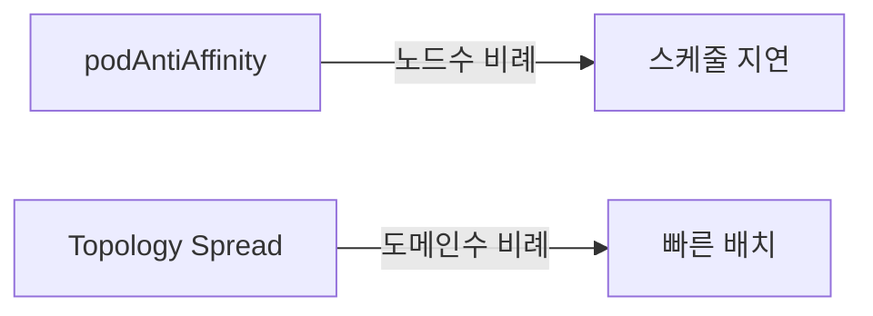

# Topology Spread

**Topology Spread Constraints**는 Pod을 존·노드·랙 같은 **토폴로지 도메인**에
**고르게 분산**시키는 스케줄링 규칙이다. `podAntiAffinity`의 "같은 도메인에
있어도 되는지 아닌지"를 훨씬 더 정교한 **skew(편차) 제어**로 확장한다.

`podAntiAffinity`가 수백 노드 이상 클러스터에서 **스케줄 지연의 주범**이
되는 이유와 같은 문제를 해결하기 위해 도입됐다. 결과적으로 **대규모
클러스터에선 Topology Spread가 사실상 표준**.

이 글은 `maxSkew`·`topologyKey`·`whenUnsatisfiable`·`minDomains`·
`nodeAffinityPolicy`·`nodeTaintsPolicy`·`matchLabelKeys`의 **전체 스펙**,
클러스터 기본 constraint 설정, podAntiAffinity와의 언제 어느 것인가,
그리고 3-zone 클러스터 실전 시나리오를 다룬다.

> 관련: [NodeSelector·Affinity](./node-selector-affinity.md) · [Taint·Toleration](./taint-toleration.md)
> · [Priority·Preemption](./priority-preemption.md) · [Scheduler 내부](./scheduler-internals.md)

---

## 1. 왜 Topology Spread인가



### podAntiAffinity의 한계

- **"한 도메인에 하나만"** 강제 → 6 replica + 3 zone이면 **존당 2개까지만**
  강제하는 방법이 까다로움
- 분산은 되지만 **편차(skew) 보장은 없음** — 존 A에 5개·B에 1개가 가능
- **수백 노드 이상에서 성능 저하** (공식 권고: "수백 노드 이상 클러스터에서
  사용 권장하지 않음")

### Topology Spread의 개선

- **`maxSkew`**: "도메인 간 Pod 수 편차 <= N"
- `podAntiAffinity`보다 **연산 복잡도 낮음** — 도메인 수 기반
- `whenUnsatisfiable`로 하드·소프트 선택

---

## 2. 전체 스펙

```yaml
spec:
  topologySpreadConstraints:
  - maxSkew: 1                                     # 필수, > 0
    topologyKey: topology.kubernetes.io/zone      # 필수
    whenUnsatisfiable: DoNotSchedule              # 기본 DoNotSchedule
    labelSelector:                                # 누구를 셀지
      matchLabels: { app: web }
    matchLabelKeys:                               # Beta, 동적 라벨
    - pod-template-hash
    minDomains: 3                                 # Stable 1.30+
    nodeAffinityPolicy: Honor                     # Beta, 기본 Honor
    nodeTaintsPolicy: Honor                       # Beta, 기본 Ignore
```

### 필드별 요약

| 필드 | 상태 | 기본 | 의미 |
|---|:-:|---|---|
| `maxSkew` | Stable | — | 도메인 간 허용 최대 편차 |
| `topologyKey` | Stable | — | 도메인 경계(존·호스트 등) |
| `whenUnsatisfiable` | Stable | `DoNotSchedule` | 제약 불가 시 스케줄 여부 |
| `labelSelector` | Stable | all in ns | 세는 대상 Pod 지정 |
| `minDomains` | **Stable 1.30+** | 없음(=1) | 최소 도메인 수 강제 |
| `nodeAffinityPolicy` | **Stable 1.33+** | `Honor` | skew 계산 시 nodeAffinity 준수 |
| `nodeTaintsPolicy` | **Stable 1.33+** | `Ignore` | skew 계산 시 taint 준수 |
| `matchLabelKeys` | Beta(1.27+, 기본 on) | — | 동적 라벨 키 merge |

---

## 3. `maxSkew` — 동작 원리

### DoNotSchedule 모드

도메인 A, B, C가 있을 때 Pod 분포가 각각 (3, 2, 2) → 최소 2, 최대 3.
**skew = max - min = 1**.

- `maxSkew: 1`: **skew ≤ 1**인 노드에만 배치 → B·C로만
- `maxSkew: 2`: skew ≤ 2이면 어디든 가능 (현재 skew=1이니 A도 가능)

### ScheduleAnyway 모드

- skew 최소화하는 노드에 **우선** 배치하지만, 불가능하면 그냥 아무 데나
- **소프트** — scale-out 시 일시적 불균형 허용
- 스코어링 기반, Pending은 안 됨

### 예 — 3-zone 6 replica

```yaml
spec:
  replicas: 6
  template:
    spec:
      topologySpreadConstraints:
      - maxSkew: 1
        topologyKey: topology.kubernetes.io/zone
        whenUnsatisfiable: DoNotSchedule
        labelSelector:
          matchLabels: { app: web }
```

- 첫 Pod → 어느 zone이든 (skew 0)
- 이후 Pod들이 skew 1을 넘지 않게 순환 배치
- 최종 (2, 2, 2)

---

## 4. `minDomains` — 적은 도메인일 때 과분산 방지

**문제**: zone 2개만 살아 있는데 3-replica를 배포:
- `maxSkew: 1` + `DoNotSchedule`로만 두면 **적은 도메인에서 skew 계산**이
  오작동해 집중 배치가 일어날 수 있다

### 공식 동작

```
global_minimum = min over eligible domains of matching Pod count
```

- 도메인이 적으면 global_minimum이 **0이 되는 케이스**가 생겨 분산이 깨짐

### minDomains 사용

```yaml
minDomains: 3
whenUnsatisfiable: DoNotSchedule   # minDomains는 DoNotSchedule에서만 유효
```

- 가용 도메인 수가 `minDomains`보다 적으면 **global_minimum = 0으로 간주**
- 3-zone이 있어야 하는데 2-zone만 살아 있으면 **스케줄 실패 → Pending**
- DR·HA 설계에서 **"2 zone에 한꺼번에 몰리는" 사고 방지**

**1.25 도입, 1.30 Stable**. `whenUnsatisfiable: DoNotSchedule`에서만 동작.

---

## 5. `nodeAffinityPolicy`·`nodeTaintsPolicy`

**1.26 Alpha → 1.27 Beta → 1.33 Stable**. "어느 노드를 **eligible domain**
으로 셀 것인가"를 결정.

### 문제

- Pod에 `nodeAffinity: os=linux`가 있다고 가정
- Windows 노드가 있는 zone-C도 "도메인"에 포함되면 skew 계산이 오염
- 결과: zone-C에 스케줄 불가능한데 "여기에 더 배치해야 skew 맞음"

### 해결

| 필드 | 기본 | 의미 |
|---|---|---|
| `nodeAffinityPolicy` | **`Honor`** | nodeAffinity·nodeSelector 매치하는 노드만 도메인 |
| `nodeTaintsPolicy` | **`Ignore`** | taint 무시(기본). `Honor`로 설정 시 toleration 없는 노드 제외 |

**권장 세팅**:
```yaml
nodeAffinityPolicy: Honor     # 기본
nodeTaintsPolicy: Honor       # 전용 노드 제외 — 권장 변경
```

GPU·rook-ceph 전용 노드가 섞인 클러스터에서 `nodeTaintsPolicy: Ignore`로
두면 skew 계산이 틀어져 일반 워크로드가 이상하게 배치됨.

---

## 6. `matchLabelKeys` — 버전별 분산

문제: 새 Deployment revision이 배포되는 중에는 `labelSelector: app=web`이
**구버전 + 신버전 Pod을 모두** 계산에 포함 → rollout 중 잘못된 skew.

### `matchLabelKeys` 해법

```yaml
topologySpreadConstraints:
- maxSkew: 1
  topologyKey: kubernetes.io/hostname
  labelSelector:
    matchLabels: { app: web }
  matchLabelKeys:
  - pod-template-hash    # revision마다 달라지는 hash
```

- 결과: **같은 revision끼리만 skew 계산**
- 동작 방식 (버전별):
  - ~1.33: **스케줄러가 런타임에** Pod의 키값을 읽어 selector에 덧붙여 평가
  - **1.34+**: **kube-apiserver가 Pod admission 시점에 selector를 rewrite** —
    `kubectl describe pod`에서 실제 merged selector가 보임 (관측 가능한 차이)
- **1.27 Beta, 기본 활성**(`MatchLabelKeysInPodTopologySpread`)
- Feature gate `MatchLabelKeysInPodTopologySpreadSelectorMerge`로 1.34 동작
  전환

`matchLabelKeys`는 **모든 `topologyKey`에서 동작** — zone·hostname·
커스텀 모두 가능.

---

## 7. 클러스터 기본 constraint

모든 워크로드에 명시하지 않고도 기본 분산을 걸려면 **KubeSchedulerConfiguration**.

```yaml
apiVersion: kubescheduler.config.k8s.io/v1
kind: KubeSchedulerConfiguration
profiles:
- pluginConfig:
  - name: PodTopologySpread
    args:
      defaultConstraints:
      - maxSkew: 3
        topologyKey: topology.kubernetes.io/zone
        whenUnsatisfiable: ScheduleAnyway
      - maxSkew: 5
        topologyKey: kubernetes.io/hostname
        whenUnsatisfiable: ScheduleAnyway
```

- Pod이 명시하지 않으면 이 기본값 적용
- **`defaultingType: List`(기본)**: 사용자 설정 `defaultConstraints`만 적용
- **`defaultingType: SystemDefault`**: Kubernetes 빌트인 기본값 자동 적용

### SystemDefault 빌트인 기본값 (두 개)

```yaml
defaultConstraints:
- maxSkew: 3
  topologyKey: kubernetes.io/hostname
  whenUnsatisfiable: ScheduleAnyway
- maxSkew: 5
  topologyKey: topology.kubernetes.io/zone
  whenUnsatisfiable: ScheduleAnyway
```

**함정**: 기본이 `List`이므로 `SystemDefault`로 바꾸지 않으면 클러스터에
자동 spread가 걸리지 않는다. "기본으로 분산될 것"이라 착각하지 말 것.

---

## 8. podAntiAffinity vs Topology Spread

| 기준 | podAntiAffinity | Topology Spread |
|---|---|---|
| 표현력 | "한 도메인에 있으면 안 됨" | "도메인 간 편차 ≤ N" |
| 소프트 옵션 | `preferred` | `ScheduleAnyway` |
| 계산 복잡도 | 노드수·매칭 Pod수 곱 — 대규모 저하 | 도메인 수 기반 — 빠름 |
| 최소 도메인 강제 | 불가 | `minDomains` |
| 버전별 분산 | 직접 라벨 관리 | `matchLabelKeys`(Beta) |
| **대규모(수백 노드+) 권장** | ❌ | ✅ |

**결론**: 신규 워크로드는 **기본적으로 Topology Spread**. podAntiAffinity는
"같은 노드에 절대 두 개 두지 마" 같은 **엄격 조건**에만 사용.

---

## 9. 전형적 시나리오

### 시나리오 A: 3-zone에 replica 균등 분산

```yaml
topologySpreadConstraints:
- maxSkew: 1
  topologyKey: topology.kubernetes.io/zone
  whenUnsatisfiable: DoNotSchedule
  minDomains: 3               # 3 zone 미만이면 Pending — 과집중 방지 엄격 모드
  labelSelector: { matchLabels: { app: api } }
- maxSkew: 1
  topologyKey: kubernetes.io/hostname
  whenUnsatisfiable: ScheduleAnyway
  labelSelector: { matchLabels: { app: api } }
```

두 레벨 제약:
- **zone**: 반드시 3존 균등 (`DoNotSchedule`)
- **node**: 가능하면 노드 분산 (`ScheduleAnyway`)

### 시나리오 B: 노드 장애 시 재배치 허용

```yaml
topologySpreadConstraints:
- maxSkew: 2
  topologyKey: topology.kubernetes.io/zone
  whenUnsatisfiable: ScheduleAnyway
```

- 3-zone 중 1-zone 장애 → 2-zone에 몰려도 복구 작업 우선

### 시나리오 C: HPA scale-out 시 skew 관리

```yaml
topologySpreadConstraints:
- maxSkew: 1
  topologyKey: topology.kubernetes.io/zone
  whenUnsatisfiable: ScheduleAnyway
  labelSelector: { matchLabels: { app: web } }
  matchLabelKeys: [pod-template-hash]   # 새 revision만 계산
```

- HPA가 10→20으로 늘릴 때 기존 10개 + 새 10개가 각자 skew 1 만족
- 롤아웃 중에도 혼선 없음

### 시나리오 D: GPU·전용 노드 혼재 클러스터

```yaml
# nodeAffinity로 CPU 노드만 선택 (생략)
topologySpreadConstraints:
- maxSkew: 1
  topologyKey: topology.kubernetes.io/zone
  nodeAffinityPolicy: Honor       # CPU 노드만 도메인
  nodeTaintsPolicy: Honor         # 전용 taint 있는 노드 제외
```

혼재 환경에서 "내가 갈 수 있는 노드"만 고려해 skew 계산.

---

## 10. 온프레미스 랙·전원 도메인 매핑

온프레미스는 `zone` 라벨의 의미가 조직마다 다르다:

| 배포 패턴 | zone 라벨 매핑 |
|---|---|
| 단일 DC, 랙 여러 개 | `zone` = 랙 번호 |
| 2 DC, DC마다 랙 여러 개 | `zone` = DC, `rack` = 커스텀 키 |
| 전원/냉각 도메인 | `zone` = 전원 계통 번호 |
| 엣지/HA Pair | `zone` = HA group |

`topology.kubernetes.io/zone`은 **단일 도메인 하나**로 쓰므로, 랙·전원까지
제약하려면 **커스텀 라벨 + 추가 `topologySpreadConstraints`**:

```yaml
topologySpreadConstraints:
- maxSkew: 1
  topologyKey: topology.kubernetes.io/zone      # DC
- maxSkew: 2
  topologyKey: rack                             # 커스텀
- maxSkew: 3
  topologyKey: kubernetes.io/hostname           # 노드
```

---

## 11. Cluster Autoscaler·Karpenter와의 상호작용

Topology Spread는 **신규 스케줄 시점에만 평가**한다. 이는 두 가지 중요한
함의를 낳는다:

### 오토스케일러가 zone을 못 살리는 함정

`DoNotSchedule` + `minDomains`로 3-zone 엄격 분산을 걸면, 특정 zone에
**스케줄 가능한 노드가 없을 때** Pod이 Pending.

- Cluster Autoscaler는 "Pending Pod의 스펙을 시뮬레이션해 노드를 추가"하지만,
  **topology 분산 요구를 정확히 이해 못하면 잘못된 zone에 노드를 추가**해
  Pending 해소 실패
- Karpenter는 topology spread를 더 잘 이해하지만 여전히 복잡 constraint에선
  경계 케이스 존재
- 실무 대응: `ScheduleAnyway`로 두고 Pending 방지 또는 **오토스케일러
  대응 zone 추가 경로 확인**

### 기존 Pod에는 작용 안 함

이미 배치된 Pod은 **spread 변경 시 재배치되지 않는다**. zone을 새로 추가해도
신규 Pod부터만 그 zone으로 간다.

→ 재분산은 **Descheduler**의 `RemovePodsViolatingTopologySpreadConstraint`
전략이 필요. 상세는 [Descheduler](https://github.com/kubernetes-sigs/descheduler)

### PDB와의 연관

Topology Spread로 zone 분산을 해두지 않으면 **PDB `maxUnavailable`이 한 zone
장애에 대해 무의미**해진다. 예: replica 6 모두 zone-A에 있으면 zone-A 장애
시 PDB와 관계없이 100% 다운.

→ Topology Spread(zone 분산) + PDB를 **세트로 설계**. 상세는 `reliability/`.

---

## 12. 안티패턴

| 안티패턴 | 결과 | 대안 |
|---|---|---|
| 수천 Pod에 `podAntiAffinity required` | 스케줄 지연 | **Topology Spread** |
| `maxSkew: 1` + `DoNotSchedule` + 도메인 적음 | 스케줄 실패 | `minDomains` 명시 또는 `ScheduleAnyway` |
| `labelSelector` 없이 기본 | **네임스페이스 전 Pod**을 계산 → 의도 불명 | 반드시 명시 |
| rollout 중 skew 깨짐 | `labelSelector`만 쓰면 두 revision 포함 | `matchLabelKeys: [pod-template-hash]` |
| GPU/전용 노드 혼재 + `nodeTaintsPolicy: Ignore`(기본) | skew 계산 오염 | **`Honor`로 변경** |
| node 단위만 spread | zone 장애에 취약 | zone + node 2단 제약 |
| `whenUnsatisfiable: DoNotSchedule` 남용 | scale-out·장애 시 Pending | 대부분 상황은 `ScheduleAnyway` |
| `PodTopologySpread` 플러그인 끔 | 클러스터 전체 분산 기본값 사라짐 | 기본 활성 유지 |
| 너무 많은 constraint(5개 이상) | 스케줄러 성능 저하 | 꼭 필요한 레벨만 |
| `matchLabelKeys`에 너무 많은 키 | selector 복잡도 | 1~2개(revision·tenant 등) |

---

## 13. 프로덕션 체크리스트

- [ ] **수백 노드 이상** 클러스터의 신규 워크로드는 **Topology Spread 기본**
- [ ] zone 라벨이 노드에 올바로 붙어 있는지(`topology.kubernetes.io/zone`)
- [ ] 온프레미스는 zone 의미를 팀에 명문화(랙·DC·전원)
- [ ] 중요 서비스는 **2단 제약**(zone + node)
- [ ] `minDomains`로 존 축소 시 Pending 허용 여부 결정
- [ ] `matchLabelKeys: [pod-template-hash]`로 rollout skew 관리
- [ ] `nodeTaintsPolicy: Honor`(기본 Ignore)로 변경 — 혼재 클러스터 필수
- [ ] KubeSchedulerConfiguration에 **클러스터 기본 constraint** 설정
- [ ] `scheduler_scheduling_attempt_duration_seconds_p99`·`FailedScheduling` 알람
- [ ] 대규모 podAntiAffinity 잔재를 Topology Spread로 마이그레이션 계획
- [ ] **PDB와 zone 분산 세트**: zone Topology Spread 없이 PDB만으로 HA 기대 금지
- [ ] Cluster Autoscaler/Karpenter가 topology-aware로 zone 노드 추가 가능한지 검증
- [ ] 재분산 필요 시 **Descheduler** 도입 검토
- [ ] StatefulSet + `DoNotSchedule`은 순서적 Pending 이슈 확인 필요

---

## 14. 트러블슈팅

| 증상 | 근본 원인 | 진단·조치 |
|---|---|---|
| `FailedScheduling: node(s) didn't match pod topology spread` | `DoNotSchedule` + skew 조건 | `ScheduleAnyway` 또는 `maxSkew` 상향 |
| 한 zone에만 Pod이 몰림 | `matchLabelKeys`·`labelSelector` 범위 확인 | selector 명시 |
| rollout 중 skew 깨짐 | labelSelector가 두 revision 포함 | `matchLabelKeys: [pod-template-hash]` |
| minDomains 설정했는데 2-zone에 몰림 | `minDomains` → `DoNotSchedule`과만 조합 | `whenUnsatisfiable: DoNotSchedule` 확인 |
| GPU 노드에 Pod 안 가야 하는데 skew 틀림 | `nodeTaintsPolicy: Ignore`(기본) | `Honor`로 변경 |
| zone 1개 추가했는데 재배치 안 됨 | Topology Spread는 **신규 스케줄만** 영향 | Descheduler의 TopologySpread 전략 |
| 스케줄 지연 급증 | constraint 4~5개 이상 | 불필요한 단계 제거 |
| `default-constraints` 적용 안 됨 | Pod에 명시적 constraint 있으면 기본값 무시 | 필요 시 직접 병합 |

### 자주 쓰는 명령

```bash
# zone 라벨 확인
kubectl get nodes -L topology.kubernetes.io/zone

# Pod이 실제로 어느 zone에 있는지
kubectl get pods -o wide -l app=web -o json \
  | jq -r '.items[] | .spec.nodeName' \
  | while read n; do kubectl get node "$n" -o jsonpath='{.metadata.labels.topology\.kubernetes\.io/zone}{"\n"}'; done

# topologySpreadConstraints 보기
kubectl get pod <name> -o jsonpath='{.spec.topologySpreadConstraints}' | jq

# 스케줄러 설정
kubectl get cm -n kube-system kube-scheduler -o yaml

# 재분산 — Descheduler
kubectl -n kube-system get deploy descheduler
```

---

## 15. 이 카테고리의 경계

- **Topology Spread 자체** → 이 글
- **NodeSelector/nodeAffinity/podAffinity·podAntiAffinity** → [NodeSelector·Affinity](./node-selector-affinity.md)
- **Taint·Toleration** → [Taint·Toleration](./taint-toleration.md)
- **PriorityClass·Preemption** → [Priority·Preemption](./priority-preemption.md)
- **Scheduler 플러그인·`KubeSchedulerConfiguration` 상세** → [Scheduler 내부](./scheduler-internals.md)
- **Descheduler**(기존 Pod 재분산) → `scheduling/` 확장
- **HA·DR 설계**(다중 리전·PDB 조합) → `sre/` · `reliability/`

---

## 참고 자료

- [Kubernetes — Pod Topology Spread Constraints](https://kubernetes.io/docs/concepts/scheduling-eviction/topology-spread-constraints/)
- [KEP-3022 — minDomains in PodTopologySpread](https://github.com/kubernetes/enhancements/tree/master/keps/sig-scheduling/3022-min-domains-in-pod-topology-spread)
- [KEP-3094 — nodeAffinityPolicy, nodeTaintsPolicy](https://github.com/kubernetes/enhancements/tree/master/keps/sig-scheduling/3094-pod-topology-spread-respect-node-taints)
- [KEP-3243 — matchLabelKeys in PodTopologySpread](https://github.com/kubernetes/enhancements/tree/master/keps/sig-scheduling/3243-respect-pod-topology-spread-after-rolling-upgrade)
- [Kubernetes — KubeSchedulerConfiguration](https://kubernetes.io/docs/reference/scheduling/config/)
- [Descheduler](https://github.com/kubernetes-sigs/descheduler)

(최종 확인: 2026-04-22)
