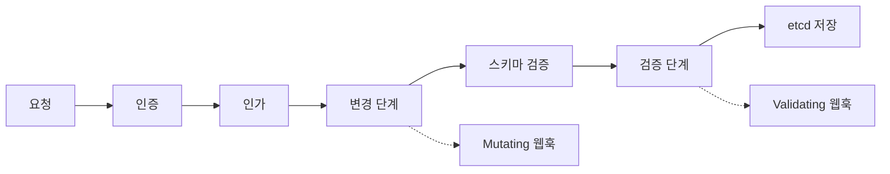
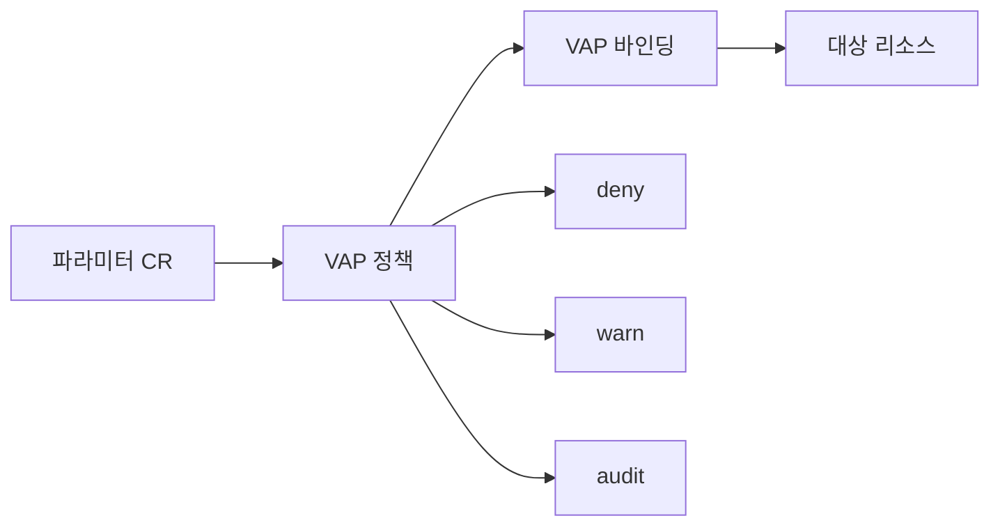

# Admission Controllers

Admission Controller는 **인증·인가가 끝난 후, etcd에 저장되기 전**에
요청을 가로채는 코드다. 값을 바꾸거나(mutating) 요청을 거절한다
(validating). 쿠버네티스 보안·거버넌스의 최전선이다.

운영 관점 핵심 질문은 여섯 가지다.

1. **요청이 어떤 순서로 거쳐 가는가** — mutating → schema → validating
2. **어떤 내장 컨트롤러가 켜져 있는가** — 1.36 기본 활성 목록
3. **정책을 웹훅으로 구현할까, CEL로 구현할까** — VAP·MAP vs Webhook
4. **웹훅은 왜 컨트롤 플레인 장애를 일으키나** — timeout·failurePolicy
5. **Mutating webhook 순서는 믿을 수 있나** — reinvocation 정책
6. **정책이 배포 전에 잘 작동하는지 어떻게 확인하나** — dry-run·warn·audit

> 관련: [Pod Security Admission](./pod-security-admission.md)
> · [RBAC](./rbac.md) · [Audit Logging](./audit-logging.md)
> · [Cluster Hardening](./cluster-hardening.md)

---

## 1. 요청 흐름과 admission 위치



두 가지가 핵심이다.

- **읽기(get·list·watch)는 admission을 거치지 않는다**. CREATE·UPDATE·
  DELETE·`connect` 같은 동사만 간섭한다.
- **Mutating 단계 전체가 끝난 후 schema validation**이 한 번 돌고,
  그 다음 **Validating 단계**가 실행된다. 따라서 Validating 쪽은
  mutating이 완료된 객체를 본다. "왜 다른 객체가 보이지"의 대부분은
  앞 단계 mutating webhook이 값을 바꿨기 때문이다.

---

## 2. 내장 Admission Controller

내장 컨트롤러는 apiserver 바이너리에 컴파일돼 있다. `--enable-admission-
plugins`·`--disable-admission-plugins`로만 켜고 끈다.

### 1.36 기본 활성

```
CertificateApproval, CertificateSigning, CertificateSubjectRestriction,
DefaultIngressClass, DefaultStorageClass, DefaultTolerationSeconds,
LimitRanger, MutatingAdmissionWebhook, NamespaceLifecycle,
PersistentVolumeClaimResize, PodSecurity, Priority, ResourceQuota,
RuntimeClass, ServiceAccount, StorageObjectInUseProtection,
TaintNodesByCondition, ValidatingAdmissionPolicy, ValidatingAdmissionWebhook
```

### 핵심 컨트롤러 빠르게 훑기

| 컨트롤러 | 단계 | 역할 |
|----------|------|------|
| `NamespaceLifecycle` | V | Terminating 네임스페이스에 생성 차단, `default` 삭제 방지 |
| `ServiceAccount` | M | SA·projected 토큰 자동 주입 |
| `LimitRanger` | M/V | 네임스페이스 Request/Limit 기본값·범위 |
| `ResourceQuota` | V | 네임스페이스 쿼터 강제 |
| `PodSecurity` | V | PSA 라벨 기반 강제 |
| `DefaultStorageClass` | M | PVC에 기본 SC 주입 |
| `DefaultTolerationSeconds` | M | NoExecute taint 기본 톨러런스 |
| `Priority` | M | 기본 PriorityClass 주입 |
| `RuntimeClass` | V | RuntimeClass 참조 유효성 |
| `TaintNodesByCondition` | M | 노드 condition 기반 자동 taint |
| `StorageObjectInUseProtection` | V | 사용 중 PV·PVC 삭제 차단 |
| `CertificateApproval`·`CertificateSigning`·`CertificateSubjectRestriction` | V | CSR 권한·서브젝트 제약 |
| `MutatingAdmissionWebhook`·`ValidatingAdmissionWebhook` | M/V | 외부 웹훅 호출 |
| `ValidatingAdmissionPolicy` | V | VAP CEL 실행 |

> `M` = mutating, `V` = validating. `NodeRestriction`은 기본 활성이 아니
> 지만 kubeadm·관리형은 대개 켠다. 자세한 하드닝은
> [Cluster Hardening](./cluster-hardening.md).

### Deprecated·위험 플러그인

- `AlwaysAdmit`·`AlwaysDeny`: 테스트 전용. 프로덕션 금지.
- `NamespaceExists`·`NamespaceAutoProvision`: `NamespaceLifecycle`로 대체.
- `ImagePolicyWebhook`: 고수준 대안(VAP, Sigstore 서명 검증)이 더 안전.
  공급망 보안 정책은 `security/` 카테고리에서 다룬다.

### 활성·비활성 예

```bash
kube-apiserver \
  --enable-admission-plugins=NodeRestriction,EventRateLimit \
  --disable-admission-plugins=AlwaysAdmit,AlwaysDeny
```

`EventRateLimit`·`ImagePolicyWebhook`·`PodSecurity`처럼 **구성 파일이
필요한 플러그인**은 `--admission-control-config-file`로 함께 지정한다.

```yaml
# /etc/kubernetes/admission-config.yaml
apiVersion: apiserver.config.k8s.io/v1
kind: AdmissionConfiguration
plugins:
  - name: EventRateLimit
    path: /etc/kubernetes/event-rate-limit.yaml
  - name: PodSecurity
    configuration:
      apiVersion: pod-security.admission.config.k8s.io/v1
      kind: PodSecurityConfiguration
      defaults:
        enforce: baseline
        enforce-version: latest
      exemptions:
        namespaces: [kube-system]
```

```yaml
# /etc/kubernetes/event-rate-limit.yaml
apiVersion: eventratelimit.admission.k8s.io/v1alpha1
kind: Configuration
limits:
  - type: Namespace
    qps: 50
    burst: 100
    cacheSize: 2000
```

### 매니지드 쿠버네티스에서의 제약

EKS·GKE·AKS는 **`--enable-admission-plugins` 직접 변경을 막는다**.
Autopilot(GKE)·Fargate(EKS) 등 제약이 가장 강한 환경은 세트 고정이라
내장 플러그인 튜닝은 불가. 대신 **VAP·웹훅 등 쿠버네티스 API 상의
확장점**을 쓴다. 버전별 허용 플러그인 목록은 관리형 제공자 문서를 확인.

---

## 3. Dynamic Admission — Webhook

외부 서비스가 정책을 구현한다. 두 리소스로 등록한다.

- `ValidatingWebhookConfiguration`
- `MutatingWebhookConfiguration`

이 웹훅들을 실행하는 내장 admission controller는 각각
`ValidatingAdmissionWebhook`·`MutatingAdmissionWebhook`이다. 둘 다 기본
활성이지만 **등록 리소스가 없으면 아무 것도 호출하지 않는다**.

### 최소 ValidatingWebhookConfiguration

```yaml
apiVersion: admissionregistration.k8s.io/v1
kind: ValidatingWebhookConfiguration
metadata:
  name: pod-policy.example.com
webhooks:
  - name: pod-policy.example.com
    rules:
      - apiGroups:   [""]
        apiVersions: ["v1"]
        operations:  ["CREATE", "UPDATE"]
        resources:   ["pods"]
        scope:       "Namespaced"
    clientConfig:
      service:
        namespace: policy-system
        name: pod-policy
        path: /validate
      caBundle: <BASE64 CA>
    admissionReviewVersions: ["v1"]
    sideEffects: None
    timeoutSeconds: 5
    failurePolicy: Fail
    matchPolicy: Equivalent
    namespaceSelector:
      matchExpressions:
        - key: kubernetes.io/metadata.name
          operator: NotIn
          values: [kube-system, policy-system]
```

### 핵심 필드

| 필드 | 의미 | 실무 팁 |
|------|------|---------|
| `failurePolicy` | 웹훅 실패 시 거절(`Fail`) 또는 허용(`Ignore`) | 보안 정책은 `Fail`, 비필수 변경 정책은 `Ignore` |
| `timeoutSeconds` | 웹훅 응답 대기(기본 10s) | 2~5s 권장. 길면 apiserver 전역 지연 |
| `sideEffects` | `None`·`NoneOnDryRun`·`Some`·`Unknown` | `None`이 표준. `Some`·`Unknown`이면 `--dry-run=server`에서 웹훅이 **건너뛰어진다** |
| `admissionReviewVersions` | 웹훅이 받는 요청 버전 | `["v1"]` 고정 |
| `matchPolicy` | `Exact` 또는 `Equivalent` | 새 API 버전 자동 적용 위해 `Equivalent`. 서브리소스 경로(`/status`, `/scale`)는 별도 rule 필요 |
| `reinvocationPolicy` | Mutating만. `Never`·`IfNeeded` | 다른 웹훅이 대상 필드를 바꿀 때 `IfNeeded` |
| `matchConditions` | CEL 사전 필터. 웹훅당 **최대 64개** | 빠른 거절로 웹훅 호출량 감소. CEL 평가 실패는 `failurePolicy` 적용 |
| `namespaceSelector` | 대상 네임스페이스 필터 | `kube-system` 제외 관례 |
| `objectSelector` | 라벨로 대상 제한 | opt-in 라벨 패턴 |

> **v1beta1 → v1 마이그레이션**: 1.22에서 `admissionregistration.k8s.io/
> v1beta1` MWC/VWC가 제거됐다. v1 전환 시 **기본값**이 달라진다.
> `failurePolicy` Ignore→Fail, `matchPolicy` Exact→Equivalent,
> `timeoutSeconds` 30→10, `sideEffects`·`admissionReviewVersions`는
> 필수. 오래된 오퍼레이터를 유지하는 팀은 필드별로 명시적으로 설정.

### AdmissionReview 요청·응답

```yaml
# 요청 (apiserver → webhook)
apiVersion: admission.k8s.io/v1
kind: AdmissionReview
request:
  uid: e911857d-...
  kind: {group: "", version: v1, kind: Pod}
  operation: CREATE
  userInfo: {username: "alice", groups: [...]}
  object: { ... Pod spec ... }
  oldObject: null
  dryRun: false
```

```yaml
# 응답 (webhook → apiserver)
apiVersion: admission.k8s.io/v1
kind: AdmissionReview
response:
  uid: e911857d-...          # 요청과 동일해야 함
  allowed: false
  status:
    code: 403
    message: "containers must define CPU limits"
```

Mutating 웹훅은 `patch`(base64 JSONPatch)와 `patchType: JSONPatch`를
추가한다.

### Mutating 웹훅 순서와 reinvocation

Mutating 웹훅은 **등록 순서**로 실행되지만 순서 자체에 의존하면 안 된다.
다른 웹훅이 객체를 변경했을 때 `reinvocationPolicy: IfNeeded` 웹훅은
**다시 호출될 수 있다**. 공식 스펙은 최소 한 번 추가 호출을 보장하지만
**상한은 명시하지 않는다**. 따라서 웹훅은 반드시 **idempotent**해야
한다. "이미 주입돼 있으면 또 주입하지 않는다"는 가드(`matchConditions`
또는 수동 체크)가 필수.

### CA Bundle·TLS

웹훅은 HTTPS만 받는다. 인증서 SAN은 반드시
`<service>.<namespace>.svc`를 포함해야 한다. `caBundle`은 PEM을 Base64
로 넣는다. `cert-manager`의 `CAInjector` 또는 operator가 자동 주입
하는 패턴이 표준이다.

---

## 4. Webhook의 운영 리스크

웹훅은 **컨트롤 플레인과 같은 신뢰 경계**다. 장애 시 영향이 크다.

| 실패 시나리오 | 증상 | 완화 |
|--------------|------|------|
| 웹훅 다운 + `failurePolicy: Fail` | 매칭 생성·변경 `500` | `timeoutSeconds` 짧게, HA·PDB, `namespaceSelector`로 `kube-system` 제외 |
| 웹훅 지연 | apiserver latency 증가 | `matchConditions` CEL로 호출 수 감소 |
| 웹훅이 자기 자신을 변경 | 데드락 | `objectSelector`로 본인 제외 |
| CA 만료 | TLS 핸드셰이크 실패 | `cert-manager` + 주기 회전, audit 알람 |
| 인증서 SAN 불일치 | `x509` 오류 | Service DNS와 일치시키고 자동 주입 |

**절대 설계 원칙**

1. 웹훅은 **무상태**에 가깝게. 외부 DB 쓰면 장애 전파 경로가 생긴다.
2. `kube-system`과 본인 네임스페이스는 **반드시 제외**. 복구 경로 막힘.
3. `matchConditions` CEL로 **1차 필터링**을 apiserver에서 수행해 웹훅
   호출 자체를 줄인다(1.28+ GA).

### 긴급 복구 런북

웹훅 장애로 apiserver가 `500`을 반복해 클러스터 생성·변경이 전부 막힌
상태에서의 표준 절차.

1. 현상 진단:
   `kubectl get validatingwebhookconfigurations,mutatingwebhookconfigurations`
2. 의심 웹훅 제거(되돌릴 수 있도록 먼저 YAML 덤프):
   `kubectl get validatingwebhookconfiguration <name> -o yaml > backup.yaml`
   → `kubectl delete validatingwebhookconfiguration <name>`
3. 또는 `failurePolicy`를 임시로 `Ignore`로 패치:
   `kubectl patch validatingwebhookconfiguration <name> -p '{"webhooks":[{"name":"<wh>","failurePolicy":"Ignore"}]}'`
4. 최후 수단: kube-apiserver의 `--disable-admission-plugins=Validating
   AdmissionWebhook,MutatingAdmissionWebhook` 임시 추가 후 복구.
   매니지드 환경은 이 단계 불가 → 3단계 패치가 유일한 경로.
5. 복구 후 **반드시 근본 원인**(CA 만료·웹훅 다운·CEL 비용 초과) 식별
   하고 [Audit Logging](./audit-logging.md) 기록과 함께 포스트모템으로
   정리.

---

## 5. Validating Admission Policy (VAP)

**1.30 GA**. apiserver 내부에서 CEL로 검증한다. 웹훅 없이 동작해 네트워크
홉·레이턴시·HA가 전부 사라진다.



### 기본 구성

```yaml
apiVersion: admissionregistration.k8s.io/v1
kind: ValidatingAdmissionPolicy
metadata:
  name: require-limits.example.com
spec:
  failurePolicy: Fail
  matchConstraints:
    resourceRules:
      - apiGroups: [""]
        apiVersions: ["v1"]
        operations: ["CREATE", "UPDATE"]
        resources: ["pods"]
  variables:
    - name: allContainers
      expression: "object.spec.containers + object.spec.initContainers.orValue([])"
  validations:
    - expression: |
        variables.allContainers.all(c,
          has(c.resources) && has(c.resources.limits) &&
          has(c.resources.limits.cpu) && has(c.resources.limits.memory))
      messageExpression: "'모든 컨테이너가 cpu memory limits를 선언해야 합니다'"
      reason: Invalid
  auditAnnotations:
    - key: "containers"
      valueExpression: "string(size(variables.allContainers))"
```

```yaml
apiVersion: admissionregistration.k8s.io/v1
kind: ValidatingAdmissionPolicyBinding
metadata:
  name: require-limits-prod
spec:
  policyName: require-limits.example.com
  validationActions: [Deny, Audit]
  matchResources:
    namespaceSelector:
      matchLabels:
        env: prod
```

### CEL에서 쓸 수 있는 변수

| 변수 | 내용 |
|------|------|
| `object` | 생성·갱신되는 객체 |
| `oldObject` | 이전 상태(UPDATE·DELETE) |
| `request` | AdmissionRequest 메타 |
| `namespaceObject` | 대상 네임스페이스 객체 |
| `params` | paramKind로 참조하는 파라미터 CR |
| `authorizer` | 다른 리소스 RBAC 체크(교차 검증) |
| `variables` | `spec.variables`로 composite 한 값 |

**authorizer 활용 예**: 요청자가 특정 Secret 조회 권한이 있는지 정책
안에서 교차 확인한다. Webhook을 호출하지 않고 네이티브로 가능한 VAP의
고유 장점.

```yaml
validations:
  - expression: |
      authorizer.group("").resource("secrets")
        .namespace(object.metadata.namespace)
        .name(object.spec.secretName)
        .check("get").allowed()
    message: "해당 Secret을 get할 권한이 없으면 참조할 수 없습니다"
```

### CEL Cost Budget

VAP·MAP 표현식은 apiserver의 **runtime cost budget** 안에서만 실행된다.
과도한 루프·대형 리스트 순회는 정책 자체가 거절되거나(static check)
실행 시 `cost limit exceeded`로 실패한다. 방어 방법:

- 스키마에 `maxItems`·`maxLength`가 정의된 타입은 CEL이 비용을 작게
  계산한다. CRD 파라미터는 항상 제한값을 선언한다.
- `variables`로 부분 결과를 재사용해 중복 계산을 피한다.
- `object.spec.containers.all(...)`처럼 전체 순회가 필요한 로직은
  이른 반환을 위해 `matchConditions`로 범위를 먼저 좁힌다.

### excludeResourceRules

큰 클러스터에서 특정 리소스만 정책 대상에서 빼야 할 때 사용한다.
`matchConstraints.excludeResourceRules`에 제외 규칙을 적으면 해당 리소
스는 정책이 적용되지 않는다(예: 감사 이벤트 자체는 검증 대상 제외).

### validationActions

- `Deny`: 거절
- `Warn`: HTTP `Warning` 헤더로 사용자에 경고
- `Audit`: audit event에 실패 기록

**조합 규칙**: `Deny`와 `Warn`은 중복 의미라 동시 사용 불가. `Deny +
Audit`, `Warn + Audit`은 **허용된 조합**이다. 롤아웃은
**`[Audit]` → `[Warn, Audit]` → `[Deny, Audit]`** 순이 안전하다. 감사
기록으로 위반 사례를 수집하고, 경고로 개발자에게 알린 뒤, 마지막에
차단한다.

### paramKind로 구성 분리

정책(로직)과 파라미터(값)를 분리한다.

```yaml
spec:
  paramKind:
    apiVersion: policy.example.com/v1
    kind: ReplicaLimit
  validations:
    - expression: "object.spec.replicas <= params.maxReplicas"
```

파라미터 리소스는 사내 CRD 또는 ConfigMap. 운영 중 값만 바꾸면 정책이
재배포 없이 반영된다.

### typeChecking

정책 생성 시 CEL 표현식의 타입이 검증된다. 잘못된 필드 참조는 즉시
경고된다. `kubectl describe validatingadmissionpolicy <name>`의
`status.typeChecking`에서 확인한다.

---

## 6. Mutating Admission Policy (MAP)

**v1.34 beta, v1.36 stable**. VAP의 mutating 대응. CEL로 변경을
표현하며, 웹훅 없이 in-process 실행된다.

### 두 가지 patch 타입

**ApplyConfiguration** (Server-Side Apply 머지):

```yaml
# 1.36+ GA. 1.34~1.35는 admissionregistration.k8s.io/v1beta1
apiVersion: admissionregistration.k8s.io/v1
kind: MutatingAdmissionPolicy
metadata:
  name: inject-sidecar.example.com
spec:
  matchConstraints:
    resourceRules:
      - apiGroups: [""]
        apiVersions: ["v1"]
        operations: ["CREATE"]
        resources: ["pods"]
  matchConditions:
    - name: no-sidecar-yet
      expression: "!object.spec.containers.exists(c, c.name == 'mesh-proxy')"
  reinvocationPolicy: IfNeeded
  mutations:
    - patchType: ApplyConfiguration
      applyConfiguration:
        expression: |
          Object{
            spec: Object.spec{
              containers: [
                Object.spec.containers{
                  name: "mesh-proxy",
                  image: "mesh/proxy:v1.20.0"
                }
              ]
            }
          }
```

**JSONPatch**:

```yaml
mutations:
  - patchType: JSONPatch
    jsonPatch:
      expression: |
        [
          JSONPatch{
            op: "add",
            path: "/metadata/labels/" + JSONPatch.escapeKey("example.com/injected-by"),
            value: "map"
          }
        ]
```

### VAP와의 설계 차이

| 항목 | VAP | MAP |
|------|-----|-----|
| 역할 | 거절 | 값 변경 |
| 출력 | allow·deny | JSONPatch 또는 ApplyConfig |
| Reinvocation | N/A | `IfNeeded`로 재평가 가능 |
| 안정 버전 | 1.30 | 1.36 |
| API 그룹 | `admissionregistration.k8s.io/v1` | `v1beta1`(1.34), `v1`(1.36) |

MAP는 **사이드카 주입, 라벨 보정, 기본값 주입** 같이 기존 Mutating
Webhook 용도(예: Istio·Linkerd·policy operator)의 상당수를 커버한다.
복잡한 외부 조회가 필요하면 여전히 Webhook이 낫다.

---

## 7. Webhook vs Policy (VAP/MAP)

선택 기준을 단순히 정리하면 다음과 같다.

| 요구 | 선택 |
|------|------|
| CEL로 표현되고 외부 상태 필요 없음 | VAP·MAP |
| apiserver 지연 민감 | VAP·MAP (in-process) |
| 외부 DB·이미지 스캐너 조회 필요 | Webhook |
| 복잡한 머지 로직, 여러 리소스 참조 | Webhook |
| 코드 없이 선언적으로 운영 | VAP·MAP |
| OPA Gatekeeper·Kyverno 이미 도입 | 기존 도구 유지 또는 VAP로 점진 이전 |

### 점진 이전 경로

1. 기존 Webhook과 동일 로직의 VAP를 `validationActions: [Warn, Audit]`
   로 먼저 배포.
2. 감사 로그와 경고에서 **동일 결과**인지 대조.
3. Webhook 쪽 `failurePolicy`를 `Ignore`로 내리고 VAP를 `Deny`로 올림.
4. Webhook 제거.

### 정책 엔진 현황

| 도구 | VAP·MAP 통합 | 특징 |
|------|-------------|------|
| **OPA Gatekeeper** v3.16+ | ConstraintTemplate → VAP 자동 생성 옵션 | Rego 기반, 장기 채택 조직에 자산 많음 |
| **Kyverno** 1.11+ | VAP·MAP 리소스 생성·관리 지원 | 비-CEL DSL. YAML 친화, 학습 곡선 낮음 |
| **VAP·MAP 네이티브** | 네이티브 | CEL만. 외부 컨트롤러·에이전트 불필요 |

업계 트렌드는 **"CEL로 표현 가능한 정책은 VAP, 복합 로직·외부 조회는
Gatekeeper·Kyverno"** 하이브리드 모델이다. 전면 교체보다 기존 엔진을
VAP 백엔드로 쓰며 선택적으로 전환하는 것이 안전하다. Rego는 표현력은
강하지만 학습 곡선이 높고, Kyverno DSL은 접근성은 좋지만 복잡한 로직
에서 CEL보다 장황해질 수 있다.

---

## 8. 디버깅과 검증

- **dry-run**: `kubectl apply --dry-run=server`로 실제 admission을 태워
  정책 반응을 본다. `sideEffects: None`·`NoneOnDryRun` 웹훅만 호출된다.
- **kubectl 경고**: `Warn` 액션은 HTTP `Warning` 헤더로 돌아와 kubectl
  출력에 노출된다. 사용자에게 도움말 제공 수단으로 유효.
- **audit 로그**: `Audit` 액션 또는 `auditAnnotations`는
  [Audit Logging](./audit-logging.md) 파이프라인으로 수집한다. 정책
  위반 추세를 본다.
- **metrics와 알람 임계**:

  | metric | 알람 임계 예 |
  |--------|-------------|
  | `apiserver_admission_webhook_admission_duration_seconds` p99 | `> 500ms` 1분 지속 |
  | `apiserver_admission_webhook_rejection_count` rate | 분당 평소 대비 `5x` 급증 |
  | `apiserver_admission_webhook_request_total{code="5xx"}` | 분당 `> 10` |
  | `apiserver_validating_admission_policy_check_total{enforcement_action="deny"}` | 평소 대비 급증 → 롤아웃 사고 감지 |
  | `apiserver_validating_admission_policy_definition_total{state="error"}` | `> 0` 즉시 알람 |

  웹훅 지연은 apiserver 전역 latency로 번지므로 p99 임계는 타이트하게
  잡는다. VAP 에러 상태(`state="error"`)는 **CEL 타입 체크 실패** 신호.

---

## 9. 운영 체크리스트

- [ ] **기본 활성 목록**이 의도와 일치하는지 점검. `kube-apiserver
  --help`와 실제 프로세스 인자 비교.
- [ ] `NodeRestriction` 활성 — kubelet이 본인 노드 외 노드 객체를
  수정하지 못하게.
- [ ] `AlwaysAdmit`·`AlwaysDeny` **불활성** 확인.
- [ ] Webhook은 `timeoutSeconds` ≤ 5s, `failurePolicy`는 보안 필수면
  `Fail`·부가 기능이면 `Ignore`.
- [ ] `namespaceSelector`로 `kube-system`·정책 자신의 네임스페이스 제외.
- [ ] `matchConditions` CEL로 **1차 필터링** — 웹훅 호출량 감소.
- [ ] CA bundle 자동 주입(`cert-manager CAInjector` 등)과 **인증서 만료
  모니터링**.
- [ ] Webhook HA — Deployment replicas ≥ 2, PDB, 노드 분산
  (topologySpreadConstraints).
- [ ] 신규 정책은 **`validationActions: [Audit, Warn]` → `[Deny]`**
  순으로 단계 롤아웃.
- [ ] VAP·MAP로 이전 가능한 Webhook 목록화. 정책 엔진(Gatekeeper·
  Kyverno)은 VAP 백엔드 활용 고려.
- [ ] `kubectl apply --dry-run=server`를 CI에 포함해 admission 정책
  위반을 머지 전에 포착.
- [ ] admission 관련 apiserver metric을 대시보드·알람에 포함 — 웹훅
  p99 ≤ 500ms, VAP `state="error"` 즉시 알람.
- [ ] VAP/MAP CEL 표현식은 `matchConstraints`로 범위를 좁히고 CRD 파라
  미터는 `maxItems`·`maxLength`로 비용 폭주 방어.
- [ ] 기존 webhook의 v1beta1 사용 여부 점검 — `failurePolicy`·
  `matchPolicy`·`timeoutSeconds`·`sideEffects` 기본값 차이 명시 설정.
- [ ] Webhook 긴급 복구 런북을 팀 위키에 등록하고 분기 1회 drill.

---

## 참고 자료

- Kubernetes 공식 — Admission Controllers Reference:
  https://kubernetes.io/docs/reference/access-authn-authz/admission-controllers/
- Kubernetes 공식 — Dynamic Admission Control:
  https://kubernetes.io/docs/reference/access-authn-authz/extensible-admission-controllers/
- Kubernetes 공식 — Validating Admission Policy:
  https://kubernetes.io/docs/reference/access-authn-authz/validating-admission-policy/
- Kubernetes 공식 — Mutating Admission Policy:
  https://kubernetes.io/docs/reference/access-authn-authz/mutating-admission-policy/
- Kubernetes Blog — VAP GA (1.30):
  https://kubernetes.io/blog/2024/04/24/validating-admission-policy-ga/
- KEP-3488 CEL for Admission Control:
  https://github.com/kubernetes/enhancements/tree/master/keps/sig-api-machinery/3488-cel-admission-control
- KEP-3962 Mutating Admission Policies:
  https://github.com/kubernetes/enhancements/tree/master/keps/sig-api-machinery/3962-mutating-admission-policies
- OPA Gatekeeper — VAP integration:
  https://open-policy-agent.github.io/gatekeeper/website/docs/validating-admission-policy/
- Kyverno — Mutating Policy docs:
  https://kyverno.io/docs/policy-types/mutating-policy/
- NSA/CISA Kubernetes Hardening Guide:
  https://media.defense.gov/2022/Aug/29/2003066362/-1/-1/0/CTR_KUBERNETES_HARDENING_GUIDANCE_1.2_20220829.PDF

확인 날짜: 2026-04-23
