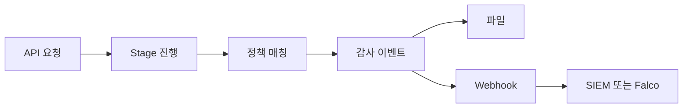
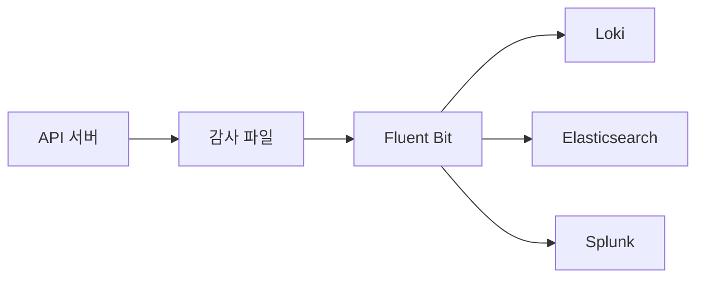

# Audit Logging

Audit Logging은 **API 서버를 거치는 모든 요청**을 정책에 따라 기록하는
기능이다. 보안 사고 조사·컴플라이언스(PCI, HIPAA, SOC2)·내부 거버넌스의
1차 데이터 소스이고, **누가·언제·무엇을·어디서·왜** 했는지를 답한다.

기본 동작: kube-apiserver는 별도 정책이 없으면 감사 로그를 **남기지
않는다**. 운영 클러스터에서는 Audit Policy + Backend(file 또는 webhook)
설정이 필수다.

운영 관점 핵심 질문은 다섯 가지다.

1. **무엇을 어느 깊이로 남기나** — 4개 level, 4개 stage
2. **노이즈를 어떻게 줄이나** — `omitStages`, 리소스·verb 매칭
3. **어디로 보내나** — file vs webhook, Fluent Bit, Loki, ES
4. **사고 조사에 충분한가** — 보안 핵심 어노테이션 활용
5. **볼륨·리텐션은 어떻게 관리하나**

> 관련: [RBAC](./rbac.md) · [ServiceAccount](./serviceaccount.md)
> · [Pod Security Admission](./pod-security-admission.md)
> · [Secret 암호화](./secret-encryption.md)
> · `observability/`(로그 파이프라인 일반은 별도)

---

## 1. 전체 흐름



| 단계 | 역할 |
|---|---|
| Request 수신 | API 서버가 인증·인가·admission을 거치며 4 stage 통과 |
| Policy 매칭 | 정책의 첫 매치 룰이 적용 |
| Event 생성 | level에 따라 메타데이터·요청 본문·응답 본문 포함 |
| Backend | 파일 또는 webhook으로 출력 |

---

## 2. Audit Policy 구조

```yaml
apiVersion: audit.k8s.io/v1
kind: Policy
omitStages:
  - RequestReceived           # 정책 전체 적용
omitManagedFields: true       # managedFields 제거 (v1.27+)
rules:
  - level: None               # 헬스체크는 무시
    nonResourceURLs: ["/healthz*", "/livez*", "/readyz*", "/version"]
  - level: RequestResponse    # 보안 핵심 리소스는 본문까지
    resources:
      - group: rbac.authorization.k8s.io
  - level: Metadata           # 그 외 모든 요청은 메타데이터만
```

| 필드 | 의미 |
|---|---|
| `omitStages` | 모든 룰에서 해당 stage 이벤트 생성 안 함 |
| `omitManagedFields` | `metadata.managedFields` 제거 (v1.27+, 노이즈 절감) |
| `rules` | **위에서부터 첫 매치**가 적용. 순서가 핵심 |

`--audit-policy-file=/etc/kubernetes/audit-policy.yaml` 플래그로 전달.

---

## 3. 4 Levels

| Level | 메타데이터 | 요청 본문 | 응답 본문 | 용도 |
|---|:-:|:-:|:-:|---|
| `None` | ✗ | ✗ | ✗ | 노이즈 무시 (헬스체크, 이벤트 폴링) |
| `Metadata` | ✓ | ✗ | ✗ | 일반 요청. 누가·뭘 했는지 |
| `Request` | ✓ | ✓ | ✗ | 변경 요청 본문 보존 |
| `RequestResponse` | ✓ | ✓ | ✓ | 가장 풍부. **민감 정보 포함 가능** |

원칙: **민감 데이터(`secrets`, `serviceaccounts/token`)에는 RequestResponse
금지**. 응답 본문에 평문 토큰·시크릿이 그대로 남는다. RBAC 변경, Pod 생성
등은 RequestResponse가 적합하다.

### Level 매트릭스 권장

| 리소스/이벤트 | 권장 level |
|---|---|
| `events` (`""`/`events.k8s.io`) | `None` (볼륨 폭주의 주범) |
| `nodes/status`, `pods/status` | `None` (kubelet/컨트롤러 폴링) |
| 헬스/메트릭 비리소스 URL | `None` |
| Secret, ConfigMap 본문 | **`Metadata`만** (요청 본문도 위험) |
| `serviceaccounts/token` | `Metadata` (요청 본문도 위험) |
| `rbac.authorization.k8s.io` 전체 | `RequestResponse` |
| `pods`·`deployments`·`statefulsets`·`daemonsets` 변경 | `Request` 이상 |
| `impersonate` 동사 | `Request` |
| 그 외 변경(`create/update/patch/delete`) | `Metadata` 이상 |
| 그 외 읽기(`get/list/watch`) | `None` 또는 `Metadata` |

---

## 4. 4 Stages

요청은 다음 stage들을 거치고, **각 stage마다** 별도 이벤트가 생성될 수
있다.

| Stage | 발생 시점 | 활용 |
|---|---|---|
| `RequestReceived` | 인증 직전. handler 진입 | 거의 항상 `omitStages`로 제외 (중복) |
| `ResponseStarted` | watch 같은 long-running 응답 시작 | watch의 시작 추적 |
| `ResponseComplete` | 응답 종료. **일반 요청의 표준 이벤트** | 대부분 분석 대상 |
| `Panic` | 핸들러 패닉 | 운영 사고 |

`omitStages`는 정책 전역 또는 룰별 지정 가능. **`RequestReceived`는 거의
항상 제외**해 볼륨을 줄인다.

```yaml
omitStages: ["RequestReceived"]
rules:
  - level: Metadata
    omitStages: ["ResponseStarted"]   # 룰 단위 추가 제외
```

---

## 5. 룰 매칭

```yaml
rules:
  - level: RequestResponse
    users: ["system:serviceaccount:ci:deployer"]
    userGroups: ["platform-admins"]
    verbs: ["create", "update", "patch", "delete"]
    resources:
      - group: ""
        resources: ["pods", "services"]
        resourceNames: ["frontend"]   # 특정 이름만
    namespaces: ["production"]
    omitStages: ["RequestReceived"]
```

| 필드 | 매칭 방식 |
|---|---|
| `users` / `userGroups` | OR |
| `verbs` | OR |
| `resources[]` | 하나라도 매치 |
| `namespaces` | OR |
| `nonResourceURLs` | URL prefix |

여러 필드가 함께 있으면 **AND**. 첫 매치 룰의 `level`이 적용된다.

---

## 6. Backend — Log file

```yaml
- --audit-policy-file=/etc/kubernetes/audit-policy.yaml
- --audit-log-path=/var/log/kubernetes/audit.log
- --audit-log-maxage=30        # 일
- --audit-log-maxbackup=10     # 회전 파일 개수
- --audit-log-maxsize=100      # MB
- --audit-log-format=json      # 또는 legacy
```

| 옵션 | 의미 |
|---|---|
| `--audit-log-path=-` | stdout (containerized API 서버에서 권장) |
| `--audit-log-format=json` | Loki·ES 호환 |
| `--audit-log-mode` | `blocking`(파일 기본), `blocking-strict`, `batch`(webhook 기본) |
| `--audit-log-batch-buffer-size`, `--audit-log-batch-max-size` | 배치 튜닝 |

**모드 트레이드오프**:
- `blocking` (파일 기본): 감사 기록 완료 후 응답. ResponseStarted/Complete
  실패는 요청에 영향
- `blocking-strict`: 추가로 RequestReceived 단계 실패도 요청을 거절 (가장
  엄격, 감사 누락 0)
- `batch` (webhook 기본): 비동기. 버퍼 가득 시 드롭 가능

CIS·NIST 권고는 **blocking 또는 blocking-strict**. 단 EBS 같은 느린 디스크
에서는 batch도 검토. 실패는 메트릭으로 모니터.

---

## 7. Backend — Webhook

```yaml
- --audit-policy-file=/etc/kubernetes/audit-policy.yaml
- --audit-webhook-config-file=/etc/kubernetes/audit-webhook.yaml
- --audit-webhook-mode=batch
- --audit-webhook-initial-backoff=10s
```

`audit-webhook.yaml`은 kubeconfig 형식으로, 외부 HTTP 엔드포인트
(SIEM·Falco·Splunk 등)를 가리킨다.

```yaml
apiVersion: v1
kind: Config
clusters:
  - name: siem
    cluster:
      server: https://audit.example.com/k8s
      certificate-authority: /etc/kubernetes/audit-ca.crt
contexts:
  - context:
      cluster: siem
      user: webhook
    name: ctx
current-context: ctx
users:
  - name: webhook
    user:
      client-certificate: /etc/kubernetes/audit.crt
      client-key: /etc/kubernetes/audit.key
```

webhook backend의 위험은 **외부 의존성**이다. 엔드포인트 다운 시 batch
모드는 버퍼링하지만 결국 드롭. file backend + 외부 forwarder 조합이 안전.

---

## 8. 보안 핵심 audit annotations

API 서버와 admission 컨트롤러는 이벤트의 `annotations`에 추가 정보를
붙인다. 사고 조사의 결정적 단서다.

### 인증 관련 (`authentication.kubernetes.io/*`)

| 어노테이션 | 의미 |
|---|---|
| `pod-name` | SA 토큰을 사용한 Pod 이름 (Bound token) |
| `pod-uid` | 동일 Pod UID |
| `node-name` | Pod이 스케줄된 노드 |
| `node-uid` | 노드 UID |
| `credential-id` | 인증 시점에 사용된 토큰의 JTI (v1.32 GA) |
| `issued-credential-id` | 토큰 발급 이벤트(`serviceaccounts/token` create)에 기록되는 새로 발급된 JTI |

> 두 키는 의미가 다르다. 탈취 토큰을 추적할 때 발급(`issued-credential-id`)
> ↔ 사용(`credential-id`)을 JTI로 조인해 전체 라이프사이클 복원.

이 5종은 **bound token 추적의 핵심**이다. 탈취된 토큰의 출처(어느 Pod·
어느 노드)를 정확히 식별. 자세한 토큰 모델은 [ServiceAccount](./serviceaccount.md) §6 참고.

### Admission·정책 관련

| 어노테이션 | 의미 |
|---|---|
| `pod-security.kubernetes.io/enforce-policy` | PSA 적용 레벨 |
| `pod-security.kubernetes.io/audit-violations` | PSA 위반 필드 |
| `pod-security.kubernetes.io/exempt` | PSA 면제 기준 |
| `mutation.webhook.admission.k8s.io/round_<n>_index_<i>` | 어떤 webhook이 변형했는가 |
| `validation.policy.admission.k8s.io/...` | ValidatingAdmissionPolicy 결과 |

### 인가·기타

| 어노테이션 | 의미 |
|---|---|
| `authorization.k8s.io/decision` | `allow` / `forbid` |
| `authorization.k8s.io/reason` | 인가 이유 (v1.34 GA Authorize with Selectors는 selector 정보 포함) |
| `apiserver.latency.k8s.io/etcd` | etcd 단계 지연 |

### Audit-ID 응답 헤더

API 서버는 모든 응답에 **`Audit-ID` HTTP 헤더**를 붙인다. 같은 ID가
audit 이벤트의 `auditID` 필드에 기록되어, 클라이언트 쪽 로그(예:
컨트롤러·CI 로그)에서 받은 ID로 클러스터 audit 이벤트를 1:1 추적 가능
하다.

```bash
kubectl get pods -v=8 2>&1 | grep -i audit-id
# Audit-Id: 8e0b6e76-7d2c-4b92-91c4-2b11c0ad5f7a
```

함정: `pods/exec`·`attach`·`portforward` 같은 upgrade 요청은 응답
헤더가 반환되지 않을 수 있다. Aggregated API 서버를 거치는 요청은
체인 상관관계가 형성되도록 동일 ID가 전파된다.

쿼리 시 이 키들로 인덱싱·필터링하면 SIEM에서 빠른 조사 가능.

---

## 9. 최소 권장 정책 (CIS·NSA 기반)

NSA/CISA Hardening Guide와 CIS Kubernetes Benchmark의 공통 권고를 정리한
출발점. 클러스터 특성에 맞춰 추가 조정.

```yaml
apiVersion: audit.k8s.io/v1
kind: Policy
omitStages: ["RequestReceived"]
omitManagedFields: true
rules:
  # 1. 노이즈 제거
  - level: None
    nonResourceURLs:
      - "/healthz*"
      - "/livez*"
      - "/readyz*"
      - "/metrics"
      - "/version"
      - "/openapi/*"
  - level: None
    resources:
      - group: ""
        resources: ["events"]
      - group: "events.k8s.io"
  - level: None
    users: ["system:kube-controller-manager", "system:kube-scheduler"]
    verbs: ["get", "list", "watch"]

  # 2. 인증·인가 변경 - 본문까지
  - level: RequestResponse
    resources:
      - group: rbac.authorization.k8s.io
      - group: authentication.k8s.io
      - group: certificates.k8s.io

  # 3. impersonate - 사칭 추적
  - level: Request
    verbs: ["impersonate"]

  # 4. 시크릿·토큰 - 메타데이터만
  - level: Metadata
    resources:
      - group: ""
        resources: ["secrets", "configmaps", "serviceaccounts/token"]

  # 5. 워크로드 변경 - 본문
  - level: Request
    verbs: ["create", "update", "patch", "delete"]
    resources:
      - group: ""
        resources: ["pods", "services", "namespaces"]
      - group: "apps"
      - group: "batch"
      - group: "networking.k8s.io"

  # 6. exec/portforward - 본문
  - level: RequestResponse
    resources:
      - group: ""
        resources: ["pods/exec", "pods/attach", "pods/portforward"]

  # 7. 그 외 변경 - 메타데이터
  - level: Metadata
    verbs: ["create", "update", "patch", "delete", "deletecollection"]

  # 8. 나머지 읽기 - 무시
  - level: None
    verbs: ["get", "list", "watch"]
```

순서 검증: 노이즈 제거 → 보안 핵심 → 변경 → 읽기 무시. 첫 매치 우선이라
구체 룰을 위에 둔다. 마지막 catch-all `level: None`이 없으면 어떤 룰에도
매칭되지 않은 이벤트가 **기본 동작인 None으로 처리**되지만, 명시 catch-all
은 정책의 의도를 분명히 하고 잘못된 룰 추가로 인한 누수를 방지한다.

### 정책 schema versioning

본 글의 예시는 `audit.k8s.io/v1`(현행 안정 API)이다. `v1alpha1`/`v1beta1`은
v1.13 이전에 제거됐다. 레거시 정책 파일이 있으면 `v1`로 마이그레이션.

### Dynamic Audit는 제거됨

`auditregistration.k8s.io/v1alpha1` AuditSink CR로 정책을 동적 적용하던
DynamicAuditing 기능은 **v1.19 deprecated, v1.22 제거**됐다. 현재는
**webhook backend가 표준**. 동적 정책 변경은 SIEM·forwarder 측에서 필터링
하는 것으로 대체.

---

## 10. 로그 파이프라인

### Fluent Bit + Loki/Elasticsearch

표준 패턴: API 서버는 `--audit-log-path=-`(stdout) 또는 호스트 경로에
파일로, **DaemonSet Fluent Bit**가 수집해 외부로 전송.



| 출력 | 특징 |
|---|---|
| Loki | 라벨 기반 인덱싱. 비용 효율, 풀텍스트 검색은 약함 |
| Elasticsearch | 풀텍스트 검색·집계 강력. 비용 큼 |
| Splunk | 엔터프라이즈 SIEM 표준. 라이선스 비용 |
| S3·GCS·Blob | 장기 보관 + Athena·BigQuery 분석 |

### 라벨 권장

Fluent Bit으로 다음 필드를 인덱싱 라벨로 추출:

- `verb`, `objectRef.resource`, `objectRef.namespace`
- `user.username`, `user.groups`
- `responseStatus.code`
- `annotations.authorization.k8s.io/decision`
- `annotations.authentication.kubernetes.io/credential-id`

너무 많은 라벨은 Loki 카디널리티 폭주를 부른다. **5~10개 핵심 라벨 + 본문
는 인덱스 외부**가 표준.

---

## 11. Falco 연계

[Falco](https://falco.org/)의 `k8saudit` plugin은 audit 이벤트를 실시간
스트림으로 받아 룰 기반 탐지를 수행한다.

| 연계 방법 | 동작 |
|---|---|
| Webhook backend → Falco HTTP endpoint | API 서버가 직접 푸시 |
| File backend + Falco file watcher | 회전 자동 처리 |

기본 룰셋 예시:
- `cluster-admin` 롤바인딩 생성 탐지
- `kubectl exec` 사용 탐지 (특정 네임스페이스)
- 비표준 시점의 Secret 대량 조회
- `system:anonymous` 사용 탐지

런타임 보안 도구(Falco, Tetragon) 자체의 운영은 `security/` 카테고리에서
다룬다.

---

## 12. 관리형 클러스터

| 환경 | 특징 |
|---|---|
| EKS | "Control plane logs" 옵션으로 CloudWatch에 송신. 송신 카테고리 선택 가능, 정책 파일 직접 교체는 불가 |
| GKE | Cloud Audit Logs로 자동 수집. Admin Activity는 무료, Data Access는 유료 |
| AKS | Azure Monitor의 `kube-audit`/`kube-audit-admin` 카테고리 선택 가능. 정책 파일 직접 교체는 불가 |

공통: **자체 정책 변경 불가**. 추가 컨텍스트가 필요하면 admission webhook
이나 정책 엔진의 자체 로그를 보강한다.

---

## 13. 운영 고려사항

### 볼륨 추정

대형 클러스터(노드 1000개, Pod 10000개)에서 모든 요청을 Metadata 레벨로
남기면 **하루 100GB+** 도 가능하다. 권장 정책으로 5~20GB 수준 압축 가능.

`apiserver_audit_event_total`, `apiserver_audit_requests_rejected_total`
메트릭으로 추세 모니터.

### 리텐션

| 데이터 | 권장 |
|---|---|
| 핫 (검색·대시보드) | 30~90일 (Loki/ES) |
| 콜드 (장기 보관) | **1년 이상** (S3 등 객체 스토리지) |
| 컴플라이언스 요구 | PCI 1년, HIPAA 6년 등 산업별 |

### 비식별화 필요?

Audit 본문에 사용자 이메일·내부 ID가 들어갈 수 있다. GDPR 적용 시
forwarder 단계에서 마스킹·해싱 필요. Fluent Bit `modify` 또는 `lua`
필터로 처리.

### 정책 변경 시 무중단

`--audit-policy-file`은 **재시작 시에만** 다시 읽는다. HA 구성에서 한 대씩
순차 재시작. SIGHUP·자동 reload는 미지원.

### 감사 누락 감지

`audit_event_drops_total`·`audit_requests_total` 격차를 모니터. 급증 시
batch 버퍼 부족이거나 webhook 다운.

---

## 14. 최근 변경 (v1.27 ~ v1.35)

| 버전 | 변경 | 영향 |
|---|---|---|
| v1.27 | `omitManagedFields` 정책 옵션 GA | `managedFields` 자동 제거로 노이즈 절감 |
| v1.32 GA | ServiceAccountTokenJTI(KEP-4193) | `authentication.kubernetes.io/credential-id`로 토큰 추적 |
| v1.32 GA | PodNodeInfo | `pod-name`·`pod-uid`·`node-name`·`node-uid` 어노테이션 자동 추가 |
| v1.34 GA | Authorize with Selectors(KEP-4601) | 셀렉터 기반 인가 결정이 audit에 반영 |
| v1.35 GA | WebSocket `create` 요구 | `pods/exec` 등의 audit 분석에서 verb 변화 감지 필요 |

---

## 15. 운영 체크리스트

**활성화**
- [ ] `--audit-policy-file` + backend 옵션이 모든 API 서버에 동일 적용
- [ ] `omitStages: [RequestReceived]` + `omitManagedFields: true` 적용
- [ ] `events`·`nodes/status` 등 노이즈 리소스가 `None`으로 차단됨

**보안 핵심**
- [ ] `rbac.authorization.k8s.io` 전체가 `RequestResponse`인가
- [ ] `secrets`·`serviceaccounts/token`은 `Metadata`만 (RequestResponse 금지)
- [ ] `pods/exec`·`attach`·`portforward`가 RequestResponse
- [ ] `impersonate` verb가 별도 룰로 캡처

**파이프라인**
- [ ] DaemonSet Fluent Bit 또는 동등 forwarder 운영
- [ ] 핵심 5종 어노테이션이 라벨로 추출됨
- [ ] 핫(30~90일) + 콜드(1년+) 2단 리텐션
- [ ] `audit_event_drops_total` 알람 구성

**거버넌스**
- [ ] 정책 변경 시 HA 순차 재시작 절차 문서화
- [ ] 비식별화 필요한 환경(GDPR)에서 마스킹 적용
- [ ] Falco·SIEM과 룰셋 동기화

---

## 16. 트러블슈팅

### 감사 로그가 비어 있다

- `--audit-policy-file` 미설정. kubelet에서 API 서버 매니페스트 확인
- 첫 매치 룰이 `None`이라 모든 요청이 무시. 룰 순서 점검
- `--audit-log-path` 디렉터리 권한 부족. API 서버 컨테이너의 hostPath
  쓰기 가능 여부 확인

### Secret 본문이 로그에 노출됐다

해당 룰 level이 `RequestResponse`인 상태. `secrets` 리소스는 `Metadata`만
사용. 이미 노출된 로그는 보존소에서 삭제 + 키 회전.

### 로그 볼륨 폭주

원인 후보:
- `events` 리소스가 `None`이 아님 → 즉시 차단
- watch 요청이 `Metadata` 이상으로 기록 → `verbs: ["watch"]`만 `None`
- managedFields 미제거 → `omitManagedFields: true`

```bash
# 가장 시끄러운 user/리소스 식별
jq -r '"\(.user.username) \(.objectRef.resource)"' audit.log \
  | sort | uniq -c | sort -rn | head
```

### Webhook backend가 자주 끊긴다

- batch 모드 + 외부 SIEM의 백프레셔 → backoff·재시도 튜닝
- 인증서 만료 → cert-manager로 자동 회전
- 네트워크 지연 → 노드 로컬 forwarder를 거치도록 변경

### 정책을 바꿨는데 반영 안 된다

API 서버는 재시작 시점에만 정책 파일을 읽는다. HA에서 한 대씩 순차
재시작. kubeadm은 매니페스트 수정으로 kubelet이 자동 재시작.

### 토큰 탈취 추적이 안 된다

`authentication.kubernetes.io/credential-id`(JTI)가 없다면 v1.32 미만이거나
ServiceAccount 토큰이 아닌 client cert 사용. JTI 기록은 v1.32+ 필수.

---

## 참고 자료

- [Auditing — Kubernetes](https://kubernetes.io/docs/tasks/debug/debug-cluster/audit/) — 2026-04-23 확인
- [Audit Annotations — Kubernetes](https://kubernetes.io/docs/reference/labels-annotations-taints/audit-annotations/) — 2026-04-23 확인
- [Authentication — Kubernetes](https://kubernetes.io/docs/reference/access-authn-authz/authentication/) — 2026-04-23 확인
- [NSA/CISA Kubernetes Hardening Guide](https://www.cisa.gov/news-events/cybersecurity-advisories/aa22-238a) — 2026-04-23 확인
- [CIS Kubernetes Benchmark](https://www.cisecurity.org/benchmark/kubernetes) — 2026-04-23 확인
- [Falco k8saudit plugin](https://github.com/falcosecurity/plugins/tree/main/plugins/k8saudit) — 2026-04-23 확인
- [Falco Kubernetes Audit Events](https://falco.org/docs/concepts/event-sources/plugins/kubernetes-audit/) — 2026-04-23 확인
- [Fluent Bit Loki output](https://docs.fluentbit.io/manual/data-pipeline/outputs/loki) — 2026-04-23 확인
- [GKE Cloud Audit Logs](https://cloud.google.com/kubernetes-engine/docs/concepts/audit-policy) — 2026-04-23 확인
- [EKS Control plane logs](https://docs.aws.amazon.com/eks/latest/userguide/control-plane-logs.html) — 2026-04-23 확인
- [AKS audit logs](https://learn.microsoft.com/en-us/azure/aks/monitor-aks) — 2026-04-23 확인
