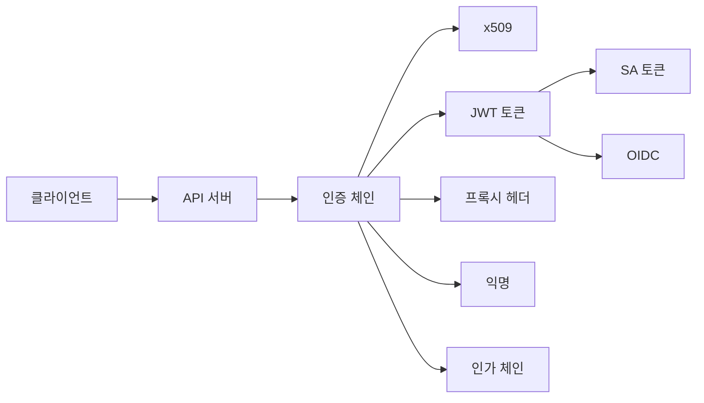
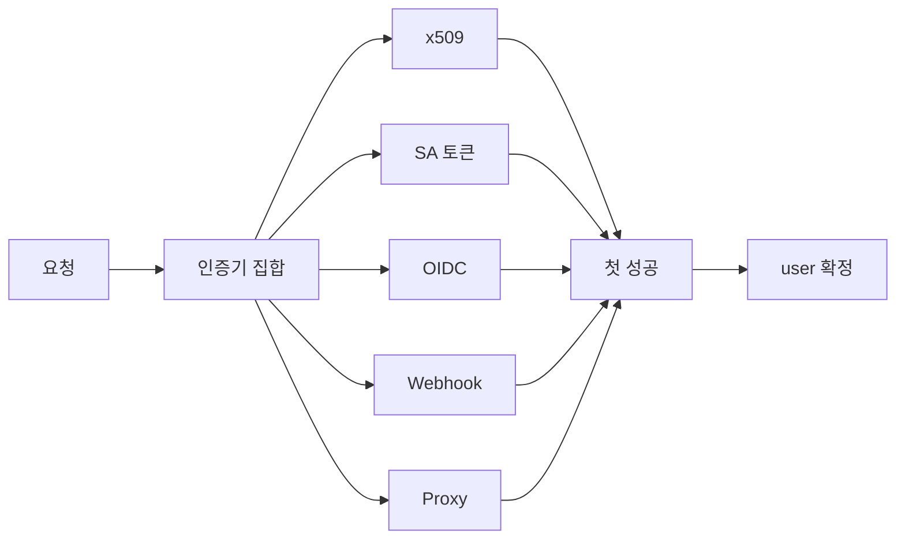
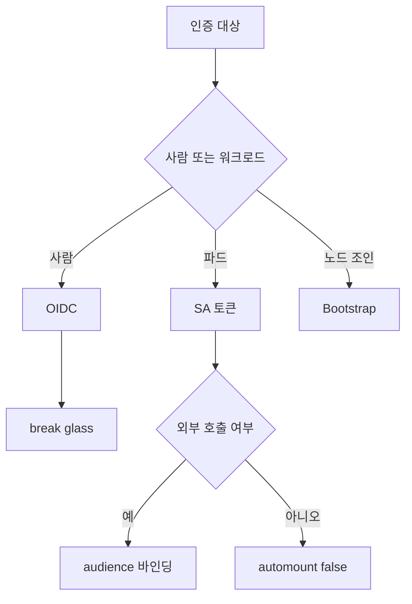

# Authentication

Authentication은 API 요청을 보낸 주체가 **누구인가**를 증명하는 단계다.
쿠버네티스는 주체를 직접 저장하지 않는다. 대신 여러 authenticator를
평가해서 하나라도 성공하면 주체(username·UID·groups·extra)를 확정하고,
이후 [RBAC](./rbac.md) 등 authorizer가 권한을 판정한다.

프로덕션에서 반복적으로 마주치는 질문은 여섯 가지다.

1. **사람 사용자는 어떻게 인증하는 게 표준인가** — OIDC + 구조화 설정
2. **x509 인증서는 왜 프로덕션 부적합인가** — 개별 취소 불가, 재발급 강제
3. **여러 IdP를 동시에 붙일 수 있는가** — Structured Authn(KEP-3331)로 가능
4. **익명 접근은 꺼야 하는가** — 엔드포인트 화이트리스트만 허용
5. **kubectl이 IdP 브라우저 플로우를 어떻게 태우는가** — exec credential plugin
6. **impersonation은 왜 필요한가** — 감사·디버깅·관리형 도구 delegation

> 관련: [RBAC](./rbac.md) · [ServiceAccount](./serviceaccount.md)
> · [Audit Logging](./audit-logging.md) · [Cluster Hardening](./cluster-hardening.md)

---

## 1. 전체 흐름



체인은 **단락 평가(short-circuit)** 다. 인증기 하나가 성공하면 뒤는
평가하지 않는다. 실행 순서는 **보장되지 않으므로** 동일 주체가 두
경로로 유효하면 약한 쪽이 먼저 성공할 수 있다(자세한 내용은 13장).
모두 실패하면 `401 Unauthorized`. `--anonymous-auth=true` 상태에서 모든
인증기가 실패한 경우만 `system:anonymous`로 내려간다.

---

## 2. 인증 전략 한눈에 보기

| 전략 | 주 대상 | 토큰 수명 | 취소 | 프로덕션 권장 |
|------|--------|-----------|------|---------------|
| x509 client cert | 클러스터 시스템·break-glass | CA 수명 | ❌ CA 재발급 필요 | 시스템 전용 |
| Static token file | 테스트·임시 | 영구 | ❌ | 금지 |
| Bootstrap token | 노드 조인 전용 | 짧게(24h 권장) | ✅ Secret 삭제 | 노드 조인만 |
| ServiceAccount (TokenRequest) | 파드·워크로드 | 기본 1h, bound | ✅ Pod 삭제 | 워크로드 표준 |
| OIDC (JWT Structured) | 사람 사용자 | IdP가 결정(~1h) | ✅ IdP에서 | 사용자 표준 |
| Webhook token | 커스텀 IdP | 웹훅 정책에 의존 | ✅ | 특수 환경 |
| Authenticating proxy | SSO 프록시 | 프록시가 관리 | ✅ | TLS 경로 신뢰 가능 시 |
| Anonymous | health·bootstrap | - | - | 화이트리스트만 |

워크로드 토큰은 [ServiceAccount](./serviceaccount.md)에서 자세히
다룬다. 본 글은 주로 **사람 사용자·외부 시스템** 관점을 다룬다.

**이미 제거·금지된 경로**: HTTP Basic Auth(`--basic-auth-file`)는 v1.19
부터 완전히 제거됐다. 현재 클러스터에서 `--token-auth-file`·
`--basic-auth-file` 플래그를 발견하면 즉시 제거한다.

---

## 3. x509 Client Certificates

API 서버에 `--client-ca-file=<CA>`로 등록한 CA가 서명한 인증서를 제출하면
`Subject` 의 `CN`이 username, `O`가 group으로 매핑된다.

```bash
kube-apiserver --client-ca-file=/etc/kubernetes/pki/ca.crt
```

| Subject 필드 | 값 | 인증 결과 |
|---|---|---|
| `CN` | `alice` | `username=alice` |
| `O` | `dev` | `groups` 에 추가 |
| `O` | `oncall` | `groups` 에 추가 |

### 왜 사람 사용자에 부적합한가

- **개별 취소 불가**: CRL·OCSP 미지원. 키 유출 시 **CA 재발급**이 유일한 차단.
- **감사 공백**: 발급 이력이 API 서버에 저장되지 않음.
- **그룹 불변**: 재발급하지 않으면 그룹 이동 불가.
- **중계 불가**: TLS terminating proxy(LB) 앞단에선 동작하지 않는다.
- **개인키 암호화 불가**: 파일 읽기 권한 = 전면 탈취.

### 여전히 필요한 용도

- kubelet → API server (클러스터 내부, CSR로 자동 발급·회전)
- Control plane 간 통신
- **break-glass admin**: IdP 장애 시 최후 수단, 오프라인 보관

단기 수명(수일)으로 발급하고 사용 후 CA 재발급으로 무효화하는 운영이
권장된다. [`cfssl`, `step-ca`, `cert-manager`]로 자동화한다.

**경계**: kubelet의 TLS bootstrap과 client/serving 인증서 자동 회전(CSR
API + `RotateKubeletClientCertificate`·`RotateKubeletServerCertificate`)은
[Cluster Hardening](./cluster-hardening.md)에서 다룬다. 본 글은 사람
사용자·외부 시스템 인증에 집중한다.

---

## 4. OIDC와 Structured Authentication Configuration

**현행 표준**: 사람 사용자 인증은 외부 OIDC IdP(Okta·Keycloak·Azure AD·
Google Workspace·Dex)로 위임한다.

### 레거시: `--oidc-*` 플래그

단일 IdP만 지원, 정적 설정, CLI 재시작 필요.

```bash
kube-apiserver \
  --oidc-issuer-url=https://issuer.example.com \
  --oidc-client-id=kubernetes \
  --oidc-username-claim=email \
  --oidc-groups-claim=groups \
  --oidc-ca-file=/etc/kubernetes/oidc-ca.crt
```

v1.30부터 beta, v1.34에서 `AuthenticationConfiguration`이 stable로
승격되면서 **Structured Authn**이 권장 경로가 됐다. `--oidc-*` 플래그와
`--authentication-config`는 **상호 배타**다. 둘 다 주면 apiserver가 즉시
종료한다.

### Structured Authentication Configuration (KEP-3331)

`--authentication-config=/etc/kubernetes/authn.yaml`로 파일을 지정한다.
파일 수정 시 **동적 리로드**, **여러 JWT 발급자**, **CEL 기반 claim
검증·매핑**을 지원한다.

`AuthenticationConfiguration`은 v1.34에서 `v1`으로 GA됐다. v1.30~1.33은
`v1beta1`을 써야 한다. 서명 알고리즘은 `RS256`·`RS384`·`RS512`·`ES256`·
`ES384`·`ES512`·`PS256`·`PS384`·`PS512`를 허용하며 `HS*`·`none`은 거부한다.

```yaml
apiVersion: apiserver.config.k8s.io/v1      # 1.34+ GA (1.30~1.33은 v1beta1)
kind: AuthenticationConfiguration
jwt:
  - issuer:
      url: https://issuer.corp.example.com
      audiences: [kubernetes]
      audienceMatchPolicy: MatchAny
    claimValidationRules:
      - expression: 'claims.email_verified == true'
        message: "email must be verified"
      - expression: '"k8s-users" in claims.groups'
        message: "must be in k8s-users group"
    claimMappings:
      username:
        expression: '"corp:" + claims.email'
      groups:
        expression: 'claims.groups.filter(g, g.startsWith("k8s-"))'
      uid:
        expression: 'claims.sub'
      extra:
        - key: 'corp.example.com/tenant'
          expression: 'claims.tenant'
    userValidationRules:
      - expression: "!user.username.startsWith('system:')"
        message: "username cannot use reserved system: prefix"
```

### 기능별 차이 요약

| 기능 | `--oidc-*` 플래그 | Structured Authn |
|------|------------------|------------------|
| IdP 개수 | 1개 | 다수 |
| 동적 리로드 | ❌ apiserver 재시작 | ✅ 파일 수정 시 자동 |
| Audience | 단일 | 다수 (`MatchAny`/`MatchAll`) |
| Claim 검증 | 단순 equality | CEL 표현식 |
| Claim 매핑 | 고정 claim | CEL로 조합·필터 |
| 사용자 검증 | ❌ | `userValidationRules` |
| Egress 제어 | ❌ | `issuer.egressSelectorType`(1.34+ beta) |
| 커스텀 discovery | ❌ | `issuer.discoveryURL` |

### CEL로 할 수 있는 것

**도메인 제한**:

```yaml
- expression: 'claims.hd == "example.com"'
  message: "hosted domain must be example.com"
```

**중첩 claim 추출**:

```yaml
username:
  expression: 'claims.contact.email'
```

**조건부 username**:

```yaml
username:
  expression: |
    claims.preferred_username != ""
      ? claims.preferred_username
      : claims.email
```

### Multi-IdP 운영 주의

여러 IdP 동시 운용 시 가장 큰 위험은 **주체 식별자 충돌**이다.

| 위험 | 완화 |
|------|------|
| 두 IdP가 동일 `email`·`sub` 발행 | `usernamePrefix` 지정, 또는 CEL로 `"okta:" + claims.email` |
| 탈취된 IdP가 `system:masters` 주장 | `userValidationRules`에서 `system:` prefix 금지 |
| 그룹명 우연 중복 | `groupsPrefix` 또는 CEL `filter`에 prefix 추가 |
| IdP별 감사 추적 불가 | username에 IdP 식별자 포함(`oidc:okta:`, `oidc:entra:`) |

### 동적 리로드 실패 관측

설정 파일을 잘못 수정해도 apiserver는 **이전 유효 설정을 유지**한다.
리로드 성공 여부는 다음 metric으로 감시한다.

- `apiserver_authentication_config_controller_automatic_reload_last_timestamp_seconds`
- `apiserver_authentication_config_controller_automatic_reload_last_success_timestamp_seconds`

두 값의 **gap이 벌어지면 설정이 깨진 상태로 방치**되고 있다는 신호다.

### Egress Selector (1.34+)

API 서버가 IdP 메타데이터·JWKS를 가져올 때 어떤 네트워크 경로를 쓰는지
제어한다. `controlplane`·`cluster` 두 값을 받는다. 사설 IdP를 VPC
내부에서 호스트하는 경우 `cluster`로 두면 프록시 우회 없이 접근한다.

```yaml
issuer:
  url: https://private-idp.internal
  egressSelectorType: cluster
```

---

## 5. ServiceAccount Token

파드 내부에서 API 서버를 부를 때 쓰는 표준. 자세한 내용은
[ServiceAccount](./serviceaccount.md)에 있다. 여기서는 인증 관점만
요약한다.

- **TokenRequest API**(v1.22 GA, v1.24부터 Secret 자동 생성 중단)로 발급
- Projected volume이 기본 **1h bound token**을 주입. kubelet은 TTL의
  **80% 또는 24h 경과** 시 자동 회전. 최소 TTL은 10분으로 강제된다.
- 애플리케이션은 파일을 **주기적으로 다시 읽어야** 한다. 오래 캐시한
  문자열 토큰은 만료 후 `401`을 받는다. 공식 SDK는 자동 재로드한다.
- API server가 **OIDC 발행자** 역할: 외부 시스템(Vault, 클라우드 IAM)이
  `/.well-known/openid-configuration`과 JWKS로 독립 검증 가능
- `audience`로 대상 수신자를 좁혀 replay 방지

```bash
kubectl create token my-sa --duration 1h --audience vault
```

파드가 **API 서버를 호출하지 않는다면** `automountServiceAccountToken:
false`로 토큰 마운트를 끈다. 기본값 `true`는 기본 설계상 편의를 위한
것이지 보안 관점의 권장이 아니다.

### Workload Identity 기반

이 메커니즘은 **AWS IRSA / EKS Pod Identity, GKE Workload Identity,
Azure Workload Identity, HashiCorp Vault Kubernetes JWT auth**의 공통
기반이다. 외부 IAM이 apiserver의 OIDC discovery를 통해 SA 토큰을
검증하고 단기 자격증명으로 교환한다.

### OIDC Discovery 노출 트레이드오프

apiserver의 discovery(`/.well-known/openid-configuration`)와 JWKS
(`/openid/v1/jwks`)를 **클러스터 외부**에서 접근하게 하려면, 기본적으로
`system:service-account-issuer-discovery` ClusterRole을
`system:unauthenticated`에 바인딩해야 한다. 이는 **서명 공개키(JWKS)를
인터넷에 노출**한다는 뜻이다. 공개키라 직접 위협은 아니지만, 공개 원치
않으면 **S3/GCS 등에 오프클러스터로 호스트**하는 IRSA·GKE WI 패턴이
표준이다. 자세한 구성은 [ServiceAccount](./serviceaccount.md) 참조.

---

## 6. Webhook Token Authentication

외부 시스템에 검증을 위임한다. apiserver가 `TokenReview` 요청을 웹훅에
보내고, 응답에서 `status.authenticated: true`와 `user` 정보를 받아 체인에
주입한다.

```bash
kube-apiserver \
  --authentication-token-webhook-config-file=/etc/k8s/authn-webhook.kubeconfig \
  --authentication-token-webhook-cache-ttl=2m \
  --authentication-token-webhook-version=v1
```

```yaml
# 요청 (apiserver → webhook)
apiVersion: authentication.k8s.io/v1
kind: TokenReview
spec:
  token: "<bearer token>"
  audiences: ["https://kubernetes.default.svc"]
```

```yaml
# 응답 (webhook → apiserver)
apiVersion: authentication.k8s.io/v1
kind: TokenReview
status:
  authenticated: true
  user:
    username: alice@example.com
    uid: "1001"
    groups: [developers, qa]
    extra:
      email: [alice@example.com]
  audiences: ["https://kubernetes.default.svc"]
```

**외부 컴포넌트가 토큰을 직접 검증**할 때도 같은 `TokenReview` API를
호출한다. 이 때 호출자에게 `system:auth-delegator` ClusterRole을
바인딩한다(예: API Gateway, kubelet 앞단 프록시).

**주의**

- `--authentication-token-webhook-cache-ttl`(기본 2m)은 **같은 토큰
  재검증 간격**이지 **장애 흡수 시간이 아니다**. 캐시 미스 요청은 웹훅
  응답 불능 시 즉시 `401`로 종료된다. 웹훅 장애 = 컨트롤 플레인 인증
  장애로 직결.
- 웹훅은 apiserver와 **동일 신뢰 경계**. 워크로드 노드와 격리해서 운영.
- 매니지드 쿠버네티스(EKS·GKE·AKS)는 대부분 **커스텀 webhook 금지**.
  이 경우 OIDC로 대체한다.

---

## 7. Bootstrap Token

노드가 처음 API 서버에 등록할 때(`kubeadm join`) 사용하는 단기 토큰.
`bootstrap-token-<id>` 이름의 Secret으로 `kube-system`에 저장된다.

```yaml
apiVersion: v1
kind: Secret
metadata:
  name: bootstrap-token-abcdef
  namespace: kube-system
type: bootstrap.kubernetes.io/token
stringData:
  token-id: abcdef
  token-secret: 0123456789abcdef
  expiration: "2026-04-24T00:00:00Z"
  usage-bootstrap-authentication: "true"
  usage-bootstrap-signing: "true"
  auth-extra-groups: "system:bootstrappers:kubeadm:default-node-token"
```

운영 원칙:

- **노드 조인 전용**. 사용자·워크로드 인증 금지.
- **수 시간** 수명. 조인 완료 후 Secret 삭제.
- 생성·폐기를 자동화(`kubeadm token create --ttl 1h`).
- 회전하지 않으면 만료된 토큰으로 조인 실패가 발생한다.

---

## 8. Authenticating Proxy (Front Proxy)

SSO 프록시(Dex, Pinniped, OAuth2-Proxy 등)가 인증 후 헤더로 주체를
전달한다. apiserver는 헤더를 **신뢰**한다. 따라서 **프록시와 apiserver
사이 TLS와 CA 검증이 절대 조건**이다.

```bash
kube-apiserver \
  --requestheader-client-ca-file=/etc/k8s/front-proxy-ca.crt \
  --requestheader-allowed-names=front-proxy-client \
  --requestheader-username-headers=X-Remote-User \
  --requestheader-group-headers=X-Remote-Group \
  --requestheader-extra-headers-prefix=X-Remote-Extra-
```

헤더 예:

```http
X-Remote-User: alice@example.com
X-Remote-Group: developers
X-Remote-Group: oncall
X-Remote-Extra-Email: alice@example.com
```

**함정**: 프록시 앞단에서 클라이언트가 `X-Remote-User`를 임의로 설정할
수 있으면 **신원 위조**가 된다. 반드시 프록시가 스트립·재설정하도록
구성한다.

이 메커니즘은 **aggregated API server**(metrics-server, custom
apiserver, KNative 등)가 요청을 검증하는 신뢰 사슬이기도 하다.
`kube-system/extension-apiserver-authentication` ConfigMap에 front proxy
CA와 client CA가 배포되며, aggregated apiserver들이 이를 읽어 신뢰 기준
으로 삼는다.

---

## 9. Anonymous Access

인증기 모두 실패 시 `system:anonymous` 사용자와 `system:unauthenticated`
그룹이 부여된다. 기본은 **enabled**(authorization mode가 `AlwaysAllow`가
아닐 때)지만 엔드포인트별 제어가 필요하다.

### 레거시 플래그

```bash
kube-apiserver --anonymous-auth=false
```

전면 off면 `/healthz`·`/livez`·`/readyz`가 인증 실패로 끊길 수 있다.
LB·모니터링이 이 경로에 자격 증명 없이 접근하는 경우가 많다.

### 1.34+ 구조화 설정

`AuthenticationConfiguration`에서 **허용 경로**만 화이트리스트한다.

```yaml
apiVersion: apiserver.config.k8s.io/v1
kind: AuthenticationConfiguration
anonymous:
  enabled: true
  conditions:
    - path: /livez
    - path: /readyz
    - path: /healthz
```

이 구성이면 `/api/v1/...`에 대한 익명 요청은 **RBAC이 허용하더라도**
인증 단계에서 차단된다. CIS Benchmark는 `--anonymous-auth=false` 또는
위 화이트리스트 구성을 요구한다.

**상호 배타**: `AuthenticationConfiguration.anonymous`를 쓰면
`--anonymous-auth` 플래그와 동시에 사용할 수 없다. 둘 다 주면 apiserver
기동 실패.

---

## 10. Impersonation

관리자가 다른 사용자·그룹으로 **가장**해 동작을 수행한다. 감사 로그에는
원 사용자와 가장 대상이 모두 남는다.

```bash
kubectl --as=jane --as-group=developers get pods
```

API 직접 호출:

```http
GET /api/v1/namespaces/default/pods
Impersonate-User: jane
Impersonate-Group: developers
Impersonate-Extra-email: jane@example.com
```

사용자가 impersonate 하려면 RBAC에서 `impersonate` verb 권한을 받아야
한다. 과도하면 **권한 상승**으로 이어진다. 대개 플랫폼 운영자·SRE만
가진다.

```yaml
apiVersion: rbac.authorization.k8s.io/v1
kind: ClusterRole
metadata:
  name: user-impersonator
rules:
  - apiGroups: [""]
    resources: ["users", "groups", "serviceaccounts"]
    verbs: ["impersonate"]
```

관리형 콘솔(Lens·Rancher·Pinniped)이 내부적으로 impersonation을 사용하는
경우가 많다. 감사 로그에서 `user`(원 사용자)와 `impersonatedUser`(가장
대상) 필드 차이를 반드시 추적한다.

---

## 11. client-go Credential Plugin (Exec)

kubectl이 IdP 토큰을 **동적으로** 가져오는 메커니즘. OIDC authorization
code flow·디바이스 코드·클라우드 IAM 서명 등 apiserver가 직접 구현하지
않는 것을 kubeconfig 밖에서 처리한다.

```yaml
# ~/.kube/config
users:
  - name: alice-oidc
    user:
      exec:
        apiVersion: client.authentication.k8s.io/v1
        command: kubelogin
        args:
          - get-token
          - --oidc-issuer-url=https://issuer.example.com
          - --oidc-client-id=kubernetes
          - --oidc-extra-scope=groups
        interactiveMode: IfAvailable
```

플러그인은 `ExecCredential` JSON을 stdout으로 내놓는다.

```json
{
  "apiVersion": "client.authentication.k8s.io/v1",
  "kind": "ExecCredential",
  "status": {
    "expirationTimestamp": "2026-04-23T21:00:00Z",
    "token": "eyJhbGciOi..."
  }
}
```

대표 도구:

| 도구 | 용도 |
|------|------|
| `kubelogin` (int128/kubelogin) | 표준 OIDC 플러그인, kubectl oidc-login |
| `aws-iam-authenticator`, `aws eks get-token` | AWS EKS |
| `gke-gcloud-auth-plugin` | GKE (1.26+ 필수) |
| `kubelogin` (Azure/kubelogin) | AKS |
| Pinniped CLI | 엔터프라이즈 SSO — Concierge+Supervisor+CLI 3-tier, 매니지드 K8s에서 OIDC 주입 표준 |

**보안 주의**

- kubeconfig의 `exec.command`는 **임의 바이너리를 실행**한다. 신뢰할 수
  없는 소스에서 받은 kubeconfig를 그대로 사용하면 RCE로 이어진다.
  `command` 경로와 `installHint`를 반드시 검토한다.
- CI/CD 환경은 반드시 `interactiveMode: Never`. 프롬프트가 떠 파이프
  라인이 무한 대기하는 사고가 자주 난다.
- `provideClusterInfo: true`는 apiserver CA 등 클러스터 정보를 플러그인
  에 전달한다. 플러그인 신뢰도가 전제 조건.

---

## 12. 진단 — SelfSubjectReview

"내가 지금 누구로 인증돼 있나"를 확인하는 표준 API. v1.28 GA된
`authentication.k8s.io/v1 SelfSubjectReview`를 `kubectl auth whoami`가
감싼다. Structured Authn CEL 매핑이 의도대로 들어갔는지 검증하는 1차
도구다.

```bash
kubectl auth whoami -o yaml
```

```yaml
apiVersion: authentication.k8s.io/v1
kind: SelfSubjectReview
status:
  userInfo:
    username: "oidc:okta:alice@corp.example.com"
    uid: "00u1234abcd"
    groups:
      - "k8s-developers"
      - "system:authenticated"
    extra:
      corp.example.com/tenant:
        - "platform"
```

트러블슈팅 첫 단계는 대부분 이 명령어다. `username`이 예상한 prefix로
오는지, `groups`에 의도한 IdP 그룹이 들어오는지, `extra`에 CEL 매핑한
클레임이 남는지 확인한다.

---

## 13. 인증기 평가 순서와 체인 설계

설정된 인증기가 **병렬로 시도**되고, **첫 성공이 곧 결과**다. 모두
실패하면 (익명이 켜져 있을 경우) `system:anonymous`로 내려간다.



> **공식 문서는 인증기 실행 순서를 보장하지 않는다.** 동일 주체가
> 두 경로(예: x509 + OIDC)로 동시에 유효하면 "약한 쪽이 먼저 성공"해
> 강한 쪽에 건 정책을 우회할 수 있다. 한 사람은 **한 인증 방법**으로
> 통일하는 것이 권장 운영이다. 모두 실패하면 익명으로 내려간다(익명이
> 켜져 있을 때).

실무 원칙:

- 사람 사용자는 OIDC 하나로. x509는 break-glass 전용으로 격리.
- 여러 JWT 발급자를 쓰면 서로 다른 `usernamePrefix`로 식별 분리.
- RBAC 바인딩은 확정된 `username`·`groups` 기준이므로, prefix·CEL 매핑
  결과가 곧 보안 경계다.

---

## 14. 전략 선택 가이드



| 시나리오 | 권장 |
|---------|------|
| 사람 개발자·SRE | OIDC (Structured Authn) + RBAC |
| 플랫폼 운영자·관리 콘솔 | OIDC + `impersonate` 권한 |
| break-glass (IdP 장애) | 오프라인 보관 단기 x509 |
| 파드 → apiserver | SA TokenRequest (projected) |
| 파드 → Vault·AWS·GCP | SA 토큰 + audience + Workload Identity |
| 노드 조인 | Bootstrap token (ttl ≤ 24h) |
| CI/CD | SA + TokenRequest, GitHub OIDC → STS |
| 매니지드 K8s 사용자 | 클라우드 IAM exec plugin |

---

## 15. Break-glass 운영

IdP 장애로 OIDC 경로가 막혔을 때 대비한 **최후 수단**.

- **오프라인 보관**: x509 client cert + key는 HSM·금고·관리자별 분할
  보관. 온라인 시스템에 상시 배포 금지.
- **수명 단축**: 발급 시 수일 단위, 사용 후 **CA 재발급**으로 무효화.
- **자동 알림**: 사용 즉시 audit 로그 트리거 → Slack/PagerDuty로
  security on-call에 통보.
- **권한 격리**: `system:masters` 같은 초광범위 그룹은 piercing용
  한정, 일상 운영은 RBAC 바인딩된 운영자 그룹으로.
- **분기 drill**: 분기 1회 복구 훈련. 보관 경로·비밀번호·인증서 유효성을
  실제로 확인한다.

---

## 16. 운영 체크리스트

- [ ] **OIDC**가 사람 사용자 표준 경로. `--oidc-*`보다 Structured Authn
  (`--authentication-config`)을 쓴다.
- [ ] 레거시 **Static token file**, `--basic-auth-file`(1.19 제거),
  HTTP Basic 금지. 발견 즉시 제거.
- [ ] **Anonymous**는 헬스 엔드포인트만 `AuthenticationConfiguration.
  anonymous.conditions`로 허용(1.34+), 나머지 차단.
- [ ] **x509 사용자 인증** 제거. 남아 있다면 break-glass만, 수명 단축.
- [ ] **Bootstrap token**은 노드 조인 후 즉시 삭제. 24h 이상 금지.
- [ ] `automountServiceAccountToken: false`를 API 호출 없는 파드의 기본.
- [ ] 새 토큰은 **audience bound**로 발급, 외부 시스템은 audience로 수신.
- [ ] `kubectl auth whoami`(1.28 GA)로 주체가 의도대로 매핑되는지 확인.
- [ ] 여러 IdP 운영 시 **prefix 분리**와 `userValidationRules`로 `system:`
  예약어 방어. 동일 사용자를 두 경로로 인증 가능하지 않게 제한.
- [ ] `AuthenticationConfiguration` 리로드 성공 metric(`...last_success_
  timestamp_seconds`)이 최근 수정 시각과 gap이 없는지 관측.
- [ ] **impersonate** 권한은 명시적 운영자 그룹만. 감사 로그에서 원·대상
  사용자 항상 확인.
- [ ] Authenticating proxy 사용 시 `--requestheader-allowed-names`로
  허용 CN 고정, 프록시 앞단에서 `X-Remote-*` 헤더를 스트립.
- [ ] 웹훅 인증기는 HA로 띄우고, `--authentication-token-webhook-cache-
  ttl`을 조정해 장애 흡수.
- [ ] apiserver `kube-apiserver` 프로세스에서 `--token-auth-file`,
  `--basic-auth-file`(deprecated·제거됨) 플래그가 없는지 `kube-bench` 등
  으로 점검.

---

## 참고 자료

- Kubernetes 공식 — Authenticating:
  https://kubernetes.io/docs/reference/access-authn-authz/authentication/
- Kubernetes 공식 — Hardening: Authentication Mechanisms:
  https://kubernetes.io/docs/concepts/security/hardening-guide/authentication-mechanisms/
- KEP-3331 Structured Authentication Configuration:
  https://github.com/kubernetes/enhancements/issues/3331
- Kubernetes Blog — 1.30 Structured Authentication Beta:
  https://kubernetes.io/blog/2024/04/25/structured-authentication-moves-to-beta/
- Kubernetes v1.34 Release Notes — Of Wind & Will:
  https://kubernetes.io/blog/2025/08/27/kubernetes-v1-34-release/
- CIS Kubernetes Benchmark (최신):
  https://www.cisecurity.org/benchmark/kubernetes
- NSA/CISA Kubernetes Hardening Guide:
  https://media.defense.gov/2022/Aug/29/2003066362/-1/-1/0/CTR_KUBERNETES_HARDENING_GUIDANCE_1.2_20220829.PDF
- Microsoft Open Source Blog — Practical guide for Structured Authn:
  https://opensource.microsoft.com/blog/2025/05/08/jwt-it-like-its-hot-a-practical-guide-for-kubernetes-structured-authentication/
- Datadog Security Labs — K8s Security Fundamentals: Authentication:
  https://securitylabs.datadoghq.com/articles/kubernetes-security-fundamentals-part-3/

확인 날짜: 2026-04-23
