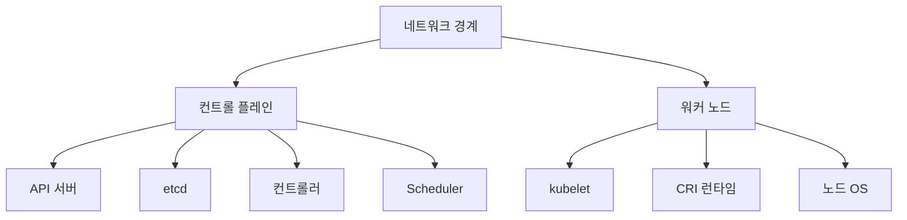

# Cluster Hardening

Cluster hardening은 **"API 서버·etcd·kubelet·노드 OS·네트워크 경계를
공식 벤치마크 기준으로 잠그는 작업"** 이다. 여기서 "공식"은 두 가지다.

- **CIS Kubernetes Benchmark** (현 시점 v1.12.0, 정기 업데이트)
- **NSA/CISA Kubernetes Hardening Guide** (v1.2)

운영 관점 핵심 질문은 일곱 가지다.

1. **어떤 플래그를 먼저 봐야 하나** — kube-apiserver·kubelet·etcd 우선
2. **CIS가 요구하는 게 뭐지** — Level 1·Level 2 구분
3. **관리형은 뭐를 내가 못 건드리지** — EKS·GKE·AKS 각 허용 범위
4. **API Server 외의 우회 경로는 뭐가 있나** — kubelet API·etcd·런타임
5. **어떻게 지속 검증하나** — kube-bench CI + 정책 엔진
6. **무엇이 노드 수준에서 중요한가** — seccomp·AppArmor·/proc 접근
7. **인증서와 비밀키는 어떻게 돌리나** — TLS bootstrapping + 자동 회전

> 관련: [Authentication](./authentication.md) · [RBAC](./rbac.md)
> · [Audit Logging](./audit-logging.md)
> · [Secret 암호화](./secret-encryption.md)
> · [Admission Controllers](./admission-controllers.md)
> · [Pod Security Admission](./pod-security-admission.md)

---

## 1. 하드닝 레이어



각 레이어를 독립적으로 잠근다. 하나가 뚫려도 다음 레이어가 피해를
제한하는 **defense-in-depth** 원칙이다. 쿠버네티스는 API 서버 외에도
공격 경로(`kubelet` API, `etcd`, 런타임 소켓, debug 엔드포인트)가
여럿이라 이 위협을 모두 다룬다.

---

## 2. API Server 플래그 필수 세트

구성은 크게 **인증·인가·감사·암호화·네트워크**다. 실제 배포는
kubeadm·관리형 사업자가 세팅하지만, 무엇이 설정돼 있는지는 반드시
검증한다.

### 필수 플래그

| 플래그 | 값 | 의도 |
|--------|----|----|
| `--anonymous-auth` | `false` (또는 `AuthenticationConfiguration.anonymous` 화이트리스트) | 익명 접근 차단 |
| `--authorization-mode` | `Node,RBAC` 최소 | 인가 체인 |
| `--enable-admission-plugins` | `NodeRestriction` 포함 | kubelet이 타 노드 수정 금지 |
| `--encryption-provider-config` | EncryptionConfiguration 파일 경로 | etcd 저장 시 암호화 |
| `--encryption-provider-config-automatic-reload` | `true` | 키 회전 시 재기동 불필요 |
| `--audit-policy-file` | 정책 파일 경로 | audit 로그 활성 |
| `--audit-log-path` | 로그 파일 | audit 로그 수집 |
| `--tls-cert-file`·`--tls-private-key-file` | HTTPS 인증서 | 평문 API 금지 |
| `--tls-min-version` | `VersionTLS12` 이상 | 오래된 TLS 차단 |
| `--client-ca-file` | CA | mTLS 클라이언트 검증 |
| `--kubelet-certificate-authority` | kubelet CA | kubelet 요청 검증 |
| `--profiling` | `false` | `/debug/pprof` 비활성 |
| `--service-account-lookup` | `true` | 삭제된 SA 토큰 무효화. 1.7+ 기본값, CIS 감사 시 명시 확인 |
| `--service-account-key-file`·`--service-account-signing-key-file` | 별도 키 | SA 토큰 서명 분리 |
| `--kubelet-client-certificate`·`--kubelet-client-key` | 파일 경로 | API 서버가 kubelet 호출 시 mTLS (CIS 1.2.4·1.2.5) |
| `--kubelet-https` | `true` | 기본값이지만 명시 확인 |

### 인증·인가 상호 배타 규칙

- `--oidc-*`와 `--authentication-config`는 배타. Structured Authn 도입
  시 flag는 제거. 자세한 내용은 [Authentication](./authentication.md).
- `--anonymous-auth` flag와 `AuthenticationConfiguration.anonymous`는
  배타. 1.34+는 후자 권장.

```yaml
# /etc/kubernetes/authn.yaml
apiVersion: apiserver.config.k8s.io/v1
kind: AuthenticationConfiguration
anonymous:
  enabled: true
  conditions:
    - path: /livez
    - path: /readyz
    - path: /healthz
```

이렇게 설정하면 health 엔드포인트에만 익명 접근이 허용되고 다른 경로
는 RBAC이 허용해도 인증 단계에서 차단된다. 자세한 내용은
[Authentication](./authentication.md).

### 느슨한 값 금지 목록

| 피해야 할 설정 | 이유 |
|---------------|------|
| `--insecure-port != 0` | 평문 포트 노출. 1.20+에서 제거됐으나 레거시 주의 |
| `--token-auth-file` | Static token, 회전 불가 |
| `--basic-auth-file` | 1.19에서 제거 |
| `--authorization-mode=AlwaysAllow` | 모든 요청 허용 |

---

## 3. etcd 하드닝

etcd를 쓰는 주체에 **쓰기 권한**이 있으면 곧 클러스터 루트 권한이다.
Secret·RBAC·Node 객체 전부 여기 담겨 있기 때문이다.

### 필수 설정

- **mTLS**: client(`--client-cert-auth=true`, `--trusted-ca-file`)와
  peer(`--peer-client-cert-auth`, `--peer-trusted-ca-file`) 모두.
- **별도 CA**: API 서버·client·peer에 서로 다른 CA 사용(trust 축소).
- **네트워크 격리**: `2379/tcp`(client)·`2380/tcp`(peer)를 방화벽으로
  **control plane IP만** 허용. 어떤 워크로드도 직접 접근 금지.
- **디스크 암호화**: etcd 데이터 디렉토리(`/var/lib/etcd`)는 LUKS 등
  디스크 수준 암호화. Secret at-rest 암호화와 별개로 보관 매체 보호.
- **백업**: `etcdctl snapshot save` 정기 자동화 + **복원 drill**.
  자세한 내용은 backup-recovery 카테고리에서.

### 토폴로지와 보안 경계

| 토폴로지 | 경계 | 권장 |
|----------|------|------|
| stacked etcd | control plane 노드와 동일 호스트. CA·네트워크 경계 공유 | 소규모·테스트 |
| external etcd | 독립 3노드, 자체 CA·방화벽 | 프로덕션·엔터프라이즈 |

external 토폴로지는 control plane이 침해되어도 etcd 자체는 격리돼
피해가 제한된다. 대형 클러스터·규제 환경의 기본.

### 관리형에서의 현실

EKS·GKE·AKS는 etcd를 **사용자에게 노출하지 않는다**. 위 플래그는
서비스가 관리한다. 사용자 책임은:

- API 서버 엔드포인트 접근 제한(VPC 사설 엔드포인트, IP allowlist)
- Secret at-rest 암호화를 **고객 키(KMS)** 로 전환
- audit 로그를 외부 저장소로 수집

---

## 4. kubelet 하드닝

kubelet은 **각 노드에서 HTTPS `:10250`** 으로 돈다. 인증 없이 열려
있으면 노드의 모든 컨테이너를 `exec`·`logs`로 장악할 수 있다.

### KubeletConfiguration

```yaml
apiVersion: kubelet.config.k8s.io/v1beta1
kind: KubeletConfiguration
authentication:
  anonymous:
    enabled: false
  webhook:
    enabled: true
  x509:
    clientCAFile: /etc/kubernetes/pki/ca.crt
authorization:
  mode: Webhook
readOnlyPort: 0
serverTLSBootstrap: true
tlsMinVersion: VersionTLS12
rotateCertificates: true
protectKernelDefaults: true
makeIPTablesUtilChains: true
seccompDefault: true
streamingConnectionIdleTimeout: 4h
eventRecordQPS: 5
```

### 핵심 항목

| 필드 | 권장 | 이유 |
|------|------|------|
| `authentication.anonymous.enabled` | `false` | 익명 API 호출 차단 |
| `authorization.mode` | `Webhook` | API 서버 RBAC로 위임 |
| `readOnlyPort` | `0` | 인증 없는 포트 `:10255` 비활성 |
| `serverTLSBootstrap` | `true` | serving 인증서 CSR 자동 발급 |
| `rotateCertificates` | `true` | client 인증서 자동 회전 |
| `protectKernelDefaults` | `true` | kubelet이 커널 sysctl 변경 금지 |
| `seccompDefault` | `true` | 모든 파드 기본 seccomp `RuntimeDefault` |
| `streamingConnectionIdleTimeout` | `1~4h` | `exec`·`attach` 유휴 세션 만료 |
| `tlsMinVersion` | `VersionTLS12` 이상 | 구 TLS 차단 |

`serverTLSBootstrap: true`는 kubelet이 **serving 인증서**도 CSR API로
받게 한다. 이때 controller manager가 CSR을 자동 승인하도록 설정해야
한다(`--controllers=*,csrapproving,csrsigning`).

> **플래그 이름이 같아도 의미가 다르다**: kubelet의 `authorization.mode`
> 는 `Webhook` 고정(API 서버 RBAC으로 위임). API 서버의
> `--authorization-mode=Node,RBAC`과 **별개 항목**이다.

- `eventRecordQPS`: **0이 아닌 값** 필수(CIS 4.2.7). 0은 무제한이라
  kubelet이 API 서버를 flood 시킬 수 있다. 기본 `5`가 일반적.
- `streamingConnectionIdleTimeout`: 0이 아닌 값 필수(CIS 4.2.5).
  `1h~4h`가 실무 권장 — 너무 짧으면 정상 `kubectl exec`·`kubectl
  port-forward` 세션이 끊긴다.

### API Server Bypass Risk

공식 문서의 "API Server Bypass Risks"에 열거된 주요 우회 경로.

- **kubelet API 직접 호출**(`:10250/pods`, `/exec/`, `/logs/`)
- **etcd 직접 쓰기**: `etcdctl`로 Secret·RBAC 조작
- **컨테이너 런타임 소켓**(`/var/run/containerd/containerd.sock`): 노드
  접근만 얻으면 모든 컨테이너 실행·이미지 pull 가능
- **디버그 엔드포인트**(`/debug/pprof`, `/healthz/log`)
- **node proxy**: `/api/v1/nodes/<node>/proxy/`로 kubelet 경유

이 경로들은 **API 서버 admission·audit을 우회**하므로 각각 독립적으로
잠가야 한다.

---

## 5. Controller Manager·Scheduler

두 컴포넌트는 **localhost 또는 secure port만** 열어야 한다.

| 플래그 | 값 | 이유 |
|--------|----|----|
| `--profiling` | `false` | pprof 비활성 |
| `--bind-address` | `127.0.0.1` 또는 control plane 내부 | 외부 노출 금지 |
| `--use-service-account-credentials` (controller-manager) | `true` | 컨트롤러별 SA 사용 |
| `--feature-gates` | 비필수 alpha 기능 off | 공격 표면 축소 |
| `--tls-min-version` | `VersionTLS12` | 구 TLS 차단 |

controller-manager의 `--use-service-account-credentials`는 각 내장
컨트롤러가 **자체 SA**로 API를 호출하게 한다. 감사 로그 분석과 최소
권한 적용의 전제다.

---

## 6. 노드 OS 하드닝

kubernetes 보안은 **OS를 신뢰할 수 있을 때만 성립**한다.

### 필수 항목

- **최신 커널·패치**: 배포판 LTS + 보안 패치 자동 적용 + 롤링 리부팅.
- **AppArmor·SELinux**: `enforcing` 모드. 컨테이너 프로파일 적용.
  [Security Context](./security-context.md)에서 상세.
- **seccomp 기본값**: kubelet의 `seccompDefault: true`로 모든 파드에
  `RuntimeDefault` 적용.
- **sysctl 강화**: `net.ipv4.ip_forward=0`(워커 노드·CNI가 필요한
  경우만 활성), `kernel.kptr_restrict=2`, `kernel.dmesg_restrict=1`,
  `kernel.unprivileged_bpf_disabled=1`. 자세한 커널 파라미터는 `linux/`
  카테고리 참조.
- **불필요 패키지·서비스 제거**: distroless·minimal OS(Flatcar,
  Talos, Bottlerocket) 선호.
- **SSH 제한**: 가능하면 완전 차단. 필요 시 MFA + bastion만.
- **Immutable OS**: OS 파일시스템을 불변으로 만들어 런타임 변경을
  원천 차단.

  | OS | 특징 | 관리 |
  |----|------|------|
  | Talos | kubelet까지 공식 managed, SSH 없음, gRPC API만 | `talosctl` |
  | Flatcar Container Linux | CoreOS 계승, auto-update | Ignition |
  | Bottlerocket | AWS 개발, minimal, API 소켓 | EKS 공식 권장 |

  자세한 비교는 `linux/` 카테고리 Immutable OS 참조.

### 노드 인증서

kubelet은 **TLS bootstrapping**(`BootstrapTokens`)으로 client 인증서를
받고, 이후 `rotateCertificates: true`로 자동 회전한다. serving 인증서
는 `serverTLSBootstrap: true` + controller-manager `csrapproving`으로
자동 승인한다. 자세한 내용은 [Authentication](./authentication.md).

---

## 7. 네트워크 경계

### 방화벽으로 막을 포트

| 포트 | 컴포넌트 | 접근 허용 범위 |
|------|----------|---------------|
| `6443/tcp` | API Server | 사용자·워커·컨트롤러 |
| `2379-2380/tcp` | etcd | control plane 내부만 |
| `10250/tcp` | kubelet API | API 서버·메트릭 스크래이퍼만 |
| `10255/tcp` | kubelet read-only | **닫기**(`readOnlyPort=0`) |
| `10249/tcp` | kube-proxy metrics | localhost만 (`metricsBindAddress: 127.0.0.1`) |
| `10257/tcp` | controller-manager secure | localhost만 |
| `10259/tcp` | scheduler secure | localhost만 |
| `30000-32767/tcp` | NodePort 기본 | 정책에 따라 |

kube-proxy는 기본 `metricsBindAddress: 0.0.0.0`이라 **외부 노출**된다.
CIS 4.1.x 권고대로 `127.0.0.1`로 바꾸고 **localhost 경유로만** 스크래
이핑한다.

### 클라우드 메타데이터 API 차단

AWS·GCP·Azure 노드는 `169.254.169.254`에서 인스턴스 자격증명을
얻는다. 파드가 이걸 호출하면 **노드 IAM 권한 탈취**가 된다.

- AWS EKS: IMDSv2 토큰 강제(hop limit `=1`), 또는 NetworkPolicy로 169.
  254.169.254 차단. IRSA·Pod Identity로 파드 자체 IAM 부여.
- GKE: Workload Identity 사용, 메타데이터 은닉(`--workload-metadata=
  GKE_METADATA`).
- AKS: Azure Workload Identity 사용.

NetworkPolicy 예:

```yaml
apiVersion: networking.k8s.io/v1
kind: NetworkPolicy
metadata:
  name: deny-cloud-metadata
spec:
  podSelector: {}
  policyTypes: [Egress]
  egress:
    - to:
        - ipBlock:
            cidr: 0.0.0.0/0
            except: [169.254.169.254/32]
```

> **주의**: 이 정책을 단독 적용하면 **전체 egress를 허용**하는 부작용
> 이 있다. 반드시 **default-deny egress** 정책과 병행하고, Calico/
> Cilium의 `GlobalNetworkPolicy` tier로 메타데이터 전용 차단을 별도
> 레이어로 분리하는 것이 안전하다. 자세한 내용은 `network/` 카테고리
> 참조.

### 네트워크 정책 default-deny

`network/` 카테고리에서 상세. 클러스터의 모든 네임스페이스에 **egress·
ingress default-deny**를 기본선으로 깔고 필요한 트래픽만 허용한다.

---

## 8. Secret·키 관리

Secret 저장 암호화(etcd 레벨)와 외부 비밀 관리는 역할이 다르다.

- **Secret at-rest 암호화**: KMS provider 사용 권장(AWS KMS·GCP KMS·
  Azure Key Vault·Vault). 자세한 내용은
  [Secret 암호화](./secret-encryption.md).
- **외부 비밀 관리**: Vault·External Secrets Operator·SOPS·Sealed
  Secrets. 이들은 `security/` 상위 카테고리가 주인공.
- **ServiceAccount 토큰**: 단기 bound token을 기본선으로. 자세한 내용은
  [ServiceAccount](./serviceaccount.md).

---

## 9. CIS Kubernetes Benchmark와 kube-bench

CIS Benchmark는 **수백 개의 권고 항목**을 control plane·etcd·node·
RBAC으로 나눠 제시한다. 현재 v1.12.0.

### Level 구분

- **Level 1**: 실무 환경에서 즉시 적용 가능한 기본선. 가동 영향 최소.
- **Level 2**: 더 엄격한 보안. 일부 기능 제약 가능. 금융·규제 권장.

### 주요 CIS 매핑

감사 리포트에서 번호를 해석할 때 자주 찾는 매핑이다.

| CIS ID | 항목 | 레벨 |
|--------|------|------|
| 1.2.1 | `--anonymous-auth=false` | L1 |
| 1.2.4~1.2.5 | `--kubelet-client-certificate`·`--kubelet-client-key` | L1 |
| 1.2.7 | `--authorization-mode` != AlwaysAllow | L1 |
| 1.2.11 | `--enable-admission-plugins=NodeRestriction` 포함 | L1 |
| 1.2.16 | `--profiling=false` | L1 |
| 1.2.29 | `--encryption-provider-config` 설정 | L1 |
| 1.2.30 | aescbc/KMS provider 사용 | L1 |
| 1.2.31 | audit policy 파일 설정 | L1 |
| 2.x | etcd TLS·peer·client auth | L1 |
| 3.2.x | audit log 보관·롤오버 | L1 |
| 4.1.x | kube-proxy·worker 노드 권한 | L1 |
| 4.2.1 | kubelet `anonymous.enabled=false` | L1 |
| 4.2.5 | `streamingConnectionIdleTimeout` != 0 | L1 |
| 4.2.6 | `protectKernelDefaults=true` | L1 |
| 4.2.7 | `eventRecordQPS` != 0 | L1 |
| 4.2.12 | `rotateCertificates=true` | L1 |
| 4.2.13 | `tlsMinVersion` ≥ `VersionTLS12` | L1 |
| 5.x | RBAC·PSA·NetworkPolicy 운영 | L1/L2 |

정확한 번호·레벨은 사용 중인 벤치마크 버전(v1.12·aws-eks-1.5·
gke-1.7 등)과 수정 이력에 따라 다를 수 있다. `kube-bench --benchmark`
로 실제 체커 정의를 확인한다.

### kube-bench로 스캔

```bash
# DaemonSet으로 실행 (Aqua Security)
kubectl apply -f https://raw.githubusercontent.com/aquasecurity/kube-bench/main/job-eks.yaml
kubectl logs -l app=kube-bench --tail=-1
```

특정 버전·프로파일 실행:

```bash
kube-bench --benchmark cis-1.9 --check 1.2.6,1.2.7 --output=json
```

### 매니지드 별 주의

- **EKS**: `aws-eks-1.5` 프로파일. control plane은 AWS 책임, 사용자는
  데이터 플레인·IAM·Secret·네트워크 범위.
- **GKE**: GKE CIS v1.7+ 프로파일. Autopilot은 사용자 책임이 더 작다.
- **AKS**: CIS AKS Benchmark v1.5+. 관리형 구성 일부는 사용자가 변경
  불가. 해당 항목은 "Not Applicable"로 판정.

### CI 파이프라인 통합

```yaml
# 예: GitHub Actions job
- name: kube-bench
  run: |
    kube-bench --benchmark auto --output=json > report.json
    jq '[.Controls[] | .tests[] | .results[] | select(.status=="FAIL")]' report.json
    test $(jq '[.Controls[] | .tests[] | .results[] | select(.status=="FAIL")] | length' report.json) -eq 0
```

신규 FAIL이 발생하면 빌드를 실패시켜 **regression**을 막는다.

---

## 10. NSA·CISA Hardening Guide

NSA/CISA v1.2는 CIS와 중복되지만 **위협 중심**으로 서술된다. 핵심 요지.

- **Pod 보안**: non-root, immutable filesystem, hostPID·hostIPC 차단,
  seccomp·AppArmor, capability drop. [Pod Security
  Admission](./pod-security-admission.md)·[Security Context](./security-
  context.md) 적용으로 커버.
- **네트워크 분리**: default-deny NetworkPolicy, 컨트롤 플레인 격리,
  Ingress mTLS.
- **인증·인가·감사**: 외부 OIDC, 최소권한 RBAC, audit 로그 수집·
  익스포트.
- **위협 탐지**: Falco·Tetragon 등 런타임 탐지.
- **업그레이드**: 최신 3개 마이너 이내 유지, CVE 모니터링.
- **공급망·이미지 서명**: Sigstore·cosign 기반 서명 검증은 `security/`
  상위 카테고리가 주인공. 클러스터 admission에서는 Kyverno·
  Connaisseur로 서명 강제. 상세는 `security/supply-chain/`.

---

## 11. 관리형 K8s에서의 하드닝 범위

| 영역 | 직접 설정 | 비고 |
|------|----------|------|
| kube-apiserver 플래그 | ❌ 대부분 | 엔드포인트 접근·audit export만 조정 |
| etcd 플래그 | ❌ | 전부 서비스 관리 |
| kubelet | ⚠️ 노드 풀별 | EKS launch template·GKE node config |
| 노드 OS | ⚠️ 사용자 AMI·이미지 | 관리형 이미지는 서비스 관리 |
| 네트워크 정책·보안 그룹 | ✅ | 사용자 책임 |
| IAM·Workload Identity | ✅ | 사용자 책임 |
| Secret 암호화 키 | ✅ | KMS·CMK 직접 관리 |
| audit 로그 대상 저장소 | ✅ | CloudWatch·Cloud Logging·Log Analytics |

**결론**: 관리형에서는 "apiserver flag가 CIS를 만족하는가"보다 **"내가
책임지는 레이어에서 하드닝을 지키는가"** 가 중심이다.

---

## 12. 인증서·키 회전

- **컨트롤 플레인 CA**: kubeadm 기준 10년(기본). 갱신은 `kubeadm certs
  renew --all`. 관리형은 서비스 관리.
- **kubelet client cert**: `rotateCertificates: true`로 자동.
- **kubelet serving cert**: `serverTLSBootstrap: true` + CSR 자동 승인.
- **SA 서명 키**: Structured Authn·OIDC 연동 시 **수동 회전 drill**
  필요. 키 교체 시 발행한 토큰 일괄 무효화.
- **Secret 암호화 키**: KMS 사용 시 **키 회전 + 기존 Secret 재암호화**
  (`kubectl replace`로 Secret 순회). 자세한 내용은
  [Secret 암호화](./secret-encryption.md).

CA·키 만료는 **클러스터 장애의 흔한 원인**이다. Prometheus로 다음
쿼리 기반 경보 + 분기 drill.

```promql
# 30일 이내 만료 예정 인증서 경보
(apiserver_client_certificate_expiration_seconds_bucket - time()) / 86400 < 30
```

kubelet serving cert·etcd peer·front-proxy는 별도 metric을 본다.
kubeadm 기반 클러스터는 `kubeadm certs check-expiration`을 cron으로
정기 실행해 만료 60일 전 알람을 띄운다.

---

## 13. 지속 검증과 자동화

| 도구 | 역할 |
|------|------|
| `kube-bench` | CIS Benchmark 자동 스캔 |
| `kubescape` | NSA/CISA·MITRE·CIS 복합 스캔 |
| `checkov`·`kics` | manifests·IaC static analysis |
| `trivy operator` | 이미지·설정·노드 스캔 통합 |
| `Falco`·`Tetragon` | 런타임 위협 탐지(eBPF) |
| `Polaris`·`KubeLinter` | 매니페스트 best-practice 검사 |
| `kube-hunter` | 공격자 시각의 외부 스캔 |

최소 구성 권장:

1. **CI**: `kube-linter`·`checkov`로 매니페스트 리뷰.
2. **클러스터**: `kube-bench`·`trivy operator` DaemonSet.
3. **런타임**: `Falco` 또는 `Tetragon`으로 이상 syscall·파일 접근 감지.
4. **대시보드**: 결과를 `security/` 관점 Grafana 대시보드로 집계.

---

## 14. 운영 체크리스트

### 컨트롤 플레인

- [ ] `--anonymous-auth=false` 또는 Structured Authn anonymous 화이트
  리스트 적용.
- [ ] `--authorization-mode=Node,RBAC`, `--enable-admission-plugins`에
  `NodeRestriction` 포함.
- [ ] `--encryption-provider-config` + KMS provider.
  `automatic-reload=true`.
- [ ] audit 정책·로그 수집(`--audit-policy-file`,
  `--audit-log-path`)와 외부 저장소 익스포트.
- [ ] `--profiling=false`. controller-manager·scheduler도 동일.
- [ ] TLS min version `VersionTLS12` 이상.
- [ ] API Server 엔드포인트는 사설 또는 IP allowlist.

### etcd

- [ ] peer·client mTLS, 별도 CA.
- [ ] `2379/2380` 방화벽으로 control plane만.
- [ ] 디스크 LUKS 암호화, 정기 snapshot 및 복원 drill.

### 노드·kubelet

- [ ] `authentication.anonymous.enabled: false`,
  `authorization.mode: Webhook`.
- [ ] `readOnlyPort: 0`.
- [ ] `rotateCertificates: true`, `serverTLSBootstrap: true` + CSR
  자동 승인.
- [ ] `seccompDefault: true`, `protectKernelDefaults: true`.
- [ ] 노드 OS: immutable·minimal 이미지, SSH 비활성 또는 bastion.
- [ ] 커널 sysctl 강화 (`kernel.unprivileged_bpf_disabled=1` 등).

### 네트워크·Secret

- [ ] default-deny NetworkPolicy를 모든 네임스페이스.
- [ ] 클라우드 메타데이터 API(`169.254.169.254`) 차단, IMDSv2·
  Workload Identity 사용.
- [ ] Secret at-rest 암호화를 KMS로. KEK·DEK 분리.
- [ ] Secret 관리 도구(Vault·ESO)는 `security/` 카테고리 지침 참조.

### 지속 검증

- [ ] kube-bench CI 통합. FAIL regression 금지.
- [ ] trivy operator·kubescape 주기 실행.
- [ ] Falco·Tetragon 런타임 탐지 운영.
- [ ] 인증서 만료 알람(`x509_certificate_expiration_seconds`).
- [ ] 분기 1회 보안 drill: break-glass·CA 재발급·etcd 복원·Secret 키
  회전.
- [ ] 신규 네임스페이스에 `pod-security.kubernetes.io/enforce:
  restricted`를 Kyverno 또는 VAP로 기본 부착. 상세는
  [Pod Security Admission](./pod-security-admission.md).
- [ ] 마이너 업그레이드 PR에 **kube-bench diff 비교** + sig-auth
  CHANGELOG 체크. 플래그 deprecation·PSA 기본값 변경 회귀 방지.

---

## 참고 자료

- Kubernetes 공식 — Securing a Cluster:
  https://kubernetes.io/docs/tasks/administer-cluster/securing-a-cluster/
- Kubernetes 공식 — Security Checklist:
  https://kubernetes.io/docs/concepts/security/security-checklist/
- Kubernetes 공식 — API Server Bypass Risks:
  https://kubernetes.io/docs/concepts/security/api-server-bypass-risks/
- Kubernetes 공식 — Hardening Authentication Mechanisms:
  https://kubernetes.io/docs/concepts/security/hardening-guide/authentication-mechanisms/
- CIS Kubernetes Benchmark:
  https://www.cisecurity.org/benchmark/kubernetes
- NSA/CISA Kubernetes Hardening Guide v1.2:
  https://media.defense.gov/2022/Aug/29/2003066362/-1/-1/0/CTR_KUBERNETES_HARDENING_GUIDANCE_1.2_20220829.PDF
- OWASP Kubernetes Security Cheat Sheet:
  https://cheatsheetseries.owasp.org/cheatsheets/Kubernetes_Security_Cheat_Sheet.html
- kube-bench:
  https://github.com/aquasecurity/kube-bench
- kubescape:
  https://github.com/kubescape/kubescape
- Trivy Operator:
  https://github.com/aquasecurity/trivy-operator
- Falco:
  https://falco.org/
- Tetragon:
  https://tetragon.io/
- CNCF Blog — kube-bench 실행법:
  https://www.cncf.io/blog/2025/04/08/kubernetes-hardening-made-easy-running-cis-benchmarks-with-kube-bench/
- Talos·Flatcar·Bottlerocket(Immutable OS):
  https://www.talos.dev/, https://www.flatcar.org/, https://bottlerocket.dev/

확인 날짜: 2026-04-24
