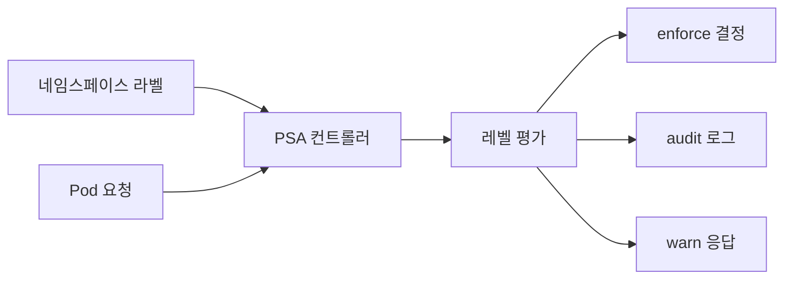
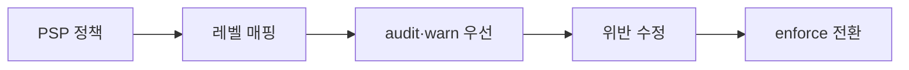

# Pod Security Admission

Pod Security Admission(PSA)은 **Pod Security Standards(PSS)** — `privileged`,
`baseline`, `restricted` 3단계 프로파일 — 을 네임스페이스 단위 **라벨**로
적용하는 내장 admission 컨트롤러다. v1.23 Beta, v1.25 GA로 **PodSecurityPolicy
(PSP)의 공식 후계자**다. PSP는 v1.25에서 제거됐다.

PSS 3단계는 기술적 경계이고, PSA는 그 경계를 **API 서버가 거절**해 집행한다.
파드 외 리소스(Deployment 등)는 간접 검증된다(컨트롤러가 파드를 생성할 때 결정).

운영 관점 핵심 질문은 여섯 가지다.

1. **Baseline과 Restricted의 차이는 무엇인가** — 금지되는 필드·값
2. **enforce·audit·warn을 어떻게 조합하나** — 롤아웃 전략
3. **클러스터 기본값은 어떻게 설정하나** — AdmissionConfiguration
4. **어떤 예외가 허용되나** — Exemptions
5. **PSA만으로 부족한 검증은 어떻게 메우나** — Kyverno, Gatekeeper, VAP
6. **PSP에서 어떻게 이행하나** — 체크 단계

> 관련: [Security Context](./security-context.md) · [RBAC](./rbac.md)
> · `security/` 카테고리의 정책 엔진 상세(예정)

---

## 1. 전체 구조



| 구성 | 역할 |
|---|---|
| Pod Security Standards | 3단계 프로파일(privileged/baseline/restricted) |
| PSA 컨트롤러 | API 서버 내장. 네임스페이스 라벨로 발동 |
| 라벨 모드 | `enforce`(차단), `audit`(감사), `warn`(경고) 세 가지 병행 가능 |
| 버전 핀 | `<mode>-version` 라벨로 K8s 마이너 버전 고정 |

---

## 2. Pod Security Standards 3단계

| 프로파일 | 의도 | 전형적 사용처 |
|---|---|---|
| `privileged` | **PSA가 어떤 규칙도 적용하지 않음** (audit/warn·version 라벨도 무의미) | 시스템 데몬셋, 스토리지·네트워크 오퍼레이터, kube-system |
| `baseline` | **알려진 권한 상승 차단**. 디폴트 워크로드 수용성 높음 | 일반 앱 네임스페이스 기본선 |
| `restricted` | 현행 하드닝 베스트 프랙티스 강제 | 멀티테넌트·외부 노출 워크로드 |

> `privileged`는 "모든 것이 허용"이 아니라 **PSA가 침묵한다**는 뜻이다.
> 해당 네임스페이스의 audit/warn도 같이 비활성 상태가 된다. 실제 통제가
> 필요하면 별도 정책 엔진으로 보완한다.

### Baseline 금지 항목

Baseline은 **특권 탈출 경로만** 막는다.

| 통제 | 금지되는 필드 | 허용 |
|---|---|---|
| Privileged | `*.securityContext.privileged` | `false`·미설정 |
| 호스트 네임스페이스 | `spec.hostNetwork`, `spec.hostPID`, `spec.hostIPC` | `false` |
| 호스트 포트 | `ports[*].hostPort` | 미설정·`0` |
| HostPath 볼륨 | `volumes[*].hostPath` | 미설정 |
| HostProcess (Windows) | `*.securityContext.windowsOptions.hostProcess` | `false`·미설정 |
| 위험 Capabilities 추가 | `capabilities.add` | 13개만: `AUDIT_WRITE`, `CHOWN`, `DAC_OVERRIDE`, `FOWNER`, `FSETID`, `KILL`, `MKNOD`, `NET_BIND_SERVICE`, `SETFCAP`, `SETGID`, `SETPCAP`, `SETUID`, `SYS_CHROOT` |
| `/proc` 마운트 | `*.securityContext.procMount` | `Default` |
| SELinux type | `seLinuxOptions.type` | `container_t`, `container_init_t`, `container_kvm_t`, `container_engine_t` |
| SELinux user/role | `seLinuxOptions.user`·`role` | 미설정 |
| Seccomp | `*.securityContext.seccompProfile.type` | `RuntimeDefault`, `Localhost`, 미설정 |
| AppArmor | `*.securityContext.appArmorProfile.type` + 레거시 어노테이션 | `RuntimeDefault`, `Localhost`, 미설정 |
| sysctl | `spec.securityContext.sysctls[*].name` | 안전 sysctl 세트만 |
| probe/lifecycle 호스트 | `*.probe.httpGet.host`, `tcpSocket.host`, `lifecycle.*.host` | 미설정·`""` |

**Seccomp는 Baseline에서 미설정 허용**. 하지만 표 바깥의 현실적 함정이 있다.
컨테이너 런타임이 "seccomp 미지정 = Unconfined"로 동작해 공격 표면이 커지므로,
**Baseline이어도 RuntimeDefault를 명시**하는 패턴을 권장한다.

### Restricted 추가 금지 항목

Restricted는 Baseline의 **엄격한 상위집합**이다. 추가 요구:

| 통제 | 요구사항 |
|---|---|
| 비루트 실행 | `runAsNonRoot: true` 필수. `runAsUser: 0`은 거절 |
| 권한 상승 차단 | `allowPrivilegeEscalation: false` 필수 |
| Seccomp **필수** | `RuntimeDefault` 또는 `Localhost`(미설정·Unconfined 거절) |
| AppArmor(지원 노드) | `RuntimeDefault` 또는 `Localhost`만 |
| Capabilities | `drop: ["ALL"]` 필수. `add`는 `NET_BIND_SERVICE`만 허용 |
| 볼륨 타입 | `configMap`, `csi`, `downwardAPI`, `emptyDir`, `ephemeral`, `persistentVolumeClaim`, `projected`, `secret` 8종만 |

> `readOnlyRootFilesystem: true`는 Restricted의 **필수 항목이 아니다**
> (권장 수준). Security Context 상세는 [Security Context](./security-context.md)
> 참조.

### ephemeralContainers·sidecar 검증

PSA는 Pod에 **사후 주입**되는 컨테이너도 모두 검증한다.

- **ephemeralContainers** (`kubectl debug`): Restricted 네임스페이스에서
  기본 debug 프로파일이 권한 요구를 충족하지 않아 막히는 경우 잦다.
  `--profile=restricted`(v1.30+) 사용
- **sidecar containers** (v1.33 GA, `restartPolicy: Always`):
  `initContainers`와 동일 규칙으로 검증됨

### Windows HostProcess Pod

Windows 노드의 `hostProcess: true` 파드는 **Baseline도 거절**된다.
Windows 전용 시스템 워크로드를 위한 **별도 네임스페이스 + privileged**
설계가 표준 패턴. 리눅스 워크로드와 섞지 않는다.

### Pod spec에서의 적용 위치

Restricted를 통과하려면 필드를 **Pod 레벨 + 모든 컨테이너 레벨**에 맞춰야
한다. `securityContext`는 container가 Pod 값을 상속하지 않는 필드가 있어서
**명시 선언이 안전**하다.

```yaml
spec:
  securityContext:
    runAsNonRoot: true
    seccompProfile:
      type: RuntimeDefault
  containers:
    - name: app
      image: app:1.0
      securityContext:
        allowPrivilegeEscalation: false
        capabilities:
          drop: ["ALL"]
        runAsUser: 10001
        runAsGroup: 10001
```

---

## 3. 세 가지 모드

| 모드 | 동작 | 주 용도 |
|---|---|---|
| `enforce` | 위반 Pod 생성을 **API 서버가 거절** | 운영 집행 |
| `audit` | 위반을 **감사 로그**에 어노테이션으로 기록 | 사고 없이 데이터 수집 |
| `warn` | 위반을 사용자 응답(HTTP Warning 헤더)에 즉시 경고 | 개발자 피드백 |

**세 모드는 독립적이며 병행 가능**하다. 표준 롤아웃 패턴:

```yaml
# 단계 1: 관찰만
metadata:
  labels:
    pod-security.kubernetes.io/warn: restricted
    pod-security.kubernetes.io/audit: restricted

# 단계 2: 실집행
metadata:
  labels:
    pod-security.kubernetes.io/enforce: baseline
    pod-security.kubernetes.io/warn: restricted
    pod-security.kubernetes.io/audit: restricted
```

> `enforce`는 **Pod 생성 API 요청**만 실제로 거절한다. Deployment 같은
> 워크로드 리소스에 대해서는 PSA가 **warn 응답**을 붙이고, 내부 컨트롤러가
> Pod을 만들 때 그 Pod 생성이 거절되어 `FailedCreate` 이벤트로 드러난다.
> 즉 템플릿 수정 없이 "Deployment는 생성 성공"해도 Pod은 올라오지 않는다.
> warn/audit은 Pod·Pod 템플릿 양쪽 요청에 모두 신호를 준다.

### Static Pod는 PSA를 우회한다

kubelet이 파일로 직접 생성하는 static Pod(매니페스트 디렉터리)는
**API 서버를 거치지 않으므로 PSA가 적용되지 않는다**. 노드에 쓰기 접근을
얻은 공격자의 실제 우회 경로다. 대응:

- kubelet config에서 static pod 경로 접근 권한을 root 전용으로 유지
- 노드 파일 무결성 감시(FIM) 또는 admission webhook을 보완하는 런타임
  보안(Falco, Tetragon)으로 생성 행위 탐지
- mirror Pod가 API 서버에 등록될 때 PSA가 평가하지만 **이미 실행 중인
  컨테이너는 막지 못한다**

### 네임스페이스 라벨을 낮추면 기존 Pod도 재평가된다

`enforce` 레벨 자체는 "새 Pod 요청"만 막지만, `audit`·`warn`은 라벨 업데이트
시점에 **기존 Pod 전체**를 다시 평가해 결과를 로그·응답에 반영한다.
마이그레이션 중 기존 워크로드의 준수 현황을 파악하는 데 유용한 동작이다.

---

## 4. 네임스페이스 라벨

```bash
# 개별 라벨 적용
kubectl label ns app \
  pod-security.kubernetes.io/enforce=baseline \
  pod-security.kubernetes.io/warn=restricted \
  pod-security.kubernetes.io/audit=restricted

# 버전 핀
kubectl label ns app \
  pod-security.kubernetes.io/enforce-version=v1.35
```

| 라벨 | 값 |
|---|---|
| `pod-security.kubernetes.io/<mode>` | `privileged`, `baseline`, `restricted` |
| `pod-security.kubernetes.io/<mode>-version` | `v1.XX` 또는 `latest` |

### 버전 핀의 의미

PSS 정의는 K8s 마이너 버전마다 **변할 수 있다**(새 capability가 허용 목록에
추가·제거되는 식). `<mode>-version`을 고정하면 K8s 업그레이드 후에도 해당
버전의 체크 규칙만 적용된다. `latest`는 **항상 현재 K8s 버전** 기준.

운영 권고:
- 프로덕션: `-version`을 **명시**해 업그레이드 자동 영향 차단
- staging/test: `latest`로 새 규칙 조기 감지

### `kube-system` 등 내장 네임스페이스

kubelet과 컨트롤러는 `kube-system`·`kube-public`·`kube-node-lease`에 특권
파드를 생성한다. 기본 `privileged`를 쓰거나, 시스템 파드의 SA·RuntimeClass
를 exemption으로 처리한다.

---

## 5. 클러스터 기본값 (AdmissionConfiguration)

PSA 컨트롤러는 항상 활성이고, `defaults`로 **라벨 없는 네임스페이스의
기본 레벨**을 설정한다. `kube-apiserver`에 전달하는 파일:

```yaml
apiVersion: apiserver.config.k8s.io/v1
kind: AdmissionConfiguration
plugins:
  - name: PodSecurity
    configuration:
      apiVersion: pod-security.admission.config.k8s.io/v1
      kind: PodSecurityConfiguration
      defaults:
        enforce: "baseline"
        enforce-version: "latest"
        audit: "restricted"
        audit-version: "latest"
        warn: "restricted"
        warn-version: "latest"
      exemptions:
        usernames: []
        runtimeClasses: []
        namespaces: [kube-system]
```

- `defaults`는 네임스페이스 라벨 **없을 때만** 적용됨 (라벨 설정이 덮어씀)
- HA 컨트롤 플레인의 **롤링 업그레이드 중간 상태**에서는 API 서버 인스턴스
  마다 PSA 버전이 일시적으로 다를 수 있다. 평가 결과 차이 가능성 인지
- 관리형 클러스터는 AdmissionConfiguration 직접 편집 경로가 다르다
  - GKE: Autopilot은 일부 PSA 적용, Standard는 라벨 운영
  - EKS: 클러스터 관리자가 네임스페이스 라벨로만 운영
  - AKS: 클러스터 생성 옵션으로 PSA 활성, 이후 라벨 보강
  - 공통: AdmissionConfiguration이 직접 수정 안 되면 모든 네임스페이스에
    라벨을 강제 주입(VAP·Kyverno)해 동등 효과 달성

### 권장 기본값

| 환경 | `enforce` | `audit` / `warn` |
|---|---|---|
| 멀티테넌트·신규 클러스터 | `baseline` | `restricted` |
| 레거시 마이그레이션 진행 중 | `privileged` | `baseline` or `restricted` |
| 고보안(PCI, 정부) | `restricted` | `restricted` |

---

## 6. Exemptions

일부 파드는 PSS를 우회할 수밖에 없다(네트워크 오퍼레이터의 `hostNetwork`,
스토리지 CSI의 `privileged` 등).

| 기준 | 예시 | 주의 |
|---|---|---|
| `usernames` | `system:serviceaccount:csi-system:driver` | 토큰 탈취 시 exemption도 승계 |
| `runtimeClasses` | `gvisor`, `kata` | 런타임 자체가 격리를 제공하므로 완화 |
| `namespaces` | `kube-system` | 테넌트 네임스페이스에 적용 금지 |

Exemption은 **enforce·audit·warn 모두 스킵**한다. 감사 공백이 생기므로
**보완 규칙**(Kyverno, Gatekeeper)으로 해당 파드도 별도 검증한다.

> **Exemptions 우회 위험**: `namespaces` exemption은 "네임스페이스 이름"으로
> 걸리므로 관리자가 같은 이름의 네임스페이스를 재생성할 때 의도치 않게
> 우회가 복원된다. 가능하면 SA(`usernames`)로 좁힌다.

---

## 7. PodSecurityPolicy 마이그레이션

PSP는 v1.21 Deprecated, **v1.25 제거**. PSA로 이행하는 표준 경로:



| PSP 제어 | PSA 레벨 상응 |
|---|---|
| 특권 금지 + hostNetwork 금지 | Baseline |
| 위 + runAsNonRoot + capabilities drop ALL | Restricted |
| fsGroup, supplementalGroups 세밀 제어 | PSA 미지원 → 외부 엔진 |
| RunAsUser range 강제 | PSA 미지원 → 외부 엔진 |
| 특정 볼륨만 허용 | Restricted가 8종으로 제한. 그 밖은 외부 엔진 |

### 단계별 접근

1. 각 네임스페이스의 **현재 파드 스펙을 스캔**해 가장 엄격한 통과 레벨
   확인 (`kubectl label --dry-run=server` 또는 `pod-security-auditor` 툴)
2. `warn` + `audit` 라벨만 걸어 **데이터 수집**(수 주)
3. 위반 수정 후 `enforce`로 승격
4. PSP 리소스 제거

### PSA로 표현 안 되는 것

- 사용자·서비스 계정별 **다른** 정책 (PSA는 네임스페이스 레벨)
- Seccomp Localhost의 **특정 프로파일 이름** 강제
- runAsUser를 특정 범위로 제한 (예: 10000~20000)
- 볼륨 타입 화이트리스트 커스터마이징

이들은 Kyverno·Gatekeeper·VAP로 보완한다.

---

## 8. PSA의 한계와 외부 정책 엔진

PSA는 **내장**이라 간편하지만 의도적으로 좁다.

| 한계 | 영향 | 보완 |
|---|---|---|
| Pod(Template)만 검증 | ConfigMap, Service 등 다른 리소스 정책 불가 | Kyverno, Gatekeeper |
| 메시지·UX 커스터마이즈 불가 | "왜 차단됐는가" 개발자 친화 메시지 어려움 | VAP의 `message` 필드, Kyverno |
| 정책이 3개 고정 프로파일 | 조직 요구(이미지 레지스트리, 라벨) 표현 불가 | Kyverno·Gatekeeper |
| audit 결과는 API 서버 감사 로그에 | 정책별 대시보드 구성 번거로움 | Kyverno Policy Reports |

### ValidatingAdmissionPolicy (v1.30 GA)

CEL 기반 내장 정책. Kyverno·Gatekeeper 없이 클러스터 내장 코드로 간단한
추가 규칙을 표현 가능. PSA로 부족한 필드 제한에 적합.

```yaml
apiVersion: admissionregistration.k8s.io/v1
kind: ValidatingAdmissionPolicy
metadata:
  name: require-registry
spec:
  validations:
    - expression: |
        object.spec.containers.all(c,
          c.image.startsWith("registry.company.com/"))
      message: "컨테이너 이미지는 사내 레지스트리만 허용"
  matchConstraints:
    resourceRules:
      - apiGroups: [""]
        apiVersions: ["v1"]
        operations: ["CREATE", "UPDATE"]
        resources: ["pods"]
```

### Kyverno · OPA Gatekeeper

PSS 외 정책(이미지 출처, 라벨, 리소스 mutation)을 표현하려면 외부 정책
엔진을 함께 운영한다. 도구 자체의 비교·운영은 `security/` 카테고리가
주인공이다. 여기서는 **PSA를 어떻게 보완하는가**만 정리한다.

| 보완 영역 | 예시 |
|---|---|
| Pod 외 리소스 검증 | Service `LoadBalancer` 타입 제한, Ingress host 검증 |
| 메시지 커스터마이즈 | "이 정책 위반 시 #plat-sec 채널로 문의" 안내 |
| 정책의 mutation | `runAsNonRoot: true` 강제 주입, default seccomp 추가 |
| 이미지 검증 | cosign 서명, 디지털 출처 정책 |
| 정책 보고서 | Policy Reports CRD로 위반 누적 대시보드 |

**권장 조합**: 빠른 최소선은 **PSA + VAP**, 풍부한 정책은 **PSA + Kyverno**.

---

## 9. 운영 패턴

### 테넌트 네임스페이스 템플릿

```yaml
apiVersion: v1
kind: Namespace
metadata:
  name: tenant-{{ .Name }}
  labels:
    pod-security.kubernetes.io/enforce: baseline
    pod-security.kubernetes.io/enforce-version: v1.35
    pod-security.kubernetes.io/warn: restricted
    pod-security.kubernetes.io/warn-version: v1.35
    pod-security.kubernetes.io/audit: restricted
    pod-security.kubernetes.io/audit-version: v1.35
```

테넌트가 네임스페이스 라벨을 **변경할 수 있으면 PSA는 무력화**된다.

- `namespaces` 리소스의 `update` 권한을 테넌트에 주지 않는다
- ValidatingAdmissionPolicy로 `pod-security.kubernetes.io/*` 라벨 수정을
  플랫폼 팀에만 허용

### CI 단계 사전 검증

배포 전에 정적 분석으로 PSA 위반을 잡는다.

| 도구 | 용도 |
|---|---|
| `kubectl` dry-run + warning 수신 | 가장 간단한 점검 |
| `kubescape` / `kube-score` | PSS 프로파일 기반 정적 스캔 |
| `polaris` | 유사한 베스트 프랙티스 검증 |
| OPA `conftest` | 레포지토리 차원 게이트 |

### Pod Security Admission 감사 로그

```yaml
# Audit Policy 최소 예시 (Audit Logging 글 참조)
rules:
  - level: Metadata
    omitStages: ["RequestReceived"]
    resources:
      - group: ""
        resources: ["pods"]
```

위반 시 감사 로그의 `annotations`에 아래 키가 추가된다:

| 어노테이션 | 의미 |
|---|---|
| `pod-security.kubernetes.io/enforce-policy` | 적용된 레벨 |
| `pod-security.kubernetes.io/audit-violations` | 위반 필드 목록 |
| `pod-security.kubernetes.io/exempt` | 어떤 기준으로 면제됐는가 |

---

## 10. 최근 변경 (v1.30 ~ v1.35)

| 버전 | 변경 | 영향 |
|---|---|---|
| v1.30 | AppArmor `securityContext.appArmorProfile` 필드 GA | 레거시 어노테이션 deprecated. PSS 체크는 둘 다 인식 |
| v1.30 | User Namespaces (`hostUsers: false`) Beta(KEP-127) | `hostUsers: false` 사용 시 PSS Restricted의 일부 제약 자동 충족 |
| v1.33 | User Namespaces 기본 활성 | feature gate 토글 없이 사용 가능 |
| v1.33 | Sidecar containers(restartPolicy=Always) GA | PSA는 initContainers와 동일 규칙으로 검증 |
| v1.33 | Image volume source(`spec.volumes[*].image`) Beta | **Restricted 허용 목록에는 없음**. Restricted 대상 NS는 별도 정책 또는 운영 합의 필요 |
| v1.35 | PSS 기준 미세 조정 가능성 | 버전 핀 유지로 자동 영향 차단. 변경 사항은 릴리즈 노트 직접 확인 |

> PSS 정의는 릴리즈마다 점진적 조정을 받는다. 변경 자체는 작지만 `latest`
> 사용 시 **조용히 깨질** 수 있다. 버전 핀 운영 필수.

---

## 11. 운영 체크리스트

**클러스터**
- [ ] AdmissionConfiguration의 기본 `enforce`가 최소 `baseline`인가
- [ ] `kube-system` 외 시스템 네임스페이스의 라벨이 명시돼 있는가
- [ ] 관리형 클러스터라면 PSA 기본값을 자체 네임스페이스 라벨로 보장하는가

**네임스페이스**
- [ ] 모든 네임스페이스가 `enforce`·`warn`·`audit` 3라벨 + `-version`을 갖는가
- [ ] 테넌트에 `namespaces update` 권한이 없는가
- [ ] Exemption은 `usernames`(SA)로 한정했는가

**워크로드**
- [ ] Deployment/StatefulSet이 모두 `warn` 통과하는가
- [ ] Restricted 대상 파드의 Pod·컨테이너 SecurityContext가 일관되게 선언됐는가
- [ ] Seccomp가 Baseline 환경에서도 `RuntimeDefault`로 명시됐는가

**거버넌스**
- [ ] PSA 감사 로그가 중앙 수집되는가
- [ ] 새 네임스페이스 생성 시 라벨이 자동 주입되는가 (VAP 또는 Kyverno)
- [ ] PSS `latest` 사용 여부가 CI에서 경고되는가

---

## 12. 트러블슈팅

### 왜 내 Pod가 Baseline에서 거부되나

kubectl 출력:
```
Error from server (Forbidden): ... violates PodSecurity "baseline:v1.35":
host namespaces (hostNetwork=true), privileged (container "app" must not set privileged=true)
```

메시지에 위반 필드가 그대로 열거된다. 해당 필드를 수정하거나, 반드시 필요
하면 전용 네임스페이스로 이동 + Exemption.

### warn 경고가 감사 로그에 없다

`warn`은 **사용자 응답에만** 들어가고 감사 로그는 `audit`에서 찍는다.
둘 다 걸어야 완전한 관찰.

### Deployment는 통과했는데 Pod가 실패한다

`enforce`는 Pod **생성 API 요청**만 거절한다. Deployment 같은 워크로드
리소스 생성 자체는 성공하지만, PSA가 응답에 **warning을 추가**해 알린다.
이를 무시하고 진행하면 컨트롤러가 Pod을 만들 때 `FailedCreate`로 막힌다.

```bash
# Deployment 생성 시 응답에 W/Warning 헤더 확인
kubectl apply -f deploy.yaml --v=6 2>&1 | grep -i warning

# Pod 생성 실패 이벤트
kubectl get events -n app --field-selector reason=FailedCreate
```

### `kubectl debug`가 Restricted에서 막힌다

기본 debug 프로파일은 권한 요구가 Restricted를 통과하지 못한다.
v1.30+ `--profile=restricted`(또는 `baseline`)을 사용한다.

```bash
kubectl debug -it pod/app -n app --image=busybox --profile=restricted
```

### 업그레이드 후 갑자기 파드가 막힌다

`<mode>-version`을 `latest`로 뒀거나 핀을 누락했다. 영향 범위 확인 후
이전 버전으로 잠시 되돌리고 본 수정 후 재승격.

### kube-system에 내가 만든 파드가 막힌다

`kube-system`을 보통 `privileged`로 둔다. 어드민용 파드를 여기에 만드는
패턴은 위험(레이블 우회 공격 경로). 별도 네임스페이스 + RBAC 분리가 권장.

---

## 참고 자료

- [Pod Security Admission — Kubernetes](https://kubernetes.io/docs/concepts/security/pod-security-admission/) — 2026-04-23 확인
- [Pod Security Standards — Kubernetes](https://kubernetes.io/docs/concepts/security/pod-security-standards/) — 2026-04-23 확인
- [Enforce Pod Security Standards with Namespace Labels](https://kubernetes.io/docs/tasks/configure-pod-container/enforce-standards-namespace-labels/) — 2026-04-23 확인
- [Apply Pod Security Standards at the Cluster Level](https://kubernetes.io/docs/tutorials/security/cluster-level-pss/) — 2026-04-23 확인
- [Migrate from PodSecurityPolicy](https://kubernetes.io/docs/tasks/configure-pod-container/migrate-from-psp/) — 2026-04-23 확인
- [Kubernetes v1.30: AppArmor Field GA](https://kubernetes.io/blog/2024/04/19/kubernetes-1-30-release/) — 2026-04-23 확인
- [ValidatingAdmissionPolicy](https://kubernetes.io/docs/reference/access-authn-authz/validating-admission-policy/) — 2026-04-23 확인
- [NSA/CISA Kubernetes Hardening Guide](https://www.cisa.gov/news-events/cybersecurity-advisories/aa22-238a) — 2026-04-23 확인
- [CIS Kubernetes Benchmark](https://www.cisecurity.org/benchmark/kubernetes) — 2026-04-23 확인
- [Kyverno Pod Security policies](https://kyverno.io/policies/pod-security/) — 2026-04-23 확인
