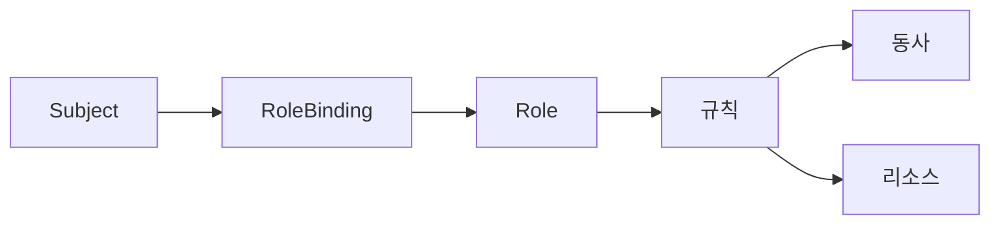

# RBAC

RBAC(Role-Based Access Control)은 **누가 무엇을 할 수 있는가**를
쿠버네티스 API 레벨에서 강제하는 기본 인가(authorization) 메커니즘이다.
`rbac.authorization.k8s.io/v1` API 그룹으로 제공되며 v1.8부터 GA 상태다.

쿠버네티스 인가 체인은 여러 authorizer를 순차 평가한다. 운영 클러스터
표준 조합은 `Node,RBAC`이며, 외부 webhook을 섞으려면 v1.32에 GA된
**Structured Authorization Configuration**(KEP-3221)을 사용한다.

운영 관점 핵심 질문은 여섯 가지다.

1. **Role과 ClusterRole을 어떻게 갈라 쓰나** — 네임스페이스 경계
2. **Node·Webhook·RBAC은 어떻게 협업하나** — 인가 체인 순서
3. **왜 내 권한이 상승되나** — `escalate`·`bind`·`impersonate` 동사
4. **wildcard는 왜 위험한가** — 미래 리소스까지 자동 허용
5. **누가 무엇을 할 수 있는지 어떻게 감사하나** — `can-i`·SAR·정적 분석
6. **워크로드의 최소 권한은 어떻게 설계하나** — SA 전용 Role

> 관련: [ServiceAccount](./serviceaccount.md)
> · [Pod Security Admission](./pod-security-admission.md)
> · [Audit Logging](./audit-logging.md)

---

## 1. 전체 구조



| 구성 요소 | 역할 |
|---|---|
| Subject | User, Group, ServiceAccount |
| Role / ClusterRole | 규칙(rules) 집합. 어떤 리소스에 어떤 동사를 허용할지 |
| RoleBinding / ClusterRoleBinding | Subject와 Role을 연결 |
| Rule | `apiGroups`·`resources`·`verbs`·`resourceNames`·`nonResourceURLs` |

**핵심 성질**:
- 권한은 **순수 누적**(additive)이다. deny 규칙은 존재하지 않는다.
- 규칙은 **OR 평가**된다. 어느 하나가 허용하면 허용이다.
- `system:masters` 그룹은 인가 체인 평가 **이전**에 superuser로 즉시 허용된다.
  Webhook·VAP도 통과하며, 감사 로그에는 그룹만 기록된다. `kubeadm`의
  `/etc/kubernetes/admin.conf`가 이 그룹을 사용하므로 **이 파일은 금고
  수준 보관 + break-glass 절차에 한정**한다.

---

## 2. Role vs ClusterRole

| 구분 | Role | ClusterRole |
|---|---|---|
| 스코프 | 네임스페이스 | 클러스터 |
| 대상 리소스 | 네임스페이스 리소스만 | 네임스페이스 + 클러스터 리소스 |
| nonResourceURL (`/healthz` 등) | ✗ | ✓ |
| 여러 네임스페이스에 재사용 | ✗ | ✓ (RoleBinding으로 바인딩 가능) |
| 집계(aggregation) | ✗ | ✓ |

### 바인딩 조합 규칙

| 바인딩 | Role 참조 | ClusterRole 참조 |
|---|:-:|:-:|
| RoleBinding | ✓ | ✓ (해당 네임스페이스로 제한) |
| ClusterRoleBinding | ✗ | ✓ |

ClusterRole을 RoleBinding에 연결하면 **해당 네임스페이스에만** 적용되고,
클러스터 스코프 리소스(Node, PV 등)에 대한 규칙은 **자동으로 거부**된다.
여러 네임스페이스에서 재사용 가능한 "템플릿 Role"로 쓰는 표준 패턴이다.

### Role 예시

```yaml
apiVersion: rbac.authorization.k8s.io/v1
kind: Role
metadata:
  namespace: app
  name: pod-reader
rules:
  - apiGroups: [""]
    resources: ["pods", "pods/log"]
    verbs: ["get", "list", "watch"]
```

### ClusterRole을 RoleBinding으로 바인딩

```yaml
apiVersion: rbac.authorization.k8s.io/v1
kind: RoleBinding
metadata:
  namespace: app
  name: read-app
subjects:
  - kind: ServiceAccount
    name: reporter
    namespace: app
roleRef:
  apiGroup: rbac.authorization.k8s.io
  kind: ClusterRole
  name: view
```

---

## 3. 규칙(Rule) 구조

```yaml
rules:
  - apiGroups: ["apps"]
    resources: ["deployments", "deployments/scale"]
    resourceNames: ["frontend"]
    verbs: ["get", "update", "patch"]
```

| 필드 | 의미 | 비고 |
|---|---|---|
| `apiGroups` | API 그룹 배열 (코어 그룹은 `""`) | `["*"]` 지양 |
| `resources` | 리소스 타입. 서브리소스는 `/`로 (예: `pods/exec`) | 아래 참조 |
| `resourceNames` | 특정 이름만 대상화 | `create`·`deletecollection`에 무효 |
| `verbs` | 허용 동사 목록 | 아래 표 참조 |
| `nonResourceURLs` | 리소스 아닌 경로 (ClusterRole 전용) | `/healthz`, `/metrics` 등 |

### 서브리소스는 독립적인 RBAC 단위

`pods`에 `get`이 있어도 `pods/log`·`pods/exec`에 대한 권한이 자동으로
따라오지 않는다. 자주 쓰는 서브리소스:

| 서브리소스 | 동사 | 실제 동작 |
|---|---|---|
| `pods/log` | `get` | 컨테이너 로그 조회 |
| `pods/exec`·`pods/attach`·`pods/portforward` | `create` | 원격 터미널·포트 포워드 |
| `pods/eviction` | `create` | API 기반 축출 |
| `pods/ephemeralcontainers` | `update` | 디버그용 임시 컨테이너 |
| `deployments/scale` | `update`, `patch` | 레플리카 수만 변경 |
| `serviceaccounts/token` | `create` | TokenRequest API |
| `nodes/proxy`·`services/proxy` | `get`, `create` | kubelet·서비스 프록시 |
| `*/status` | `update`, `patch` | status 서브리소스만 변경 |

### `resourceNames`의 verb별 유효성

| 동사 | 적용 |
|---|---|
| `get`·`update`·`patch`·`delete` | 정확한 이름 매칭으로 제한 |
| `list`·`watch` | 응답이 해당 이름만 필터링되진 않음(클라이언트에서 조회 실패) |
| `create`·`deletecollection` | **무시됨** (이름이 사전에 결정되지 않음) |

### 표준 동사

| 계열 | 동사 | 의미 |
|---|---|---|
| 읽기 | `get`, `list`, `watch` | list·watch는 **컬렉션 전체 노출** |
| 쓰기 | `create`, `update`, `patch`, `delete`, `deletecollection` | |
| 특수 | `escalate`, `bind`, `impersonate`, `approve`, `sign` | 권한 상승 경로 |
| 프록시 | `proxy` | kubelet·서비스 프록시 |

> 주의: Secret에 `list`·`watch`를 주면 **내용 전부가 노출된다**. 특정 시크릿만
> 읽히려면 `get` + `resourceNames`를 함께 사용한다.

---

## 4. 바인딩(Subjects)

```yaml
subjects:
  - kind: User
    name: alice@example.com
    apiGroup: rbac.authorization.k8s.io
  - kind: Group
    name: platform-admins
    apiGroup: rbac.authorization.k8s.io
  - kind: ServiceAccount
    name: reporter
    namespace: app
```

| 종류 | 네임스페이스 필드 | 인증 출처 |
|---|:-:|---|
| User | ✗ | 외부 인증(OIDC, client cert 등). K8s는 오브젝트 없음 |
| Group | ✗ | 인증기가 제공하는 그룹 claim |
| ServiceAccount | ✓ | K8s 내부 오브젝트 + TokenRequest API |

**User/Group은 K8s 오브젝트가 아니다.** 삭제된 사용자가 같은 이름으로 재생성
되면 기존 바인딩이 자동으로 상속된다. 신원 관리는 외부 IdP에서 해야 한다.

### 반드시 점검해야 할 system 그룹

| 그룹 | 의미 | 위험 |
|---|---|---|
| `system:unauthenticated` | 토큰 없는 모든 요청 | 바인딩 절대 금지 |
| `system:authenticated` | **유효한 토큰이 있는 모든 주체** | `edit`·`admin` 바인딩 시 과거 실제 사고 발생(외부 OIDC 사용자·임의 SA 토큰 포함) |
| `system:serviceaccounts` | 모든 SA | ClusterRoleBinding 시 전 SA 권한 상승 |
| `system:serviceaccounts:<ns>` | 특정 네임스페이스 전 SA | Namespace admin에 한정 사용 |
| `system:masters` | superuser (RBAC 평가 이전 통과) | bootstrap·break-glass 전용 |

체크리스트: `kubectl get clusterrolebinding -o json | jq '.items[] |
select(.subjects[]?.name=="system:authenticated")'`로 바인딩 전수 검사.

---

## 5. 기본 ClusterRole

API 서버는 아래 역할을 자동 생성·재조정(reconcile)한다. 업그레이드 후에도
권한이 표준 값으로 돌아온다.

| 역할 | 스코프 | 용도 |
|---|---|---|
| `cluster-admin` | 전역 | 수퍼유저. **break-glass 전용** |
| `admin` | 네임스페이스 | 네임스페이스 관리자 (RoleBinding 생성 포함) |
| `edit` | 네임스페이스 | 읽기/쓰기. Secret 편집 가능 |
| `view` | 네임스페이스 | 읽기 전용 (Secret 제외) |

### `system:` 접두사 역할

컴포넌트용 내부 역할이다. 이름은 `system:kube-controller-manager`,
`system:node`, `system:kubelet-api-admin` 등. **사용자 바인딩 금지**.

### 집계(Aggregated) ClusterRole

라벨 셀렉터로 여러 ClusterRole을 하나로 합성한다. 오퍼레이터가 자체 CRD에
대해 기본 역할을 **확장**할 때 쓰는 표준 메커니즘이다.

```yaml
apiVersion: rbac.authorization.k8s.io/v1
kind: ClusterRole
metadata:
  name: monitoring-admin
aggregationRule:
  clusterRoleSelectors:
    - matchLabels:
        rbac.authorization.k8s.io/aggregate-to-admin: "true"
rules: []   # 컨트롤러가 자동 채움
```

기본 `admin`·`edit`·`view`에도 집계 규칙이 이미 붙어 있다.

**주의 — 라벨 탈취 위험**: `clusterroles` `create`·`update` 권한만 가진 주체가
`aggregate-to-admin: "true"` 라벨을 단 ClusterRole을 만들면, **집계
컨트롤러가 자동으로 그 규칙을 `admin`에 병합**한다. 사실상 namespace
admin 권한을 통해 cluster admin 경계를 건드릴 수 있다. 대응:

- `clusterroles` 리소스에 대한 `create/update` 권한을 최소화
- ValidatingAdmissionPolicy로 `aggregate-to-*` 라벨 생성을 화이트리스트한
  주체로 제한
- `kubectl get clusterrole admin -o yaml`로 확장 결과를 주기 점검

---

## 6. 인가 체인과 Node Authorizer

RBAC만 쓰지 않는다. 운영 클러스터의 기본 조합은 **Node → RBAC → (Webhook)**
순이고, 어느 하나가 허용하면 통과한다(OR).

| Authorizer | 역할 | RBAC과의 관계 |
|---|---|---|
| `Node` | kubelet이 **자기 노드 관련 리소스만** 접근 | RBAC보다 앞 평가, kubelet 권한 대부분 대체 |
| `RBAC` | 사람·워크로드 범용 인가 | 주력 |
| `Webhook` | 외부 정책 엔진(OPA, 자체 서비스) | v1.32 GA Structured Authz Config로 **여러 개** 사용 가능 |
| `ABAC` | 파일 기반 속성 인가 | 레거시. 신규 도입 금지 |

### Node Authorizer

- 대상 주체: `system:nodes` 그룹의 `system:node:<nodeName>` 사용자
- 자동 허용: **해당 노드에 스케줄된 Pod 관련** Secret·ConfigMap·PVC·PV 읽기,
  자기 Node 객체 상태 업데이트
- v1.34 GA **Authorize with Selectors**(KEP-4601)로 `list`/`watch`에
  `spec.nodeName=` 셀렉터 요구를 강제할 수 있어, 탈취된 kubelet이 타 노드의
  Pod 목록을 긁어오는 공격이 봉쇄됐다
- RBAC으로는 `system:node`에 **추가** 권한을 줄 수 있어도 **뺄 수는 없다**

### Structured Authorization Configuration (v1.32 GA)

```yaml
apiVersion: apiserver.config.k8s.io/v1
kind: AuthorizationConfiguration
authorizers:
  - type: Node
  - type: RBAC
  - type: Webhook
    name: kyverno
    webhook:
      matchConditions:
        - expression: "has(request.resourceAttributes)"
      timeout: 3s
      failurePolicy: Deny
      # connectionInfo·subjectAccessReviewVersion 등은 공식 문서 참고
```

`--authorization-config` 플래그로 지정. 다중 webhook과 CEL 기반 사전 필터
(`matchConditions`)로 불필요한 webhook 호출을 줄인다. `--authorization-mode`
플래그와 **혼용 불가**.

---

## 7. 바인딩

```yaml
apiVersion: rbac.authorization.k8s.io/v1
kind: RoleBinding
metadata:
  namespace: app
  name: read-pods
subjects:
  - kind: ServiceAccount
    name: reporter
    namespace: app
roleRef:
  apiGroup: rbac.authorization.k8s.io
  kind: Role
  name: pod-reader
```

`roleRef`는 변경 불가(immutable)다. 대상 Role을 바꾸려면 삭제 후 재생성한다.

---

## 8. 권한 검증·감사

### SelfSubjectAccessReview / SubjectAccessReview API

`kubectl auth can-i`의 실체는 이 API 호출이다. 플랫폼 대시보드·게이트웨이·
Admission webhook이 사용자 권한을 프로그램적으로 질의할 때 쓴다.

| API | 질의 주체 | 용도 |
|---|---|---|
| `SelfSubjectAccessReview` | 본인 | 단일 동작 허용 여부 |
| `SelfSubjectRulesReview` | 본인 | 현재 네임스페이스의 **적용 가능 규칙 전체** (= `can-i --list`) |
| `SubjectAccessReview` | 임의 주체 | `impersonate` 없이 타 주체 권한 질의 |
| `LocalSubjectAccessReview` | 임의 주체 | 네임스페이스 한정 질의 |

v1.34 GA `Authorize with Selectors`로 SAR 타입에 `fieldSelector`·
`labelSelector` 필드가 추가돼 "이 노드 이름 셀렉터와 함께 요청 시 허용"
같은 세밀한 질의가 가능해졌다.

```yaml
apiVersion: authorization.k8s.io/v1
kind: SubjectAccessReview
spec:
  user: system:serviceaccount:app:reporter
  groups: [system:serviceaccounts, system:authenticated]
  resourceAttributes:
    namespace: app
    verb: list
    resource: pods
    fieldSelector:
      requirements:
        - key: spec.nodeName
          operator: In
          values: ["node-a"]
```

### kubectl 빌트인

```bash
# 내 권한 확인
kubectl auth can-i create deployments -n app
kubectl auth can-i --list -n app

# 타 주체 권한 확인 (impersonate 권한 필요)
kubectl auth can-i get secrets --as=system:serviceaccount:app:reporter \
  --as-group=system:serviceaccounts \
  --as-group=system:serviceaccounts:app \
  --as-group=system:authenticated

# 선언적 재조정
kubectl auth reconcile -f rbac.yaml

# 현재 신원 확인 (v1.31 GA)
kubectl auth whoami
```

> **함정**: SA를 `--as`로 사칭할 때 **그룹을 함께 사칭하지 않으면** 실제
> 권한보다 적게 나온다. SA는 런타임에 자동으로 `system:serviceaccounts`,
> `system:serviceaccounts:<ns>`, `system:authenticated` 그룹에 속하기 때문이다.

### `kubectl auth reconcile`의 semantics

- Role의 `rules`는 **추가 병합**(기존 규칙 유지)
- RoleBinding의 `subjects`도 추가 병합
- 기본적으로 **여분 규칙·subject를 보존한다**. 엄격 정합을 원하면
  `--remove-extra-permissions --remove-extra-subjects` 플래그를 명시
- GitOps 파이프라인에서 `kubectl apply`(선언적 교체)와 `auth reconcile`
  (병합) 중 선택: 중앙 관리 Role은 `apply`, 외부 오퍼레이터와 공존하는
  Role은 `auth reconcile`

### 외부 도구

| 도구 | 용도 |
|---|---|
| `kubectl-who-can` | 특정 동사·리소스에 대한 허용 주체 역조회 |
| `rbac-lookup` | User/SA/Group 이름으로 바인딩 검색 |
| `rakkess` (access-matrix) | 리소스×동사 허용 매트릭스 시각화 |
| `rbac-tool` (Insight) | CI 정책 검사, `policy-rules`·`lookup` 서브커맨드 |
| `krane` | RBAC 정적 분석, 위험 패턴 자동 탐지 |
| `KubiScan` | 위험 권한(토큰, PV, wildcards) 스캔 |

> 운영 팁: CI에 `krane` 또는 `rbac-tool`을 넣어 PR 단계에서 wildcards,
> `cluster-admin` 바인딩, 위험 동사 사용을 게이트로 막는다.

---

## 9. 권한 상승 위험 패턴

RBAC 자체는 권한 상승을 일부 차단(`escalate` 방지)하지만, **아래 동사·
리소스는 곧바로 cluster-admin과 동등한 위력을 가진다**. 부여 시 감사 로그
와 함께 심사한다.

| # | 위험 | 공격 벡터 | 차단 방법 |
|:-:|---|---|---|
| 1 | Secret에 `list`/`watch` | 모든 Secret 내용 노출 | `get` + `resourceNames` 제한 |
| 2 | `roles/clusterroles`에 `escalate` | 본인보다 큰 권한 역할 생성 | 관리자 전용 |
| 3 | `rolebindings`에 `bind` | 기존 강력 역할을 자기에게 바인딩 | 동일 |
| 4 | `users/groups/serviceaccounts`에 `impersonate` | 임의 주체로 가장 | v1.35 Constrained Impersonation |
| 5 | `userextras/<key>`에 `impersonate` | 커스텀 extra 필드 사칭 (key는 **소문자 정규화**, 대문자 키는 매칭 불가) | 사용 중인 키 확인 후 제한 |
| 6 | Pod·Deployment `create` | 특권 SA로 실행, 모든 SA 권한 상속 | PSA Restricted 강제 |
| 7 | `persistentvolumes` `create` | `hostPath` PV로 노드 파일시스템 접근 | 관리자·오퍼레이터 전용 |
| 8 | `serviceaccounts/token` `create` | 타 SA 토큰 발행 | 컨트롤러만 부여 |
| 9 | `certificatesigningrequests/approval` | 임의 클라이언트 인증서 발급 | 컨트롤러만 부여 |
| 10 | `nodes/proxy` | kubelet API 직결, 컨테이너 탈출 | 오퍼레이터 금지 |
| 11 | `*mutating/validatingwebhookconfigurations` `create/update` | 보안 훅 무력화 | 관리자 전용 |
| 12 | `namespaces` `update` | PSA 라벨 변경으로 보안 우회 | 라벨 보호 admission |
| 13 | 아무 `verb`에 wildcard(`*`) | 미래 리소스·동사까지 자동 허용 | 명시 리스트만 사용 |

### Pod create의 함정

네임스페이스 내 모든 **Secret·ConfigMap·PV**를 볼륨으로 마운트할 수 있고,
해당 네임스페이스의 **어떤 SA든 지정**해서 그 권한을 상속받아 실행할 수
있다. 즉 `pods create`는 **네임스페이스 내 모든 SA 권한의 합**과 같다.

대응은 RBAC 한 곳이 아니라 세 곳이다.

1. **PSA Restricted**로 privileged·hostPath·runAsRoot 차단
2. **ResourceQuota**로 DoS 한계
3. **Admission 정책**(CEL·Kyverno·OPA)으로 SA 선택 화이트리스트

### wildcard의 부가 비용

보안 외에 **성능 비용**도 있다. API 서버 authorizer는 요청마다 규칙 배열을
순회하며, wildcard로 인해 리소스 타입 집계가 커질수록 SAR 응답 시간이
악화된다. 대규모 클러스터에서 관측된 실측 요인 중 하나다.

### CertificateSigningRequest와 bootstrap

CSR의 RBAC은 **서브리소스와 signerName으로 권한이 분리**된다.

| 리소스 | 동사 | 의미 |
|---|---|---|
| `certificatesigningrequests` | `create` | CSR 제출 |
| `certificatesigningrequests/approval` | `update` | **승인/거부 플래그** |
| `certificatesigningrequests/status` | `update` | 서명된 인증서 주입 |
| `signers` (`certificates.k8s.io`) | `approve`·`sign` | 특정 `signerName`에만 권한 한정 |

주요 `signerName`:

| signer | 용도 | 자동 승인 여부 |
|---|---|:-:|
| `kubernetes.io/kube-apiserver-client` | 일반 클라이언트 인증서 | ✗ |
| `kubernetes.io/kube-apiserver-client-kubelet` | kubelet 초기 부트스트랩 | kubeadm 기본 ✓ |
| `kubernetes.io/kubelet-serving` | kubelet 서빙 인증서 | **기본 미구현** — CIS 권고: 별도 컨트롤러로 승인, 활성화 시 자동 승인 금지 |

kubeadm bootstrap 시 `system:bootstrappers:kubeadm:default-node-token`
그룹이 `system:certificates.k8s.io:certificatesigningrequests:nodeclient`
ClusterRole을 통해 CSR을 자동 승인받는다. 프로덕션에서는 **수명이 만료된
bootstrap 토큰을 제거**하고 노드 추가 시에만 한시 발급한다.

---

## 10. 최소 권한 설계 패턴

### 워크로드용 SA는 전용 Role로

```yaml
apiVersion: v1
kind: ServiceAccount
metadata:
  name: reporter
  namespace: app
automountServiceAccountToken: false
---
apiVersion: rbac.authorization.k8s.io/v1
kind: Role
metadata:
  namespace: app
  name: reporter
rules:
  - apiGroups: [""]
    resources: ["pods"]
    verbs: ["get", "list"]
  - apiGroups: [""]
    resources: ["configmaps"]
    resourceNames: ["reporter-config"]
    verbs: ["get"]
---
apiVersion: rbac.authorization.k8s.io/v1
kind: RoleBinding
metadata:
  namespace: app
  name: reporter
subjects:
  - kind: ServiceAccount
    name: reporter
    namespace: app
roleRef:
  apiGroup: rbac.authorization.k8s.io
  kind: Role
  name: reporter
```

**원칙**:
- SA·Role·Binding은 **1:1:1**. 여러 워크로드가 하나의 SA를 공유하지 않는다.
- `automountServiceAccountToken: false`를 기본값으로 두고, 필요한 파드만
  projected 볼륨으로 명시 마운트한다. 자세한 토큰 모델은
  [ServiceAccount](./serviceaccount.md) 참고.
- Role/ClusterRole은 `kubectl auth reconcile`로 관리해 변경 차이를 안전하게
  적용한다.

### ValidatingAdmissionPolicy와의 결합

v1.30 GA된 ValidatingAdmissionPolicy는 CEL 변수 `authorizer`로 **요청자의
RBAC 권한을 정책 조건에 사용**할 수 있다. RBAC 단독으로 표현 어려운
"요청한 SA가 실제로 그 Pod를 생성할 권한이 있는가" 같은 결정에 사용.

```yaml
apiVersion: admissionregistration.k8s.io/v1
kind: ValidatingAdmissionPolicy
metadata:
  name: require-sa-can-create-pod
spec:
  validations:
    - expression: |
        authorizer.serviceAccount(object.metadata.namespace,
          object.spec.serviceAccountName)
          .group("").resource("pods")
          .check("create").allowed()
      message: "SA에 이 네임스페이스의 pods create 권한이 없습니다"
```

CEL `authorizer` 체인은 `group(g).resource(r).[subresource(s).]check(verb)
.allowed()` 시그니처다. `check()`는 **동사 하나만** 받는다.

### 사람 사용자는 외부 IdP + 그룹 바인딩

개인 User에 직접 바인딩하지 않는다. OIDC 그룹 claim을 받아
`Group: platform-oncall` 같은 그룹에 Role을 바인딩한다.

**실무 함정**: OIDC 발행자가 그룹 claim에 접두사(`oidc:`, `okta:`)를 붙이는
경우가 많다. RoleBinding의 `subjects[].name`이 실제 토큰의 그룹 문자열과
**정확히 일치**해야 한다. v1.34 GA Structured Authentication Configuration
(`--authentication-config`)의 `claimMappings.groups.expression`(CEL)으로
접두사 통일·검증을 중앙화하는 것이 권장 패턴이다.

### break-glass 계정 운영 패턴

`cluster-admin` 바인딩은 **영구 사용자에게 주지 않는다**. 회수는 단일 경로에
의존하지 않고 **이중 계층**으로 설계한다.

| 단계 | 작업 |
|---|---|
| 평시 | 전용 SA + ClusterRoleBinding을 Vault/KMS에 봉인 (바인딩은 미생성 or disabled) |
| 발동 | Vault로 kubeconfig 해제, `TokenRequest`로 **`expirationSeconds: 900`** 지정 |
| 감사 승격 | Audit Policy에서 해당 SA/그룹만 `RequestResponse` 레벨로 전환 |
| 1차 회수 | 토큰 수명(15분) 만료로 자동 무효 (API 서버 자체 보장) |
| 2차 회수 | 외부 감시(Cron/Argo Workflow)가 바인딩·SA 존재 여부 확인·삭제 |

핵심은 **API 서버가 보장하는 만료**(TokenRequest)와 **외부 감시**의 두 겹
이다. 단일 Job에만 맡기면 Job 실패 시 영구 바인딩이 남는다.

대체안: Vault PKI로 단기(15분) 클라이언트 인증서를 발급해 `cluster-admin`
바인딩된 User로 접근. 서명 이벤트가 Vault에 기록돼 추적성이 높다.

---

## 11. 최근 변경 (v1.32 ~ v1.35)

> 용어 주의: **Authentication**(인증)과 **Authorization**(인가)은 별개의 KEP
> 이고 graduation 경로도 다르다. `--authentication-config`와
> `--authorization-config`가 각각의 구성 파일 플래그다.

| 버전 | 변경 | graduation 경로 | 영향 |
|---|---|---|---|
| v1.32 GA | **Structured Authorization Configuration** (KEP-3221) | 1.29 α → 1.30 β → 1.32 GA | 다중 webhook, CEL 사전 필터 |
| v1.34 GA | **Authorize with Selectors** (KEP-4601) | 1.31 α → 1.32 β → 1.34 GA | field/label 셀렉터 기반 인가, Node 인가 강화 |
| v1.34 GA | Anonymous Auth Configurable Endpoints (KEP-4633) | 1.31 α → 1.32 β → 1.34 GA | `/healthz`·`/livez`·`/readyz`만 허용 |
| v1.34 Beta | External ServiceAccount Token Signer (KEP-740) | 1.32/1.33 α → 1.34 β → 1.36 GA 예정 | HSM·KMS 서명. 외부 서명자 토큰 최대 수명 제한 주의 |
| v1.34 GA | Structured **Authentication** Configuration (KEP-3331) | 1.29 α → 1.30 β → 1.34 GA | OIDC·JWT 발행자·클레임 매핑을 CEL로 |
| v1.35 GA | **WebSocket/SPDY upgrade에 `create` 요구** | feature gate `AuthorizePodWebsocketUpgradeCreatePermission` | `pods/exec`·`pods/attach`·`pods/portforward`에 `create` 없이 의존하던 주체 업그레이드 후 실패 |
| v1.35 Alpha | Constrained Impersonation (KEP-5284) | feature gate `ConstrainedImpersonation` | `impersonate:<mode>:` 및 `impersonate-on:<mode>:<verb>` 접두사로 사칭 범위 제한 |

### v1.35 WebSocket 변경 — 업그레이드 전 필수 점검

종전에는 `pods/exec`·`pods/attach`·`pods/portforward` 서브리소스에 `get`
바인딩만 있어도 WebSocket 업그레이드를 경유해 원격 터미널·포트포워드가
성공하는 경로가 존재했다(이슈 #78741 등). v1.35부터는 feature gate
`AuthorizePodWebsocketUpgradeCreatePermission` 하에 업그레이드 요청에
**`create`를 명시적으로 요구**한다. 롤백이 필요하면 해당 게이트를 비활성화.

```bash
# 영향받는 주체 식별 (rbac-tool 사용)
rbac-tool who-can get pods/exec
rbac-tool who-can get pods/attach
rbac-tool who-can get pods/portforward

# 혹은 개별 주체 점검
kubectl auth can-i create pods/exec -n app \
  --as=system:serviceaccount:app:debugger \
  --as-group=system:serviceaccounts \
  --as-group=system:serviceaccounts:app \
  --as-group=system:authenticated
```

- **영향받는 대상**: 기존 바인딩이 `pods/exec`·`pods/attach`·
  `pods/portforward`에 `get`만 있고 `create`가 없는 주체
- **대응**: 필요한 주체에 `create`를 명시 추가, 혹은 정책적으로
  `kubectl exec` 사용을 끊을 기회로 활용

---

## 12. 운영 체크리스트

**설계**
- [ ] 모든 워크로드가 전용 ServiceAccount를 갖는가
- [ ] `default` SA에 바인딩이 없는가
- [ ] `system:unauthenticated` / `system:authenticated` 그룹 바인딩이 없는가
- [ ] `cluster-admin` 바인딩 주체가 5명 이하·break-glass 전용인가

**규칙**
- [ ] wildcard(`*`)가 어떤 apiGroups/resources/verbs에도 없는가
- [ ] Secret에 `list`/`watch`가 있는 Role이 없는가
- [ ] `escalate`·`bind`·`impersonate` 권한 보유 주체를 기록했는가
- [ ] `aggregate-to-*` 라벨 생성을 제한했는가
- [ ] `kubelet-serving` CSR 자동 승인이 비활성화돼 있는가
- [ ] ClusterRoleBinding 건수가 매달 감소 추세인가

**감사**
- [ ] `krane` 또는 `rbac-tool` 결과가 CI에 연동돼 있는가
- [ ] 감사 로그에서 RBAC 리소스 변경이 기록되는가 (§13 참조)
- [ ] 분기 1회 사용하지 않는 바인딩을 제거하는가

---

## 13. RBAC 특화 최소 Audit Policy

감사 설정 전반은 [Audit Logging](./audit-logging.md) 참고. RBAC 사고 추적에
**최소 필수** 규칙만 제시한다.

```yaml
apiVersion: audit.k8s.io/v1
kind: Policy
rules:
  - level: RequestResponse
    resources:
      - group: rbac.authorization.k8s.io
        resources:
          - roles
          - rolebindings
          - clusterroles
          - clusterrolebindings
  - level: Metadata
    resources:
      - group: authorization.k8s.io
  - level: Request
    verbs: ["impersonate"]
    resources:
      - group: ""
        resources: ["users", "groups", "serviceaccounts"]
```

포커스:
- **규칙 자체의 변경**은 본문 전체를 남긴다(RequestResponse)
- **SAR/SSAR 호출**은 메타데이터만(과도한 볼륨 방지)
- **impersonate** 규칙의 `users`/`groups`/`serviceaccounts`는 실제 K8s
  리소스가 아닌 **가상 impersonation 리소스**에 매칭된다(`apiGroups: [""]`
  지정이 맞지만 코어 그룹 Pod와는 별개 의미)

---

## 14. 트러블슈팅

### "forbidden"인데 왜인지 모르겠다

```bash
# 주체의 유효 권한 나열
kubectl auth can-i --list --as=system:serviceaccount:app:reporter \
  --as-group=system:serviceaccounts \
  --as-group=system:serviceaccounts:app \
  --as-group=system:authenticated -n app

# 특정 동작 확인
kubectl auth can-i create pods --as=system:serviceaccount:app:reporter -n app
```

API 서버 감사 로그의 `reason: Forbidden` 이벤트에 주체·그룹·요구 동사·
리소스가 기록된다.

### v1.35로 올린 뒤 `kubectl exec`가 403

위 §11 WebSocket 변경 영향이다. 해당 주체에 `create pods/exec`
(필요 시 `pods/attach`, `pods/portforward`) 권한을 명시적으로 부여한다.

### impersonate가 안 된다

`kubectl --as=...` 사용자에게 `users/groups/serviceaccounts` 리소스의
`impersonate` 동사가 필요하다. `--as-group`을 쓰려면 `groups`에 대한
impersonate도 필요하고, **extra 필드 사칭**에는 `userextras/<key>`도
필요하다. v1.35+라면 Constrained Impersonation으로 범위를 좁힐 수 있다.

### `kubectl auth reconcile`이 규칙을 지우지 않는다

기본 동작은 **병합**이다. 엄격 일치가 필요하면
`--remove-extra-permissions --remove-extra-subjects`를 명시.

### SA 토큰은 있는데 401이 난다

v1.24+부터 Secret 기반 레거시 토큰은 자동 생성되지 않는다. 파드 내부에서는
projected `serviceAccountToken` 볼륨을 쓰거나, 외부에서는 `TokenRequest`
API로 수명을 지정해 발급한다. 세부는 [ServiceAccount](./serviceaccount.md)
참고.

---

## 참고 자료

- [Using RBAC Authorization — Kubernetes](https://kubernetes.io/docs/reference/access-authn-authz/rbac/) — 2026-04-23 확인
- [RBAC Good Practices — Kubernetes](https://kubernetes.io/docs/concepts/security/rbac-good-practices/) — 2026-04-23 확인
- [Authorization — Kubernetes](https://kubernetes.io/docs/reference/access-authn-authz/authorization/) — 2026-04-23 확인
- [Kubernetes v1.35 Release Announcement](https://kubernetes.io/blog/2025/12/17/kubernetes-v1-35-release/) — 2026-04-23 확인
- [Kubernetes v1.34 Release Announcement](https://kubernetes.io/blog/2025/08/27/kubernetes-v1-34-release/) — 2026-04-23 확인
- [KEP-3221 Structured Authorization Configuration](https://github.com/kubernetes/enhancements/issues/3221) — 2026-04-23 확인
- [KEP-4601 Authorize with Selectors](https://github.com/kubernetes/enhancements/issues/4601) — 2026-04-23 확인
- [KEP-4633 Anonymous Auth Configurable Endpoints](https://github.com/kubernetes/enhancements/tree/master/keps/sig-auth/4633-anonymous-auth-configurable-endpoints) — 2026-04-23 확인
- [KEP-740 External Service Account Token Signing](https://github.com/kubernetes/enhancements/issues/740) — 2026-04-23 확인
- [KEP-3331 Structured Authentication Configuration](https://github.com/kubernetes/enhancements/issues/3331) — 2026-04-23 확인
- [KEP-5284 Constrained Impersonation](https://github.com/kubernetes/enhancements/tree/master/keps/sig-auth/5284-constrained-impersonation) — 2026-04-23 확인
- [Multi-Webhook and Modular Authorization](https://kubernetes.io/blog/2024/04/26/multi-webhook-and-modular-authorization-made-much-easier/) — 2026-04-23 확인
- [NSA/CISA Kubernetes Hardening Guide](https://www.cisa.gov/news-events/cybersecurity-advisories/aa22-238a) — 2026-04-23 확인
- [CIS Kubernetes Benchmark](https://www.cisecurity.org/benchmark/kubernetes) — 2026-04-23 확인
- [krane — Appvia](https://github.com/appvia/krane) — 2026-04-23 확인
- [kubectl-who-can — Aqua Security](https://github.com/aquasecurity/kubectl-who-can) — 2026-04-23 확인
- [rbac.dev](https://rbac.dev/) — 2026-04-23 확인
