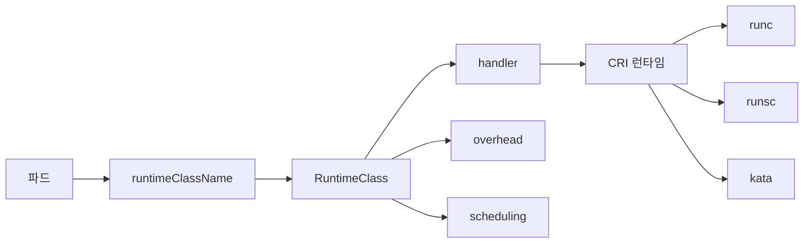

# Runtime Class

RuntimeClass는 **"이 파드를 어떤 컨테이너 런타임으로 돌릴까"**를 파드
스펙에서 선택하게 하는 리소스다. 기본 `runc` 외에도 **gVisor**(runsc),
**Kata Containers**(kata), 커스텀 CRI 핸들러를 선택해 **격리 강도와
성능 사이의 트레이드오프**를 파드 단위로 결정할 수 있다.

운영 관점 핵심 질문은 여섯 가지다.

1. **격리 스펙트럼이 뭐고 어디에 쓰나** — runc → UserNS → gVisor → Kata
2. **RuntimeClass 리소스는 어떻게 생겼나** — handler·overhead·scheduling
3. **오버헤드를 스케줄러가 어떻게 반영하나** — Pod Overhead 가산
4. **노드가 다른 경우 pod를 자동으로 맞게 보내려면** — 스케줄링 필드
5. **멀티테넌트·신뢰 못 할 워크로드에 뭘 고를까** — 워크로드별 매트릭스
6. **User Namespaces가 있는데 gVisor가 여전히 필요한가** — 보완 관계

> 관련: [Pod Security Admission](./pod-security-admission.md)
> · [Security Context](./security-context.md)
> · [Cluster Hardening](./cluster-hardening.md)
> · 컨테이너 런타임 자체(Docker·containerd·CRI-O)는 `container/`

---

## 1. 전체 구조



파드가 `runtimeClassName`을 지정하면 apiserver는 해당 RuntimeClass의
**handler 이름**을 kubelet에 전달하고, kubelet이 CRI(containerd·CRI-O)
에 요청할 때 이 handler로 런타임을 선택한다. **handler는 CRI 쪽 설정
(`/etc/containerd/config.toml` 등)에 이미 등록돼 있어야 한다**. 없으면
파드는 `ContainerCreating` 상태로 멈추고 `FailedCreatePodSandBox` 이벤트
에 `runtime "runsc" binary not installed` 같은 메시지가 반복된다.

> **경계**: 컨테이너 런타임 자체(containerd·CRI-O 구조, OCI 스펙)와
> OS 수준 하드닝(AppArmor·seccomp 기본값·kubelet readOnlyPort·Image GC)
> 은 `container/` 카테고리와
> [Cluster Hardening](./cluster-hardening.md)이 주인공이다. 본 글은
> RuntimeClass 리소스·격리 전략에 집중한다.

---

## 2. RuntimeClass 리소스

```yaml
apiVersion: node.k8s.io/v1
kind: RuntimeClass
metadata:
  name: gvisor
handler: runsc                     # CRI에 등록된 런타임 이름
overhead:
  podFixed:
    cpu: 250m
    memory: 256Mi
scheduling:
  nodeSelector:
    sandbox.example.com/runtime: gvisor
  tolerations:
    - key: sandbox.example.com/runtime
      operator: Equal
      value: gvisor
      effect: NoSchedule
```

### 필드 한눈에

| 필드 | 의미 | 비고 |
|------|------|------|
| `handler` | CRI 런타임 식별자(`runc`·`runsc`·`kata` 등) | valid DNS label. CRI 설정과 일치 |
| `overhead.podFixed` | 파드당 고정 런타임 오버헤드 | 스케줄러·kubelet 리소스 회계에 가산 |
| `scheduling.nodeSelector` | 타깃 노드 라벨 | 파드 nodeSelector와 **교집합**으로 병합 |
| `scheduling.tolerations` | 타깃 taint | 파드 tolerations와 **합집합**으로 병합 |

RuntimeClass는 **클러스터 스코프**다. 이름은 DNS subdomain 규칙을
따른다. 파드는 `spec.runtimeClassName: <name>`으로 참조한다.

### 내장 `RuntimeClass` admission

기본 활성 `RuntimeClass` admission 플러그인은 다음을 강제한다.

- 참조한 RuntimeClass가 **존재하는지** 확인
- `overhead`를 파드 스펙에 **자동 병합**(스케줄러가 이후 단계에서 사용)
- `scheduling.nodeSelector`·`tolerations`를 파드에 **자동 병합**

따라서 파드 작성자는 단순히 `runtimeClassName`만 붙이면 오버헤드와
노드 배치가 자동으로 반영된다.

### VAP로 runtimeClassName 강제

멀티테넌트 환경에서 **신뢰 못 할 네임스페이스는 반드시 gVisor/Kata만
사용**하도록 강제한다. 내장 RuntimeClass admission은 "존재 여부"만
검증하므로, **어떤 RuntimeClass를 써야 하는가**는 정책으로 강제한다.

```yaml
apiVersion: admissionregistration.k8s.io/v1
kind: ValidatingAdmissionPolicy
metadata:
  name: tenant-runtime-required.example.com
spec:
  failurePolicy: Fail
  matchConstraints:
    resourceRules:
      - apiGroups: [""]
        apiVersions: ["v1"]
        operations: ["CREATE", "UPDATE"]
        resources: ["pods"]
  validations:
    - expression: |
        namespaceObject.metadata.labels["tenant-tier"] != "untrusted" ||
        object.spec.runtimeClassName in ["gvisor", "kata"]
      message: "untrusted tenant 네임스페이스는 gvisor 또는 kata 필수"
```

OPA Gatekeeper·Kyverno로도 같은 규칙을 표현할 수 있다. 자세한 선택
기준은 [Admission Controllers](./admission-controllers.md) 참조.

---

## 3. 격리 스펙트럼

쿠버네티스에서 현실적으로 쓰이는 격리 계층은 네 단계다.

| 단계 | 경계 | 대표 구현 | 성능 | 격리 강도 |
|------|------|----------|------|-----------|
| 1. 네임스페이스 격리(runc) | Linux namespace + cgroup | `runc`, `crun` | 최대 | 최소 — 커널 공유 |
| 2. 유저 네임스페이스(UserNS) | UID·GID 매핑 분리 | 모든 런타임 + `hostUsers: false` | 거의 동일 | root 악용 완화 |
| 3. 사용자 공간 커널(sandbox) | syscall 인터셉트 | gVisor(`runsc`) | -10~30% 저하 | 강함 — 커널 표면 감소 |
| 4. 하드웨어 VM 경계 | 하이퍼바이저 | Kata Containers, Firecracker | 중간 저하 | 매우 강함 — 별도 커널 |

### 무엇을 막느냐

- **runc**: 네임스페이스·cgroup만. 커널 버그(`CVE-2022-0185`, dirty
  pipe 등) 한 방이면 호스트로 탈출 가능.
- **UserNS**: "컨테이너 안 root = 호스트 root"를 끊는다. 컨테이너
  `CAP_SYS_ADMIN`을 가져도 **호스트 권한은 제한적**. 커널 표면은 그대로.
- **gVisor**: syscall을 Go로 구현한 **사용자 공간 커널**이 가로채 호스트
  커널을 거의 안 부른다. I/O 많을수록 오버헤드 증가. WASM·AI 툴·신뢰
  못 할 코드 샌드박스.
- **Kata**: 경량 VM이 각 파드를 감싼다. 자체 커널. CPU·메모리 오버헤드
  수백 MB 수준이지만 **호스트 커널 공유하지 않음**.

운영에서는 이들을 **조합**한다. 예: **기본 런타임은 runc + UserNS**,
신뢰 못 할 워크로드만 `runtimeClassName: gvisor`·`kata`로 격리.

### seccomp·AppArmor 동작 차이

각 런타임이 제공하는 "seccomp 지원"은 **의미가 다르다**. 컨테이너
프로파일(`RuntimeDefault`·`Localhost`)을 [Security Context](./security-
context.md)로 건 뒤에도 실제 평가 위치가 바뀐다.

| 런타임 | seccomp 위치 | AppArmor |
|--------|--------------|----------|
| runc | 호스트 커널 syscall 진입점 | 호스트 LSM |
| runc + UserNS | 동일 위치, capability 효과만 축소 | 동일 |
| gVisor(runsc) | Sentry(유저공간) 내부 필터. 호스트 syscall 표면은 Sentry가 이미 축소 | 호스트 LSM은 Sentry 프로세스에 적용 |
| Kata | **게스트 커널 내부**에서 적용. 호스트는 VM 경계로 보호 | 게스트 측 LSM |
| Wasm | syscall 자체가 없음. WASI capability가 대체 | 해당 없음 |

정책을 세울 때 "RuntimeDefault seccomp 적용" 한 줄로는 **격리 강도를
비교할 수 없다**. 어느 커널에서 필터가 도는지를 확인해야 한다.

---

## 4. gVisor (runsc)

구글이 만든 사용자 공간 커널. **Sentinel**이 syscall을 가로채서 Go로
직접 처리하고, 정말 호스트 커널이 필요할 때만 좁은 인터페이스로
내려간다. 결과적으로 호스트 커널 공격 표면이 크게 줄어든다.

### 설정

```toml
# /etc/containerd/config.toml
[plugins."io.containerd.grpc.v1.cri".containerd.runtimes.runsc]
  runtime_type = "io.containerd.runsc.v1"
```

```yaml
apiVersion: node.k8s.io/v1
kind: RuntimeClass
metadata:
  name: gvisor
handler: runsc
overhead:
  podFixed:
    cpu: 250m
    memory: 256Mi
scheduling:
  nodeSelector:
    sandbox.example.com/runtime: gvisor
```

### 언제 쓰나

- **멀티테넌트 SaaS**: 고객 코드·플러그인 실행 환경
- **AI 에이전트·코드 인터프리터**: 신뢰 못 할 코드 실행(LangChain 도구,
  Jupyter 등)
- **CI 러너 격리**: GitHub Actions self-hosted, GitLab runner
- **백그라운드 이미지 스캐너**: 맬웨어 가능성 있는 샘플 실행

### 한계

- I/O 많은 워크로드(DB·로그 수집)는 성능 저하 현저
- 일부 syscall·ioctl·netlink 미지원(프로그램 호환성 이슈)
- 커널 모듈·GPU·실시간 처리 불가

---

## 5. Kata Containers

각 파드를 **경량 VM**으로 감싼다. QEMU·Cloud Hypervisor 등을 하이퍼
바이저로 써서 파드마다 별도 게스트 커널을 띄운다. containerd는
`runtime_type = "io.containerd.kata.v2"`로 **shim**을 지정하고,
RuntimeClass의 `handler`에는 **config.toml에 등록한 런타임 이름**
(`kata`, `kata-qemu`, `kata-fc`, `kata-qemu-tdx` 등)을 쓴다.

```toml
# /etc/containerd/config.toml
[plugins."io.containerd.grpc.v1.cri".containerd.runtimes.kata-qemu]
  runtime_type = "io.containerd.kata.v2"
  [plugins."io.containerd.grpc.v1.cri".containerd.runtimes.kata-qemu.options]
    ConfigPath = "/opt/kata/share/defaults/kata-containers/configuration-qemu.toml"
```

```yaml
apiVersion: node.k8s.io/v1
kind: RuntimeClass
metadata:
  name: kata
handler: kata-qemu                # config.toml에 등록된 이름
overhead:
  podFixed:
    cpu: 100m
    memory: 512Mi
scheduling:
  nodeSelector:
    sandbox.example.com/runtime: kata
```

### 언제 쓰나

- **규제·컴플라이언스**: 금융·의료에서 하드웨어 격리가 요건
- **악성 워크로드 분석**: 맬웨어 연구 플랫폼
- **서로 다른 커널 기능**: 워크로드별 커널 파라미터·모듈 분리
- **호스트 커널 공격 완전 차단**

### 한계

- VM 부팅 지연(수백 ms ~ 수 초)
- 메모리 오버헤드(파드당 128~512Mi)
- hostPath·일부 CSI 드라이버 호환성 이슈
- nested virtualization 필요(베어메탈·`/dev/kvm` 허용 노드)

### Firecracker와의 관계

**Firecracker**는 AWS Lambda·Fargate가 쓰는 마이크로 VM 하이퍼바이저.
Kata Containers의 하이퍼바이저로 쓸 수 있다(`configuration-fc.toml`).
따라서 "Firecracker vs Kata"는 **같은 층의 경쟁이 아니라**, Kata 안에
Firecracker를 **끼워 쓴다**. 쿠버네티스 입장에서는 RuntimeClass 하나로
동일하게 선택한다.

### Confidential Containers (CoCo)

CNCF Sandbox 프로젝트. Kata + **TEE**(Intel TDX·AMD SEV-SNP·IBM SE) +
**Attestation Agent**가 결합돼 **워커 노드조차 신뢰하지 않는** TCB를
만든다. 이미지 pull도 게스트 VM 안에서 수행해 컨테이너 이미지·환경
변수·Secret이 호스트 관리자에게도 평문 노출되지 않는다.

제공되는 RuntimeClass 예: `kata-qemu-tdx`, `kata-qemu-snp`,
`kata-qemu-coco-dev`(TEE 하드웨어 없는 개발용).

언제 쓰나:

- 금융·의료·정부 같은 규제 영역에서 **클라우드 운영자조차 차단**
- 제3자 ML 모델·가중치 보호
- **Bring Your Own Key** 구조에서 고객 데이터 평문 노출 원천 차단

한계: TEE 가용 하드웨어(TDX·SEV-SNP) 필요, Attestation 인프라(Key
Broker Service) 별도 운영, 성능 저하 수 % ~ 20%까지.

---

## 6. WebAssembly 런타임

파드 컨테이너를 **Wasm 모듈**로 실행한다. 전통적 격리 모델(namespace·
VM) 대신 **Wasm 런타임 자체의 capability-based 샌드박스**에 기댄다.
컨테이너 이미지에 Wasm 바이너리를 담고, **containerd-shim-wasm**
(`runwasi` 라이브러리)이 shim으로 연결된다.

### 대표 구현

| 프로젝트 | shim | 위치 |
|----------|------|------|
| **SpinKube** (Fermyon) | `containerd-shim-spin` | CNCF Sandbox, FaaS 중심 |
| **runwasi** | `containerd-shim-wasmtime`·`-wasmedge`·`-wasmer` | Deislabs, 공통 라이브러리 |
| **AKS WASI node pool** | Microsoft 관리형 Preview | Azure |

```yaml
apiVersion: node.k8s.io/v1
kind: RuntimeClass
metadata:
  name: wasmtime
handler: wasmtime                 # containerd에 등록된 이름
overhead:
  podFixed:
    cpu: 10m
    memory: 16Mi
scheduling:
  nodeSelector:
    wasm.example.com/runtime: wasmtime
```

### 장점

- **초경량**: 콜드 스타트 수 ms, 메모리 수 MB
- **엣지·FaaS**: Cloudflare Workers·Fastly Compute@Edge 계열의 쿠버
  네티스 onprem 대체로 부상
- **멀티테넌트 격리**: Wasm 샌드박스는 syscall 없음 → 커널 공격 표면 0

### 한계

- **WASI 성숙도**: 파일시스템·소켓·스레드 표준화 진행 중. 기존 Go·
  Python 앱 그대로 못 올림
- **컨테이너 이미지 호환 제한**: 일반 OCI 이미지 실행 불가, Wasm
  바이너리 전용 이미지 필요
- **디버깅·관측**: 툴체인이 아직 덜 성숙

---

## 7. User Namespaces (`hostUsers: false`)

파드 내부 UID·GID를 **호스트와 다른 범위로 매핑**한다. 컨테이너 안
`uid=0`이 호스트에서는 가령 `uid=100000`이 된다. 컨테이너 탈출이
발생해도 호스트 권한이 없다.

```yaml
apiVersion: v1
kind: Pod
metadata:
  name: untrusted
spec:
  hostUsers: false
  containers:
    - name: app
      image: busybox
      securityContext:
        runAsUser: 1000
        runAsGroup: 3000
        allowPrivilegeEscalation: false
        capabilities: { drop: [ALL] }
```

### 상태와 요구 사항

| 버전 | 상태 |
|------|------|
| 1.25 | alpha |
| 1.30 | beta |
| 1.33 | beta, **기본 활성** |
| 1.34 | beta + 메트릭 추가 |
| 1.36 | GA 목표(slated·미확정) |

- **커널**: 최소 `CONFIG_USER_NS=y`와 해당 파일시스템의 idmap mount
  지원. **Linux 6.3 이상이면 tmpfs 포함 완전한 볼륨 지원**(SA 토큰·
  Secret이 tmpfs 기반). ext4·xfs는 6.x, tmpfs는 6.3+.
- **containerd**: 2.0 이상
- **CRI-O**: 1.25 이상
- **OCI runtime**: runc 1.2+ 또는 crun 1.9+
- 파일시스템: ext4·xfs·btrfs·tmpfs·overlayfs 지원
- 노드 점검: `sysctl user.max_user_namespaces > 0`, 일부 배포판은
  `/proc/sys/kernel/unprivileged_userns_clone=1` 필요

### 무엇이 달라지나

- 컨테이너 `root`의 `CAP_SYS_ADMIN`·`CAP_NET_ADMIN`은 **파드의 user
  namespace 안에서만 유효**. 호스트에는 해당 capability가 없다.
- `CAP_SYS_MODULE` 같은 **커널 모듈 로드류는 원천 불가**.
- volume 마운트·ServiceAccount 토큰(tmpfs)도 idmap으로 자동 매핑되어
  **파일 소유자 혼란 없이** 동작.
- `runAsUser`·`runAsGroup`·`fsGroup`은 **컨테이너 내부 기준**. 기존
  매니페스트 수정 없이 대부분 그대로 동작한다.

### RuntimeClass와의 관계

`hostUsers`는 **어떤 RuntimeClass와도 결합**한다. `runc + UserNS`가
1차 기본선, 더 강한 격리가 필요하면 `gvisor + UserNS`·`kata`로 올린다.

### PSA와의 결합

Pod Security Admission의 **baseline·restricted 모두 `hostUsers: false`
를 허용하고 권장**한다. `hostUsers: false` 사용 시 PSA restricted의
`runAsNonRoot`·`capabilities.drop=ALL`·`allowPrivilegeEscalation=false`
규칙은 그대로 **컨테이너 내부 기준**으로 평가된다. 1.33부터는 feature
gate 없이 사용 가능하므로 신규 클러스터는 별도 설정이 필요없다.

---

## 8. Pod Overhead와 스케줄러

`overhead.podFixed`는 파드의 **추가 리소스 요구량**이다. 스케줄러는
`request + overhead`로 노드 적합성을 판단하고, kubelet은 eviction·
resource 통계에 overhead를 가산한다.

| 런타임 | 권장 overhead(파드 1개) |
|--------|-------------------------|
| runc | 0 |
| gVisor(runsc) | cpu 200~300m, memory 128~512Mi |
| Kata(QEMU) | cpu 50~100m, memory 256~512Mi |
| Kata(Firecracker) | cpu 25~50m, memory 128~256Mi |

실제 수치는 워크로드·커널 버전·하이퍼바이저에 따라 다르다. **노드에서
실측**해 분포의 p95를 기준값으로 잡는다. overhead를 너무 낮게 잡으면
노드 OOM·pod eviction, 너무 높게 잡으면 스케줄러가 노드를 덜 채운다.
`runc` 오버헤드 `0`은 비교 기준점이지 실제 0은 아니다(네임스페이스·
cgroup 생성 비용은 상존).

### 측정 실무

- `kubectl top pod`·`cAdvisor`·`kube-state-metrics`로 동일 워크로드를
  각 RuntimeClass로 돌려 CPU·메모리·디스크 I/O·p95 latency 수집
- 마이크로 벤치마크: `sysbench`(CPU·mem), `fio`(디스크), `iperf3`(네트
  워크)로 런타임별 차이 측정
- gVisor 디버그: `runsc --debug --debug-log=/tmp/runsc.log`, Kata:
  `kata-runtime env`로 설정·버전 확인
- 부트 레이턴시: `time kubectl run --rm -it ...`로 콜드 스타트 시간
  비교. Kata는 VM 부팅 지연이 추가됨

---

## 9. 스케줄링 병합 규칙

RuntimeClass의 `scheduling`은 **admission 단계에서 파드 스펙에 주입**
된다. 사용자가 별도 설정하지 않아도 자동으로 적합한 노드로 간다.

### 병합 규칙

- `nodeSelector`: 두 selector의 **교집합**. 충돌(동일 키, 다른 값)
  시 파드 거절.
- `tolerations`: 두 집합의 **합집합**. 추가 tolerations는 중복 없이
  append.

```yaml
# RuntimeClass의 scheduling
scheduling:
  nodeSelector:
    sandbox.example.com/runtime: gvisor

# 파드 스펙
spec:
  nodeSelector:
    zone: us-east-1a
  runtimeClassName: gvisor

# 병합 결과
# nodeSelector = { sandbox...: gvisor, zone: us-east-1a }
```

### 노드 라벨·taint 자동화

노드 provisioning 시점에 라벨과 taint를 자동으로 붙이는 패턴이
표준이다.

- **Karpenter**: `NodePool`·`NodeClass`에서 `labels`·`taints`로 선언
- **kubeadm**: `kubelet-extra-args`에 `--node-labels`
- **관리형**: 노드 풀 생성 시 `labels`·`taints` 지정

노드가 gVisor 설치가 안 된 상태로 gvisor RuntimeClass를 참조하는 파드
를 받으면 `ContainerCreating`에 걸린다. 반드시 **라벨이 노드 실제 상태
를 반영하도록 검증**한다(DaemonSet 헬스 체크 + 라벨 컨트롤러).

### 롤아웃 전략

1. **카나리 노드 풀** 생성 (예: `runtime-canary=true` 라벨). 별도
   taint로 일반 워크로드 유입 차단.
2. 런타임 바이너리(`runsc`·`kata-runtime`)를 DaemonSet 또는 이미지
   빌드로 배포, 설치 완료 시 라벨(`runtime=runsc-installed`) 부여.
3. 새 RuntimeClass는 `scheduling.nodeSelector`에 위 라벨을 포함해
   **카나리 노드에만** 파드가 가도록.
4. 1~2주 관찰 후 일반 노드 풀로 단계적 확장. 이때 기존 RuntimeClass
   이름과 충돌 없이 **A/B 운영**(`gvisor-v20`·`gvisor-v21`)을 권장.
5. 업그레이드 완료 후 기존 RuntimeClass에 잔여 파드가 없는지
   `kubectl get pods -A -o json | jq '... .spec.runtimeClassName == "gvisor-v20"'`
   로 확인하고 삭제.

---

## 10. 매니지드 K8s에서의 RuntimeClass

관리형 플랫폼은 **RuntimeClass 리소스 노출 여부**가 제각각이다.

| 서비스 | 제공 수단 | 사용자 관점 |
|--------|----------|------------|
| **GKE Sandbox** | gVisor 전용 노드 풀 | `gvisor` RuntimeClass 자동 생성, 파드에 `runtimeClassName: gvisor` |
| **AKS Pod Sandboxing** | Kata 기반 워커 노드 | `kata-mshv-vm-isolation` RuntimeClass(Preview) |
| **AKS WASI node pool** | runwasi 기반 Wasm | Preview, 특정 Wasm shim 선택 |
| **EKS Fargate** | Firecracker 기반 샌드박스 | **사용자 RuntimeClass API 비노출**, 서비스 추상화 내부에만 존재 |
| **EKS 자체 관리·Karpenter** | 사용자가 직접 배포 | 커스텀 AMI + label·taint + RuntimeClass 수동 생성 |
| **OpenShift Sandboxed Containers** | Kata + CoCo | `kata` 또는 `kata-qemu-tdx` RuntimeClass |

**운영 중요 사항**: 매니지드에서 제공되는 RuntimeClass의 `handler`·
`overhead`·`scheduling` 값은 벤더가 자동 관리한다. 임의 수정은 업그레이드
경로를 깰 수 있다.

## 11. 보안 모델 비교와 선택 가이드

| 요구 | 추천 |
|------|------|
| 일반 마이크로서비스 | runc + UserNS + restricted PSA |
| 테넌트 코드 실행(SaaS) | gVisor + UserNS |
| 규제 격리·악성 샘플 분석 | Kata(QEMU 또는 Firecracker) |
| GPU·DPDK·실시간 | runc (gVisor·Kata 호환성 제약) |
| 커널 버그 급증 시기 임시 격리 | gVisor로 임시 라우팅 |
| 서로 다른 커널 기능 요구 | Kata(게스트 커널 커스터마이징) |

### gVisor vs Kata — 왜 둘 다 쓰나

gVisor는 **빠른 스타트업·얇은 격리**, Kata는 **VM 수준 격리**. 실제
플랫폼(예: Google Cloud Run, Northflank 샌드박스)은 **워크로드 특성에
따라 두 개를 모두 제공**하고, RuntimeClass로 선택한다.

### UserNS는 격리인가 완화인가

UserNS는 **격리 교체가 아니라 완화**다. syscall 표면은 그대로이므로
커널 0-day에는 무력하다. 그러나 **컨테이너 탈출이 일어나도 호스트
권한이 없다**는 보호가 크다. 모든 워크로드의 **기본값**으로 깔고,
더 강한 격리를 RuntimeClass로 선택적으로 추가하는 설계가 합리적이다.

---

## 12. 운영 리스크와 장애 패턴

| 증상 | 원인 | 대응 |
|------|------|------|
| Pod `ContainerCreating` 반복, `FailedCreatePodSandBox` 이벤트 | CRI에 handler 미등록 | CRI 설정·재시작, 노드 라벨과 실제 상태 일치 확인 |
| Pod가 노드에 스케줄 안 됨 | RuntimeClass `scheduling`과 파드 제약 충돌 | nodeSelector 교집합 확인 |
| `OOMKilled` 다발 | overhead 과소평가 | 실측 p95로 overhead 재계산 |
| gVisor 워크로드 성능 급락 | I/O heavy 워크로드 부적합 | runc로 되돌리기, 또는 Kata 재평가 |
| Kata Pod 생성 실패 | `/dev/kvm` 없음·nested virt 미지원 | 베어메탈·nested 허용 VM 타입 선택 |
| 일부 앱 동작 이상 | gVisor syscall 미지원 | runsc-debug 로그 확인, 알려진 미지원 syscall 목록과 대조 |
| UserNS 사용 후 볼륨 권한 이상 | 파일시스템 idmap 미지원 | 커널·FS·runtime 버전 재확인 |

---

## 13. 운영 체크리스트

- [ ] 클러스터 **기본선**으로 `hostUsers: false`(UserNS) 적용 계획.
  PSA restricted와 결합.
- [ ] 신뢰 못 할 워크로드용 RuntimeClass **`gvisor`**·**`kata`**
  두 가지를 최소 1개 이상 준비.
- [ ] RuntimeClass `overhead.podFixed`는 **실측 p95** 기준으로 설정.
  운영 중 분기별로 재측정.
- [ ] 노드 라벨·taint가 **실제 설치된 런타임과 일치**하는지 DaemonSet
  + 커스텀 컨트롤러로 지속 검증.
- [ ] RuntimeClass **create·update·delete** 권한은 cluster admin으로
  제한(`rbac.authorization.k8s.io`).
- [ ] CRI(`containerd`·`cri-o`) 설정 변경 시 노드 드레인 후 재시작,
  카나리 노드 먼저 검증.
- [ ] gVisor·Kata 업그레이드는 **카나리 노드 풀**에서 먼저. 주요 CNCF
  프로젝트는 커널 버전 의존성이 크다.
- [ ] GPU·DPDK·실시간 워크로드는 `runc` RuntimeClass로 명시 분리.
- [ ] `runtimeClassName` 지정한 파드가 올바른 노드 풀에만 올라가는지
  `kube-scheduler` 이벤트 모니터링.
- [ ] Pod Security Admission과 결합 — `hostUsers: false`를 restricted
  프로파일 하에서도 허용하는지 정책 확인.

---

## 참고 자료

- Kubernetes 공식 — RuntimeClass:
  https://kubernetes.io/docs/concepts/containers/runtime-class/
- Kubernetes 공식 — User Namespaces:
  https://kubernetes.io/docs/concepts/workloads/pods/user-namespaces/
- Kubernetes 공식 — Use a User Namespace With a Pod:
  https://kubernetes.io/docs/tasks/configure-pod-container/user-namespaces/
- Kubernetes Blog — v1.33 User Namespaces on by default:
  https://kubernetes.io/blog/2025/04/25/userns-enabled-by-default/
- KEP-127 User Namespaces:
  https://github.com/kubernetes/enhancements/blob/master/keps/sig-node/127-user-namespaces/README.md
- gVisor Docs — Kubernetes Quick Start:
  https://gvisor.dev/docs/user_guide/quick_start/kubernetes/
- Kata Containers — Kubernetes Integration:
  https://github.com/kata-containers/kata-containers/blob/main/docs/how-to/how-to-use-k8s-with-containerd-and-kata.md
- Confidential Containers 공식:
  https://confidentialcontainers.org/
- CNCF Blog — Confidential Containers without confidential hardware:
  https://confidentialcontainers.org/blog/2024/12/03/confidential-containers-without-confidential-hardware/
- SpinKube 공식:
  https://www.spinkube.dev/
- runwasi — containerd Wasm shim:
  https://github.com/deislabs/containerd-wasm-shims
- containerd CRI plugin runtime config:
  https://github.com/containerd/containerd/blob/main/docs/cri/config.md
- CNCF Blog — Securing Kubernetes 1.33 Pods:
  https://www.cncf.io/blog/2025/07/16/securing-kubernetes-1-33-pods-the-impact-of-user-namespace-isolation/
- Northflank Blog — Kata vs Firecracker vs gVisor:
  https://northflank.com/blog/kata-containers-vs-firecracker-vs-gvisor
- NSA/CISA Kubernetes Hardening Guide:
  https://media.defense.gov/2022/Aug/29/2003066362/-1/-1/0/CTR_KUBERNETES_HARDENING_GUIDANCE_1.2_20220829.PDF

확인 날짜: 2026-04-24
